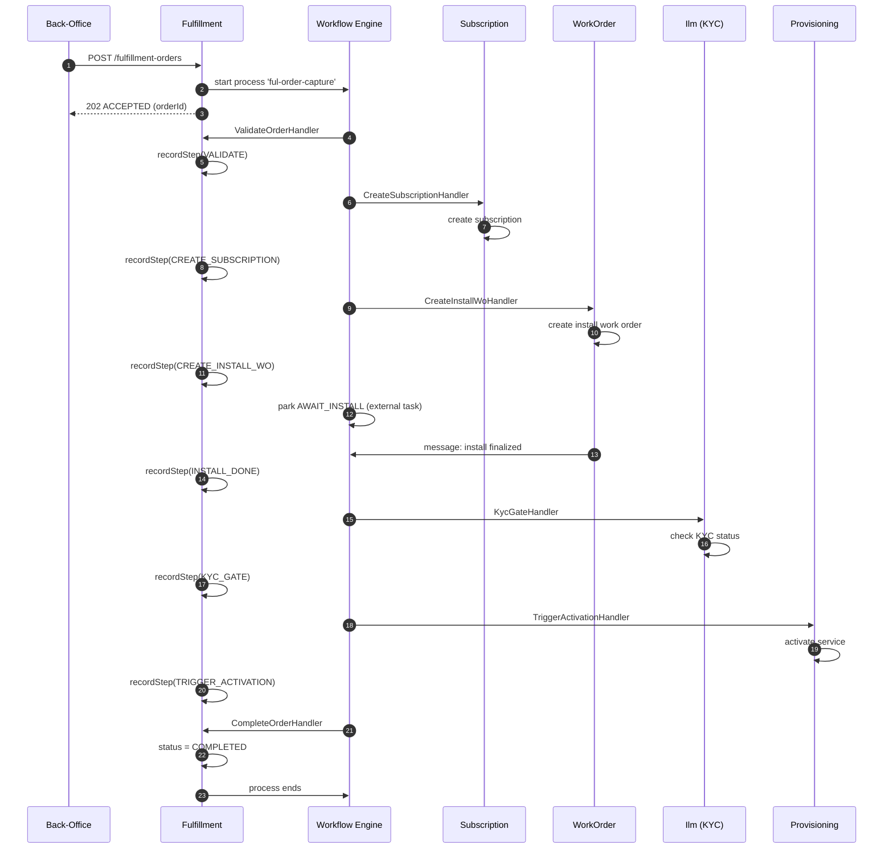

# 📦 Fulfillment Module — Onboarding Guide

> **Module:** `Modules/Fulfillment`  
> **Bundle:** Order Capture & Activation (DD 06 — FUL-02, FUL-03)  
> **What it does:** Handles the **new-customer journey** from order to activation. Captures orders, creates subscriptions and work orders, waits for installation, runs KYC, triggers activation, and handles cancellations. **This is the onboarding orchestrator.**

---

## 1. What This Module Does (In Plain English)

When a customer signs up for fiber internet, the **Fulfillment** module manages their entire onboarding journey:

- **Order Capture:** Records the customer's order (package, homepass, billing mode, payment info)
- **Orchestration:** Coordinates multiple modules through the workflow engine — Subscription, WorkOrder, Ilm (KYC), Provisioning
- **Step Tracking:** Records every milestone in the journey (capture → validate → create subscription → install → KYC → activate → complete)
- **Cancellation:** If the customer cancels before activation, undoes everything (cancels work order, terminates subscription)
- **Deposit Gates:** Orders requiring a deposit park until payment is confirmed

**The Golden Rule:** Fulfillment does not do the actual work itself — it **orchestrates** other modules through the workflow engine. Provisioning activates the network. WorkOrder dispatches technicians. Ilm handles KYC. Fulfillment coordinates them all.

---

## 2. Key Concepts You Must Know

| Term | Meaning |
|------|---------|
| **Fulfillment Order** | The central aggregate. One row per new customer signup. Links to subscription, work order, and workflow process instance. |
| **Order Step** | A milestone in the journey (CAPTURE, CREATE_SUBSCRIPTION, CREATE_INSTALL_WO, AWAIT_INSTALL, KYC_GATE, TRIGGER_ACTIVATION, COMPLETE). Stored in `fulfillment_order_step`. |
| **Journey / Process Definition** | A config-driven flow defining the order of steps. Different operators can have different journeys (e.g., skip KYC, add deposit gate). |
| **Compensation** | When an order is cancelled, the module undoes side effects in reverse order: cancel work order → terminate subscription. This is the **Saga pattern**. |
| **External Task** | A workflow pattern where the engine parks a process instance until a worker completes the task. The install work order is an external task. |
| **Message Correlation** | A workflow pattern where the process waits for a message (e.g., "install finalized") before continuing. |
| **Deposit Gate** | An order requiring a deposit parks in `AWAITING_PAYMENT` until the payment is confirmed. |

---

## 3. Architecture Diagrams

### ASCII: Module Placement in the System

```
┌─────────────────────────────────────────────────────────────────────┐
│                        EXTERNAL CALLERS                              │
│  ┌──────────────┐  ┌──────────────┐  ┌──────────────┐              │
│  │ Sales Portal │  │ Call Center  │  │ External API │              │
│  │   (Web)      │  │   (Desk)     │  │   Clients    │              │
│  └──────┬───────┘  └──────┬───────┘  └──────┬───────┘              │
└─────────┼──────────────────┼──────────────────┼──────────────────────┘
          │                  │                  │
          ▼                  ▼                  ▼
┌─────────────────────────────────────────────────────────────────────┐
│  ┌──────────────────────────────────────────────────────────────┐   │
│  │                  📦 FULFILLMENT MODULE                        │   │
│  │                                                              │   │
│  │  Routes (api.php) ──▶ Controllers ──▶ Services ──▶ Models     │   │
│  │                                      │                        │   │
│  │                                      ▼                        │   │
│  │                              Events ──▶ EventBus              │   │
│  │                                                              │   │
│  │  ┌──────────────┐  ┌──────────────┐  ┌──────────────┐        │   │
│  │  │ OrderCapture │  │   Order      │  │  Completion  │        │   │
│  │  │   Service    │  │   Step       │  │  / Cancel    │        │   │
│  │  │              │  │   Service    │  │   Service    │        │   │
│  │  └──────────────┘  └──────────────┘  └──────────────┘        │   │
│  └──────────────────────────────────────────────────────────────┘   │
└─────────────────────────────────────────────────────────────────────┘
          │
          │ coordinates (creates, reads, triggers)
          ▼
┌─────────────────────────────────────────────────────────────────────┐
│                        OTHER MODULES (Coordinated)                    │
│  ┌──────────┐  ┌──────────┐  ┌──────────┐  ┌──────────┐            │
│  │  📘      │  │  📋      │  │  👤      │  │  🔌      │            │
│  │Subscription│  │ WorkOrder│  │   Ilm    │  │Provisioning│          │
│  │          │  │          │  │  (KYC)   │  │          │            │
│  │ "Create  │  │ "Create  │  │ "Check  │  │ "Activate│            │
│  │  contract│  │  install │  │  KYC"  │  │  service"│            │
│  │  "       │  │  order"  │  │          │  │          │            │
│  └──────────┘  └──────────┘  └──────────┘  └──────────┘            │
└─────────────────────────────────────────────────────────────────────┘
```

### Mermaid: Order Journey Flow



---

## 4. Code Tour — Key Files and What They Do

```
Modules/Fulfillment/
├── routes/
│   └── api.php                              # All fulfillment endpoints
│
├── app/
│   ├── Http/
│   │   ├── Controllers/
│   │   │   └── FulfillmentOrderController.php  # Order CRUD + complete + cancel
│   │   └── Requests/                           # FormRequest validation classes
│   │
│   ├── Models/
│   │   ├── FulfillmentOrder.php              # The order aggregate — status, steps, links
│   │   └── FulfillmentOrderStep.php          # Each milestone in the journey
│   │
│   ├── Services/
│   │   ├── OrderCaptureService.php           # Captures orders, starts journeys, handles completion/cancellation
│   │   └── OrderStepService.php              # Records step milestones
│   │
│   ├── Events/
│   │   └── FulfillmentEvents.php             # All event constants
│   │
│   ├── Listeners/
│   │   ├── ResumeOrderOnKycApproved.php      # When KYC approved → resume workflow
│   │   └── ResumeOrderOnInstallFinalized.php   # When install done → resume workflow
│   │
│   └── Workflow/                               # Task handlers (the "toolbox" steps)
│       ├── ValidateOrderHandler.php            # Validates order data before proceeding
│       ├── CreateSubscriptionHandler.php       # Creates subscription via SubscriptionService
│       ├── CreateInstallWoHandler.php          # Creates install work order
│       ├── DepositGateHandler.php              # Parks order if deposit required
│       ├── KycGateHandler.php                  # Checks if customer KYC is approved
│       ├── TriggerActivationHandler.php        # Triggers subscription activation workflow
│       └── CompleteOrderHandler.php            # Marks order as COMPLETED
│
├── database/
│   ├── migrations/
│   │   └── 2026_06_01_100000_create_fulfillment_order_tables.php
│   └── seeders/                                 # (if any)
│
├── tests/
│   ├── Feature/                                 # API tests
│   └── Unit/                                    # Service tests
│
└── module.json                                  # Module metadata
```

---

## 5. Services, Models, Events, Rules, and Workflows — The Full Map

### Services (Business Logic)

| Service | What It Does | Called By |
|---------|-------------|-----------|
| `OrderCaptureService` | Captures orders, starts journey workflows, handles completion/cancellation, manages compensation | Controllers, Listeners |
| `OrderStepService` | Records every milestone in the order journey as a step row | Workflow handlers, OrderCaptureService |

### Models (Data)

| Model | Table | What It Stores | Owned By |
|-------|-------|---------------|----------|
| `FulfillmentOrder` | `fulfillment_orders` | The order aggregate — status, customer, subscription_id, work_order_id | Fulfillment |
| `FulfillmentOrderStep` | `fulfillment_order_steps` | Each milestone (CAPTURE, CREATE_SUBSCRIPTION, etc.) with result | Fulfillment |

### Events (What This Module Publishes)

| Event | When It Happens | Who Consumes It | What They Do |
|-------|-----------------|-----------------|--------------|
| `OrderCaptured` | New order captured | Billing, Reporting, CRM | Billing: prepare billing account. Reporting: log sales lead. CRM: welcome email. |
| `OrderStepCompleted` | Each step finishes | Reporting, CRM | Reporting: track order progress. CRM: update customer. |
| `OrderCompleted` | Entire journey succeeds | Billing, CRM, Reporting | Billing: start billing cycle. CRM: send welcome package. Reporting: log conversion. |
| `OrderCancelled` | Order cancelled before completion | Billing, Subscription, WorkOrder | Billing: cancel billing account. Subscription: terminate. WorkOrder: cancel install. |
| `OrderDepositReceived` | Deposit payment confirmed | Workflow | Resume workflow from deposit gate |
| `OrderInstallFinalized` | Install work order completed | Workflow | Resume workflow from install gate |
| `OrderKycApproved` | Customer KYC approved | Workflow | Resume workflow from KYC gate |

### Events This Module Listens To

| Event | Listener | What It Does |
|-------|----------|--------------|
| `KycApproved` (from Ilm) | `ResumeOrderOnKycApproved` | Resumes workflow from KYC gate |
| `WorkOrderCompleted` (from WorkOrder) | `ResumeOrderOnInstallFinalized` | Resumes workflow from install gate |
| `PaymentConfirmed` (from Billing) | `ResumeOrderOnDepositReceived` | Resumes workflow from deposit gate |

### Rules (Business Policy Validation)

| Rule | When It Runs | What It Checks |
|------|-------------|----------------|
| `CanCaptureOrder` | Before order capture | Is customer valid? Is homepass sellable? Is package active? |
| `CanCompleteOrder` | Before completion | Is order in AWAITING_ACTIVATION? Is subscription ready? |
| `CanCancelOrder` | Before cancellation | Is order not already COMPLETED? Is cancellation within window? |
| `IsDepositRequired` | During order capture | Does this package require a deposit? Has customer paid it? |
| `IsKycRequired` | During order capture | Does this operator require KYC before activation? |

### Workflow Handlers (Process Steps)

| Handler | Step | What It Does |
|---------|------|-------------|
| `ValidateOrderHandler` | VALIDATE | Checks customer, homepass, package, billing mode are all valid |
| `CreateSubscriptionHandler` | CREATE_SUBSCRIPTION | Calls `SubscriptionService::create()` to create the contract |
| `CreateInstallWoHandler` | CREATE_INSTALL_WO | Calls `WorkOrderService::create()` to dispatch technician |
| `DepositGateHandler` | DEPOSIT_GATE | If deposit required and not paid, parks workflow |
| `KycGateHandler` | KYC_GATE | If KYC not approved, parks workflow |
| `TriggerActivationHandler` | TRIGGER_ACTIVATION | Calls `SubscriptionService::activate()` to start activation workflow |
| `CompleteOrderHandler` | COMPLETE | Marks order as COMPLETED, emits OrderCompleted event |
| `CompensateOrderHandler` | CANCEL | Reverse: cancel work order → terminate subscription |

---

## 6. API Surface — What You Can Call

All endpoints require `auth:sanctum`. The `X-Operator-Code` header scopes all queries.

### Order Management

| Method | Endpoint | Permission | What It Does |
|--------|----------|------------|--------------|
| `GET` | `/api/fulfillment-orders` | `fulfillment.read` | List orders (paginated, filter by status, accountId) |
| `POST` | `/api/fulfillment-orders` | `fulfillment.manage` | Capture a new order, starts the journey workflow |
| `GET` | `/api/fulfillment-orders/{id}` | `fulfillment.read` | Get one order with its steps |
| `POST` | `/api/fulfillment-orders/{id}/complete` | `fulfillment.manage` | Desk confirmation that install is done |
| `POST` | `/api/fulfillment-orders/{id}/cancel` | `fulfillment.manage` | Cancel order (compensates side effects) |

### Request Body for `POST /fulfillment-orders`

```json
{
  "customer_id": "cus_abc123",
  "account_id": "acc_def456",
  "homepass_id": "hp_ghi789",
  "package_ref": "pkg_basic_100",
  "package_version_id": "ver_jkl012",
  "billing_mode": "POSTPAID",
  "payment_ref": "pay_mno345",
  "deposit_required": false
}
```

### Response Pattern

- `POST /fulfillment-orders` returns `201 CREATED` with `AWAIT_INSTALL` next action
- `POST /fulfillment-orders/{id}/complete` returns `200 OK` with updated order
- `POST /fulfillment-orders/{id}/cancel` returns `200 OK` with cancelled order

---

## 7. Scheduled Commands / Batch Jobs / Cron Jobs

The Fulfillment module runs these scheduled jobs:

| Job | Schedule | What It Does | Why |
|-----|----------|-------------|-----|
| `fulfillment:clean-stale-orders` | Daily at 02:00 | Finds orders stuck in `AWAITING_INSTALL` for > 7 days without work order activity | Alerts operations to stalled installs |
| `fulfillment:remind-pending-orders` | Daily at 09:00 | Sends reminder to customers with orders in `AWAITING_PAYMENT` (deposit) | Reduces deposit payment delays |
| `fulfillment:escalate-long-orders` | Daily at 10:00 | Escalates orders in `AWAITING_INSTALL` for > 14 days to operations manager | Ensures no customer is forgotten |
| `fulfillment:archive-completed-orders` | Weekly | Archives order details > 1 year old to reporting tables | Keeps fulfillment_orders table performant |
| `fulfillment:sync-order-status` | Hourly | Reconciles order status with linked subscription and work order status | Fixes status drift |

**How to check what's scheduled:**
```bash
php artisan schedule:list
```

**How to run a job manually:**
```bash
php artisan fulfillment:clean-stale-orders --dry-run
```

---

## 8. Common Patterns

### Pattern 1: Journey as Configuration, Not Code

The order capture journey is defined in a `process_definition` row (key = `ful-order-capture`), not in PHP code. Different operators can have different journeys without code changes.

```php
// OrderCaptureService::capture() starts the journey
$instance = $this->engine->start(
    processKey: 'ful-order-capture',   // <<< from DATA, not code
    businessKey: $order->order_id,
    variables: ['orderId' => $order->order_id, ...],
    operator: $order->operator_code,
);
```

**Why this matters:** Operator A might require KYC + deposit + install. Operator B might skip KYC and install (self-install). Both use the same PHP code but different process definitions in the database.

### Pattern 2: Compensation on Cancellation (Saga Pattern)

If a customer cancels, the module undoes everything in reverse order:

```php
private function compensate(FulfillmentOrder $order, ?string $reason): void
{
    // 1. Cancel the work order (if still pending)
    if ($order->work_order_id) {
        app(WorkOrderService::class)->cancel($order->work_order_id, $reason);
    }

    // 2. Terminate the subscription (if not already terminated)
    if ($order->subscription_id) {
        $sub = Subscription::query()->find($order->subscription_id);
        app(SubscriptionService::class)->transitionStatus($sub, Subscription::TERMINATED, ['reason' => $reason]);
    }

    // 3. Refund deposit (if any)
    if ($order->deposit_paid) {
        app(BillingService::class)->refundDeposit($order->account_id, $order->deposit_amount);
    }
}
```

**Why this matters:** This is the **Saga pattern** — if a long-running transaction fails, we compensate (undo) the steps that already completed. This ensures the system stays consistent even when things go wrong.

### Pattern 3: Step Ledger (Complete Audit Trail)

Every milestone is recorded as a row in `fulfillment_order_step`:

```php
public function recordStep(
    FulfillmentOrder $order,
    string $step,
    array $result = [],
    string $status = 'DONE'
): void {
    $order->steps()->create([
        'step' => $step,
        'status' => $status,
        'result' => $result ?: null,
        'completed_at' => now(),
    ]);
}
```

**Why this matters:** You can see exactly what happened, when, and with what result. If a customer calls and asks "why isn't my internet working?", support can check the step ledger and see: "Install was completed on Monday, KYC was approved on Tuesday, but activation is still pending."

### Pattern 4: Message Correlation (Resuming Workflows)

The workflow parks on a message catch event. External events correlate the message to resume the flow:

```php
// From ResumeOrderOnInstallFinalized listener:
public function handle(WorkOrderCompleted $event): void
{
    $order = FulfillmentOrder::query()
        ->where('work_order_id', $event->workOrderId)
        ->first();

    if ($order && $order->status === 'AWAITING_INSTALL') {
        // Resume the workflow from the install gate
        $this->engine->correlateMessage(
            messageName: 'ful-install-finalized',
            businessKey: $order->order_id,
            variables: ['installConfirmed' => true]
        );
    }
}
```

**Why this matters:** The workflow doesn't poll. It sleeps efficiently until the right event arrives. This is how a 2-day installation process doesn't consume resources while waiting.

### Pattern 5: Deposit Gate (Parking Orders)

Orders requiring a deposit park in `AWAITING_PAYMENT`:

```php
// DepositGateHandler checks variables
if ($context->variable('depositRequired') && !$context->variable('depositPaid')) {
    return TaskResult::park('AWAITING_PAYMENT'); // workflow pauses here
}

// When payment is confirmed, ResumeOrderOnDepositReceived correlates:
$this->engine->correlateMessage(
    messageName: 'ful-deposit-received',
    businessKey: $order->order_id,
    variables: ['depositPaid' => true]
);
```

**Why this matters:** Some packages require a deposit (e.g., equipment deposit). The order can't proceed until the customer pays. The workflow parks efficiently and resumes when the payment event arrives.

---

## 9. Dependencies — What This Module Needs

| Module | What It Uses | How It Uses It | File Paths |
|--------|-------------|----------------|------------|
| **Workflow** | Starts process instances, correlates messages | `OrderCaptureService.php` starts journeys; listeners correlate messages | `OrderCaptureService.php`, `Listeners/*.php` |
| **Subscription** | Creates subscription, triggers activation | `CreateSubscriptionHandler.php` calls `SubscriptionService::create()`; `TriggerActivationHandler.php` calls `SubscriptionService::activate()` | `Workflow/CreateSubscriptionHandler.php`, `Workflow/TriggerActivationHandler.php` |
| **WorkOrder** | Creates install work orders | `CreateInstallWoHandler.php` calls `WorkOrderService::create()` | `Workflow/CreateInstallWoHandler.php` |
| **Ilm** | Checks KYC status, reads customer data | `KycGateHandler.php` reads KYC status; `ValidateOrderHandler.php` reads customer data | `Workflow/KycGateHandler.php`, `Workflow/ValidateOrderHandler.php` |
| **Provisioning** | Triggered via subscription activation | `TriggerActivationHandler.php` triggers activation which calls Provisioning | `Workflow/TriggerActivationHandler.php` |
| **Billing** | Handles deposit payments, refunds | `DepositGateHandler.php` checks deposit; `OrderCaptureService::compensate()` refunds | `Workflow/DepositGateHandler.php`, `OrderCaptureService.php` |
| **Catalog** | Validates package, homepass | `ValidateOrderHandler.php` reads package and homepass data | `Workflow/ValidateOrderHandler.php` |
| **Rules** | Business policy validation | `CanCaptureOrder`, `IsDepositRequired` rules | `Workflow/ValidateOrderHandler.php` |

### What Depends on This Module

| Module | Why It Needs Fulfillment |
|--------|-------------------------|
| **Billing** | Listens to `OrderCompleted` to start billing cycles; listens to `OrderCancelled` to close billing accounts |
| **Reporting** | Aggregates order data for sales dashboards (conversion rate, time-to-activate) |
| **CRM** | Listens to order events to send welcome emails, track customer journey |
| **Notification** | Sends SMS/email notifications at each order step |

---

## 10. New Dev Checklist

### Must-Read Files (In Order)

- [ ] `Modules/Fulfillment/app/Models/FulfillmentOrder.php` — Understand status constants and relationships
- [ ] `Modules/Fulfillment/app/Services/OrderCaptureService.php` — The core service: capture, complete, cancel, compensate
- [ ] `Modules/Fulfillment/app/Workflow/ValidateOrderHandler.php` — Simplest task handler
- [ ] `Modules/Fulfillment/app/Workflow/CreateSubscriptionHandler.php` — How it calls another module
- [ ] `Modules/Fulfillment/app/Workflow/TriggerActivationHandler.php` — How it triggers subscription activation
- [ ] `Modules/Fulfillment/app/Events/FulfillmentEvents.php` — All event types
- [ ] `Modules/Fulfillment/routes/api.php` — All endpoints in one place

### Must-Run Commands

```bash
# Run fulfillment tests
php artisan test --filter=Fulfillment

# See what orders exist
php artisan tinker --execute="dd(FulfillmentOrder::query()->with('steps')->limit(5)->get());"

# Check scheduled jobs
php artisan schedule:list

# Run stale order cleanup manually
php artisan fulfillment:clean-stale-orders --dry-run

# Check workflow instances for an order
php artisan tinker --execute="
    $order = FulfillmentOrder::query()->first();
    dd(DB::table('process_instances')->where('business_key', $order->order_id)->get());
"
```

### How to Add a New Journey Step

1. Create a new `TaskHandler` in `Modules/Fulfillment/app/Workflow/`
2. Register it in `FulfillmentWorkflowProvider.php`
3. Update the `ful-order-capture` process definition in the database (or via Workflow Studio) to include the new step
4. Add a step name constant to `FulfillmentEvents.php` if you want to emit a custom event
5. Update `OrderStepService` to record the new step
6. Write tests!

### How to Handle a Stuck Order

```bash
# Find orders stuck for > 7 days
SELECT * FROM fulfillment_orders
WHERE status IN ('AWAITING_INSTALL', 'AWAITING_PAYMENT', 'AWAITING_KYC')
  AND created_at < NOW() - INTERVAL '7 days';

# Check the steps for a specific order
SELECT * FROM fulfillment_order_steps
WHERE order_id = 'ford_xxx'
ORDER BY completed_at;

# Check if the work order is done
SELECT * FROM work_orders WHERE id = (SELECT work_order_id FROM fulfillment_orders WHERE id = 'ford_xxx');

# Check if KYC is approved
SELECT kyc_status FROM customer WHERE customer_id = (SELECT customer_id FROM fulfillment_orders WHERE id = 'ford_xxx');
```

### Debugging Guide

**"Order is stuck in AWAITING_INSTALL!"**
```bash
# Check the work order status
SELECT status FROM work_orders WHERE id = (SELECT work_order_id FROM fulfillment_orders WHERE id = 'ford_xxx');

# Check if the install finalized message was sent
SELECT * FROM event_outbox WHERE aggregate_id = 'wo_xxx' AND type LIKE '%INSTALL%';

# Check the workflow instance
SELECT * FROM process_instances WHERE business_key = 'ford_xxx';

# Check external tasks (if using Camunda-style external tasks)
SELECT * FROM external_tasks WHERE instance_id = (SELECT id FROM process_instances WHERE business_key = 'ford_xxx');
```

**"Order is stuck in AWAITING_PAYMENT!"**
```bash
# Check if deposit was paid
SELECT deposit_paid, deposit_amount FROM fulfillment_orders WHERE id = 'ford_xxx';

# Check payment records
SELECT * FROM payments WHERE reference = 'ford_xxx';

# Check if the payment confirmation event was sent
SELECT * FROM event_outbox WHERE aggregate_id = 'ford_xxx' AND type LIKE '%DEPOSIT%';
```

**"Order is stuck in AWAITING_KYC!"**
```bash
# Check customer KYC status
SELECT kyc_status FROM customer WHERE customer_id = (SELECT customer_id FROM fulfillment_orders WHERE id = 'ford_xxx');

# Check KYC documents
SELECT * FROM customer_kyc_documents WHERE customer_id = 'cus_xxx';

# Check KYC approvals
SELECT * FROM kyc_approvals WHERE customer_id = 'cus_xxx' ORDER BY created_at DESC;
```

---

## 11. Quick FAQ

**Q: What's the difference between Fulfillment and Subscription?**  
A: Fulfillment is the **onboarding orchestrator** — it coordinates the journey from signup to activation. Subscription is the **contract owner** — it stores the customer's active plan and handles lifecycle changes (pause, upgrade, terminate). Fulfillment creates the subscription; Subscription manages it.

**Q: Can an order be cancelled after activation?**  
A: No. Once an order reaches `COMPLETED`, it cannot be cancelled through Fulfillment. The customer would need to go through the **Subscription** module's termination workflow instead. Fulfillment only handles cancellations before activation.

**Q: What happens if the technician can't install?**  
A: The work order is marked as failed. The `ResumeOrderOnInstallFinalized` listener checks the work order status. If failed, it correlates a failure message to the workflow. The workflow can then retry (create a new work order) or cancel the order (compensate).

**Q: Why is the order status different from the subscription status?**  
A: The order status tracks the **onboarding journey** (CAPTURED → AWAITING_INSTALL → COMPLETED). The subscription status tracks the **contract lifecycle** (CREATED → ACTIVE → PAUSED → TERMINATED). The order is complete when the subscription is active, but they track different things.

**Q: What is the compensation pattern?**  
A: If a customer cancels, we undo everything in reverse order: cancel work order → terminate subscription → refund deposit. This is the **Saga pattern** — it ensures consistency even when a long-running transaction fails partway through.

**Q: Can I add a new step to the journey without deploying code?**  
A: Yes! The journey is defined by the `process_definition` in the database. You can add a new step by creating a new `TaskHandler` (which does require code), or by rearranging existing steps in the process definition (which only requires updating the database). The handlers are the "tools"; the process definition is the "recipe."

**Q: What's the difference between a message catch and an external task?**  
A: An **external task** is a workflow step that a worker (e.g., a technician app) polls and completes. A **message catch** is a workflow step that waits for an event (e.g., "install finalized") to arrive. External tasks are pull-based; message catches are push-based.

**Q: How does the deposit gate work?**  
A: If the package requires a deposit, the `DepositGateHandler` checks if the deposit is paid. If not, it returns `TaskResult::park('AWAITING_PAYMENT')`. The workflow sleeps. When the payment is confirmed, the `ResumeOrderOnDepositReceived` listener correlates a message to resume the workflow.

**Q: What happens if KYC is rejected?**  
A: The `KycGateHandler` checks the KYC status. If rejected, it correlates a failure message. The workflow can then either: (1) park the order until KYC is resubmitted, or (2) cancel the order and compensate. The behavior is defined in the process definition.

**Q: How do I debug a stuck order?**  
A: Check the order steps (`fulfillment_order_steps`), the workflow instance (`process_instances`), the linked subscription (`subscriptions`), and the linked work order (`work_orders`). The most common causes are: work order not completed, KYC not approved, or deposit not paid.

---

> **Next:** Read the [Ilm Module Guide](./Ilm.md) — where customer identity and KYC live.
