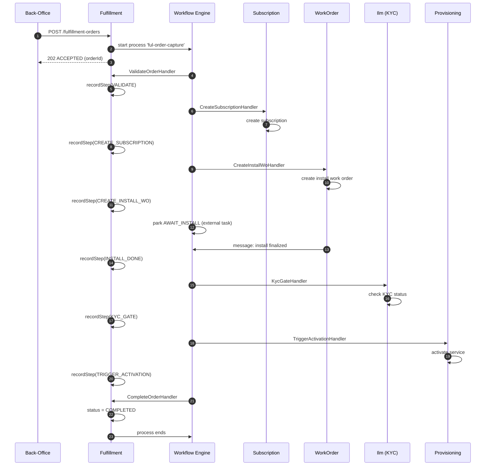

# 📦 Fulfillment Module

> **Module path:** `Modules/Fulfillment/`  
> **Design doc:** `DD_FUL-02` (order capture), `DD_FUL-03` (activation completion)

---

## 1. Module Overview

The Fulfillment module handles the **new-customer journey** from order to activation. When a customer signs up, this module captures their order, creates the subscription and work order, waits for installation to finish, runs the KYC gate, and finally triggers activation. It is the **orchestrator** of onboarding — it does not do the actual work itself (provisioning, installation, KYC decisions live in other modules), but it coordinates them through the workflow engine.

Think of it as the **onboarding project manager**: it knows the checklist, tracks each step, and makes sure nothing is forgotten.

---

## 2. What This Module Does

- **Captures orders** — Records a new customer's order with package, home pass, billing mode, and payment info
- **Orchestrates the onboarding journey** — Validates the order, creates the subscription, dispatches an install work order, waits for install completion, runs KYC, triggers activation, and marks the order complete
- **Manages order status** — Tracks each step of the journey (CAPTURED → AWAITING_INSTALL → AWAITING_KYC → ACTIVATING → COMPLETED)
- **Handles cancellations** — If the customer cancels before activation, it undoes everything (cancels work order, terminates subscription)
- **Manages deposit gates** — Orders requiring a deposit park in AWAITING_PAYMENT until payment is confirmed

---

## 3. Key Concepts

| Term | Meaning |
|------|---------|
| **Fulfillment Order** | The central aggregate. One row per new customer signup. It links to a subscription, a work order, and a workflow process instance. |
| **Order Step** | A record of each milestone in the journey (CAPTURE, CREATE_SUBSCRIPTION, CREATE_INSTALL_WO, AWAIT_INSTALL, KYC_GATE, TRIGGER_ACTIVATION, COMPLETE). Stored in `fulfillment_order_step`. |
| **Journey / Process Definition** | The config-driven flow that defines the order of steps. Different operators can have different journeys (e.g., skip KYC, add a deposit gate). |
| **Compensation** | When an order is cancelled, the module undoes side effects in reverse order: cancel the work order, terminate the subscription. |
| **External Task** | A workflow pattern where the engine parks a process instance until a worker (or external system) completes the task. The install work order is an external task. |
| **Message Catch** | A workflow pattern where the process waits for a message (e.g., "install finalized") before continuing. |

---

## 4. Architecture Diagram

### Module Placement

```mermaid
flowchart TB
    subgraph Channels
        SalesPortal[Sales Portal]
        CallCenter[Call Center]
        API[External API]
    end

    subgraph SOPHIX
        direction TB
        FUL[Fulfillment Module]
        WF[Workflow Engine]
        SUB[Subscription]
        WO[WorkOrder]
        ILM[Ilm / KYC]
        BIL[Billing / Deposit]
        PROV[Provisioning]
        EVT[Event Bus]
    end

    SalesPortal -->|POST /fulfillment-orders| FUL
    CallCenter -->|POST /fulfillment-orders/{id}/complete| FUL

    FUL -->|creates| SUB
    FUL -->|creates| WO
    FUL -->|checks| ILM
    FUL -->|starts| WF
    WF -->|calls TaskHandlers| FUL
    WF -->|signals| WO
    ILM -->|KYC approved| WF
    WO -->|install done| WF
    PROV -->|service active| WF
    FUL -->|emits events| EVT
    EVT -->|listens| BIL
```

### Order Journey Flow



---

## 5. Code Tour

### Key Files and What They Do

```
Modules/Fulfillment/
├── routes/api.php                          # API routes
├── app/
│   ├── Models/
│   │   ├── FulfillmentOrder.php           # The order aggregate — status, steps, links
│   │   └── FulfillmentOrderStep.php       # Each step in the order journey
│   ├── Services/
│   │   └── OrderCaptureService.php        # Captures orders, starts journeys, handles completion/cancellation
│   ├── Http/Controllers/
│   │   └── FulfillmentOrderController.php # REST API for orders (list, create, show, complete, cancel)
│   ├── Events/
│   │   └── FulfillmentEvents.php          # Canonical event types (ORDER_CAPTURED, ORDER_COMPLETED, etc.)
│   ├── Listeners/
│   │   ├── ResumeOrderOnKycApproved.php   # When KYC is approved, resumes the order workflow
│   │   └── ResumeOrderOnInstallFinalized.php # When install is done, resumes the order workflow
│   ├── Workflow/                            # Task handlers (the "toolbox" steps)
│   │   ├── ValidateOrderHandler.php         # Validates order data before proceeding
│   │   ├── CreateSubscriptionHandler.php    # Creates the subscription via SubscriptionService
│   │   ├── CreateInstallWoHandler.php       # Creates the install work order
│   │   ├── DepositGateHandler.php           # Parks order if deposit is required and not paid
│   │   ├── KycGateHandler.php               # Checks if customer KYC is approved
│   │   ├── TriggerActivationHandler.php     # Triggers the subscription activation workflow
│   │   └── CompleteOrderHandler.php         # Marks the order as COMPLETED
│   └── Providers/
│       ├── FulfillmentServiceProvider.php   # Standard Laravel module provider
│       ├── FulfillmentWorkflowProvider.php  # Registers task handlers + listeners
│       └── EventServiceProvider.php         # (empty — event discovery is automatic)
```

---

## 6. API Surface

All endpoints are under `/api/` and require `auth:sanctum`.

### Order Management

| Method | Endpoint | Permission | What It Does |
|--------|----------|------------|--------------|
| `GET` | `/fulfillment-orders` | `fulfillment.read` | List orders (paginated, filter by `status`, `accountId`) |
| `POST` | `/fulfillment-orders` | `fulfillment.manage` | Capture a new order, starts the journey workflow |
| `GET` | `/fulfillment-orders/{fulfillmentOrder}` | `fulfillment.read` | Get one order with its steps |
| `POST` | `/fulfillment-orders/{fulfillmentOrder}/complete` | `fulfillment.manage` | Desk confirmation that install is done |
| `POST` | `/fulfillment-orders/{fulfillmentOrder}/cancel` | `fulfillment.manage` | Cancel the order (compensates side effects) |

### Request Body for `POST /fulfillment-orders`

```json
{
  "customer_id": "cus_abc123",
  "account_id": "acc_def456",
  "homepass_id": "hp_ghi789",
  "package_ref": "pkg_basic_100",
  "package_version_id": "ver_jkl012",
  "billing_mode": "POSTPAID",
  "payment_ref": "pay_mno345",
  "deposit_required": false
}
```

### Response Pattern

- `POST /fulfillment-orders` returns `201 CREATED` with `AWAIT_INSTALL` next action
- `POST /fulfillment-orders/{id}/complete` returns `200 OK` with the updated order
- `POST /fulfillment-orders/{id}/cancel` returns `200 OK` with the cancelled order

---

## 7. Events

### Events This Module Emits

Published to topic: **`fulfillment.order`**

| Event Type | When It Happens | Key Payload Fields |
|------------|-----------------|-------------------|
| `OrderCaptured` | New order is captured | `orderId`, `accountId`, `customerId` |
| `OrderStepCompleted` | Each step in the journey finishes | `orderId`, `step`, `stepStatus` |
| `OrderCompleted` | Entire journey finishes successfully | `orderId`, `accountId`, `subscriptionId` |
| `OrderCancelled` | Order is cancelled before completion | `orderId`, `accountId`, `reason` |

### Events This Module Listens To

| Event | Listener | What It Does |
|-------|----------|--------------|
| `OutboxEventPublished` (KYC approved) | `ResumeOrderOnKycApproved` | Correlates `ful-kyc-approved` message to resume the workflow |
| `OutboxEventPublished` (install finalized) | `ResumeOrderOnInstallFinalized` | Correlates `ful-install-finalized` message to resume the workflow |

---

## 8. Dependencies

### What This Module Needs

| Module | How It Uses It | File Paths |
|--------|----------------|------------|
| **Workflow** | Starts process instances, correlates messages | `OrderCaptureService.php`, all handlers |
| **Subscription** | Creates the subscription, transitions status | `CreateSubscriptionHandler.php`, `TriggerActivationHandler.php` |
| **WorkOrder** | Creates install work orders | `CreateInstallWoHandler.php` |
| **Ilm** | Checks KYC status, reads customer accounts | `KycGateHandler.php`, `TriggerActivationHandler.php` |
| **Provisioning** | Triggered via subscription activation workflow | `TriggerActivationHandler.php` |
| **Billing** | Deposit handling (payment confirmation) | `DepositGateHandler.php` |

### What Depends on This Module

| Module | Why |
|--------|-----|
| **Billing** | Listens to `OrderCompleted` to start billing cycles |
| **Reporting** | Aggregates order data for sales dashboards |
| **Notification** | May send welcome emails on order completion |

---

## 9. Common Patterns

### Pattern 1: Journey as Configuration, Not Code

The order capture journey is defined in a `process_definition` row (key = `ful-order-capture`), not in PHP code. Different operators can have different journeys without code changes.

```php
// OrderCaptureService::capture() starts the journey
$instance = $this->engine->start(
    processKey: 'ful-order-capture',   // <<< from DATA, not code
    businessKey: $order->order_id,
    variables: ['orderId' => $order->order_id, ...],
    operator: $order->operator_code,
);
```

### Pattern 2: Compensation on Cancellation

If a customer cancels, the module undoes everything in reverse order. This is the **Saga pattern**.

```php
private function compensate(FulfillmentOrder $order, ?string $reason): void
{
    // 1. Cancel the work order (if still pending)
    if ($order->work_order_id) {
        app(WorkOrderService::class)->cancel($wo, $reason);
    }
    // 2. Terminate the subscription (if not already terminated)
    if ($order->subscription_id) {
        app(SubscriptionService::class)->transitionStatus($sub, Subscription::TERMINATED);
    }
}
```

### Pattern 3: Step Ledger

Every milestone is recorded as a row in `fulfillment_order_step`. This gives a complete audit trail of what happened, when, and with what result.

```php
public function recordStep(FulfillmentOrder $order, string $step, array $result = [], string $status = 'DONE'): void
{
    $order->steps()->create([
        'step' => $step,
        'status' => $status,
        'result' => $result ?: null,
        'completed_at' => now(),
    ]);
}
```

### Pattern 4: Message Correlation

The workflow parks on a message catch event. External events (install done, KYC approved) correlate the message to resume the flow.

```php
// From a listener when install is finalized
$this->engine->correlateMessage('ful-install-finalized', $order->order_id, ['installConfirmed' => true]);

// From OrderCaptureService::complete() (desk manual confirmation)
$this->engine->correlateMessage('ful-install-finalized', $order->order_id, ['installConfirmed' => true]);
```

### Pattern 5: Deposit Gate

Orders requiring a deposit park in `AWAITING_PAYMENT`. When payment is confirmed, the workflow resumes.

```php
// DepositGateHandler checks variables
if ($context->variable('depositRequired') && !$context->variable('depositPaid')) {
    return TaskResult::park('AWAITING_PAYMENT'); // workflow pauses here
}
```

---

## 10. New Dev Checklist

### First Things to Read

1. [ ] `Modules/Fulfillment/app/Models/FulfillmentOrder.php` — understand the status constants and relationships
2. [ ] `Modules/Fulfillment/app/Services/OrderCaptureService.php` — the core service: capture, complete, cancel
3. [ ] `Modules/Fulfillment/app/Workflow/ValidateOrderHandler.php` — the simplest task handler
4. [ ] `Modules/Fulfillment/app/Workflow/CreateSubscriptionHandler.php` — how it calls another module
5. [ ] `Modules/Fulfillment/app/Workflow/TriggerActivationHandler.php` — how it triggers the subscription activation workflow

### How to Run Tests

```bash
php artisan test --filter=Fulfillment
# or
php artisan test Modules/Fulfillment/tests/
```

### How to Add a New Journey Step

1. Create a new `TaskHandler` in `Modules/Fulfillment/app/Workflow/`
2. Register it in `FulfillmentWorkflowProvider.php`
3. Update the `ful-order-capture` process definition in the database (or via Workflow Studio) to include the new step
4. Add a step name constant to `FulfillmentEvents.php` if you want to emit a custom event

### Debugging Tips

- **Check the order:** `SELECT * FROM fulfillment_order WHERE order_id = 'ford_xxx';`
- **Check the steps:** `SELECT * FROM fulfillment_order_step WHERE order_id = 'ford_xxx' ORDER BY completed_at;`
- **Check the workflow:** `SELECT * FROM process_instance WHERE business_key = 'ford_xxx';`
- **Check external tasks:** `SELECT * FROM external_task WHERE instance_id = '...';`
- **Remember:** If the order is stuck in `AWAITING_INSTALL`, the install work order is not done yet. If stuck in `AWAITING_KYC`, the customer hasn't passed KYC.
