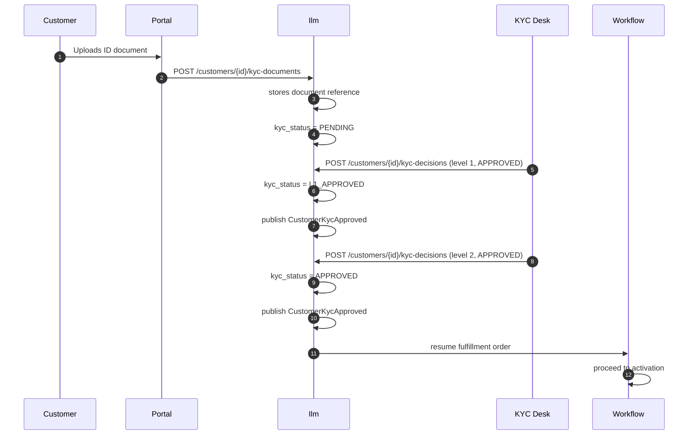

# 👤 Ilm Module (Customer & Account Management)

> **Module path:** `Modules/Ilm/`  
> **Design doc:** `DD_ILM-CFG-01` (customer master), `DD_ILM-CVM-*` (customer value management), `DD_ILM-KYC-*` (KYC)

---

## 1. Module Overview

The Ilm module ("Integrated Lifecycle Management") is the **customer master** of SOPHIX. It owns every customer's identity, their accounts, KYC documents, and CVM (Customer Value Management) offers. No other module is allowed to write to the customer tables — they must read via the API or react to events.

Think of it as the **CRM core**: it knows who the customer is, what documents they have provided, whether they are approved for service, and what special offers they are eligible for.

---

## 2. What This Module Does

- **Manages customer identity** — name, ID numbers, contact info, MSISDN, email
- **Runs KYC (Know Your Customer)** — collects documents, tracks approval status, enforces role-based approval levels
- **Manages customer accounts** — service accounts linked to a customer, each with its own status and flags
- **Handles CVM offers** — targeted offers (discounts, upgrades) presented to customers based on their value profile
- **Publishes customer events** — every customer change emits a `DomainEvent` so Billing, Subscription, and Fulfillment can react
- **Provides Customer 360 overview** — aggregates profile, accounts, subscriptions, billing, tickets, and interactions in one API call

---

## 3. Key Concepts

| Term | Meaning |
|------|---------|
| **Customer** | A person or business entity. One row in the `customer` table. Holds legal identity only. |
| **Account** | A service account linked to a customer. A customer can have multiple accounts (e.g., home internet, mobile). |
| **KYC Status** | The approval state of a customer: `PENDING` → `L1_APPROVED` → `APPROVED` or `REJECTED`. |
| **KYC Document** | A scanned document (ID, proof of address) uploaded by the customer. Stored in Foundation file storage, referenced by ID. |
| **KYC Approval** | A decision record (who approved, what level, comments). L1 = supervisor, FINAL = full approval. |
| **CVM (Customer Value Management)** | A system for targeting offers to customers based on their value, tenure, or behavior. |
| **CVM Offer** | A special deal (discount, free month, upgrade) offered to a specific customer. |
| **Account Flag** | A marker on an account (e.g., `FRAUD_RISK`, `VIP`) that other modules check before acting. |

---

## 4. Architecture Diagram

### Module Placement

```mermaid
flowchart TB
    subgraph Channels
        Portal[Customer Portal]
        Desk[Back-Office Desk]
        KYCApp[KYC Agent App]
    end

    subgraph SOPHIX
        direction TB
        ILM[Ilm Module]
        SUB[Subscription]
        FUL[Fulfillment]
        BIL[Billing]
        CAT[Catalog]
        TICK[Ticketing]
        EVT[Event Bus]
    end

    Portal -->|POST /customers| ILM
    Portal -->|POST /customers/{id}/kyc-documents| ILM
    Desk -->|POST /customers/{id}/kyc-decisions| ILM
    KYCApp -->|GET /customers/{id}/kyc-status| ILM

    ILM -->|reads offers| CAT
    ILM -->|emits events| EVT
    EVT -->|listens| SUB
    EVT -->|listens| FUL
    EVT -->|listens| BIL
    EVT -->|listens| TICK
    SUB -->|reads customer| ILM
    FUL -->|reads KYC| ILM
    BIL -->|reads customer| ILM
```

### KYC Approval Flow



---

## 5. Code Tour

### Key Files and What They Do

```
Modules/Ilm/
├── routes/api.php                          # API routes
├── app/
│   ├── Models/
│   │   ├── Customer.php                   # Customer master — identity, KYC status
│   │   ├── CustomerAccount.php            # Service account linked to a customer
│   │   ├── CustomerContactMethod.php      # Phone, email, address contacts
│   │   ├── CustomerNote.php               # Free-text notes on a customer
│   │   ├── CustomerKycDocument.php         # KYC document reference (file_id, type, hash)
│   │   ├── KycApproval.php                # KYC decision record (level, decision, approver)
│   │   ├── CvmOffer.php                  # A targeted offer for a customer
│   │   └── CvmOfferApproval.php          # Approval record for a CVM offer
│   ├── Services/
│   │   ├── CustomerService.php            # Authoritative writes for Customer (create, update, KYC)
│   │   ├── CustomerOverviewService.php    # Customer 360 aggregation (profile + accounts + subs + billing + tickets)
│   │   ├── AccountService.php             # Account CRUD, status changes, flag management
│   │   ├── ContactMethodService.php       # Contact methods (phone, email, address)
│   │   ├── CvmOfferService.php            # CVM offer creation, targeting, approval
│   │   └── KycService.php                 # KYC document handling, decision recording
│   ├── Http/Controllers/
│   │   ├── CustomerController.php         # Customer CRUD + overview
│   │   ├── CustomerAccountController.php  # Account management
│   │   ├── CustomerSubResourceController.php # Notes, contact methods
│   │   ├── CvmController.php              # CVM offer management
│   │   └── KycController.php              # KYC document upload, status check
│   ├── Http/Requests/
│   │   ├── StoreCustomerRequest.php       # Validation rules for creating a customer
│   │   └── UpdateCustomerRequest.php      # Validation rules for updating a customer
│   ├── Http/Resources/
│   │   └── CustomerResource.php           # JSON transformation for customer responses
│   ├── Events/
│   │   └── IlmEvents.php                # Canonical event types (CUSTOMER_CREATED, CUSTOMER_KYC_APPROVED, etc.)
│   ├── Listeners/
│   │   ├── ResumeCvmOfferOnApproval.php  # When a CVM offer is approved, resumes the workflow
│   │   └── ApplySubStatusOnApproval.php  # When a subscription status change is approved, applies it
│   └── Providers/
│       ├── IlmServiceProvider.php       # Standard Laravel module provider
│       └── EventServiceProvider.php     # Registers listeners for CVM/resume events
```

---

## 6. API Surface

All endpoints are under `/api/` and require `auth:sanctum`.

### Customer Management

| Method | Endpoint | Permission | What It Does |
|--------|----------|------------|--------------|
| `GET` | `/customers` | `customer.read` | List customers (paginated, searchable by `key`/`value` or `q`) |
| `POST` | `/customers` | `customer.create` | Create a new customer |
| `GET` | `/customers/{customer}` | `customer.read` | Get one customer with accounts and contacts |
| `PATCH` | `/customers/{customer}` | `customer.update` | Update customer fields |
| `GET` | `/customers/{customer}/overview` | `customer.read` | Customer 360 — aggregated view from all modules |

### Customer Sub-resources

| Method | Endpoint | Permission | What It Does |
|--------|----------|------------|--------------|
| `GET` | `/customers/{customer}/contact-methods` | `customer.read` | List contact methods |
| `POST` | `/customers/{customer}/contact-methods` | `customer.update` | Add a contact method |
| `GET` | `/customers/{customer}/notes` | `customer.read` | List notes |
| `POST` | `/customers/{customer}/notes` | `customer.update` | Add a note |

### KYC

| Method | Endpoint | Permission | What It Does |
|--------|----------|------------|--------------|
| `POST` | `/customers/{customer}/kyc-documents` | `kyc.manage` | Upload a KYC document (references a Foundation file) |
| `POST` | `/customers/{customer}/kyc-decisions` | `kyc.manage` | Record a KYC approval/rejection |
| `GET` | `/customers/{customer}/kyc-status` | `kyc.read` | Get current KYC status and documents |

### Accounts

| Method | Endpoint | Permission | What It Does |
|--------|----------|------------|--------------|
| `GET` | `/customer-accounts` | `customer.account.read` | List accounts |
| `POST` | `/customer-accounts` | `customer.account.manage` | Create an account |
| `GET` | `/customer-accounts/{account}` | `customer.account.read` | Get one account |
| `PATCH` | `/customer-accounts/{account}` | `customer.account.manage` | Update account |
| `POST` | `/customer-accounts/{account}/flags` | `customer.account.manage` | Set an account flag |
| `DELETE` | `/customer-accounts/{account}/flags/{flag}` | `customer.account.manage` | Clear an account flag |

### CVM Offers

| Method | Endpoint | Permission | What It Does |
|--------|----------|------------|--------------|
| `GET` | `/cvm-offers` | `cvm.read` | List CVM offers |
| `POST` | `/cvm-offers` | `cvm.manage` | Create a CVM offer |
| `GET` | `/cvm-offers/{offer}` | `cvm.read` | Get one offer |
| `POST` | `/cvm-offers/{offer}/approve` | `cvm.manage` | Approve a CVM offer |

---

## 7. Events

### Events This Module Emits

Published to topic: **`ilm.customer`**

| Event Type | When It Happens | Key Payload Fields |
|------------|-----------------|-------------------|
| `CustomerCreated` | New customer row inserted | `customerId`, `name` |
| `CustomerUpdated` | Customer fields changed | `customerId` |
| `CustomerKycApproved` | KYC approved at any level | `customerId`, `kycStatus`, `level` |
| `CustomerKycRejected` | KYC rejected | `customerId`, `kycStatus`, `level` |
| `CustomerAccountCreated` | New account created | `customerId`, `accountId` |
| `CustomerAccountStatusChanged` | Account status changed | `customerId`, `accountId`, `status` |
| `AccountFlagSet` | A flag is set on an account | `customerId`, `accountId`, `flag` |
| `AccountFlagCleared` | A flag is removed from an account | `customerId`, `accountId`, `flag` |

### Events This Module Listens To

| Event | Listener | What It Does |
|-------|----------|--------------|
| `OutboxEventPublished` (CVM offer approval) | `ResumeCvmOfferOnApproval` | Resumes a parked CVM offer workflow when approval is granted |
| `OutboxEventPublished` (subscription status approval) | `ApplySubStatusOnApproval` | Applies a held subscription status transition when approved |

---

## 8. Dependencies

### What This Module Needs

| Module | How It Uses It | File Paths |
|--------|----------------|------------|
| **Catalog** | Reads discount assignments for CVM offers | `CvmOfferService.php` |
| **Workflow** | Listens for process events to resume CVM offers | `EventServiceProvider.php` |
| **Foundation / Files** | References uploaded files by `file_id` | `CustomerService::recordKycDocument()` |

### What Depends on This Module

| Module | Why |
|--------|-----|
| **Fulfillment** | Reads KYC status before allowing activation; reads customer data during order capture |
| **Subscription** | Reads customer data for billing; may check account flags before operations |
| **Billing** | Associates invoices with customers and accounts |
| **Ticketing** | Links tickets to customers |
| **Reporting** | Aggregates customer data for CRM dashboards |

---

## 9. Common Patterns

### Pattern 1: Authoritative Writes via Service

Only `CustomerService` creates or updates customer rows. Controllers call the service, they never call `Customer::create()` directly.

```php
// CustomerController::store()
public function store(StoreCustomerRequest $request): JsonResponse
{
    $customer = $this->customers->create($request->validated());
    return ApiResponse::created(new CustomerResource($customer));
}

// CustomerService::create() — the ONLY place that inserts
public function create(array $data): Customer
{
    return DB::transaction(function () use ($data) {
        $customer = Customer::query()->create($data);
        $this->events->publish(new DomainEvent(...));
        return $customer;
    });
}
```

### Pattern 2: KYC Role-Based Approval

Each KYC level can be gated by a role. If the operator has configured `kyc_approval_role` for level 2, only users with that role (or `SUPER_ADMIN`) can approve.

```php
$roleCfg = DB::table('kyc_approval_role')
    ->where('operator_code', $customer->operator_code)
    ->where('approval_level', $level)->first();
if ($roleCfg) {
    $authorized = $actor->hasRole($roleCfg->required_role) || $actor->hasRole('SUPER_ADMIN');
    if (!$authorized) {
        throw new DomainException('KYC_APPROVER_ROLE_REQUIRED', ...);
    }
}
```

### Pattern 3: Document Supersession

When a new document of the same type is uploaded, the old one is marked as superseded (not deleted). This keeps a full audit trail.

```php
CustomerKycDocument::query()
    ->where('customer_id', $customer->customer_id)
    ->where('document_type', $data['document_type'])
    ->where('document_id', '!=', $newDocument->document_id)
    ->whereNull('superseded_by_id')
    ->update(['superseded_by_id' => $newDocument->document_id, 'superseded_at' => now()]);
```

### Pattern 4: Customer 360 Aggregation

The `CustomerOverviewService` fetches data from multiple modules independently. If one module is down, only its panel fails; the rest still return.

```php
public function overview(string $customerId): array
{
    return [
        'profile' => $this->profile($customerId),      // from Ilm
        'accounts' => $this->accounts($customerId),    // from Ilm
        'subscriptions' => $this->subscriptions($customerId), // from Subscription
        'billing' => $this->billing($customerId),        // from Billing
        'tickets' => $this->tickets($customerId),        // from Ticketing
        'interactions' => $this->interactions($customerId),   // from Workforce/Reporting
        'notes' => $this->notes($customerId),          // from Ilm
    ];
}
```

### Pattern 5: Foundation File Storage Integration

KYC documents are not stored in the Ilm module. They are uploaded to Foundation file storage, and Ilm keeps a reference row with metadata (mime, size, SHA-256 hash).

```php
$file = FileObject::query()->where('file_id', $data['file_id'])->first();
if (!$file) {
    throw new DomainException('KYC_DOCUMENT_FILE_NOT_FOUND', ...);
}
$document = CustomerKycDocument::query()->create([
    'file_id' => $file->file_id,
    'storage_path' => $file->path,
    'mime_type' => $file->mime_type,
    'size_bytes' => $file->size_bytes,
    'content_hash' => $file->checksum, // SHA-256
]);
```

---

## 10. New Dev Checklist

### First Things to Read

1. [ ] `Modules/Ilm/app/Models/Customer.php` — understand the KYC status constants and auto-generated ID
2. [ ] `Modules/Ilm/app/Services/CustomerService.php` — see how KYC documents and decisions work
3. [ ] `Modules/Ilm/app/Http/Controllers/CustomerController.php` — the main customer API
4. [ ] `Modules/Ilm/app/Events/IlmEvents.php` — all event types this module publishes
5. [ ] `Modules/Ilm/app/Services/CustomerOverviewService.php` — how Customer 360 works

### How to Run Tests

```bash
php artisan test --filter=Ilm
# or
php artisan test Modules/Ilm/tests/
```

### How to Add a New Customer Field

1. Add the column to the `customer` table migration
2. Add the field to `StoreCustomerRequest.php` and `UpdateCustomerRequest.php` validation rules
3. Add the field to `CustomerResource.php` if it should appear in API responses
4. Update the design doc `DD_ILM-CFG-01` if this is a business-level change

### How to Add a New KYC Document Type

1. Add the new type constant to the appropriate enum/config
2. Update `StoreCustomerRequest.php` validation to allow the new type
3. No migration needed — `document_type` is a string column

### Debugging Tips

- **Check a customer:** `SELECT * FROM customer WHERE customer_id = 'cus_xxx';`
- **Check KYC documents:** `SELECT * FROM customer_kyc_document WHERE customer_id = 'cus_xxx';`
- **Check KYC approvals:** `SELECT * FROM kyc_approval WHERE customer_id = 'cus_xxx' ORDER BY created_at;`
- **Check accounts:** `SELECT * FROM customer_account WHERE customer_id = 'cus_xxx';`
- **Remember:** `kyc_status` is a derived field updated by `recordKycDecision()`, not by direct update.
- **Remember:** If a customer is stuck in `PENDING` KYC, they need an L1 approval, then a final approval.
