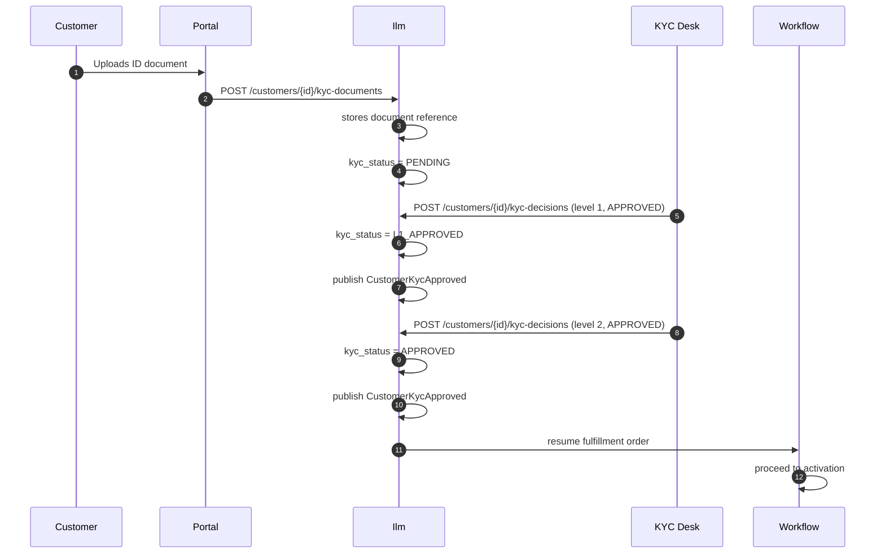

# 👤 Ilm Module — Onboarding Guide

> **Module:** `Modules/Ilm`  
> **Bundle:** Customer Master & KYC (DD 01 — ILM-CFG-01, ILM-CVM-*, ILM-KYC-*)  
> **What it does:** Manages every customer's identity, their accounts, KYC documents, and CVM (Customer Value Management) offers. **This is the customer master — the single source of truth for who your customers are.**

---

## 1. What This Module Does (In Plain English)

Every customer in your system needs an identity. The **Ilm** module ("Integrated Lifecycle Management") is the **customer master**:

- **Customer Identity:** Name, ID numbers, contact info (phone, email, address), MSISDN
- **KYC (Know Your Customer):** Collects documents, tracks approval status, enforces role-based approval levels
- **Accounts:** Service accounts linked to a customer (one customer can have multiple accounts)
- **CVM Offers:** Targeted offers (discounts, upgrades) based on customer value profile
- **Customer 360:** Aggregates profile, accounts, subscriptions, billing, tickets, and interactions in one view

**The Golden Rule:** Only Ilm writes to the `customer`, `customer_account`, and `kyc_document` tables. Other modules read via API or consume events. Subscription reads customer data for contracts. Billing reads for invoice headers. Fulfillment reads for KYC checks.

---

## 2. Key Concepts You Must Know

| Term | Meaning |
|------|---------|
| **Customer** | A person or business entity. One row in the `customer` table. Holds legal identity only. |
| **Account** | A service account linked to a customer. A customer can have multiple accounts (e.g., home internet, mobile). |
| **KYC Status** | The approval state: `PENDING` → `L1_APPROVED` → `APPROVED` or `REJECTED`. |
| **KYC Document** | A scanned document (ID, proof of address) uploaded by the customer. Stored in Foundation file storage, referenced by ID. |
| **KYC Approval** | A decision record (who approved, what level, comments). L1 = supervisor, FINAL = full approval. |
| **CVM (Customer Value Management)** | A system for targeting offers to customers based on their value, tenure, or behavior. |
| **CVM Offer** | A special deal (discount, free month, upgrade) offered to a specific customer. |
| **Account Flag** | A marker on an account (e.g., `FRAUD_RISK`, `VIP`) that other modules check before acting. |
| **Customer 360** | An aggregated view of a customer from all modules — profile, accounts, subscriptions, billing, tickets, interactions. |

---

## 3. Architecture Diagrams

### ASCII: Module Placement in the System

```
┌─────────────────────────────────────────────────────────────────────┐
│                        EXTERNAL CALLERS                              │
│  ┌──────────────┐  ┌──────────────┐  ┌──────────────┐              │
│  │ Customer     │  │ Back-Office  │  │ KYC Agent    │              │
│  │   Portal     │  │   Desk       │  │   App        │              │
│  └──────┬───────┘  └──────┬───────┘  └──────┬───────┘              │
└─────────┼──────────────────┼──────────────────┼──────────────────────┘
          │                  │                  │
          ▼                  ▼                  ▼
┌─────────────────────────────────────────────────────────────────────┐
│  ┌──────────────────────────────────────────────────────────────┐   │
│  │                  👤 ILM MODULE (Customer Master)            │   │
│  │                                                              │   │
│  │  Routes (api.php) ──▶ Controllers ──▶ Services ──▶ Models     │   │
│  │                                      │                        │   │
│  │                                      ▼                        │   │
│  │                              Events ──▶ EventBus              │   │
│  │                                                              │   │
│  │  ┌──────────┐  ┌──────────┐  ┌──────────┐  ┌──────────┐   │   │
│  │  │ Customer │  │  KYC     │  │  CVM     │  │ Account  │   │   │
│  │  │ Service  │  │ Service  │  │ Service  │  │ Service  │   │   │
│  │  │          │  │          │  │          │  │          │   │   │
│  │  │ "Create  │  │ "Upload  │  │ "Target  │  │ "Create  │   │   │
│  │  │  customer│  │  docs"   │  │  offer"  │  │  account"│   │   │
│  │  └──────────┘  └──────────┘  └──────────┘  └──────────┘   │   │
│  └──────────────────────────────────────────────────────────────┘   │
└─────────────────────────────────────────────────────────────────────┘
          │
          │ emits events
          ▼
┌─────────────────────────────────────────────────────────────────────┐
│                        OTHER MODULES (Event Consumers)                │
│  ┌──────────┐  ┌──────────┐  ┌──────────┐  ┌──────────┐            │
│  │  📘      │  │  📦      │  │  📙      │  │  📋      │            │
│  │Subscription│  │Fulfillment│  │ Billing  │  │ Ticketing│            │
│  │          │  │          │  │          │  │          │            │
│  │ "Read    │  │ "Read KYC │  │ "Read    │  │ "Link    │            │
│  │  customer│  │  status" │  │  customer│  │  ticket  │            │
│  │  data"   │  │          │  │  for     │  │  to     │            │
│  │          │  │          │  │  invoice"│  │  customer│            │
│  └──────────┘  └──────────┘  └──────────┘  └──────────┘            │
└─────────────────────────────────────────────────────────────────────┘
```

### Mermaid: KYC Approval Flow



---

## 4. Code Tour — Key Files and What They Do

```
Modules/Ilm/
├── routes/
│   └── api.php                              # All Ilm endpoints
│
├── app/
│   ├── Http/
│   │   ├── Controllers/
│   │   │   ├── CustomerController.php         # Customer CRUD + overview
│   │   │   ├── CustomerAccountController.php    # Account management
│   │   │   ├── CustomerSubResourceController.php # Notes, contact methods
│   │   │   ├── CvmController.php                # CVM offer management
│   │   │   └── KycController.php                # KYC document upload, status check
│   │   ├── Requests/
│   │   │   ├── StoreCustomerRequest.php         # Validation: create customer
│   │   │   └── UpdateCustomerRequest.php        # Validation: update customer
│   │   └── Resources/
│   │       └── CustomerResource.php             # JSON transformation for responses
│   │
│   ├── Models/
│   │   ├── Customer.php                         # Customer master — identity, KYC status
│   │   ├── CustomerAccount.php                  # Service account linked to customer
│   │   ├── CustomerContactMethod.php            # Phone, email, address contacts
│   │   ├── CustomerNote.php                     # Free-text notes on a customer
│   │   ├── CustomerKycDocument.php              # KYC document reference (file_id, type, hash)
│   │   ├── KycApproval.php                      # KYC decision record (level, decision, approver)
│   │   ├── CvmOffer.php                         # Targeted offer for a customer
│   │   └── CvmOfferApproval.php                 # Approval record for a CVM offer
│   │
│   ├── Services/
│   │   ├── CustomerService.php                  # Authoritative writes for Customer
│   │   ├── CustomerOverviewService.php          # Customer 360 aggregation
│   │   ├── AccountService.php                   # Account CRUD, status changes, flags
│   │   ├── ContactMethodService.php             # Contact methods (phone, email, address)
│   │   ├── CvmOfferService.php                  # CVM offer creation, targeting, approval
│   │   └── KycService.php                       # KYC document handling, decision recording
│   │
│   ├── Events/
│   │   └── IlmEvents.php                        # All event constants
│   │
│   ├── Listeners/
│   │   ├── ResumeCvmOfferOnApproval.php         # Resumes CVM offer workflow on approval
│   │   └── ApplySubStatusOnApproval.php         # Applies held subscription status on approval
│   │
│   └── Providers/
│       ├── IlmServiceProvider.php               # Standard Laravel module provider
│       └── EventServiceProvider.php             # Registers listeners for CVM/resume events
│
├── database/
│   ├── migrations/
│   │   ├── 2026_06_01_100000_create_customer_tables.php
│   │   ├── 2026_06_02_100000_create_kyc_tables.php
│   │   ├── 2026_06_03_100000_create_cvm_tables.php
│   │   └── ...
│   └── seeders/                                 # (if any)
│
├── tests/
│   ├── Feature/                                 # API tests
│   └── Unit/                                    # Service tests
│
└── module.json                                  # Module metadata
```

---

## 5. Services, Models, Events, Rules, and Workflows — The Full Map

### Services (Business Logic)

| Service | What It Does | Called By |
|---------|-------------|-----------|
| `CustomerService` | Creates/updates customers, handles KYC documents, authoritative writes | Controllers, Workflow handlers |
| `CustomerOverviewService` | Aggregates Customer 360 data from all modules | CustomerController |
| `AccountService` | Creates/manages accounts, handles status changes and flags | CustomerAccountController |
| `ContactMethodService` | Manages phone, email, address contacts | CustomerSubResourceController |
| `KycService` | Handles KYC document uploads, decision recording, status tracking | KycController |
| `CvmOfferService` | Creates targeted offers, manages approval workflows | CvmController |

### Models (Data)

| Model | Table | What It Stores | Owned By |
|-------|-------|---------------|----------|
| `Customer` | `customers` | Identity, KYC status, auto-generated ID | Ilm |
| `CustomerAccount` | `customer_accounts` | Service accounts linked to customer | Ilm |
| `CustomerContactMethod` | `customer_contact_methods` | Phone, email, address | Ilm |
| `CustomerNote` | `customer_notes` | Free-text notes | Ilm |
| `CustomerKycDocument` | `customer_kyc_documents` | KYC document references (not files themselves) | Ilm |
| `KycApproval` | `kyc_approvals` | KYC decision records (who, what, when) | Ilm |
| `CvmOffer` | `cvm_offers` | Targeted offers for customers | Ilm |
| `CvmOfferApproval` | `cvm_offer_approvals` | Approval records for CVM offers | Ilm |

### Events (What This Module Publishes)

| Event | When It Happens | Who Consumes It | What They Do |
|-------|-----------------|-----------------|--------------|
| `CustomerCreated` | New customer row inserted | Fulfillment, Billing, CRM | Fulfillment: start order. Billing: create billing account. CRM: welcome email. |
| `CustomerUpdated` | Customer fields changed | CRM, Reporting | CRM: update records. Reporting: log changes. |
| `CustomerKycApproved` | KYC approved at any level | Fulfillment, Subscription | Fulfillment: resume order workflow. Subscription: allow activation. |
| `CustomerKycRejected` | KYC rejected | Fulfillment, CRM | Fulfillment: cancel or hold order. CRM: notify customer. |
| `CustomerAccountCreated` | New account created | Billing, Subscription | Billing: create billing account. Subscription: link to contract. |
| `CustomerAccountStatusChanged` | Account status changed | Billing, Subscription | Billing: update billing. Subscription: check if operations allowed. |
| `AccountFlagSet` | Flag set on account | Subscription, Billing, Rules | Subscription: block operations. Billing: hold invoicing. Rules: enforce policies. |
| `AccountFlagCleared` | Flag removed from account | Subscription, Billing | Subscription: allow operations. Billing: resume invoicing. |
| `CvmOfferCreated` | New offer created | CRM | CRM: notify customer. |
| `CvmOfferApproved` | Offer approved | CRM, Billing | CRM: present offer. Billing: apply discount. |
| `CvmOfferRejected` | Offer rejected | CRM | CRM: log rejection. |
| `CustomerContactUpdated` | Contact info changed | Notification | Notification: update SMS/email targets. |

### Events This Module Listens To

| Event | Listener | What It Does |
|-------|----------|--------------|
| `CvmOfferApprovalGranted` | `ResumeCvmOfferOnApproval` | Resumes a parked CVM offer workflow when approval is granted |
| `SubscriptionStatusApprovalGranted` | `ApplySubStatusOnApproval` | Applies a held subscription status transition when approved |

### Rules (Business Policy Validation)

| Rule | When It Runs | What It Checks |
|------|-------------|----------------|
| `CanCreateCustomer` | Before customer creation | Is ID number unique? Is contact info valid? |
| `CanUpdateCustomer` | Before customer update | Is customer active? Are changes allowed? |
| `CanCreateAccount` | Before account creation | Is customer KYC approved? Is account type valid? |
| `CanUploadKycDocument` | Before document upload | Is document type valid? Is file size acceptable? |
| `CanApproveKyc` | Before KYC approval | Does approver have required role? Is level correct? |
| `CanCreateCvmOffer` | Before offer creation | Is customer eligible? Is offer within budget? |
| `CanSetAccountFlag` | Before flag set | Is flag valid? Does user have permission? |

### Workflow References

Ilm uses workflows for:

| Process | Purpose | Approval Required? |
|---------|---------|-------------------|
| `kyc-approval` | KYC document review and approval | Yes (role-based: L1, L2) |
| `cvm-offer-approval` | CVM offer creation and approval | Yes (manager approval) |
| `account-flag-approval` | Setting sensitive account flags | Yes (supervisor approval) |
| `customer-merge` | Merging duplicate customer records | Yes (manager approval) |

---

## 6. API Surface — What You Can Call

All endpoints require `auth:sanctum`. The `X-Operator-Code` header scopes all queries.

### Customer Management

| Method | Endpoint | Permission | What It Does |
|--------|----------|------------|--------------|
| `GET` | `/api/customers` | `customer.read` | List customers (paginated, searchable by `key`/`value` or `q`) |
| `POST` | `/api/customers` | `customer.create` | Create a new customer |
| `GET` | `/api/customers/{customer}` | `customer.read` | Get one customer with accounts and contacts |
| `PATCH` | `/api/customers/{customer}` | `customer.update` | Update customer fields |
| `GET` | `/api/customers/{customer}/overview` | `customer.read` | Customer 360 — aggregated view from all modules |

### Customer Sub-resources

| Method | Endpoint | Permission | What It Does |
|--------|----------|------------|--------------|
| `GET` | `/api/customers/{customer}/contact-methods` | `customer.read` | List contact methods |
| `POST` | `/api/customers/{customer}/contact-methods` | `customer.update` | Add a contact method |
| `DELETE` | `/api/customers/{customer}/contact-methods/{id}` | `customer.update` | Remove a contact method |
| `GET` | `/api/customers/{customer}/notes` | `customer.read` | List notes |
| `POST` | `/api/customers/{customer}/notes` | `customer.update` | Add a note |

### KYC

| Method | Endpoint | Permission | What It Does |
|--------|----------|------------|--------------|
| `POST` | `/api/customers/{customer}/kyc-documents` | `kyc.manage` | Upload a KYC document (references Foundation file) |
| `GET` | `/api/customers/{customer}/kyc-documents` | `kyc.read` | List KYC documents |
| `POST` | `/api/customers/{customer}/kyc-decisions` | `kyc.manage` | Record a KYC approval/rejection |
| `GET` | `/api/customers/{customer}/kyc-status` | `kyc.read` | Get current KYC status and documents |
| `GET` | `/api/customers/{customer}/kyc-approvals` | `kyc.read` | Get KYC approval history |

### Accounts

| Method | Endpoint | Permission | What It Does |
|--------|----------|------------|--------------|
| `GET` | `/api/customer-accounts` | `customer.account.read` | List accounts (paginated, filter by customer) |
| `POST` | `/api/customer-accounts` | `customer.account.manage` | Create an account |
| `GET` | `/api/customer-accounts/{account}` | `customer.account.read` | Get one account |
| `PATCH` | `/api/customer-accounts/{account}` | `customer.account.manage` | Update account |
| `POST` | `/api/customer-accounts/{account}/flags` | `customer.account.manage` | Set an account flag |
| `DELETE` | `/api/customer-accounts/{account}/flags/{flag}` | `customer.account.manage` | Clear an account flag |
| `GET` | `/api/customer-accounts/{account}/flags` | `customer.account.read` | List account flags |

### CVM Offers

| Method | Endpoint | Permission | What It Does |
|--------|----------|------------|--------------|
| `GET` | `/api/cvm-offers` | `cvm.read` | List CVM offers |
| `POST` | `/api/cvm-offers` | `cvm.manage` | Create a CVM offer |
| `GET` | `/api/cvm-offers/{offer}` | `cvm.read` | Get one offer |
| `POST` | `/api/cvm-offers/{offer}/approve` | `cvm.manage` | Approve a CVM offer (triggers workflow) |
| `POST` | `/api/cvm-offers/{offer}/reject` | `cvm.manage` | Reject a CVM offer |
| `GET` | `/api/cvm-offers/customer/{customer}` | `cvm.read` | Get offers for a specific customer |

---

## 7. Scheduled Commands / Batch Jobs / Cron Jobs

The Ilm module runs these scheduled jobs:

| Job | Schedule | What It Does | Why |
|-----|----------|-------------|-----|
| `ilm:sync-kyc-status` | Daily at 01:00 | Reconciles KYC status with actual approvals | Fixes status drift |
| `ilm:remind-pending-kyc` | Daily at 09:00 | Sends reminders to customers with KYC pending for > 7 days | Reduces KYC backlog |
| `ilm:expire-stale-cvm-offers` | Daily at 00:05 | Expires CVM offers past their end date | Prevents expired offers from being applied |
| `ilm:archive-old-notes` | Weekly | Archives customer notes > 2 years old | Keeps notes table small |
| `ilm:generate-cvm-reports` | Weekly | Generates CVM performance report (uptake rate, revenue impact) | Marketing analytics |
| `ilm:merge-duplicate-detection` | Daily at 03:00 | Detects potential duplicate customers (same ID, similar name) | Data quality |
| `ilm:notify-flagged-accounts` | Daily at 10:00 | Notifies managers of accounts with new flags | Risk management |

**How to check what's scheduled:**
```bash
php artisan schedule:list
```

**How to run a job manually:**
```bash
php artisan ilm:sync-kyc-status --dry-run
php artisan ilm:remind-pending-kyc --customer=cus_xxx
```

---

## 8. Common Patterns

### Pattern 1: Authoritative Writes via Service (The Only Writer)

Only `CustomerService` creates or updates customer rows. Controllers call the service, they never call `Customer::create()` directly.

```php
// CustomerController::store()
public function store(StoreCustomerRequest $request): JsonResponse
{
    $customer = $this->customers->create($request->validated());
    return ApiResponse::created(new CustomerResource($customer));
}

// CustomerService::create() — the ONLY place that inserts
public function create(array $data): Customer
{
    return DB::transaction(function () use ($data) {
        $customer = Customer::query()->create($data);
        $this->events->publish(new DomainEvent(
            type: IlmEvents::CUSTOMER_CREATED,
            topic: IlmEvents::TOPIC,
            payload: ['customerId' => $customer->customer_id, 'name' => $customer->name],
            aggregateType: 'Customer',
            aggregateId: $customer->customer_id,
        ));
        return $customer;
    });
}
```

**Why this matters:** If you allow direct model creation, you bypass validation, event publishing, and audit trails. The service is the gatekeeper.

### Pattern 2: KYC Role-Based Approval

Each KYC level can be gated by a role. If the operator has configured `kyc_approval_role` for level 2, only users with that role (or `SUPER_ADMIN`) can approve.

```php
$roleCfg = DB::table('kyc_approval_role')
    ->where('operator_code', $customer->operator_code)
    ->where('approval_level', $level)
    ->first();

if ($roleCfg) {
    $authorized = $actor->hasRole($roleCfg->required_role) || $actor->hasRole('SUPER_ADMIN');
    if (!$authorized) {
        throw new DomainException('KYC_APPROVER_ROLE_REQUIRED', [
            'requiredRole' => $roleCfg->required_role,
        ]);
    }
}
```

**Why this matters:** In a regulated industry, KYC approval is a legal requirement. The system must enforce who can approve. A junior agent can't approve a high-risk customer — only a supervisor can.

### Pattern 3: Document Supersession (Audit Trail)

When a new document of the same type is uploaded, the old one is marked as superseded (not deleted). This keeps a full audit trail.

```php
CustomerKycDocument::query()
    ->where('customer_id', $customer->customer_id)
    ->where('document_type', $data['document_type'])
    ->where('document_id', '!=', $newDocument->document_id)
    ->whereNull('superseded_by_id')
    ->update([
        'superseded_by_id' => $newDocument->document_id,
        'superseded_at' => now(),
    ]);
```

**Why this matters:** If a customer uploads a fake ID and then replaces it with a real one, you need to know the fake ID existed. Supersession preserves history without cluttering the active document list.

### Pattern 4: Customer 360 Aggregation (Graceful Degradation)

The `CustomerOverviewService` fetches data from multiple modules independently. If one module is down, only its panel fails; the rest still return.

```php
public function overview(string $customerId): array
{
    return [
        'profile' => $this->profile($customerId),           // from Ilm (always available)
        'accounts' => $this->accounts($customerId),          // from Ilm (always available)
        'subscriptions' => $this->trySubscriptions($customerId),  // from Subscription (may fail)
        'billing' => $this->tryBilling($customerId),        // from Billing (may fail)
        'tickets' => $this->tryTickets($customerId),          // from Ticketing (may fail)
        'interactions' => $this->tryInteractions($customerId),    // from Workforce (may fail)
        'notes' => $this->notes($customerId),                // from Ilm (always available)
    ];
}

private function trySubscriptions(string $customerId): array
{
    try {
        return $this->subscriptions->forCustomer($customerId);
    } catch (ServiceException $e) {
        return ['error' => 'Subscription service unavailable', 'retry' => true];
    }
}
```

**Why this matters:** If Billing is down, the customer 360 page still shows profile, accounts, and subscriptions. Support agents can still help customers. The page shows "Billing data unavailable" instead of a 500 error.

### Pattern 5: Foundation File Storage Integration

KYC documents are not stored in the Ilm module. They are uploaded to Foundation file storage, and Ilm keeps a reference row with metadata.

```php
$file = FileObject::query()->where('file_id', $data['file_id'])->first();
if (!$file) {
    throw new DomainException('KYC_DOCUMENT_FILE_NOT_FOUND', ['fileId' => $data['file_id']]);
}

$document = CustomerKycDocument::query()->create([
    'file_id' => $file->file_id,
    'storage_path' => $file->path,
    'mime_type' => $file->mime_type,
    'size_bytes' => $file->size_bytes,
    'content_hash' => $file->checksum, // SHA-256 for integrity verification
    'uploaded_by' => Context::userId(),
    'uploaded_at' => now(),
]);
```

**Why this matters:** File storage is a separate concern from customer data. By separating them, you can: change storage backends (S3, local, etc.) without touching Ilm code; enforce file-level security policies; and deduplicate files across modules.

---

## 9. Dependencies — What This Module Needs

| Module | What It Uses | How It Uses It | File Paths |
|--------|-------------|----------------|------------|
| **Catalog** | Reads discount assignments for CVM offers | `CvmOfferService.php` reads campaign configs from Catalog | `Services/CvmOfferService.php` |
| **Workflow** | Listens for process events to resume CVM offers | `ResumeCvmOfferOnApproval.php` listens for workflow events | `Listeners/ResumeCvmOfferOnApproval.php` |
| **Foundation / Files** | References uploaded files by `file_id` | `CustomerService::recordKycDocument()` stores file reference | `Services/CustomerService.php` |
| **Rules** | Business policy validation | `CanCreateCustomer`, `CanApproveKyc` rules | `Services/CustomerService.php`, `Services/KycService.php` |

### What Depends on This Module

| Module | Why It Needs Ilm |
|--------|-----------------|
| **Fulfillment** | Reads KYC status before allowing activation; reads customer data during order capture |
| **Subscription** | Reads customer data for billing; may check account flags before operations |
| **Billing** | Associates invoices with customers and accounts; reads customer category for tax |
| **Ticketing** | Links tickets to customers; reads contact info for notifications |
| **Reporting** | Aggregates customer data for CRM dashboards (KYC completion rate, customer growth) |
| **Notification** | Reads contact methods (phone, email) for SMS/email delivery |
| **CRM** | Reads customer profile, notes, and CVM offers for sales and support |

---

## 10. New Dev Checklist

### Must-Read Files (In Order)

- [ ] `Modules/Ilm/app/Models/Customer.php` — Understand KYC status constants and auto-generated ID
- [ ] `Modules/Ilm/app/Services/CustomerService.php` — See how KYC documents and decisions work
- [ ] `Modules/Ilm/app/Services/CustomerOverviewService.php` — Understand Customer 360 aggregation
- [ ] `Modules/Ilm/app/Http/Controllers/CustomerController.php` — The main customer API
- [ ] `Modules/Ilm/app/Events/IlmEvents.php` — All event types this module publishes
- [ ] `Modules/Ilm/app/Models/CustomerKycDocument.php` — Understand document references (not files)
- [ ] `Modules/Ilm/routes/api.php` — All endpoints in one place

### Must-Run Commands

```bash
# Run Ilm tests
php artisan test --filter=Ilm

# See what customers exist
php artisan tinker --execute="dd(Customer::query()->with('accounts')->limit(5)->get());"

# Check KYC status distribution
php artisan tinker --execute="
    dd(DB::table('customers')
        ->select('kyc_status', DB::raw('count(*) as count'))
        ->groupBy('kyc_status')
        ->get());
"

# Check scheduled jobs
php artisan schedule:list

# Run KYC sync manually
php artisan ilm:sync-kyc-status --dry-run

# Check a customer's 360 overview
php artisan tinker --execute="
    $svc = app(\Modules\Ilm\app\Services\CustomerOverviewService::class);
    dd($svc->overview('cus_xxx'));
"
```

### How to Add a New Customer Field

1. Add the column to the `customer` table migration (or create a new migration)
2. Add the field to `StoreCustomerRequest.php` and `UpdateCustomerRequest.php` validation rules
3. Add the field to `CustomerResource.php` if it should appear in API responses
4. Update `CustomerService::create()` and `update()` to handle the new field
5. Update the design doc `DD_ILM-CFG-01` if this is a business-level change
6. Write tests!

### How to Add a New KYC Document Type

1. Add the new type constant to the appropriate enum/config (e.g., `KycDocumentType`)
2. Update `StoreCustomerRequest.php` validation to allow the new type
3. No migration needed — `document_type` is a string column
4. Update KYC Desk UI to handle the new document type

### How to Handle a KYC Rejection

```bash
# Find the customer
SELECT * FROM customers WHERE customer_id = 'cus_xxx';

# Check KYC documents
SELECT * FROM customer_kyc_documents WHERE customer_id = 'cus_xxx' ORDER BY created_at DESC;

# Check KYC approval history
SELECT * FROM kyc_approvals WHERE customer_id = 'cus_xxx' ORDER BY created_at DESC;

# Check if rejection was at L1 or FINAL level
SELECT * FROM kyc_approvals WHERE customer_id = 'cus_xxx' AND decision = 'REJECTED' ORDER BY created_at DESC LIMIT 1;
```

### Debugging Guide

**"Customer KYC status is wrong!"**
```bash
# Check the actual approvals
SELECT * FROM kyc_approvals WHERE customer_id = 'cus_xxx' ORDER BY created_at DESC;

# Check if the sync job has run recently
SELECT MAX(created_at) FROM job_batches WHERE name LIKE '%ilm:sync-kyc-status%';

# Manually trigger sync
php artisan ilm:sync-kyc-status --customer=cus_xxx
```

**"Customer 360 shows wrong subscription data!"**
```bash
# Check if Subscription module is healthy
php artisan tinker --execute="
    try {
        $sub = Subscription::query()->where('customer_id', 'cus_xxx')->first();
        dd($sub);
    } catch (Exception $e) {
        dd('Subscription module error: ' . $e->getMessage());
    }
"

# Check the CustomerOverviewService logs
# The service catches errors per-panel and returns partial data
```

**"Account flag not blocking operations!"**
```bash
# Check if flag is set
SELECT * FROM customer_account_flags WHERE account_id = 'acc_xxx';

# Check if the Rules module is checking this flag
# Look for rules like 'CanPerformOperation' that check account flags
# The flag must be in the 'BLOCKING' category to prevent operations
```

**"CVM offer not applied to invoice!"**
```bash
# Check if offer is approved and active
SELECT * FROM cvm_offers WHERE id = 'cvm_xxx' AND status = 'APPROVED' AND end_date > NOW();

# Check if customer is eligible
SELECT * FROM cvm_offers WHERE customer_id = 'cus_xxx' AND status = 'APPROVED';

# Check if Billing module reads CVM offers
# The discount is applied in ChargeComputeService or InvoiceService
```

---

## 11. Quick FAQ

**Q: What's the difference between a Customer and an Account?**  
A: A Customer is a person or business (the legal entity). An Account is a service relationship. One customer can have multiple accounts: "John Doe" (customer) might have a home internet account and a mobile account. Billing invoices the account, not the customer directly.

**Q: Why is KYC a multi-level approval?**  
A: For regulatory compliance and risk management. Level 1 (supervisor) does initial review. Level 2 (manager) does final approval for high-risk customers. Some operators skip L1 for low-risk customers (straight to APPROVED). The levels are configured per operator in `kyc_approval_config`.

**Q: Can I delete a customer?**  
A: **No.** Customers are soft-deleted (status = `ARCHIVED`) or anonymized for GDPR. Deleting a customer would break all linked subscriptions, invoices, and tickets. Use the anonymization workflow for GDPR requests.

**Q: What's the difference between KYC documents and KYC approvals?**  
A: A **KYC Document** is the uploaded file (ID scan, proof of address). A **KYC Approval** is the decision record ("L1 supervisor APPROVED this customer on 2026-06-25"). One customer can have many documents and many approvals. The `kyc_status` field is derived from the latest approval.

**Q: What happens if KYC is rejected?**  
A: The customer cannot activate service. The Fulfillment order is either cancelled or held (depending on process definition). The customer receives a notification explaining why. They can resubmit documents, which triggers a new KYC review cycle.

**Q: What are account flags?**  
A: Markers on an account that affect system behavior. Examples: `FRAUD_RISK` (block all operations), `VIP` (priority support), `AUTO_PAY` (enable automatic payments). Flags are checked by Rules before allowing operations. Some flags require approval to set.

**Q: What is Customer 360?**  
A: An aggregated view of a customer from all modules. It shows: profile (Ilm), accounts (Ilm), subscriptions (Subscription), billing (Billing), tickets (Ticketing), interactions (Workforce). It's designed for support agents — one page with everything they need.

**Q: How do CVM offers work?**  
A: A CVM (Customer Value Management) offer is a targeted deal. Example: "Customer has been with us 2 years, give them 50% off next month." The offer is created by marketing, approved by a manager, and applied by Billing when generating the invoice. Eligibility is checked by the `CvmOfferService`.

**Q: Why are files stored in Foundation, not Ilm?**  
A: Separation of concerns. Foundation handles file storage, security, deduplication, and retention. Ilm only stores metadata (file_id, mime, size, hash). This lets you change storage backends (S3, local, etc.) without touching Ilm code.

**Q: How do I anonymize a customer for GDPR?**  
A: Use the `customer:anonymize` command or the GDPR workflow. This replaces PII (name, ID, phone, email) with hashed values, preserves the account for billing history, and emits a `CustomerAnonymized` event. **Never delete the customer row** — it breaks referential integrity.

**Q: What happens if a customer uploads a new ID after rejection?**  
A: The new document is uploaded and the old one is superseded (see Pattern 3). The KYC status resets to `PENDING`. The customer needs to go through the approval process again. The previous rejection is preserved in the approval history.

---

> **Next:** Read the [Subscription Module Guide](./Subscription.md) — where the customer journey begins.
