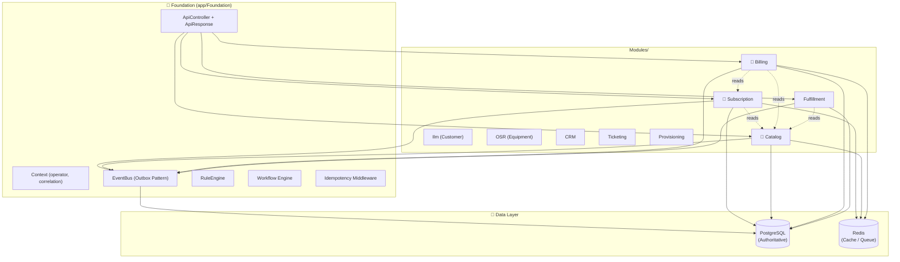

# SOPHIX BSS — Developer Onboarding (Trial Run)

> **Status:** Trial documentation for core modules  
> **Target audience:** New developers joining the SOPHIX team  
> **Last updated:** 2026-06-25

---

## 🗺️ System Overview

SOPHIX is a **modular telecom Business Support System (BSS)** built on Laravel 12. It handles everything from a customer signing up for fiber internet to billing them monthly and chasing unpaid invoices.

### The Core Flow (Customer Journey)

```
  Customer          Catalog          Subscription        Fulfillment
     │                 │                   │                   │
     │ "I want fiber"  │                   │                   │
     │────────────────>│                   │                   │
     │                 │ "Available here"  │                   │
     │                 │──────────────────>│                   │
     │                 │                   │ "Create contract" │
     │                 │                   │──────────────────>│
     │                 │                   │                   │ "Install fiber"
     │                 │                   │                   │─────────────>
     │                 │                   │    "Activated!"   │
     │                 │                   │<──────────────────│
     │  "Internet works"                 │                   │
     │<─────────────────────────────────────────────────────────│
     │                 │                   │                   │
     │  Uses internet  │                   │                   │
     │─────────────────────────────────────────────────────────>│
     │                 │                   │                   │
     │                 │                   │     Billing       │
     │                 │                   │<──────────────────│
     │  "Pay $50"      │                   │                   │
     │<─────────────────────────────────────────────────────────│
     │                 │                   │                   │
```

---

## 📚 Trial Onboarding Guides

This trial covers the **core revenue modules**. Each guide is designed to be read in ~20 minutes by a new developer.

| Module | Guide | What You'll Learn |
|--------|-------|-------------------|
| **Subscription** | [subscription.md](./subscription.md) | Customer contracts, lifecycle workflows, status transitions, scheduled jobs |
| **Catalog** | [catalog.md](./catalog.md) | Products, packages, pricing, coverage areas, tax rules, scheduled jobs |
| **Billing** | [billing.md](./billing.md) | Invoicing, payments, wallets, dunning, adjustments, scheduled jobs |
| **Fulfillment** | [Fulfillment.md](./Fulfillment.md) | Order capture, activation completion, provisioning |
| **Ilm** | [Ilm.md](./Ilm.md) | Customer master, KYC, account management |

---

## 🏗️ Architecture at a Glance

### ASCII Diagram

```
┌─────────────────────────────────────────────────────────────────────┐
│                        EXTERNAL CALLERS                              │
│  ┌──────────────┐  ┌──────────────┐  ┌──────────────┐              │
│  │ Backoffice UI │  │ External API │  │ Batch Jobs   │              │
│  │ (Inertia+Vue) │  │   Clients    │  │  (Cron)      │              │
│  └──────┬───────┘  └──────┬───────┘  └──────┬───────┘              │
└─────────┼──────────────────┼──────────────────┼──────────────────────┘
          │                  │                  │
          ▼                  ▼                  ▼
┌─────────────────────────────────────────────────────────────────────┐
│                      🧱 FOUNDATION LAYER                             │
│  ┌──────────────┐  ┌──────────────┐  ┌──────────────┐              │
│  │ ApiController│  │   Context    │  │  EventBus    │              │
│  │ +ApiResponse │  │(operator,    │  │ (Outbox)     │              │
│  │              │  │ correlation)  │  │              │              │
│  └──────────────┘  └──────────────┘  └──────────────┘              │
│  ┌──────────────┐  ┌──────────────┐  ┌──────────────┐              │
│  │ RuleEngine   │  │WorkflowEngine│  │Idempotency   │              │
│  │              │  │              │  │  Middleware   │              │
│  └──────────────┘  └──────────────┘  └──────────────┘              │
└─────────────────────────────────────────────────────────────────────┘
          │                  │                  │
          ▼                  ▼                  ▼
┌─────────────────────────────────────────────────────────────────────┐
│                        MODULES LAYER                                 │
│  ┌──────────┐ ┌──────────┐ ┌──────────┐ ┌──────────┐ ┌──────────┐ │
│  │  📗      │ │  📘      │ │  📙      │ │  📦      │ │  👤      │ │
│  │ Catalog  │ │Subscription│ │ Billing  │ │Fulfillment│ │   Ilm    │ │
│  │          │ │          │ │          │ │          │ │          │ │
│  │ Products │ │ Contracts│ │ Invoices │ │ Orders   │ │ Customers│ │
│  │ Packages │ │ Lifecycle│ │ Payments │ │ Install  │ │ KYC      │ │
│  │ HomePass │ │ Events   │ │ Dunning  │ │ Activate │ │ Accounts │ │
│  └──────────┘ └──────────┘ └──────────┘ └──────────┘ └──────────┘ │
│  ┌──────────┐ ┌──────────┐ ┌──────────┐ ┌──────────┐ ┌──────────┐ │
│  │WorkOrder │ │   OSR    │ │   CRM    │ │Ticketing │ │  Rules   │ │
│  │          │ │ Equipment│ │          │ │          │ │          │ │
│  └──────────┘ └──────────┘ └──────────┘ └──────────┘ └──────────┘ │
└─────────────────────────────────────────────────────────────────────┘
          │                  │                  │
          ▼                  ▼                  ▼
┌─────────────────────────────────────────────────────────────────────┐
│                        DATA LAYER                                    │
│  ┌──────────────────────────────────────────────────────────────┐   │
│  │  PostgreSQL (Authoritative)                                  │   │
│  │  ├─ subscriptions, invoices, packages, customers, ...       │   │
│  │  ├─ event_outbox (transactional events)                     │   │
│  │  └─ process_instances, task_queues (workflow state)           │   │
│  └──────────────────────────────────────────────────────────────┘   │
│  ┌──────────────────────────────────────────────────────────────┐   │
│  │  Redis (Cache / Queue / Session)                              │   │
│  │  ├─ job queues (billing, dunning, reports)                   │   │
│  │  ├─ cache (catalog lookups, session state)                   │   │
│  │  └─ rate limiting, pub/sub                                   │   │
│  └──────────────────────────────────────────────────────────────┘   │
└─────────────────────────────────────────────────────────────────────┘
```

### Mermaid Diagram (for renderers that support it)



---

## 🎯 Key Design Principles

Every module follows these rules. If you understand these, you understand 80% of SOPHIX:

### 1. One Write Owner Per Table
> **Rule:** Only one module can write to a given table. Other modules call APIs or consume events.

| Table | Owned By | Others Can... |
|-------|----------|---------------|
| `subscriptions` | Subscription | Read, listen to events |
| `packages`, `home_passes` | Catalog | Read, validate refs |
| `invoices`, `payments` | Billing | Read (for reporting) |
| `customers`, `accounts` | Ilm | Read (for lookups) |
| `work_orders` | WorkOrder | Read (for dashboards) |

**Why this matters:** It prevents data corruption. If two modules write to the same table, they can overwrite each other's changes. By having one owner, we know exactly who is responsible for the data.

### 2. Transactional Outbox
> **Rule:** DB writes and event publishing happen in the same transaction.

```php
DB::transaction(function () {
    $record = Model::create($data);     // 1. Write to DB
    $events->publish(new DomainEvent(   // 2. Publish event (outbox table)
        type: 'SomethingHappened',
        ...
    ));
});                                     // 3. Both succeed, or both roll back
```

**Why this matters:** If the DB write fails, the event is never published. If the event fails, the DB rolls back. This means you can never have "the customer was created but no one was notified" or "the invoice was generated but no one knows about it."

### 3. Config-Driven, Not Code-Driven
> **Rule:** Business rules (status codes, tax rules, dunning policies) live in the database, not in PHP files.

- Status codes → `*_status_codes` tables
- Tax rules → `tax_configs` table
- Dunning policies → `dunning_config` table
- Workflow definitions → `process_definitions` table
- Service categories → `service_categories` table

**Why this matters:** When a new country wants to add a 5% telecom tax, you add a row in the database. You don't redeploy code. When a new operator wants a different dunning schedule, you add a config row. No code changes, no testing, no deployment risk.

### 4. Multi-Operator (Multi-Tenant)
> **Rule:** Every record has an `operator_code`. The `X-Operator-Code` header scopes all queries.

```php
// In controllers:
Model::query()
    ->where('operator_code', Context::operatorCode())  // Never forget this!
    ->get();
```

**Why this matters:** One SOPHIX instance can serve multiple telecom operators. Operator A's customers never see Operator B's data. The `operator_code` is like a namespace — it partitions the entire database.

### 5. Idempotency on Commands
> **Rule:** Any command that changes state (POST/PUT/PATCH) should be idempotent.

```http
POST /api/subscriptions
Idempotency-Key: abc-123-xyz

# Same key → same result. Safe to retry.
```

**Why this matters:** Networks are unreliable. If a client sends "create subscription" and the connection drops, the client doesn't know if it worked. With idempotency, it can safely retry with the same key. If the first request succeeded, the retry returns the same result without creating a duplicate.

---

## 🚀 New Dev Onboarding Path

### ASCII Timeline

```
Day 1        Day 2        Day 3        Day 4        Day 5
  │            │            │            │            │
  ▼            ▼            ▼            ▼            ▼
┌─────┐     ┌─────┐     ┌─────┐     ┌─────┐     ┌─────┐
│Read │     │Run  │     │Read │     │Post-│     │Pick │
│ARCHI│     │docker│     │guides│    │man  │     │ticket│
│TECT.│     │compose│    │(3x) │     │tests│     │     │
│md   │     │up   │     │     │     │     │     │     │
└─────┘     └─────┘     └─────┘     └─────┘     └─────┘
     │            │            │            │            │
     ▼            ▼            ▼            ▼            ▼
┌─────┐     ┌─────┐     ┌─────┐     ┌─────┐     ┌─────┐
│Explore│    │Seed │     │Trace│     │Debug│     │Code │
│Found.│     │DB   │     │event│     │fail-│     │review│
│layer │     │     │     │flow │     │ures │     │     │
└─────┘     └─────┘     └─────┘     └─────┘     └─────┘
```

**Recommended order:**
1. Read `docs/ARCHITECTURE.md` (15 min)
2. Explore `app/Foundation/` — understand the base classes (30 min)
3. Read the trial guides in this directory (60 min)
4. Run `docker compose up` and seed the database (10 min)
5. Run tests: `php artisan test` (5 min)
6. Try Postman collections in `postman/` (20 min)
7. Pick a ticket from the backlog!

---

## 📂 Full Module Map

All 16+ modules in the system:

| Module | Bundle | Status | Guide | What It Does |
|--------|--------|--------|-------|--------------|
| **Catalog** | 09_catalogs | ✅ Active | [catalog.md](./catalog.md) | Products, packages, pricing, tax, HomePass |
| **Subscription** | 03 + 04 | ✅ Active | [subscription.md](./subscription.md) | Customer contracts, lifecycle, operations |
| **Billing** | 05 | ✅ Active | [billing.md](./billing.md) | Invoicing, payments, dunning, wallets |
| **Fulfillment** | 06 | ✅ Active | [Fulfillment.md](./Fulfillment.md) | Order capture, activation, provisioning |
| **Ilm** | 01_foundations | ✅ Active | [Ilm.md](./Ilm.md) | Customer master, KYC, accounts |
| WorkOrder | 07 | ✅ Active | *(pending)* | Install/shifting work orders |
| OSR | 08 | ✅ Active | *(pending)* | Equipment inventory, RMA |
| CRM | 10_other | ✅ Active | *(pending)* | Leads, campaigns, sales |
| Ticketing | 10_other | ✅ Active | *(pending)* | Support tickets, SLA |
| Notification | 10_other | ✅ Active | *(pending)* | SMS, email, push notifications |
| Reporting | 10_other | ✅ Active | *(pending)* | Dashboards, exports |
| PaymentGateway | 05 | ✅ Active | *(pending)* | M-Pesa, bank, card integrations |
| Provisioning | 06 | ✅ Active | *(pending)* | Network activation, RADIUS |
| Rbac | 01_foundations | ✅ Active | *(pending)* | Users, roles, permissions |
| Rules | 01_foundations | ✅ Active | *(pending)* | Business policy engine |
| Workflow | 02_framework | ✅ Active | *(pending)* | BPMN process engine |
| ItOps | 10_other | ✅ Active | *(pending)* | Internal tools, monitoring |
| Workforce | 07 | ✅ Active | *(pending)* | Technician dispatch |

---

## 🤝 How to Give Feedback

This is a **trial run.** We're iterating on format, depth, and tone before scaling to all modules.

**Questions to ask yourself:**
- Is the language simple enough for a junior dev?
- Are the ASCII diagrams helpful? Are the Mermaid ones rendering?
- Is there too much detail? Too little?
- What's missing that you'd need on day 1?
- Should we add more code examples? Fewer?
- Are the scheduled jobs / batch sections clear?

**Drop your feedback** in the team Slack or as a PR to this repo.

---

> **Happy coding!** 🚀  
> Remember: *motion changes the emotional weather. small progress is real progress.*
