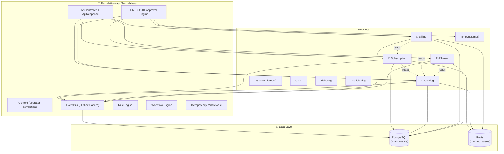

# SOPHIX BSS — Developer Onboarding (Trial Run)

> **Status:** Trial documentation for core modules  
> **Target audience:** New developers joining the SOPHIX team  
> **Last updated:** 2026-06-25

---

## 🗺️ System Overview

SOPHIX is a **modular telecom Business Support System (BSS)** built on Laravel 12. It handles everything from a customer signing up for fiber internet to billing them monthly and chasing unpaid invoices.

### The Core Flow (Customer Journey)

```
  Customer          Catalog          Subscription        Fulfillment
     │                 │                   │                   │
     │ "I want fiber"  │                   │                   │
     │────────────────>│                   │                   │
     │                 │ "Available here"  │                   │
     │                 │──────────────────>│                   │
     │                 │                   │ "Create contract" │
     │                 │                   │──────────────────>│
     │                 │                   │                   │ "Install fiber"
     │                 │                   │                   │─────────────>
     │                 │                   │    "Activated!"   │
     │                 │                   │<──────────────────│
     │  "Internet works"                 │                   │
     │<─────────────────────────────────────────────────────────│
     │                 │                   │                   │
     │  Uses internet  │                   │                   │
     │─────────────────────────────────────────────────────────>│
     │                 │                   │                   │
     │                 │                   │     Billing       │
     │                 │                   │<──────────────────│
     │  "Pay $50"      │                   │                   │
     │<─────────────────────────────────────────────────────────│
     │                 │                   │                   │
```

---

## 📚 Trial Onboarding Guides

This trial covers the **core revenue modules**. Each guide is designed to be read in ~20 minutes by a new developer.

| Module | Guide | What You'll Learn |
|--------|-------|-------------------|
| **Subscription** | [subscription.md](./subscription.md) | Customer contracts, lifecycle workflows, status transitions, scheduled jobs |
| **Catalog** | [catalog.md](./catalog.md) | Products, packages, pricing, coverage areas, tax rules, scheduled jobs |
| **Billing** | [billing.md](./billing.md) | Invoicing, payments, wallets, dunning, adjustments, scheduled jobs |
| **Fulfillment** | [Fulfillment.md](./Fulfillment.md) | Order capture, activation completion, provisioning |
| **Ilm** | [Ilm.md](./Ilm.md) | Customer master, KYC, account management |

---

## 🏗️ Architecture at a Glance

### ASCII Diagram

```
┌─────────────────────────────────────────────────────────────────────┐
│                        EXTERNAL CALLERS                              │
│  ┌──────────────┐  ┌──────────────┐  ┌──────────────┐              │
│  │ Backoffice UI │  │ External API │  │ Batch Jobs   │              │
│  │ (Inertia+Vue) │  │   Clients    │  │  (Cron)      │              │
│  └──────┬───────┘  └──────┬───────┘  └──────┬───────┘              │
└─────────┼──────────────────┼──────────────────┼──────────────────────┘
          │                  │                  │
          ▼                  ▼                  ▼
┌─────────────────────────────────────────────────────────────────────┐
│                      🧱 FOUNDATION LAYER                             │
│  ┌──────────────┐  ┌──────────────┐  ┌──────────────┐              │
│  │ ApiController│  │   Context    │  │  EventBus    │              │
│  │ +ApiResponse │  │(operator,    │  │ (Outbox)     │              │
│  │              │  │ correlation)  │  │              │              │
│  └──────────────┘  └──────────────┘  └──────────────┘              │
│  ┌──────────────┐  ┌──────────────┐  ┌──────────────┐              │
│  │ RuleEngine   │  │WorkflowEngine│  │Idempotency   │              │
│  │              │  │              │  │  Middleware   │              │
│  └──────────────┘  └──────────────┘  └──────────────┘              │
│  ┌──────────────┐  ┌──────────────┐  ┌──────────────┐              │
│  │ EM-CFG-04    │  │              │  │              │              │
│  │ Approval     │  │              │  │              │              │
│  │ Engine       │  │              │  │              │              │
│  └──────────────┘  └──────────────┘  └──────────────┘              │
└─────────────────────────────────────────────────────────────────────┘
          │                  │                  │
          ▼                  ▼                  ▼
┌─────────────────────────────────────────────────────────────────────┐
│                        MODULES LAYER                                 │
│  ┌──────────┐ ┌──────────┐ ┌──────────┐ ┌──────────┐ ┌──────────┐ │
│  │  📗      │ │  📘      │ │  📙      │ │  📦      │ │  👤      │ │
│  │ Catalog  │ │Subscription│ │ Billing  │ │Fulfillment│ │   Ilm    │ │
│  │          │ │          │ │          │ │          │ │          │ │
│  │ Products │ │ Contracts│ │ Invoices │ │ Orders   │ │ Customers│ │
│  │ Packages │ │ Lifecycle│ │ Payments │ │ Install  │ │ KYC      │ │
│  │ HomePass │ │ Events   │ │ Dunning  │ │ Activate │ │ Accounts │ │
│  └──────────┘ └──────────┘ └──────────┘ └──────────┘ └──────────┘ │
│  ┌──────────┐ ┌──────────┐ ┌──────────┐ ┌──────────┐ ┌──────────┐ │
│  │WorkOrder │ │   OSR    │ │   CRM    │ │Ticketing │ │  Rules   │ │
│  │          │ │ Equipment│ │          │ │          │ │          │ │
│  └──────────┘ └──────────┘ └──────────┘ └──────────┘ └──────────┘ │
└─────────────────────────────────────────────────────────────────────┘
          │                  │                  │
          ▼                  ▼                  ▼
┌─────────────────────────────────────────────────────────────────────┐
│                        DATA LAYER                                    │
│  ┌──────────────────────────────────────────────────────────────┐   │
│  │  PostgreSQL (Authoritative)                                  │   │
│  │  ├─ subscriptions, invoices, packages, customers, ...       │   │
│  │  ├─ event_outbox (transactional events)                     │   │
│  │  ├─ approval_requests, approval_decisions (EM-CFG-04)       │   │
│  │  └─ process_instances, task_queues (workflow state)           │   │
│  └──────────────────────────────────────────────────────────────┘   │
│  ┌──────────────────────────────────────────────────────────────┐   │
│  │  Redis (Cache / Queue / Session)                              │   │
│  │  ├─ job queues (billing, dunning, reports)                   │   │
│  │  ├─ cache (catalog lookups, session state)                   │   │
│  │  └─ rate limiting, pub/sub                                   │   │
│  └──────────────────────────────────────────────────────────────┘   │
└─────────────────────────────────────────────────────────────────────┘
```

### Mermaid Diagram (for renderers that support it)



---

## 🎯 Key Design Principles

Every module follows these rules. If you understand these, you understand 80% of SOPHIX:

### 1. One Write Owner Per Table
> **Rule:** Only one module can write to a given table. Other modules call APIs or consume events.

| Table | Owned By | Others Can... |
|-------|----------|---------------|
| `subscriptions` | Subscription | Read, listen to events |
| `packages`, `home_passes` | Catalog | Read, validate refs |
| `invoices`, `payments` | Billing | Read (for reporting) |
| `customers`, `accounts` | Ilm | Read (for lookups) |
| `work_orders` | WorkOrder | Read (for dashboards) |

**Why this matters:** It prevents data corruption. If two modules write to the same table, they can overwrite each other's changes. By having one owner, we know exactly who is responsible for the data.

### 2. Transactional Outbox
> **Rule:** DB writes and event publishing happen in the same transaction.

```php
DB::transaction(function () {
    $record = Model::create($data);     // 1. Write to DB
    $events->publish(new DomainEvent(   // 2. Publish event (outbox table)
        type: 'SomethingHappened',
        ...
    ));
});                                     // 3. Both succeed, or both roll back
```

**Why this matters:** If the DB write fails, the event is never published. If the event fails, the DB rolls back. This means you can never have "the customer was created but no one was notified" or "the invoice was generated but no one knows about it."

### 3. Config-Driven, Not Code-Driven
> **Rule:** Business rules (status codes, tax rules, dunning policies) live in the database, not in PHP files.

- Status codes → `*_status_codes` tables
- Tax rules → `tax_configs` table
- Dunning policies → `dunning_config` table
- Workflow definitions → `process_definitions` table
- Service categories → `service_categories` table

**Why this matters:** When a new country wants to add a 5% telecom tax, you add a row in the database. You don't redeploy code. When a new operator wants a different dunning schedule, you add a config row. No code changes, no testing, no deployment risk.

### 4. Multi-Operator (Multi-Tenant)
> **Rule:** Every record has an `operator_code`. The `X-Operator-Code` header scopes all queries.

```php
// In controllers:
Model::query()
    ->where('operator_code', Context::operatorCode())  // Never forget this!
    ->get();
```

**Why this matters:** One SOPHIX instance can serve multiple telecom operators. Operator A's customers never see Operator B's data. The `operator_code` is like a namespace — it partitions the entire database.

### 5. Idempotency on Commands
> **Rule:** Any command that changes state (POST/PUT/PATCH) should be idempotent.

```http
POST /api/subscriptions
Idempotency-Key: abc-123-xyz

# Same key → same result. Safe to retry.
```

**Why this matters:** Networks are unreliable. If a client sends "create subscription" and the connection drops, the client doesn't know if it worked. With idempotency, it can safely retry with the same key. If the first request succeeded, the retry returns the same result without creating a duplicate.

### 6. Approval via EM-CFG-04 (Unified Approval Engine)
> **Rule:** Sensitive operations requiring approval use the unified EM-CFG-04 approval engine.

The EM-CFG-04 approval engine is a **platform-wide Foundation service** (`app/Foundation/Approvals/ApprovalService.php`) that replaces bespoke approval logic in every module. It supports:

- **Multi-stage ordered chains:** Approval is not a flat count — it's a sequence of stages. Each stage must be cleared before the next opens.
- **Two configuration modes:**
  - *Static config:* `approval_definition` + `approval_stage` rows define who must approve what.
  - *Dynamic stages:* The caller supplies the chain at request time (e.g., a rules engine decides N approvals per case).
- **Stage properties:** Each stage has `approver_kind` (ROLE or USER), `approver_roles` (role pool), `approver_user_ref` (named user), `required_approvals` (quorum), and `allow_requester` (SoD toggle).
- **Frozen snapshots:** The chain is frozen in `stages_snapshot` at request time. Config changes after the request don't affect in-flight requests.
- **Distinct approvers:** One person cannot fill multiple slots in the same stage (dual-control enforcement).
- **Auto-approval:** Below a configurable threshold amount, requests auto-approve without human review.

**Previously**, KYC approvals (Ilm), billing adjustments (Billing), and HomePass status changes (Catalog) each had their own bespoke approval logic. Now all of them use EM-CFG-04 via their respective `approval_definition` rows. When you need approval for a new sensitive operation, you add a definition row — not new code.

```php
// Any module can request approval
$approval = app(ApprovalService::class)->request([
    'entity_type' => 'BILLING_ADJUSTMENT',
    'action' => 'CREDIT_NOTE',
    'amount' => 500.00,
    'entity_ref' => $invoice->id,
]);

// The engine handles: multi-stage chains, quorum, distinct approvers, SoD
// Returns PENDING, APPROVED, AUTO_APPROVED, or REJECTED
```

---

## 🚀 New Dev Onboarding Path

### ASCII Timeline

```
Day 1        Day 2        Day 3        Day 4        Day 5
  │            │            │            │            │
  ▼            ▼            ▼            ▼            ▼
┌─────┐     ┌─────┐     ┌─────┐     ┌─────┐     ┌─────┐
│Read │     │Run  │     │Read │     │Post-│     │Pick │
│ARCHI│     │docker│     │guides│    │man  │     │ticket│
│TECT.│     │compose│    │(3x) │     │tests│     │     │
│md   │     │up   │     │     │     │     │     │     │
└─────┘     └─────┘     └─────┘     └─────┘     └─────┘
     │            │            │            │            │
     ▼            ▼            ▼            ▼            ▼
┌─────┐     ┌─────┐     ┌─────┐     ┌─────┐     ┌─────┐
│Explore│    │Seed │     │Trace│     │Debug│     │Code │
│Found.│     │DB   │     │event│     │fail-│     │review│
│layer │     │     │     │flow │     │ures │     │     │
└─────┘     └─────┘     └─────┘     └─────┘     └─────┘
```

**Recommended order:**
1. Read `docs/ARCHITECTURE.md` (15 min)
2. Explore `app/Foundation/` — understand the base classes (30 min)
3. Read the trial guides in this directory (60 min)
4. Run `docker compose up` and seed the database (10 min)
5. Run tests: `php artisan test` (5 min)
6. Try Postman collections in `postman/` (20 min)
7. Pick a ticket from the backlog!

---

## 📂 Full Module Map

All 16+ modules in the system:

| Module | Bundle | Status | Guide | What It Does |
|--------|--------|--------|-------|--------------|
| **Catalog** | 09_catalogs | ✅ Active | [catalog.md](./catalog.md) | Products, packages, pricing, tax, HomePass |
| **Subscription** | 03 + 04 | ✅ Active | [subscription.md](./subscription.md) | Customer contracts, lifecycle, operations |
| **Billing** | 05 | ✅ Active | [billing.md](./billing.md) | Invoicing, payments, dunning, wallets |
| **Fulfillment** | 06 | ✅ Active | [Fulfillment.md](./Fulfillment.md) | Order capture, activation, provisioning |
| **Ilm** | 01_foundations | ✅ Active | [Ilm.md](./Ilm.md) | Customer master, KYC, accounts |
| WorkOrder | 07 | ✅ Active | *(pending)* | Install/shifting work orders |
| OSR | 08 | ✅ Active | *(pending)* | Equipment inventory, RMA |
| CRM | 10_other | ✅ Active | *(pending)* | Leads, campaigns, sales |
| Ticketing | 10_other | ✅ Active | *(pending)* | Support tickets, SLA |
| Notification | 10_other | ✅ Active | *(pending)* | SMS, email, push notifications |
| Reporting | 10_other | ✅ Active | *(pending)* | Dashboards, exports |
| PaymentGateway | 05 | ✅ Active | *(pending)* | M-Pesa, bank, card integrations |
| Provisioning | 06 | ✅ Active | *(pending)* | Network activation, RADIUS |
| Rbac | 01_foundations | ✅ Active | *(pending)* | Users, roles, permissions |
| Rules | 01_foundations | ✅ Active | *(pending)* | Business policy engine |
| Workflow | 02_framework | ✅ Active | *(pending)* | BPMN process engine |
| ItOps | 10_other | ✅ Active | *(pending)* | Internal tools, monitoring |
| Workforce | 07 | ✅ Active | *(pending)* | Technician dispatch |

---

## 🔧 Common Patterns (Cross-Module)

### Pattern 1: How to Trace an Event Through the System

When debugging, follow the event outbox:

```bash
# 1. Find the event
SELECT * FROM event_outbox
WHERE aggregate_id = 'sub_xxx'
ORDER BY created_at DESC;

# 2. Check delivery status
SELECT * FROM event_outbox
WHERE event_id = 'evt_xxx'
  AND delivered = false;

# 3. Check consumer logs
php artisan queue:work --queue=events
# Or check Redis stream consumers
```

**Why this matters:** The outbox is the source of truth for cross-module communication. If Billing never received a `SubscriptionActivated` event, the outbox will show whether it was published (and not delivered) or never published at all.

### Pattern 2: How to Debug a Stuck Workflow

```bash
# Find the process instance
SELECT * FROM process_instances WHERE business_key = 'sub_xxx';

# Check current activity
SELECT * FROM process_activities WHERE instance_id = 'pi_xxx';

# Check if an external task is waiting
SELECT * FROM external_tasks WHERE instance_id = 'pi_xxx';

# Check job queue for the instance
php artisan queue:retry --queue=workflow
```

**Why this matters:** Workflows can get stuck for many reasons: a handler threw an exception, an external task timed out, or a message was never correlated. These queries let you pinpoint exactly where the workflow is parked.

### Pattern 3: How to Add a New Operator

1. Create operator config row in `operators` table
2. Seed status codes for the operator (subscription, homepass, etc.)
3. Seed tax configs for the operator's region
4. Seed dunning config for the operator's policies
5. Seed approval definitions for the operator's sensitive operations
6. Create operator-specific process definitions (or clone from template)
7. Assign users to the operator with appropriate roles
8. Run operator-specific tests: `php artisan test --filter=OperatorTests`

**Why this matters:** SOPHIX is multi-tenant. Adding a new operator should be configuration, not code. But you need to seed all the config tables or the operator won't have any business rules to operate with.

### Pattern 4: How to Verify EM-CFG-04 Approval Chain for an Operation

```bash
# Check the approval definition
SELECT * FROM approval_definitions
WHERE operator_code = 'DEFAULT'
  AND entity_type = 'BILLING_ADJUSTMENT';

# Check the stages
SELECT * FROM approval_stages
WHERE definition_id = 'def_xxx'
ORDER BY sequence;

# Check a specific request
SELECT * FROM approval_requests WHERE entity_ref = 'inv_xxx';

# Check decision history
SELECT * FROM approval_decisions WHERE request_id = 'appr_xxx';
```

**Why this matters:** When an approval "doesn't work," the problem is usually in the definition (wrong roles), the stages (missing sequence), or the actor (missing role). These queries show the full chain from policy to request to decision.

### Pattern 5: How to Run a Single Module's Tests in Isolation

```bash
# Run only Subscription tests
php artisan test --filter=Subscription

# Run a specific test class
php artisan test --filter=SubscriptionOperationTest

# Run with coverage
php artisan test --filter=Subscription --coverage --min=80

# Run in parallel (if configured)
php artisan test --filter=Subscription --parallel
```

**Why this matters:** Full test suites can take 5+ minutes. When you're iterating on one module, run only its tests for fast feedback.

### Pattern 6: How to Inspect the Context for a Request

```php
// In a controller or service
use App\Foundation\Support\Context;

$ctx = [
    'operator' => Context::operatorCode(),
    'user' => Context::userId(),
    'correlation' => Context::correlationId(),
    'request_id' => Context::requestId(),
];
// Log this for debugging cross-request issues
```

**Why this matters:** Context carries the operator, user, correlation ID, and request ID through the entire call stack. When debugging "why did this subscription get created for Operator B instead of A?", the context tells you exactly which request caused it.

### Pattern 7: How to Check Database Locks and Deadlocks

```bash
# Check for long-running queries (potential locks)
SELECT pid, state, query_start, query
FROM pg_stat_activity
WHERE state = 'active'
  AND query_start < NOW() - INTERVAL '30 seconds';

# Check for blocked queries
SELECT blocked_locks.pid AS blocked_pid,
       blocking_locks.pid AS blocking_pid,
       blocked_activity.query AS blocked_query
FROM pg_locks blocked_locks
JOIN pg_stat_activity blocked_activity ON blocked_activity.pid = blocked_locks.pid
JOIN pg_locks blocking_locks ON blocking_locks.locktype = blocked_locks.locktype
JOIN pg_stat_activity blocking_activity ON blocking_activity.pid = blocking_locks.pid
WHERE NOT blocked_locks.granted;
```

**Why this matters:** Invoice generation, payment allocation, and approval decisions all use row locking. Under high load, deadlocks can occur. These queries help you identify the culprit.

### Pattern 8: How to Mock a Module Dependency in Tests

```php
// When testing Subscription, mock Catalog to avoid DB setup
$this->mock(CatalogService::class, function ($mock) {
    $mock->shouldReceive('validatePackage')
        ->with('pkg_basic_100')
        ->andReturn(true);
});

// Or use a fake event bus to assert events were published
$this->mock(EventBus::class, function ($mock) {
    $mock->shouldReceive('publish')
        ->once()
        ->with(\Mockery::on(function ($event) {
            return $event->type === 'SubscriptionCreated';
        }));
});
```

**Why this matters:** Unit tests should be fast and isolated. Mocking module boundaries means your Subscription test doesn't need Catalog data seeded. Integration tests (Feature tests) should use real dependencies.

### Pattern 9: How to Read a Module's Event Contract

```bash
# Find all event types published by a module
# Subscription events
grep -r "const.*=" Modules/Subscription/app/Events/ | grep -v TOPIC

# Or read the Events class directly
cat Modules/Subscription/app/Events/SubscriptionEvents.php

# Find all listeners that consume a specific event
grep -r "SubscriptionCreated" Modules/*/app/Listeners/
```

**Why this matters:** Events are the API between modules. Before you change an event payload, you need to know who consumes it. These commands show the full producer/consumer graph.

### Pattern 10: How to Handle a Production Incident (Playbook)

```bash
# 1. Identify the scope
php artisan tinker --execute="dd(DB::table('subscriptions')->where('status', 'PENDING_UPGRADE')->count());"

# 2. Check the error rate in logs
tail -f storage/logs/laravel.log | grep ERROR

# 3. Check queue health
php artisan queue:monitor

# 4. Check database connections
php artisan db:monitor

# 5. If a workflow is stuck, manually retry
php artisan workflow:retry --business-key=sub_xxx

# 6. If an approval is stuck, check the chain
php artisan tinker --execute="
    $req = App\Models\ApprovalRequest::where('entity_ref', 'xxx')->first();
    dd($req->stages_snapshot);
"
```

**Why this matters:** When production is on fire, you need a systematic approach. These commands let you quickly narrow down whether the issue is in the database, the queue, a stuck workflow, or an approval bottleneck.

---

## 🤝 How to Give Feedback

This is a **trial run.** We're iterating on format, depth, and tone before scaling to all modules.

**Questions to ask yourself:**
- Is the language simple enough for a junior dev?
- Are the ASCII diagrams helpful? Are the Mermaid ones rendering?
- Is there too much detail? Too little?
- What's missing that you'd need on day 1?
- Should we add more code examples? Fewer?
- Are the scheduled jobs / batch sections clear?

**Drop your feedback** in the team Slack or as a PR to this repo.

---

> **Happy coding!** 🚀  
> Remember: *motion changes the emotional weather. small progress is real progress.*
