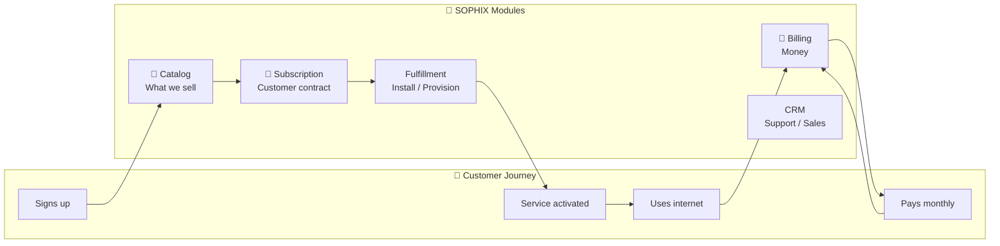
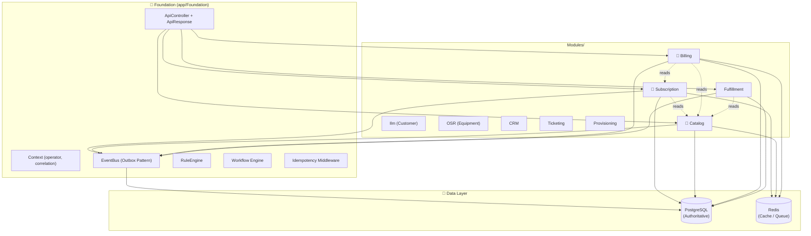

# SOPHIX BSS — Developer Onboarding (Trial Run)

> **Status:** Trial documentation for 3 core modules  
> **Target audience:** New developers joining the SOPHIX team  
> **Last updated:** 2026-06-25

---

## 🗺️ System Overview

SOPHIX is a **modular telecom Business Support System (BSS)** built on Laravel 12. It handles everything from a customer signing up for fiber internet to billing them monthly and chasing unpaid invoices.

### The Core Flow



---

## 📚 Trial Onboarding Guides

This trial covers the **3 revenue-critical modules** (Wave 1). Each guide is designed to be read in ~15 minutes by a new developer.

| Module | Guide | What You'll Learn |
|--------|-------|-------------------|
| **Subscription** | [subscription.md](./subscription.md) | Customer contracts, lifecycle workflows, status transitions |
| **Catalog** | [catalog.md](./catalog.md) | Products, packages, pricing, coverage areas, tax rules |
| **Billing** | [billing.md](./billing.md) | Invoicing, payments, wallets, dunning, adjustments |

---

## 🏗️ Architecture at a Glance



---

## 🎯 Key Design Principles

Every module follows these rules. If you understand these, you understand 80% of SOPHIX:

### 1. One Write Owner Per Table
> **Rule:** Only one module can write to a given table. Other modules call APIs or consume events.

| Table | Owned By | Others Can... |
|-------|----------|---------------|
| `subscriptions` | Subscription | Read, listen to events |
| `packages`, `home_passes` | Catalog | Read, validate refs |
| `invoices`, `payments` | Billing | Read (for reporting) |

### 2. Transactional Outbox
> **Rule:** DB writes and event publishing happen in the same transaction.

```php
DB::transaction(function () {
    $record = Model::create($data);     // 1. Write to DB
    $events->publish(new DomainEvent(   // 2. Publish event (outbox table)
        type: 'SomethingHappened',
        ...
    ));
});                                     // 3. Both succeed, or both roll back
```

### 3. Config-Driven, Not Code-Driven
> **Rule:** Business rules (status codes, tax rules, dunning policies) live in the database, not in PHP files.

- Status codes → `*_status_codes` tables
- Tax rules → `tax_configs` table
- Dunning policies → `dunning_config` table
- Workflow definitions → `process_definitions` table

### 4. Multi-Operator (Multi-Tenant)
> **Rule:** Every record has an `operator_code`. The `X-Operator-Code` header scopes all queries.

```php
// In controllers:
Model::query()
    ->where('operator_code', Context::operatorCode())  // Never forget this!
    ->get();
```

### 5. Idempotency on Commands
> **Rule:** Any command that changes state (POST/PUT/PATCH) should be idempotent.

```http
POST /api/subscriptions
Idempotency-Key: abc-123-xyz

# Same key → same result. Safe to retry.
```

---

## 🚀 New Dev Onboarding Path

```mermaid
flowchart LR
    START(["Day 1"])
    ARCHI["Read ARCHITECTURE.md"]
    FOUND["Explore app/Foundation"]
    TRIAL["Read these 3 guides"]
    RUN["docker compose up"]
    TEST["Run tests"]
    POSTMAN["Try Postman collections"]
    CODE["Pick a ticket, start coding"]

    START --> ARCHI
    ARCHI --> FOUND
    FOUND --> TRIAL
    TRIAL --> RUN
    RUN --> TEST
    TEST --> POSTMAN
    POSTMAN --> CODE
```



**Recommended order:**
1. Read `docs/ARCHITECTURE.md` (15 min)
2. Explore `app/Foundation/` — understand the base classes (30 min)
3. Read the 3 trial guides in this directory (45 min)
4. Run `docker compose up` and seed the database (10 min)
5. Run tests: `php artisan test` (5 min)
6. Try Postman collections in `postman/` (20 min)
7. Pick a ticket from the backlog!

---

## 📂 Full Module Map

All 16 modules in the system:

| Module | Bundle | Status | Guide |
|--------|--------|--------|-------|
| **Catalog** | 09_catalogs | ✅ Active | [catalog.md](./catalog.md) |
| **Subscription** | 03 + 04 | ✅ Active | [subscription.md](./subscription.md) |
| **Billing** | 05 | ✅ Active | [billing.md](./billing.md) |
| Fulfillment | 06 | ✅ Active | *(pending)* |
| WorkOrder | 07 | ✅ Active | *(pending)* |
| OSR | 08 | ✅ Active | *(pending)* |
| Ilm | 01_foundations | ✅ Active | *(pending)* |
| CRM | 10_other | ✅ Active | *(pending)* |
| Ticketing | 10_other | ✅ Active | *(pending)* |
| Notification | 10_other | ✅ Active | *(pending)* |
| Reporting | 10_other | ✅ Active | *(pending)* |
| PaymentGateway | 05 | ✅ Active | *(pending)* |
| Provisioning | 06 | ✅ Active | *(pending)* |
| Rbac | 01_foundations | ✅ Active | *(pending)* |
| Rules | 01_foundations | ✅ Active | *(pending)* |
| Workflow | 02_framework | ✅ Active | *(pending)* |
| ItOps | 10_other | ✅ Active | *(pending)* |
| Workforce | 07 | ✅ Active | *(pending)* |

---

## 🤝 How to Give Feedback

This is a **trial run.** We're iterating on format, depth, and tone before scaling to all 16 modules.

**Questions to ask yourself:**
- Is the language simple enough for a junior dev?
- Are the Mermaid diagrams helpful or confusing?
- Is there too much detail? Too little?
- What's missing that you'd need on day 1?
- Should we add more code examples? Fewer?

**Drop your feedback** in the team Slack or as a PR to this repo.

---

> **Happy coding!** 🚀  
> Remember: *motion changes the emotional weather. small progress is real progress.*
