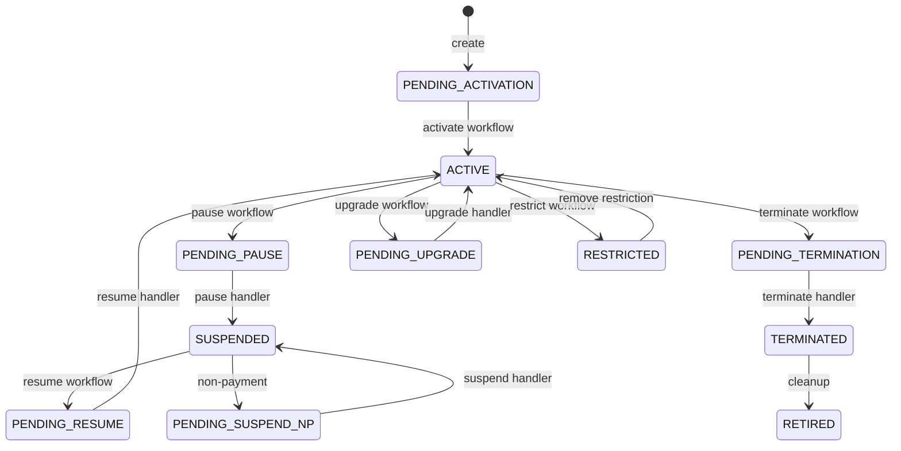

# 📋 Subscription Module

> **Module path:** `Modules/Subscription/`  
> **Design doc:** `DD_SUB-LM-01` (subscription master), `DD_SUB-WF-*` (operations framework)

---

## 1. Module Overview

The Subscription module is the **single source of truth** for every customer's subscription state. It owns the `subscription` table — no other module is allowed to write to it directly. When a customer signs up, changes their plan, pauses, or cancels, this module records the lifecycle transition and publishes events so other modules (Billing, Provisioning, WorkOrder) can react.

Think of it as the **subscription heartbeat** of the system: it tells everyone else what the subscription's status is, and it is the only place that decides when a status changes.

---

## 2. What This Module Does

- **Stores subscription master data** — customer ID, account ID, package, home pass, billing mode, cycle dates, current status
- **Drives lifecycle operations** — activate, pause, resume, suspend, terminate, upgrade, downgrade, relocate, migrate
- **Publishes status events** — every status change emits a `DomainEvent` to the `subscription.lifecycle` topic
- **Tracks operation history** — each operation (upgrade, terminate, etc.) is recorded as a `SubscriptionOperation` row, linked to a workflow process instance
- **Manages restrictions** — partial-service restrictions (e.g., speed-capped) applied to active subscriptions

---

## 3. Key Concepts

| Term | Meaning |
|------|---------|
| **Subscription** | A single row in the `subscription` table representing one customer's service agreement. It has a status like `ACTIVE`, `SUSPENDED`, `TERMINATED`. |
| **Status Code** | The current state of the subscription. There are ~15 statuses. Some are **rest states** (stable), some are **pending states** (transient while a workflow runs). |
| **Operation** | A business action like "upgrade package" or "terminate service". Each operation triggers a workflow process. |
| **Workflow / Process Definition** | A data-driven flow (stored in `process_definitions` table) that orchestrates the steps of an operation. The shape is authored in a studio, not in PHP code. |
| **Task Handler** | A PHP class that implements one step in a workflow (e.g., `ActivateHandler`). Handlers are registered in a toolbox and wired together by process definitions. |
| **Lifecycle Event** | A domain event published when a subscription's status changes (e.g., `SubscriptionActivated`, `SubscriptionUpgraded`). Other modules listen to these. |

---

## 4. Architecture Diagram

### Module Placement

```mermaid
flowchart TB
    subgraph Clients
        Portal[Customer Portal]
        Desk[Back-Office Desk]
        API[External API]
    end

    subgraph SOPHIX
        direction TB
        SUB[Subscription Module]
        WF[Workflow Engine]
        BIL[Billing]
        PROV[Provisioning]
        WO[WorkOrder]
        CAT[Catalog]
        EVT[Event Bus]
    end

    Portal -->|POST /subscriptions/{id}/upgrade| SUB
    Desk -->|POST /subscriptions/{id}/pause| SUB
    API -->|GET /subscriptions| SUB

    SUB -->|starts| WF
    WF -->|calls TaskHandlers| SUB
    SUB -->|emits events| EVT
    EVT -->|listens| BIL
    EVT -->|listens| PROV
    EVT -->|listens| WO
    SUB -->|reads packages| CAT
    SUB -->|creates work orders| WO
```

### Status State Machine



---

## 5. Code Tour

### Key Files and What They Do

```
Modules/Subscription/
├── routes/api.php                          # API routes (REST endpoints)
├── app/
│   ├── Models/
│   │   ├── Subscription.php               # The master model — statuses, dates, tenant-scoped
│   │   ├── SubscriptionOperation.php      # Ledger of every workflow-triggered operation
│   │   ├── SubscriptionOperationConfig.php # Per-operator config (which operations enabled, which BPMN key)
│   │   └── SubscriptionPauseHistory.php   # Tracks suspension/pause periods for billing
│   ├── Services/
│   │   ├── SubscriptionService.php        # The ONLY writer of the subscription row. Creates, transitions status.
│   │   └── OperationFramework.php         # Starts workflow processes for operations (idempotent, exclusive)
│   ├── Http/Controllers/
│   │   ├── SubscriptionController.php     # CRUD + list subscriptions
│   │   ├── OperationController.php        # Triggers operations (activate, pause, upgrade, etc.)
│   │   └── RestrictionController.php      # Adds/removes partial-service restrictions
│   ├── Events/
│   │   └── SubscriptionEvents.php         # Canonical event type constants (CREATED, ACTIVATED, etc.)
│   ├── Workflow/                          # Task handlers (the "toolbox" steps)
│   │   ├── ActivateHandler.php            # Sets subscription ACTIVE, opens first billing cycle
│   │   ├── PauseHandler.php               # Sets SUSPENDED, records pause history
│   │   ├── ResumeHandler.php              # Resumes from SUSPENDED, closes pause history
│   │   ├── TerminateHandler.php           # Sets TERMINATED
│   │   ├── SuspendHandler.php             # Non-payment suspension
│   │   ├── ChangePackageHandler.php       # Applies package upgrade/downgrade
│   │   ├── ChangeHomePassHandler.php      # Applies home pass relocation
│   │   ├── ValidateOperationHandler.php   # Pre-flight validation before any operation
│   │   ├── ValidateActivationHandler.php  # Checks invoice status before activation
│   │   ├── BillingIntentHandler.php       # Creates billing intent (deposit/invoice)
│   │   ├── FulfillmentCallHandler.php     # Calls provisioning to activate service
│   │   ├── EquipmentPickupHandler.php     # Handles equipment swap/return
│   │   ├── CreateShiftingWoHandler.php    # Creates a shifting work order
│   │   ├── EnterPendingStatusHandler.php  # Moves subscription into a transient PENDING_* state
│   │   └── SyncOperationFromProcess.php   # Reconciles operation ledger when workflow ends
│   ├── Listeners/
│   │   ├── ConfirmBillingIntentOnPayment.php # When a payment event arrives, confirms billing intent
│   │   └── ConfirmPrepaidIntentOnTopup.php   # When a top-up event arrives, confirms prepaid intent
│   └── Providers/
│       ├── SubscriptionServiceProvider.php       # Standard Laravel module provider
│       ├── SubscriptionWorkflowProvider.php      # Registers all task handlers + event listeners
│       └── EventServiceProvider.php            # (empty — event discovery is automatic)
```

---

## 6. API Surface

All endpoints are under `/api/` and require `auth:sanctum`.

### Subscription CRUD

| Method | Endpoint | Permission | What It Does |
|--------|----------|------------|--------------|
| `GET` | `/subscriptions` | `subscription.read` | List subscriptions (paginated, filter by `accountId`, `customerId`, `status`) |
| `POST` | `/subscriptions` | `subscription.create` | Create a new subscription (usually called internally by Fulfillment) |
| `GET` | `/subscriptions/{subscription}` | `subscription.read` | Get one subscription by ID |

### Lifecycle Operations

| Method | Endpoint | Permission | What It Does |
|--------|----------|------------|--------------|
| `POST` | `/subscriptions/{subscription}/activate` | `subscription.activate` | Triggers activation workflow → ACTIVE |
| `POST` | `/subscriptions/{subscription}/pause` | `subscription.manage` | Triggers pause workflow → SUSPENDED |
| `POST` | `/subscriptions/{subscription}/resume` | `subscription.manage` | Triggers resume workflow → ACTIVE |
| `POST` | `/subscriptions/{subscription}/terminate` | `subscription.manage` | Triggers termination workflow → TERMINATED |
| `POST` | `/subscriptions/{subscription}/upgrade` | `subscription.manage` | Triggers upgrade workflow (new package) |
| `POST` | `/subscriptions/{subscription}/downgrade` | `subscription.manage` | Triggers downgrade workflow (new package) |
| `POST` | `/subscriptions/{subscription}/relocate` | `subscription.manage` | Triggers relocation workflow (new home pass) |
| `POST` | `/subscriptions/{subscription}/migrate` | `subscription.manage` | Triggers migration workflow (package + home pass) |
| `POST` | `/subscriptions/{subscription}/suspend-np` | `BILLING_INTERNAL` role | System-driven non-payment suspension |

### Restrictions

| Method | Endpoint | Permission | What It Does |
|--------|----------|------------|--------------|
| `POST` | `/subscriptions/{subscription}/restrictions` | `subscription.manage` | Add a partial restriction |
| `DELETE` | `/subscriptions/{subscription}/restrictions/{restriction}` | `subscription.manage` | Remove a restriction |

**Response pattern:** All `POST` operation endpoints return `202 ACCEPTED` with an `operationId` and `nextAction: TRACK_OPERATION`. The actual work happens asynchronously in the workflow engine.

---

## 7. Events

### Events This Module Emits

Published to topic: **`subscription.lifecycle`**

| Event Type | When It Happens | Key Payload Fields |
|------------|-----------------|-------------------|
| `SubscriptionCreated` | New subscription row inserted | `subscriptionId`, `accountId`, `packageRef`, `status` |
| `SubscriptionActivated` | Status becomes `ACTIVE` | `subscriptionId`, `status` |
| `SubscriptionSuspended` | Status becomes `SUSPENDED` (voluntary) | `subscriptionId`, `status` |
| `SubscriptionSuspendedForNonPayment` | Status becomes `SUSPENDED` (non-payment) | `subscriptionId`, `status` |
| `SubscriptionPaused` | Deprecated alias for suspended | `subscriptionId`, `status` |
| `SubscriptionResumed` | Status returns to `ACTIVE` | `subscriptionId`, `status` |
| `SubscriptionTerminated` | Status becomes `TERMINATED` | `subscriptionId`, `status` |
| `SubscriptionUpgraded` | Package upgrade completed | `subscriptionId`, `status` |
| `SubscriptionDowngraded` | Package downgrade completed | `subscriptionId`, `status` |
| `SubscriptionRelocated` | Home pass change completed | `subscriptionId`, `status` |
| `SubscriptionMigrated` | Package + home pass change completed | `subscriptionId`, `status` |
| `SubscriptionStatusChanged` | Catch-all for any status change | `subscriptionId`, `status` |
| `SubscriptionOperationStarted` | A workflow operation begins | `subscriptionId`, `operationType` |
| `SubscriptionOperationCompleted` | A workflow operation succeeds | `subscriptionId`, `operationType` |
| `SubscriptionOperationFailed` | A workflow operation fails | `subscriptionId`, `operationType`, `reason` |
| `SubscriptionOperationCancelled` | A workflow operation is cancelled | `subscriptionId`, `operationType` |
| `SubscriptionRestrictionAdded` | Partial restriction applied | `subscriptionId`, `restrictionType` |
| `SubscriptionRestrictionRemoved` | Partial restriction lifted | `subscriptionId`, `restrictionType` |

### Events This Module Listens To

| Event | Listener | What It Does |
|-------|----------|--------------|
| `OutboxEventPublished` (payment received) | `ConfirmBillingIntentOnPayment` | Finds pending billing intent and resumes the workflow |
| `OutboxEventPublished` (top-up received) | `ConfirmPrepaidIntentOnTopup` | Finds pending prepaid intent and resumes the workflow |
| `ProcessInstanceEnded` | `SyncOperationFromProcess` | Updates `SubscriptionOperation` ledger when a workflow finishes |

---

## 8. Dependencies

### What This Module Needs

| Module | How It Uses It | File Paths |
|--------|----------------|------------|
| **Workflow** | Starts process instances, listens for process end events | `OperationFramework.php`, `SyncOperationFromProcess.php` |
| **Catalog** | Validates package refs, home pass refs during operations | `ValidatePackageChangeHandler.php`, `ValidateHomePassChangeHandler.php` |
| **Billing** | Creates billing intents, confirms payment events | `BillingIntentHandler.php`, `ConfirmBillingIntentOnPayment.php` |
| **Provisioning** | Calls to activate service on network | `FulfillmentCallHandler.php` |
| **WorkOrder** | Creates shifting work orders | `CreateShiftingWoHandler.php` |
| **Osr** | Equipment swaps and returns | `EquipmentPickupHandler.php` |

### What Depends on This Module

| Module | Why |
|--------|-----|
| **Billing** | Listens to `SubscriptionActivated` to open first billing cycle |
| **Provisioning** | Listens to status changes to activate/deactivate services |
| **Fulfillment** | Calls `SubscriptionService::create()` and `SubscriptionService::transitionStatus()` during order capture |
| **WorkOrder** | Reads subscription data to create install/shifting orders |
| **Reporting** | Aggregates subscription data for dashboards |

---

## 9. Common Patterns

### Pattern 1: The Only Writer

**Rule:** Only `SubscriptionService` writes to the `subscription` table. Workflows call `SubscriptionService` methods, they never update the model directly.

```php
// Good: workflow handler calls the service
class ActivateHandler implements TaskHandler
{
    public function __construct(private readonly SubscriptionService $subscriptions) {}

    public function handle(TaskContext $context): TaskResult
    {
        $subscription = Subscription::query()->find($context->businessKey());
        $this->subscriptions->transitionStatus($subscription, Subscription::ACTIVE, $extra);
        return TaskResult::success(['subscriptionStatus' => Subscription::ACTIVE]);
    }
}
```

### Pattern 2: Transaction + Event

Every state mutation happens inside a DB transaction, and the event is published in the same transaction (transactional outbox pattern). This means: if the DB commit fails, the event is never published. If the event fails, the DB rolls back.

```php
// From SubscriptionService::create()
return DB::transaction(function () use ($data) {
    $subscription = Subscription::query()->create($data);
    $this->emit(SubscriptionEvents::CREATED, $subscription, [...]);
    return $subscription;
});
```

### Pattern 3: Idempotent Operations

The `OperationFramework` guarantees that the same `idempotencyKey` + `operator` returns the same operation row. It also prevents two operations of the same kind from running simultaneously on the same subscription.

```php
// In OperationFramework::trigger()
$existing = SubscriptionOperation::query()
    ->where('operator_code', $subscription->operator_code)
    ->where('idempotency_key', $idempotencyKey)
    ->first();
if ($existing) {
    return $existing; // replay: same result, no new work
}
```

### Pattern 4: Pending Status Pattern

Before a workflow starts, the subscription moves into a transient `PENDING_*` state. This signals to the UI that "something is happening." When the workflow completes (or fails), the subscription moves to a rest state (`ACTIVE`, `SUSPENDED`, etc.).

```php
// OperationController triggers upgrade
public function upgrade(Request $request, Subscription $subscription): JsonResponse
{
    return $this->trigger($request, $subscription, 'UPGRADE', $data);
    // → OperationFramework starts workflow
    // → Workflow first step: EnterPendingStatusHandler sets PENDING_UPGRADE
    // → Final step: ChangePackageHandler sets ACTIVE
}
```

### Pattern 5: Config-Driven Process Keys

Each operation kind maps to a process definition key. The mapping can be overridden per-operator in `subscription_operation_config`.

```php
// Default: ACTIVATE → "sub-activate"
// Override: operator "ACME" might map ACTIVATE → "acme-custom-activate"
private function resolveProcessKey(string $operator, string $kind): string
{
    $config = SubscriptionOperationConfig::resolve($operator, $kind);
    return $config?->default_bpmn_process_key ?? self::processKeyFor($kind);
}
```

---

## 10. New Dev Checklist

### First Things to Read

1. [ ] `Modules/Subscription/app/Models/Subscription.php` — understand the status constants and casts
2. [ ] `Modules/Subscription/app/Services/SubscriptionService.php` — see how the "only writer" rule works
3. [ ] `Modules/Subscription/app/Services/OperationFramework.php` — understand how operations are triggered
4. [ ] `Modules/Subscription/app/Events/SubscriptionEvents.php` — memorize the event types
5. [ ] `Modules/Subscription/app/Workflow/ActivateHandler.php` — a simple, complete task handler example

### How to Run Tests

```bash
# Subscription module tests
php artisan test --filter=Subscription

# Or specifically:
php artisan test Modules/Subscription/tests/
```

### How to Add a New Operation

1. Add the event type to `SubscriptionEvents.php`
2. Add validation logic to `ValidateOperationHandler.php` (or create a new validator)
3. Create a new `TaskHandler` in `Modules/Subscription/app/Workflow/`
4. Register it in `SubscriptionWorkflowProvider.php`
5. Add the controller endpoint in `OperationController.php`
6. Add the route in `routes/api.php`
7. Create a process definition in the database (or via Workflow Studio)

### Debugging Tips

- **Check the operation ledger:** `SELECT * FROM subscription_operation WHERE subscription_id = 'sub_xxx' ORDER BY created_at DESC;`
- **Check the workflow instance:** `SELECT * FROM process_instance WHERE business_key = 'sub_xxx';`
- **Check the event outbox:** `SELECT * FROM event_outbox WHERE aggregate_id = 'sub_xxx';`
- **Remember:** Every operation is a workflow. If a status is stuck in `PENDING_*`, the workflow is either running, failed, or waiting for a message.
