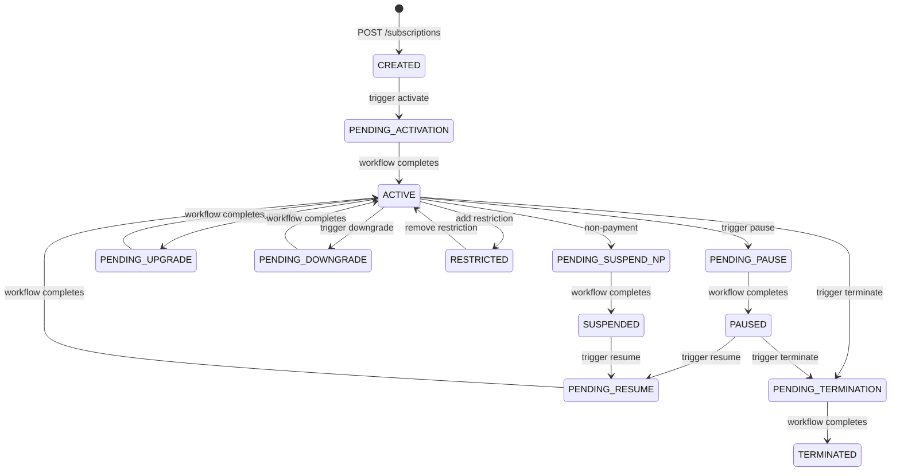

# 📘 Subscription Module — Onboarding Guide

> **Module:** `Modules/Subscription`  
> **Bundle:** Subscription Lifecycle (DD 03) + Workflows (DD 04)  
> **What it does:** Manages the customer subscription contract — from creation through activation, pausing, upgrading, and termination. **This is the single source of truth for subscription state.**

---

## 1. What This Module Does (In Plain English)

When a customer buys an internet package, the **Subscription** module creates their contract record. It tracks:

- Who they are (`customer_id`, `account_id` from Ilm)
- What they bought (`package_ref` from Catalog)
- Where they live (`homepass_id` from Catalog)
- How they pay (`billing_mode` — prepaid, postpaid, hybrid)
- Their current status (`CREATED` → `ACTIVE` → `PAUSED` → `SUSPENDED` → `TERMINATED`)
- What operations are in progress (activate, pause, upgrade, etc.)

**The Golden Rule:** Only the Subscription module writes to the `subscriptions` table. Billing reads it to know when to invoice. Fulfillment reads it to know when to install. But **nobody else writes to it.**

---

## 2. Key Concepts You Must Know

| Term | Meaning |
|------|---------|
| **Subscription** | The master record — one row per customer contract. Think of it as the "legal agreement" in the database. |
| **Status Code** | The lifecycle state. Config-driven (never hardcoded!). ~15 statuses: CREATED, ACTIVE, PAUSED, SUSPENDED, TERMINATED, etc. |
| **Operation** | A business action (activate, pause, upgrade, terminate). Each operation triggers a **workflow process**. |
| **Workflow / Process** | A data-driven flow stored in `process_definitions` table. Orchestrates steps like "validate → enter pending → do work → confirm." |
| **Task Handler** | A PHP class that implements one workflow step (e.g., `ActivateHandler` sets status to ACTIVE). |
| **Restriction** | A partial-service limitation (e.g., throttle speed to 2 Mbps). Different from full suspension. |
| **HomePass** | The physical address where service is delivered. Lives in Catalog. Subscription stores the reference. |
| **Billing Mode** | How the customer pays: `PREPAID` (top-up wallet), `POSTPAID` (invoice monthly), `HYBRID` (both). |

---

## 3. Architecture Diagrams

### ASCII: Module Placement in the System

```
┌─────────────────────────────────────────────────────────────────────┐
│                        EXTERNAL CALLERS                              │
│  ┌──────────────┐  ┌──────────────┐  ┌──────────────┐              │
│  │ Backoffice   │  │ Customer     │  │ External API │              │
│  │   UI         │  │   Portal     │  │   Clients    │              │
│  └──────┬───────┘  └──────┬───────┘  └──────┬───────┘              │
└─────────┼──────────────────┼──────────────────┼──────────────────────┘
          │                  │                  │
          ▼                  ▼                  ▼
┌─────────────────────────────────────────────────────────────────────┐
│  ┌──────────────────────────────────────────────────────────────┐   │
│  │                  📘 SUBSCRIPTION MODULE                       │   │
│  │                                                              │   │
│  │  Routes (api.php) ──▶ Controllers ──▶ Services ──▶ Models   │   │
│  │                                      │                        │   │
│  │                                      ▼                        │   │
│  │                              Events ──▶ EventBus              │   │
│  │                                                              │   │
│  │  ┌──────────┐  ┌──────────┐  ┌──────────┐  ┌──────────┐  │   │
│  │  │ Subscription│  │ Operation │  │ Restriction│  │ Status   │  │   │
│  │  │  Service   │  │ Framework │  │ Controller │  │  Code    │  │   │
│  │  └──────────┘  └──────────┘  └──────────┘  └──────────┘  │   │
│  └──────────────────────────────────────────────────────────────┘   │
└─────────────────────────────────────────────────────────────────────┘
          │
          │ emits events
          ▼
┌─────────────────────────────────────────────────────────────────────┐
│                        OTHER MODULES (Event Consumers)                │
│  ┌──────────┐  ┌──────────┐  ┌──────────┐  ┌──────────┐            │
│  │  📙      │  │  📦      │  │  📋      │  │  📞      │            │
│  │ Billing  │  │Fulfillment│  │ WorkOrder│  │   CRM    │            │
│  │          │  │          │  │          │  │          │            │
│  │ "Create  │  │ "Install │  │ "Create  │  │ "Notify  │            │
│  │  wallet" │  │  fiber"  │  │  order"  │  │  customer│            │
│  └──────────┘  └──────────┘  └──────────┘  └──────────┘            │
└─────────────────────────────────────────────────────────────────────┘
          │
          │ reads from (never writes to!)
          ▼
┌─────────────────────────────────────────────────────────────────────┐
│                        📗 CATALOG MODULE (Reference Data)            │
│  ┌──────────┐  ┌──────────┐  ┌──────────┐                        │
│  │ Package  │  │ HomePass │  │ Service  │                        │
│  │          │  │          │  │  Class   │                        │
│  │ "What    │  │ "Where   │  │ "What    │                        │
│  │  we sell"│  │  to install"│  │  type?"  │                        │
│  └──────────┘  └──────────┘  └──────────┘                        │
└─────────────────────────────────────────────────────────────────────┘
```

### Mermaid: Status State Machine



---

## 4. Code Tour — Key Files and What They Do

```
Modules/Subscription/
├── routes/
│   └── api.php                              # All REST endpoints
│
├── app/
│   ├── Http/
│   │   ├── Controllers/
│   │   │   ├── SubscriptionController.php   # CRUD: index, store, show
│   │   │   ├── OperationController.php      # Triggers workflows (activate, pause, upgrade, etc.)
│   │   │   └── RestrictionController.php    # Add/remove partial restrictions
│   │   └── Requests/                        # FormRequest validation classes
│   │
│   ├── Models/
│   │   ├── Subscription.php                 # THE master model. Status, dates, tenant-scoped.
│   │   ├── SubscriptionOperation.php        # Ledger: every workflow operation ever run
│   │   ├── SubscriptionOperationConfig.php  # Per-operator config: which operations enabled, which BPMN key
│   │   ├── SubscriptionPauseHistory.php     # Tracks suspension/pause periods for billing proration
│   │   ├── SubscriptionRestriction.php      # Active restrictions (speed caps, etc.)
│   │   ├── SubscriptionStatusCode.php       # Config catalog: all valid statuses
│   │   ├── SubscriptionUpgradeConfig.php    # Config: upgrade rules per package
│   │   └── SubscriptionTransitionReason.php # Audit: why did status change?
│   │
│   ├── Services/
│   │   ├── SubscriptionService.php          # THE ONLY WRITER of the subscription row
│   │   └── OperationFramework.php           # Starts workflows, idempotency, exclusivity
│   │
│   ├── Events/
│   │   └── SubscriptionEvents.php           # ALL event constants. Add new ones here.
│   │
│   ├── Listeners/
│   │   ├── ConfirmBillingIntentOnPayment.php  # When payment arrives → confirm billing intent
│   │   └── ConfirmPrepaidIntentOnTopup.php      # When top-up arrives → confirm prepaid intent
│   │
│   └── Workflow/                             # Task handlers (the "toolbox" steps)
│       ├── ActivateHandler.php               # Sets ACTIVE, opens billing cycle
│       ├── PauseHandler.php                  # Sets PAUSED, records pause history
│       ├── ResumeHandler.php                 # Returns to ACTIVE, closes pause history
│       ├── TerminateHandler.php              # Sets TERMINATED, triggers cleanup
│       ├── SuspendHandler.php                # Non-payment suspension
│       ├── ChangePackageHandler.php          # Applies package change
│       ├── ChangeHomePassHandler.php         # Applies relocation
│       ├── ValidateOperationHandler.php      # Pre-flight validation
│       ├── BillingIntentHandler.php          # Creates billing intent (deposit/invoice)
│       ├── FulfillmentCallHandler.php        # Calls provisioning to activate
│       ├── EquipmentPickupHandler.php        # Handles equipment swap/return
│       ├── CreateShiftingWoHandler.php       # Creates shifting work order
│       ├── EnterPendingStatusHandler.php     # Moves to PENDING_* state
│       └── SyncOperationFromProcess.php      # Reconciles ledger when workflow ends
│
├── database/
│   ├── migrations/                          # Schema definitions
│   │   ├── 2026_06_07_150000_create_subscription_tables.php
│   │   ├── 2026_06_08_170000_create_subscription_restriction_tables.php
│   │   ├── 2026_06_08_200000_create_subscription_upgrade_config.php
│   │   ├── 2026_06_10_100000_create_subscription_status_catalog.php
│   │   ├── 2026_06_10_110000_create_subscription_operation_config.php
│   │   ├── 2026_06_10_120000_create_subscription_pause_history.php
│   │   ├── 2026_06_10_140000_create_per_operation_config.php
│   │   └── 2026_06_12_140000_add_cycle_window_to_subscription.php
│   └── seeders/                             # (if any)
│
├── tests/
│   ├── Feature/                             # End-to-end API tests
│   └── Unit/                                # Service & model tests
│
└── module.json                              # Module metadata (auto-generated)
```

---

## 5. Services, Models, Events, Rules, and Workflows — The Full Map

### Services (Business Logic)

| Service | What It Does | Called By |
|---------|-------------|-----------|
| `SubscriptionService` | Creates subscriptions, transitions status, validates state changes. **The only writer.** | Controllers, Workflow Handlers |
| `OperationFramework` | Starts workflow processes, enforces idempotency, prevents concurrent operations | OperationController |

### Models (Data)

| Model | Table | What It Stores | Owned By |
|-------|-------|---------------|----------|
| `Subscription` | `subscriptions` | The master contract record | Subscription |
| `SubscriptionOperation` | `subscription_operations` | History of every operation run | Subscription |
| `SubscriptionOperationConfig` | `subscription_operation_config` | Which operations are enabled per operator | Subscription |
| `SubscriptionPauseHistory` | `subscription_pause_history` | Pause periods for billing proration | Subscription |
| `SubscriptionRestriction` | `subscription_restrictions` | Active partial restrictions | Subscription |
| `SubscriptionStatusCode` | `subscription_status_codes` | Config catalog of valid statuses | Subscription |
| `SubscriptionUpgradeConfig` | `subscription_upgrade_config` | Upgrade rules per package | Subscription |
| `SubscriptionTransitionReason` | `subscription_transition_reasons` | Audit: why status changed | Subscription |

### Events (What This Module Publishes)

Published to topic: **`subscription.lifecycle`**

| Event Type | When It Happens | Who Consumes It | What They Do |
|------------|-----------------|-----------------|--------------|
| `SubscriptionCreated` | After `POST /subscriptions` | Billing, Catalog, CRM | Billing: create account. Catalog: validate package. CRM: welcome message. |
| `SubscriptionActivated` | After activation workflow | Billing, Fulfillment, OSR, CRM | Billing: create wallet, open billing cycle. Fulfillment: install work order. OSR: reserve equipment. CRM: send welcome SMS. |
| `SubscriptionPaused` | After pause workflow | Billing, Fulfillment, CRM | Billing: pause billing. Fulfillment: cancel pending provisioning. CRM: notify customer. |
| `SubscriptionResumed` | After resume workflow | Billing, Fulfillment, CRM | Billing: resume billing. Fulfillment: resume provisioning. CRM: notify customer. |
| `SubscriptionTerminated` | After terminate workflow | Billing, OSR, CRM, WorkOrder | Billing: final invoice. OSR: recover equipment. CRM: close tickets. WorkOrder: create pickup order. |
| `SubscriptionSuspendedForNonPayment` | After suspend-np | Billing, CRM, Fulfillment | Billing: dunning escalation. CRM: warning message. Fulfillment: throttle service. |
| `SubscriptionUpgraded` | After upgrade workflow | Billing, Catalog, CRM | Billing: new pricing. Catalog: validate new package. CRM: confirmation. |
| `SubscriptionDowngraded` | After downgrade workflow | Billing, Catalog, CRM | Billing: adjust pricing. Catalog: validate old package. CRM: confirmation. |
| `SubscriptionRelocated` | After relocation workflow | Billing, Fulfillment, CRM | Billing: update address. Fulfillment: shifting work order. CRM: confirmation. |
| `SubscriptionMigrated` | After migration workflow | Billing, Fulfillment, Catalog | Billing: new pricing. Fulfillment: reprovision. Catalog: validate package + homepass. |
| `SubscriptionOperationStarted` | Workflow begins | Reporting, CRM | Reporting: track SLA. CRM: notify customer. |
| `SubscriptionOperationCompleted` | Workflow succeeds | Reporting, CRM | Reporting: close SLA. CRM: success notification. |
| `SubscriptionOperationFailed` | Workflow fails | Reporting, CRM, Ticketing | Reporting: log failure. CRM: notify customer. Ticketing: create support ticket. |
| `SubscriptionRestrictionAdded` | Restriction applied | Fulfillment, CRM | Fulfillment: apply network restriction. CRM: notify customer. |
| `SubscriptionRestrictionRemoved` | Restriction lifted | Fulfillment, CRM | Fulfillment: remove restriction. CRM: notify customer. |

### Rules (Business Policy Validation)

Rules are **side-effect-free** PHP classes that return `true` (allowed) or throw `DomainException` (rejected). They live in the `Rules` module and are called by workflow handlers.

| Rule | When It Runs | What It Checks |
|------|-------------|----------------|
| `CanActivateSubscription` | Before activation | Is status CREATED? Is billing intent resolved? Is homepass valid? |
| `CanPauseSubscription` | Before pause | Is status ACTIVE? Is there a billing dispute? |
| `CanUpgradeSubscription` | Before upgrade | Is status ACTIVE? Is new package compatible? Is customer eligible? |
| `CanTerminateSubscription` | Before termination | Is status not already TERMINATED? Is there an unpaid balance? |
| `CanRelocateSubscription` | Before relocation | Is new homepass valid? Is service available there? |

### Workflow Handlers (Process Steps)

| Handler | Operation | What It Does |
|---------|-----------|-------------|
| `ValidateOperationHandler` | ALL | Pre-flight checks: permissions, state, prerequisites |
| `EnterPendingStatusHandler` | ALL | Sets `PENDING_*` status to signal "work in progress" |
| `ActivateHandler` | ACTIVATE | Sets `ACTIVE`, opens billing cycle, creates work order |
| `PauseHandler` | PAUSE | Sets `PAUSED`, records pause history, pauses billing |
| `ResumeHandler` | RESUME | Sets `ACTIVE`, closes pause history, resumes billing |
| `TerminateHandler` | TERMINATE | Sets `TERMINATED`, triggers final invoice, equipment recovery |
| `ChangePackageHandler` | UPGRADE/DOWNGRADE | Updates package_ref, adjusts billing |
| `ChangeHomePassHandler` | RELOCATE | Updates homepass_id, creates shifting work order |
| `BillingIntentHandler` | ACTIVATE | Creates billing intent (deposit or first invoice) |
| `FulfillmentCallHandler` | ACTIVATE | Calls provisioning API to activate service on network |
| `EquipmentPickupHandler` | TERMINATE | Schedules equipment pickup via OSR |
| `CreateShiftingWoHandler` | RELOCATE | Creates a shifting work order for technician dispatch |
| `SyncOperationFromProcess` | ALL | Reconciles operation ledger when workflow completes/fails |

---

## 6. API Surface — What You Can Call

All endpoints require `auth:sanctum`. The `X-Operator-Code` header scopes all queries.

### Subscription CRUD

| Method | Endpoint | Permission | What It Does |
|--------|----------|------------|--------------|
| `GET` | `/api/subscriptions` | `subscription.read` | List subscriptions (paginated, filterable by `accountId`, `customerId`, `status`) |
| `POST` | `/api/subscriptions` | `subscription.create` + idempotency | Create a new subscription |
| `GET` | `/api/subscriptions/{id}` | `subscription.read` | Get one subscription |

### Lifecycle Operations (All return `202 ACCEPTED` + `operationId`)

| Method | Endpoint | Permission | What It Does |
|--------|----------|------------|--------------|
| `POST` | `/api/subscriptions/{id}/activate` | `subscription.activate` | Trigger ACTIVATE workflow → ACTIVE |
| `POST` | `/api/subscriptions/{id}/pause` | `subscription.manage` | Trigger PAUSE workflow → PAUSED |
| `POST` | `/api/subscriptions/{id}/resume` | `subscription.manage` | Trigger RESUME workflow → ACTIVE |
| `POST` | `/api/subscriptions/{id}/terminate` | `subscription.manage` | Trigger TERMINATE workflow → TERMINATED |
| `POST` | `/api/subscriptions/{id}/upgrade` | `subscription.manage` | Trigger UPGRADE workflow (new package) |
| `POST` | `/api/subscriptions/{id}/downgrade` | `subscription.manage` | Trigger DOWNGRADE workflow (new package) |
| `POST` | `/api/subscriptions/{id}/relocate` | `subscription.manage` | Trigger RELOCATE workflow (new homepass) |
| `POST` | `/api/subscriptions/{id}/migrate` | `subscription.manage` | Trigger MIGRATE workflow (package + homepass) |
| `POST` | `/api/subscriptions/{id}/suspend-np` | `BILLING_INTERNAL` | Non-payment suspension (system-driven) |

### Restrictions

| Method | Endpoint | Permission | What It Does |
|--------|----------|------------|--------------|
| `POST` | `/api/subscriptions/{id}/restrictions` | `subscription.manage` | Add a partial restriction |
| `DELETE` | `/api/subscriptions/{id}/restrictions/{restriction}` | `subscription.manage` | Remove a restriction |

---

## 7. Scheduled Commands / Batch Jobs / Cron Jobs

The Subscription module runs these scheduled jobs (defined in `app/Console/Kernel.php` or module service providers):

| Job | Schedule | What It Does | Why |
|-----|----------|-------------|-----|
| `subscription:clean-stale-operations` | Daily at 02:00 | Removes operations stuck in `STARTED` for > 48h | Prevents operation ledger bloat |
| `subscription:notify-pending-activations` | Hourly | Finds CREATED subscriptions > 24h old | Alerts sales to follow up |
| `subscription:prune-pause-history` | Monthly | Archives pause history > 2 years old | Keeps pause_history table small |
| `subscription:sync-status-codes` | On deploy | Reconciles `subscription_status_codes` config with code constants | Prevents config drift |

**How to check what's scheduled:**
```bash
php artisan schedule:list
```

**How to run a job manually:**
```bash
php artisan subscription:clean-stale-operations
```

---

## 8. Common Patterns

### Pattern 1: The Only Writer (Enforced by Code, Not Convention)

```php
// ✅ GOOD: Workflow handler calls the service
class ActivateHandler implements TaskHandler
{
    public function __construct(private readonly SubscriptionService $subscriptions) {}

    public function handle(TaskContext $context): TaskResult
    {
        $subscription = Subscription::query()->find($context->businessKey());
        $this->subscriptions->transitionStatus(
            $subscription,
            Subscription::ACTIVE,  // Status code (from config catalog)
            ['reason' => 'activation_workflow_completed']
        );
        return TaskResult::success(['subscriptionStatus' => Subscription::ACTIVE]);
    }
}

// ❌ BAD: Never do this in a handler
// $subscription->update(['status' => 'ACTIVE']);  // Direct write bypasses validation!
```

### Pattern 2: Transaction + Event (Transactional Outbox)

```php
// From SubscriptionService::create()
return DB::transaction(function () use ($data) {
    // 1. Write to DB
    $subscription = Subscription::query()->create($data);

    // 2. Publish event INSIDE the same transaction
    $this->events->publish(new DomainEvent(
        type: SubscriptionEvents::CREATED,
        topic: SubscriptionEvents::TOPIC,
        payload: [
            'subscriptionId' => $subscription->id,
            'accountId' => $subscription->account_id,
            'packageRef' => $subscription->package_ref,
        ],
        aggregateType: 'Subscription',
        aggregateId: $subscription->id,
    ));

    // 3. If either fails, the whole thing rolls back
    return $subscription;
});
```

**Why this matters:** If the DB commit fails, the event is never published. If the event fails, the DB rolls back. Zero inconsistency.

### Pattern 3: Idempotent Operations (Safe to Retry)

```php
// In OperationFramework::trigger()
$existing = SubscriptionOperation::query()
    ->where('operator_code', $subscription->operator_code)
    ->where('idempotency_key', $idempotencyKey)
    ->first();

if ($existing) {
    // Same key already used → return the same result
    return $existing; // Replay: no new work started
}

// Also prevents concurrent operations:
$running = SubscriptionOperation::query()
    ->where('subscription_id', $subscription->id)
    ->where('status', 'STARTED')
    ->first();

if ($running) {
    throw new DomainException('OPERATION_ALREADY_IN_PROGRESS');
}
```

### Pattern 4: Pending Status Pattern (Transient States)

Before a workflow starts, the subscription enters a `PENDING_*` state. This tells the UI "something is happening." When the workflow completes, it moves to a rest state.

```php
// OperationController::upgrade()
public function upgrade(Request $request, Subscription $subscription): JsonResponse
{
    return $this->trigger($request, $subscription, 'UPGRADE', $data);
    // Internally:
    // 1. OperationFramework starts workflow with key "sub-upgrade"
    // 2. First handler: EnterPendingStatusHandler sets PENDING_UPGRADE
    // 3. Middle handlers: validate, change package, update billing
    // 4. Final handler: ChangePackageHandler sets ACTIVE
    // 5. SyncOperationFromProcess updates operation ledger
}
```

**Why this matters:** The UI can show "Upgrade in progress..." instead of just "ACTIVE." If the workflow fails, the subscription is in `PENDING_UPGRADE` — a clear signal that something went wrong.

### Pattern 5: Config-Driven Process Keys (No Hardcoding)

Each operation maps to a process definition key. The mapping can be overridden per operator.

```php
// Default mapping: ACTIVATE → "sub-activate"
// Override: Operator "ACME" might map ACTIVATE → "acme-custom-activate"
private function resolveProcessKey(string $operator, string $kind): string
{
    $config = SubscriptionOperationConfig::resolve($operator, $kind);
    return $config?->default_bpmn_process_key ?? self::defaultProcessKeyFor($kind);
}
```

**Why this matters:** Different operators may have different workflows. One operator might require a deposit before activation. Another might not. The process definition is data, not code.

---

## 9. Dependencies — What This Module Needs

| Module | What It Uses | How It Uses It | File Paths |
|--------|-------------|----------------|------------|
| **Workflow** | Starts process instances, listens for process end | `OperationFramework.php` triggers workflows; `SyncOperationFromProcess.php` listens for completion | `OperationFramework.php`, `SyncOperationFromProcess.php` |
| **Catalog** | Validates package refs, homepass refs | `ValidatePackageChangeHandler.php`, `ValidateHomePassChangeHandler.php` read from Catalog tables | `Workflow/ValidatePackageChangeHandler.php` |
| **Billing** | Creates billing intents, confirms payment events | `BillingIntentHandler.php` creates intents; `ConfirmBillingIntentOnPayment.php` listens for payments | `Workflow/BillingIntentHandler.php`, `Listeners/ConfirmBillingIntentOnPayment.php` |
| **Provisioning** | Activates service on network | `FulfillmentCallHandler.php` calls Provisioning API | `Workflow/FulfillmentCallHandler.php` |
| **WorkOrder** | Creates shifting/install work orders | `CreateShiftingWoHandler.php` calls WorkOrder API | `Workflow/CreateShiftingWoHandler.php` |
| **Osr** | Equipment swaps and returns | `EquipmentPickupHandler.php` calls OSR API | `Workflow/EquipmentPickupHandler.php` |
| **Rules** | Business policy validation | `ValidateOperationHandler.php` calls RuleEngine | `Workflow/ValidateOperationHandler.php` |

### What Depends on This Module

| Module | Why It Needs Subscription |
|--------|---------------------------|
| **Billing** | Listens to `SubscriptionActivated` to open billing cycle; reads status to know when to invoice |
| **Provisioning** | Listens to status changes to activate/deactivate services on network equipment |
| **Fulfillment** | Calls `SubscriptionService::create()` during order capture; reads status for provisioning |
| **WorkOrder** | Reads subscription data to create install/shifting orders; links work orders to subscriptions |
| **Reporting** | Aggregates subscription data for dashboards (active count, churn rate, etc.) |
| **CRM** | Listens to events to send notifications (welcome, upgrade confirmation, etc.) |
| **Ticketing** | Creates tickets when operations fail |

---

## 10. New Dev Checklist

### Must-Read Files (In Order)

- [ ] `Modules/Subscription/app/Models/Subscription.php` — Understand status constants and casts
- [ ] `Modules/Subscription/app/Services/SubscriptionService.php` — See the "only writer" rule in action
- [ ] `Modules/Subscription/app/Services/OperationFramework.php` — Understand how operations are triggered
- [ ] `Modules/Subscription/app/Events/SubscriptionEvents.php` — Memorize the event types
- [ ] `Modules/Subscription/app/Workflow/ActivateHandler.php` — Simple, complete handler example
- [ ] `Modules/Subscription/routes/api.php` — See all endpoints in one place

### Must-Run Commands

```bash
# Run subscription tests
php artisan test --filter=Subscription

# See what subscriptions exist (after seeding)
php artisan tinker --execute="dd(Subscription::query()->limit(5)->get());"

# Check scheduled jobs
php artisan schedule:list

# Run a scheduled job manually
php artisan subscription:clean-stale-operations

# Check the operation ledger
php artisan tinker --execute="dd(SubscriptionOperation::query()->latest()->limit(5)->get());"
```

### How to Add a New Operation

1. Add event type to `SubscriptionEvents.php`
2. Add validation rule to `Rules` module (or use existing `ValidateOperationHandler`)
3. Create new `TaskHandler` in `Modules/Subscription/app/Workflow/`
4. Register handler in `SubscriptionWorkflowProvider.php`
5. Add controller endpoint in `OperationController.php`
6. Add route in `routes/api.php`
7. Create process definition in database (or via Workflow Studio)
8. Add operation config to `subscription_operation_config` table
9. Write tests!

### Debugging Guide

**"The subscription is stuck in PENDING_UPGRADE!"**
```bash
# Check the operation ledger
SELECT * FROM subscription_operations WHERE subscription_id = 'sub_xxx' ORDER BY created_at DESC;

# Check the workflow instance
SELECT * FROM process_instances WHERE business_key = 'sub_xxx';

# Check the event outbox
SELECT * FROM event_outbox WHERE aggregate_id = 'sub_xxx';

# Check for failed jobs in the queue
php artisan queue:failed

# Retry a failed job
php artisan queue:retry [job_id]
```

---

## 11. Quick FAQ

**Q: Why does the subscription have both `customer_id` and `account_id`?**  
A: `customer_id` is the person (ILM module). `account_id` is the billing partition (Billing module). One customer can have multiple accounts (e.g., personal + business).

**Q: What's the difference between `pause` and `suspend-np`?**  
A: `pause` is voluntary (customer asks). `suspend-np` is involuntary (non-payment). They emit different events so Billing and CRM can react differently.

**Q: Can I add a new operation type?**  
A: Yes! See the "How to Add a New Operation" checklist above. The key is: add the config to `subscription_operation_config`, create the handler, register it, and define the workflow.

**Q: Where do I add validation rules?**  
A: Domain policy rules go in the `Rules` module (side-effect-free). Input validation goes in `FormRequest` classes under `Http/Requests/`. Never put business logic in controllers.

**Q: What's a `billing_mode`?**  
A: How the customer pays: `PREPAID` (top-up wallet, deduct charges), `POSTPAID` (invoice monthly, pay after), `HYBRID` (both). Set at subscription creation.

**Q: What happens when a workflow fails?**  
A: The `SyncOperationFromProcess` listener updates the operation ledger to `FAILED`. The subscription stays in `PENDING_*` state. A `SubscriptionOperationFailed` event is emitted. CRM creates a support ticket. The customer sees "Operation failed — contact support."

**Q: Why is there a `SubscriptionPauseHistory` table?**  
A: For billing proration. If a customer pauses on the 15th and resumes on the 20th, Billing needs to know exactly how many days to NOT charge for. This table tracks those periods.

**Q: What's the `cycle_anchor_day` field?**  
A: The day of the month when billing cycles. If a customer signs up on the 15th with `cycle_anchor_day = 1`, their first bill is prorated (15th → 1st), then monthly on the 1st.

---

> **Next:** Read the [Catalog Module Guide](./catalog.md) — where packages, HomePasses, and tax rules live.
