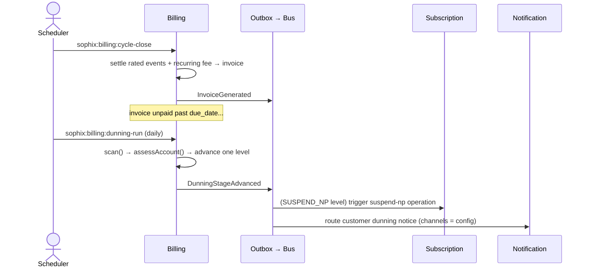

# 📙 Billing Module — Onboarding Guide

> **Module:** `Modules/Billing`
> **Bundle:** Invoicing, Payments, Wallet, Dunning, Tax, Adjustments (DD 05 — BIL)
> **What it does:** Handles everything related to money — turning rated usage and recurring fees into invoices, taking payments, running prepaid wallets, chasing unpaid bills (dunning), signing tax invoices, and issuing credit/debit notes. **Billing owns the money.**

> ⚠️ **Accuracy note:** Every table, command, event, route, and permission in this guide is verified against the code on this branch. Table names are **singular** (`invoice`, not `invoices`); scheduled commands are **`sophix:`-prefixed**; the dunning event is **`DunningStageAdvanced`**. If you see a different name elsewhere, trust the code.

---

## 1. What This Module Does (In Plain English)

Every billing cycle, customers owe money for their service. The **Billing** module makes that happen:

- **Rating:** Converts raw usage (`usage_record`) into priced `rated_event` rows (MED-01 + RAT-01)
- **Invoicing:** Groups charges into an `invoice` with a gap-free legal number and a SUMMARY → DETAIL line hierarchy
- **Tax:** Computes per-line tax from Catalog rules and issues a separate, signed `tax_invoice`
- **Payments:** Records a `payment_ledger` entry and either credits a prepaid wallet or allocates to open invoices
- **Wallets:** Runs prepaid balances (`wallet` + append-only `wallet_transaction`)
- **Dunning:** Automatically chases overdue debt through configurable levels — warn, restrict, suspend, terminate
- **Adjustments:** Credit/debit notes through a governed propose → approve → apply pipeline (EM-CFG-04)

**The Golden Rule:** Only Billing writes to `invoice`, `payment_ledger`, `wallet` / `wallet_transaction`, and `dunning_state`. Other modules emit events (e.g. "usage published", "subscription activated"); Billing decides what to charge.

---

## 2. Key Concepts You Must Know

| Term | Meaning |
|------|---------|
| **Charge** | A single priced line to bill (the `Charge` DTO produced by `ChargeComputeService`). Charges are grouped into an invoice. |
| **Invoice** | A legal billing document (`invoice`) with a gap-free legal number. Lines are a SUMMARY (per package) → DETAIL (per charge) hierarchy. |
| **Tax Invoice** | A separate fiscal document (`tax_invoice`) issued from a commercial invoice and submitted to the tax authority for signing. |
| **Credit Note / Debit Note** | A correction document — itself an `invoice` of type `CREDIT_NOTE` / `DEBIT_NOTE`. Credit = money back; Debit = extra charge. |
| **Wallet** | A prepaid balance (`wallet`); top-ups and deductions are recorded as append-only `wallet_transaction` rows. |
| **Dunning** | Chasing overdue debt. A per-account state machine (`dunning_state`) advancing through **numeric levels** (0→4) driven by the `dunning_program` catalog. |
| **Payment Allocation** | When a payment lands, Billing applies it to open invoices by the operator's policy (default `FIFO_DUE_DATE`). |
| **Billable Event** | A catalog entry (`billable_event`) describing a chargeable usage kind; raw usage arrives as `usage_record` and is rated into `rated_event`. |
| **Billing Cycle** | The recurring per-subscription boundary; closing it settles unbilled rated events + recurring fees (BIL-03). |
| **EM-CFG-04** | The platform-wide approval engine. Adjustments and bulk reversals run their sign-offs on it (single-stage quorum or chain). |

---

## 3. Architecture Diagrams

### ASCII: Module Placement in the System

```
┌─────────────────────────────────────────────────────────────────────┐
│                        EXTERNAL CALLERS                              │
│  ┌──────────────┐  ┌──────────────┐  ┌──────────────┐              │
│  │ Backoffice   │  │ Payment      │  │ Scheduler    │              │
│  │   Finance    │  │   Gateway    │  │  (sophix:*   │              │
│  │   Team       │  │  (M-Pesa,    │  │   commands)  │              │
│  │              │  │   Bank)      │  │              │              │
│  └──────┬───────┘  └──────┬───────┘  └──────┬───────┘              │
└─────────┼──────────────────┼──────────────────┼──────────────────────┘
          │                  │                  │
          ▼                  ▼                  ▼
┌─────────────────────────────────────────────────────────────────────┐
│  ┌──────────────────────────────────────────────────────────────┐   │
│  │                  📙 BILLING MODULE                            │   │
│  │                                                              │   │
│  │  routes/api.php ──▶ Controllers ──▶ Services ──▶ Models       │   │
│  │                                      │                        │   │
│  │                                      ▼                        │   │
│  │              DomainEvent ──▶ transactional outbox ──▶ Bus     │   │
│  │                                                              │   │
│  │  ┌──────────┐  ┌──────────┐  ┌──────────┐  ┌──────────┐    │   │
│  │  │ Invoice  │  │ Payment  │  │ Dunning  │  │ Wallet   │    │   │
│  │  │ Service  │  │ Service  │  │ Service  │  │ Service  │    │   │
│  │  │"structured│ │"receive &│  │"scan &   │  │"credit / │    │   │
│  │  │ invoice" │  │ apply"   │  │ advance" │  │ debit"   │    │   │
│  │  └──────────┘  └──────────┘  └──────────┘  └──────────┘    │   │
│  └──────────────────────────────────────────────────────────────┘   │
└─────────────────────────────────────────────────────────────────────┘
          │
          │ emits events (topic: billing.money) via the outbox
          ▼
┌─────────────────────────────────────────────────────────────────────┐
│                   OTHER MODULES (Event Consumers)                     │
│  ┌────────────┐  ┌────────────┐  ┌────────────┐  ┌────────────┐     │
│  │   📘       │  │   📦       │  │   📞       │  │   📊       │     │
│  │Subscription│  │Fulfillment │  │Notification│  │ Reporting  │     │
│  │            │  │            │  │            │  │            │     │
│  │"confirm    │  │"hold/      │  │"send       │  │"revenue,   │     │
│  │ intent;    │  │ throttle   │  │ dunning    │  │ dunning    │     │
│  │ suspend-np"│  │ on dunning"│  │ notice"    │  │ analytics" │     │
│  └────────────┘  └────────────┘  └────────────┘  └────────────┘     │
└─────────────────────────────────────────────────────────────────────┘
          │
          │ reads from
          ▼
┌─────────────────────────────────────────────────────────────────────┐
│                   📗 CATALOG MODULE (Reference Data)                 │
│  ┌──────────┐  ┌──────────┐                                       │
│  │ Tax Rules│  │ Package /│                                       │
│  │ (PLM-CFG │  │ Wallet   │                                       │
│  │  -02)    │  │ catalog  │                                       │
│  └──────────┘  └──────────┘                                       │
└─────────────────────────────────────────────────────────────────────┘
```

### Mermaid: Cycle Close → Invoice → Dunning Flow



---

## 4. Code Tour — Key Files and What They Do

```
Modules/Billing/
├── routes/
│   └── api.php                              # All billing endpoints (see §6)
│
├── app/
│   ├── Console/                             # Artisan commands (sophix:billing:*)
│   │   ├── DunningRunCommand.php              # sophix:billing:dunning-run
│   │   ├── ArchiveDunningStatesCommand.php    # sophix:billing:dunning-archive
│   │   ├── CycleCloseCommand.php              # sophix:billing:cycle-close
│   │   ├── RunCycleBillingCommand.php         # sophix:billing:run-cycle
│   │   ├── RateUsageCommand.php               # sophix:billing:rate-usage
│   │   ├── ProFormaScanCommand.php            # sophix:billing:pro-forma
│   │   ├── GenerationFailureRetryCommand.php  # sophix:billing:generation-retry
│   │   ├── TaxSignScanCommand.php             # sophix:billing:tax-sign-scan
│   │   ├── TaxRetryScanCommand.php            # sophix:billing:tax-retry-scan
│   │   └── WalletExpiryCommand.php            # sophix:wallet:expire
│   │
│   ├── Http/Controllers/
│   │   ├── InvoiceController.php              # List/show invoices, generate, issue tax invoice
│   │   ├── PaymentController.php              # Record/reverse payments, allocate surplus
│   │   ├── DunningController.php              # Run/show/clear/advance/hold + termination review
│   │   ├── DunningProgramController.php       # Versioned dunning policy catalog
│   │   ├── WalletController.php               # Balance, top-up, debit
│   │   ├── AdjustmentController.php           # Propose/approve/reject/revise/cancel/override notes
│   │   ├── BulkReversalController.php         # Dual-controlled bulk invoice reversal
│   │   ├── TaxInvoiceController.php           # Tax invoice issue/sign/retry/cancel
│   │   ├── BillableEventController.php        # BillableEvent catalog admin
│   │   ├── UsageController.php                # Ingest usage, rate-run, query rated events
│   │   └── CycleCloseController.php           # Read-only cycle-close run monitor
│   │
│   ├── Models/                               # (table names are SINGULAR)
│   │   ├── Invoice.php                  → invoice
│   │   ├── InvoiceLine.php              → invoice_line          (SUMMARY / DETAIL)
│   │   ├── PaymentLedger.php            → payment_ledger        (payments + reversals)
│   │   ├── PaymentAllocation.php        → payment_invoice_allocation
│   │   ├── AccountCreditBalance.php     → account_credit_balance
│   │   ├── Wallet.php                   → wallet
│   │   ├── WalletTransaction.php        → wallet_transaction
│   │   ├── DunningState.php             → dunning_state         (per account)
│   │   ├── DunningProgram.php           → dunning_program       (versioned policy)
│   │   ├── AdjustmentRequest.php        → adjustment_request
│   │   ├── AdjustmentApprovalStep.php   → adjustment_approval_step
│   │   ├── AdjustmentReasonCode.php     → adjustment_reason_code
│   │   ├── NoteApplication.php          → note_application_ledger
│   │   ├── TaxInvoice.php               → tax_invoice
│   │   ├── TaxInvoiceSigningFailure.php → tax_invoice_signing_failure
│   │   ├── TaxOperatorConfig.php        → tax_operator_config
│   │   ├── BillableEvent.php            → billable_event
│   │   ├── BillableEventCategory.php    → billable_event_category
│   │   ├── BillingIntent.php            → billing_intent
│   │   ├── UsageRecord.php              → usage_record
│   │   └── RatedEvent.php               → rated_event
│   │
│   ├── Services/                             # Business logic (see §5)
│   ├── Events/BillingEvents.php              # Event-type constants (topic: billing.money)
│   ├── Listeners/                            # All subscribe to OutboxEventPublished
│   │   ├── ApplyCreditBalanceOnInvoice.php   # apply credit balance when an invoice is issued
│   │   ├── RetryFrozenCycleOnTopup.php        # resume a frozen prepaid cycle after a top-up
│   │   ├── DunningEventBridge.php             # bridge dunning to cross-module reactions
│   │   ├── TaxEventBridge.php                 # bridge tax-invoice lifecycle events
│   │   └── EvictPlmCatalogCache.php           # drop cached catalog data on change
│   │
│   └── Providers/
│       ├── BillingServiceProvider.php
│       └── BillingRuntimeProvider.php        # registers the rules.billing.adjustment-approval fallback
│
├── database/migrations/                      # invoice, payment, wallet, dunning, tax, adjustment tables
└── tests/Feature/                            # AdjustmentTest, BulkReversalAndFailureQueueTest, Wallet*, Dunning*, Tax01, ...
```

---

## 5. Services, Models, Events, and Approvals — The Full Map

### Services (Business Logic)

| Service | What It Does |
|---------|-------------|
| `InvoiceService` | Builds a structured (SUMMARY/DETAIL) invoice from charges, assigns the gap-free legal number, issues credit/debit notes (`issueNote`) |
| `ChargeComputeService` | Produces priced `Charge` DTOs (recurring + usage) for a cycle |
| `MediationRatingService` | Rates raw `usage_record` rows into priced `rated_event` rows (MED-01 / RAT-01) |
| `CycleCloseService` / `CycleBillingService` | Close a subscription's cycle boundary and settle unbilled rated events + recurring fee (BIL-03) |
| `ProFormaService` | Generates pre-cycle pro-forma (quote) documents for prepaid subscriptions |
| `PaymentService` | `receiveAndApply()` (PREPAID → wallet, POSTPAID → allocate), `reverse()`, surplus → credit balance |
| `WalletService` | Atomic wallet `credit()` / `debit()`, `ensureWallet()`, expiry sweep |
| `TaxService` | Per-line tax computation from Catalog's PLM-CFG-02 rules (no config ⇒ zero tax, not a failure) |
| `TaxInvoiceGenerator` / `TaxSigningService` | Issue a `tax_invoice` and submit it to the tax-authority gateway for signing |
| `DunningService` | Scans overdue debt and advances `dunning_state` levels; applies restrict/suspend/terminate; recovery + admin overrides |
| `DunningProgramResolver` | Resolves the versioned `dunning_program` for an operator + billing mode |
| `AdjustmentService` | Governed credit/debit-note pipeline; routes the N approvals through **EM-CFG-04** |
| `NoteApplicationService` | Applies a credit/debit note to invoices / wallet / credit balance |
| `BulkReversalService` | Dual-controlled bulk invoice reversal (EM-CFG-04 separation-of-duties) |
| `GenerationFailureService` | Captures + retries recoverable invoice-generation failures (rule group Q) |
| `BillingIntentService` | Creates/confirms prepaid & postpaid billing intents (settled state callbacks) |
| `BillableEventCatalogService` | Manages the `billable_event` catalog |
| `CustomerSnapshotService` | Captures customer header data (from ILM) at invoice time for audit |

### Models → Tables (Data, all singular)

| Model | Table | What It Stores |
|-------|-------|---------------|
| `Invoice` | `invoice` | Legal billing document (incl. CREDIT_NOTE / DEBIT_NOTE / TAX types) |
| `InvoiceLine` | `invoice_line` | SUMMARY (per package) + DETAIL (per charge) lines |
| `PaymentLedger` | `payment_ledger` | Payments and reversals (cash, mobile money, gateway) |
| `PaymentAllocation` | `payment_invoice_allocation` | Links a payment to the invoice(s) it settled |
| `AccountCreditBalance` | `account_credit_balance` | Surplus/credit held at account level |
| `Wallet` | `wallet` | Prepaid balance per subscription/wallet code |
| `WalletTransaction` | `wallet_transaction` | Append-only wallet movements (CREDIT / DEBIT) |
| `DunningState` | `dunning_state` | Per-account dunning episode (`current_level` 0–4, `status`) |
| `DunningProgram` | `dunning_program` | Versioned dunning policy (grace + action per level) |
| `AdjustmentRequest` | `adjustment_request` | A credit/debit-note proposal and its lifecycle |
| `AdjustmentApprovalStep` | `adjustment_approval_step` | Human-readable adjustment audit (approve/reject/override/auto) |
| `AdjustmentReasonCode` | `adjustment_reason_code` | Operator catalog of valid adjustment reasons |
| `NoteApplication` | `note_application_ledger` | How a note was applied (invoice / wallet / credit balance) |
| `TaxInvoice` | `tax_invoice` | Fiscal document issued from a commercial invoice |
| `BillableEvent` | `billable_event` | Catalog of chargeable usage kinds |
| `UsageRecord` / `RatedEvent` | `usage_record` / `rated_event` | Raw usage → priced usage |
| `BillingIntent` | `billing_intent` | Prepaid/postpaid billing intent + settlement |

### Events This Module Publishes (`BillingEvents`, topic `billing.money`)

| Constant → value | When | Notable consumers |
|---|---|---|
| `INVOICE_GENERATED` → `InvoiceGenerated` | Invoice issued | Subscription, Notification, Reporting |
| `INVOICE_PAID` → `InvoicePaid` | Invoice fully settled | Subscription, Reporting |
| `PAYMENT_RECEIVED` / `PAYMENT_APPLIED` → `PaymentReceived` / `PaymentApplied` | Payment landed / allocated | Subscription (intent), Reporting |
| `WALLET_CREDITED` / `WALLET_DEBITED` / `WALLET_TOPPED_UP` | Wallet movement | Subscription, Notification |
| `DUNNING_STAGE_ADVANCED` → `DunningStageAdvanced` | Account advances a dunning **level** | Subscription (suspend), Notification, Fulfillment |
| `SUBSCRIPTION_ENTERED_DUNNING` → `SubscriptionEnteredDunning` | First level entered | Notification, Reporting |
| `DUNNING_TERMINATION_PENDING` → `SubscriptionDunningTerminationPending` | Pre-termination review opened | Backoffice review queue |
| `DUNNING_CLEARED` → `DunningCleared` | Debt settled / cleared | Subscription (resume), Notification |
| `SUBSCRIPTION_SUSPENDED_NP` → `SubscriptionSuspendedForNonPayment` | Suspended for non-payment | Subscription, Fulfillment |
| `TAX_INVOICE_ISSUED` / `TAX_INVOICE_SIGNED` / `TAX_INVOICE_SIGNING_FAILED` | Tax invoice lifecycle | Reporting, compliance |
| `ADJUSTMENT_PROPOSED` / `ADJUSTMENT_APPROVED` / `ADJUSTMENT_REJECTED` | Adjustment lifecycle | Reporting |
| `CREDIT_NOTE_ISSUED` / `DEBIT_NOTE_ISSUED` / `CREDIT_NOTE_APPLIED` / `DEBIT_NOTE_APPLIED` | Note issued / applied | Subscription, Wallet, Reporting |
| `BULK_REVERSAL_COMPLETED` → `BulkReversalCompleted` | Bulk reversal finished | Reporting |
| `BILLABLE_EVENT_CHANGED` → `BillableEventCatalogChanged` | Catalog edited | cache eviction |

> ⚠️ There is **no** `DunningEscalated` or `BillableEventRated` event — those names are not in `BillingEvents`.

### Events This Module Listens To

Billing does **not** register per-event listener classes. All listeners subscribe to the foundation `OutboxEventPublished` event and switch on the published event's type inside `handle()`:

| Listener | Reacts to (event type) | What It Does |
|----------|------------------------|--------------|
| `ApplyCreditBalanceOnInvoice` | `InvoiceGenerated` | Auto-applies any held account credit balance to a fresh invoice |
| `RetryFrozenCycleOnTopup` | wallet top-up | Resumes a prepaid cycle that was frozen for non-payment |
| `DunningEventBridge` | dunning lifecycle | Bridges dunning state changes to cross-module reactions |
| `TaxEventBridge` | tax-invoice lifecycle | Bridges tax-invoice signing outcomes |
| `EvictPlmCatalogCache` | catalog change | Invalidates cached catalog data |

### Rules & Approvals

- **Rules (Rules module decision tables):** the routing decision for adjustments is `rules.billing.adjustment-approval`, an operator-overridable decision table that answers `{stepsRequired}`. `BillingRuntimeProvider` registers a config-derived fallback (from `adjustment_limits_config`) when no table is deployed. *(There are no `CanGenerateInvoice` / `CanRecordPayment` rule classes — guard logic lives inline in the services as `DomainException`s.)*
- **EM-CFG-04 approval engine — the one approval mechanism, used everywhere:**

| Approval point | Shape on EM-CFG-04 |
|---|---|
| Adjustment (credit/debit note) | Single stage, quorum = `stepsRequired` from the rules engine; engine enforces **distinct approvers** |
| Bulk invoice reversal | Single stage, proposer = requester; engine's **separation-of-duties** refuses self-approval (surfaced as `DUAL_CONTROL_REQUIRED`) |
| Tax-invoice cancellation | Approve step gated by `tax.compliance` |

---

## 6. API Surface — What You Can Call

All endpoints sit under `auth:sanctum`; write endpoints add the `idempotency` middleware where shown. `account_id` (or `subscriptionId` for wallets) is the partition.

### Invoices
| Method | Endpoint | Permission |
|--------|----------|------------|
| `GET` | `/api/invoices` | `invoice.read` |
| `GET` | `/api/invoices/{invoice}` | `invoice.read` |
| `POST` | `/api/invoices` | `invoice.manage` (+ idempotency) |
| `POST` | `/api/invoices/{invoice}/tax-invoice` | `invoice.manage` (+ idempotency) |

### Payments
| Method | Endpoint | Permission |
|--------|----------|------------|
| `GET` | `/api/payments` · `/api/payments/{payment}` | `payment.read` |
| `POST` | `/api/payments` | `payment.apply` (+ idempotency) |
| `POST` | `/api/payments/{payment}/reverse` | `payment.reverse` |
| `POST` | `/api/payments/{payment}/allocate-surplus` | `payment.apply` |

### Dunning (Collections)
| Method | Endpoint | Permission |
|--------|----------|------------|
| `GET` | `/api/dunning` · `/api/dunning/{account}` · `/api/dunning/{account}/history` | `invoice.read` |
| `GET` | `/api/dunning/pending-termination-review` | `invoice.read` |
| `POST` | `/api/dunning/run` · `/api/dunning/refresh-debt` | `invoice.manage` |
| `POST` | `/api/dunning/{account}/clear` | `invoice.manage` |
| `POST` | `/api/dunning/{account}/advance` · `/hold` · `/admin-clear` · `/clear-without-payment` · `/confirm-termination` · `/force-terminate` · `/extend-review` | `dunning.admin` |

### Dunning Programs (versioned policy)
| Method | Endpoint | Permission |
|--------|----------|------------|
| `GET` | `/api/dunning-programs` · `/api/dunning-programs/{code}` | `invoice.read` |
| `POST` | `/api/dunning-programs` · `/api/dunning-programs/{code}/new-version` | `dunning.admin` |

### Wallet (keyed by **subscriptionId**)
| Method | Endpoint | Permission |
|--------|----------|------------|
| `GET` | `/api/wallets/{subscriptionId}/balance` | `wallet.read` |
| `POST` | `/api/wallets/{subscriptionId}/topup` | `wallet.manage` (+ idempotency) |
| `POST` | `/api/wallets/{subscriptionId}/debit` | `wallet.manage` |

### Adjustments (credit/debit notes)
| Method | Endpoint | Permission |
|--------|----------|------------|
| `GET` | `/api/adjustments` · `/api/adjustments/{adjustment}` · `/api/adjustment-reason-codes` | `invoice.read` |
| `POST` | `/api/adjustments` | `adjustment.create` (+ idempotency) |
| `POST` | `/api/adjustments/{adjustment}/approve` · `/reject` · `/request-revision` · `/override-limit` · `/retry-application` | `adjustment.approve` |
| `POST` | `/api/adjustments/{adjustment}/cancel` | `adjustment.create` |
| `GET` | `/api/credit-notes/{note}` | `invoice.read` |

### Bulk Reversal (dual-controlled)
| Method | Endpoint | Permission |
|--------|----------|------------|
| `GET` | `/api/billing/bulk-reversals` | `invoice.read` |
| `POST` | `/api/billing/bulk-reversals/preview` · `/api/billing/bulk-reversals` | `invoice.manage` |
| `POST` | `/api/billing/bulk-reversals/{batch}/approve` · `/reject` | `adjustment.approve` |

### Tax Invoices
| Method | Endpoint | Permission |
|--------|----------|------------|
| `GET` | `/api/tax-invoices` · `/{taxInvoice}` · `/{taxInvoice}/pdf` · `/signing-history` · `/dashboard` | `invoice.read` |
| `POST` | `/api/tax-invoices/manual` (+ idempotency) · `/{taxInvoice}/retry-signing` · `/resolve-no-action` · `/cancel` | `invoice.manage` |
| `POST` | `/api/tax-invoices/{taxInvoice}/cancel/approve` | `tax.compliance` |

### Usage & Billable Events
| Method | Endpoint | Permission |
|--------|----------|------------|
| `GET` | `/api/usage` · `/api/rated-events` | `invoice.read` |
| `POST` | `/api/usage` (+ idempotency) · `/api/usage/rate-run` | `invoice.manage` |
| `GET` | `/api/billing/billable-events` · `/{billableEvent}` · `/billable-event-categories` | `catalog.read` |
| `POST/PATCH` | `/api/billing/billable-events` (+ idempotency) · `/{billableEvent}` · `/activate` · `/retire` | `catalog.manage` |

---

## 7. Scheduled Commands / Batch Jobs

Schedules are registered in `routes/console.php`. All commands are `sophix:`-prefixed.

| Command | Schedule | What It Does |
|---------|----------|--------------|
| `sophix:billing:cycle-close` | every 30 min (no overlap) | Close due subscription cycles; settle recurring fee + usage (BIL-03) |
| `sophix:billing:generation-retry` | every 15 min (no overlap) | Retry recoverable invoice-generation failures (rule group Q) |
| `sophix:billing:pro-forma` | daily | Pre-cycle pro-forma documents for prepaid subscriptions |
| `sophix:billing:dunning-run` | daily | Scan overdue accounts, advance dunning escalation (BIL-04) |
| `sophix:wallet:expire` | daily | Expire wallet balances past their validity window (R-W-9) |
| `sophix:outbox:dispatch` | every minute (no overlap) | Publish committed outbox events to the bus (foundation; carries billing events) |

**On-demand / not auto-scheduled** (run manually or invoked by flows): `sophix:billing:run-cycle`, `sophix:billing:rate-usage`, `sophix:billing:tax-sign-scan`, `sophix:billing:tax-retry-scan`, `sophix:billing:dunning-archive {--days=30}`.

```bash
php artisan schedule:list                       # see what's scheduled
php artisan sophix:billing:dunning-run           # run the dunning scanner now
php artisan sophix:billing:cycle-close --operator=WIK
```

---

## 8. Common Patterns

### Pattern 1: Structured Invoice (SUMMARY → DETAIL)

`InvoiceService` writes a SUMMARY line per package, then DETAIL lines under it, computing per-line tax from Catalog:

```php
// InvoiceService — SUMMARY per package; DETAIL per charge (R-GEN-01-L-1)
foreach (collect($charges)->groupBy(fn (Charge $c) => $c->packageRef ?? 'GENERAL') as $pkg => $pkgCharges) {
    $summaryId = Id::make('invl');
    $invoice->lines()->create([
        'id' => $summaryId,
        'line_type' => 'SUMMARY',
        'description' => $pkg === 'GENERAL' ? 'Charges' : 'Package — '.$pkg,
        'package_ref' => $pkg === 'GENERAL' ? null : $pkg,
        'subtotal' => round($pkgCharges->sum(fn (Charge $c) => $c->amount), 2),
        'tax_amount' => 0,
    ]);

    foreach ($pkgCharges as $charge) {
        // No tax config for the operator resolves to ZERO tax (R-PLM-02-AP-2/3), not a failure.
        try {
            $taxResult = $this->tax->compute([
                'operatorCode' => $operator, 'baseAmount' => $charge->amount, 'currency' => $currency,
                'taxableKind' => $charge->serviceCategoryCode, 'taxableRef' => $charge->packageRef,
                'customerCategory' => $customerCategory, 'customerLocation' => $customerLocation,
            ]);
        } catch (\App\Foundation\Errors\DomainException) {
            $taxResult = ['totalTaxAmount' => 0, 'taxLines' => []];
        }

        $invoice->lines()->create([
            'line_type' => 'DETAIL',
            'parent_summary_line_id' => $summaryId,
            'service_category_code' => $charge->serviceCategoryCode,
            'subtotal' => $charge->amount,
            'tax_amount' => round((float) ($taxResult['totalTaxAmount'] ?? 0), 2),
            'tax_breakdown' => $taxResult['taxLines'] ?? [],
        ]);
    }
}
```

**Why it matters:** Customers see a clean per-package summary but can drill into the detail; tax is per-line and config-driven (the injected service is `TaxService`, not a hardcoded rate).

### Pattern 2: Gap-Free Legal Numbers

`InvoiceService::nextLegalNumber()` allocates a sequential number per operator + fiscal year + type from the `invoice_sequence` table under a row lock:

```php
private function nextLegalNumber(string $operator, string $type): string
{
    DB::table('invoice_sequence')->insertOrIgnore([...]);        // ensure the counter row exists
    $row = DB::table('invoice_sequence')
        ->where('operator_code', $operator)->where('fiscal_year', $year)->where('type', $type)
        ->lockForUpdate()->first();                              // serialize concurrent issuers
    $next = ($row->last_number ?? 0) + 1;
    DB::table('invoice_sequence')->where(...)->update(['last_number' => $next]);
    // e.g. "CN-WIK-2026-000001" for a credit note
}
```

**Why it matters:** Tax authorities require gap-free numbering. The row lock guarantees no two invoices share or skip a number.

### Pattern 3: Dunning as a Config-Driven Level Machine

`DunningService::scan()` runs a **SQL aggregate** over overdue invoices, then `assessAccount()` advances each account by **one level** based on the pinned `dunning_program`:

```php
public function scan(): array
{
    $accounts = Invoice::query()
        ->whereIn('status', [Invoice::OPEN, Invoice::PARTIALLY_PAID, Invoice::OVERDUE])
        ->where('amount_due', '>', 0)->where('due_date', '<', now())
        ->select('account_id', 'operator_code')
        ->selectRaw('SUM(amount_due) as debt')->selectRaw('MIN(due_date) as oldest_due')
        ->groupBy('account_id', 'operator_code')->limit(500)->get();   // batch cap

    $advanced = 0;
    foreach ($accounts as $row) {
        if ($this->assessAccount($row->account_id, $row->operator_code, (float) $row->debt, $row->oldest_due)) {
            $advanced++;
        }
    }
    return ['scanned' => $accounts->count(), 'advanced' => $advanced];
}
```

`assessAccount()` does the real work: `lockForUpdate()` the `dunning_state`; skip if paused/in-review/recovery-failed/archived; enforce an at-most-daily cadence (`next_evaluation_at`); read grace from `$program->graceDays($level)` (an NPD flag via `hasDunningAccelerantFlag()` waives it); **advance exactly one level** (`current_level + 1`, never skip); open a review window before `TERMINATION` if required; then apply the level's action (`WARNING_ONLY` / `RESTRICTION_ADD` / `SUSPEND_NP` / `TERMINATION`) and emit `DunningStageAdvanced`.

**Why it matters:** Everything (grace, actions, level names) is config in `dunning_program`, pinned per episode so policy edits never disturb in-flight customers. There are **no hardcoded day thresholds** and **no `STAGE_*` strings** — levels are integers 0–4.

### Pattern 4: Payment Application (PREPAID vs POSTPAID)

`PaymentService::receiveAndApply()` is idempotent on `payment_reference`, then routes by billing mode — PREPAID credits the wallet; POSTPAID allocates to open invoices by the operator's policy (`FIFO_DUE_DATE` default), with any surplus going to the account credit balance:

```php
$payment = PaymentLedger::query()->create([... 'unallocated_amount' => $amount, 'status' => 'RECEIVED']);

if ($prepaid) {                                  // PREPAID → wallet top-up
    $wallet = $this->wallets->ensureWallet($prepaid->subscription_id, WalletService::DEFAULT_WALLET_CODE, ...);
    $this->wallets->credit($wallet, $amount, 'TOPUP', $reference);
    $payment->update(['unallocated_amount' => 0, 'status' => 'APPLIED']);
} else {                                         // POSTPAID → allocate FIFO and settle surplus
    $invoices = $this->allocatableInvoices(...)->lockForUpdate()->get();
    // ... allocate, update amount_paid/amount_due/status per invoice ...
    $this->settleSurplus($payment, ...);
    $this->clearDunningIfPaid($data['account_id']);
}
```

### Pattern 5: Adjustment via EM-CFG-04 (dynamic quorum)

The rules engine answers *how many* approvals; `AdjustmentService` raises an `ADJUSTMENT` approval request with a single stage carrying that quorum, and the engine enforces **distinct approvers**:

```php
$this->approvals->request([
    'operator_code' => $adjustment->operator_code,
    'entity_type'   => 'ADJUSTMENT',
    'entity_ref'    => $adjustment->adjustment_id,
    'amount'        => (float) $adjustment->amount,
    'requested_by'  => null,                      // no requester anchor; distinctness is the control
    'stages'        => [[
        'name' => 'Adjustment approval',
        'approver_kind' => 'ROLE',
        'approver_roles' => [],                   // route permission (adjustment.approve) gates WHO
        'required_approvals' => max(1, $stepsRequired),
    ]],
]);
```

`approve()`/`reject()` then call `ApprovalService::decide()`; a second sign by the same person is refused (`DUPLICATE_STAGE_APPROVER`). The `adjustment_approval_step` rows remain the readable audit (and carry the non-approval events: limit override, revision, auto-approve).

### Pattern 6: Bulk Reversal (dual-control via EM-CFG-04)

`BulkReversalService::propose()` previews eligible vs protected invoices, creates a `bulk_reversal_batch`, and opens a single-stage gate with the proposer as the requester so the engine's separation-of-duties refuses self-approval:

```php
$this->approvals->request([
    'operator_code' => $operator,
    'entity_type'   => 'BULK_REVERSAL',
    'entity_ref'    => $batchId,
    'requested_by'  => $proposedBy,               // SoD anchor
    'stages'        => [[
        'name' => 'Bulk reversal approval', 'approver_kind' => 'ROLE',
        'approver_roles' => [], 'required_approvals' => 1, 'allow_requester' => false,
    ]],
]);
```

`approveAndExecute()` calls `decide(true)`; the engine's `SELF_APPROVAL_NOT_ALLOWED` is re-surfaced as the established `DUAL_CONTROL_REQUIRED` code. Each invoice cancellation is its own transaction; partial failures are visible per invoice.

### Pattern 7: Atomic Wallet Credit

`WalletService::credit()` locks the wallet row, updates the balance and appends a `wallet_transaction` in one transaction, then emits `WalletCredited`:

```php
public function credit(Wallet $wallet, float $amount, string $reason = 'TOPUP', ?string $reference = null): WalletTransaction
{
    return DB::transaction(function () use ($wallet, $amount, $reason, $reference) {
        $locked = Wallet::query()->where('wallet_id', $wallet->wallet_id)->lockForUpdate()->firstOrFail();
        $before = (float) $locked->balance;
        $locked->update(['balance' => round($before + $amount, 2)]);
        $txn = WalletTransaction::query()->create([
            'wallet_id' => $locked->wallet_id, 'amount' => $amount, 'type' => 'CREDIT',
            'reason' => $reason, 'reference' => $reference,
            'balance_before' => $before, 'balance_after' => round($before + $amount, 2),
        ]);
        $this->events->publish(/* WALLET_CREDITED */);
        return $txn;
    });
}
```

**Why it matters:** The row lock prevents lost updates under concurrent top-ups; the ledger is append-only for a full audit trail.

---

## 9. Dependencies

| Module | What Billing Uses | How |
|--------|-------------------|-----|
| **Catalog** | Tax rules (PLM-CFG-02), package/wallet catalog | `TaxService` computes per-line tax; invoice descriptions; wallet codes |
| **Subscription** | `billing_mode`, status, cycle anchors | Decides PREPAID vs POSTPAID; dunning drives suspend/terminate/resume via `OperationFramework` |
| **Ilm** | Customer header (name/category/location) | `CustomerSnapshotService` captures it at invoice time |
| **Rules** | `rules.billing.adjustment-approval` decision table | `AdjustmentService` asks for `stepsRequired` |
| **Foundation** | Approvals (EM-CFG-04), transactional outbox/EventBus, Files | Approval gates; event publication; tax-invoice PDFs |
| **Payment Gateway** | External payment confirmations | Recorded as `payment_ledger` entries |

### What Depends on Billing

| Module | Why |
|--------|-----|
| **Subscription** | Confirms billing intent on `InvoiceGenerated`/`PaymentApplied`; reacts to `DunningStageAdvanced` / `SubscriptionSuspendedForNonPayment` |
| **Notification** | Routes customer dunning/payment notices off billing events (channels are operator config) |
| **Fulfillment** | Holds/throttles or restores service on dunning suspend/clear |
| **Reporting** | Revenue, payments, dunning, tax-invoice analytics |

---

## 10. New Dev Checklist

### Must-Read Files (In Order)
- [ ] `Modules/Billing/app/Services/InvoiceService.php` — structured invoice + legal numbering
- [ ] `Modules/Billing/app/Services/PaymentService.php` — receive & apply, PREPAID vs POSTPAID
- [ ] `Modules/Billing/app/Services/DunningService.php` — `scan()` / `assessAccount()` level machine
- [ ] `Modules/Billing/app/Services/AdjustmentService.php` — EM-CFG-04 adjustment pipeline
- [ ] `Modules/Billing/app/Models/DunningState.php` & `DunningProgram.php` — state vs versioned policy
- [ ] `Modules/Billing/routes/api.php` — the full endpoint + permission surface

### Must-Run Commands
```bash
php artisan test Modules/Billing                               # the Billing suite
php artisan tinker --execute="dd(\Modules\Billing\Models\Invoice::with('lines')->limit(3)->get());"
php artisan tinker --execute="dd(\Modules\Billing\Models\DunningState::where('current_level','>',0)->limit(5)->get());"
php artisan schedule:list
php artisan sophix:billing:dunning-run                          # run dunning now
php artisan queue:failed
```

### Debugging Guide

**"Invoice has no tax!"** — tax config resolves to zero when none matches; that's allowed, not an error.
```sql
-- tax config is owned by Catalog (PLM-CFG-02); inspect via its API/tables, then:
SELECT line_type, subtotal, tax_amount, tax_breakdown FROM invoice_line WHERE invoice_id = 'inv_xxx';
```

**"Payment not allocated!"**
```sql
SELECT * FROM payment_invoice_allocation WHERE payment_id = 'pay_xxx';
SELECT status, amount_due, amount_paid FROM invoice WHERE invoice_id = 'inv_xxx';
SELECT allocation_policy FROM payment_config WHERE operator_code = 'WIK';   -- default FIFO_DUE_DATE
```

**"Dunning not advancing!"** — note there is no `stage`/`hold_until` column; it's `current_level` + `status` + `next_evaluation_at`.
```sql
SELECT current_level, status, entered_level_at, next_evaluation_at FROM dunning_state WHERE account_id = 'acc_xxx';
-- status SUSPENDED_BY_PAUSE / PENDING_TERMINATION_REVIEW / RECOVERY_FAILED / ARCHIVED is skipped by the scanner;
-- next_evaluation_at in the future = at-most-daily cadence not yet elapsed.
```

**"Wallet balance wrong!"**
```sql
SELECT type, amount, balance_before, balance_after, reason FROM wallet_transaction
WHERE wallet_id = (SELECT wallet_id FROM wallet WHERE subscription_id = 'sub_xxx' AND wallet_code = 'MONEY_KES')
ORDER BY created_at DESC;
```

---

## 11. Quick FAQ

**Q: What's the difference between a Charge and an Invoice?**
A: A `Charge` is one priced line (DTO from `ChargeComputeService`). An `invoice` groups many charges into a legal document with SUMMARY/DETAIL lines.

**Q: Why are invoice numbers gap-free?**
A: Tax law requires sequential numbering. `nextLegalNumber()` allocates from `invoice_sequence` under a row lock — no gaps, no reuse.

**Q: What happens if tax computation fails / has no config?**
A: It resolves to zero tax (`['totalTaxAmount' => 0]`) and the invoice still generates. No tax config for the operator is a valid "zero tax" outcome (R-PLM-02-AP-2/3), not a failure.

**Q: Can I delete an invoice?**
A: No. Invoices are immutable. Corrections are a CREDIT_NOTE (money back) or DEBIT_NOTE (extra charge) — both are `invoice` rows with their own gap-free numbers — or a governed bulk reversal that VOIDs them with an audit trail.

**Q: Wallet vs Payment?**
A: A `wallet` is a prepaid balance (top up, then deduct). A `payment_ledger` entry is a settlement; for PREPAID accounts a payment becomes a wallet top-up, for POSTPAID it allocates to invoices.

**Q: Who triggers dunning?**
A: The daily `sophix:billing:dunning-run` scanner. A backoffice user can also run it via `POST /api/dunning/run` or force one account forward with `POST /api/dunning/{account}/advance` (`dunning.admin`).

**Q: How are adjustment / bulk-reversal approvals enforced?**
A: Both run on the EM-CFG-04 engine. Adjustments use a dynamic quorum (`stepsRequired` from the rules engine) with distinct-approver enforcement; bulk reversal is single-sign dual control (proposer ≠ approver, surfaced as `DUAL_CONTROL_REQUIRED`).

**Q: How do I know if a subscription is prepaid or postpaid?**
A: The `billing_mode` field on the Subscription (`PREPAID` / `POSTPAID`). Billing reads it to route payments and pick the dunning program.

---

> **Next:** Read the [Subscription Module Guide](./Subscription.md) — where the customer journey begins.
