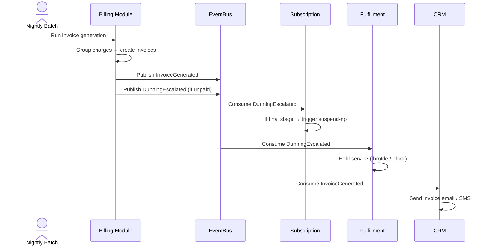

# 📙 Billing Module — Onboarding Guide

> **Module:** `Modules/Billing`  
> **Bundle:** Billing, Payments, Invoicing, Dunning, Wallet (DD 05 — BIL)  
> **What it does:** Handles everything related to money — generating invoices, processing payments, managing customer wallets, chasing unpaid bills (dunning), and issuing credit/debit notes. **Billing owns the money.**

---

## 1. What This Module Does (In Plain English)

Every month, your customers need to pay for their internet service. The **Billing** module makes that happen:

- **Charging:** Converts usage data and recurring fees into "charge lines"
- **Invoicing:** Groups charges into invoices with proper legal invoice numbers
- **Payments:** Records payments (cash, mobile money, bank transfer) and allocates them to invoices
- **Wallets:** Manages prepaid balances and top-ups
- **Dunning:** Automatically chases unpaid bills — sends reminders, escalates, and can suspend service
- **Adjustments:** Handles refunds, credits, and billing corrections with approval workflows

**The Golden Rule:** Only Billing writes to `invoices`, `payments`, `wallet_transactions`, and `dunning_states`. Other modules emit events (e.g., "usage recorded") but Billing decides what to charge.

---

## 2. Key Concepts You Must Know

| Term | Meaning |
|------|---------|
| **Charge** | A single line item to bill (e.g., "Internet subscription — June 2026 — $50"). Charges are grouped into invoices. |
| **Invoice** | A legal billing document with a gap-free invoice number. Has SUMMARY (per package) and DETAIL (per charge) lines. |
| **Credit Note / Debit Note** | A correction document. Credit = money back to customer. Debit = extra charge. |
| **Wallet** | A prepaid balance account. Customers top up; charges are deducted automatically. |
| **Dunning** | The process of chasing unpaid bills. Has stages (reminder → warning → suspension threat → suspension). |
| **Payment Allocation** | When a payment comes in, Billing decides which invoice(s) to apply it to. |
| **Billable Event** | Raw usage data (e.g., "500 GB downloaded") that needs to be rated and charged. |
| **Grouping Policy** | How charges are grouped into invoices (e.g., one invoice per customer, or per wallet, or per subscription). |
| **Billing Cycle** | The recurring period (usually monthly) when charges are computed and invoiced. |
| **Proration** | Adjusting charges when a customer starts, pauses, or changes service mid-cycle. |

---

## 3. Architecture Diagrams

### ASCII: Module Placement in the System

```
┌─────────────────────────────────────────────────────────────────────┐
│                        EXTERNAL CALLERS                              │
│  ┌──────────────┐  ┌──────────────┐  ┌──────────────┐              │
│  │ Backoffice   │  │ Payment      │  │ Nightly      │              │
│  │   Finance    │  │   Gateway    │  │   Batch Jobs │              │
│  │   Team       │  │   (M-Pesa,   │  │   (Cron)     │              │
│  │              │  │    Bank)     │  │              │              │
│  └──────┬───────┘  └──────┬───────┘  └──────┬───────┘              │
└─────────┼──────────────────┼──────────────────┼──────────────────────┘
          │                  │                  │
          ▼                  ▼                  ▼
┌─────────────────────────────────────────────────────────────────────┐
│  ┌──────────────────────────────────────────────────────────────┐   │
│  │                  📙 BILLING MODULE                            │   │
│  │                                                              │   │
│  │  Routes (api.php) ──▶ Controllers ──▶ Services ──▶ Models     │   │
│  │                                      │                        │   │
│  │                                      ▼                        │   │
│  │                              Events ──▶ EventBus              │   │
│  │                                                              │   │
│  │  ┌──────────┐  ┌──────────┐  ┌──────────┐  ┌──────────┐    │   │
│  │  │ Invoice  │  │ Payment  │  │ Dunning  │  │ Wallet   │    │   │
│  │  │ Service  │  │ Service  │  │ Service  │  │ Service  │    │   │
│  │  │          │  │          │  │          │  │          │    │   │
│  │  │ "Generate│  │ "Record  │  │ "Chase   │  │ "Top-up  │    │   │
│  │  │  invoice"│  │  payment"│  │  unpaid" │  │  balance"│    │   │
│  │  └──────────┘  └──────────┘  └──────────┘  └──────────┘    │   │
│  └──────────────────────────────────────────────────────────────┘   │
└─────────────────────────────────────────────────────────────────────┘
          │
          │ emits events
          ▼
┌─────────────────────────────────────────────────────────────────────┐
│                        OTHER MODULES (Event Consumers)                │
│  ┌──────────┐  ┌──────────┐  ┌──────────┐  ┌──────────┐            │
│  │  📘      │  │  📦      │  │  📋      │  │  📞      │            │
│  │Subscription│  │Fulfillment│  │ WorkOrder│  │   CRM    │            │
│  │          │  │          │  │          │  │          │            │
│  │ "Confirm │  │ "Hold    │  │ "Create  │  │ "Send    │            │
│  │  billing │  │  service │  │  pickup  │  │  invoice │            │
│  │  intent" │  │  on dun. │  │  order"  │  │  email"  │            │
│  └──────────┘  └──────────┘  └──────────┘  └──────────┘            │
└─────────────────────────────────────────────────────────────────────┘
          │
          │ reads from
          ▼
┌─────────────────────────────────────────────────────────────────────┐
│                        📗 CATALOG MODULE (Reference Data)            │
│  ┌──────────┐  ┌──────────┐                                       │
│  │ Tax Rules│  │ Package  │                                       │
│  │          │  │  Info    │                                       │
│  │ "16% VAT │  │ "Fiber   │                                       │
│  │  + excise│  │  100Mbps"│                                       │
│  └──────────┘  └──────────┘                                       │
└─────────────────────────────────────────────────────────────────────┘
```

### Mermaid: Invoice Generation Flow



---

## 4. Code Tour — Key Files and What They Do

```
Modules/Billing/
├── routes/
│   └── api.php                              # All billing endpoints
│
├── app/
│   ├── Http/
│   │   ├── Controllers/
│   │   │   ├── InvoiceController.php           # Invoice CRUD, PDF generation, reprint
│   │   │   ├── PaymentController.php           # Record payments, allocate, reverse
│   │   │   ├── DunningController.php           # Run dunning, review, clear, advance, hold
│   │   │   ├── WalletController.php            # Wallet balance, transactions, top-up
│   │   │   ├── BillableEventController.php     # Ingest usage events (mediation)
│   │   │   ├── AdjustmentController.php        # Billing adjustments (credits/refunds)
│   │   │   ├── BulkReversalController.php      # Bulk payment reversals
│   │   │   └── UsageController.php             # Usage query/reporting
│   │   └── Requests/                           # FormRequest validation classes
│   │
│   ├── Models/
│   │   ├── Invoice.php                         # The legal invoice document
│   │   ├── InvoiceLine.php                     # SUMMARY and DETAIL lines
│   │   ├── Payment.php                         # A payment record
│   │   ├── PaymentAllocation.php               # Links payments to invoices
│   │   ├── WalletTransaction.php               # Prepaid wallet movements
│   │   ├── BillableEvent.php                   # Raw usage / chargeable events
│   │   ├── DunningState.php                    # Current dunning stage per account
│   │   ├── DunningConfig.php                   # Config: dunning stages and timing
│   │   ├── AdjustmentReasonCode.php            # Config: why was this adjustment made?
│   │   ├── TaxInvoice.php                      # Tax breakdown per invoice
│   │   └── BillingCycle.php                    # Subscription billing cycle tracking
│   │
│   ├── Services/
│   │   ├── InvoiceService.php                    # Generates invoices from charges (BIL-02)
│   │   ├── ChargeComputeService.php             # Rates usage into charge lines
│   │   ├── DunningService.php                   # Dunning logic (BIL-04)
│   │   ├── BillingIntentService.php             # Prepaid intent confirmation
│   │   ├── PaymentAllocationService.php         # Allocates payments to invoices
│   │   ├── WalletService.php                    # Wallet balance management
│   │   └── MediationRatingService.php           # Converts billable events to charges
│   │
│   ├── Events/
│   │   └── BillingEvents.php                    # All billing event constants
│   │
│   └── Listeners/
│       ├── OnSubscriptionActivated.php          # Create billing account on activation
│       ├── OnSubscriptionSuspended.php            # Pause billing on suspension
│       └── OnUsageEventReceived.php             # Rate usage into charges
│
├── database/
│   ├── migrations/                               # Invoice, payment, wallet, dunning tables
│   │   ├── 2026_06_01_100000_create_invoice_tables.php
│   │   ├── 2026_06_02_100000_create_payment_tables.php
│   │   ├── 2026_06_03_100000_create_wallet_tables.php
│   │   ├── 2026_06_04_100000_create_dunning_tables.php
│   │   └── ...
│   └── seeders/                                  # (if any)
│
├── tests/
│   ├── Feature/                                  # API tests
│   └── Unit/                                     # Service tests
│
└── module.json                                   # Module metadata
```

---

## 5. Services, Models, Events, Rules, and Workflows — The Full Map

### Services (Business Logic)

| Service | What It Does | Called By |
|---------|-------------|-----------|
| `InvoiceService` | Generates invoices from charges, creates legal invoice numbers, handles PDF generation | Controllers, Nightly batch jobs |
| `ChargeComputeService` | Rates usage into charge lines (converts "500 GB" to "$10") | MediationRatingService, Controllers |
| `DunningService` | Runs dunning stages, checks unpaid invoices, escalates | Nightly batch, Controllers |
| `BillingIntentService` | Creates prepaid/postpaid billing intents, confirms on payment | Subscription workflow handlers |
| `PaymentAllocationService` | Allocates incoming payments to unpaid invoices (FIFO, LIFO, or custom) | PaymentController |
| `WalletService` | Manages wallet balances, records transactions, handles top-ups | WalletController |
| `MediationRatingService` | Converts raw billable events (usage) into rated charges | BillableEventController, Queue jobs |

### Models (Data)

| Model | Table | What It Stores | Owned By |
|-------|-------|---------------|----------|
| `Invoice` | `invoices` | Legal billing document with gap-free number | Billing |
| `InvoiceLine` | `invoice_lines` | SUMMARY and DETAIL lines per invoice | Billing |
| `Payment` | `payments` | Payment records (cash, mobile money, bank) | Billing |
| `PaymentAllocation` | `payment_allocations` | Links payments to invoices | Billing |
| `WalletTransaction` | `wallet_transactions` | Prepaid wallet movements (top-up, deduction) | Billing |
| `BillableEvent` | `billable_events` | Raw usage data (GB downloaded, calls made) | Billing |
| `DunningState` | `dunning_states` | Current dunning stage per account | Billing |
| `DunningConfig` | `dunning_config` | Config: stages, timing, actions per operator | Billing |
| `AdjustmentReasonCode` | `adjustment_reason_codes` | Config: valid reasons for billing adjustments | Billing |
| `TaxInvoice` | `tax_invoices` | Tax breakdown per invoice line | Billing |
| `BillingCycle` | `billing_cycles` | Tracks active billing periods per subscription | Billing |

### Events (What This Module Publishes)

| Event | When It Happens | Who Consumes It | What They Do |
|-------|-----------------|-----------------|--------------|
| `InvoiceGenerated` | Invoice created from charges | CRM, Subscription, Reporting | CRM: send to customer. Subscription: confirm billing. Reporting: log revenue. |
| `PaymentReceived` | Payment recorded & allocated | Subscription, CRM, Wallet | Subscription: confirm billing intent. CRM: thank you message. Wallet: update balance. |
| `CreditNoteIssued` | Credit note created | Wallet, Subscription | Wallet: add credit. Subscription: if applicable. |
| `DebitNoteIssued` | Debit note created | Invoice, Subscription | Invoice: link to original. Subscription: if applicable. |
| `DunningEscalated` | Account moves to next dunning stage | Subscription, CRM, Fulfillment | Subscription: may trigger suspend-np. CRM: send warning. Fulfillment: throttle service. |
| `DunningCleared` | Account pays up / dunning resolved | Subscription, CRM | Subscription: restore service. CRM: close ticket. |
| `WalletToppedUp` | Prepaid balance added | Subscription, CRM | Subscription: confirm prepaid intent. CRM: send receipt. |
| `AdjustmentApproved` | Billing correction approved | Invoice, Reporting | Invoice: regenerate if needed. Reporting: log adjustment. |
| `BillableEventRated` | Usage converted to charge | Reporting | Reporting: update usage dashboards. |

### Events This Module Listens To

| Event | Listener | What It Does |
|-------|----------|--------------|
| `SubscriptionActivated` | `OnSubscriptionActivated` | Creates billing account, opens first billing cycle |
| `SubscriptionPaused` | `OnSubscriptionSuspended` | Pauses billing cycle, prorates charges |
| `SubscriptionResumed` | `OnSubscriptionResumed` | Resumes billing cycle, prorates charges |
| `SubscriptionTerminated` | `OnSubscriptionTerminated` | Generates final invoice, closes billing account |
| `UsageEventPublished` | `OnUsageEventReceived` | Rates usage into billable charges |
| `PaymentGatewayConfirmed` | `OnPaymentGatewayConfirmed` | Records payment from external gateway |

### Rules (Business Policy Validation)

Rules are **side-effect-free** PHP classes that return `true` (allowed) or throw `DomainException` (rejected). They live in the `Rules` module and are called by controllers and services.

**Important:** Sensitive operations that require approval (e.g., adjustments, payment reversals, credit notes) use the **EM-CFG-04 approval engine** — a unified Foundation service. The Rules module checks *business preconditions* (e.g., "Can this payment be reversed?"), while EM-CFG-04 handles *approval workflow* (e.g., "Does this reversal need manager sign-off?"). The two work together: Rules answer "should we?" and EM-CFG-04 answers "may we?".

| Rule | When It Runs | What It Checks |
|------|-------------|----------------|
| `CanGenerateInvoice` | Before invoice generation | Are charges valid? Is customer active? |
| `CanRecordPayment` | Before payment recording | Is payment amount valid? Is invoice unpaid? |
| `CanReversePayment` | Before payment reversal | Is payment within reversal window? Is allocation valid? |
| `CanEscalateDunning` | Before dunning escalation | Has enough time passed? Is customer in grace period? |
| `CanIssueCreditNote` | Before credit note creation | Is there a valid reason? Is amount within limits? |
| `CanTopUpWallet` | Before wallet top-up | Is customer eligible? Is amount within limits? |

### Workflow References

Billing uses workflows via the EM-CFG-04 engine for:

| Process | Purpose | Approval Required? |
|---------|---------|-------------------|
| `billing-adjustment` | Credit/debit note creation | Yes (via EM-CFG-04, rules-engine decides stepsRequired) |
| `payment-reversal` | Reversing a recorded payment | Yes (manager approval via EM-CFG-04) |
| `dunning-hold` | Pausing dunning for a customer | Yes (customer service manager via EM-CFG-04) |

**EM-CFG-04 Integration:** Adjustments use dynamic stages — the rules engine answers "how many approvals" (stepsRequired), and the proposal raises an `ADJUSTMENT` ApprovalRequest with a single stage carrying that quorum. The engine enforces distinct approvers (one person cannot self-clear a dual-control gate). See [Pattern 6](#pattern-6-how-to-handle-a-billing-adjustment) below.
| `invoice-write-off` | Writing off uncollectible debt | Yes (finance director) |

---

## 6. API Surface — What You Can Call

All endpoints require `auth:sanctum`. The `X-Operator-Code` header scopes all queries.

### Invoices

| Method | Endpoint | Permission | What It Does |
|--------|----------|------------|--------------|
| `GET` | `/api/invoices` | `invoice.read` | List invoices (paginated, filterable by status, customer, date) |
| `GET` | `/api/invoices/{id}` | `invoice.read` | Get invoice + all line items |
| `POST` | `/api/invoices` | `invoice.manage` | Generate an invoice manually |
| `POST` | `/api/invoices/{id}/reprint` | `invoice.read` | Reprint PDF (new copy number) |
| `POST` | `/api/invoices/{id}/void` | `invoice.admin` | Void an invoice (rare — use credit note instead) |

### Payments

| Method | Endpoint | Permission | What It Does |
|--------|----------|------------|--------------|
| `GET` | `/api/payments` | `invoice.read` | List payments |
| `POST` | `/api/payments` | `invoice.manage` | Record a payment |
| `POST` | `/api/payments/{id}/reverse` | `dunning.admin` | Reverse a payment (with approval workflow) |
| `POST` | `/api/payments/bulk-reverse` | `dunning.admin` | Bulk reverse payments (with approval) |
| `GET` | `/api/payments/{id}/allocations` | `invoice.read` | See which invoices this payment was applied to |

### Dunning (Collections)

| Method | Endpoint | Permission | What It Does |
|--------|----------|------------|--------------|
| `GET` | `/api/dunning` | `invoice.read` | List accounts in dunning (filter by stage, amount) |
| `POST` | `/api/dunning/run` | `invoice.manage` | Run dunning batch (automated — usually cron) |
| `GET` | `/api/dunning/{account}` | `invoice.read` | Dunning status for one account |
| `POST` | `/api/dunning/{account}/clear` | `invoice.manage` | Clear dunning (payment received) |
| `POST` | `/api/dunning/{account}/advance` | `dunning.admin` | Force next dunning stage (skip wait) |
| `POST` | `/api/dunning/{account}/hold` | `dunning.admin` | Pause dunning (e.g., customer dispute — requires approval) |

### Wallet

| Method | Endpoint | Permission | What It Does |
|--------|----------|------------|--------------|
| `GET` | `/api/wallets/{account}` | `invoice.read` | Get wallet balance |
| `GET` | `/api/wallets/{account}/transactions` | `invoice.read` | Transaction history (paginated) |
| `POST` | `/api/wallets/{account}/top-up` | `invoice.manage` | Record a top-up (cash, mobile money, etc.) |
| `POST` | `/api/wallets/{account}/deduct` | `invoice.manage` | Manually deduct from wallet (rare — usually automatic) |

### Adjustments

| Method | Endpoint | Permission | What It Does |
|--------|----------|------------|--------------|
| `POST` | `/api/adjustments` | `invoice.manage` | Request a billing adjustment (credit/debit) |
| `POST` | `/api/adjustments/{id}/approve` | `dunning.admin` | Approve adjustment (maker-checker workflow) |
| `POST` | `/api/adjustments/{id}/reject` | `dunning.admin` | Reject adjustment |

### Billable Events (Usage Mediation)

| Method | Endpoint | Permission | What It Does |
|--------|----------|------------|--------------|
| `POST` | `/api/billable-events` | `billing.internal` | Ingest raw usage events (from mediation system) |
| `GET` | `/api/billable-events` | `invoice.read` | Query usage events |
| `POST` | `/api/billable-events/rate` | `billing.internal` | Trigger rating of unprocessed events |

---

## 7. Scheduled Commands / Batch Jobs / Cron Jobs

The Billing module runs these scheduled jobs (defined in `app/Console/Kernel.php` or module service providers):

| Job | Schedule | What It Does | Why |
|-----|----------|-------------|-----|
| `billing:generate-invoices` | Daily at 01:00 | Generates invoices for all active billing cycles | Customers need invoices on their cycle day |
| `billing:run-dunning` | Daily at 02:00 | Checks all unpaid invoices and advances dunning stages | Automatic collections |
| `billing:rate-billable-events` | Every 15 minutes | Rates unprocessed usage events into charges | Near-real-time usage billing |
| `billing:process-wallet-deductions` | Hourly | Deducts wallet balances for prepaid customers | Prepaid customers need continuous service |
| `billing:remind-upcoming-dues` | Daily at 09:00 | Sends reminder emails/SMS for invoices due in 3 days | Reduces late payments |
| `billing:close-expired-cycles` | Daily at 23:00 | Closes billing cycles that have passed their end date | Cleanup |
| `billing:reconcile-payments` | Hourly | Matches PaymentGateway confirmations with Payment records | Ensures no missed payments |
| `billing:generate-dunning-reports` | Weekly | Generates dunning performance report for finance team | Reporting |

**How to check what's scheduled:**
```bash
php artisan schedule:list
```

**How to run a job manually:**
```bash
php artisan billing:generate-invoices --operator=DEFAULT --dry-run
```

**How to run dunning for a specific account:**
```bash
php artisan billing:run-dunning --account=acc_xxx
```

---

## 8. Common Patterns

### Pattern 1: Structured Invoice Generation (SUMMARY → DETAIL)

Invoices have a hierarchy: SUMMARY lines (per package) → DETAIL lines (per charge):

```php
// In InvoiceService::writeStructuredInvoice()
foreach ($charges->groupBy(fn($c) => $c->packageRef ?? 'GENERAL') as $pkg => $pkgCharges) {
    // Create SUMMARY line (what the customer sees first)
    $summary = $invoice->lines()->create([
        'line_type' => 'SUMMARY',
        'description' => $this->packageName($pkg),
        'amount' => $pkgCharges->sum('amount'),
        'tax_amount' => $pkgCharges->sum('tax_amount'),
    ]);

    // Create DETAIL lines under it (drill-down)
    foreach ($pkgCharges as $charge) {
        $invoice->lines()->create([
            'line_type' => 'DETAIL',
            'parent_summary_line_id' => $summary->id,
            'description' => $this->resources[$charge->descriptionKey],
            'amount' => $charge->amount,
            'tax_amount' => $charge->tax_amount,
        ]);
    }
}
```

**Why this matters:** Customers see a clean summary ("Internet Package — $50") but can drill down to details ("Base fee $45 + Overage $5"). This is required by tax authorities in many countries.

### Pattern 2: Gap-Free Legal Invoice Numbers

Every invoice gets a unique, sequential number per operator/fiscal year:

```php
private function nextLegalNumber(string $operator, string $type): string
{
    $year = now()->year;
    $prefix = match ($type) {
        'TAX' => 'TInv',
        'CREDIT_NOTE' => 'CN',
        'DEBIT_NOTE' => 'DN',
        default => 'Inv',
    };

    // Lock the counter row, increment atomically
    $row = DB::table('invoice_sequence')
        ->where('operator_code', $operator)
        ->where('fiscal_year', $year)
        ->where('type', $type)
        ->lockForUpdate()
        ->first();

    $next = ($row->last_number ?? 0) + 1;

    DB::table('invoice_sequence')
        ->where('id', $row->id)
        ->update(['last_number' => $next]);

    return sprintf('%s-%s-%d-%06d', $prefix, $operator, $year, $next);
    // Result: "Inv-DEFAULT-2026-000042"
}
```

**Why this matters:** Tax authorities in most countries require sequential, gap-free invoice numbering. If you have Inv-001 and Inv-003, the tax authority will ask "where is Inv-002?" This code guarantees no gaps using database row locking.

### Pattern 3: Tax Computation Per Line

Tax isn't a flat rate — it depends on service type, customer category, and location:

```php
$taxResult = $this->tax->compute([
    'operatorCode' => $operator,
    'baseAmount' => $charge->amount,
    'taxableKind' => $charge->serviceCategoryCode,  // e.g., "BROADBAND"
    'customerCategory' => $customerCategory,           // e.g., "RESIDENTIAL"
    'customerLocation' => $customerLocation,           // e.g., "NAIROBI_NORTH"
]);

// Returns:
// [
//     'totalTaxAmount' => 8.50,
//     'taxBreakdown' => [
//         ['name' => 'VAT', 'rate' => 16, 'amount' => 8.00],
//         ['name' => 'Excise', 'rate' => 1, 'amount' => 0.50],
//     ]
// ]
```

**Why this matters:** Different services have different tax treatments. Internet might have VAT, voice might have excise tax, business customers might be exempt. The `TaxComputeService` reads from Catalog's `tax_configs` table so tax rules are config-driven, not hardcoded.

### Pattern 4: Dunning as State Machine

Dunning progresses through stages automatically. Each stage has actions and conditions:

```php
// DunningService::run()
foreach ($unpaidAccounts as $account) {
    $dunning = $account->dunningState;
    $daysOverdue = now()->diffInDays($account->oldestUnpaidInvoice->due_date);

    $nextStage = match (true) {
        $daysOverdue > 30 => 'STAGE_4_SUSPEND',      // Final notice → suspend
        $daysOverdue > 21 => 'STAGE_3_FINAL',       // Warning → final notice
        $daysOverdue > 14 => 'STAGE_2_WARNING',     // Reminder → warning
        $daysOverdue > 7 => 'STAGE_1_REMINDER',     // Due → reminder
        default => null,                             // Not yet overdue
    };

    if ($nextStage && $nextStage !== $dunning->stage) {
        $dunning->update(['stage' => $nextStage, 'last_escalated_at' => now()]);
        $this->events->publish(new DomainEvent(
            type: BillingEvents::DUNNING_ESCALATED,
            payload: ['accountId' => $account->id, 'stage' => $nextStage],
        ));
    }
}
```

**Why this matters:** Dunning is fully automated. A customer who is 8 days late gets a polite reminder. At 30 days, their service gets suspended. No human intervention required. But each stage emits an event so CRM can send the right message and Subscription can act if needed.

### Pattern 5: Payment Allocation (FIFO by Default)

When a payment comes in, Billing applies it to the oldest unpaid invoice first:

```php
public function allocatePayment(Payment $payment, string $strategy = 'FIFO'): void
{
    $remaining = $payment->amount;

    $invoices = Invoice::query()
        ->where('account_id', $payment->account_id)
        ->where('status', 'UNPAID')
        ->when($strategy === 'FIFO', fn($q) => $q->orderBy('due_date', 'asc'))
        ->when($strategy === 'LIFO', fn($q) => $q->orderBy('due_date', 'desc'))
        ->get();

    foreach ($invoices as $invoice) {
        if ($remaining <= 0) break;

        $toApply = min($remaining, $invoice->balance_due);
        $invoice->allocations()->create([
            'payment_id' => $payment->id,
            'amount' => $toApply,
        ]);
        $invoice->update(['balance_due' => $invoice->balance_due - $toApply]);
        $remaining -= $toApply;
    }

    $payment->update(['allocated_amount' => $payment->amount - $remaining]);
}
```

**Why this matters:** If a customer has 3 unpaid invoices and pays $100, the allocation decides which invoices get paid. FIFO (oldest first) is standard. Some operators prefer LIFO (newest first) or proportional. The strategy is config-driven.

### Pattern 6: How to Handle a Billing Adjustment via EM-CFG-04

Adjustments require approval. The EM-CFG-04 engine handles this with dynamic stages:

```php
// AdjustmentService::propose()
public function propose(array $data, ?string $proposedBy = null): AdjustmentRequest
{
    // ... validation, limit checks ...

    // Rules engine answers "how many approvals needed?"
    $stepsRequired = $this->rules->evaluate('billing.adjustment-approval', [
        'amount' => $data['amount'],
        'operator' => $data['operator_code'],
    ])['stepsRequired'] ?? 1;

    // Open the EM-CFG-04 gate with a single stage carrying the quorum
    $approval = app(ApprovalService::class)->request([
        'operator_code' => $data['operator_code'],
        'entity_type' => 'ADJUSTMENT',
        'entity_ref' => $adjustment->adjustment_id,
        'amount' => (float) $adjustment->amount,
        'stages' => [[
            'name' => 'Adjustment approval',
            'approver_kind' => 'ROLE',
            'approver_roles' => [],
            'required_approvals' => max(1, $stepsRequired),
        ]],
    ]);

    // The engine enforces distinct approvers (one person can't self-clear)
    // and handles the quorum automatically
}
```

**Why this matters:** Previously, adjustments had bespoke approval logic. Now they use the same EM-CFG-04 engine as KYC and HomePass status changes. The rules engine decides how many approvals are needed; the engine enforces distinct approvers and quorum. One unified engine for all approvals.

### Pattern 7: How to Debug an Unpaid Invoice

```bash
# Check the invoice details
SELECT * FROM invoices WHERE invoice_id = 'inv_xxx';

# Check payment allocations
SELECT * FROM payment_allocations WHERE invoice_id = 'inv_xxx';

# Check if a payment was recorded but not allocated
SELECT * FROM payments WHERE account_id = 'acc_xxx' AND allocated_amount < amount;

# Check dunning state
SELECT * FROM dunning_states WHERE account_id = 'acc_xxx';

# Check if the customer has credit balance
SELECT * FROM account_credit_balance WHERE account_id = 'acc_xxx';

# Re-run allocation manually
php artisan billing:reallocate --invoice=inv_xxx
```

**Why this matters:** An invoice can be unpaid for many reasons: payment not received, payment not allocated, credit balance not applied, or dunning hold. These queries help you find the exact cause.

### Pattern 8: How to Process a Bulk Reversal

Bulk reversals are dual-controlled (requester ≠ approver) via EM-CFG-04:

```php
// BulkReversalService::request()
public function request(array $data): BulkReversal
{
    $reversal = BulkReversal::query()->create($data);

    // Open EM-CFG-04 gate with two stages for dual control
    $approval = app(ApprovalService::class)->request([
        'operator_code' => $data['operator_code'],
        'entity_type' => 'BULK_REVERSAL',
        'entity_ref' => $reversal->id,
        'stages' => [
            ['name' => 'Requester', 'approver_kind' => 'ROLE', 'required_approvals' => 1],
            ['name' => 'Reviewer', 'approver_kind' => 'ROLE', 'required_approvals' => 1],
        ],
    ]);

    return $reversal;
}
```

**Why this matters:** Reversing 1,000 payments is a high-risk operation. Dual control ensures two different people review the request. The EM-CFG-04 engine enforces that the requester and approver are distinct users.

### Pattern 9: How to Handle a Wallet Top-Up

```php
// WalletService::topUp()
public function topUp(string $accountId, float $amount, string $source): WalletTransaction
{
    return DB::transaction(function () use ($accountId, $amount, $source) {
        $wallet = Wallet::query()->where('account_id', $accountId)->firstOrFail();

        $wallet->balance += $amount;
        $wallet->save();

        $transaction = WalletTransaction::query()->create([
            'wallet_id' => $wallet->id,
            'amount' => $amount,
            'type' => 'TOPUP',
            'source' => $source, // e.g., 'M-PESA', 'BANK_TRANSFER', 'CASH'
        ]);

        $this->events->publish(new DomainEvent(
            type: BillingEvents::WALLET_TOPPED_UP,
            payload: ['accountId' => $accountId, 'amount' => $amount],
        ));

        return $transaction;
    });
}
```

**Why this matters:** Wallet top-ups are simple but critical. They must be atomic (balance + transaction in one DB transaction) and emit an event so other modules can react. If a prepaid customer tops up, the dunning state might need to be cleared.

### Pattern 10: How to Retry a Failed Invoice Generation

```bash
# Check the failure queue
SELECT * FROM generation_failures WHERE status = 'PENDING';

# Retry a specific failure
php artisan billing:retry-generation --failure-id=gf_xxx

# Retry all pending failures
php artisan billing:retry-generation --all

# Check if the retry succeeded
SELECT * FROM generation_failures WHERE id = 'gf_xxx';

# Check the invoice was created
SELECT * FROM invoices WHERE cycle_id = 'cycle_xxx';
```

**Why this matters:** Invoice generation can fail for transient reasons (DB timeout, network issue). The failure queue captures these and retries them automatically. But sometimes you need to manually retry after fixing the root cause.

---

## 9. Dependencies — What This Module Needs

| Module | What It Uses | How It Uses It | File Paths |
|--------|-------------|----------------|------------|
| **Catalog** | Tax rules, package info, wallet configs | `TaxComputeService` reads from `tax_configs`. `InvoiceService` reads package descriptions. | `Services/InvoiceService.php`, `Services/TaxComputeService.php` |
| **Subscription** | Subscription status, customer data, billing mode | Reads to know when to invoice. Emits events that Subscription consumes. | `Listeners/OnSubscriptionActivated.php` |
| **Ilm** | Customer snapshots (name, address, category) | Used for invoice headers and tax computation. | `Services/InvoiceService.php` |
| **PaymentGateway** | Payment confirmations from external gateways | `Listeners/OnPaymentGatewayConfirmed.php` records payments from M-Pesa, bank, etc. | `Listeners/OnPaymentGatewayConfirmed.php` |
| **Rules** | Dunning policy, billing validation | `DunningService` checks rules before escalation. `InvoiceService` validates before generation. | `Services/DunningService.php` |
| **Workflow** | Adjustment approval, payment reversal | `AdjustmentController` triggers approval workflow. `PaymentController` triggers reversal workflow. | `AdjustmentController.php`, `PaymentController.php` |

### What Depends on This Module

| Module | Why It Needs Billing |
|--------|---------------------|
| **Subscription** | Listens to `InvoiceGenerated` to confirm billing intent. Receives `DunningEscalated` to potentially suspend. |
| **CRM** | Listens to `InvoiceGenerated`, `PaymentReceived`, `DunningEscalated` to send customer communications. |
| **Fulfillment** | Listens to `DunningEscalated` to hold/throttle service. Listens to `DunningCleared` to restore service. |
| **Reporting** | Reads invoice data for revenue dashboards, payment reports, dunning analytics. |
| **Ticketing** | Creates tickets when dunning escalates to final stage or when payments fail. |

---

## 10. New Dev Checklist

### Must-Read Files (In Order)

- [ ] `Modules/Billing/app/Models/Invoice.php` — Understand the invoice structure and legal number generation
- [ ] `Modules/Billing/app/Services/InvoiceService.php` — See how invoices are generated from charges
- [ ] `Modules/Billing/app/Services/DunningService.php` — Understand dunning stages and automation
- [ ] `Modules/Billing/app/Services/PaymentAllocationService.php` — See how payments are allocated
- [ ] `Modules/Billing/app/Models/DunningState.php` — Understand dunning state tracking
- [ ] `Modules/Billing/routes/api.php` — See all endpoints in one place

### Must-Run Commands

```bash
# Run billing tests
php artisan test --filter=Billing

# See what invoices exist
php artisan tinker --execute="dd(Invoice::query()->with('lines')->limit(5)->get());"

# Check dunning states
php artisan tinker --execute="dd(DunningState::query()->where('stage', '!=', 'CLEARED')->limit(5)->get());"

# Check scheduled jobs
php artisan schedule:list

# Run invoice generation manually (dry run)
php artisan billing:generate-invoices --operator=DEFAULT --dry-run

# Run dunning manually
php artisan billing:run-dunning --operator=DEFAULT

# Check failed jobs
php artisan queue:failed
```

### How to Add a New Tax Rule

1. Add tax config: `POST /api/tax-configs` (as Catalog admin)
2. Test computation: `POST /api/tax-configs/compute`
3. Create a subscription with the relevant service
4. Generate an invoice: `POST /api/invoices`
5. Verify tax breakdown in invoice lines

### How to Handle a Customer Dispute (Dunning Hold)

1. Find account dunning state: `GET /api/dunning/{account}`
2. Place hold: `POST /api/dunning/{account}/hold` (requires approval workflow)
3. Investigation happens... (CRM/CS team handles this)
4. Clear hold: `POST /api/dunning/{account}/clear` or resume normal dunning

### Debugging Guide

**"Invoice has no tax!"**
```bash
# Check tax config for this service/location/customer
SELECT * FROM tax_configs
WHERE operator_code = 'DEFAULT'
  AND service_category = 'BROADBAND'
  AND customer_category = 'RESIDENTIAL'
  AND location = 'NAIROBI'
  AND active = true;

# Check if Catalog's TaxComputeService is reachable
php artisan tinker --execute="
    $svc = app(\Modules\Catalog\app\Services\TaxComputeService::class);
    dd($svc->compute([...]));
"
```

**"Payment not allocated to invoice!"**
```bash
# Check payment allocations
SELECT * FROM payment_allocations WHERE payment_id = 'pay_xxx';

# Check if invoice status is UNPAID
SELECT status, balance_due FROM invoices WHERE id = 'inv_xxx';

# Check payment allocation strategy for this operator
SELECT * FROM billing_config WHERE operator_code = 'DEFAULT' AND key = 'payment_allocation_strategy';
```

**"Dunning not advancing!"**
```bash
# Check dunning config
SELECT * FROM dunning_config WHERE operator_code = 'DEFAULT' ORDER BY stage_order;

# Check if account is on hold
SELECT * FROM dunning_states WHERE account_id = 'acc_xxx' AND hold_until IS NOT NULL;

# Check if customer has dunning exemption
SELECT * FROM customer_exemptions WHERE account_id = 'acc_xxx' AND type = 'DUNNING';
```

**"Wallet balance wrong!"**
```bash
# Check wallet transactions
SELECT * FROM wallet_transactions WHERE account_id = 'acc_xxx' ORDER BY created_at DESC;

# Recalculate balance from transactions
SELECT SUM(CASE WHEN type = 'CREDIT' THEN amount ELSE -amount END) as balance
FROM wallet_transactions WHERE account_id = 'acc_xxx';
```

---

## 11. Quick FAQ

**Q: What's the difference between a Charge and an Invoice?**  
A: A Charge is a single line item ("Internet June — $50"). An Invoice is a legal document that groups multiple charges. One invoice can have many charges. Think of Charge as a line item, Invoice as the document.

**Q: Why are invoice numbers gap-free?**  
A: Tax law in most countries requires sequential, gap-free invoice numbering. If you have Inv-001 and Inv-003, the tax authority will ask "where is Inv-002?" We use `invoice_sequence` with database row locking to guarantee this. No UUIDs allowed!

**Q: What happens if tax computation fails?**  
A: Tax failure is caught and defaults to zero tax (`$taxResult = ['totalTaxAmount' => 0]`). The invoice still generates — partial tax is better than no invoice. The failure is logged and a notification is sent to the finance team.

**Q: Can I delete an invoice?**  
A: **NO.** Invoices are immutable legal documents. If there's a mistake, you issue a Credit Note (money back) or Debit Note (extra charge). Deleting an invoice is illegal in most jurisdictions.

**Q: What's the difference between a Wallet and a Payment?**  
A: A Wallet is a **prepaid balance** (customer tops up, then charges are deducted automatically). A Payment is a **postpaid settlement** (customer pays after receiving an invoice). A customer can have both: a wallet for prepaid services and payment records for postpaid invoices.

**Q: Who triggers dunning?**  
A: Usually a nightly cron job (`billing:run-dunning`) checks all unpaid invoices and advances dunning stages automatically. But a backoffice user can also trigger it manually via `POST /api/dunning/run` or force a specific account with `POST /api/dunning/{account}/advance`.

**Q: What is proration?**  
A: When a customer starts service on the 15th of the month, they shouldn't pay for the full month. Proration calculates the partial charge: `(monthly_price / days_in_month) * days_of_service`. Billing does this automatically when a subscription is activated mid-cycle.

**Q: What happens when a customer pays partially?**  
A: The payment allocation service applies the payment to the oldest invoice first (FIFO). If $100 is paid against a $150 invoice, the invoice balance becomes $50 and status remains `UNPAID`. The customer still gets dunning reminders for the remaining $50.

**Q: What's a Credit Note vs a Debit Note?**  
A: A **Credit Note** is money back to the customer (e.g., refund, billing correction). A **Debit Note** is an extra charge (e.g., missed usage, correction). Both are legal documents with their own gap-free numbers. Both reference the original invoice.

**Q: How do I know if a subscription is prepaid or postpaid?**  
A: Check the `billing_mode` field on the subscription. `PREPAID` means wallet-based (charges deducted automatically). `POSTPAID` means invoice-based (pay after usage). `HYBRID` means both. Billing reads this from Subscription and handles each mode differently.

---

> **Next:** Read the [Subscription Module Guide](./Subscription.md) — where the customer journey begins.
