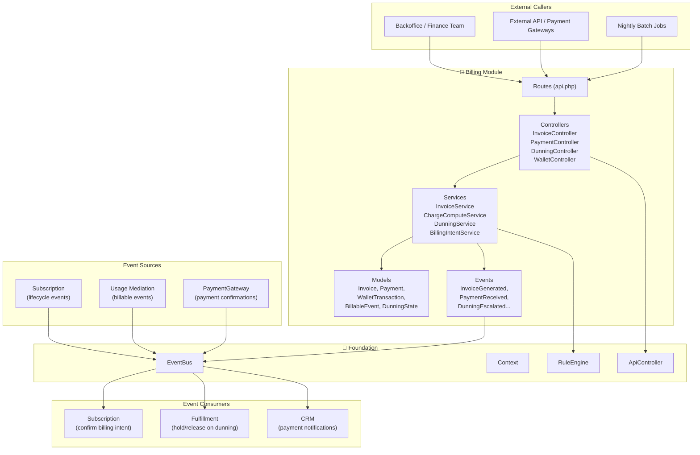
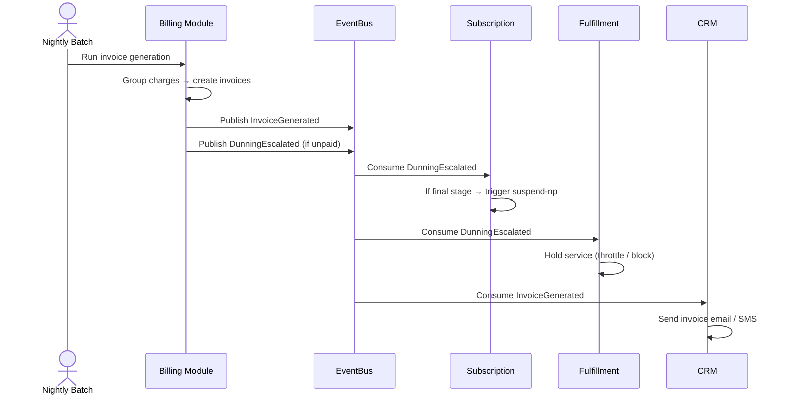

# 📙 Billing Module — Onboarding Guide

> **Module:** `Modules/Billing`  
> **Bundle:** Billing, Payments, Invoicing, Dunning, Wallet (DD 05 — BIL)  
> **What it does:** Handles everything related to money — generating invoices, processing payments, managing customer wallets, chasing unpaid bills (dunning), and issuing credit/debit notes. **Billing owns the money.**

---

## 1. What This Module Does (In Plain English)

Every month, your customers need to pay for their internet service. The **Billing** module makes that happen:

- **Charging:** Converts usage data and recurring fees into "charge lines"
- **Invoicing:** Groups charges into invoices with proper legal invoice numbers
- **Payments:** Records payments (cash, mobile money, bank transfer) and allocates them to invoices
- **Wallets:** Manages prepaid balances and top-ups
- **Dunning:** Automatically chases unpaid bills — sends reminders, escalates, and can suspend service
- **Adjustments:** Handles refunds, credits, and billing corrections with approval workflows

**Key rule:** Only Billing writes to `invoices`, `payments`, `wallet_transactions`, and `dunning_states`. Other modules emit events (e.g., "usage recorded") but Billing decides what to charge.

---

## 2. Key Concepts You Must Know

| Term | Meaning |
|------|---------|
| **Charge** | A single line item to bill (e.g., "Internet subscription — June 2026 — $50"). Charges are grouped into invoices. |
| **Invoice** | A legal billing document with a gap-free invoice number. Has SUMMARY (per package) and DETAIL (per charge) lines. |
| **Credit Note / Debit Note** | A correction document. Credit = money back to customer. Debit = extra charge. |
| **Wallet** | A prepaid balance account. Customers top up; charges are deducted. |
| **Dunning** | The process of chasing unpaid bills. Has stages (reminder → warning → suspension threat → suspension). |
| **Payment Allocation** | When a payment comes in, Billing decides which invoice(s) to apply it to. |
| **Billable Event** | Raw usage data (e.g., "500 GB downloaded") that needs to be rated and charged. |
| **Grouping Policy** | How charges are grouped into invoices (e.g., one invoice per customer, or per wallet, or per subscription). |

---

## 3. Architecture Diagram



---

## 4. Code Tour — Key Files

```
Modules/Billing/
├── app/
│   ├── Http/Controllers/
│   │   ├── InvoiceController.php           ← Invoice CRUD, PDF generation, reprint
│   │   ├── PaymentController.php           ← Record payments, allocate, reverse
│   │   ├── DunningController.php           ← Run dunning, review, clear, advance, hold
│   │   ├── WalletController.php            ← Wallet balance, transactions, top-up
│   │   ├── BillableEventController.php     ← Ingest usage events (mediation)
│   │   ├── AdjustmentController.php        ← Billing adjustments (credits/refunds)
│   │   ├── BulkReversalController.php      ← Bulk payment reversals
│   │   └── UsageController.php             ← Usage query/reporting
│   ├── Models/
│   │   ├── Invoice.php                     ← The legal invoice document
│   │   ├── Payment.php                     ← A payment record
│   │   ├── PaymentAllocation.php           ← Links payments to invoices
│   │   ├── WalletTransaction.php           ← Prepaid wallet movements
│   │   ├── BillableEvent.php               ← Raw usage / chargeable events
│   │   ├── DunningState.php                ← Current dunning stage per account
│   │   ├── AdjustmentReasonCode.php        ← Config: why was this adjustment made?
│   │   └── TaxInvoice.php                  ← Tax breakdown per invoice
│   ├── Services/
│   │   ├── InvoiceService.php              ← Generates invoices from charges (BIL-02)
│   │   ├── ChargeComputeService.php        ← Rates usage into charge lines
│   │   ├── DunningService.php              ← Dunning logic (BIL-04)
│   │   ├── BillingIntentService.php        ← Prepaid intent confirmation
│   │   └── MediationRatingService.php      ← Converts billable events to charges
│   ├── Events/
│   │   └── BillingEvents.php               ← All billing event constants
│   └── Listeners/
│       └── ...                             ← Consumes events from other modules
├── database/migrations/
│   └── (invoice, payment, wallet, dunning tables)
├── routes/
│   └── api.php                             ← All billing endpoints
└── tests/
    ├── Feature/
    └── Unit/
```

---

## 5. API Surface — What You Can Call

### Invoices
| Method | Endpoint | Permission | What it does |
|--------|----------|------------|--------------|
| `GET` | `/api/invoices` | `invoice.read` | List invoices (paginated, filterable) |
| `GET` | `/api/invoices/{id}` | `invoice.read` | Get invoice + line items |
| `POST` | `/api/invoices` | `invoice.manage` | Generate an invoice manually |
| `POST` | `/api/invoices/{id}/reprint` | `invoice.read` | Reprint PDF |

### Payments
| Method | Endpoint | Permission | What it does |
|--------|----------|------------|--------------|
| `GET` | `/api/payments` | `invoice.read` | List payments |
| `POST` | `/api/payments` | `invoice.manage` | Record a payment |
| `POST` | `/api/payments/{id}/reverse` | `dunning.admin` | Reverse a payment |
| `POST` | `/api/payments/bulk-reverse` | `dunning.admin` | Bulk reverse payments |

### Dunning (Collections)
| Method | Endpoint | Permission | What it does |
|--------|----------|------------|--------------|
| `GET` | `/api/dunning` | `invoice.read` | List accounts in dunning |
| `POST` | `/api/dunning/run` | `invoice.manage` | Run dunning batch (automated) |
| `GET` | `/api/dunning/{account}` | `invoice.read` | Dunning status for one account |
| `POST` | `/api/dunning/{account}/clear` | `invoice.manage` | Clear dunning (payment received) |
| `POST` | `/api/dunning/{account}/advance` | `dunning.admin` | Force next dunning stage |
| `POST` | `/api/dunning/{account}/hold` | `dunning.admin` | Pause dunning (e.g., customer dispute) |

### Wallet
| Method | Endpoint | Permission | What it does |
|--------|----------|------------|--------------|
| `GET` | `/api/wallets/{account}` | `invoice.read` | Get wallet balance |
| `GET` | `/api/wallets/{account}/transactions` | `invoice.read` | Transaction history |
| `POST` | `/api/wallets/{account}/top-up` | `invoice.manage` | Record a top-up |

### Adjustments
| Method | Endpoint | Permission | What it does |
|--------|----------|------------|--------------|
| `POST` | `/api/adjustments` | `invoice.manage` | Request a billing adjustment |
| `POST` | `/api/adjustments/{id}/approve` | `dunning.admin` | Approve adjustment (maker-checker) |

---

## 6. Events — What This Module Publishes



**Key Event Types:**

| Event | When it fires | Who listens |
|-------|---------------|-------------|
| `InvoiceGenerated` | Invoice created from charges | CRM (send to customer), Subscription (confirm billing), Reporting |
| `PaymentReceived` | Payment recorded & allocated | Subscription (confirm billing intent), CRM (thank you), Wallet (update balance) |
| `CreditNoteIssued` | Credit note created | Wallet (add credit), Subscription (if applicable) |
| `DebitNoteIssued` | Debit note created | Invoice (link to original), Subscription |
| `DunningEscalated` | Account moves to next dunning stage | Subscription (may suspend), CRM (send warning), Fulfillment (throttle) |
| `DunningCleared` | Account pays up / dunning resolved | Subscription (restore service), CRM (close ticket) |
| `WalletToppedUp` | Prepaid balance added | Subscription (confirm prepaid intent), CRM (receipt) |
| `AdjustmentApproved` | Billing correction approved | Invoice (regenerate if needed), Reporting |

---

## 7. Dependencies — What This Module Needs

| Module | What Billing Uses It For |
|--------|--------------------------|
| **Catalog** | Reads tax rules (`TaxComputeService`), package info (for invoice descriptions), wallet type configs |
| **Subscription** | Reads subscription status and customer data. Emits events that Subscription consumes. |
| **Ilm** | Reads customer snapshots (name, address, category) for invoice headers |
| **PaymentGateway** | Receives payment confirmations from external gateways (M-Pesa, bank, etc.) |
| **Rules** | Dunning policy rules (e.g., "how many days before first reminder?") |
| **Workflow** | Adjustment approval workflows (maker-checker) |

---

## 8. Common Patterns

### Pattern 1: Structured Invoice Generation
Invoices have a hierarchy: SUMMARY lines (per package) → DETAIL lines (per charge):
```php
// In InvoiceService::writeStructuredInvoice()
foreach ($charges->groupBy(fn($c) => $c->packageRef ?? 'GENERAL') as $pkg => $pkgCharges) {
    // Create SUMMARY line
    $invoice->lines()->create(['line_type' => 'SUMMARY', 'description' => ..., ...]);

    // Create DETAIL lines under it
    foreach ($pkgCharges as $charge) {
        $invoice->lines()->create([
            'line_type' => 'DETAIL',
            'parent_summary_line_id' => $summaryId,
            'description' => $resources[$charge->descriptionKey],
            ...
        ]);
    }
}
```
**Why:** Customers see a clean summary ("Internet Package — $50") but can drill down to details ("Base fee $45 + Overage $5").

### Pattern 2: Gap-Free Legal Invoice Numbers
Every invoice gets a unique, sequential number per operator/fiscal year:
```php
private function nextLegalNumber(string $operator, string $type): string
{
    $year = now()->year;
    $prefix = match ($type) {
        'TAX' => 'TInv',
        'CREDIT_NOTE' => 'CN',
        'DEBIT_NOTE' => 'DN',
        default => 'Inv',
    };

    // Lock the counter row, increment atomically
    $row = DB::table('invoice_sequence')
        ->where(...)
        ->lockForUpdate()
        ->first();

    return sprintf('%s-%s-%d-%06d', $prefix, $operator, $year, $next);
}
```
**Why:** Tax authorities require gap-free, sequential invoice numbers. No UUIDs here!

### Pattern 3: Tax Computation Per Line
Tax isn't a flat rate — it depends on service type, customer category, and location:
```php
$taxResult = $this->tax->compute([
    'operatorCode' => $operator,
    'baseAmount' => $charge->amount,
    'taxableKind' => $charge->serviceCategoryCode,
    'customerCategory' => $customerCategory,
    'customerLocation' => $customerLocation,
]);
```
**Why:** Different services have different tax treatments. Internet might have VAT, voice might have excise tax, business customers might be exempt.

### Pattern 4: Dunning as State Machine
Dunning progresses through stages automatically. Each stage has actions (send email, escalate) and conditions (days since due date):
```php
// DunningState model tracks the current stage
// DunningService::run() checks each account:
// - Days since due date > 7? → Stage 1 (Reminder)
// - Days since due date > 14? → Stage 2 (Warning)
// - Days since due date > 21? → Stage 3 (Final Notice)
// - Days since due date > 30? → Stage 4 (Suspend)
// Each stage emits DunningEscalated
```

---

## 9. New Dev Checklist

- [ ] Read this guide
- [ ] Read `docs/design/05_billing/` — understand BIL-01 (charging), BIL-02 (invoicing), BIL-04 (dunning)
- [ ] Understand the invoice line hierarchy (SUMMARY → DETAIL)
- [ ] Trace how a `BillableEvent` becomes a `Charge` becomes an `Invoice`
- [ ] Understand gap-free invoice numbering (`invoice_sequence` table)
- [ ] Try generating an invoice via Postman
- [ ] Understand dunning stages and when `suspend-np` is triggered
- [ ] Read `TaxComputeService` and how it calls Catalog
- [ ] Run tests: `php artisan test --filter=Billing`
- [ ] Ask: "What happens when a customer pays partially?" → Trace payment allocation logic

---

## 10. Quick FAQ

**Q: What's the difference between a Charge and an Invoice?**  
A: A Charge is a single line item ("Internet June — $50"). An Invoice is a legal document that groups multiple charges. One invoice can have many charges.

**Q: Why are invoice numbers gap-free?**  
A: Tax law in most countries requires sequential, gap-free invoice numbering. We use `invoice_sequence` with row locking to guarantee this.

**Q: What happens if tax computation fails?**  
A: Tax failure is caught and defaults to zero tax (`$taxResult = ['totalTaxAmount' => 0]`). The invoice still generates — partial tax is better than no invoice.

**Q: Can I delete an invoice?**  
A: **No.** Invoices are immutable legal documents. If there's a mistake, you issue a Credit Note or Debit Note.

**Q: What's the difference between a Wallet and a Payment?**  
A: A Wallet is a **prepaid balance** (customer tops up, then charges deduct from it). A Payment is a **postpaid settlement** (customer pays after receiving an invoice).

**Q: Who triggers dunning?**  
A: Usually a nightly cron job calls `POST /dunning/run`. It checks all unpaid invoices and advances dunning stages automatically.

---

> **Next:** Read the [Subscription Module Guide](./subscription.md) — where the customer journey begins.
