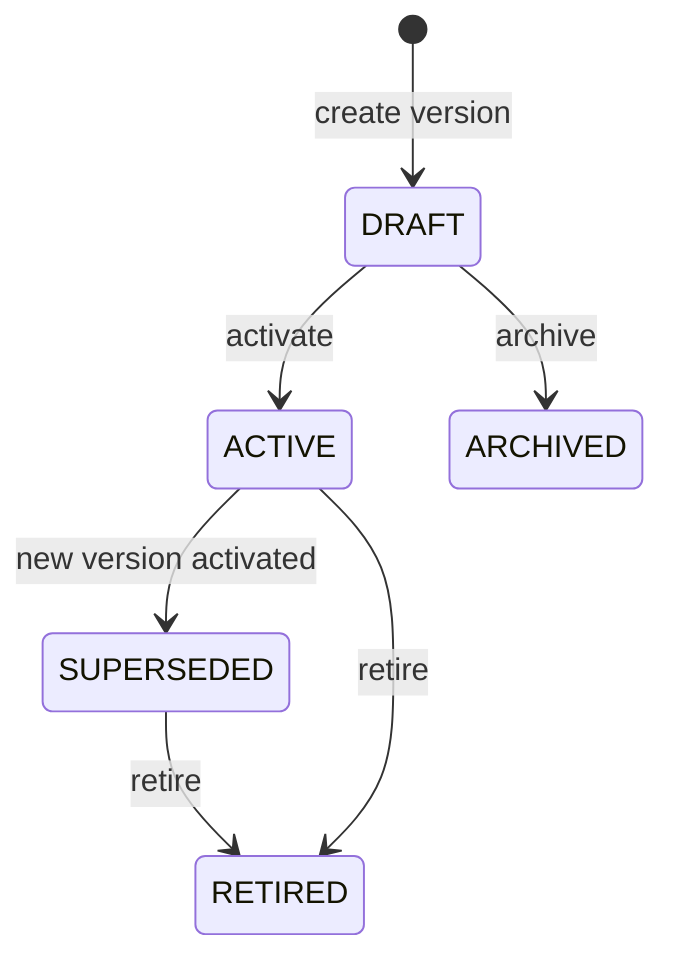

# 📗 Catalog Module — Onboarding Guide

> **Module:** `Modules/Catalog`  
> **Bundle:** Product & Reference Data (DD 09 — PLM, SIP, RLM, Tax, Wallet)  
> **What it does:** Stores everything your company sells — internet packages, service classes, prices, taxes, coverage areas (HomePasses), and equipment. **This is the reference data layer.** Other modules read from it but never write to its tables.

---

## 1. What This Module Does (In Plain English)

When a customer wants to buy fiber internet, the sales rep needs to know:

- What packages are available? (e.g., "Fiber 100 Mbps — $50/month")
- What services are included? (e.g., internet, IPTV, voice)
- Is their address covered? (HomePass lookup)
- How much tax applies? (tax rules per region/customer type)
- What wallet types can they use? (prepaid, postpaid, hybrid)

The **Catalog** module owns all of this data. It is the **authoritative source** for product and reference data.

**The Golden Rule:** Catalog owns the `services`, `packages`, `home_passes`, `tax_configs`, etc. Subscription reads packages to validate subscriptions. Billing reads tax rules to compute invoice tax. Fulfillment reads HomePass locations to plan installs. But **only Catalog writes to these tables.**

---

## 2. Key Concepts You Must Know

| Term | Meaning |
|------|---------|
| **Service** | A single product offering (e.g., "Internet Access", "IPTV Basic"). Has a code and category. |
| **Service Class** | A grouping of services (e.g., "Residential Fiber", "Business Fiber"). Controls which services can be bundled together. |
| **Package** | A sellable bundle of services with a price (e.g., "Home Fiber Plus — Internet 100Mbps + IPTV"). |
| **Package Version** | Packages can have multiple versions (price changes, feature updates). Only one version is ACTIVE at a time. |
| **HomePass** | A physical address / network termination point. Has a unique address tuple + GPS coordinates + tech region. |
| **Tech Region** | A geographic service area (e.g., "Nairobi North", "Mombasa Central"). Has a contractor and deployment status. |
| **Campaign** | A time-limited promotional offer (e.g., "50% off first 3 months"). Has start/end dates and eligibility rules. |
| **Tax Config** | Rules for computing tax (VAT, excise, etc.) based on service type, customer category, and location. |
| **Wallet Type** | Prepaid, postpaid, or hybrid wallet configurations per operator. |
| **Service Category** | Classification of services (e.g., "BROADBAND", "VOICE", "TV"). Used for tax and reporting. |

---

## 3. Architecture Diagrams

### ASCII: Module Placement in the System

```
┌─────────────────────────────────────────────────────────────────────┐
│                        EXTERNAL CALLERS                              │
│  ┌──────────────┐  ┌──────────────┐  ┌──────────────┐              │
│  │ Backoffice   │  │ Sales / CRM  │  │ External API │              │
│  │   Admin      │  │   Team       │  │   Clients    │              │
│  └──────┬───────┘  └──────┬───────┘  └──────┬───────┘              │
└─────────┼──────────────────┼──────────────────┼──────────────────────┘
          │                  │                  │
          ▼                  ▼                  ▼
┌─────────────────────────────────────────────────────────────────────┐
│  ┌──────────────────────────────────────────────────────────────┐   │
│  │                  📗 CATALOG MODULE                            │   │
│  │                                                              │   │
│  │  Routes (api.php) ──▶ Controllers ──▶ Services ──▶ Models     │   │
│  │                                      │                        │   │
│  │                                      ▼                        │   │
│  │                              Events ──▶ EventBus                │   │
│  │                                                              │   │
│  │  ┌──────────┐  ┌──────────┐  ┌──────────┐  ┌──────────┐    │   │
│  │  │ Package  │  │ HomePass │  │  Tax     │  │ Campaign │    │   │
│  │  │ Service  │  │ TechReg. │  │ Compute  │  │  Offer   │    │   │
│  │  │   CRUD   │  │   CRUD   │  │ Service  │  │   CRUD   │    │   │
│  │  └──────────┘  └──────────┘  └──────────┘  └──────────┘    │   │
│  └──────────────────────────────────────────────────────────────┘   │
└─────────────────────────────────────────────────────────────────────┘
          │
          │ read-only access (never writes!)
          ▼
┌─────────────────────────────────────────────────────────────────────┐
│                        OTHER MODULES (Read-Only Consumers)            │
│  ┌──────────┐  ┌──────────┐  ┌──────────┐  ┌──────────┐            │
│  │  📘      │  │  📙      │  │  📦      │  │  📞      │            │
│  │Subscription│  │ Billing  │  │Fulfillment│  │   CRM    │            │
│  │          │  │          │  │          │  │          │            │
│  │ "Valid.  │  │ "Compute │  │ "Where   │  │ "Eligible│            │
│  │  package"│  │   tax"   │  │  to go"  │  │  for    │            │
│  │          │  │          │  │          │  │ campaign"│            │
│  └──────────┘  └──────────┘  └──────────┘  └──────────┘            │
└─────────────────────────────────────────────────────────────────────┘
```

### Mermaid: Package Version Lifecycle



---

## 4. Code Tour — Key Files and What They Do

```
Modules/Catalog/
├── routes/
│   └── api.php                              # All catalog endpoints
│
├── app/
│   ├── Http/
│   │   ├── Controllers/
│   │   │   ├── PackageController.php           # CRUD for packages + versions
│   │   │   ├── ServiceController.php           # CRUD for services
│   │   │   ├── ServiceClassController.php        # Service class management
│   │   │   ├── HomePassController.php            # HomePass CRUD + bulk import
│   │   │   ├── TechRegionController.php          # Tech region management
│   │   │   ├── TaxController.php                 # Tax rule CRUD
│   │   │   ├── CampaignController.php            # Promotional campaigns
│   │   │   └── WalletCatalogController.php       # Wallet type configs
│   │   └── Requests/                           # FormRequest validation classes
│   │
│   ├── Models/
│   │   ├── Package.php                         # A sellable bundle
│   │   ├── PackageVersion.php                  # Versioned pricing/features
│   │   ├── Service.php                         # A single service offering
│   │   ├── ServiceClass.php                    # Groups services
│   │   ├── HomePass.php                        # Physical address / network point
│   │   ├── TechRegion.php                      # Geographic service area
│   │   ├── HomePassStatusCode.php              # Config catalog for HomePass states
│   │   ├── TaxConfig.php                       # Tax computation rules
│   │   ├── CampaignOffer.php                   # Promotional campaign
│   │   └── WalletType.php                      # Wallet type configuration
│   │
│   ├── Services/
│   │   ├── CatalogService.php                  # Core writes: create, activate, import
│   │   ├── TaxComputeService.php               # Computes tax for a charge
│   │   ├── DiscountComputeService.php          # Computes discounts/campaigns
│   │   └── NetworkCatalogService.php           # Network topology / node data
│   │
│   ├── Events/
│   │   └── CatalogEvents.php                   # All catalog event constants
│   │
│   └── Listeners/
│       └── ...                                 # (mostly consumers from other modules)
│
├── database/
│   ├── migrations/                              # Schema for all catalog tables
│   │   ├── 2026_06_01_100000_create_service_tables.php
│   │   ├── 2026_06_02_100000_create_package_tables.php
│   │   ├── 2026_06_03_100000_create_home_pass_tables.php
│   │   ├── 2026_06_04_100000_create_tech_region_tables.php
│   │   ├── 2026_06_05_100000_create_tax_config_tables.php
│   │   └── ...
│   └── seeders/                                 # (if any)
│
├── tests/
│   ├── Feature/                                 # API tests
│   └── Unit/                                    # Service tests
│
└── module.json                                  # Module metadata
```

---

## 5. Services, Models, Events, Rules, and Workflows — The Full Map

### Services (Business Logic)

| Service | What It Does | Called By |
|---------|-------------|-----------|
| `CatalogService` | Creates packages, services, HomePasses. Activates package versions. Handles bulk import. | Controllers, Seeders |
| `TaxComputeService` | Computes tax for a charge based on service type, customer category, location | Billing module |
| `DiscountComputeService` | Applies campaign discounts and promotional offers | Billing module |
| `NetworkCatalogService` | Manages network topology, node data, coverage maps | Fulfillment, Provisioning |

### Models (Data)

| Model | Table | What It Stores | Owned By |
|-------|-------|---------------|----------|
| `Package` | `packages` | Sellable bundle metadata | Catalog |
| `PackageVersion` | `package_versions` | Versioned pricing, features, eligibility | Catalog |
| `Service` | `services` | Individual service offering | Catalog |
| `ServiceClass` | `service_classes` | Service grouping | Catalog |
| `HomePass` | `home_passes` | Physical address + GPS + network point | Catalog |
| `TechRegion` | `tech_regions` | Geographic service area + contractor | Catalog |
| `HomePassStatusCode` | `home_pass_status_codes` | Config catalog of valid HomePass states | Catalog |
| `TaxConfig` | `tax_configs` | Tax rules per service/customer/location | Catalog |
| `CampaignOffer` | `campaign_offers` | Promotional discounts | Catalog |
| `WalletType` | `wallet_types` | Prepaid/postpaid/hybrid configs | Catalog |

### Events (What This Module Publishes)

| Event | When It Happens | Who Consumes It | What They Do |
|-------|-----------------|-----------------|--------------|
| `ServiceCreated` | New service added | Subscription | Validate service refs in subscriptions |
| `PackageCreated` | New package added | Subscription, CRM | Pre-validation for subscriptions; campaign eligibility |
| `PackageActivated` | Package version goes ACTIVE | Subscription, Billing, CRM | Update active package references; new billing templates |
| `PackageRetired` | Package version retired | Subscription | Warn about deprecated packages |
| `HomePassCreated` | New address added | Fulfillment, CRM | Plan install route; lead follow-up |
| `HomePassStatusChanged` | Address status changes | Subscription | Re-evaluate if we can sell here |
| `HomePassReachedSellable` | Address becomes sellable for first time | CRM, Ticketing | Notify sales team; create follow-up ticket |
| `HomePassAddressCorrected` | Address fixed | Subscription, Fulfillment | Re-validate subscriptions; update install route |
| `CampaignLaunched` | Campaign goes live | CRM, Billing | Notify customers; apply discount rules |
| `CampaignExpired` | Campaign ends | Billing | Remove discount from future charges |
| `TaxConfigUpdated` | Tax rule changed | Billing | Recalculate tax for future invoices |

### Rules (Business Policy Validation)

Rules are **side-effect-free** PHP classes that return `true` (allowed) or throw `DomainException` (rejected). They live in the `Rules` module and are called by controllers and services.

**Important:** Sensitive operations that require approval (e.g., HomePass status changes, package activation) use the **EM-CFG-04 approval engine** — a unified Foundation service. The Rules module checks *business preconditions* (e.g., "Can this HomePass be retired?"), while EM-CFG-04 handles *approval workflow* (e.g., "Does this status change need manager sign-off?"). The two work together: Rules answer "should we?" and EM-CFG-04 answers "may we?".

| Rule | When It Runs | What It Checks |
|------|-------------|----------------|
| `CanActivatePackage` | Before package activation | Is there a valid version? Is the package complete? |
| `CanSellAtHomePass` | Before subscription creation | Is HomePass status SELLABLE? Is service available there? |
| `CanCreateService` | Before service creation | Is service code unique? Is service class valid? |
| `CanImportHomePass` | Before bulk import | Are addresses valid? Are duplicates handled? |

### Workflow References

Catalog doesn't own workflows, but some HomePass status transitions require approval workflows via the EM-CFG-04 engine:

| Transition | Workflow | Approval Required? |
|------------|----------|-------------------|
| `DRAFT` → `SELLABLE` | HomePass activation | Yes (maker-checker) |
| `SELLABLE` → `UNREACHABLE` | Network issue | No (system-driven) |
| `UNREACHABLE` → `SELLABLE` | Network restored | No (system-driven) |
| `SELLABLE` → `RETIRED` | End of life | Yes (manager approval via EM-CFG-04) |

---

## 6. API Surface — What You Can Call

All endpoints require `auth:sanctum`. The `X-Operator-Code` header scopes all queries.

### Services & Service Classes

| Method | Endpoint | Permission | What It Does |
|--------|----------|------------|--------------|
| `GET` | `/api/service-classes` | `catalog.read` | List service classes |
| `POST` | `/api/service-classes` | `catalog.manage` | Create a service class |
| `GET` | `/api/service-classes/{id}` | `catalog.read` | Get one service class |
| `GET` | `/api/services` | `catalog.read` | List services |
| `POST` | `/api/services` | `catalog.manage` + idempotency | Create a service |
| `GET` | `/api/services/{id}` | `catalog.read` | Get one service |

### Packages

| Method | Endpoint | Permission | What It Does |
|--------|----------|------------|--------------|
| `GET` | `/api/packages` | `catalog.read` | List packages (with active version) |
| `POST` | `/api/packages` | `catalog.manage` | Create a package |
| `GET` | `/api/packages/{id}` | `catalog.read` | Get package + all versions |
| `POST` | `/api/packages/{id}/versions` | `catalog.manage` | Add a new version |
| `POST` | `/api/packages/{id}/activate` | `catalog.manage` | Activate a version (SUPERSEDES old) |
| `POST` | `/api/packages/{id}/retire` | `catalog.manage` | Retire a package |

### HomePass (Coverage / Address Book)

| Method | Endpoint | Permission | What It Does |
|--------|----------|------------|--------------|
| `GET` | `/api/home-passes` | `catalog.read` | List HomePasses (filter by status, region, address) |
| `POST` | `/api/home-passes` | `catalog.manage` | Create a HomePass |
| `GET` | `/api/home-passes/{id}` | `catalog.read` | Get one HomePass |
| `POST` | `/api/home-passes/{id}/correct-address` | `catalog.manage` | Correct address fields |
| `POST` | `/api/home-passes/{id}/change-status` | `catalog.manage` | Change status (with approval if needed) |
| `POST` | `/api/home-passes/bulk-import` | `catalog.manage` | Bulk import CSV (partial or all-or-nothing) |
| `GET` | `/api/home-passes/check-coverage` | `catalog.read` | Check if address is covered |

### Tax

| Method | Endpoint | Permission | What It Does |
|--------|----------|------------|--------------|
| `GET` | `/api/tax-configs` | `catalog.read` | List tax rules |
| `POST` | `/api/tax-configs` | `catalog.manage` | Create a tax rule |
| `POST` | `/api/tax-configs/compute` | `catalog.read` | Compute tax for a charge (used by Billing) |

### Campaigns

| Method | Endpoint | Permission | What It Does |
|--------|----------|------------|--------------|
| `GET` | `/api/campaigns` | `catalog.read` | List campaigns |
| `POST` | `/api/campaigns` | `catalog.manage` | Create a campaign |
| `POST` | `/api/campaigns/{id}/launch` | `catalog.manage` | Launch campaign |
| `POST` | `/api/campaigns/{id}/expire` | `catalog.manage` | End campaign |

---

## 7. Scheduled Commands / Batch Jobs / Cron Jobs

The Catalog module runs these scheduled jobs:

| Job | Schedule | What It Does | Why |
|-----|----------|-------------|-----|
| `catalog:expire-campaigns` | Daily at 00:05 | Finds campaigns past end_date and sets status to EXPIRED | Prevents expired discounts from being applied |
| `catalog:sync-homepass-status` | Every 6 hours | Re-evaluates HomePass status based on network health checks | Keeps coverage data current |
| `catalog:prune-old-versions` | Weekly | Archives package versions > 2 years old | Keeps package_versions table small |
| `catalog:validate-tax-configs` | Daily | Warns about tax configs missing required fields | Prevents billing failures |
| `catalog:update-coverage-maps` | Daily at 03:00 | Regenerates tech region coverage heatmaps | Used by sales for planning |

**How to check what's scheduled:**
```bash
php artisan schedule:list
```

**How to run a job manually:**
```bash
php artisan catalog:expire-campaigns
```

---

## 8. Common Patterns

### Pattern 1: Versioned Products (No Breaking Changes)

Packages are versioned so price changes don't break existing subscriptions:

```php
// In CatalogService::activatePackageVersion()
// 1. Find the currently active version
$oldVersion = PackageVersion::query()
    ->where('package_id', $package->id)
    ->where('status', PackageVersion::STATUS_ACTIVE)
    ->first();

// 2. Mark it as SUPERSEDED
if ($oldVersion) {
    $oldVersion->update(['status' => PackageVersion::STATUS_SUPERSEDED]);
}

// 3. Activate the new version
$newVersion->update(['status' => PackageVersion::STATUS_ACTIVE]);
$package->update([
    'status' => Package::STATUS_ACTIVE,
    'current_version_id' => $newVersion->id,
]);

// 4. Emit event so other modules know
$this->events->publish(new DomainEvent(
    type: CatalogEvents::PACKAGE_ACTIVATED,
    ...
));
```

**Why this matters:** Existing subscriptions keep pointing to their original version. New subscriptions use the active version. When a customer signed up for "Fiber 50" at $40, they keep paying $40 even if the new price is $45. New customers pay $45. No broken contracts.

### Pattern 2: Bulk Import with Partial Reject

HomePasses can be imported in bulk. Bad rows don't kill the whole batch:

```php
public function bulkImportHomePasses(array $rows, string $mode = 'partial'): array
{
    $results = [];
    $imported = 0;
    $rejected = 0;

    foreach ($rows as $i => $row) {
        try {
            $hp = $this->createHomePass($row);  // Each row validated individually
            $results[] = ['row' => $i + 1, 'status' => 'created', 'id' => $hp->id];
            $imported++;
        } catch (DomainException $e) {
            if ($mode === 'all-or-nothing') {
                throw $e; // Roll back everything
            }
            $results[] = ['row' => $i + 1, 'status' => 'rejected', 'error' => $e->errorCode];
            $rejected++;
        }
    }

    return [
        'imported' => $imported,
        'rejected' => $rejected,
        'rowResults' => $results,
    ];
}
```

**Why this matters:** A 10,000-row import might have 50 bad addresses. With `partial` mode, you get 9,950 created and 50 rejected. With `all-or-nothing`, you fix the 50 and retry. The caller decides.

### Pattern 3: Tax Computation as a Service

Tax rules are complex (service type × customer category × location). The `TaxComputeService` handles this:

```php
$taxResult = $this->tax->compute([
    'operatorCode' => $operator,
    'baseAmount' => $charge->amount,
    'taxableKind' => $charge->serviceCategoryCode,  // e.g., "BROADBAND"
    'customerCategory' => $customerCategory,           // e.g., "RESIDENTIAL"
    'customerLocation' => $customerLocation,           // e.g., "NAIROBI_NORTH"
]);

// Returns:
// [
//     'totalTaxAmount' => 8.50,
//     'taxBreakdown' => [
//         ['name' => 'VAT', 'rate' => 16, 'amount' => 8.00],
//         ['name' => 'Excise', 'rate' => 1, 'amount' => 0.50],
//     ]
// ]
```

**Why this matters:** Tax rules change per country/operator. When Kenya changes VAT from 16% to 18%, you update the `tax_configs` table. No code changes. No deployments. No testing.

### Pattern 4: Maker-Checker for HomePass Status via EM-CFG-04

Some HomePass status transitions require approval. The EM-CFG-04 engine handles this:

```php
public function changeHomePassStatus(HomePass $homepass, string $status, bool $bypassApproval = false): HomePass
{
    $code = HomePassStatusCode::resolve($homepass->operator_code, $status);

    if ($code->requires_approval_to_enter && !$bypassApproval) {
        // EM-CFG-04: request approval via the unified engine
        $req = app(ApprovalService::class)->request([
            'operator_code' => $homepass->operator_code,
            'entity_type' => 'HOMEPASS_STATUS_TRANSITION',
            'action' => $status,
            'entity_ref' => $homepass->id,
        ]);

        if ($req->status === ApprovalRequest::PENDING) {
            // Status NOT changed yet — waiting for approval
            return $homepass;
        }
    }

    // Only reaches here if APPROVED or AUTO_APPROVED (or no approval needed)
    $homepass->update(['status' => $status]);
    $this->events->publish(new DomainEvent(
        type: CatalogEvents::HOMEPASS_STATUS_CHANGED,
        ...
    ));

    return $homepass;
}
```

**Why this matters:** Changing a HomePass from "SELLABLE" to "RETIRED" is a big deal — it means we can't sell to that address anymore. The EM-CFG-04 engine ensures the right people approve it, with multi-stage chains if configured. Previously, this used bespoke approval logic; now it uses the same engine as Billing adjustments and KYC approvals.

### Pattern 5: How to Add a New Service Type

1. Add the service to `service_classes` table (or migration)
2. Add the service to `services` table with the correct class
3. Update any packages that should include the new service
4. Update the `TaxComputeService` if the new service has different tax treatment
5. Update the UI to show the new service in the package builder
6. Write tests!

```php
// Add a new service class
DB::table('service_classes')->insert([
    'code' => 'IPTV_PREMIUM',
    'name' => 'IPTV Premium Package',
    'description' => 'Premium TV channels',
]);

// Add the service
DB::table('services')->insert([
    'service_code' => 'iptv_premium',
    'service_class_id' => 'IPTV_PREMIUM',
    'operator_code' => 'DEFAULT',
]);
```

**Why this matters:** New services are config-driven. Adding "IPTV Premium" doesn't require a code deployment — just database entries. But you must ensure tax, pricing, and UI are updated too.

### Pattern 6: How to Roll Out a Package Update

1. Create a new package version (status = DRAFT)
2. Update prices, services, or descriptions in the version
3. Test the version with a preview subscription
4. Activate the version (marks old version as SUPERSEDED)
5. Monitor for issues (new subscriptions use the new version)
6. Existing subscriptions stay on their original version

```bash
# Preview a version before activating
php artisan catalog:preview-version --package=pkg_xxx --version=ver_yyy

# Activate a version
php artisan catalog:activate-version --version=ver_yyy
```

**Why this matters:** Package updates are incremental and reversible. If the new version has a bug, you can activate the old version again. Existing customers are never affected.

### Pattern 7: How to Debug a Tax Computation Issue

```bash
# Check the tax config for a service
SELECT * FROM tax_configs
WHERE operator_code = 'DEFAULT'
  AND service_category_code = 'BROADBAND'
  AND customer_category = 'RESIDENTIAL'
  AND location = 'NAIROBI_NORTH';

# Check if the tax config is active
SELECT * FROM tax_configs WHERE id = 'tc_xxx' AND active = true;

# Check the customer's category and location
SELECT customer_category, location FROM customer WHERE customer_id = 'cus_xxx';

# Recompute tax for a specific charge
php artisan catalog:compute-tax --amount=100 --service=BROADBAND --customer=cus_xxx
```

**Why this matters:** Tax issues are usually config issues. The service is correct, the customer is correct, but the tax config row is missing or has the wrong rate. These queries help you find the gap.

### Pattern 8: How to Handle a Campaign Launch

```php
// Launch a campaign
$campaign = CampaignOffer::query()->create([
    'name' => 'Summer Sale 2026',
    'package_id' => 'pkg_xxx',
    'discount_amount' => 10.00,
    'start_date' => '2026-07-01',
    'end_date' => '2026-07-31',
    'operator_code' => 'DEFAULT',
]);

// The campaign is automatically picked up by Billing
// No code changes needed — Billing reads active campaigns at cycle close
```

**Why this matters:** Campaigns are config-driven. Marketing sets the dates and discount; Billing applies it automatically. The campaign expires when the end date passes, and the discount stops applying.

### Pattern 9: How to Validate a HomePass Coverage Map

```bash
# Check coverage for an address
php artisan catalog:check-coverage --address="123 Main St" --region=NAIROBI_NORTH

# Check all HomePasses in a region
SELECT * FROM home_passes WHERE tech_region_id = 'tr_xxx';

# Check sellable vs non-sellable ratio
SELECT status, COUNT(*) FROM home_passes
WHERE operator_code = 'DEFAULT'
GROUP BY status;

# Find orphaned HomePasses (no subscriptions)
SELECT hp.* FROM home_passes hp
LEFT JOIN subscriptions s ON s.homepass_id = hp.id
WHERE s.id IS NULL AND hp.status = 'SELLABLE';
```

**Why this matters:** Coverage maps are critical for sales. If a customer enters their address and gets "not available," you need to know if it's a real coverage gap or a data issue. These queries help validate the coverage data.

### Pattern 10: How to Handle a Package Retirement

```php
// 1. Check if any active subscriptions use this package
$activeCount = Subscription::query()
    ->where('package_ref', $package->package_ref)
    ->whereIn('status', ['ACTIVE', 'PAUSED'])
    ->count();

if ($activeCount > 0) {
    throw new DomainException('CANNOT_RETIRE_ACTIVE_PACKAGE', [
        'activeSubscriptions' => $activeCount,
    ]);
}

// 2. Mark the package as RETIRED
$package->update(['status' => Package::STATUS_RETIRED]);

// 3. Emit event so other modules can clean up
$this->events->publish(new DomainEvent(
    type: CatalogEvents::PACKAGE_RETIRED,
    ...
));
```

**Why this matters:** Retiring a package with active subscriptions would break billing. The system enforces this at the code level. You must migrate or terminate all subscriptions before retiring a package.

---

## 9. Dependencies — What This Module Needs

| Module | What It Uses | How It Uses It | File Paths |
|--------|-------------|----------------|------------|
| **Rbac** | Permission checks | `catalog.read`, `catalog.manage` permissions | All controllers use `can:` middleware |
| **Rules** | Business policy validation | "Can this package be activated?", "Is this address valid?" | Called by `CatalogService` |
| **Workflow** | HomePass status transitions | Some transitions require approval workflows | `changeHomePassStatus()` triggers approval workflow |
| **Ilm** | Customer category lookup | Tax rules need customer category (residential vs business) | `TaxComputeService` reads from Ilm |

### What Depends on This Module

| Module | Why It Needs Catalog |
|--------|---------------------|
| **Subscription** | Validates `package_ref`, `homepass_id`, `service_class` during creation and operations |
| **Billing** | Reads tax rules (`TaxComputeService`), package descriptions (for invoice lines), wallet configs |
| **Fulfillment** | Reads HomePass locations to plan installs; reads package details for order capture |
| **Provisioning** | Reads network topology (TechRegion, nodes) to configure equipment |
| **CRM** | Reads campaign offers for lead qualification; reads package catalog for sales quotes |
| **Reporting** | Aggregates product data for revenue dashboards |

---

## 10. New Dev Checklist

### Must-Read Files (In Order)

- [ ] `Modules/Catalog/app/Models/Package.php` — Understand the package → version relationship
- [ ] `Modules/Catalog/app/Models/PackageVersion.php` — See how versions work
- [ ] `Modules/Catalog/app/Models/HomePass.php` — Understand address uniqueness and status lifecycle
- [ ] `Modules/Catalog/app/Services/TaxComputeService.php` — See how tax rules are resolved
- [ ] `Modules/Catalog/app/Services/CatalogService.php` — See bulk import and activation logic
- [ ] `Modules/Catalog/routes/api.php` — See all endpoints in one place

### Must-Run Commands

```bash
# Run catalog tests
php artisan test --filter=Catalog

# See what packages exist
php artisan tinker --execute="dd(Package::query()->with('versions')->limit(5)->get());"

# Check tax computation
php artisan tinker --execute="
    $svc = app(\Modules\Catalog\app\Services\TaxComputeService::class);
    dd($svc->compute(['operatorCode' => 'DEFAULT', 'baseAmount' => 100, 'taxableKind' => 'BROADBAND', 'customerCategory' => 'RESIDENTIAL', 'customerLocation' => 'NAIROBI']));
"

# Check scheduled jobs
php artisan schedule:list

# Run a scheduled job manually
php artisan catalog:expire-campaigns
```

### How to Add a New Package

1. Create services first (if new services): `POST /api/services`
2. Create the package: `POST /api/packages`
3. Add a version: `POST /api/packages/{id}/versions`
4. Activate the version: `POST /api/packages/{id}/activate`
5. Verify: `GET /api/packages/{id}` — should show `current_version_id`
6. Test: Try creating a subscription with this package

### How to Add a New Tax Rule

1. Add tax config: `POST /api/tax-configs`
2. Test computation: `POST /api/tax-configs/compute`
3. Verify Billing uses it: Create an invoice with the relevant service
4. Check invoice tax breakdown

### Debugging Guide

**"Tax computation returns zero!"**
```bash
# Check if tax config exists for this combination
SELECT * FROM tax_configs
WHERE operator_code = 'DEFAULT'
  AND service_category = 'BROADBAND'
  AND customer_category = 'RESIDENTIAL'
  AND location = 'NAIROBI';

# Check if the config is active
SELECT * FROM tax_configs WHERE id = '...' AND active = true;
```

**"HomePass import says 'duplicate address' but I can't find it!"**
```bash
# HomePass has a composite unique key: (operator_code, address_tuple, unit_number)
# Check with fuzzy matching:
SELECT * FROM home_passes
WHERE operator_code = 'DEFAULT'
  AND address LIKE '%123 Main St%'
ORDER BY created_at DESC;
```

**"Package activation failed but no error message!"**
```bash
# Check the approval workflow
SELECT * FROM approval_requests
WHERE entity_type = 'PACKAGE_ACTIVATION'
  AND entity_ref = 'pkg_xxx'
ORDER BY created_at DESC;

# Check if there are pending approvals
SELECT * FROM approval_requests
WHERE status = 'PENDING';
```

---

## 11. Quick FAQ

**Q: What's the difference between a Service and a Package?**  
A: A Service is ONE thing (e.g., "Internet 100Mbps"). A Package is a BUNDLE of services sold together (e.g., "Home Fiber Plus = Internet + IPTV + Voice"). Think of Service as an ingredient, Package as the recipe.

**Q: Why does Package have versions?**  
A: So you can change prices or features without breaking existing subscriptions. Old subscriptions keep their original version. New ones get the active version. This is how telecom companies handle grandfathered plans.

**Q: What is a HomePass really?**  
A: It's the physical address where fiber is terminated. Think of it as the "delivery address" for internet service. It has: street address, GPS coordinates, tech region, network node, and a lifecycle status. A HomePass can be SELLABLE (we can sell here), UNREACHABLE (network issue), or RETIRED (no longer served).

**Q: Can I hardcode status codes?**  
A: **NO.** Always read from `HomePassStatusCode` or `SubscriptionStatusCode` config tables. Hardcoding violates DD rule R-GEN-01 and will break when a new operator uses different status names.

**Q: Who decides which tax applies?**  
A: The `TaxComputeService` reads from `tax_configs` table. Rules are set by the operator's finance team via the Backoffice UI, not by developers. Your job is to make the code flexible enough to handle any tax rule they configure.

**Q: What's the difference between `bulk-import` partial and all-or-nothing?**  
A: `partial` imports good rows and reports bad rows (best for large imports with occasional errors). `all-or-nothing` fails the entire import if any row is bad (best for small, critical imports where consistency matters).

**Q: Why do some HomePass status changes require approval?**  
A: Because changing a HomePass from SELLABLE to RETIRED means "we can never sell to this address again." That's a business decision, not a technical one. A manager should approve it. The system enforces this via the `requires_approval_to_enter` flag in `home_pass_status_codes`.

**Q: How do campaigns work?**  
A: A Campaign has start/end dates, eligibility rules, and a discount amount. When Billing computes charges, it calls `DiscountComputeService` which checks if the customer is eligible for any active campaigns. The discount is applied as a separate line item on the invoice.

---

> **Next:** Read the [Billing Module Guide](./billing.md) — where money happens.
