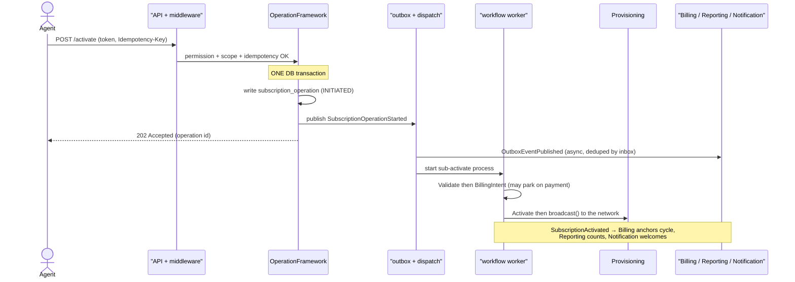
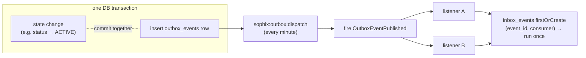
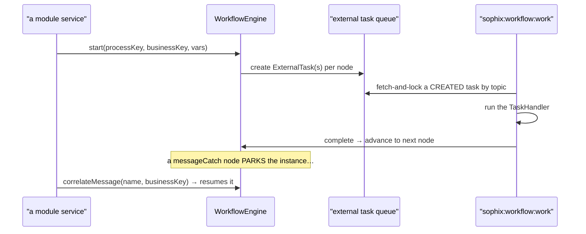
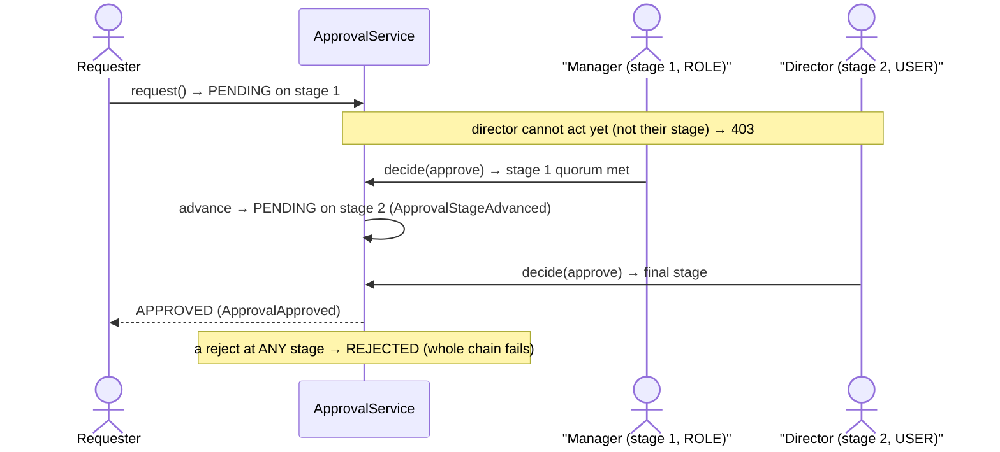

# The Spine — Foundation patterns every module reuses

Read this once. The platform is a **Laravel 11 modular monolith** (`nwidart/laravel-modules`):
17 domain modules under `Modules/*`, each with its own providers, `routes/api.php`,
`database/migrations`, `Models`, `Services`, `Events`, `Listeners`, `Workflow` handlers and
`tests`. Everything cross-cutting lives in **`app/Foundation`**. Master these ~7 patterns and
every module reads as "business logic on top of the spine."

---

## 🎬 One worked example — "Jane activates her subscription"
Follow this once; it touches **every** pattern below. (Proven by `Subscription/tests/Feature/SubscriptionApiTest::test_activate_runs_workflow_and_sets_active`.)

1. **Request** (a back-office agent clicks "Activate"):
   ```http
   POST /api/subscriptions/sub_123/activate
   Authorization: Bearer <sanctum token>
   Idempotency-Key: act-sub_123-1
   ```
2. **Middleware chain** (pattern 1,2,7): `auth:sanctum` → `permission:subscription.activate` →
   (`scope` if declared) → `idempotency` (no prior key → proceeds) → `ResolveOperatorContext` pinned
   `Context::operatorCode()` = `WIK`.
3. **Service** (`OperationController` → `OperationFramework::trigger('ACTIVATE')`): checks idempotency
   + single-in-flight, then **in one DB transaction** writes a `subscription_operation` row
   (`current_state=INITIATED`) and **publishes** `SubscriptionOperationStarted` to the **outbox**
   (pattern 3 — the row and the event commit together or not at all).
4. **Starts the workflow** (pattern 4): `WorkflowEngine::start('sub-activate', businessKey=sub_123,
   {subscriptionId, operationId, …})` creates a `ProcessInstance` + `ExternalTask` rows. HTTP returns
   `202` with the operation id. **Nothing else has happened synchronously.**
5. **Outbox dispatch** (every minute, or `artisan sophix:outbox:dispatch` in tests): fires
   `OutboxEventPublished` → `Reporting` projector counts it, `Notification` may notify. (Inbox dedupe
   means a re-run won't double-count.)
6. **Workflow worker** (`sophix:workflow:work`) drains the tasks, one handler per topic:
   `ValidateActivationHandler` → `BillingIntentHandler` (if there's an activation fee and it's
   pay-first, this **parks** the flow on a `ful-payment-received` catch until `InvoicePaid` arrives —
   pattern 3 again) → `ActivateHandler` calls `SubscriptionService::transitionStatus(ACTIVE)` which
   emits `SubscriptionActivated` → `FulfillmentCallHandler` calls `ProvisioningService::broadcast()`.
7. **Reconcile:** when the instance ends, `ProcessInstanceEnded` → `SyncOperationFromProcess` closes
   the `subscription_operation` ledger (`final_state`, emits `SubscriptionOperationCompleted`).
8. **Downstream of `SubscriptionActivated`:** Billing anchors the first cycle, Reporting increments
   `subscriptions_activated`, Notification sends the welcome notice — all as **reactions**, none
   called synchronously from step 3.

> The shape never changes: **thin controller → service (mutate + emit in one tx) → async dispatch →
> listeners/workflow react.** Learn it here; every module repeats it.



---

## 1. Tenancy & Context — *who and which operator*
- `App\Foundation\Support\Context` holds the per-request **operator code** and **correlation id**.
  Resolved server-side by `ResolveOperatorContext` middleware; the `X-Operator-Code` header only
  widens scope for a principal with `platform.cross_operator`.
- `App\Foundation\Tenancy\BelongsToOperator` (model trait) adds a **global query scope** filtering
  every read by `operator_code`, and pins `operator_code` on create from `Context` — so tenant
  isolation is automatic and can't be bypassed by a client-supplied value.
- **Takeaway:** you almost never filter by operator by hand; the trait does it.

## 2. HTTP & errors — *thin controllers, one error model*
- Controllers validate + delegate to a service; responses go through `App\Foundation\Http\ApiResponse`
  (`item` / `created` / `paginated` / `error`).
- Business failures throw `App\Foundation\Errors\DomainException` (carries `errorCode`, `status`,
  `nextAction`, `fieldErrors`). `bootstrap/app.php` renders the **SOPHIX standard error model** for
  all `api/*` requests (DD_API-00 §8).
- Route guards stack: `auth:sanctum` → `permission:<code>` → `scope:<type>,<key>` (optional) →
  `idempotency` (optional) → controller.

## 3. Events — *the integration backbone (transactional outbox)*
- `App\Foundation\Events\EventBus` is the interface; the default `Drivers\OutboxEventBus::publish()`
  **only writes an `outbox_events` row, inside the same DB transaction** as the state change.
- A scheduler command **`sophix:outbox:dispatch`** (`DispatchOutboxCommand`, every minute) forwards
  committed rows by firing **`OutboxEventPublished`** in-process (native driver) or to Kafka.
- Module **listeners** subscribe to `OutboxEventPublished`, switch on `$published->event->event_type`,
  and react. Consumers dedupe through an **inbox** (`InboxEvent`, one row per `event_id`+consumer)
  so replays never double-process (e.g. `Reporting\Projectors\ReportMetricProjector`).

> **Why an outbox?** Writing the state change and "sending" the event in the *same* DB transaction means
> they can never disagree — if the transaction rolls back, the event was never queued either. A separate
> dispatcher then delivers it, and the inbox makes re-delivery safe.


- **Pattern:** publish a `DomainEvent(type, topic, payload, aggregateType, aggregateId)` from inside
  your service's transaction; never call another module synchronously for a side-effect that can be
  a reaction. In tests, drive it with `$this->artisan('sophix:outbox:dispatch')`.

## 4. Workflow — *config-defined processes, external-task workers*
- Long/multi-step processes are **data**: a `process_definition` graph (authored in the Studio),
  **not** code. `Modules\Workflow\Engine\WorkflowEngine::start(processKey, businessKey, variables,
  operator)` creates a `ProcessInstance` and `ExternalTask` rows per service-task node.
- Each step is a **`TaskHandler`** (interface: `topic()`, `label()`, `handle(TaskContext): TaskResult`)
  registered into the **`TaskRegistry`** by a module's `*WorkflowProvider`.
- A shared worker **`sophix:workflow:work`** (`--once` = drain) fetch-and-locks `CREATED` tasks by
  topic, runs the handler, and completes/fails them. `sophix:workflow:tick` fires due timers and
  reaps dead locks.
- Message catches resume via `WorkflowEngine::correlateMessage(name, businessKey, vars)` — used to
  wake a parked flow on an event (e.g. `WorkOrderFinalized`, `CustomerKycApproved`).
- **Mantra:** *new flow = compose registered topics (config); new step = register one handler (code).*

> **The loop in a picture:** start an instance → the engine drops a task on a queue → a worker drains it
> and runs the handler → the flow advances. When a step must wait, it **parks** until a message wakes it.



## 5. Approvals — *EM-CFG-04, config-driven maker-checker as an ordered chain*
- **`approval_definition`** is purely the policy *header* (WHEN: operator + entity_type + optional action
  + `threshold_amount`). **`approval_stage`** is the only place approver config lives (WHO, in order) —
  no duplicated approver columns on the definition.
- `App\Foundation\Approvals\ApprovalService::request($data)` matches a definition. No matching policy (or
  amount below `threshold_amount`) ⇒ **auto-approved**; otherwise ⇒ **PENDING** on the **first stage**.
- Approval is an **ordered chain of stages**, not a flat count. Each stage targets **either a platform
  ROLE** (any of `approver_roles`) **or a specific named USER** (`approver_user_ref`/`approver_email` — a
  senior like a *director* who holds no platform role, just an **invited login**;
  `POST /api/approval-approvers/invite` provisions one). A stage carries its own **quorum**
  (`required_approvals`) and **self-approval** toggle (`allow_requester`).
- `decide($request, $approve, $actorUser)` acts on the **current stage only**: it enforces
  **segregation of duties** (requester can't self-approve unless that stage's `allow_requester`),
  the stage's **approver target** (role membership or being the named user; `SUPER_ADMIN` may always
  act), and a **distinct-approver** guard (one person can't fill two slots in the same stage —
  `409 DUPLICATE_STAGE_APPROVER`). Every action writes an immutable `approval_decision` row tagged
  with its `stage_sequence`. When a stage's quorum is met it **advances** (emits
  `ApprovalStageAdvanced`); the **final** stage flips to `APPROVED` (emits `ApprovalApproved`, topic
  `platform.approvals`). A **reject at any stage** fails the whole chain (`ApprovalRejected`).
- **Every approval is a chain.** All policies declare an **explicit** chain via
  `ApprovalDefinition::defineChain($op, $entityType, $action, [$stage, …])` — a **single-stage** chain
  where one approver suffices (force-sync, field-audit), a **multi-stage** one for a hierarchy (CVM
  high-value retention: `CVM_MANAGER` → named director). A definition with no stages is a
  misconfiguration; the engine still gates it with one open stage rather than silently auto-approving.
- Owning modules resume on the outcome via a listener (e.g. `Ilm\Listeners\ResumeCvmOfferOnApproval`,
  `Osr` PO decide, `Provisioning` force-sync). The notification side is bridged to ICN-01
  (`NotifyApproversOnApprovalRequested`), which alerts the **current stage's** approvers on the initial
  request and on each advance: a **ROLE** stage notifies its `approver_roles` as candidate groups; a
  **USER** stage is sent a **direct** message to the named person's address (`StaffNotificationService::
  dispatchDirect`, EMAIL today) so an approver who belongs to no group is still reached.
- **Pattern:** gate a sensitive action with `request()`, store the `request_id`, resume on
  `ApprovalApproved`/`ApprovalRejected`.
- The distinct-approver guard is **within** a stage; cross-stage separation comes from each stage
  targeting a different role/person.

> **Worked example — "manager then director":** a 2-stage chain. Stage 1 is a ROLE (`CVM_MANAGER`),
> stage 2 is a named USER (a director with an invited login, no platform role). The request only reaches
> the director after a manager clears stage 1.



## 6. Rules — *operator-overridable decision tables*
- `App\Foundation\Rules\RuleEngine::evaluate('rules.<package>', $facts)` returns a decision. The
  package is a `decision_table` (data) when deployed, else a **registered code fallback** (e.g.
  `rules.billing.adjustment-approval`, `rules.tax-applicability`, `rules.cvm.offer`).
- **Pattern:** branch on policy through a rules package, never a hardcoded `if` for operator-varying
  behaviour.

## 7. Idempotency & scope — *safe retries, data scope*
- `idempotency` middleware (`EnforceIdempotency`, opt-in per route): with an `Idempotency-Key`, same
  key+body replays the stored response; same key+different body ⇒ `409`.
- `scope:<type>,<key>` middleware (`Rbac\Http\Middleware\EnforceScope`): after `permission`, checks
  the target value (route/body) is within the caller's RBAC scope (GLOBAL/OPERATOR/SUPER_ADMIN bypass).

---

## The life of … (trace these once)

**A write request:** `HTTP → auth:sanctum → permission → scope? → idempotency? → Controller (validate)
→ Service (DB tx: mutate + publish DomainEvent to outbox) → ApiResponse`. Then async:
`sophix:outbox:dispatch → OutboxEventPublished → module listeners react`.

**A workflow operation:** `Service.trigger() → WorkflowEngine.start(process_definition) → ExternalTask
rows → sophix:workflow:work drains → TaskHandler.handle → complete → next node → … →
ProcessInstanceEnded → operation ledger reconciled`.

**An approval:** `Service → ApprovalService.request() → (PENDING) → decide endpoint →
ApprovalApproved (outbox) → owning-module resume listener applies the outcome`.

---

## 📖 Foundation scenarios (the patterns at work)

### 1. Tenancy isolation (pattern 1)
A WIK-scoped user `GET /api/customers` — `BelongsToOperator`'s global scope silently adds
`where operator_code='WIK'`, so MSA rows are invisible. A client can't widen this with a body field;
only `X-Operator-Code` + the `platform.cross_operator` permission changes the `Context` operator.

### 2. Outbox publish + dispatch (pattern 3)
`SubscriptionService::transitionStatus(ACTIVE)` runs **inside a DB transaction**: it updates the row
**and** inserts an `outbox_events` row for `SubscriptionActivated`. If the tx rolls back, neither
happens. A minute later `sophix:outbox:dispatch` picks up the unpublished row, fires
`OutboxEventPublished`, and stamps `published_at`. *Atomic state+event, then async fan-out.*

### 3. Inbox dedupe (pattern 3)
`ReportMetricProjector` receives the event, does `inbox_events.firstOrCreate(event_id, consumer)`; the
row's `processed_at` is null → it projects and stamps it. A **re-dispatch** of the same `event_id` finds
`processed_at` set → returns immediately. *At-most-once per consumer.*

### 4. Approval auto-approves when no policy (pattern 5)
`ApprovalService::request({entity_type:'PURCHASE_ORDER'})` with **no** matching `approval_definition` →
the request is created `AUTO_APPROVED` and emits `ApprovalAutoApproved`. *Out-of-the-box flows aren't
blocked; an operator opts into gating by adding a definition row.*

### 5. Approval gated as an ordered chain + segregation of duties (pattern 5)
With a definition, the request is `PENDING` on **stage 1**. The **requester** calling
`decide(approve:true)` → `SELF_APPROVAL_NOT_ALLOWED` (403) unless that stage's `allow_requester`. A
**CVM_MANAGER** clears stage 1 → an `approval_decision` (`stage_sequence:1`) is written and the request
**advances** to stage 2 (`ApprovalStageAdvanced`), still `PENDING`. Stage 2 targets a **named director**
(`approver_kind:USER`) — the manager **cannot** act on it (403), and the director (an invited login,
no role) approves → request flips `APPROVED`, emits `ApprovalApproved`. A second approval from the
**same** person within one stage → `409 DUPLICATE_STAGE_APPROVER`; a **reject** at any stage →
`REJECTED` for the whole chain. *Proven by `ApprovalChainTest` + `CvmTest`.*

### 6. Idempotent retry replays (pattern 7)
`POST …/activate` with `Idempotency-Key: k1` stores `{key, request_hash, response, status}` in
`idempotency_keys`. The client times out and retries with **the same key + same body** → the middleware
returns the **stored response**, the controller never runs twice.

### 7. Idempotency conflict (pattern 7)
The same `Idempotency-Key: k1` with a **different body** → `request_hash` mismatch → **409** (a key may
not be reused for a different request).

### 8. Scope gate (pattern 7)
A region-scoped dispatcher `POST /api/work-orders {tech_region_id:'KE-NRB-KAREN'}` → `scope:TECH_REGION,
tech_region_id` calls `withinScope` → true (exact match) → allowed; `KE-MSA-NYALI` → **403 OUT_OF_SCOPE**;
a `SUPER_ADMIN` bypasses.

### 9. Rules: table else fallback (pattern 6)
`RuleEngine::evaluate('rules.tax-applicability', facts)` returns a deployed `decision_table` match;
`rules.billing.adjustment-approval` with no table deployed → the **registered code fallback** answers.
*A package always resolves deterministically.*

### 10. Workflow start → drain → correlate (pattern 4)
`OperationFramework::trigger('PAUSE')` → `WorkflowEngine.start('sub-pause')` creates `workflow_external_task`
rows; `sophix:workflow:work` drains them; a `messageCatch` parks until
`correlateMessage('sub-payment-confirmed', …)` (fired by a listener on `InvoicePaid`) resumes it.

## Foundation data model — sample rows + readings
> **Convention (applies to every doc):** each sample row shows **every domain column** (nullables
> included, as `null`). The Laravel surrogate `id` and the `created_at`/`updated_at` audit timestamps
> are omitted by convention — no reading ever depends on them.

### `outbox_events` (the transactional outbox)
Columns: `event_id, event_type, topic, aggregate_type, aggregate_id, operator_code, correlation_id, payload, headers, published_at, attempts`.
```json
{ "event_id":"evt_1","event_type":"SubscriptionActivated","topic":"subscription.lifecycle","aggregate_type":"Subscription","aggregate_id":"sub_1","operator_code":"WIK","correlation_id":"corr_88","payload":{"subscriptionId":"sub_1"},"headers":null,"published_at":"2026-06-20T10:01:00Z","attempts":1 }
{ "event_id":"evt_2","event_type":"InvoiceGenerated","topic":"billing.money","aggregate_type":"Invoice","aggregate_id":"inv_9","operator_code":"WIK","correlation_id":"corr_90","payload":{"invoiceId":"inv_9","total":"5000"},"headers":null,"published_at":null,"attempts":0 }
{ "event_id":"evt_3","event_type":"ApprovalRequested","topic":"platform.approvals","aggregate_type":"ApprovalRequest","aggregate_id":"appr_5","operator_code":"WIK","correlation_id":"corr_91","payload":{"requestId":"appr_5","entityType":"PURCHASE_ORDER","status":"PENDING"},"headers":null,"published_at":"2026-06-20T10:02:00Z","attempts":1 }
{ "event_id":"evt_4","event_type":"WorkOrderFinalized","topic":"workorder.field","aggregate_type":"WorkOrder","aggregate_id":"wo_1","operator_code":"WIK","correlation_id":"corr_92","payload":{"workOrderId":"wo_1"},"headers":null,"published_at":null,"attempts":2 }
```
**Read each row — *this data means this:***

| Row | What it means in plain English |
|-----|--------------------------------|
| **evt_1** | A `SubscriptionActivated` event that was **already delivered** (`published_at` set) on the first try (`attempts:1`). |
| **evt_2** | An `InvoiceGenerated` event **written but not yet sent** (`published_at:null`, `attempts:0`) — it committed together with the invoice; the dispatcher will pick it up next run. |
| **evt_3** | An `ApprovalRequested` event, delivered; its `payload` carries the request id + status the listeners need. |
| **evt_4** | A `WorkOrderFinalized` event **still unsent after two failed tries** (`attempts:2`, `published_at:null`) — it keeps retrying. |

**The columns that did the work:** `published_at` = sent or not · `attempts` = retry count · `correlation_id` threads one business action across events · `topic` = the channel · `payload` = what listeners read.

### `inbox_events` (per-consumer dedupe)
Columns: `event_id, consumer, event_type, processed_at`.
```json
{ "event_id":"evt_1","consumer":"reporting.metrics","event_type":"SubscriptionActivated","processed_at":"2026-06-20T10:01:05Z" }
{ "event_id":"evt_1","consumer":"notification.bridge","event_type":"SubscriptionActivated","processed_at":"2026-06-20T10:01:06Z" }
{ "event_id":"evt_4","consumer":"fulfillment.resume","event_type":"WorkOrderFinalized","processed_at":"2026-06-20T10:03:00Z" }
{ "event_id":"evt_4","consumer":"workforce.capacity","event_type":"WorkOrderFinalized","processed_at":null }
```
**Read each row — *this data means this:***

| Row | What it means in plain English |
|-----|--------------------------------|
| **evt_1 · reporting.metrics** | Reporting has **already counted** this activation (`processed_at` set). |
| **evt_1 · notification.bridge** | The **same** event, processed **independently** by Notification — its own dedupe row, so both ran once. |
| **evt_4 · fulfillment.resume** | Fulfillment has already handled this WorkOrderFinalized. |
| **evt_4 · workforce.capacity** | Workforce **claimed** it but hasn't finished (`processed_at:null`) — and a redelivery to any consumer whose `processed_at` is set is a no-op. |

Dedupe is **per (event_id, consumer)** — that's why one event can have four rows.

### `approval_definition` (the policy header — *WHEN* approval is needed)
Columns: `definition_id, operator_code, entity_type, action, threshold_amount, active`. **No approver
columns** — *who* approves lives only in `approval_stage` (below). Every definition has ≥1 stage.
```json
{ "definition_id":"appd_1","operator_code":"WIK","entity_type":"PROVISIONING_FORCE_SYNC","action":"FORCE_SYNC","threshold_amount":null,"active":true }
{ "definition_id":"appd_2","operator_code":"WIK","entity_type":"ADJUSTMENT","action":null,"threshold_amount":10000.00,"active":true }
{ "definition_id":"appd_3","operator_code":"WIK","entity_type":"CVM_OFFER","action":"CVM_HIGH_VALUE_RETENTION_OFFER","threshold_amount":null,"active":true }
{ "definition_id":"appd_5","operator_code":"WIK","entity_type":"PURCHASE_ORDER","action":"PO_APPROVAL","threshold_amount":500000.00,"active":true }
{ "definition_id":"appd_4","operator_code":"WIK","entity_type":"DISCOUNT","action":null,"threshold_amount":50000.00,"active":false }
```
**Read each row — *this data means this:***

| Row | What it means in plain English |
|-----|--------------------------------|
| **appd_1** | A force-sync **always** needs approval (`threshold_amount:null` = no free pass). |
| **appd_2** | Any ADJUSTMENT (`action:null` = all actions) of **10,000 or more** needs approval; below that it auto-approves. |
| **appd_3** | Every high-value CVM retention offer needs approval — its approver chain is in `approval_stage` below. |
| **appd_5** | A purchase order of **500,000 or more** needs approval — chain below. |
| **appd_4** | A DISCOUNT policy that is **switched off** (`active:false`) → ignored; discounts auto-approve until it's re-enabled. |

*Who* approves is entirely in the `approval_stage` rows — one stage for a simple gate, several for a hierarchy.

### `approval_stage` (the ordered chain) · `approver_kind`: `ROLE | USER`
Columns: `stage_id, operator_code, definition_id, sequence, name, approver_kind, approver_roles, approver_user_ref, approver_email, required_approvals, allow_requester`.
```json
{ "stage_id":"appds_1","operator_code":"WIK","definition_id":"appd_3","sequence":1,"name":"CVM manager review","approver_kind":"ROLE","approver_roles":["CVM_MANAGER"],"approver_user_ref":null,"approver_email":null,"required_approvals":1,"allow_requester":false }
{ "stage_id":"appds_2","operator_code":"WIK","definition_id":"appd_3","sequence":2,"name":"Director sign-off","approver_kind":"USER","approver_roles":null,"approver_user_ref":"usr_dir9","approver_email":"cvm.director@wik.sn","required_approvals":1,"allow_requester":false }
{ "stage_id":"appds_3","operator_code":"WIK","definition_id":"appd_5","sequence":1,"name":"Finance lead","approver_kind":"ROLE","approver_roles":["BILLING_LEAD"],"approver_user_ref":null,"approver_email":null,"required_approvals":2,"allow_requester":false }
{ "stage_id":"appds_4","operator_code":"WIK","definition_id":"appd_5","sequence":2,"name":"Finance director","approver_kind":"USER","approver_roles":null,"approver_user_ref":"usr_findir","approver_email":"fin.director@wik.sn","required_approvals":1,"allow_requester":false }
```
**Read each row — *this data means this:***

| Row | What it means in plain English |
|-----|--------------------------------|
| **appds_1** | appd_3 **stage 1**: any **CVM_MANAGER** (a `ROLE`) signs first. |
| **appds_2** | appd_3 **stage 2**: only the **named director** `cvm.director@wik.sn` (a `USER`, no platform role, invited login) signs last. |
| **appds_3** | appd_5 **stage 1**: needs **two distinct BILLING_LEADs** (`required_approvals:2`) before it moves on. |
| **appds_4** | appd_5 **stage 2**: then the **named finance director** signs. |

So appd_3 reads "CVM manager → director" and appd_5 reads "two finance leads → finance director". The
chain always runs in `sequence` order — a later stage opens only after the earlier one's quorum is met.

### `approval_request` (an instance) · `status`: `PENDING|AUTO_APPROVED|APPROVED|REJECTED`
Columns: `request_id, operator_code, entity_type, action, entity_ref, amount, payload, status, current_stage, total_stages, approvals_count, stages_snapshot, requested_by, decided_by, decision_reason, decided_at`. The active stage (its approver target, quorum, SoD toggle) is read from `stages_snapshot[current_stage]` — **not** duplicated on the row.
```json
{ "request_id":"appr_5","operator_code":"WIK","entity_type":"PROVISIONING_FORCE_SYNC","action":"FORCE_SYNC","entity_ref":"pfs_2","amount":null,"payload":{"target":"GPON"},"status":"PENDING","current_stage":1,"total_stages":1,"approvals_count":0,"stages_snapshot":[{"sequence":1,"approver_kind":"ROLE","approver_roles":[],"required_approvals":1,"allow_requester":false}],"requested_by":"u_noc1","decided_by":null,"decision_reason":null,"decided_at":null }
{ "request_id":"appr_6","operator_code":"WIK","entity_type":"CVM_OFFER","action":"CVM_GOODWILL_CREDIT","entity_ref":"cvo_2","amount":null,"payload":{"discountPercent":5},"status":"AUTO_APPROVED","current_stage":1,"total_stages":1,"approvals_count":0,"stages_snapshot":null,"requested_by":"u_agent","decided_by":null,"decision_reason":null,"decided_at":"2026-06-20T09:00:00Z" }
{ "request_id":"appr_10","operator_code":"WIK","entity_type":"CVM_OFFER","action":"CVM_HIGH_VALUE_RETENTION_OFFER","entity_ref":"cvo_7","amount":null,"payload":{"discountPercent":25},"status":"PENDING","current_stage":2,"total_stages":2,"approvals_count":0,"stages_snapshot":[{"sequence":1,"approver_kind":"ROLE","approver_roles":["CVM_MANAGER"],"required_approvals":1,"allow_requester":false},{"sequence":2,"approver_kind":"USER","approver_user_ref":"usr_dir9","approver_email":"cvm.director@wik.sn","required_approvals":1,"allow_requester":false}],"requested_by":"u_agent","decided_by":"u_cvmmgr","decision_reason":null,"decided_at":null }
{ "request_id":"appr_9","operator_code":"WIK","entity_type":"ADJUSTMENT","action":null,"entity_ref":"adj_4","amount":1500.00,"payload":{},"status":"REJECTED","current_stage":1,"total_stages":1,"approvals_count":0,"stages_snapshot":[{"sequence":1,"approver_kind":"ROLE","approver_roles":["BILLING_LEAD"],"required_approvals":2,"allow_requester":false}],"requested_by":"u_agent","decided_by":"u_lead2","decision_reason":"out of policy","decided_at":"2026-06-20T11:05:00Z" }
```
**Read each row — *this data means this:***

| Row | What it means in plain English |
|-----|--------------------------------|
| **appr_5** | A force-sync request **parked PENDING** on its single stage — nobody has decided yet (`approvals_count:0`). |
| **appr_6** | A goodwill credit with **no policy** → **AUTO_APPROVED** instantly (`stages_snapshot:null` = no chain to walk). |
| **appr_10** | **Mid-chain**: the CVM manager cleared stage 1, so it **advanced to stage 2** (`current_stage:2`, count reset) — now waiting on the director. |
| **appr_9** | An adjustment **REJECTED at stage 1** (`decision_reason:"out of policy"`) — one reject fails the whole chain. |

The request only carries the **frozen chain** (`stages_snapshot`) + **progress** (`current_stage`,
`approvals_count`); the active stage is read from the snapshot, never copied onto the row, and the
snapshot is frozen at request time so later policy edits don't change an in-flight request.

### `approval_decision` (immutable audit) · `decision`: `APPROVE|REJECT|REQUEST_REVISION|CANCEL`
Columns: `decision_id, request_id, operator_code, decision, stage_sequence, actor_user_id, comment, decided_at`.
```json
{ "decision_id":"appdec_1","request_id":"appr_8","operator_code":"WIK","decision":"APPROVE","stage_sequence":1,"actor_user_id":"u_lead1","comment":"ok","decided_at":"2026-06-20T10:55:00Z" }
{ "decision_id":"appdec_2","request_id":"appr_8","operator_code":"WIK","decision":"APPROVE","stage_sequence":1,"actor_user_id":"u_lead2","comment":"second sign","decided_at":"2026-06-20T11:00:00Z" }
{ "decision_id":"appdec_3","request_id":"appr_10","operator_code":"WIK","decision":"APPROVE","stage_sequence":1,"actor_user_id":"u_cvmmgr","comment":"manager ok","decided_at":"2026-06-20T11:02:00Z" }
{ "decision_id":"appdec_4","request_id":"appr_9","operator_code":"WIK","decision":"REJECT","stage_sequence":1,"actor_user_id":"u_lead2","comment":"out of policy","decided_at":"2026-06-20T11:05:00Z" }
```
**Read each row — *this data means this:***

| Row | What it means in plain English |
|-----|--------------------------------|
| **appdec_1** | u_lead1 **approved appr_8 stage 1** (the first of two needed). |
| **appdec_2** | u_lead2 — a **different** person — also approved appr_8 stage 1, so the **quorum of 2 is met**. |
| **appdec_3** | u_cvmmgr approved **appr_10 stage 1**, which advanced that request to stage 2. |
| **appdec_4** | u_lead2 **rejected appr_9 at stage 1**. |

One **immutable** row per decision, tagged with `stage_sequence`. A second APPROVE by the **same** person
in the same stage is refused (`409 DUPLICATE_STAGE_APPROVER`). The request's count/stage/status is
derived from these rows; this audit is never edited.

### `idempotency_keys`
Columns: `key, operator_code, request_hash, response_status, response_body`.
```json
{ "key":"act-sub_1-1","operator_code":"WIK","request_hash":"a1b2c3d4e5","response_status":202,"response_body":"{\"operation_id\":\"op_2\"}" }
{ "key":"pay-acc_1-9","operator_code":"WIK","request_hash":"9f8e7d6c5b","response_status":201,"response_body":"{\"payment_id\":\"pay_1\"}" }
{ "key":"order-c","operator_code":"WIK","request_hash":"33aa55bb77","response_status":500,"response_body":"{\"error\":\"INTERNAL\"}" }
{ "key":"in-flight-1","operator_code":"WIK","request_hash":"77bcd9ee11","response_status":null,"response_body":null }
```
**Read each row — *this data means this:***

| Row | What it means in plain English |
|-----|--------------------------------|
| **act-sub_1-1** | A successful activate (`response_status:202`) — a retry with the **same body** replays the stored 202, the handler never runs twice. |
| **pay-acc_1-9** | A successful payment (`201`) — replays the stored `payment_id` on retry. |
| **order-c** | A request that ended **500** — a retry **replays the error**, not re-runs it (the business write may already have committed). |
| **in-flight-1** | A key **reserved but not finished** (`response_status:null`) — a concurrent duplicate gets `409 "still being processed"`. |

A **different** `request_hash` for the same key → `409` conflict. There is **no status enum** — a null
`response_status` *is* the in-flight marker.

## Scheduled workers (`routes/console.php`)
Outbox dispatch + workflow tick (every minute); billing cycle-close (30 min); provisioning
poll-async (5 min) / reconcile (hourly); subscription operation-timeouts (every minute); stock
reservation-expiry (10 min); dunning / pro-forma / generation-retry / wallet-expiry (daily / 15 min).
These are the heartbeat that advances async state — if "nothing happens," check the relevant worker.
