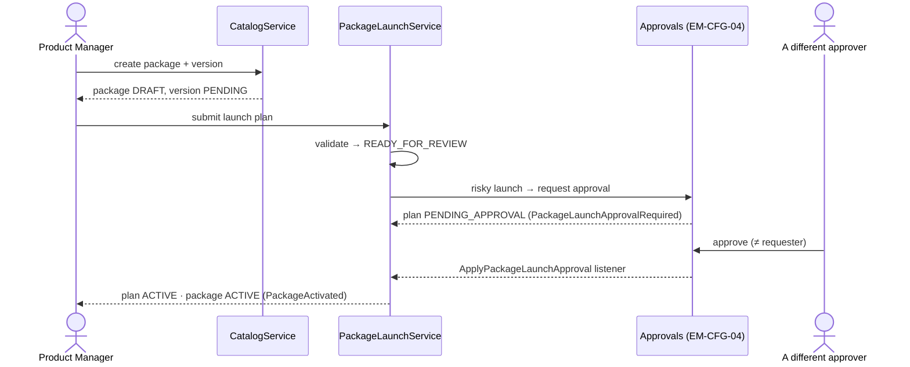
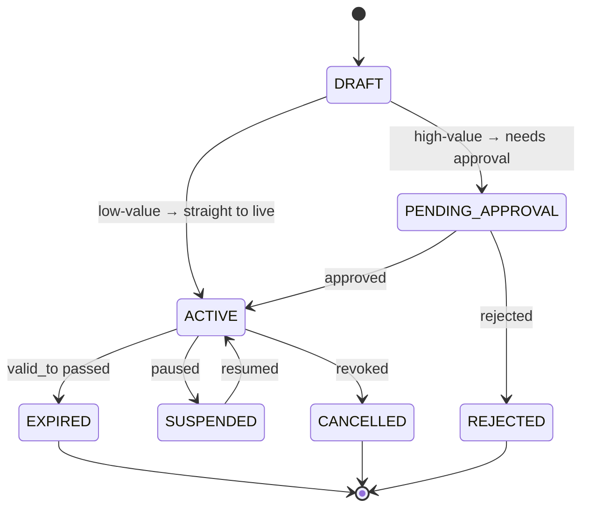
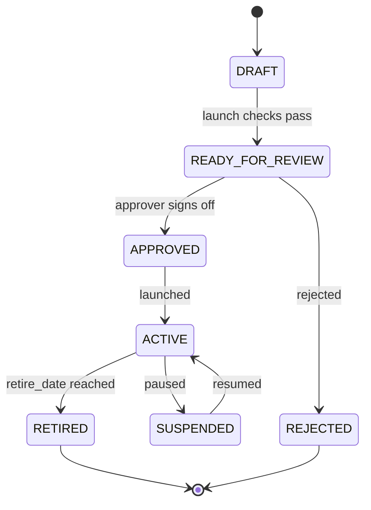
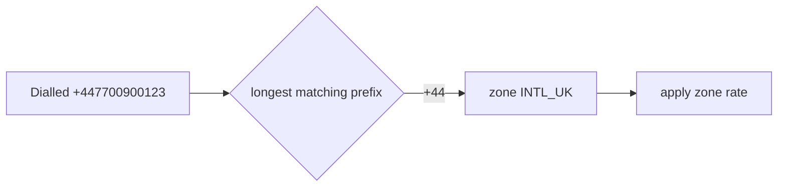
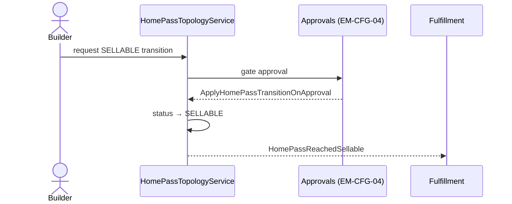
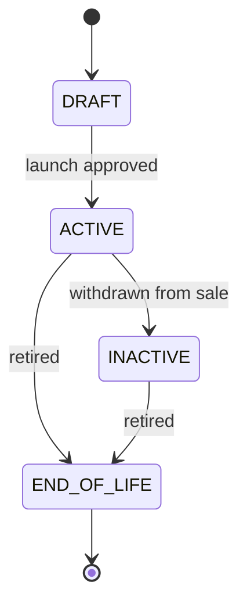
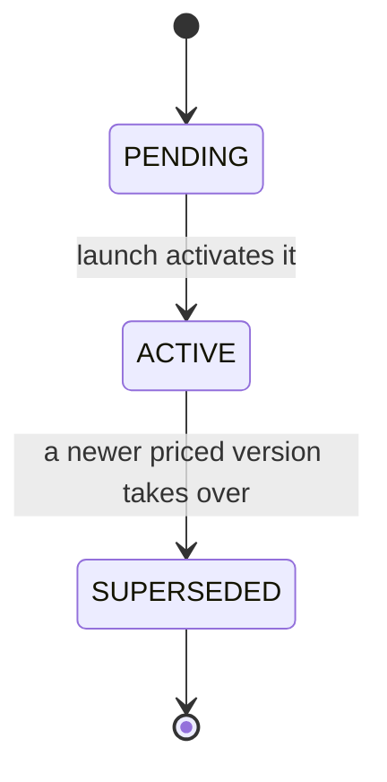
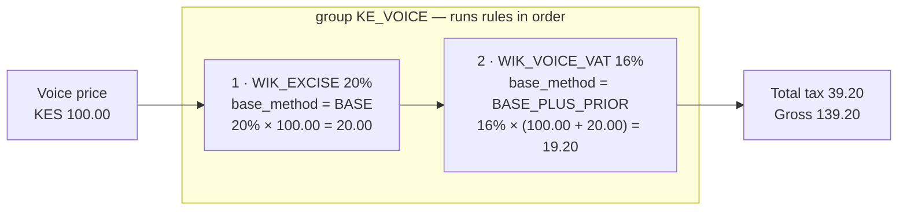

# Catalog — As-Built Design (the config substrate)

> **Capability codes:** PLM-CFG-01..07 (products/services/wallets/tax/voice), SIP-01/02 (bundles/
> launch), PLM-CFG-04/SIP-DA (discounts), RLM-CFG-01 (HomePass) · **Module path:** `Modules/Catalog`
> **Tests:** `CatalogApi`, `ConfigCatalog`, `Tax{Compute,Config}`, `Discount{Compute,Assignment}`,
> `BundleAndCampaign`, `PackageLaunch`, `VoiceTariff`, `WalletCatalog`, `UsageRating`

## 1. Purpose & boundaries
- **Owns:** the **reference/config substrate** everything prices and sells against — packages &
  versions, services, bundles, voice/usage tariffs, **discounts & promotions**, **tax groups/rules**,
  wallet catalog, HomePass topology + tech regions, network nodes.
- **Does NOT own:** money (Billing), subscriptions (Subscription), the network (Provisioning). It is
  **read-mostly config**; other modules query it at decision time.
- **Job:** the single, operator-scoped, governed source of "what can be sold, at what price, with what
  tax/discount, where" — tunable as **data**, with maker-checker on risky launches.

## 📖 Scenarios (service + Foundation involvement)

### 1. Launch a package (with maker-checker approval)

**The story in plain English:** A product manager builds a new package and a priced version of it — but
it stays a **draft**, not on sale yet. To go live they open a *launch plan*. The system runs pre-flight
checks; if the launch is **risky** (e.g. a first launch or a price cutover) it needs a **second person**
to approve before the package can be sold. Once a different approver signs off, the package flips to
**ACTIVE** and is sellable.

**Who does what:**
1. `CatalogService` creates the `package` (status `DRAFT`) and a priced `package_version` (status `PENDING`).
2. `PackageLaunchService` opens a `package_launch_plan` and validates it → `READY_FOR_REVIEW`.
3. A risky launch raises an **EM-CFG-04** approval request (`Foundation/Approvals`) → plan `PENDING_APPROVAL`,
   event `PackageLaunchApprovalRequired`.
4. A **different** approver approves → the `ApplyPackageLaunchApproval` listener runs → plan `APPROVED`
   then `ACTIVE`, the `package` flips to `ACTIVE`, event `PackageActivated`. (A rejection → plan `REJECTED`,
   package stays `DRAFT`.)

**Sample — the launch plan as it moves:**
```json
{ "launch_plan_id":"plp_1","package_id":"pkg_promo","launch_type":"FIRST_LAUNCH","status":"PENDING_APPROVAL","requested_launch_at":"2026-07-01T00:00:00Z","approval_request_id":"appr_77","requested_by_user_id":"u_pm1" }
```



The plan's own lifecycle:
```mermaid
stateDiagram-v2
    [*] --> DRAFT
    DRAFT --> READY_FOR_REVIEW: validate passes
    READY_FOR_REVIEW --> PENDING_APPROVAL: risky → needs approval
    READY_FOR_REVIEW --> ACTIVE: low-risk → auto
    PENDING_APPROVAL --> APPROVED: approver signs off
    PENDING_APPROVAL --> REJECTED: approver rejects
    APPROVED --> SCHEDULED: future launch date
    APPROVED --> ACTIVE: launch now
    SCHEDULED --> ACTIVE: date reached
    ACTIVE --> END_OF_SALE --> END_OF_LIFE
```
*Proven by `PackageLaunchTest`.*

### 2. Tax on a 5,000 KES internet package

**The story in plain English:** When Billing prices an internet line, it asks Catalog "what tax goes on
this?" Catalog picks the right tax group for the product, runs that group's rules in order, and hands
back the subtotal and the tax. (The full mechanics, with worked numbers, are in the `tax_group`/
`tax_rule` section of the data model below.)

**Who does what:** Billing calls
`TaxComputeService::compute({taxableKind:'PACKAGE', customerCategory:'RES', baseAmount:5000})`. It
evaluates **`rules.tax-applicability`** (Foundation/Rules) → a `tax_group`; iterates its `tax_rule` rows
by `order_within_group`, computing each per `base_method` (`BASE`/`BASE_PLUS_PRIOR` cascade); a `NONE`
applicability ⇒ exempt. Returns `{subtotal, taxTotal, taxLines}`. *Proven by `TaxComputeTest`.*
*(See the tax cascade worked example below for the full numbers.)*

### 3. Grant a discount (EM-CFG-04 if high-value)

**The story in plain English:** An agent gives a customer a discount. The system first refuses if the
customer already has the same discount live (no double-granting). Then, if the discount is high-value
(or long-running, or manually granted), it can't just take effect — it needs a separate approval. Until
that approval lands the grant sits pending; once approved it goes live.

**Who does what:**
1. `DiscountAssignmentService::create` blocks a duplicate active grant (R-SIP-DA-05).
2. It asks EM-CFG-04 whether approval is needed (R-SIP-DA-07/11).
3. High value → `discount_assignment.status=PENDING_APPROVAL` (emits `DiscountAssignmentApprovalRequired`).
4. Approval → status `ACTIVATED`.

**Sample — a campaign grant awaiting approval:**
```json
{ "assignment_id":"dasg_2","discount_code":"WELCOME_500","scope_type":"CAMPAIGN_COHORT","status":"PENDING_APPROVAL","approval_request_id":"appr_44","assignment_mode":"CAMPAIGN" }
```


*Proven by `DiscountAssignmentTest`.*

### 4. Resolve effective discount(s) at billing time (stacking)

**The story in plain English:** At billing time a customer might have several discounts that could
apply. The system decides which ones actually combine ("stack") and in what order, then returns the net
effect. A direct (manually granted) discount beats a campaign one when they're otherwise tied.

**Who does what:** `DiscountComputeService::compute(operator, baseAmount, context)` finds the applicable
assignments, applies stacking + priority (DIRECT beats CAMPAIGN on a tie), and returns the effective
discount. *Proven by `DiscountComputeTest`.*

**Worked example — base price KES 1,000, two candidate discounts:**

| Discount | type | value | stackable | applied on | discount | running total |
|----------|------|------:|-----------|-----------:|---------:|--------------:|
| STAFF_50 (DIRECT, prio 10) | PERCENT | 50% | no | 1000.00 | 500.00 | 500.00 |
| WELCOME_500 (CAMPAIGN, prio 100) | FIXED | 500 | yes | — | skipped (non-stackable winner already applied) | 500.00 |

(Here the non-stackable DIRECT discount wins by priority, so the campaign one is not added. If the
winning discount were `stackable`, the next stackable one would apply to the reduced amount.)

### 5. Bundle launch (maker-checker)

**The story in plain English:** A marketer builds a commercial bundle (a package wrapped for a purpose,
e.g. an acquisition offer). Like a package launch, it can't go live by itself — it walks a review-and-
approval lifecycle before it becomes ACTIVE and sellable.

**Who does what:** `BundleService` walks a `commercial_bundle` `DRAFT → READY_FOR_REVIEW → APPROVED →
ACTIVE` with launch checks; approval gated. *Proven by `BundleAndCampaignTest`.*



### 6. Voice rating (longest-prefix match)

**The story in plain English:** To price a phone call, the system looks at the number dialled and finds
the most specific matching prefix in its prefix table. The longest matching prefix wins, which points to
a destination zone, and the zone's rate is what the call is charged at.

**Who does what:** `VoiceTariffService` rates a call by matching the dialled number against
`voice_destination_prefix` (longest prefix wins via `match_priority`) → its `voice_destination_zone`
rate. `UsageRatingService` does the same for data/SMS tariffs. *Proven by `VoiceTariffTest`,
`UsageRatingTest`.*

**Worked example — dialling `+447700900123`:**

| Candidate prefix | matches? | length | zone |
|------------------|----------|-------:|------|
| `+2547` | no | 5 | (LOCAL) |
| `+44` | yes | 3 | `INTL_UK` |

→ longest *matching* prefix is `+44` → zone `INTL_UK` → its rate applies.



### 7. HomePass becomes sellable (approval-gated transition)

**The story in plain English:** A "homepass" is a physical premises the network can reach. While it's
still being built it can't be sold. Moving it to "sellable" is gated by an approval; once approved, the
system flips it and announces it so Fulfillment can start taking orders for that address.

**Who does what:** `HomePassTopologyService` transitions a `homepass` `UNDER_CONSTRUCTION → SELLABLE`;
an EM-CFG-04 gate (RLM-CFG-01 H-5) → `ApplyHomePassTransitionOnApproval` applies it → emits
`HomePassReachedSellable` (Fulfillment can now take orders for it). *Proven by `ConfigCatalogTest`.*



### 8. Wallet catalog feeds Billing

**The story in plain English:** Catalog defines the *kinds* of prepaid wallet that exist (main wallet,
voice wallet, loyalty points) and their behaviour. Billing then creates actual wallets of those kinds
for customers and routes usage to the right one by its code.

**Who does what:** `WalletCatalogService` defines `wallet_type` rows (`allow_negative`, `auto_debit`);
Billing creates prepaid `wallet`s of those types and routes usage by `wallet_type_code`.
*Cross-module config handoff.*

### (bonus) 9. Any catalog change evicts stale read-models
`CatalogCacheInvalidator` (listener) + Billing's `EvictPlmCatalogCache` drop cached snapshots on
catalog lifecycle events (`Foundation/Cache`).

## 2. Data model — ≥4 **complete** sample rows + readings
> **Completeness:** each row lists **every domain column** (nullables shown as `null`). The surrogate
> primary key shown is the real one (a string ULID business key, e.g. `id`/`discount_id`);
> `created_at`/`updated_at` are omitted by convention. `homepass` is **Catalog-owned** and ~50 columns
> wide — its **full-width** rows live here (provisioning.md projects it).

### `package` (`status`: `DRAFT|ACTIVE|INACTIVE|END_OF_LIFE`) & `package_version` (`status`: `PENDING|ACTIVE|SUPERSEDED`)
```json
{ "id":"pkg_triple","operator_code":"WIK","code":"TRIPLE_PLAY","name":"Triple Play","display_name":"Triple Play 100M","description":"Internet + TV + Voice","status":"ACTIVE","billing_frequency_days":30,"default_wallet_ref":null,"default_tax_group_ref":"KE_INTERNET","target_franchises":["fr_nrb"],"target_tech_regions":["KE-NRB-KAREN"],"current_version_id":"pv_1","retired_at":null }
{ "id":"pkg_inet","operator_code":"WIK","code":"INET_100","name":"Internet 100M","display_name":null,"description":null,"status":"ACTIVE","billing_frequency_days":30,"default_wallet_ref":null,"default_tax_group_ref":"KE_INTERNET","target_franchises":null,"target_tech_regions":null,"current_version_id":"pv_2","retired_at":null }
{ "id":"pkg_promo","operator_code":"WIK","code":"BLACK_FRIDAY","name":"Black Friday","display_name":"Black Friday 2026","description":"Seasonal acquisition","status":"DRAFT","billing_frequency_days":30,"default_wallet_ref":null,"default_tax_group_ref":null,"target_franchises":null,"target_tech_regions":null,"current_version_id":null,"retired_at":null }
{ "id":"pkg_old","operator_code":"WIK","code":"INET_50","name":"Internet 50M","display_name":null,"description":null,"status":"INACTIVE","billing_frequency_days":30,"default_wallet_ref":null,"default_tax_group_ref":"KE_INTERNET","target_franchises":null,"target_tech_regions":null,"current_version_id":"pv_old","retired_at":"2026-05-01T00:00:00Z" }
// version (the priced thing proration reads)
{ "id":"pv_1","package_id":"pkg_triple","price":5000.00,"currency":"KES","target_franchises":["fr_nrb"],"target_tech_regions":null,"effective_from":"2026-01-01T00:00:00Z","effective_until":null,"status":"ACTIVE" }
{ "id":"pv_old","package_id":"pkg_old","price":2500.00,"currency":"KES","target_franchises":null,"target_tech_regions":null,"effective_from":"2025-01-01T00:00:00Z","effective_until":"2026-05-01T00:00:00Z","status":"SUPERSEDED" }
```
**Reading:** the **package** is priced via its **version** (`pv_1.price`), not its components.
`current_version_id` points at the live priced version. `DRAFT` isn't sellable; `INACTIVE`/`END_OF_LIFE`
keeps existing subs but takes no new orders (`retired_at` stamped). A price change = a new
`package_version` (history preserved; the prior one goes `SUPERSEDED` with `effective_until` set).
`target_franchises`/`target_tech_regions` scope where it may be sold.

**`package` status lifecycle** (the launch flow that drives `DRAFT → ACTIVE` is Scenario 1):



**`package_version` status lifecycle** (a price change supersedes the old version):



### `service` (`consumption_model`: `FLAT|USAGE`)
```json
{ "id":"svc_inet","operator_code":"WIK","name":"Internet","code":"INTERNET","description":"Broadband access","service_class_id":"scls_inet","service_group":"BROADBAND","is_addressable":true,"equipment_requirement_ref":"eqr_ont","consumption_model":"FLAT","revenue_category":"INTERNET","network_profile_shape":{"speed":"100M","vlan":101},"provisioner_key":"gpon_inet","default_wallet_ref":null,"default_tax_group_ref":"KE_INTERNET","status":"ACTIVE","retired_at":null }
{ "id":"svc_tv","operator_code":"WIK","name":"TV","code":"TV","description":"IPTV bouquet","service_class_id":"scls_tv","service_group":"VIDEO","is_addressable":true,"equipment_requirement_ref":"eqr_stb","consumption_model":"FLAT","revenue_category":"TV","network_profile_shape":{"bouquet":"PREMIUM"},"provisioner_key":"iptv","default_wallet_ref":null,"default_tax_group_ref":"KE_INTERNET","status":"ACTIVE","retired_at":null }
{ "id":"svc_voice","operator_code":"WIK","name":"Voice","code":"VOICE","description":"Fixed voice","service_class_id":"scls_voice","service_group":"VOICE","is_addressable":false,"equipment_requirement_ref":null,"consumption_model":"USAGE","revenue_category":"VOICE","network_profile_shape":null,"provisioner_key":"sip","default_wallet_ref":"VOICE_WALLET","default_tax_group_ref":"KE_VOICE","status":"ACTIVE","retired_at":null }
{ "id":"svc_data","operator_code":"WIK","name":"Mobile Data","code":"DATA","description":"Metered data","service_class_id":"scls_data","service_group":"DATA","is_addressable":false,"equipment_requirement_ref":null,"consumption_model":"USAGE","revenue_category":"DATA","network_profile_shape":null,"provisioner_key":null,"default_wallet_ref":"DATA_WALLET","default_tax_group_ref":null,"status":"ACTIVE","retired_at":null }
```
**Reading:** `consumption_model` splits **FLAT** (billed as the package fee) vs **USAGE** (metered →
rated events → its own charge, routed to `default_wallet_ref`). `network_profile_shape` +
`provisioner_key` are exactly what Provisioning puts in a command's `desired_profile`; `is_addressable`
marks the services that get provisioned. `revenue_category` is how Billing groups usage and how voice
lands on its own invoice. Every service belongs to a `service_class_id` (the coarse class).

### `discount` table is `discount_catalog` (`discount_type`: `PERCENT|FIXED` · `applies_to`: `INVOICE|PACKAGE|SERVICE`)
```json
{ "discount_id":"disc_ret25","operator_code":"WIK","code":"RET_25","name":"Retention 25%","discount_type":"PERCENT","value":0.2500,"applies_to":"INVOICE","stackable":false,"priority":50,"max_redemptions":null,"status":"ACTIVE","effective_from":"2026-01-01T00:00:00Z","effective_until":null }
{ "discount_id":"disc_wel500","operator_code":"WIK","code":"WELCOME_500","name":"Welcome KES 500","discount_type":"FIXED","value":500.0000,"applies_to":"INVOICE","stackable":true,"priority":100,"max_redemptions":1,"status":"ACTIVE","effective_from":"2026-01-01T00:00:00Z","effective_until":null }
{ "discount_id":"disc_staff","operator_code":"WIK","code":"STAFF_50","name":"Staff 50%","discount_type":"PERCENT","value":0.5000,"applies_to":"PACKAGE","stackable":false,"priority":10,"max_redemptions":null,"status":"ACTIVE","effective_from":"2026-01-01T00:00:00Z","effective_until":null }
{ "discount_id":"disc_old","operator_code":"WIK","code":"LAUNCH_10","name":"Launch 10%","discount_type":"PERCENT","value":0.1000,"applies_to":"INVOICE","stackable":true,"priority":100,"max_redemptions":null,"status":"INACTIVE","effective_from":"2025-01-01T00:00:00Z","effective_until":"2026-01-01T00:00:00Z" }
```
### `discount_assignment` (`scope_type`: `CUSTOMER|ACCOUNT|SUBSCRIPTION|ORDER|PACKAGE|FRANCHISE|CAMPAIGN_COHORT` · `status`: `DRAFT|PENDING_APPROVAL|ACTIVE|SUSPENDED|EXPIRED|CANCELLED|REJECTED` · `assignment_mode`: `DIRECT|CAMPAIGN`)
> SIP-03 grew this table: `scope_type`/`scope_ref_id`/typed refs/`status`/`valid_*`/approval all added by
> the SIP-03 lifecycle migration; `assignment_mode` by a later ALTER. The original `scope`/`scope_ref`/
> `active` columns remain as **LEGACY** (kept in sync; new code reads `scope_type`).
```json
{ "assignment_id":"dasg_1","operator_code":"WIK","discount_code":"RET_25","scope":"CUSTOMER","scope_ref":"cust_1","campaign_code":null,"active":true,"redemptions":0,"discount_id":"disc_ret25","scope_type":"CUSTOMER","scope_ref_id":"cust_1","customer_id":"cust_1","account_id":null,"subscription_id":null,"package_ref":null,"campaign_id":null,"franchise_id":null,"reason_code":"RETENTION","source_channel":"BACKOFFICE","valid_from":"2026-06-01","valid_to":null,"status":"ACTIVE","assignment_priority":50,"stacking_group_code":null,"approval_request_id":null,"metadata_json":null,"created_by_user_id":"u_csr1","activated_at":"2026-06-01T09:00:00Z","cancelled_at":null,"assignment_mode":"DIRECT" }
{ "assignment_id":"dasg_2","operator_code":"WIK","discount_code":"WELCOME_500","scope":"CAMPAIGN","scope_ref":null,"campaign_code":"Q3_ACQ","active":false,"redemptions":0,"discount_id":"disc_wel500","scope_type":"CAMPAIGN_COHORT","scope_ref_id":"camp_q3","customer_id":null,"account_id":null,"subscription_id":null,"package_ref":null,"campaign_id":"camp_q3","franchise_id":null,"reason_code":"ACQUISITION","source_channel":"CAMPAIGN","valid_from":"2026-07-01","valid_to":"2026-09-30","status":"PENDING_APPROVAL","assignment_priority":100,"stacking_group_code":"WELCOME","approval_request_id":"appr_44","metadata_json":{"cohortSize":5000},"created_by_user_id":"u_mkt1","activated_at":null,"cancelled_at":null,"assignment_mode":"CAMPAIGN" }
{ "assignment_id":"dasg_3","operator_code":"WIK","discount_code":"STAFF_50","scope":"SUBSCRIPTION","scope_ref":"sub_123","campaign_code":null,"active":true,"redemptions":1,"discount_id":"disc_staff","scope_type":"SUBSCRIPTION","scope_ref_id":"sub_123","customer_id":"cust_50","account_id":"acc_1","subscription_id":"sub_123","package_ref":"pkg_triple","campaign_id":null,"franchise_id":null,"reason_code":"STAFF_BENEFIT","source_channel":"BACKOFFICE","valid_from":"2026-01-01","valid_to":null,"status":"ACTIVE","assignment_priority":10,"stacking_group_code":null,"approval_request_id":null,"metadata_json":null,"created_by_user_id":"u_hr1","activated_at":"2026-01-01T00:00:00Z","cancelled_at":null,"assignment_mode":"DIRECT" }
{ "assignment_id":"dasg_4","operator_code":"WIK","discount_code":"LAUNCH_10","scope":"ALL","scope_ref":null,"campaign_code":null,"active":false,"redemptions":12,"discount_id":"disc_old","scope_type":"FRANCHISE","scope_ref_id":"fr_nrb","customer_id":null,"account_id":null,"subscription_id":null,"package_ref":null,"campaign_id":null,"franchise_id":"fr_nrb","reason_code":"LAUNCH","source_channel":"BATCH","valid_from":"2025-01-01","valid_to":"2026-01-01","status":"EXPIRED","assignment_priority":100,"stacking_group_code":null,"approval_request_id":null,"metadata_json":null,"created_by_user_id":"u_mkt1","activated_at":"2025-01-01T00:00:00Z","cancelled_at":null,"assignment_mode":"CAMPAIGN" }
```
**Reading:** the **discount** is the rule (`value` 0.25 = 25%, or KES 500); the **assignment** is a grant
to a typed scope (`scope_type`+`scope_ref_id`, with the convenience FK columns `customer_id`/
`subscription_id`/`franchise_id`/`campaign_id` filled per scope). `stackable`+`stacking_group_code`+
`assignment_priority` decide combination/order. dasg_1 is a manual (`DIRECT`) customer grant, live now;
dasg_2 is a campaign grant awaiting EM-CFG-04 (`status=PENDING_APPROVAL`, `approval_request_id` set);
dasg_4 has expired (`valid_to` passed, `status=EXPIRED`). *(Delta: grants reach the invoice via Billing's
adjustment/credit path, not an auto cycle-close line — see `billing.md` §10.)*

### `tax_group` & `tax_rule` — how tax is stacked on a price

**The idea in one line:** a **group** is an ordered list of **rules**; billing runs the rules in that
order and adds up the tax. A simple product (internet) has a group with one rule; voice has a group with
**two** rules that stack.

**Two `order_within_group` columns — don't confuse them.** They have the same name but mean different
things:
- on **`tax_group`** it's a JSON **list of rule codes** — *which rules run, and in what order* (this is
  the one the engine actually iterates).
- on **`tax_rule`** it's a plain **integer** — a per-rule sequence number (legacy/advisory; the group's
  list is authoritative).

```json
// GROUPS — each lists the rule codes to run, in order
{ "tax_group_id":"txg_inet","operator_code":"WIK","code":"KE_INTERNET","name":"KE Internet","order_within_group":["WIK_INTERNET_VAT"],"regulator_reference":"KRA-VAT" }
{ "tax_group_id":"txg_voice","operator_code":"WIK","code":"KE_VOICE","name":"KE Voice","order_within_group":["WIK_EXCISE","WIK_VOICE_VAT"],"regulator_reference":"KRA-EXC-VAT" }

// RULES — each is one tax: a rate, and what it is charged ON (base_method)
{ "tax_rule_id":"txr_ivat","operator_code":"WIK","code":"WIK_INTERNET_VAT","name":"Internet VAT","taxable_category":"INTERNET","rate":0.1600,"base_method":"BASE","order_within_group":1,"rounding_mode":"HALF_UP","rounding_scale":2,"regulator":"KRA","regulator_tax_code":"VAT16","effective_from":"2026-01-01T00:00:00Z","effective_until":null }
{ "tax_rule_id":"txr_exc","operator_code":"WIK","code":"WIK_EXCISE","name":"Voice Excise","taxable_category":"VOICE","rate":0.2000,"base_method":"BASE","order_within_group":1,"rounding_mode":"HALF_UP","rounding_scale":2,"regulator":"KRA","regulator_tax_code":"EXC20","effective_from":"2026-01-01T00:00:00Z","effective_until":null }
{ "tax_rule_id":"txr_vvat","operator_code":"WIK","code":"WIK_VOICE_VAT","name":"Voice VAT","taxable_category":"VOICE","rate":0.1600,"base_method":"BASE_PLUS_PRIOR","order_within_group":2,"rounding_mode":"HALF_UP","rounding_scale":2,"regulator":"KRA","regulator_tax_code":"VAT16","effective_from":"2026-01-01T00:00:00Z","effective_until":null }
```

**`base_method` is the whole trick:**
- `BASE` → the rule is charged on the **original price**.
- `BASE_PLUS_PRIOR` → the rule is charged on the **price + every tax already added before it** (it
  stacks on top). This is how "VAT on top of excise" works.

**Worked example — internet, price KES 100.00** (group `KE_INTERNET`, one rule):

| # | Rule | Rate | Charged on (`base_method`) | Base | Tax |
|---|------|-----:|----------------------------|-----:|----:|
| 1 | WIK_INTERNET_VAT | 16% | `BASE` = 100.00 | 100.00 | **16.00** |
| | | | | **Total tax** | **16.00** |

→ customer pays **116.00**.

**Worked example — voice, price KES 100.00** (group `KE_VOICE`, two rules that stack):

| # | Rule | Rate | Charged on (`base_method`) | Base | Tax |
|---|------|-----:|----------------------------|-----:|----:|
| 1 | WIK_EXCISE | 20% | `BASE` = 100.00 | 100.00 | **20.00** |
| 2 | WIK_VOICE_VAT | 16% | `BASE_PLUS_PRIOR` = 100.00 + 20.00 | 120.00 | **19.20** |
| | | | | **Total tax** | **39.20** |

→ customer pays **139.20**. (VAT is 19.20, not 16.00, because it's charged on the price *plus* the
excise — Kenya's telecoms tax stack.)



**Reading:** `rules.tax-applicability` picks the **group** for each line (internet → `KE_INTERNET`, voice
→ `KE_VOICE`); `TaxComputeService` then walks the group's `order_within_group` rule list, and for each
rule charges `rate` on `BASE` (original price) or `BASE_PLUS_PRIOR` (price + tax-so-far), rounding each
step by `rounding_mode`/`rounding_scale`. A group whose applicability resolves to `NONE` ⇒ the line is
exempt. Rules are never deleted — they're closed with `effective_until` so old invoices still recompute.

### `voice_tariff` (legacy simple catalog · `destination`: `ONNET|OFFNET|INTERNATIONAL`) and the PLM-CFG-07 `voice_destination_zone` / `voice_destination_prefix` (longest-prefix model)
```json
{ "voice_tariff_id":"vtar_local","operator_code":"WIK","code":"VOICE_LOCAL","name":"Local","destination":"ONNET","rate_per_min":2.0000,"setup_fee":0.0000,"min_charge_seconds":0 }
{ "voice_tariff_id":"vtar_intl","operator_code":"WIK","code":"VOICE_INTL_UK","name":"International UK","destination":"INTERNATIONAL","rate_per_min":15.0000,"setup_fee":1.0000,"min_charge_seconds":30 }
// voice_destination_zone (zone_type: ON_NET|NATIONAL|REGIONAL|INTERNATIONAL|TOLL_FREE|EMERGENCY|PREMIUM ; default_charge_policy: CHARGEABLE|ZERO_RATED|BLOCKED|QUARANTINE)
{ "zone_id":"vdz_local","operator_code":"WIK","zone_code":"LOCAL","zone_name":"Kenya Mobile","zone_type":"NATIONAL","default_charge_policy":"CHARGEABLE","status":"ACTIVE" }
{ "zone_id":"vdz_uk","operator_code":"WIK","zone_code":"INTL_UK","zone_name":"United Kingdom","zone_type":"INTERNATIONAL","default_charge_policy":"CHARGEABLE","status":"ACTIVE" }
// voice_destination_prefix (longest-prefix wins via match_priority)
{ "prefix_id":"vdp_254","operator_code":"WIK","prefix":"+2547","zone_id":"vdz_local","match_priority":10,"status":"ACTIVE","effective_from":"2026-01-01T00:00:00Z","effective_to":null,"notes":null }
{ "prefix_id":"vdp_44","operator_code":"WIK","prefix":"+44","zone_id":"vdz_uk","match_priority":5,"status":"ACTIVE","effective_from":"2026-01-01T00:00:00Z","effective_to":null,"notes":"UK fixed+mobile" }
```
**Reading:** voice rating does **longest-prefix** match (`+447…` matches `+44` → INTL_UK zone, its rate
applies). The legacy `voice_tariff` is the simple ONNET/OFFNET/INTL catalog (`rate_per_min`/`setup_fee`/
`min_charge_seconds`); the PLM-CFG-07 model splits it into `voice_destination_zone` (the priced bucket)
and `voice_destination_prefix` (the dial-string→zone map ranked by `match_priority`).

### `wallet_type` (catalog consumed by Billing) & `homepass` (the premises — **full width**)
> `homepass.status` is **not** a hardcoded enum — it is a code from the `homepass_status_code` catalog
> whose *flags* (`is_sellable`/`is_active`/…) drive behaviour; the codes below (RFS/WAI/RETIRED) are
> illustrative. `homepass` accreted address/building/GIS/RoE/topology columns across several RLM
> migrations (`network_path`/`services_supported`/`service_management_endpoints` from the topology
> migration; the structured address + `property_type`/RoE from the address-lifecycle migration;
> `geo_*` from the geo-placeholder migration; `has_been_sellable` from the status-catalog migration).
```json
{ "wallet_type_id":"wtyp_main","operator_code":"WIK","code":"MAIN_WALLET","name":"Main Wallet","unit":"currency","currency":"KES","allow_negative":false,"auto_debit":true }
{ "wallet_type_id":"wtyp_voice","operator_code":"WIK","code":"VOICE_WALLET","name":"Voice Wallet","unit":"currency","currency":"KES","allow_negative":false,"auto_debit":true }
{ "wallet_type_id":"wtyp_pts","operator_code":"WIK","code":"LOYALTY_POINTS","name":"Loyalty Points","unit":"points","currency":"KES","allow_negative":false,"auto_debit":false }
// homepass — every domain column (created_at/updated_at omitted)
{ "id":"hp_1","operator_code":"WIK","code":"HP-NRB-0001","address":"12 Karen Rd","country":"KE","region":"Nairobi","region_l1":"Nairobi","region_l2":null,"city":"Nairobi","area":"Karen","sub_area_1":"Bogani","sub_area_2":null,"road_name":"Karen Rd","building_number":"12","building_name":null,"apartment_number":null,"floor":null,"building_num_floors":1,"building_num_apartments":1,"property_type":"RES","owner_occupied":true,"outlets":2,"active_termination_points":1,"latitude":-1.3194000,"longitude":36.7062000,"altitude":1680.00,"map_code":null,"map_link":null,"google_place_id":"ChIJ_karen_001","not_serviceable_reason":null,"perm_date":"2025-11-01","survey_date":"2025-10-15","roe_signed_date":"2025-11-10","roe_document_link":"files://roe/hp_1.pdf","legacy_status_code":null,"directions":"Gate with red door","comments":null,"tech_region_id":"KE-NRB-KAREN","technology":"GPON","status":"RFS","has_been_active":true,"has_been_sellable":true,"network_nodes":["ONT-77","OLT-NRB-WTL-01"],"network_path":{"captureMode":"AUTO","nodes":[{"type":"ONT","code":"ONT-77","role":"LEAF","port":1}]},"service_management_endpoints":{"DATA":{"nodeCode":"OLT-NRB-WTL-01","port":1}},"services_supported":["DATA","VOICE","IPTV_MULTICAST"],"geo_lat":-1.3194000,"geo_lng":36.7062000,"geo_footprint":null,"geo_source":"CGIS_2026Q1","geo_imported_at":"2026-02-01T00:00:00Z" }
{ "id":"hp_2","operator_code":"WIK","code":"HP-NRB-0002","address":"14 Karen Rd","country":"KE","region":"Nairobi","region_l1":"Nairobi","region_l2":null,"city":"Nairobi","area":"Karen","sub_area_1":"Bogani","sub_area_2":null,"road_name":"Karen Rd","building_number":"14","building_name":null,"apartment_number":null,"floor":null,"building_num_floors":1,"building_num_apartments":1,"property_type":"RES","owner_occupied":false,"outlets":0,"active_termination_points":0,"latitude":null,"longitude":null,"altitude":null,"map_code":null,"map_link":null,"google_place_id":null,"not_serviceable_reason":"under construction","perm_date":null,"survey_date":"2026-05-01","roe_signed_date":null,"roe_document_link":null,"legacy_status_code":null,"directions":null,"comments":null,"tech_region_id":"KE-NRB-KAREN","technology":"GPON","status":"WAI","has_been_active":false,"has_been_sellable":false,"network_nodes":[],"network_path":null,"service_management_endpoints":null,"services_supported":null,"geo_lat":null,"geo_lng":null,"geo_footprint":null,"geo_source":null,"geo_imported_at":null }
{ "id":"hp_3","operator_code":"WIK","code":"HP-MSA-0007","address":"7 Nyali Rd","country":"KE","region":"Mombasa","region_l1":"Mombasa","region_l2":null,"city":"Mombasa","area":"Nyali","sub_area_1":null,"sub_area_2":null,"road_name":"Nyali Rd","building_number":"7","building_name":"Palm Court","apartment_number":"3B","floor":"3","building_num_floors":6,"building_num_apartments":24,"property_type":"MIXED","owner_occupied":false,"outlets":4,"active_termination_points":2,"latitude":-4.0100000,"longitude":39.7000000,"altitude":15.00,"map_code":"MSA-NYL-07","map_link":null,"google_place_id":"ChIJ_nyali_007","not_serviceable_reason":null,"perm_date":"2025-09-01","survey_date":"2025-08-20","roe_signed_date":"2025-09-05","roe_document_link":"files://roe/hp_3.pdf","legacy_status_code":"OLD_RFS","directions":null,"comments":"HFC plant","tech_region_id":"KE-MSA-NYALI","technology":"HFC","status":"RFS","has_been_active":true,"has_been_sellable":true,"network_nodes":["CM-12","DN-3"],"network_path":{"captureMode":"MANUAL","nodes":[{"type":"MODEM","code":"CM-12","role":"LEAF","port":1}]},"service_management_endpoints":{"DATA":{"nodeCode":"DN-3","port":2}},"services_supported":["DATA","VOICE"],"geo_lat":-4.0100000,"geo_lng":39.7000000,"geo_footprint":null,"geo_source":"CGIS_2026Q1","geo_imported_at":"2026-02-01T00:00:00Z" }
{ "id":"hp_4","operator_code":"WIK","code":"HP-NRB-0099","address":"99 Karen Rd","country":"KE","region":"Nairobi","region_l1":"Nairobi","region_l2":null,"city":"Nairobi","area":"Karen","sub_area_1":null,"sub_area_2":null,"road_name":"Karen Rd","building_number":"99","building_name":null,"apartment_number":null,"floor":null,"building_num_floors":1,"building_num_apartments":1,"property_type":"RES","owner_occupied":true,"outlets":1,"active_termination_points":0,"latitude":-1.3200000,"longitude":36.7100000,"altitude":1675.00,"map_code":null,"map_link":null,"google_place_id":null,"not_serviceable_reason":"decommissioned","perm_date":null,"survey_date":null,"roe_signed_date":null,"roe_document_link":null,"legacy_status_code":null,"directions":null,"comments":null,"tech_region_id":"KE-NRB-KAREN","technology":"GPON","status":"RETIRED","has_been_active":true,"has_been_sellable":true,"network_nodes":["ONT-3"],"network_path":null,"service_management_endpoints":null,"services_supported":["DATA"],"geo_lat":-1.3200000,"geo_lng":36.7100000,"geo_footprint":null,"geo_source":null,"geo_imported_at":null }
```
**Reading:** the wallet **catalog** defines prepaid wallet behaviour Billing instantiates (`unit`
currency vs points, `allow_negative`, `auto_debit`). For homepass, only a status whose `is_sellable`
flag is set can take an order (hp_2's `WAI` = waiting/under construction; hp_4's `RETIRED` =
decommissioned); `technology` picks the provisioning plane (GPON→OLT vs HFC→CMTS, see `provisioning.md`);
`network_path`/`services_supported` are the derived topology reads; the structured address tuple
(`country`…`apartment_number`) is the deployment-wide uniqueness key; `has_been_sellable` is the latch
that fires `HomePassReachedSellable` only once. `geo_*` are the imported CGIS coordinates (superseding the
deprecated `latitude`/`longitude`).

### `commercial_bundle` (`status`: `DRAFT|READY_FOR_REVIEW|APPROVED|ACTIVE|SUSPENDED|RETIRED|REJECTED|CANCELLED` · `bundle_type`: `ACQUISITION|RETENTION|MIGRATION|BUSINESS|STAFF|GENERAL`)
```json
{ "bundle_id":"bun_triple","operator_code":"WIK","bundle_code":"TRIPLE_SAVER","display_name":"Triple Saver","description":"Triple play acquisition bundle","status":"ACTIVE","bundle_type":"ACQUISITION","currency_code":"KES","launch_date":"2026-01-01","retire_date":null,"created_by_user_id":"u_mkt1" }
{ "bundle_id":"bun_win","operator_code":"WIK","bundle_code":"WINBACK","display_name":"Winback","description":"Lapsed-customer retention","status":"READY_FOR_REVIEW","bundle_type":"RETENTION","currency_code":"KES","launch_date":null,"retire_date":null,"created_by_user_id":"u_mkt2" }
{ "bundle_id":"bun_staff","operator_code":"WIK","bundle_code":"STAFF_PLAN","display_name":"Staff Plan","description":"Internal staff bundle","status":"ACTIVE","bundle_type":"STAFF","currency_code":"KES","launch_date":"2026-02-01","retire_date":null,"created_by_user_id":"u_hr1" }
{ "bundle_id":"bun_oldbiz","operator_code":"WIK","bundle_code":"OLD_BIZ","display_name":"Old Business","description":"Retired SME bundle","status":"RETIRED","bundle_type":"BUSINESS","currency_code":"KES","launch_date":"2024-01-01","retire_date":"2026-03-01","created_by_user_id":"u_mkt1" }
```
**Reading:** a bundle wraps a package for a purpose; its status is a launch lifecycle (with
review/approval) and `launch_date`/`retire_date` bound its sale window. `bundle_type` is the commercial
purpose. (The package and channel links live in child tables — `commercial_bundle` holds the bundle
header.)

## 3. Services
| Service | Responsibility |
| --- | --- |
| `CatalogService` | packages/services/versions CRUD + lifecycle |
| `PackageLaunchService` | SIP-02 maker-checker launch (EM-CFG-04 + `ApplyPackageLaunchApproval`) |
| `BundleService` / `CampaignService` | bundles + promotions |
| `DiscountAssignmentService` / `DiscountComputeService` | grant `create()` (dup-block + EM-CFG-04) / `compute()` effective discount (stacking) |
| `TaxComputeService` / `TaxConfigService` | `compute()` via `rules.tax-applicability` cascade / tax config |
| `VoiceTariffService` / `UsageRatingService` | rate metered events (longest-prefix) |
| `WalletCatalogService` | wallet-type catalog (PLM-CFG-03) |
| `HomePassTopologyService` / `NetworkCatalogService` / `TechCoverageService` | premises, plant, coverage |

## 4. API surface
Reference CRUD under `/api/` (packages, services, bundles, discounts, campaigns, tax-groups/rules,
voice-tariffs, wallets, homepass, tech-regions). `permission:catalog.manage` (reads `catalog.read`);
package/bundle launch via an approve/decide pair.

## 5. Integration (events) — topic `catalog.reference`
- **Emits:** package/service/version lifecycle, `HomePassStatusChanged`/`…ReachedSellable`,
  `DiscountAssignment{Created,Activated,Cancelled,Expired,Rejected,ApprovalRequired}`, wallet, bundle,
  campaign, `PackageLaunch{…}`, voice-tariff.
- **Consumes (`platform.approvals`):** `ApplyHomePassTransitionOnApproval`, `ApplyPackageLaunchApproval`.
- **Cache:** `CatalogCacheInvalidator` (+ Billing's `EvictPlmCatalogCache`).

## 6. Processes
Service-level governance (approval-gated launches + HomePass transitions); no BPMN.

## 7. Policy & config
`rules.tax-applicability`; every catalog table **is** config (prices/versions, discounts/campaigns,
tariffs, tax groups/rules, wallet types, HomePass status model, tech regions). Wananchi = re-seed.

## 8. Cross-module dependencies
- **Consumed by →** Billing (charges/tax/discount), Subscription (package refs), Fulfillment (package),
  Provisioning/WorkOrder (tech region, HomePass, service profile).
- **Calls →** Foundation Approvals (launch/discount/HomePass), Rules, Cache.

## 9. Invariants & rules
| Rule | Statement | Enforced in |
| --- | --- | --- |
| R-PLM-02-AP-2/3 | explicit `NONE` tax group = exempt; else rule group then product default | `TaxComputeService::compute` |
| R-SIP-DA-05 | block a duplicate active discount grant | `DiscountAssignmentService` |
| R-SIP-DA-07/11 | high-value/long/manual grants route through EM-CFG-04 | `DiscountAssignmentService` |
| SIP-02 R-05 | package launch is maker-checker | `PackageLaunchService` + listener |

## 10. Open items / deltas
- **Discount → invoice line:** the engine computes/grants (wallet/credit/invoice targets) but Billing's
  recurring run doesn't auto-insert a discount line (see `billing.md` §10). The one optional revenue
  enhancement.
- `TechContractorSkill`/`TechRegionContractor` here vs Workforce's `skill_catalog` are intentionally
  distinct (contractor config vs EM-02 capacity), not duplication.
