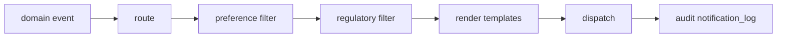
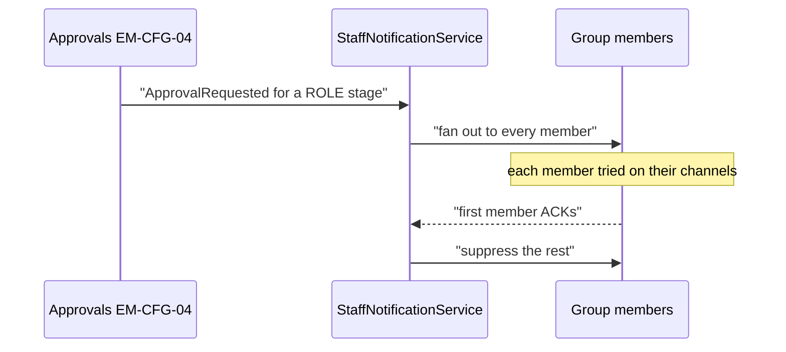
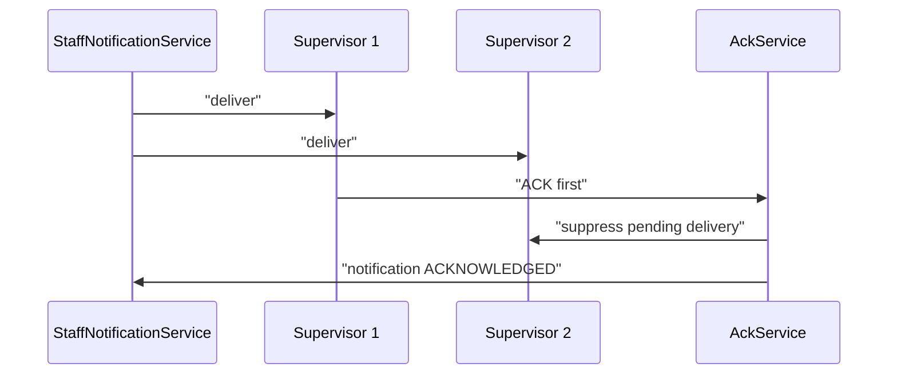
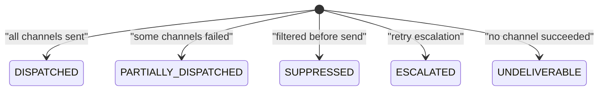
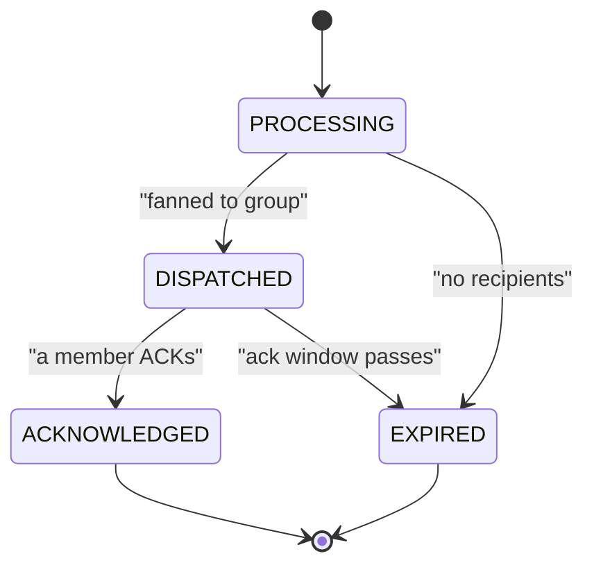
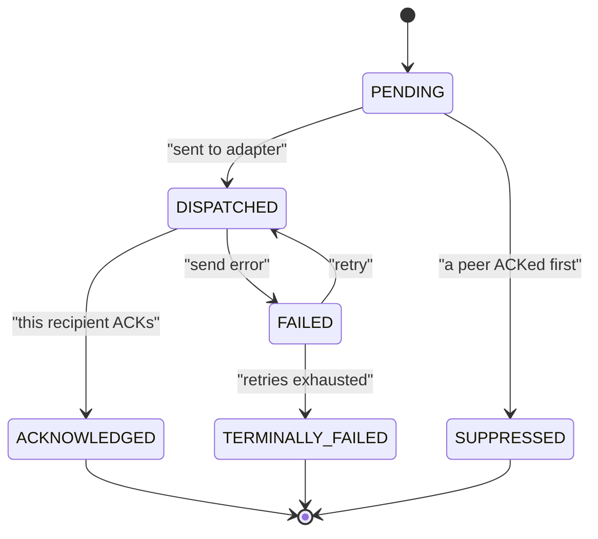

# Notification — As-Built Design (NOT-01 + ICN-01)

> **Capability codes:** NOT-01 (customer), ICN-01 (staff) · **Module path:** `Modules/Notification`
> **Tests:** `Not01Pipeline`, `Icn01`, `NotificationApi`, `TemplateStudio`

## 1. Purpose & boundaries
- **Owns:** two pipelines — **NOT-01** (customer: route → preference → regulatory → render → dispatch →
  audit) and **ICN-01** (staff: candidate-group fan-out) — plus the template/routing catalogs.
- **Does NOT own:** the trigger events (other modules), contact details (reads CRM), the transport
  (channel adapters).
- **Job:** turn a domain event into rendered, dispatched, audited notifications — channels from
  **config** (routing rules + prefs), never hardcoded.

## 📖 Scenarios (service + Foundation involvement)

### 1. Customer-visible account suspension → notify

**The story in plain English:** Something happens to a customer's account that they should hear about —
say it gets suspended. We turn that one event into the right messages on the right channels. Along the way
we check the customer's preferences and the regulatory rules, render the templates, send them, and write
down exactly what we did.

**Who does what:** ILM `CustomerAccountStatusChanged{customerVisible:true}` →
`AccountStatusNotificationBridge` → `NotificationOrchestrator::ingest` runs the NOT-01 pipeline:
1. **route** — a `notification_routing_rule` maps the event to channels (EMAIL+SMS) and purpose
   `ACCOUNT_STATUS_CHANGE`.
2. **preference** filter — drop channels the customer opted out of (marketing only).
3. **regulatory** filter — apply category rules (transactional ignores opt-out).
4. **render** — fill the templates for each surviving channel.
5. **dispatch** — send via the channel adapters.
6. **audit** — write `notification_log` (`DISPATCHED`).

**Sample — the audit row written at the end:**
```json
{ "id":"nl_1","customer_id":"cust_1","event_type":"InvoiceIssued","source_event_id":"evt_900","channels_attempted":["EMAIL","SMS"],"final_status":"DISPATCHED","dispatched_at":"2026-06-20T09:00:02Z" }
```


*Proven by `Not01PipelineTest`.*

### 2. An approval awaits a back-office group (ICN)

**The story in plain English:** An approval is waiting and a whole back-office team can act on it. We tell
the entire team at once, each person on whatever channel they prefer. The first to acknowledge takes it;
the rest are stood down.

**Who does what:** any EM-CFG-04 `ApprovalRequested`/`ApprovalStageAdvanced` →
`NotifyApproversOnApprovalRequested` → for a **ROLE** stage
`StaffNotificationService::dispatch(template:'approval-needed', candidateGroup:<approver role>)` → the
group's members get EMAIL/SLACK/IN_APP_PUSH per their prefs.


*Proven by `Icn01Test`.*

### (bonus) 2b. A named approver who's in no group (direct send)
A **USER** stage (e.g. an invited *director*) has no candidate group, so the bridge calls
`StaffNotificationService::dispatchDirect(template:'approval-needed', recipients:[{channel:'EMAIL',
address:<director email>}])` — the explicit address rides on the delivery row
(`recipient_identity`) and the channel adapter sends straight to it. Works for any address/channel
(email, WhatsApp/MSISDN, webhook id). *Proven by `Icn01Test::test_user_stage_approval_emails_the_named_director_directly` + `…direct_send_reaches_an_explicit_address`.*

### 3. Dunning notice — channels from routing, not code
BIL-04 `DunningStageAdvanced` → `DunningNotificationBridge` → orchestrator routes per the operator's
`notification_routing_rule` (swap WhatsApp in by editing a row). *Proven by `Not01PipelineTest`.*

### 4. Marketing opt-out suppresses
A `PromoBlast` (category MARKETING) to a customer with `sms_opt_in:false` → preference filter drops it →
`notification_log` `SUPPRESSED` + `NotificationSuppressed`. *Proven by `Not01PipelineTest`.*

### 5. Transactional ignores opt-out
A `PtpRegistered` (TRANSACTIONAL) to the same opted-out customer → sent anyway (opt-out doesn't apply to
transactional). *Shows: category-driven regulatory rule.*

### 6. Render failure → retry queue
A missing template variable → `render_failure_queue` row; `sophix:notification:retry-render` re-renders
later. *Foundation: scheduled retry.*

### 7. Permanent bounce → fall back to the next channel
EMAIL hard-bounces → `BounceService` marks it; the orchestrator's per-channel fallback dispatches the
next channel → `notification_log` `PARTIALLY_DISPATCHED`. *Proven by `Not01PipelineTest`.*

### 8. ICN first-ack suppresses the rest

**The story in plain English:** A staff alert went to four supervisors. We do not want four people doing
the same job. The moment one of them acknowledges, the others' still-pending messages are cancelled and
the notification is marked done.

**Who does what:** a staff notification fanned to 4 supervisors; the first to ACK → `AckService`
suppresses the other pending deliveries → notification `ACKNOWLEDGED`.


*Proven by `Icn01Test`.*

### (bonus) 9. Idempotency by source event
The orchestrator processes a `source_event_id` once (Redis/cache) — a re-dispatch is a no-op.

## 2. Data model — ≥4 **complete** sample rows + readings per table
> **Completeness:** each row lists **every domain column** (nullables shown as `null`). The surrogate
> string primary key shown is the real one; `created_at`/`updated_at` are omitted by convention. These
> tables are the DD seven-table NOT-01 core + ICN-01 staff fabric (they coexist with the legacy
> `notification`/`notification_template` studio tables, not shown here).

### `notification_routing_rule` (event_type → channels + purpose)
```json
{ "id":"nrr_1","operator_code":"WIK","event_type":"InvoiceIssued","channel":"EMAIL","template_purpose_code":"INVOICE_CYCLE_POSTPAID","priority":1,"urgency":"NORMAL","category":"TRANSACTIONAL","conditions":null,"enabled":true,"needs_pdf":true }
{ "id":"nrr_2","operator_code":"WIK","event_type":"InvoiceIssued","channel":"SMS","template_purpose_code":"INVOICE_CYCLE_POSTPAID","priority":2,"urgency":"NORMAL","category":"TRANSACTIONAL","conditions":null,"enabled":true,"needs_pdf":false }
{ "id":"nrr_3","operator_code":"WIK","event_type":"DunningStageAdvanced","channel":"SMS","template_purpose_code":"DUNNING_NOTICE","priority":1,"urgency":"URGENT","category":"TRANSACTIONAL","conditions":{"stage":">=2"},"enabled":true,"needs_pdf":false }
{ "id":"nrr_4","operator_code":"WIK","event_type":"PromoBlast","channel":"SMS","template_purpose_code":"PROMO_GENERIC","priority":1,"urgency":"NORMAL","category":"MARKETING","conditions":null,"enabled":false,"needs_pdf":false }
```
**Read each row as a sentence — *this data means this:***

| Row | What it means in plain English |
|-----|--------------------------------|
| **nrr_1** | When an invoice is issued, send the postpaid invoice template by **EMAIL first** (`priority=1`) and **render a PDF** (`needs_pdf=true`); it's transactional, so it ignores marketing opt-out. |
| **nrr_2** | The **second** channel for the same event: an **SMS** (`priority=2`), same template, no PDF — the fallback/companion to the email. |
| **nrr_3** | A dunning notice goes by **SMS** at **URGENT** urgency (so it bypasses the customer's quiet-hours window), but only fires when `conditions={"stage":">=2"}` matches the payload. |
| **nrr_4** | A promo blast (SMS, **MARKETING**) that is **paused** (`enabled=false`) — and being marketing, it would obey opt-out when on. |

**The columns that did that work:**
- **Ordering** = `priority` orders the channels tried for an event; adding a channel is just another row, not code.
- **Regulatory filter** = `category` (TRANSACTIONAL ignores marketing opt-out, MARKETING obeys it); `urgency=URGENT` bypasses the customer time-window.
- **Gates** = `conditions` gates a rule on the payload; `enabled=false` pauses a rule (O-6); `needs_pdf` triggers PDF rendering.

### `notification_log` · `final_status`: `DISPATCHED|PARTIALLY_DISPATCHED|SUPPRESSED|ESCALATED|UNDELIVERABLE` & `notification_delivery_attempt` · `status`: `SENT|FAILED|PENDING_RETRY|ESCALATED`
```json
{ "id":"nl_1","operator_code":"WIK","customer_id":"cust_1","event_type":"InvoiceIssued","source_event_id":"evt_900","source_entity_id":"inv_55","channels_attempted":["EMAIL","SMS"],"final_status":"DISPATCHED","dispatched_at":"2026-06-20T09:00:02Z","manual_resend_by":null,"original_notification_id":null }
{ "id":"nl_2","operator_code":"WIK","customer_id":"cust_2","event_type":"InvoiceIssued","source_event_id":"evt_901","source_entity_id":"inv_56","channels_attempted":["EMAIL","SMS"],"final_status":"PARTIALLY_DISPATCHED","dispatched_at":"2026-06-20T09:01:00Z","manual_resend_by":null,"original_notification_id":null }
{ "id":"nl_3","operator_code":"WIK","customer_id":"cust_M","event_type":"PromoBlast","source_event_id":"evt_902","source_entity_id":null,"channels_attempted":[],"final_status":"SUPPRESSED","dispatched_at":"2026-06-20T09:02:00Z","manual_resend_by":null,"original_notification_id":null }
{ "id":"nl_4","operator_code":"WIK","customer_id":"cust_2","event_type":"InvoiceIssued","source_event_id":null,"source_entity_id":"inv_56","channels_attempted":["EMAIL"],"final_status":"DISPATCHED","dispatched_at":"2026-06-20T11:00:00Z","manual_resend_by":"agent_7","original_notification_id":"nl_2" }
```
```json
{ "id":"att_1","notification_id":"nl_1","operator_code":"WIK","channel":"EMAIL","template_id":"tpl_inv_html","recipient":"a@x.com","attempt_number":1,"status":"SENT","failure_category":null,"failure_detail":null,"channel_response":{"messageId":"m-1"},"external_reference":"m-1","dispatch_context":null,"attempted_at":"2026-06-20T09:00:02Z","next_attempt_at":null }
{ "id":"att_2","notification_id":"nl_2","operator_code":"WIK","channel":"EMAIL","template_id":"tpl_inv_html","recipient":"bounce@x.com","attempt_number":1,"status":"FAILED","failure_category":"PERMANENT_RECIPIENT","failure_detail":"hard bounce","channel_response":{"code":"550"},"external_reference":null,"dispatch_context":{"retryable":false},"attempted_at":"2026-06-20T09:01:00Z","next_attempt_at":null }
{ "id":"att_3","notification_id":"nl_2","operator_code":"WIK","channel":"SMS","template_id":"tpl_inv_sms","recipient":"+254700000002","attempt_number":1,"status":"SENT","failure_category":null,"failure_detail":null,"channel_response":{"dlr":"ok"},"external_reference":"dlr-77","dispatch_context":null,"attempted_at":"2026-06-20T09:01:01Z","next_attempt_at":null }
{ "id":"att_4","notification_id":"nl_1","operator_code":"WIK","channel":"SMS","template_id":"tpl_inv_sms","recipient":"+254700000001","attempt_number":2,"status":"PENDING_RETRY","failure_category":"TRANSIENT","failure_detail":"gateway 503","channel_response":{"code":"503"},"external_reference":null,"dispatch_context":{"retryable":true},"attempted_at":"2026-06-20T09:00:05Z","next_attempt_at":"2026-06-20T09:05:00Z" }
```
The `final_status` the log settles on, recomputed from the per-channel attempts (all good → `DISPATCHED`;
some channels failed → `PARTIALLY_DISPATCHED`; preference/regulatory dropped it → `SUPPRESSED`):


**Read each row as a sentence — *this data means this:***

The log (one aggregate row per notification event):

| Row | What it means in plain English |
|-----|--------------------------------|
| **nl_1** | An invoice notification to cust_1 that **fully succeeded** (`channels_attempted=[EMAIL,SMS]`, `final_status=DISPATCHED`). |
| **nl_2** | An invoice notification to cust_2 that **only partly got through** (`final_status=PARTIALLY_DISPATCHED`) — one of its two channels failed. |
| **nl_3** | A promo to cust_M that was **never sent** (`channels_attempted=[]`, `final_status=SUPPRESSED`) — preference/regulatory filtering dropped it. |
| **nl_4** | A **manual resend** of nl_2: `manual_resend_by=agent_7` and `original_notification_id=nl_2` point back, and this time EMAIL alone went out and **DISPATCHED**. |

The attempts (one row per channel try):

| Row | What it means in plain English |
|-----|--------------------------------|
| **att_1** | nl_1's EMAIL attempt **SENT** on try 1 (`external_reference=m-1`). |
| **att_2** | nl_2's EMAIL attempt **hard-bounced** (`status=FAILED`, `failure_category=PERMANENT_RECIPIENT`); `dispatch_context.retryable=false` means no retry — this is why nl_2 is only partial. |
| **att_3** | nl_2's SMS attempt **SENT** — the channel that did get through. |
| **att_4** | nl_1's SMS attempt hit a transient gateway 503 (`status=PENDING_RETRY`, `failure_category=TRANSIENT`), so it's scheduled to retry at `next_attempt_at`. |

**The columns that did that work:**
- **Aggregate vs detail** = the log's `final_status` is recomputed from the latest attempt per channel; `channels_attempted` lists which were tried.
- **Resend trail** = `manual_resend_by` + `original_notification_id` link a resend to its original.
- **Retry data** = `failure_category`/`dispatch_context` decide if an attempt retries; `next_attempt_at` schedules it.

### `template` (format-decomposed, versioned) · `status`: `ACTIVE|DRAFT|ARCHIVED|DISABLED` & `customer_notification_preference` · `email_status`: `VALID|SOFT_BOUNCED|INVALID`
```json
{ "id":"tpl_1","operator_code":"WIK","template_format":"EMAIL_SUBJECT","template_purpose_code":"DUNNING_NOTICE","locale":"en","version":1,"status":"ACTIVE","engine_type":"HANDLEBARS","template_payload":"Payment overdue","placeholder_schema":{"name":"string"},"sample_data":{"name":"Asha"},"created_by":"studio_admin" }
{ "id":"tpl_2","operator_code":"WIK","template_format":"SMS_TEXT","template_purpose_code":"DUNNING_NOTICE","locale":"en","version":1,"status":"ACTIVE","engine_type":"HANDLEBARS","template_payload":"Your bill is overdue","placeholder_schema":null,"sample_data":null,"created_by":"studio_admin" }
{ "id":"tpl_3","operator_code":"WIK","template_format":"EMAIL_HTML","template_purpose_code":"INVOICE_CYCLE_POSTPAID","locale":"sw","version":2,"status":"DRAFT","engine_type":"HTML_TO_PDF","template_payload":"<html>…</html>","placeholder_schema":{"total":"number"},"sample_data":null,"created_by":"studio_admin" }
{ "id":"tpl_4","operator_code":"WIK","template_format":"PDF","template_purpose_code":"INVOICE_CYCLE_POSTPAID","locale":"en","version":1,"status":"ARCHIVED","engine_type":"HTML_TO_PDF","template_payload":"…","placeholder_schema":null,"sample_data":null,"created_by":null }
```
```json
{ "id":"cnp_1","customer_id":"cust_M","operator_code":"WIK","email_opt_in":true,"sms_opt_in":false,"locale":"en","preferred_time_window_start":"08:00:00","preferred_time_window_end":"20:00:00","email_status":"VALID" }
{ "id":"cnp_2","customer_id":"cust_1","operator_code":"WIK","email_opt_in":true,"sms_opt_in":true,"locale":"sw","preferred_time_window_start":null,"preferred_time_window_end":null,"email_status":"SOFT_BOUNCED" }
{ "id":"cnp_3","customer_id":"cust_2","operator_code":"WIK","email_opt_in":false,"sms_opt_in":true,"locale":"en","preferred_time_window_start":null,"preferred_time_window_end":null,"email_status":"VALID" }
{ "id":"cnp_4","customer_id":"cust_3","operator_code":"WIK","email_opt_in":false,"sms_opt_in":false,"locale":"en","preferred_time_window_start":null,"preferred_time_window_end":null,"email_status":"INVALID" }
```
**Read each row as a sentence — *this data means this:***

Templates (decomposed by format + locale + version):

| Row | What it means in plain English |
|-----|--------------------------------|
| **tpl_1** | The English **email subject** part of the dunning notice, **ACTIVE** v1 (Handlebars), with a `{name}` placeholder. |
| **tpl_2** | The English **SMS text** part of the same dunning notice, **ACTIVE** v1 — a different format of the same purpose. |
| **tpl_3** | A Swahili **EMAIL_HTML** invoice template still in **DRAFT** at v2 (`engine_type=HTML_TO_PDF`), so it can't be picked to render yet. |
| **tpl_4** | An English **PDF** invoice template that is **ARCHIVED** (retired, no longer rendered). |

Customer preferences:

| Row | What it means in plain English |
|-----|--------------------------------|
| **cnp_1** | cust_M takes **email but not SMS** (`sms_opt_in=false`) and only within a **08:00–20:00** quiet-hours window; their email address is `VALID`. |
| **cnp_2** | cust_1 is opted into **both** channels, prefers **Swahili** (`locale=sw`), but their email **soft-bounced** (`email_status=SOFT_BOUNCED`) so email may be skipped. |
| **cnp_3** | cust_2 takes **SMS only** (email opt-out); email address still `VALID`. |
| **cnp_4** | cust_3 has **opted out of everything** and their email is `INVALID` — only transactional sends would reach them at all. |

**The columns that did that work:**
- **Rendering** = a format needs all its parts present at an `ACTIVE` `version` to render; `engine_type` picks the render engine.
- **Preference gating** = `email_opt_in`/`sms_opt_in` gate the MARKETING channels (transactional sends regardless); `locale` picks the language; the time-window bounds the send; `email_status` lets a bounced address be skipped.

### ICN: `staff_notification` (`status`: `PROCESSING|DISPATCHED|ACKNOWLEDGED|EXPIRED`) & `staff_group_membership`
```json
{ "notification_id":"sn_1","operator_code":"WIK","source_module":"EM-CFG-04","source_task_id":"task_11","source_process_instance":"pi_1","source_business_key":"appr_77","candidate_group":"kenya-l1-kyc","template_code":"approval-needed","template_variables":{"customer":"cust_9"},"urgency":"high","fallback_mode_override":null,"deeplink_url":"/approvals/appr_77","ack_window_hours":24,"expected_recipients":4,"status":"DISPATCHED","expiry_reason":null,"acknowledged_by":null,"acknowledged_at":null,"idempotency_key":"appr_77","expires_at":"2026-06-21T09:00:00Z" }
{ "notification_id":"sn_2","operator_code":"WIK","source_module":"FUL-02","source_task_id":"task_12","source_process_instance":"pi_2","source_business_key":"kyc_55","candidate_group":"kenya-l1-kyc","template_code":"kyc-l1-approval-needed","template_variables":{"kyc":"kyc_55"},"urgency":"medium","fallback_mode_override":"SEQUENTIAL_UNTIL_ACK","deeplink_url":null,"ack_window_hours":12,"expected_recipients":3,"status":"ACKNOWLEDGED","expiry_reason":null,"acknowledged_by":"sup_01","acknowledged_at":"2026-06-20T10:05:00Z","idempotency_key":"kyc_55","expires_at":"2026-06-20T21:00:00Z" }
{ "notification_id":"sn_3","operator_code":"WIK","source_module":"BIL-04","source_task_id":null,"source_process_instance":null,"source_business_key":"refund_3","candidate_group":"finance","template_code":"refund-approval-needed","template_variables":{"amount":5000},"urgency":"high","fallback_mode_override":null,"deeplink_url":null,"ack_window_hours":null,"expected_recipients":0,"status":"EXPIRED","expiry_reason":"NO_RECIPIENTS","acknowledged_by":null,"acknowledged_at":null,"idempotency_key":"refund_3","expires_at":null }
{ "notification_id":"sn_4","operator_code":"WIK","source_module":"WO-01","source_task_id":"task_14","source_process_instance":"pi_4","source_business_key":"wo_9","candidate_group":"noc-team","template_code":"wo-stuck","template_variables":{"wo":"wo_9"},"urgency":"low","fallback_mode_override":null,"deeplink_url":null,"ack_window_hours":24,"expected_recipients":2,"status":"PROCESSING","expiry_reason":null,"acknowledged_by":null,"acknowledged_at":null,"idempotency_key":null,"expires_at":"2026-06-21T12:00:00Z" }
```
```json
{ "id":1,"operator_code":"WIK","group_code":"kenya-l1-kyc","user_id":"sup_01" }
{ "id":2,"operator_code":"WIK","group_code":"kenya-l1-kyc","user_id":"sup_02" }
{ "id":3,"operator_code":"WIK","group_code":"finance","user_id":"fin_01" }
{ "id":4,"operator_code":"WIK","group_code":"noc-team","user_id":"noc_01" }
```
The staff notification's own lifecycle (it starts `PROCESSING`, gets `DISPATCHED` to the group, ends
`ACKNOWLEDGED` when someone acts, or `EXPIRED` if nobody does / there were no recipients):


**Read each row as a sentence — *this data means this:***

| Row | What it means in plain English |
|-----|--------------------------------|
| **sn_1** | A high-urgency approval fanned to the **kenya-l1-kyc** group (`expected_recipients=4`); it's **DISPATCHED** and **nobody has ACKed yet** (`acknowledged_by=null`), with a 24h ack window (`expires_at`). |
| **sn_2** | A KYC approval to the same group that **someone acted on**: `status=ACKNOWLEDGED`, `acknowledged_by=sup_01` at `acknowledged_at` — so peers are no longer needed. |
| **sn_3** | A refund approval to **finance** that **expired immediately** because there was **no one to send to** (`expected_recipients=0`, `status=EXPIRED`, `expiry_reason=NO_RECIPIENTS`). |
| **sn_4** | A low-urgency "WO stuck" alert to **noc-team** still **PROCESSING** (not yet fanned out); note `idempotency_key=null` here. |

The group membership (the recipient roster) maps **group_code → user_id**: kenya-l1-kyc has sup_01 and sup_02, finance has fin_01, noc-team has noc_01.

**The columns that did that work:**
- **Fan-out target** = `candidate_group` + the membership rows; first member to act flips `status` to `ACKNOWLEDGED` (recorded by `acknowledged_by`), suppressing the rest.
- **No-recipient expiry** = `expected_recipients=0` drives `EXPIRED` with `expiry_reason=NO_RECIPIENTS`.
- **Idempotency / provenance** = `idempotency_key` makes a re-dispatch a no-op; `source_business_key` threads back to the originating module/flow.

### ICN: `staff_notification_delivery` (one row per recipient × channel) · `status`: `PENDING|DISPATCHED|ACKNOWLEDGED|FAILED|TERMINALLY_FAILED|SUPPRESSED`
```json
{ "delivery_id":"deliv_1","notification_id":"sn_1","operator_code":"WIK","recipient_user_id":"sup_01","recipient_identity":null,"channel":"IN_APP_PUSH","channel_priority_idx":0,"status":"DISPATCHED","attempts":1,"last_attempt_at":"2026-06-20T09:00:01Z","provider_message_id":"push-1","provider_response":{"ok":true},"failure_reason":null,"acknowledged_at":null,"next_retry_at":null }
{ "delivery_id":"deliv_2","notification_id":"sn_1","operator_code":"WIK","recipient_user_id":"sup_02","recipient_identity":null,"channel":"EMAIL","channel_priority_idx":1,"status":"SUPPRESSED","attempts":0,"last_attempt_at":null,"provider_message_id":null,"provider_response":null,"failure_reason":null,"acknowledged_at":null,"next_retry_at":null }
{ "delivery_id":"deliv_3","notification_id":"sn_2","operator_code":"WIK","recipient_user_id":"sup_01","recipient_identity":null,"channel":"SLACK","channel_priority_idx":0,"status":"ACKNOWLEDGED","attempts":1,"last_attempt_at":"2026-06-20T10:00:00Z","provider_message_id":"slack-77","provider_response":{"ts":"123.45"},"failure_reason":null,"acknowledged_at":"2026-06-20T10:05:00Z","next_retry_at":null }
{ "delivery_id":"deliv_4","notification_id":"sn_dir","operator_code":"WIK","recipient_user_id":"director_9","recipient_identity":{"channel":"EMAIL","address":"director@wik.example"},"channel":"EMAIL","channel_priority_idx":0,"status":"DISPATCHED","attempts":1,"last_attempt_at":"2026-06-20T11:00:00Z","provider_message_id":"m-dir","provider_response":{"ok":true},"failure_reason":null,"acknowledged_at":null,"next_retry_at":null }
```
The status a single delivery row moves through (it starts `PENDING`; if a peer ACKs first it ends
`SUPPRESSED`; retries that never succeed end `TERMINALLY_FAILED`):


**Read each row as a sentence — *this data means this:***

| Row | What it means in plain English |
|-----|--------------------------------|
| **deliv_1** | For sn_1, sup_01's **first-choice channel** (`channel_priority_idx=0`, IN_APP_PUSH) was **DISPATCHED** (`provider_message_id=push-1`), not yet acked. |
| **deliv_2** | For sn_1, sup_02's EMAIL (a lower-priority channel, idx 1) was **SUPPRESSED** with **0 attempts** — never tried because the notification's need was met elsewhere. |
| **deliv_3** | For sn_2, sup_01's SLACK delivery was **ACKNOWLEDGED** (`acknowledged_at` set) — this is the ACK that resolved sn_2. |
| **deliv_4** | A **DIRECT** send (notification sn_dir) to a named approver in no group: `recipient_identity={channel:EMAIL,address:director@wik.example}` is carried explicitly and handed straight to the adapter — **DISPATCHED**. |

**The columns that did that work:**
- **Channel order** = `channel_priority_idx` orders the channels a recipient is tried on (per channel-config try-order / fallback mode).
- **First-ACK suppression** = an `ACKNOWLEDGED` row (deliv_3) suppresses the other still-pending rows (deliv_2 → `SUPPRESSED`).
- **Address resolution** = `recipient_identity` is normally null (resolved from the user's channel-identity); a DIRECT send carries an explicit `{channel,address}` so the dispatcher skips the directory lookup.
- **Retries** = `failure_reason` codes explain a `FAILED`/`TERMINALLY_FAILED` row; `next_retry_at` drives the retry sweep. The `(notification_id, recipient_user_id, channel)` tuple is unique.

## 3. Services
| Service | Responsibility |
| --- | --- |
| `NotificationOrchestrator` | NOT-01 pipeline (idempotency→route→preference→regulatory→render→dispatch→audit) |
| `TemplateService` | template CRUD (Studio) |
| `RenderRetryService`/`RetryScheduler`/`BounceService` | render retry, dispatch retry/escalation, bounce |
| `Icn/Services/StaffNotificationService` (+ `DeliveryDispatcher`, `AckService`, directory) | ICN-01 group fan-out (`dispatch`) + **direct-address send** (`dispatchDirect` — explicit `{channel,address}` recipients on `recipient_identity`, no group); `DeliveryDispatcher` resolves the adapter + identity and sends each `staff_notification_delivery` row |

## 4. API surface
NOT-01: `GET/PUT /api/notifications/preferences` (`selfcare.access`), `/api/admin/notifications/{send,
resend,dashboard,failure-queue,routing/pause,bounces}` + `render-failures/{id}/retry`
(`notification.manage`), `/api/admin/templates/*` (`notification.template.manage`),
`GET/POST /api/notifications` (`notification.read`/`notification.send`). ICN-01:
`POST /api/staff-notifications` (`staff_notification.dispatch`), `…/inbox` + `…/{id}/ack` (own inbox, any
staff user), plus the `staff-notification-*` catalog (`staff_notification.manage`).

## 5. Integration (events)
- **Consumes (bridges):** `DunningNotificationBridge`, `AccountStatusNotificationBridge`,
  `NotifyApproversOnApprovalRequested`.
- **Emits:** `Notification{Dispatched,Suppressed,Escalated,Undeliverable}`, ICN `StaffNotification{…}`.

## 6. Processes
Scheduled workers: `sophix:notification:retry-dispatch` (NOT-01 dispatch retry/escalation),
`sophix:notification:retry-render` (re-render the `render_failure_queue`), `sophix:icn:retry` (ICN delivery
retry), `sophix:icn:expire` (ICN ack-window expiry sweep).

## 7. Policy & config
Routing rules, templates, channel config, customer & staff prefs, ICN groups + adapter bindings — all
per-operator data.

## 8. Cross-module dependencies
- **Reacts to →** Billing (dunning/tax), ILM (account status), Foundation Approvals (ICN). **Reads →**
  ILM/CRM for contacts. **Connector seam →** channel adapters.

## 9. Invariants & rules
| Rule | Statement | Enforced in |
| --- | --- | --- |
| R-6 | an event with no routing rule produces no customer notice | `NotificationOrchestrator` |
| idempotency | a `source_event_id` is processed once | orchestrator cache |
| transactional override | TRANSACTIONAL ignores marketing opt-out | preference filter |

## 10. Open items / deltas
- Legacy `NotificationService::send` coexists with the orchestrator (back-compat) — not a duplicate.
- The approver-notification + account-status bridges were wired during hardening (approval templates
  were orphaned).
