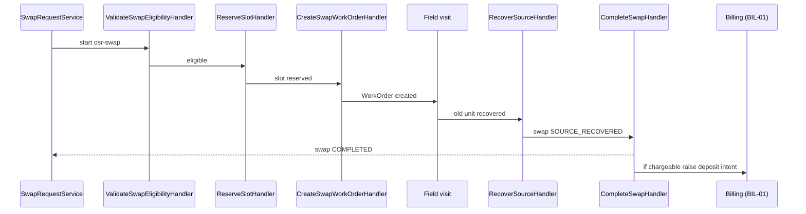
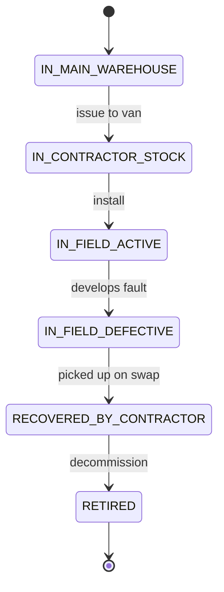
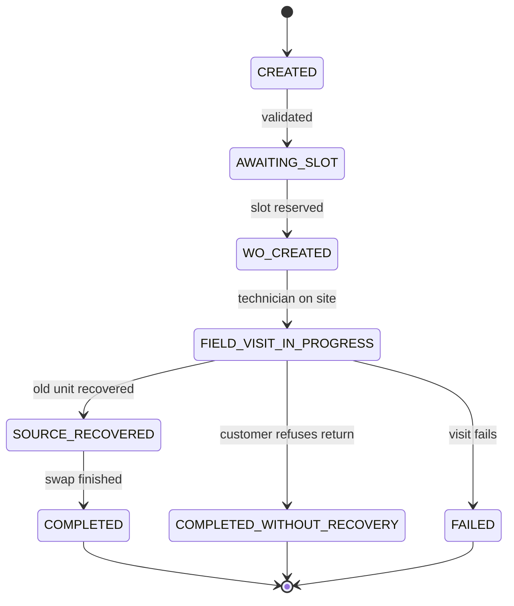

# OSR — As-Built Design (Equipment & Stock)

> **Capability codes:** OSR-01 (stock chain), OSR-INSTANCE-01 (serialized instances), OSR-02
> (procurement), OSR-05 (inventory audit), OSR-RMA-01 (swap/RMA), PLM-CFG-06 (SKUs) · **Module path:**
> `Modules/Osr` · **Tests:** `OsrApi`, `ProcurementAudit`, `StockReasonAndBom`, `StockReservation`,
> `StockRules`, `SwapRequest`

## 1. Purpose & boundaries
- **Owns:** the **stock chain** (locations/balances/movements/reservations), the **serialized
  instance** registry, **procurement** (POs), **inventory audit** (counts), and **equipment swap/RMA**.
- **Does NOT own:** field work (WorkOrder), the network (Provisioning), money (Billing) — it calls them.
  Stock authority stays here.
- **Job:** authoritative equipment/stock state with governed movements, procurement, and swaps.

## 📖 Scenarios (service + Foundation involvement)

### 1. Buy stock (EM-CFG-04 gated) → receive it

**The story in plain English:** A buyer raises a purchase order to restock equipment. Because real money
is involved, a big order can't be approved by the same person who raised it — a **second person** has to
sign off. Once the goods arrive, the system records the new stock and gives every serialised unit its own
identity card.

**Who does what:**
1. `ProcurementService::create` makes a `purchase_order` in status `DRAFT`.
2. `approve` opens a **PURCHASE_ORDER** EM-CFG-04 approval request (`Foundation/Approvals`). With a policy
   it parks the PO at `PENDING_APPROVAL`; otherwise it auto-approves to `APPROVED`.
3. A **different** approver decides via `…/approvals/{req}/decide` (separation of duties) → PO `APPROVED`
   or `REJECTED`.
4. `receive` posts a `GOODS_RECEIPT` `stock_movement` (+qty) and registers each serial as an
   `equipment_instance` in state `IN_MAIN_WAREHOUSE`.

**Sample — a PO parked waiting on a second approver:**
```json
{ "po_id":"po_2","status":"PENDING_APPROVAL","supplier":"Casa","total_value":900000,"approval_request_id":"appr_70","created_by":"u_proc1" }
```
*Proven by `ProcurementAuditTest`.*

### 2. Reserve stock for an install WO → consume / release (event-driven)

**The story in plain English:** Before a technician's job, the system sets aside the cable and parts that
job will need, so two jobs can't both promise the same stock. When the job finishes the parts are used
up; if the job is cancelled they go back on the shelf; and if a hold is forgotten about, it eventually
times out and is released automatically.

**Who does what:**
1. `StockService::reserve(wo_id, sku, location, qty)` writes a `stock_reservation` in status `ACTIVE`
   (this raises the location's `qty_reserved`).
2. On `WorkOrderFinalized` the `ConsumeReservationOnWoLifecycle` listener (running on the outbox) flips
   the reservation to `CONSUMED`; on `WorkOrderCancelled` it flips to `RELEASED`.
3. A hold left un-actioned past `expires_at` is swept to `EXPIRED` by the
   `sophix:stock:expire-reservations` command (registered for periodic invocation; the module's own
   schedule wiring is currently disabled).

*Foundation: outbox listener + sweep command.* *Proven by `StockReservationTest`.*

### 3. A damaged write-off needs approval

**The story in plain English:** Throwing away damaged stock loses the company money, so it needs a
sign-off first. Plain stock receipts don't — they just post straight away. Whether a given reason needs
approval is a setting, not hard-coded.

**Who does what:**
1. `POST /api/stock-movements` with reason `WRITE_OFF` — its `stock_reason_code` has
   `requires_approval=true`, so `StockService::submit` holds it as an EM-CFG-04 approval request
   (auto-approving only when there is no policy).
2. A movement with a `RECEIPT` reason (`requires_approval=false`) posts immediately, no approval.

*Shows: config-driven approval per reason code.* *Proven by `StockRulesTest`.*

### 4. Inventory count → reconcile (idempotent)

**The story in plain English:** Staff physically count what's on a shelf and compare it to what the
system thinks is there. If the numbers differ, the system makes **one** correcting adjustment to bring
them in line. Running the correction a second time does nothing — the books are already right.

**Who does what:**
1. `InventoryAuditService::open(location)` starts a count session.
2. `count(session, lines)` records system quantity vs counted quantity per SKU.
3. `reconcile` posts **one** `INVENTORY_AUDIT_ADJUSTMENT` `stock_movement` for the variance; a second
   `reconcile` is a no-op (R-OSR-05-09).

*Shows: idempotent correction.* *Proven by `ProcurementAuditTest`.*

### 5. Instance lifecycle: warehouse → van → field

**The story in plain English:** A serialised device (an ONT or set-top box) is tracked individually as it
moves: it starts in the warehouse, gets loaded onto a technician's van, and ends up installed at a
customer's home. Every move is logged so you always know where each unit is.

**Who does what:**
1. `EquipmentInstanceService::transition` walks the state machine: `IN_MAIN_WAREHOUSE` → (issue to van)
   `IN_CONTRACTOR_STOCK` → (install) `IN_FIELD_ACTIVE`, now bound to a `customer_id`/`subscription_id`.
2. Each step emits an `EquipmentInstanceStateChanged` event.

*Shows: the serialized state machine + events.* (See the `equipment_instance` state diagram in §2.)

### 6. HFC swap (recovered) → completed, charged

**The story in plain English:** A customer's box is faulty, so a technician visits to swap it for a new
one and brings the old one back. The whole visit is driven by a step-by-step workflow. If the swap is an
upgrade or the old box was out of warranty, the customer gets a charge; if it was a normal in-warranty
fault, it's free.

**Who does what:**
1. `SwapRequestService` starts the `osr-swap` workflow.
2. `ValidateSwapEligibilityHandler` checks the swap is allowed → `ReserveSlotHandler` books a field slot
   → `CreateSwapWorkOrderHandler` creates the WorkOrder.
3. The technician visits and recovers the old unit → `RecoverSourceHandler` marks the swap
   `SOURCE_RECOVERED`.
4. `CompleteSwapHandler` finishes the swap → status `COMPLETED`. If the swap is `chargeable`
   (out-of-warranty / upgrade) it raises the SKU deposit as a **BIL-01** billing intent.


*Foundation: workflow + Billing call.* *Proven by `SwapRequestTest`.*

### 7. EQR — customer refuses return → deposit forfeited

**The story in plain English:** Sometimes a customer won't hand back the old equipment. The swap is then
recorded as "completed but nothing recovered", the old box stays where it is, and the customer loses the
deposit they paid on it — the system bills the forfeited deposit.

**Who does what:**
1. On the field visit `recovered=false` → `CompleteWithoutRecoveryHandler` runs.
2. The swap goes to status `COMPLETED_WITHOUT_RECOVERY`; the unit stays `IN_FIELD_ACTIVE`.
3. The **deposit is forfeited** — it resolves the SKU `deposit_amount` and raises a `DEPOSIT_FORFEITURE`
   BIL-01 intent, emitting `EquipmentSwapCompleted{depositForfeited:true}`.

**Sample — the forfeiture swap (no target installed, deposit billed):**
```json
{ "swap_id":"swp_3","status":"COMPLETED_WITHOUT_RECOVERY","chargeable":true,"charge_code":"DEPOSIT_FORFEITURE","charge_amount":3000,"target_instance_id":null,"flow_payload":{"recovered":false} }
```
*Proven by `SwapRequestTest::test_eqr_…`.*

### 8. A movement can never drive on-hand negative

**The story in plain English:** You can never take more stock out than you actually have. If a withdrawal
would push the on-hand count below zero, the system refuses it outright.

**Who does what:**
1. `StockService::move` rejects up front when a debit would push `stock_balance.quantity` below 0
   (R-OSR-SC-8), throwing a `DomainException`.

*Shows: a hard stock invariant.* *Proven by `StockRulesTest`.*

### (bonus) 9. Defective recovered unit → vendor RMA

**The story in plain English:** When a faulty unit comes back, the system notes it down so it can later
be shipped to the vendor in a batch.

A swap completed with `defectConfirmed` records a `vendor_rma_stub` row with `batch_ref='PENDING_BATCH'`
for the v1.0 batch handoff (a real vendor-RMA integration is a connector).

## 2. Data model — ≥4 **complete** sample rows + readings
> **Completeness:** each row lists **every domain column** (nullables shown as `null`). The string
> business key shown is the real primary key (or the surrogate `id` where the table has no business key,
> e.g. `stock_movement`/`stock_balance`); `created_at`/`updated_at` are omitted by convention.

### `equipment_sku` (PLM-CFG-06) · `category`: `ROUTER|ONT|STB|SPLITTER|CABLE|WALL_SOCKET|MOUNT_KIT|SMARTCARD` · `ownership_semantics`: `RETURNABLE|CONSUMABLE|RENTED`
```json
{ "sku_id":"WIK-ONT-HUAWEI-EG8145V5","operator_code":"WIK","name":"Huawei EG8145V5 ONT","category":"ONT","is_serialized":true,"ownership_semantics":"RETURNABLE","deposit_amount":5000,"warranty_days":365,"active":true }
{ "sku_id":"WIK-STB-4K","operator_code":"WIK","name":"4K Android STB","category":"STB","is_serialized":true,"ownership_semantics":"RENTED","deposit_amount":3000,"warranty_days":365,"active":true }
{ "sku_id":"WIK-CABLE-CAT6","operator_code":"WIK","name":"Cat6 Drop Cable (m)","category":"CABLE","is_serialized":false,"ownership_semantics":"CONSUMABLE","deposit_amount":0,"warranty_days":0,"active":true }
{ "sku_id":"WIK-ONT-OLD","operator_code":"WIK","name":"Legacy ONT (retired)","category":"ONT","is_serialized":true,"ownership_semantics":"RETURNABLE","deposit_amount":4000,"warranty_days":90,"active":false }
```
**Read each row as a sentence — *this data means this:***

| Row | What it means in plain English |
|-----|--------------------------------|
| **WIK-ONT-HUAWEI-EG8145V5** | A Huawei ONT, **serialized** (`is_serialized=true`) and **returnable** (`ownership_semantics=RETURNABLE`), carrying a KES 5,000 deposit and a 365-day warranty, **live** (`active=true`). |
| **WIK-STB-4K** | A 4K STB, serialized and **rented** (`ownership_semantics=RENTED`), KES 3,000 deposit, 365-day warranty, live. |
| **WIK-CABLE-CAT6** | Drop cable sold by the metre, **non-serialized** and **consumable** (`is_serialized=false`, `ownership_semantics=CONSUMABLE`) — **no deposit, no warranty** (`deposit_amount=0`, `warranty_days=0`). |
| **WIK-ONT-OLD** | A **retired** legacy ONT (`active=false`) — still returnable with a KES 4,000 deposit, but **no new stock**. |

**The columns that did the work:**
- `is_serialized` decides whether each unit is tracked as an `equipment_instance` (ONT/STB) or only as bulk `stock_balance` (cable).
- `deposit_amount` is what an EQR forfeiture or out-of-warranty swap charges; `ownership_semantics` says returnable/rented (deposit-bearing) vs consumed; `active=false` retires a SKU.

### `equipment_instance` · `state`: `IN_MAIN_WAREHOUSE|IN_CONTRACTOR_STOCK|RESERVED_FOR_WO|IN_FIELD_ACTIVE|IN_FIELD_DEFECTIVE|RECOVERED_BY_CONTRACTOR|RETURNED|FAULTY|RETIRED`
```json
{ "instance_id":"eqi_1","operator_code":"WIK","sku_id":"WIK-ONT-HUAWEI-EG8145V5","serial":"SN-001","mac_address":"AC:DE:48:00:00:01","state":"IN_MAIN_WAREHOUSE","location_id":"WIK-WAREHOUSE-MAIN","customer_id":null,"subscription_id":null,"active":true }
{ "instance_id":"eqi_2","operator_code":"WIK","sku_id":"WIK-ONT-HUAWEI-EG8145V5","serial":"SN-002","mac_address":"AC:DE:48:00:00:02","state":"IN_CONTRACTOR_STOCK","location_id":"WIK-VAN-ctr_9","customer_id":null,"subscription_id":null,"active":true }
{ "instance_id":"eqi_3","operator_code":"WIK","sku_id":"WIK-STB-4K","serial":"SN-100","mac_address":null,"state":"IN_FIELD_ACTIVE","location_id":null,"customer_id":"cust_1","subscription_id":"sub_1","active":true }
{ "instance_id":"eqi_4","operator_code":"WIK","sku_id":"WIK-ONT-OLD","serial":"SN-900","mac_address":"AC:DE:48:00:09:00","state":"IN_FIELD_DEFECTIVE","location_id":null,"customer_id":"cust_2","subscription_id":"sub_9","active":true }
```
**Read each row as a sentence — *this data means this:***

| Row | What it means in plain English |
|-----|--------------------------------|
| **eqi_1** | A Huawei ONT (serial SN-001) sitting as **sellable warehouse stock** (`state=IN_MAIN_WAREHOUSE`, `location_id=WIK-WAREHOUSE-MAIN`), not yet assigned to anyone (`customer_id`/`subscription_id` null). |
| **eqi_2** | An identical ONT (SN-002) **loaded on contractor `ctr_9`'s van** (`state=IN_CONTRACTOR_STOCK`, `location_id=WIK-VAN-ctr_9`). |
| **eqi_3** | A 4K STB (SN-100) **installed and live at a customer** (`state=IN_FIELD_ACTIVE`, bound to `cust_1`/`sub_1`), with `location_id=null` because it's now in the field. |
| **eqi_4** | A legacy ONT (SN-900) **defective in the field** (`state=IN_FIELD_DEFECTIVE`, bound to `cust_2`/`sub_9`) — a swap candidate. |

**The columns that did the work:**
- `state` tells you *where the unit physically is, plus its condition*; once in the field `location_id` is null and `customer_id`/`subscription_id` carry the binding.

A swap moves the source instance through `RESERVED_FOR_WO → RECOVERED_BY_CONTRACTOR` (or it stays in the
field on an EQR refusal). `active` only flips to false once the instance reaches the terminal `RETIRED`
state — the transition that emits `EquipmentInstanceDecommissioned`.

The realistic life of one unit (warehouse → van → field → recover → retire, with the defective branch):


### `stock_location` (`type`: `WAREHOUSE|CONTRACTOR_VAN`)
```json
{ "location_id":"WIK-WAREHOUSE-MAIN","operator_code":"WIK","type":"WAREHOUSE","name":"Main Warehouse (Nairobi)","contractor_id":null,"active":true }
{ "location_id":"WIK-VAN-ctr_9","operator_code":"WIK","type":"CONTRACTOR_VAN","name":"Van — Contractor ctr_9","contractor_id":"ctr_9","active":true }
{ "location_id":"WIK-WAREHOUSE-MSA","operator_code":"WIK","type":"WAREHOUSE","name":"Mombasa Warehouse","contractor_id":null,"active":true }
{ "location_id":"WIK-VAN-ctr_4","operator_code":"WIK","type":"CONTRACTOR_VAN","name":"Van — Contractor ctr_4 (retired)","contractor_id":"ctr_4","active":false }
```
**Read each row as a sentence — *this data means this:***

| Row | What it means in plain English |
|-----|--------------------------------|
| **WIK-WAREHOUSE-MAIN** | The main Nairobi warehouse (`type=WAREHOUSE`), live, with **no** `contractor_id` (warehouses aren't tied to a contractor). |
| **WIK-VAN-ctr_9** | Contractor `ctr_9`'s **rolling stock** (`type=CONTRACTOR_VAN`, `contractor_id=ctr_9`), live. |
| **WIK-WAREHOUSE-MSA** | The Mombasa warehouse, live, no `contractor_id`. |
| **WIK-VAN-ctr_4** | Contractor `ctr_4`'s van that is **decommissioned** (`active=false`) — no new movements post to it. |

**The columns that did the work:**
- Stock lives at locations; `type=CONTRACTOR_VAN` is a contractor's rolling stock (keyed to `contractor_id`), a WAREHOUSE has none, and `active=false` retires a location.

### `stock_balance` (derived projection per (location, sku); `available = quantity − qty_reserved`)
```json
{ "id":"sb_1","operator_code":"WIK","location_id":"WIK-WAREHOUSE-MAIN","sku_id":"WIK-CABLE-CAT6","quantity":4200,"qty_reserved":150 }
{ "id":"sb_2","operator_code":"WIK","location_id":"WIK-VAN-ctr_9","sku_id":"WIK-CABLE-CAT6","quantity":300,"qty_reserved":0 }
{ "id":"sb_3","operator_code":"WIK","location_id":"WIK-WAREHOUSE-MSA","sku_id":"WIK-CABLE-CAT6","quantity":80,"qty_reserved":80 }
{ "id":"sb_4","operator_code":"WIK","location_id":"WIK-WAREHOUSE-MAIN","sku_id":"WIK-ONT-HUAWEI-EG8145V5","quantity":0,"qty_reserved":0 }
```
**Read each row as a sentence — *this data means this:***

| Row | What it means in plain English |
|-----|--------------------------------|
| **sb_1** | The main warehouse holds **4,200** metres of Cat6 cable, **150 reserved** (`quantity=4200`, `qty_reserved=150`) → 4,050 available. |
| **sb_2** | Contractor `ctr_9`'s van holds **300** metres of cable, **none reserved** → all 300 available. |
| **sb_3** | The Mombasa warehouse holds **80** metres of cable, **all 80 reserved** (`quantity=80`, `qty_reserved=80`) → **nothing available**. |
| **sb_4** | The ONT balance row stays **0** (`quantity=0`) because serialized ONTs are counted by their instances, not here. |

**The columns that did the work:**
- `stock_balance` is on-hand per (location, sku) for **non-serialized** SKUs; `quantity` is the on-hand total and `qty_reserved` the held-but-unavailable portion (so `available = quantity − qty_reserved`).

### `stock_movement` (append-only ledger) · `reason_code` (catalog `stock_reason_code`: `direction` IN/OUT/EITHER, `requires_approval`)
```json
{ "id":"sm_1","operator_code":"WIK","sku_id":"WIK-CABLE-CAT6","location_id":"WIK-WAREHOUSE-MAIN","quantity":5000,"reason_code":"GOODS_RECEIPT","reference":"po_1","approved_by":null }
{ "id":"sm_2","operator_code":"WIK","sku_id":"WIK-CABLE-CAT6","location_id":"WIK-VAN-ctr_9","quantity":-50,"reason_code":"TRANSFER_OUT","reference":"transfer_7","approved_by":null }
{ "id":"sm_3","operator_code":"WIK","sku_id":"WIK-CABLE-CAT6","location_id":"WIK-WAREHOUSE-MAIN","quantity":-10,"reason_code":"WRITE_OFF","reference":"appr_55","approved_by":"u_stockmgr2" }
{ "id":"sm_4","operator_code":"WIK","sku_id":"WIK-CABLE-CAT6","location_id":"WIK-WAREHOUSE-MSA","quantity":-3,"reason_code":"INVENTORY_AUDIT_ADJUSTMENT","reference":"scs_2","approved_by":"u_stockmgr1" }
```
**Read each row as a sentence — *this data means this:***

| Row | What it means in plain English |
|-----|--------------------------------|
| **sm_1** | A **goods receipt** of +5,000 cable into the main warehouse (`reason_code=GOODS_RECEIPT`, `quantity=5000`) against PO `po_1` (`reference`), no approval needed (`approved_by=null`). |
| **sm_2** | A **transfer out** of −50 cable to `ctr_9`'s van (`reason_code=TRANSFER_OUT`, `quantity=-50`, `reference=transfer_7`), no approval. |
| **sm_3** | An **approval-gated write-off** of −10 cable (`reason_code=WRITE_OFF`) where `reference=appr_55` is the approval id and `approved_by=u_stockmgr2` is the second-person approver (R-OSR-SC-9). |
| **sm_4** | The single **audit adjustment** a reconcile posted: −3 cable at the Mombasa warehouse (`reason_code=INVENTORY_AUDIT_ADJUSTMENT`, `reference=scs_2` = the count session), approved by `u_stockmgr1`. |

**The columns that did the work:**
- Movements are the **immutable ledger**; `quantity` is signed (+ inbound, − outbound) and `reason_code` fixes the sign/direction and whether approval was needed.
- The catalog `stock_reason_code` seeds `RECEIPT|ISSUE|TRANSFER_IN|TRANSFER_OUT|INSTALL|RETURN|ADJUST|WRITE_OFF` (`ADJUST`/`WRITE_OFF` carry `requires_approval=true`); services also post the literal flow codes `GOODS_RECEIPT`, `TRANSFER_OUT`/`TRANSFER_IN` and `INVENTORY_AUDIT_ADJUSTMENT`.

*(`stock_movement` has only `created_at` — no `updated_at` on this append-only ledger.)*

### `stock_reason_code` (operator catalog, composite-unique `(operator_code, code)`) · `direction`: `IN|OUT|EITHER`
```json
{ "id":1,"operator_code":"WIK","code":"RECEIPT","description":"Goods received into stock","direction":"IN","requires_approval":false,"active":true }
{ "id":5,"operator_code":"WIK","code":"INSTALL","description":"Consumed on a customer install","direction":"OUT","requires_approval":false,"active":true }
{ "id":7,"operator_code":"WIK","code":"ADJUST","description":"Inventory adjustment (count variance)","direction":"EITHER","requires_approval":true,"active":true }
{ "id":8,"operator_code":"WIK","code":"WRITE_OFF","description":"Damaged/lost write-off","direction":"OUT","requires_approval":true,"active":true }
```
**Read each row as a sentence — *this data means this:***

| Row | What it means in plain English |
|-----|--------------------------------|
| **RECEIPT** | Goods received into stock — an **inbound** code (`direction=IN`), **no approval** (`requires_approval=false`), active. |
| **INSTALL** | Stock consumed on a customer install — an **outbound** code (`direction=OUT`), no approval, active. |
| **ADJUST** | A count-variance adjustment that can go either way (`direction=EITHER`) and **requires approval** (`requires_approval=true`), active. |
| **WRITE_OFF** | A damaged/lost write-off — **outbound** (`direction=OUT`) and **requires approval**, active. |

**The columns that did the work:**
- This operator-scoped catalog governs `stock_movement.reason_code`: `direction` fixes the allowed sign and `requires_approval=true` (ADJUST, WRITE_OFF) routes the movement through EM-CFG-04 before it posts.
- When a catalog exists for the operator, `StockService::move` rejects any non-catalog code (`UNKNOWN_STOCK_REASON`). Seeded codes: `RECEIPT|ISSUE|TRANSFER_IN|TRANSFER_OUT|INSTALL|RETURN|ADJUST|WRITE_OFF`.

### `stock_reservation` · `status`: `ACTIVE|CONSUMED|RELEASED|EXPIRED`
```json
{ "reservation_id":"rsv_1","operator_code":"WIK","sku_id":"WIK-CABLE-CAT6","location_id":"WIK-WAREHOUSE-MAIN","qty":150,"wo_id":"wo_1","reference":"FTTH_INSTALL","status":"ACTIVE","expires_at":"2026-07-21T09:00:00Z","resolved_at":null }
{ "reservation_id":"rsv_2","operator_code":"WIK","sku_id":"WIK-CABLE-CAT6","location_id":"WIK-WAREHOUSE-MAIN","qty":40,"wo_id":"wo_1","reference":"FTTH_INSTALL","status":"CONSUMED","expires_at":"2026-07-20T09:00:00Z","resolved_at":"2026-06-20T12:30:00Z" }
{ "reservation_id":"rsv_3","operator_code":"WIK","sku_id":"WIK-CABLE-CAT6","location_id":"WIK-WAREHOUSE-MAIN","qty":25,"wo_id":"wo_5","reference":null,"status":"RELEASED","expires_at":"2026-07-19T09:00:00Z","resolved_at":"2026-06-21T11:45:00Z" }
{ "reservation_id":"rsv_4","operator_code":"WIK","sku_id":"WIK-CABLE-CAT6","location_id":"WIK-WAREHOUSE-MSA","qty":80,"wo_id":"wo_8","reference":null,"status":"EXPIRED","expires_at":"2026-06-18T09:00:00Z","resolved_at":"2026-06-18T09:05:00Z" }
```
**Read each row as a sentence — *this data means this:***

| Row | What it means in plain English |
|-----|--------------------------------|
| **rsv_1** | A **live** hold of 150 cable in the main warehouse for `wo_1` (`status=ACTIVE`, `qty=150`) — currently raising that location's `qty_reserved`. |
| **rsv_2** | A 40-cable hold for `wo_1` that was **used up** when the WO finalized (`status=CONSUMED`, `resolved_at` stamped). |
| **rsv_3** | A 25-cable hold for `wo_5` that was **freed** when the WO was cancelled (`status=RELEASED`, `resolved_at` stamped). |
| **rsv_4** | An 80-cable hold for `wo_8` that was **swept** after its `expires_at` (2026-06-18) passed un-actioned (`status=EXPIRED`, `resolved_at` stamped). |

**The columns that did the work:**
- A reservation holds stock for a WO (raising the location's `qty_reserved`): `ACTIVE` → `CONSUMED` (WO finalized) or `RELEASED` (WO cancelled) via the lifecycle listener; an un-actioned hold past `expires_at` is swept `EXPIRED` (R-OSR-SC-7), and `resolved_at` records the terminal transition.
- This is how install stock is promised without double-allocating. (Serialized SKUs reserve the instance; bulk SKUs like cable reserve a `qty`.)

### `purchase_order` · `status`: `DRAFT|PENDING_APPROVAL|APPROVED|RECEIVED|REJECTED`
```json
{ "po_id":"po_1","operator_code":"WIK","supplier":"Huawei","location_id":"WIK-WAREHOUSE-MAIN","status":"RECEIVED","approval_request_id":"appr_60","approval_mode":null,"total_value":150000,"created_by":"u_proc1" }
{ "po_id":"po_2","operator_code":"WIK","supplier":"Casa","location_id":"WIK-WAREHOUSE-MAIN","status":"PENDING_APPROVAL","approval_request_id":"appr_70","approval_mode":null,"total_value":900000,"created_by":"u_proc1" }
{ "po_id":"po_3","operator_code":"WIK","supplier":"Local","location_id":"WIK-WAREHOUSE-MSA","status":"APPROVED","approval_request_id":"appr_71","approval_mode":null,"total_value":20000,"created_by":"u_proc2" }
{ "po_id":"po_4","operator_code":"WIK","supplier":"FiberHome","location_id":"WIK-WAREHOUSE-MAIN","status":"REJECTED","approval_request_id":"appr_72","approval_mode":null,"total_value":50000,"created_by":"u_proc2" }
```
**Read each row as a sentence — *this data means this:***

| Row | What it means in plain English |
|-----|--------------------------------|
| **po_1** | A KES 150,000 Huawei PO into the main warehouse that is fully **received** (`status=RECEIVED`) — stock posted and serials registered; it cleared an approval (`approval_request_id=appr_60`). |
| **po_2** | A KES 900,000 Casa PO **parked awaiting approval** (`status=PENDING_APPROVAL`, `approval_request_id=appr_70`) because policy made the request PENDING. |
| **po_3** | A KES 20,000 PO that was **approved** on the SoD decision (`status=APPROVED`) and may now be received. |
| **po_4** | A KES 50,000 FiberHome PO that was **rejected** on the SoD decision (`status=REJECTED`). |

**The columns that did the work:**
- `approve()` opens an EM-CFG-04 request and stamps `approval_request_id`; a PENDING policy parks the PO in `PENDING_APPROVAL`, otherwise it auto-approves; `decide()` flips a parked PO to `APPROVED` or `REJECTED`. A `receive` is only allowed from `APPROVED`.

*(`approval_mode` is a reserved EM-CFG-04 snapshot column — present in the schema but not yet written by the
service, so always `null`.)*

### `purchase_order_line` (PO detail, FK → `purchase_order` cascade)
```json
{ "po_line_id":"pol_1","po_id":"po_1","sku_id":"WIK-ONT-HUAWEI-EG8145V5","quantity_ordered":100,"quantity_received":100,"unit_cost":1500 }
{ "po_line_id":"pol_2","po_id":"po_2","sku_id":"WIK-STB-4K","quantity_ordered":300,"quantity_received":0,"unit_cost":3000 }
{ "po_line_id":"pol_3","po_id":"po_3","sku_id":"WIK-CABLE-CAT6","quantity_ordered":5000,"quantity_received":0,"unit_cost":4 }
{ "po_line_id":"pol_4","po_id":"po_4","sku_id":"WIK-ONT-HUAWEI-EG8145V5","quantity_ordered":40,"quantity_received":0,"unit_cost":1500 }
```
**Read each row as a sentence — *this data means this:***

| Row | What it means in plain English |
|-----|--------------------------------|
| **pol_1** | 100 Huawei ONTs at KES 1,500 each on po_1, **fully received** (`quantity_ordered=100`, `quantity_received=100`). |
| **pol_2** | 300 STBs at KES 3,000 on po_2, **none received yet** (`quantity_received=0`) — its PO is still pending approval. |
| **pol_3** | 5,000 metres of cable at KES 4 on po_3, none received yet. |
| **pol_4** | 40 Huawei ONTs at KES 1,500 on po_4, none received (its PO was rejected). |

**The columns that did the work:**
- Each line is a SKU on a PO; `receive` posts a `GOODS_RECEIPT` movement per line and bumps `quantity_received` (serialized lines also register one `equipment_instance` per serial). `unit_cost × quantity_ordered` rolls up to `purchase_order.total_value`.

### `stock_count_session` · `status`: `OPEN|COUNTED|RECONCILED` · & `stock_count_line`
```json
{ "session_id":"scs_1","operator_code":"WIK","location_id":"WIK-WAREHOUSE-MAIN","status":"RECONCILED","variance_lines":1,"created_by":"u_stockmgr1","reconciled_at":"2026-06-19T16:00:00Z" }
{ "session_id":"scs_2","operator_code":"WIK","location_id":"WIK-WAREHOUSE-MSA","status":"COUNTED","variance_lines":1,"created_by":"u_stockmgr1","reconciled_at":null }
{ "count_line_id":"scl_1","session_id":"scs_1","sku_id":"WIK-CABLE-CAT6","system_qty":4200,"counted_qty":4200,"variance":0 }
{ "count_line_id":"scl_2","session_id":"scs_2","sku_id":"WIK-CABLE-CAT6","system_qty":83,"counted_qty":80,"variance":-3 }
```
**Read each row as a sentence — *this data means this:***

| Row | What it means in plain English |
|-----|--------------------------------|
| **scs_1** | A main-warehouse count session that is **fully reconciled** (`status=RECONCILED`, `reconciled_at` stamped) and found **1** variance line (`variance_lines=1`). |
| **scs_2** | A Mombasa count session that is **counted but not yet reconciled** (`status=COUNTED`, `reconciled_at=null`), also with **1** variance line. |
| **scl_1** | A count line under `scs_1`: cable counted **4,200 vs system 4,200** → **no variance** (`variance=0`). |
| **scl_2** | A count line under `scs_2`: cable counted **80 vs system 83** → **−3 variance** (this is what produced movement `sm_4`). |

**The columns that did the work:**
- `InventoryAuditService` walks a session `open → count → reconcile`; `count` records `system_qty` vs `counted_qty` per SKU (`variance` is the delta, `variance_lines` counts non-zero lines).
- `reconcile` posts ONE `INVENTORY_AUDIT_ADJUSTMENT` movement per variance line and stamps `reconciled_at`; a second reconcile is a no-op (R-OSR-05-09).

### `equipment_swap_request` · `kind`: `SWAP_HFC|SWAP_GPON|EQP|EQU` · `status`: `CREATED|AWAITING_SLOT|WO_CREATED|FIELD_VISIT_IN_PROGRESS|SOURCE_RECOVERED|COMPLETED|COMPLETED_WITHOUT_RECOVERY|FAILED`
```json
{ "swap_id":"swp_1","operator_code":"WIK","kind":"SWAP_GPON","source_instance_id":"eqi_4","target_instance_id":"eqi_1","subscription_id":"sub_9","customer_id":"cust_2","homepass_id":"hp_7","recovery_contractor_id":"ctr_9","status":"COMPLETED","chargeable":false,"charge_code":null,"charge_amount":null,"failure_code":null,"flow_payload":{"warranty":"in_warranty"},"work_order_id":"wo_30","slot_commitment_id":"sc_5","process_instance_id":"pi_30" }
{ "swap_id":"swp_2","operator_code":"WIK","kind":"EQU","source_instance_id":"eqi_5","target_instance_id":"eqi_6","subscription_id":"sub_10","customer_id":"cust_3","homepass_id":"hp_8","recovery_contractor_id":"ctr_9","status":"COMPLETED","chargeable":true,"charge_code":"UPGRADE_FEE","charge_amount":5000,"failure_code":null,"flow_payload":{"upgrade":"wifi6"},"work_order_id":"wo_31","slot_commitment_id":"sc_6","process_instance_id":"pi_31" }
{ "swap_id":"swp_3","operator_code":"WIK","kind":"EQP","source_instance_id":"eqi_7","target_instance_id":null,"subscription_id":"sub_11","customer_id":"cust_4","homepass_id":"hp_9","recovery_contractor_id":"ctr_4","status":"COMPLETED_WITHOUT_RECOVERY","chargeable":true,"charge_code":"DEPOSIT_FORFEITURE","charge_amount":3000,"failure_code":null,"flow_payload":{"recovered":false},"work_order_id":"wo_32","slot_commitment_id":"sc_7","process_instance_id":"pi_32" }
{ "swap_id":"swp_4","operator_code":"WIK","kind":"SWAP_HFC","source_instance_id":"eqi_8","target_instance_id":null,"subscription_id":"sub_12","customer_id":"cust_5","homepass_id":"hp_3","recovery_contractor_id":"ctr_4","status":"FIELD_VISIT_IN_PROGRESS","chargeable":false,"charge_code":null,"charge_amount":null,"failure_code":null,"flow_payload":null,"work_order_id":"wo_33","slot_commitment_id":"sc_8","process_instance_id":"pi_33" }
```
**Read each row as a sentence — *this data means this:***

| Row | What it means in plain English |
|-----|--------------------------------|
| **swp_1** | A **free in-warranty** GPON swap (`kind=SWAP_GPON`, `chargeable=false`): defective `eqi_4` replaced by new `eqi_1`, **done with the old unit recovered** (`status=COMPLETED`, `target_instance_id=eqi_1`). |
| **swp_2** | An **upgrade** swap (`kind=EQU`) that is **chargeable** KES 5,000 (`chargeable=true`, `charge_code=UPGRADE_FEE`, `charge_amount=5000`), completed, recovering `eqi_5` for new `eqi_6`. |
| **swp_3** | An **EQR forfeiture** pickup (`kind=EQP`) **completed without recovery** (`status=COMPLETED_WITHOUT_RECOVERY`, `target_instance_id=null`) — the deposit was billed (`charge_code=DEPOSIT_FORFEITURE`, `charge_amount=3000`). |
| **swp_4** | An HFC swap (`kind=SWAP_HFC`) **mid field-visit** (`status=FIELD_VISIT_IN_PROGRESS`), not chargeable yet, no target installed. |

**The columns that did the work:**
- `kind` selects the flow (GPON/HFC defective swap, EQP pickup, EQU upgrade); `chargeable`/`charge_code`/`charge_amount` carry any billed fee (via BIL-01).
- Each swap stores its `work_order_id`, `slot_commitment_id` and `process_instance_id` (the driving workflow); `flow_payload` carries per-flow specifics; `failure_code` is set only on a `FAILED` swap.

The swap's `status` lifecycle (the happy path branches three ways at the end — recovered, refused, or
failed):


### `vendor_rma_stub` (v1.0 vendor-handoff stub)
```json
{ "id":"vrma_1","operator_code":"WIK","swap_id":"swp_1","source_instance_id":"eqi_4","vendor_ref":null,"batch_ref":"PENDING_BATCH","shipped_at":null }
{ "id":"vrma_2","operator_code":"WIK","swap_id":"swp_2","source_instance_id":"eqi_5","vendor_ref":null,"batch_ref":"PENDING_BATCH","shipped_at":null }
```
**Read each row as a sentence — *this data means this:***

| Row | What it means in plain English |
|-----|--------------------------------|
| **vrma_1** | A vendor-handoff stub for swap `swp_1`'s recovered unit `eqi_4`, **batched but not yet shipped** (`batch_ref=PENDING_BATCH`, `vendor_ref=null`, `shipped_at=null`). |
| **vrma_2** | The same for swap `swp_2`'s recovered unit `eqi_5` — `batch_ref=PENDING_BATCH`, not yet shipped. |

**The columns that did the work:**
- When a swap completes with `defectConfirmed`, `CompleteSwapHandler` records one stub per recovered defective unit with `batch_ref='PENDING_BATCH'`; `vendor_ref`/`shipped_at` stay null until a real vendor-RMA connector batches and ships it. There is no status column — the row's existence + `batch_ref` is the whole record in v1.0.

## 3. Services (worked calls)
| Service | Responsibility |
| --- | --- |
| `StockService` | `submit()` (gate write-offs via EM-CFG-04) / `move()` (raw poster, R-OSR-SC-8) / reserve·consume·release / availability |
| `EquipmentInstanceService` | register + `transition()` serialized instances |
| `ProcurementService` | PO create / approve (EM-CFG-04) / receive (serial registration) |
| `InventoryAuditService` | open / count / reconcile |
| `SwapRequestService` | OSR-RMA-01 swap request + the `osr-swap` workflow |

## 4. API surface
`/api/equipment-skus`, `/api/stock-{locations,balances,movements,reservations}`,
`/api/equipment-instances`, `/api/purchase-orders` (+`…/approvals/{req}/decide`), `/api/stock-counts`,
`/api/swap-requests`. Reads under `permission:stock.read`; writes under `permission:stock.manage`
(+ `idempotency` on stock-movements, equipment-instances/swap-requests creates, purchase-order receive).

## 5. Integration (events) — topic `osr.equipment`
- **Emits:** `StockMoved`, `StockReserved`, `StockReservation{Consumed,Released,Expired}`,
  `EquipmentInstance{Registered,StateChanged,RecoveredByContractor,BoundToCustomer,UnboundFromCustomer,Decommissioned}`,
  `EquipmentSkuCreated`, `EquipmentSourceRecovered`, `EquipmentSwap{Requested,Rejected,Completed}`
  (Completed carries `depositForfeited`+amount).
- **Consumes:** `ConsumeReservationOnWoLifecycle` (WO finalize→consume / cancel→release).

## 6. Processes (swap workflow)
Handlers: `ValidateSwapEligibility`, `ReserveSlot`, `CreateSwapWorkOrder`, `RecoverSource`,
`ProvisionSwap`, `CompleteSwap` (chargeable→BIL-01), `CompleteWithoutRecovery` (EQR→forfeit), `FailSwap`.

## 7. Policy & config
`stock_reason_code` (sign/direction + `requires_approval`), SKU catalog, EM-CFG-04 definitions for
write-offs/POs. All per-operator data.

## 8. Cross-module dependencies
- **Calls →** WorkOrder (swap WO), Billing (`BillingIntentService` for swap charge / deposit
  forfeiture), Provisioning (swap provision), Foundation Approvals.
- **Reacts to →** WorkOrder lifecycle (reservation consume/release).

## 9. Invariants & rules
| Rule | Statement | Enforced in |
| --- | --- | --- |
| R-OSR-SC-8 | a movement may never drive on-hand negative | `StockService::move` |
| R-OSR-SC-9 | approval-required reasons gate via EM-CFG-04 | `StockService::submit` |
| R-OSR-02-04 | PO approval gated via EM-CFG-04 (SoD) | `ProcurementService::approve` |
| R-OSR-02-07/08 | receipt posts a movement + registers serials | `ProcurementService::receive` |
| R-OSR-05-09 | a second reconcile posts no second correction | `InventoryAuditService::reconcile` |
| OSR-RMA EQR | refused return forfeits the deposit (BIL-01) | `CompleteWithoutRecoveryHandler` |

## 10. Open items / deltas
- PO approval (EM-CFG-04) and EQR deposit-forfeiture billing were wired during hardening.
- `vendor_rma_stub` is a v1.0 batch stub pending a real vendor-RMA integration (connector).
