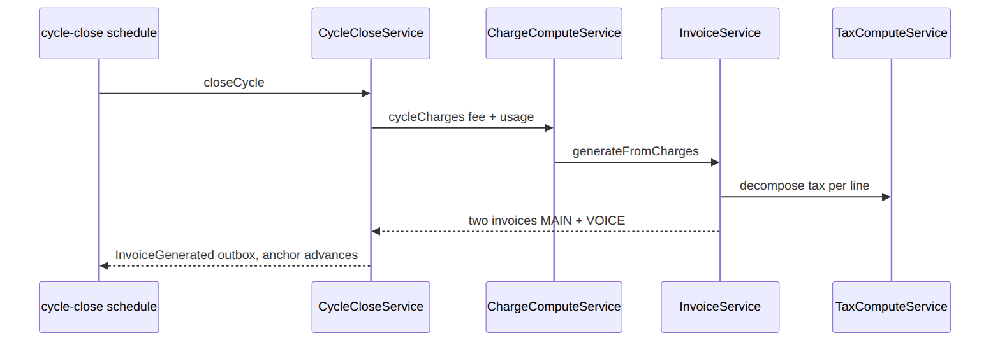
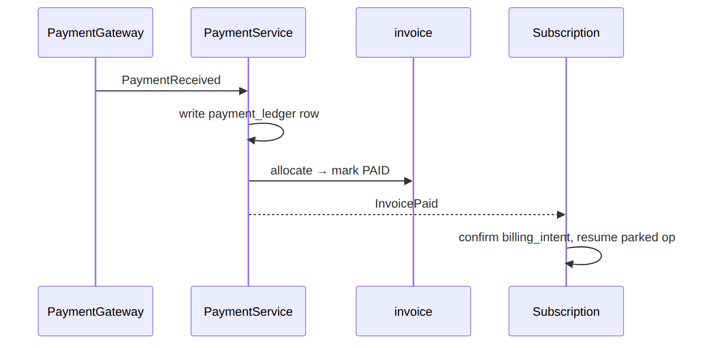
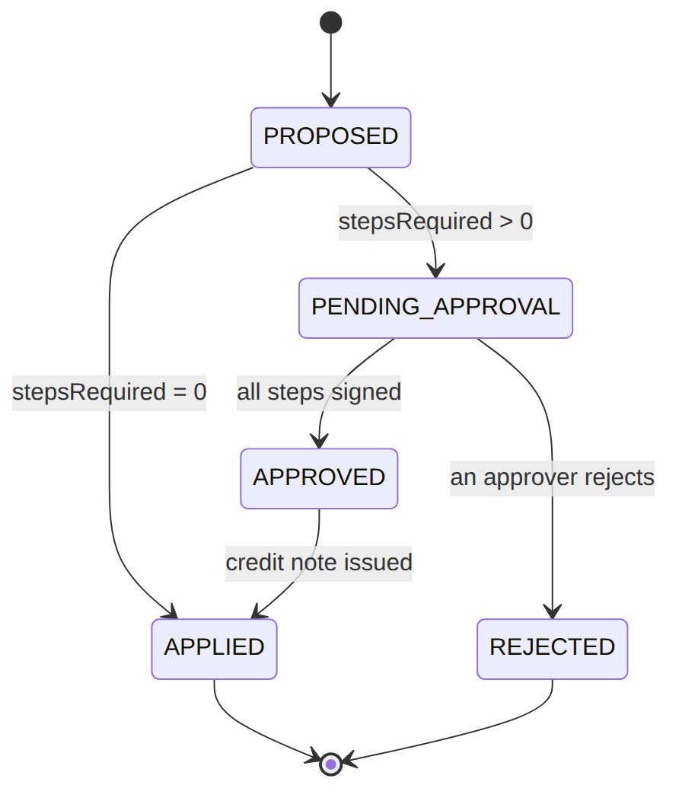
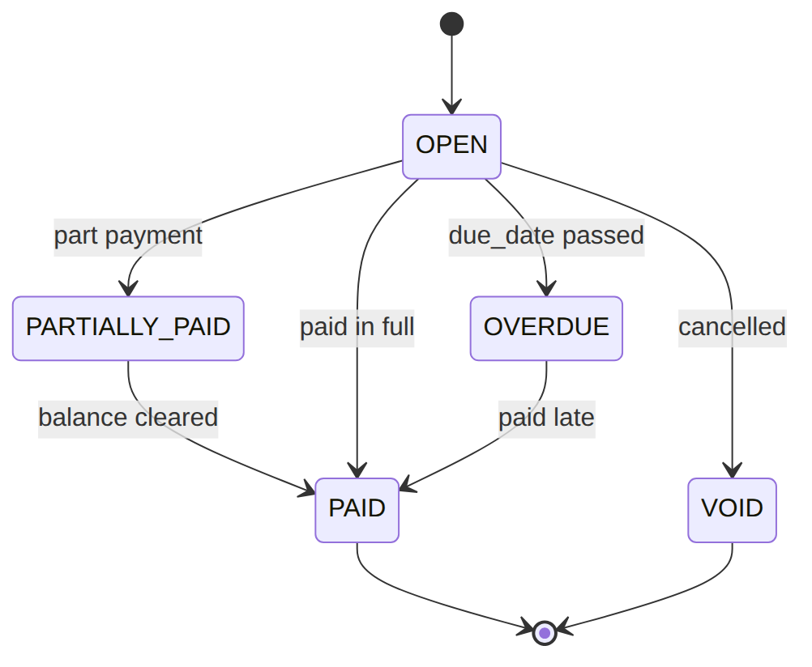
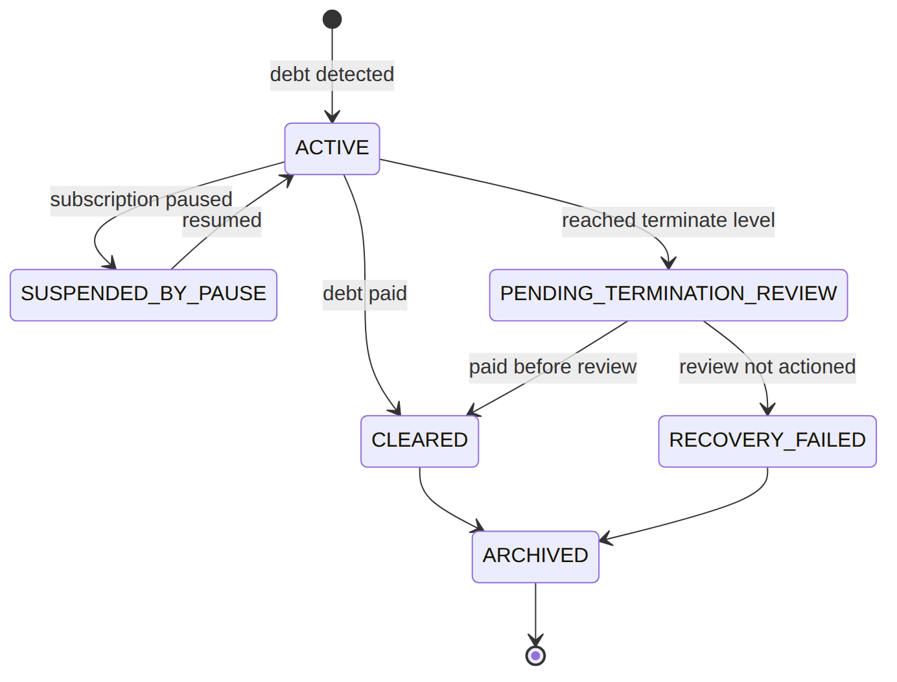
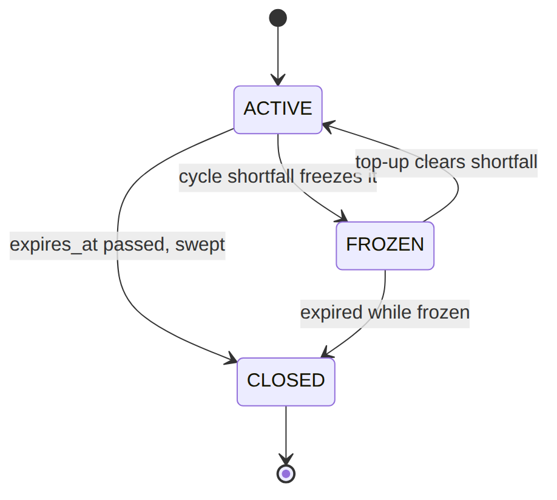

> 📱 **Rendered view** — diagrams below are images so they show in the GitHub app. Editable source (with mermaid): [`../billing.md`](../billing.md).

# Billing — As-Built Design

> **Capability codes:** BIL-01 (charging), BIL-02-GEN-01 (invoice generation), BIL-02-ADJ-01
> (adjustments), BIL-02-TAX-01 (fiscal tax invoices), BIL-03 (cycle close), BIL-04 (dunning),
> BIL-05 (wallets), BIL-CFG-01 (billable-event catalog) · **Module path:** `Modules/Billing`
> **Tests:** `CycleClose`, `CycleBilling`, `Payment`, `Dunning`, `Adjustment`, `ProForma`,
> `BulkReversalAndFailureQueue`, `Tax01`, `Wallet*`, `BillableEventCatalog`, `UsageTariff`, `MediationRating`

## 1. Purpose & boundaries
- **Owns:** all **money state** — invoices & lines, payments & allocations, wallets & transactions,
  dunning, adjustments (credit/debit notes), fiscal tax invoices, account credit balance, the
  billable-event catalog, the generation-failure queue.
- **Does NOT own:** prices/tax/discount **config** (Catalog), the subscription master (Subscription),
  the payment rail (PaymentGateway). It computes + settles; reads config; reacts to events.
- **Job:** compute → invoice → collect → dun → adjust, keeping POSTPAID (invoice) and PREPAID (wallet)
  distinct.

## 📖 Scenarios (service + Foundation involvement)

> **The one big idea:** Billing turns each subscription's monthly *cycle* into money. For a **postpaid**
> sub it raises an **invoice** to be paid later; for a **prepaid** sub it debits a **wallet** now. Money
> never moves silently — every charge, payment, credit, and dunning step is a row you can audit.

### 1. Postpaid triple-play cycle closes → two invoices

**The story in plain English:** A customer on a Triple Play (internet + TV + voice) reaches the end of
their billing month. A scheduled job "closes" the cycle: it adds up the package fee plus any voice
usage, works out the tax, and produces invoices. Because internet/TV and voice are routed to different
wallets, the customer gets **two** invoices — one for internet+TV, one for voice.

**Who does what:**
1. `sophix:billing:cycle-close` (Foundation/Console schedule, every 30 min) → `CycleCloseService::closeCycle`.
2. `ChargeComputeService::cycleCharges` computes the package fee + VOICE usage.
3. `InvoiceService::generateFromCharges` reads `grouping_dimension=WALLET` → writes **two** `invoice` rows, each tax-decomposed via Catalog `TaxComputeService`.
4. Emits `InvoiceGenerated` (via the **outbox**); the cycle anchor advances; the voice `rated_event` rows are stamped `billed=true` and linked to the voice invoice.

**Sample — one close, two invoices:**

| Invoice | grouping_key | contents | subtotal | tax | total |
|---------|--------------|----------|---------:|----:|------:|
| inv_1 | `MAIN` | Internet 100M + IPTV Premium | 4310.34 | 689.66 | 5000.00 |
| inv_2 | `VOICE` | 150 min voice usage | 1293.10 | 206.90 | 1500.00 |




*Proven by `CycleCloseTest`.*

### 2. Prepaid cycle, wallet short → freeze + enter dunning

**The story in plain English:** A prepaid customer's wallet doesn't have enough for this month. The
system tries to take the money from the wallet, can't, so it **does not advance** the billing cycle
(it freezes) and starts the dunning (debt-chasing) process at level 1.

**Who does what:**
1. Same close, PREPAID: `WalletService::settleFromWallets` finds the balance short.
2. `closeCycle` does **not** advance the anchor; emits `CyclePaymentMissed`.
3. `DunningEventBridge` (a listener on `OutboxEventPublished`) → `DunningService` enters the account at level 1, emitting `SubscriptionEnteredDunning`.

*Foundation: outbox → listener.* *Proven by `CycleCloseTest`, `DunningTest`.*

### 3. M-Pesa payment lands → allocate → confirm intent

**The story in plain English:** A customer pays via M-Pesa. The payment arrives as an event. Billing
records it, applies it to the open invoices, and marks them paid. If that payment was the thing a parked
subscription job was waiting for (e.g. a pay-first activation), confirming it wakes that job back up.

**Who does what:**
1. PaymentGateway emits `PaymentReceived` → `PaymentService` writes a `payment_ledger` row.
2. It allocates to open invoices (`payment_invoice_allocation`), marks the invoice `PAID`, emits `InvoicePaid`.
3. Subscription's `ConfirmBillingIntentOnPayment` confirms a pay-first `billing_intent` and **correlates a workflow message** (Foundation/Workflow) to resume the parked operation.




*Proven by `PaymentApplicationTest`.*

### 4. Overpayment → account credit → auto-draw next invoice

**The story in plain English:** A customer pays more than they owe. The extra isn't lost — it's parked
as an account credit balance, and the next invoice automatically draws it down.

**Who does what:** A payment exceeds the invoice → `PaymentService` posts the surplus to
`account_credit_balance` (emits `OverpaymentPendingReview`/`CreditBalanceAdjusted`). The next
`InvoiceGenerated` → `ApplyCreditBalanceOnInvoice` (listener) auto-draws the credit.
*Foundation: event-driven credit application.*

### 5. Paid reconnection fee flips the subscription ACTIVE (state_callback)

**The story in plain English:** A suspended customer pays a reconnection fee to get back online. The fee
charge carries a built-in instruction: "once this is paid, switch the subscription back to ACTIVE." When
the payment lands, Billing reads that instruction and flips the subscription on.

**Who does what:** A `RECONNECTION_FEE_AFTER_DUNNING` `billable_event` has `state_callback{targetStatus:ACTIVE}`.
`BillingIntentService::emit` raises it pay-first (`billing_intent.status=PENDING`); on `InvoicePaid`,
`confirm()` reads the pinned callback → `SubscriptionService::transitionStatus(ACTIVE)`.
*Proven by `BillableEventCatalogTest::test_paid_state_callback_transitions_the_subscription`.*

### 6. Credit-note adjustment → propose → approve → apply

**The story in plain English:** An agent wants to credit a customer (say, for an outage). They *propose*
the credit with a reason. Depending on the amount, the system may require one or more approvers to sign
off (and the proposer can't approve their own). Once enough people sign, Billing issues a credit note
and applies it.

**Who does what:**
1. `AdjustmentService::propose` (reason mandatory) asks `rules.billing.adjustment-approval` (Foundation/Rules) how many `stepsRequired`.
2. If >0 ⇒ `adjustment_request.status=PENDING_APPROVAL`.
3. Approvers sign steps (separation of duties); when the count is met → `approveAndApply` issues a `CREDIT_NOTE` invoice (GEN-01) and applies it (CN-01).




*Proven by `AdjustmentTest`.*

### 7. Dunning escalates faster on an NPD flag, then suspends

**The story in plain English:** A customer in debt also has a "non-performing debtor" flag from ILM.
Normally dunning waits a grace period between escalation levels; with this flag, the wait is **waived**
and the customer is escalated immediately. The new level can add a restriction or suspend the service.

**Who does what:** `sophix:billing:dunning-run` → `DunningService::assessAccount`: an ILM
`affects_dunning` flag (`AccountService::hasDunningAccelerantFlag`) **waives the grace window** → advance
a level now; the level action fires `RESTRICTION_ADD`/`SUSPEND_NP` via Subscription `OperationFramework`.
*Cross-module read + workflow.* *Proven by `DunningTest`.*

### 8. Cycle generation fails → retry queue → give up

**The story in plain English:** Closing a cycle can fail (e.g. the tax service is down). Instead of
losing the work, the failure goes into a retry queue with a backoff. A scheduled job retries it; if it
keeps failing, it's marked "gave up" so a human can look.

**Who does what:** `closeCycle` throws (snapshot/tax/BIL01 unavailable) → `GenerationFailureService::enqueue`
writes a `generation_failure_queue` row (`PENDING_RETRY`, backoff). `sophix:billing:generation-retry`
(every 15 min) re-invokes the generator; persistent failure → `GAVE_UP_AUTO` for human review.
*Proven by `BulkReversalAndFailureQueueTest`.*

### (bonus) 9. Tax invoice signed asynchronously

**The story in plain English:** When a payment moment happens, a fiscal **tax invoice** is produced and
must be digitally signed by the tax authority's system. Signing happens asynchronously: a scanner job
calls the signer; if it fails it backs off and retries, eventually giving up.

**Who does what:** A payment moment → `TaxEventBridge` → `TaxInvoiceGenerator` issues a `tax_invoice`
(inclusive decomposition), then `sophix:billing:tax-sign-scan` calls the signer; failure →
`tax-retry-scan` backoff → `TaxInvoiceSigningGaveUp`. *Proven by `Tax01Test`.*

## 2. Data model — ≥4 **complete** sample rows + readings
> **Completeness:** each row lists **every domain column** (nullables shown as `null`). The surrogate
> primary key shown is the real one (a string business key, e.g. `invoice_id`); `created_at`/`updated_at`
> are omitted by convention. Several tables grew via ALTER migrations — the new columns are flagged in
> each table's note.

### `invoice` · `type`: `STANDARD|TAX|CREDIT_NOTE|DEBIT_NOTE` · `status`: `OPEN|PARTIALLY_PAID|PAID|VOID|OVERDUE`
> `grouping_dimension`/`grouping_key_values` added by the structured-lines migration; `customer_snapshot`
> by the snapshot migration. (`status` has exactly the five enum values above — a fully-applied note sits
> `PAID` with `amount_due=0`.)
```json
{ "invoice_id":"inv_1","legal_invoice_number":"INV-WIK-2026-000123","account_id":"acc_1","customer_snapshot":{"name":"Jane Mwangi","taxId":"A012345678Z"},"customer_id":"cust_1","subscription_id":"sub_123","operator_code":"WIK","type":"STANDARD","grouping_dimension":"WALLET","grouping_key_values":"MAIN","currency":"KES","billing_mode":"POSTPAID","status":"OPEN","original_invoice_id":null,"issue_date":"2026-06-30T00:00:00Z","due_date":"2026-07-15T00:00:00Z","subtotal_amount":4310.34,"tax_amount_total":689.66,"tax_summary":{"VAT16":689.66},"total_amount":5000.00,"amount_paid":0.00,"amount_due":5000.00 }
{ "invoice_id":"inv_2","legal_invoice_number":"INV-WIK-2026-000124","account_id":"acc_1","customer_snapshot":{"name":"Jane Mwangi","taxId":"A012345678Z"},"customer_id":"cust_1","subscription_id":"sub_123","operator_code":"WIK","type":"STANDARD","grouping_dimension":"WALLET","grouping_key_values":"VOICE","currency":"KES","billing_mode":"POSTPAID","status":"PAID","original_invoice_id":null,"issue_date":"2026-06-30T00:00:00Z","due_date":"2026-07-15T00:00:00Z","subtotal_amount":1293.10,"tax_amount_total":206.90,"tax_summary":{"VAT16":206.90},"total_amount":1500.00,"amount_paid":1500.00,"amount_due":0.00 }
{ "invoice_id":"inv_3","legal_invoice_number":"CN-WIK-2026-000007","account_id":"acc_1","customer_snapshot":{"name":"Jane Mwangi","taxId":"A012345678Z"},"customer_id":"cust_1","subscription_id":"sub_123","operator_code":"WIK","type":"CREDIT_NOTE","grouping_dimension":"SINGLE","grouping_key_values":null,"currency":"KES","billing_mode":"POSTPAID","status":"PAID","original_invoice_id":"inv_1","issue_date":"2026-07-01T00:00:00Z","due_date":null,"subtotal_amount":800.00,"tax_amount_total":0.00,"tax_summary":null,"total_amount":800.00,"amount_paid":0.00,"amount_due":0.00 }
{ "invoice_id":"inv_4","legal_invoice_number":"TAX-WIK-2026-000045","account_id":"acc_2","customer_snapshot":{"name":"Acme Ltd","taxId":"P051234567X"},"customer_id":"cust_3","subscription_id":"sub_9","operator_code":"WIK","type":"TAX","grouping_dimension":"SINGLE","grouping_key_values":null,"currency":"KES","billing_mode":"POSTPAID","status":"PAID","original_invoice_id":"inv_2","issue_date":"2026-06-30T00:00:00Z","due_date":null,"subtotal_amount":4310.34,"tax_amount_total":689.66,"tax_summary":{"VAT16":689.66},"total_amount":5000.00,"amount_paid":5000.00,"amount_due":0.00 }
```
**Read each row as a sentence — *this data means this:***

| Row | What it means in plain English |
|-----|--------------------------------|
| **inv_1** | A KES 5000 internet bill that's **still owed** (`status=OPEN`, `amount_due=5000`, due 15 Jul → becomes dunnable once past due). |
| **inv_2** | A KES 1500 voice bill, **fully paid** (`status=PAID`, `amount_due=0`). It's a separate document from inv_1 because `grouping_dimension=WALLET` split internet from voice. |
| **inv_3** | A **credit note** against inv_1 (`type=CREDIT_NOTE`, `original_invoice_id=inv_1`) — so inv_1 can't be bulk-reversed; the note carries `tax_amount_total=0` (inclusive treatment, §10). |
| **inv_4** | A **TAX invoice** (`type=TAX`) — immutable, never adjusted (you adjust the commercial invoice instead). |

**The columns that did the work:**
- **Owed vs settled** = `status` + `amount_due`.
- **Note vs original** = `type` + `original_invoice_id` (a note links back; the original is locked).
- **Why two documents** = `grouping_dimension`/`grouping_key_values` (WALLET put internet and voice on separate invoices).
- **Frozen bill-to identity** = `customer_snapshot`.

**Status lifecycle.** An invoice starts `OPEN`, takes payments, and lands `PAID` when fully settled (a
fully-applied credit note also rests `PAID` with `amount_due=0`):





**Worked example — how inv_1's totals are built** (the figures are inclusive of 16% VAT, so the
displayed `total_amount` already contains the tax; Billing decomposes it back into subtotal + tax):

| Line | gross (total) | subtotal = gross ÷ 1.16 | tax = gross − subtotal |
|------|--------------:|------------------------:|-----------------------:|
| Internet 100M | 3480.00 | 3000.00 | 480.00 |
| IPTV Premium | 1392.00 | 1200.00 | 192.00 |
| **inv_1 totals** | **5000.00** | rounds to **4310.34** | **689.66** |

(The line subtotals shown in `invoice_line` — 3000.00 / 1200.00 — are the catalog ex-tax prices; the
invoice header sums to `subtotal_amount=4310.34`, `tax_amount_total=689.66`, `total_amount=5000.00`.)

### `invoice_line` · `line_type`: `SUMMARY|DETAIL`
> All of `line_type`/`parent_summary_line_id`/`service_category_code`/`package_ref`/`wallet_type_code`/
> `tax_breakdown`/`sort_order` were added by the structured-lines migration.
```json
{ "id":"il_1","invoice_id":"inv_1","line_type":"SUMMARY","parent_summary_line_id":null,"service_category_code":"SUBSCRIPTION","package_ref":"pkg_triple","wallet_type_code":null,"description":"Triple Play monthly","service_ref":null,"quantity":1.00,"unit_price":4200.00,"subtotal":4200.00,"tax_amount":672.00,"tax_breakdown":{"VAT16":672.00},"sort_order":0 }
{ "id":"il_2","invoice_id":"inv_1","line_type":"DETAIL","parent_summary_line_id":"il_1","service_category_code":"INTERNET","package_ref":"pkg_triple","wallet_type_code":null,"description":"Internet 100M","service_ref":"svc_inet","quantity":1.00,"unit_price":3000.00,"subtotal":3000.00,"tax_amount":480.00,"tax_breakdown":{"VAT16":480.00},"sort_order":1 }
{ "id":"il_3","invoice_id":"inv_1","line_type":"DETAIL","parent_summary_line_id":"il_1","service_category_code":"TV","package_ref":"pkg_triple","wallet_type_code":null,"description":"IPTV Premium","service_ref":"svc_tv","quantity":1.00,"unit_price":1200.00,"subtotal":1200.00,"tax_amount":192.00,"tax_breakdown":{"VAT16":192.00},"sort_order":2 }
{ "id":"il_4","invoice_id":"inv_2","line_type":"DETAIL","parent_summary_line_id":null,"service_category_code":"VOICE","package_ref":null,"wallet_type_code":"VOICE_WALLET","description":"Voice usage","service_ref":"svc_voice","quantity":150.00,"unit_price":2.00,"subtotal":300.00,"tax_amount":48.00,"tax_breakdown":{"EXC20":50.00,"VAT16":48.00},"sort_order":1 }
```
**Read each row as a sentence — *this data means this:***

| Row | What it means in plain English |
|-----|--------------------------------|
| **il_1** | The customer-facing **summary** line on inv_1: "Triple Play monthly" priced as the whole package (`line_type=SUMMARY`, `parent_summary_line_id=null`). |
| **il_2** | A **detail** line under il_1 (`line_type=DETAIL`, `parent_summary_line_id=il_1`): the Internet 100M component, KES 3000 ex-tax. |
| **il_3** | The other detail line under il_1: the IPTV Premium component, KES 1200 ex-tax. |
| **il_4** | Voice usage on a **different** invoice (inv_2): 150 min × KES 2, routed to `VOICE_WALLET` (`wallet_type_code`) — WALLET grouping put voice on its own document. |

**The columns that did the work:**
- **Summary vs detail** = `line_type` + `parent_summary_line_id` (details hang off their summary).
- **Which invoice / wallet** = `invoice_id` + `wallet_type_code`.
- **Per-line tax components** = `tax_breakdown`; **presentation order** = `sort_order`.

### `payment_ledger` · `method`: `MPESA|VISA|BANK_TRANSFER|OFFLINE` · `status`: `RECEIVED|APPLIED|PARTIALLY_APPLIED|REVERSED`
> `customer_id`/`payment_reference`/`reversal_of_payment_id`/`reversal_reason_code`/`reversed_by` added
> by the payment-application alignment migration (which also adds the `(account_id, payment_reference)`
> dedup unique).
```json
{ "payment_id":"pay_1","account_id":"acc_1","customer_id":"cust_1","operator_code":"WIK","method":"MPESA","gateway_ref":"MPESA-QGR7Xk","payment_reference":"QGR7Xk","currency":"KES","paid_amount":5000.00,"unallocated_amount":0.00,"status":"APPLIED","reversal_of_payment_id":null,"reversal_reason_code":null,"reversed_by":null,"received_at":"2026-07-02T10:00:00Z" }
{ "payment_id":"pay_2","account_id":"acc_1","customer_id":"cust_1","operator_code":"WIK","method":"MPESA","gateway_ref":"MPESA-QGR8Zz","payment_reference":"QGR8Zz","currency":"KES","paid_amount":6000.00,"unallocated_amount":1000.00,"status":"PARTIALLY_APPLIED","reversal_of_payment_id":null,"reversal_reason_code":null,"reversed_by":null,"received_at":"2026-07-03T10:00:00Z" }
{ "payment_id":"pay_3","account_id":"acc_2","customer_id":"cust_3","operator_code":"WIK","method":"OFFLINE","gateway_ref":null,"payment_reference":"cash-rcpt-9","currency":"KES","paid_amount":1500.00,"unallocated_amount":0.00,"status":"APPLIED","reversal_of_payment_id":null,"reversal_reason_code":null,"reversed_by":null,"received_at":"2026-07-04T09:00:00Z" }
{ "payment_id":"pay_4","account_id":"acc_1","customer_id":"cust_1","operator_code":"WIK","method":"VISA","gateway_ref":"VISA-9931","payment_reference":"VISA-9931","currency":"KES","paid_amount":5000.00,"unallocated_amount":0.00,"status":"REVERSED","reversal_of_payment_id":"pay_1","reversal_reason_code":"CHARGEBACK","reversed_by":"u_fin1","received_at":"2026-07-05T11:00:00Z" }
```
**Read each row as a sentence — *this data means this:***

| Row | What it means in plain English |
|-----|--------------------------------|
| **pay_1** | A KES 5000 M-Pesa payment **fully applied** (`status=APPLIED`, `unallocated_amount=0`), deduped by `payment_reference=QGR7Xk`. |
| **pay_2** | A KES 6000 M-Pesa payment that **overpaid** — KES 1000 left over (`unallocated_amount=1000`, `status=PARTIALLY_APPLIED`) posts to `account_credit_balance`. |
| **pay_3** | A KES 1500 **cash** payment (`method=OFFLINE`, no gateway ref; the receipt number is the `payment_reference`). |
| **pay_4** | A VISA payment that was **reversed** as a chargeback (`status=REVERSED`, `reversal_of_payment_id=pay_1`, `reversed_by=u_fin1` for the audit trail). |

**The columns that did the work:**
- **No double-apply** = `payment_reference` (gateway ref or Idempotency-Key) — a retried callback dedups.
- **Overpayment** = `unallocated_amount` (surplus → `account_credit_balance`).
- **Reversal trail** = `reversal_of_payment_id` + `reversal_reason_code` + `reversed_by` (separation-of-duties).

### `billing_intent` · `intent_type`: `PRORATION|PAUSE_FEE|RECONNECTION_FEE|DEPOSIT_REFUND|…` · `status`: `PENDING|CHARGED|CONFIRMED|WAIVED|REFUNDED` · `settlement_channel`: `INVOICE|WALLET|CREDIT|NONE`
> `settlement_channel` added by the settlement-channel migration; `state_callback` (JSON) by the
> state-callback migration. (`intent_type` is **not** an enforced enum — it is a free-form code resolved
> against the `billable_event` catalog; the four values above are illustrative.)
```json
{ "intent_id":"bint_1","operator_code":"WIK","subscription_id":"sub_1","account_id":"acc_1","operation_id":"op_up_1","intent_type":"PRORATION","amount":350.00,"currency":"KES","pay_first":false,"status":"CONFIRMED","settlement_channel":"INVOICE","state_callback":null,"invoice_id":"inv_7","confirmed_at":"2026-06-15T12:00:00Z" }
{ "intent_id":"bint_2","operator_code":"WIK","subscription_id":"sub_1","account_id":"acc_1","operation_id":"op_recon_1","intent_type":"RECONNECTION_FEE","amount":500.00,"currency":"KES","pay_first":true,"status":"PENDING","settlement_channel":"INVOICE","state_callback":{"transitionCode":"RECONNECT_AFTER_FEE","targetStatus":"ACTIVE"},"invoice_id":"inv_9","confirmed_at":null }
{ "intent_id":"bint_3","operator_code":"WIK","subscription_id":"sub_2","account_id":"acc_2","operation_id":"op_term_3","intent_type":"DEPOSIT_REFUND","amount":-2500.00,"currency":"KES","pay_first":false,"status":"CONFIRMED","settlement_channel":"CREDIT","state_callback":null,"invoice_id":null,"confirmed_at":"2026-06-18T09:00:00Z" }
{ "intent_id":"bint_4","operator_code":"WIK","subscription_id":"sub_3","account_id":"acc_3","operation_id":"op_pause_4","intent_type":"PAUSE_FEE","amount":0.00,"currency":"KES","pay_first":false,"status":"CONFIRMED","settlement_channel":"NONE","state_callback":null,"invoice_id":null,"confirmed_at":"2026-06-19T09:00:00Z" }
```
**Read each row as a sentence — *this data means this:***

| Row | What it means in plain English |
|-----|--------------------------------|
| **bint_1** | A mid-cycle proration charge of KES 350, already settled on invoice inv_7 (`status=CONFIRMED`, `settlement_channel=INVOICE`). |
| **bint_2** | A **pay-first** reconnection fee: it stays `PENDING` until inv_9 is paid (`pay_first=true`), then its `state_callback` flips the sub ACTIVE. |
| **bint_3** | A **negative** amount (KES -2500 deposit refund) posted as account credit (`settlement_channel=CREDIT`, no invoice). |
| **bint_4** | A zero pause fee — the event fired but there was **nothing to charge** (`amount=0`, `settlement_channel=NONE`). |

**The columns that did the work:**
- **Charge now vs wait for payment** = `pay_first` (pay-first stays `PENDING`; `state_callback` carries the resulting sub transition).
- **Where it settles** = `settlement_channel` (INVOICE / WALLET / CREDIT / NONE); a negative `amount` is a credit.
- **What raised it** = `operation_id` (the Subscription operation behind every intent).

**Worked example — bint_1's PRORATION amount.** When a customer upgrades mid-cycle, the charge is only
for the *remaining* days at the price *difference*. Suppose a 30-day cycle, upgraded with 21 days left,
from a 2500.00/mo plan to a 3000.00/mo plan:

| Input | value |
|-------|------:|
| cycle length | 30 days |
| days remaining | 21 days |
| monthly price difference | 3000.00 − 2500.00 = 500.00 |
| proration = diff × (remaining ÷ cycle) | 500.00 × (21 ÷ 30) = **350.00** |

→ `bint_1.amount = 350.00`, settled on the next invoice (`settlement_channel=INVOICE`).

### `billable_event` · `amount_sign_policy`: `POSITIVE_ONLY|NEGATIVE_ONLY|SIGNED` · `trigger_type`: `SAGA_INTENT|LIFECYCLE_EVENT|ADMIN_ACTION|CUSTOMER_PURCHASE|EXTERNAL_PAYMENT|SCHEDULED` · `applicability`: `PREPAID_ONLY|POSTPAID_ONLY|ANY` · `status`: `DRAFT|ACTIVE|RETIRED`
```json
{ "id":"bev_1","operator_code":"WIK","code":"RECONNECTION_FEE_AFTER_DUNNING","description":"Reconnection fee after dunning","category_code":"FEE","service_refs":["svc_inet"],"currency":"KES","applicability":"ANY","amount_sign_policy":"POSITIVE_ONLY","pay_first_required":true,"trigger_type":"EXTERNAL_PAYMENT","trigger_intent_code":null,"trigger_event_type":null,"trigger_filter_drl":null,"trigger_schedule":null,"state_callback":{"transitionCode":"RECONNECT_AFTER_FEE","targetStatus":"ACTIVE"},"eligibility_franchise_refs":null,"eligibility_package_refs":null,"eligibility_segment_refs":null,"display_order":100,"status":"ACTIVE","notes":null,"created_by":"u_admin","updated_by":"u_admin","retired_at":null }
{ "id":"bev_2","operator_code":"WIK","code":"INSTALLATION_FEE","description":"One-off installation fee","category_code":"FEE","service_refs":["svc_inet"],"currency":"KES","applicability":"ANY","amount_sign_policy":"POSITIVE_ONLY","pay_first_required":true,"trigger_type":"SAGA_INTENT","trigger_intent_code":"INSTALL_FEE_INTENT","trigger_event_type":null,"trigger_filter_drl":null,"trigger_schedule":null,"state_callback":null,"eligibility_franchise_refs":["fr_nrb"],"eligibility_package_refs":null,"eligibility_segment_refs":null,"display_order":100,"status":"ACTIVE","notes":null,"created_by":"u_admin","updated_by":null,"retired_at":null }
{ "id":"bev_3","operator_code":"WIK","code":"DEPOSIT_REFUND","description":"Refund of installation deposit","category_code":"REFUND","service_refs":null,"currency":"KES","applicability":"ANY","amount_sign_policy":"NEGATIVE_ONLY","pay_first_required":false,"trigger_type":"LIFECYCLE_EVENT","trigger_intent_code":null,"trigger_event_type":"SubscriptionTerminated","trigger_filter_drl":null,"trigger_schedule":null,"state_callback":null,"eligibility_franchise_refs":null,"eligibility_package_refs":null,"eligibility_segment_refs":null,"display_order":100,"status":"ACTIVE","notes":null,"created_by":"u_admin","updated_by":null,"retired_at":null }
{ "id":"bev_4","operator_code":"WIK","code":"GOODWILL_CREDIT","description":"Discretionary goodwill credit","category_code":"CREDIT","service_refs":null,"currency":"KES","applicability":"POSTPAID_ONLY","amount_sign_policy":"NEGATIVE_ONLY","pay_first_required":false,"trigger_type":"ADMIN_ACTION","trigger_intent_code":null,"trigger_event_type":null,"trigger_filter_drl":null,"trigger_schedule":null,"state_callback":null,"eligibility_franchise_refs":null,"eligibility_package_refs":null,"eligibility_segment_refs":null,"display_order":200,"status":"DRAFT","notes":"awaiting finance sign-off","created_by":"u_admin","updated_by":null,"retired_at":null }
```
**Read each row as a sentence — *this data means this:***

| Row | What it means in plain English |
|-----|--------------------------------|
| **bev_1** | A reconnection fee: **pay-first** (`pay_first_required=true`), fired by an `EXTERNAL_PAYMENT`, with a `state_callback` that reconnects the sub to ACTIVE. Live (`status=ACTIVE`). |
| **bev_2** | An installation fee fired by a `SAGA_INTENT` (`trigger_intent_code=INSTALL_FEE_INTENT`) and limited to one franchise (`eligibility_franchise_refs=[fr_nrb]`). |
| **bev_3** | A deposit refund — **negative only** (`amount_sign_policy=NEGATIVE_ONLY`, a positive amount is rejected), fired by a lifecycle event (`trigger_event_type=SubscriptionTerminated`). |
| **bev_4** | A goodwill credit that's **not chargeable yet** (`status=DRAFT`) and only for postpaid (`applicability=POSTPAID_ONLY`). |

**The columns that did the work:**
- **Chargeable or not** = `status` (only `ACTIVE`; an intent that doesn't resolve to an ACTIVE event is rejected) + `applicability` (prepaid/postpaid/any).
- **What fires it** = `trigger_type` (+ `trigger_intent_code`/`trigger_event_type`).
- **Sign + pay-first** = `amount_sign_policy` + `pay_first_required` (+ `state_callback` for the resulting sub transition).
- **Who's eligible** = `eligibility_*`; `currency` is derived from `service_refs` and immutable.

### `dunning_program` (`billing_mode`: `POSTPAID|PREPAID|PREPAYMENT`) — versioned catalog
> PK is the ULID `id`; uniqueness is `(code, version)`. `level_definitions` is the ordered escalation
> JSON (no default — always present).
```json
{ "id":"dprg_1","code":"wik_postpaid_standard","version":1,"description":"WIK postpaid standard dunning","operator_code":"WIK","billing_mode":"POSTPAID","level_definitions":[{"level":1,"name":"WARNING","grace_period_days":7,"action_workflow_intent":"WARNING_ONLY"},{"level":2,"name":"RESTRICTED","grace_period_days":7,"action_workflow_intent":"RESTRICTION_ADD"},{"level":3,"name":"SUSPENDED","grace_period_days":14,"action_workflow_intent":"SUSPEND_NP"},{"level":4,"name":"TERMINATED","action_workflow_intent":"TERMINATION"}],"pre_termination_review_required":true,"published_at":"2026-01-01T00:00:00Z","retired_at":null,"created_by":"u_admin" }
{ "id":"dprg_2","code":"wik_prepaid_standard","version":1,"description":"WIK prepaid standard dunning","operator_code":"WIK","billing_mode":"PREPAID","level_definitions":[{"level":1,"name":"WARNING","grace_period_days":0,"action_workflow_intent":"WARNING_ONLY"},{"level":2,"name":"SUSPENDED","grace_period_days":3,"action_workflow_intent":"SUSPEND_NP"}],"pre_termination_review_required":false,"published_at":"2026-01-01T00:00:00Z","retired_at":null,"created_by":"u_admin" }
{ "id":"dprg_3","code":"wik_postpaid_standard","version":2,"description":"WIK postpaid standard dunning v2","operator_code":"WIK","billing_mode":"POSTPAID","level_definitions":[{"level":1,"name":"WARNING","grace_period_days":5,"action_workflow_intent":"WARNING_ONLY"},{"level":2,"name":"SUSPENDED","grace_period_days":10,"action_workflow_intent":"SUSPEND_NP"},{"level":3,"name":"TERMINATED","action_workflow_intent":"TERMINATION"}],"pre_termination_review_required":true,"published_at":"2026-06-01T00:00:00Z","retired_at":null,"created_by":"u_admin" }
{ "id":"dprg_old","code":"wik_legacy","version":1,"description":"Retired legacy program","operator_code":"WIK","billing_mode":"POSTPAID","level_definitions":[{"level":1,"name":"WARNING","action_workflow_intent":"WARNING_ONLY"}],"pre_termination_review_required":false,"published_at":"2024-01-01T00:00:00Z","retired_at":"2026-01-01T00:00:00Z","created_by":"u_admin" }
```
**Read each row as a sentence — *this data means this:***

| Row | What it means in plain English |
|-----|--------------------------------|
| **dprg_1** | The live **postpaid** ladder (`billing_mode=POSTPAID`, v1): escalate **WARNING (7d grace) → RESTRICTED (7d) → SUSPENDED (14d) → TERMINATED**, and a **human must review before termination** (`pre_termination_review_required=true`). |
| **dprg_2** | The **prepaid** ladder — much harsher: **WARNING (0d) → SUSPENDED (3d)**, no termination review. |
| **dprg_3** | **Version 2** of the same postpaid code (`code=wik_postpaid_standard`, `version=2`) — a tightened ladder (5d/10d, drops the RESTRICTED level); the newest published version wins. |
| **dprg_old** | A **retired** program (`retired_at` set) — no longer assigned to anyone. |

**The columns that did the work:** `level_definitions` is the **ordered escalation ladder** (each level's `name`, `grace_period_days` before it fires, and the `action_workflow_intent` it triggers — restrict/suspend/terminate); `billing_mode` picks which customers it governs; `(code, version)` versions it (a running account pins the version it entered on — see `dunning_state.dunning_program_ref/_version`); `pre_termination_review_required` forces a manual gate before cut-off; `retired_at` retires it.

### `dunning_state` (`status`: `ACTIVE|CLEARED|SUSPENDED_BY_PAUSE|PENDING_TERMINATION_REVIEW|RECOVERY_FAILED|ARCHIVED`, `current_level` int 0..4)
> The dd-alignment migration added `billing_mode`/`triggering_event_type`/`next_evaluation_at`/
> `review_due_at`/`last_workflow_failure_code`; the program-catalog migration added the program pinning
> (`dunning_program_ref`/`_version`), `entered_dunning_at`, `outstanding_debt_currency`,
> `applied_restriction_codes`, `triggering_event_ref`, the workflow-failure backoff trio, and
> `cleared_at`/`archived_at`.
```json
{ "dunning_id":"dun_1","operator_code":"WIK","account_id":"acc_1","subscription_id":"sub_123","billing_mode":"POSTPAID","triggering_event_type":"InvoiceOverdue","current_level":1,"entered_level_at":"2026-07-16T00:00:00Z","entered_dunning_at":"2026-07-16T00:00:00Z","outstanding_debt_amount":5000.00,"outstanding_debt_currency":"KES","status":"ACTIVE","last_scanned_at":"2026-07-16T01:00:00Z","next_evaluation_at":"2026-07-23T00:00:00Z","review_due_at":null,"last_workflow_failure_code":null,"dunning_program_ref":"wik_postpaid_standard","dunning_program_version":1,"applied_restriction_codes":[],"triggering_event_ref":"inv_1","last_workflow_failure_at":null,"workflow_failure_attempts":0,"cleared_at":null,"archived_at":null }
{ "dunning_id":"dun_2","operator_code":"WIK","account_id":"acc_2","subscription_id":"sub_9","billing_mode":"POSTPAID","triggering_event_type":"InvoiceOverdue","current_level":3,"entered_level_at":"2026-07-10T00:00:00Z","entered_dunning_at":"2026-06-20T00:00:00Z","outstanding_debt_amount":12000.00,"outstanding_debt_currency":"KES","status":"ACTIVE","last_scanned_at":"2026-07-16T01:00:00Z","next_evaluation_at":"2026-07-24T00:00:00Z","review_due_at":null,"last_workflow_failure_code":null,"dunning_program_ref":"wik_postpaid_standard","dunning_program_version":1,"applied_restriction_codes":["OUTGOING_VOICE_BARRED"],"triggering_event_ref":"inv_55","last_workflow_failure_at":null,"workflow_failure_attempts":0,"cleared_at":null,"archived_at":null }
{ "dunning_id":"dun_3","operator_code":"WIK","account_id":"acc_3","subscription_id":"sub_5","billing_mode":"PREPAID","triggering_event_type":"CyclePaymentMissed","current_level":0,"entered_level_at":null,"entered_dunning_at":"2026-06-01T00:00:00Z","outstanding_debt_amount":0.00,"outstanding_debt_currency":"KES","status":"CLEARED","last_scanned_at":"2026-07-01T01:00:00Z","next_evaluation_at":null,"review_due_at":null,"last_workflow_failure_code":null,"dunning_program_ref":"wik_prepaid_standard","dunning_program_version":1,"applied_restriction_codes":[],"triggering_event_ref":"cycle_2026_06_sub_5","last_workflow_failure_at":null,"workflow_failure_attempts":0,"cleared_at":"2026-07-01T01:00:00Z","archived_at":null }
{ "dunning_id":"dun_4","operator_code":"WIK","account_id":"acc_4","subscription_id":"sub_7","billing_mode":"POSTPAID","triggering_event_type":"InvoiceOverdue","current_level":4,"entered_level_at":"2026-07-12T00:00:00Z","entered_dunning_at":"2026-06-10T00:00:00Z","outstanding_debt_amount":30000.00,"outstanding_debt_currency":"KES","status":"PENDING_TERMINATION_REVIEW","last_scanned_at":"2026-07-16T01:00:00Z","next_evaluation_at":null,"review_due_at":"2026-07-19T00:00:00Z","last_workflow_failure_code":"FULFILLMENT_TIMEOUT","dunning_program_ref":"wik_postpaid_standard","dunning_program_version":1,"applied_restriction_codes":["OUTGOING_VOICE_BARRED"],"triggering_event_ref":"inv_77","last_workflow_failure_at":"2026-07-15T00:00:00Z","workflow_failure_attempts":2,"cleared_at":null,"archived_at":null }
```
**Read each row as a sentence — *this data means this:***

| Row | What it means in plain English |
|-----|--------------------------------|
| **dun_1** | An account just into dunning at the WARNING step (`current_level=1`, `status=ACTIVE`), owing KES 5000, pinned to program `wik_postpaid_standard` v1. |
| **dun_2** | Escalated to SUSPENDED (`current_level=3`) with a restriction applied (`applied_restriction_codes=[OUTGOING_VOICE_BARRED]`), owing KES 12000. |
| **dun_3** | A prepaid account that **paid up and recovered** (`status=CLEARED`, `current_level=0`, `cleared_at` set, debt 0). |
| **dun_4** | Reached the terminate level (`current_level=4`) but is **parked for mandatory review** (`status=PENDING_TERMINATION_REVIEW`, `review_due_at` set) and backing off after a workflow failure (`workflow_failure_attempts=2`). |

**The columns that did the work:**
- **Where in the ladder** = `current_level` + `status`; cleared/recovered shows in `cleared_at`/`status`.
- **Pinned policy** = `dunning_program_ref`+`dunning_program_version` (R-BIL-04-C-1) — publishing a new program version (e.g. dprg_3) never disturbs in-flight episodes.
- **Restrictions applied** = `applied_restriction_codes`; **review hold** = `review_due_at`.
- **Scan cadence + backoff** = `next_evaluation_at` + `workflow_failure_attempts`.

**Status lifecycle (`dunning_state`):**





**Worked escalation — program `wik_postpaid_standard` v1** (dun_1's pinned program). Each level waits
its `grace_period_days` before the next pass advances; an ILM `affects_dunning` flag waives that wait
(Scenario 7), collapsing the timeline:

| Level | name | grace_period_days | action_workflow_intent |
|------:|------|------------------:|------------------------|
| 1 | WARNING | 7 | `WARNING_ONLY` |
| 2 | RESTRICTED | 7 | `RESTRICTION_ADD` |
| 3 | SUSPENDED | 14 | `SUSPEND_NP` |
| 4 | TERMINATED | — | `TERMINATION` |

So a normal postpaid debtor is warned on day 0, restricted ~day 7, suspended ~day 14, and reaches the
termination *review* ~day 28; with an NPD flag the grace is waived and each pass advances immediately.

### `adjustment_request` · `direction`: `CREDIT|DEBIT` · `scope`: `FULL|LINE|AMOUNT` · `status`: `PROPOSED|PENDING_APPROVAL|APPROVED|APPLIED|REJECTED|APPLICATION_FAILED|CANCELLED_BY_PROPOSER`
> `required_approvals`/`approval_rule_id` added by the required-approvals migration.
```json
{ "adjustment_id":"adj_1","operator_code":"WIK","customer_id":"cust_1","account_id":"acc_1","subscription_id":"sub_123","parent_invoice_id":"inv_1","target_wallet_ref":null,"billing_mode":"POSTPAID","direction":"CREDIT","scope":"FULL","line_ref":null,"service_category_code":null,"amount":5000.00,"currency":"KES","reason_code":"SLA_COMPENSATION","justification":"3-day outage credit","status":"APPLIED","required_approvals":1,"approval_rule_id":"rule_adj_std","proposed_by":"u_csr1","note_invoice_id":"inv_3","limit_overridden":false,"failure_reason":null,"applied_at":"2026-07-01T00:00:00Z" }
{ "adjustment_id":"adj_2","operator_code":"WIK","customer_id":"cust_1","account_id":"acc_1","subscription_id":"sub_123","parent_invoice_id":"inv_2","target_wallet_ref":null,"billing_mode":"POSTPAID","direction":"DEBIT","scope":"LINE","line_ref":"il_4","service_category_code":null,"amount":300.00,"currency":"KES","reason_code":"BILLING_ERROR","justification":"under-billed voice","status":"PENDING_APPROVAL","required_approvals":2,"approval_rule_id":"rule_adj_debit","proposed_by":"u_csr2","note_invoice_id":null,"limit_overridden":false,"failure_reason":null,"applied_at":null }
{ "adjustment_id":"adj_3","operator_code":"WIK","customer_id":"cust_2","account_id":"acc_5","subscription_id":null,"parent_invoice_id":null,"target_wallet_ref":null,"billing_mode":"POSTPAID","direction":"CREDIT","scope":"AMOUNT","line_ref":null,"service_category_code":"GOODWILL","amount":1000.00,"currency":"KES","reason_code":"GOODWILL","justification":"retention gesture","status":"PROPOSED","required_approvals":1,"approval_rule_id":"rule_adj_std","proposed_by":"u_csr1","note_invoice_id":null,"limit_overridden":false,"failure_reason":null,"applied_at":null }
{ "adjustment_id":"adj_4","operator_code":"WIK","customer_id":"cust_1","account_id":"acc_1","subscription_id":"sub_123","parent_invoice_id":"inv_2","target_wallet_ref":null,"billing_mode":"POSTPAID","direction":"CREDIT","scope":"FULL","line_ref":null,"service_category_code":null,"amount":1500.00,"currency":"KES","reason_code":"DISPUTE","justification":"customer dispute rejected","status":"REJECTED","required_approvals":2,"approval_rule_id":"rule_adj_high","proposed_by":"u_csr2","note_invoice_id":null,"limit_overridden":false,"failure_reason":null,"applied_at":null }
```
**Read each row as a sentence — *this data means this:***

| Row | What it means in plain English |
|-----|--------------------------------|
| **adj_1** | A KES 5000 credit for an outage, **applied** (`status=APPLIED`) — a credit note inv_3 was issued (`note_invoice_id=inv_3`), needing 1 approval. |
| **adj_2** | A KES 300 debit to fix an under-billed voice **line** (`scope=LINE`, `line_ref=il_4`), **waiting on 2 sign-offs** (`status=PENDING_APPROVAL`, `required_approvals=2`). |
| **adj_3** | A KES 1000 goodwill credit still just **proposed** (`status=PROPOSED`, `scope=AMOUNT` → free-form, `service_category_code=GOODWILL`) — not yet in the approval queue. |
| **adj_4** | A KES 1500 dispute credit that was **turned down** (`status=REJECTED`). |

**The columns that did the work:**
- **Where the amount comes from** = `scope` (`FULL`=parent total, `LINE`=a capped `line_ref`, `AMOUNT`=free-form needing `service_category_code`).
- **How many approvals** = `required_approvals` (distinct approvers, not the proposer).
- **The audit basics** = `reason_code` (mandatory) + `direction` (must match the note direction); the issued note is `note_invoice_id`.
- **Prepaid target / override** = `target_wallet_ref` directs a note at a wallet; `limit_overridden` records a `/override-limit`.

**Worked example — how many approvals each request needs.** `rules.billing.adjustment-approval` returns
a `required_approvals` count; the request only applies once that many *distinct* approvers (not the
proposer) have signed:

| Request | amount | rule | required_approvals | signed so far | status |
|---------|-------:|------|-------------------:|--------------:|--------|
| adj_1 | 5000.00 | `rule_adj_std` | 1 | 1 | `APPLIED` |
| adj_2 | 300.00 | `rule_adj_debit` | 2 | 0 | `PENDING_APPROVAL` |
| adj_3 | 1000.00 | `rule_adj_std` | 1 | 0 | `PROPOSED` |
| adj_4 | 1500.00 | `rule_adj_high` | 2 | — | `REJECTED` |

(adj_3 is still `PROPOSED` — it hasn't entered the approval queue yet; adj_2 is waiting on 2 sign-offs;
adj_4 was turned down. The diagram in Scenario 6 shows these transitions.)

### `wallet` (`status`: `ACTIVE|FROZEN|CLOSED`) & `wallet_transaction` (PREPAID)
> The multiwallet migration added `wallet_code`/`customer_id` and re-keyed uniqueness to
> `(subscription_id, wallet_code)`; the expiry migration added `expires_at`. (The routing key is the
> catalog `wallet_code`, not a `wallet_type_code` column.)
```json
{ "wallet_id":"wal_1","subscription_id":"sub_2","wallet_code":"MAIN_WALLET","account_id":"acc_2","customer_id":"cust_3","operator_code":"WIK","currency":"KES","balance":1200.00,"status":"ACTIVE","expires_at":"2026-09-01T00:00:00Z" }
{ "wallet_id":"wal_2","subscription_id":"sub_2","wallet_code":"VOICE_WALLET","account_id":"acc_2","customer_id":"cust_3","operator_code":"WIK","currency":"KES","balance":0.00,"status":"ACTIVE","expires_at":null }
{ "wallet_id":"wal_3","subscription_id":"sub_5","wallet_code":"MAIN_WALLET","account_id":"acc_5","customer_id":"cust_2","operator_code":"WIK","currency":"KES","balance":50.00,"status":"CLOSED","expires_at":"2026-06-01T00:00:00Z" }
// wallet_transaction (direction: CREDIT|DEBIT ; reason: TOPUP|CYCLE_CHARGE|REFUND|BONUS|CORRECTION|RECOVERY)
{ "id":"wtx_1","wallet_id":"wal_1","direction":"CREDIT","reason":"TOPUP","amount":1000.00,"balance_after":1200.00,"reference":"MPESA-QGR9aa" }
{ "id":"wtx_2","wallet_id":"wal_1","direction":"DEBIT","reason":"CYCLE_CHARGE","amount":300.00,"balance_after":900.00,"reference":"cycle_2026_06_sub_2" }
```
**Read each row as a sentence — *this data means this:***

| Row | What it means in plain English |
|-----|--------------------------------|
| **wal_1** | A live main money wallet for sub_2 holding KES 1200 (`wallet_code=MAIN_WALLET`, `status=ACTIVE`); cycle close debits this one. |
| **wal_2** | A live but **empty** voice wallet (`wallet_code=VOICE_WALLET`, `balance=0`) — a voice cycle charge would freeze it (Scenario 2). |
| **wal_3** | A **closed** wallet (`status=CLOSED`) — its `expires_at` passed and the balance was swept. |
| **wtx_1** | A ledger move: a KES 1000 top-up credit into wal_1 (`direction=CREDIT`, `reason=TOPUP`, `balance_after=1200`). |
| **wtx_2** | A ledger move: a KES 300 cycle-charge debit from wal_1 (`direction=DEBIT`, `reason=CYCLE_CHARGE`, `balance_after=900`). |

**The columns that did the work:**
- **Which wallet gets charged** = `wallet_code` (a sub can carry several typed wallets).
- **Usable or not** = `status` + `balance` (empty → freeze; `expires_at` passed → CLOSED/swept).
- **The audit of every move** = `wallet_transaction` rows: `direction`/`reason`/`balance_after`.

**Wallet status lifecycle:**





### `usage_record` — **the raw metered event** (mediation input) · `usage_type`: `VOICE|DATA|SMS` · `status`: `RECEIVED|RATED|REJECTED`
> The CDR/usage event as it arrives, **before** rating. `MediationRatingService` dedupes it by `source_ref`, then `UsageRatingService` rates it against the catalog `usage_tariff` (DATA/SMS) or voice tariffs (VOICE) → producing a `rated_event`. So the chain is: **usage_record → rate() → rated_event → invoice line**.
```json
{ "usage_id":"usg_1","operator_code":"WIK","subscription_id":"sub_1","account_id":"acc_1","usage_type":"VOICE","destination":"OFFNET","quantity":75.0000,"source_ref":"CDR-aa11","occurred_at":"2026-06-20T19:05:00Z","status":"RATED","raw":{"aParty":"+254700","bParty":"+254733"} }
{ "usage_id":"usg_2","operator_code":"WIK","subscription_id":"sub_1","account_id":"acc_1","usage_type":"VOICE","destination":"INTERNATIONAL","quantity":180.0000,"source_ref":"CDR-bb22","occurred_at":"2026-06-20T20:00:00Z","status":"RATED","raw":null }
{ "usage_id":"usg_3","operator_code":"WIK","subscription_id":"sub_5","account_id":"acc_3","usage_type":"DATA","destination":null,"quantity":2048.0000,"source_ref":"CDR-cc33","occurred_at":"2026-06-20T21:00:00Z","status":"RECEIVED","raw":null }
{ "usage_id":"usg_4","operator_code":"WIK","subscription_id":null,"account_id":null,"usage_type":"SMS","destination":"ONNET","quantity":1.0000,"source_ref":"CDR-aa11","occurred_at":"2026-06-20T19:06:00Z","status":"REJECTED","raw":null }
```
**Read each row as a sentence — *this data means this:***

| Row | What it means in plain English |
|-----|--------------------------------|
| **usg_1** | A 75-second off-net **voice** call on sub_1 that's been **rated** (`status=RATED`) — it produced `rated_event` rat_1. The original CDR fields sit in `raw`. |
| **usg_2** | A 180-second **international** call, also rated (→ rat_2). |
| **usg_3** | 2048 MB of **data**, **just received, not yet rated** (`status=RECEIVED`) — the rater will price it against the WIK·DATA `usage_tariff` next pass. |
| **usg_4** | A duplicate (`source_ref=CDR-aa11` already seen on usg_1) → **REJECTED** by the dedupe, never charged. |

**The columns that did the work:** `usage_type`(+`destination`) picks the tariff; `quantity` is the raw amount the rater rounds into pulses; `source_ref` is the **dedupe key** (a repeat → `REJECTED`); `status` tracks `RECEIVED→RATED`/`REJECTED`; `raw` keeps the original CDR. The **priced** result lands in `rated_event` below.

### `pro_forma` (`status`: `ACTIVE|SUPERSEDED`), `rated_event`, `account_credit_balance`
> `rated_event.invoice_id` (the POSTPAID settlement ref) added by the link-rated-events migration.
> `account_credit_balance` PK is `account_id` (one balance row per account).
```json
{ "pro_forma_id":"pf_1","operator_code":"WIK","subscription_id":"sub_2","customer_id":"cust_3","currency":"KES","total_amount":1500.00,"lines":[{"desc":"Internet 100M","amount":1500.00}],"customer_snapshot":{"name":"Acme Ltd"},"cycle_end":"2026-07-01T00:00:00Z","idempotency_cycle_key":"cycle_2026_07_sub_2","status":"ACTIVE","superseded_by":null }
{ "pro_forma_id":"pf_0","operator_code":"WIK","subscription_id":"sub_2","customer_id":"cust_3","currency":"KES","total_amount":1400.00,"lines":[{"desc":"Internet 100M","amount":1400.00}],"customer_snapshot":{"name":"Acme Ltd"},"cycle_end":"2026-07-01T00:00:00Z","idempotency_cycle_key":"cycle_2026_07_sub_2_v0","status":"SUPERSEDED","superseded_by":"pf_1" }
// rated_event
{ "rated_id":"rat_1","operator_code":"WIK","usage_id":"usg_1","subscription_id":"sub_1","tariff_code":"VOICE_LOCAL","rate":2.0000,"amount":12.5000,"currency":"KES","billed":false,"invoice_id":null }
{ "rated_id":"rat_2","operator_code":"WIK","usage_id":"usg_2","subscription_id":"sub_1","tariff_code":"VOICE_INTL_UK","rate":15.0000,"amount":45.0000,"currency":"KES","billed":true,"invoice_id":"inv_2" }
// account_credit_balance (PK account_id)
{ "account_id":"acc_1","operator_code":"WIK","currency":"KES","balance":1000.00 }
```
**Read each row as a sentence — *this data means this:***

| Row | What it means in plain English |
|-----|--------------------------------|
| **pf_1** | The **current** prepaid pro forma projecting next cycle for sub_2 (`status=ACTIVE`, `superseded_by=null`), keyed by `idempotency_cycle_key`. |
| **pf_0** | The **earlier** pro forma it replaced (`status=SUPERSEDED`, `superseded_by=pf_1`) — the chain is kept. |
| **rat_1** | A rated voice event **not yet billed** (`billed=false`, `invoice_id=null`) — the next cycle close will sweep it. |
| **rat_2** | A rated event already **settled** on inv_2 (`billed=true`, `invoice_id=inv_2`). |
| **account_credit_balance** | One credit-balance row for acc_1 holding KES 1000 — auto-drawn on the next invoice. |

**The columns that did the work:**
- **Current vs replaced pro forma** = `status` + `superseded_by` (the supersede chain), deduped by `idempotency_cycle_key`.
- **Billed yet?** = `rated_event.billed` + `invoice_id` (false = swept at next close).
- **Spare credit** = `account_credit_balance.balance` (one row per account).

## 3. Services (worked calls)
| Service | Responsibility |
| --- | --- |
| `ChargeComputeService` | `cycleCharges()` (fee + usage), `recurringFee()` (price + days-proration) |
| `CycleCloseService` | `closeCycle()` — settle, advance anchor, idempotent per window |
| `InvoiceService` | assemble structured invoices, grouping, issue notes |
| `BillingIntentService` | lifecycle-fee gate (`emit`/`confirm`, `state_callback`) |
| `AdjustmentService` | propose → approve (rules-routed) → issue note → apply |
| `DunningService` (+`DunningProgramResolver`) | level state machine + actions |
| `WalletService` | wallet debit/credit/topup/expiry |
| `ProFormaService` / `GenerationFailureService` / `PaymentService` / `TaxInvoiceGenerator` / `BulkReversalService` | pro forma · retry queue · allocation · fiscal signing · dual-controlled reversal |

## 4. API surface
Invoices, payments, wallets, adjustments, billable-events, bulk-reversals, dunning-run under `/api/`;
resource-scoped permissions (`invoice.read|manage`, `payment.read|apply|reverse`, `wallet.read|manage`,
`adjustment.create|approve`, `dunning.admin`, `catalog.read|manage`, `tax.compliance` — there is **no**
`billing.*` wildcard); adjustment `POST …/adjustments/{id}/override-limit` (`adjustment.approve`); payment
posting idempotent (gateway_ref or Idempotency-Key).

## 5. Integration (events) — topic `billing.money`
- **Emits:** `Invoice{Generated,Paid,Cancelled}`, `Cycle{Closed,Activated,PaymentMissed}`,
  `Payment{Received,Applied,Reversed}`, `Wallet{Credited,Debited,ToppedUp}`, `TaxInvoice{Issued,Signed}`,
  `DunningStageAdvanced`/`DunningCleared`/`SubscriptionSuspendedForNonPayment`, `Adjustment{Proposed,
  Approved,Rejected}` + note events.
- **Consumes:** `TaxEventBridge`, `DunningEventBridge`, `RetryFrozenCycleOnTopup`,
  `ApplyCreditBalanceOnInvoice`, `EvictPlmCatalogCache`.

## 6. Processes (scheduled workers)
`cycle-close` (30m), `dunning-run` (daily), `pro-forma` (daily), `generation-retry` (15m),
`wallet:expire`, `tax-sign-scan`/`tax-retry-scan`, `rate-usage`. The money heartbeat.

## 7. Policy & config
`rules.billing.adjustment-approval`; `billable_event` catalog; versioned `dunning_program`;
`adjustment_reason_code`/limits; tax via Catalog; cycle cadence on the sub; invoice `grouping_dimension`.

## 8. Cross-module dependencies
- **Reads →** Catalog (`package`/`service` charges, `TaxComputeService`, discount engine).
- **Drives →** Subscription (`state_callback`, dunning suspend/restrict), OSR (deposit forfeiture),
  Notification (dunning/tax notices). **Reacts to →** Subscription lifecycle, Payment events.

## 9. Invariants & rules
| Rule | Statement | Enforced in |
| --- | --- | --- |
| R-BIL-03-C-5 | a window closes at most once | `CycleCloseService::closeCycle` |
| R-BIL-03-C-3/W-1 | prepaid miss freezes anchor + dunning; unfreezes on top-up | `CycleCloseService`, `RetryFrozenCycleOnTopup` |
| R-BIL-04-C-1 | dunning program version pinned at entry | `DunningService` |
| R-BIL-04-D-2 | dunning advances one level per pass | `assessAccount` |
| R-GEN-01-Q-2/3 | failed generations retried then `GAVE_UP_AUTO` | `GenerationFailureService::retryDue` |
| R-BIL-01-SC-1 | settled `state_callback` transitions the subscription | `BillingIntentService` |
| R-GEN-01-R-1 | bulk reversal dual-controlled (requester ≠ approver) | `BulkReversalService` |

## 10. Open items / deltas
- **Discount auto-application at cycle close** is the one real revenue-path item — discounts reach
  customers via the adjustment/credit path, not an auto invoice line (see `catalog.md`).
- Notes write `tax_amount=0` (inclusive treatment) — a modelling choice to revisit.
- `recurringFee` prorates the cycle fee; **mid-cycle MACD proration** runs via the BillingIntent path.
- Advisory-only columns by design: `billable_event_category.is_credit`, `gl_account_hint`.
