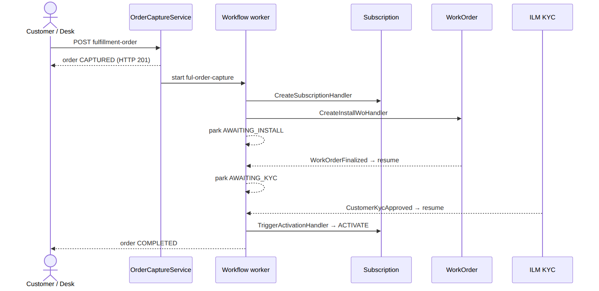
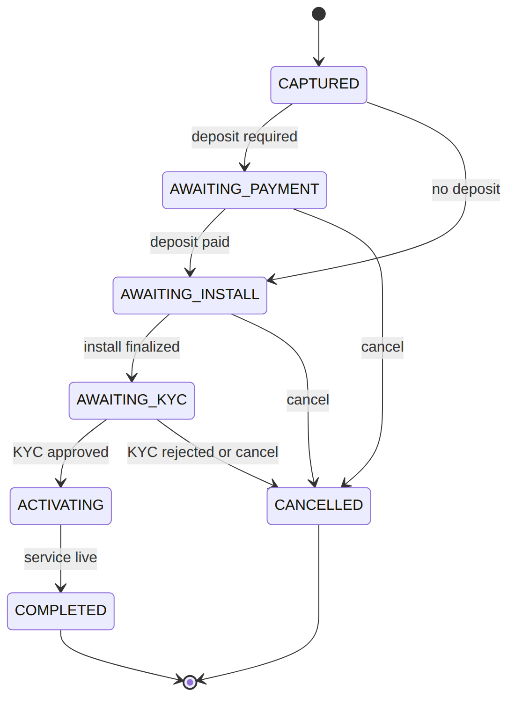
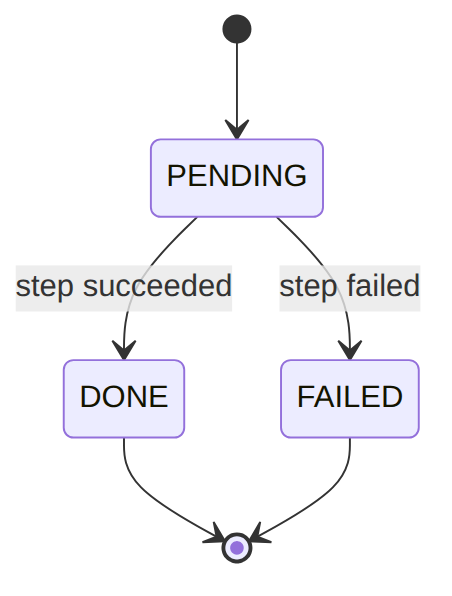

> 📱 **Rendered view** — diagrams below are images so they show in the GitHub app. Editable source (with mermaid): [`../fulfillment.md`](../fulfillment.md).

# Fulfillment — As-Built Design (the golden path)

> **Capability codes:** FUL-02 (order capture & journey), FUL-02-FRAMEWORK · **Module path:**
> `Modules/Fulfillment` · **Test:** `FulfillmentJourneyTest`

> **Read this module first as a new dev** — it orchestrates Subscription, WorkOrder, ILM (KYC) and
> Billing in one **config-defined** journey: the best end-to-end tour of the platform.

## 1. Purpose & boundaries
- **Owns:** the **order** (`fulfillment_order`) + its step ledger — the orchestration root turning
  "customer wants service" into an active subscription.
- **Does NOT own:** the artifacts it creates (subscription, WO, billing) — it triggers their owners and
  tracks progress. The journey is **config** (`ful-order-capture` process definition), not code.
- **Job:** capture → (deposit gate) → create subscription + install WO → await install → KYC gate →
  trigger activation → complete; with **compensation** on cancel.

## 📖 Scenarios (service + Foundation involvement)

> **The big picture first.** A fulfillment order is a checklist that turns "a customer wants service"
> into a working, billed subscription. The order doesn't do the work itself — it asks other modules
> (Subscription, WorkOrder, KYC, Billing) to do their part, then **waits** ("parks") until each part
> reports back. The order's `status` always tells you exactly which part it is waiting on. If anything
> goes wrong, the order can **undo** what it already created (cancel the WorkOrder, end the
> half-built subscription) — that undo is called *compensation*.

**The whole journey at a glance** — this is scenarios 1, 3 and 5 stitched together end to end:





### 1. Happy path — capture to live

**The story:** A desk agent submits an order for a customer. The system says "got it" and quietly kicks
off a behind-the-scenes checklist: it creates the subscription, then creates an install work order for a
technician, then **pauses** to wait for the install to happen.

**Who does what:**
1. `POST /api/fulfillment-orders {customer_id,account_id,homepass_id,package_ref}` →
   `OrderCaptureService::capture` (order `CAPTURED`, starts the `ful-order-capture` flow, HTTP 201).
2. The `sophix:workflow:work` worker drains the flow: `CreateSubscriptionHandler` (→ Subscription, stores
   `subscription_id`) → `CreateInstallWoHandler` (→ WorkOrder, stores `work_order_id`).
3. The flow then parks at `AWAITING_INSTALL`, waiting for the technician.

**Sample — the order right after capture, now parked for install:**
```json
{ "order_id":"order_2","status":"AWAITING_INSTALL","current_step":"INSTALL","subscription_id":"sub_2","work_order_id":"wo_2","payment_ref":null }
```
*Proven by `FulfillmentJourneyTest`.*

### 2. Deposit required → park AWAITING_PAYMENT → resume

**The story:** Some orders need a deposit paid up front. If the request says a deposit is due and none has
been paid yet, the order stops **before** building anything — no work order, no waste — and waits for the
money. Once the deposit lands, it picks up where it left off.

**Who does what:**
1. With `deposit_required:true` and no `payment_ref`, `DepositGateHandler` parks the flow on a
   `ful-payment-received` catch → status `AWAITING_PAYMENT`. **No install WO is created yet.**
2. `confirmDepositPaid` correlates the waiting message → the flow proceeds to create the WO.

*Foundation: workflow message catch.* *Proven by
`FulfillmentJourneyTest::test_deposit_required_order_parks_awaiting_payment_then_resumes_on_deposit`.*

### 3. Install finalized (event) resumes automatically

**The story:** While the order is parked waiting for install, the technician out in the field finishes the
job and closes their work order. That closure automatically wakes the parked order up — nobody at the desk
has to do anything.

**Who does what:**
1. the tech finalizes the WO → `WorkOrderFinalized` (outbox).
2. `ResumeOrderOnInstallFinalized` correlates the `ful-install-finalized` catch.
3. the flow resumes and moves on to the KYC gate.

*Foundation: outbox listener + message correlation.*

### 4. Desk completes the install (manual path)

**The story:** Sometimes the work-order event isn't the trigger — a desk agent confirms the install
manually instead. Either way reaches the exact same waiting point and resumes it.

**Who does what:** `POST …/{id}/complete` → `OrderCaptureService::complete` correlates the same
`ful-install-finalized` message (the desk equivalent of the WO event). *Shows: two ways to resume one catch.*

### 5. KYC gate parks, then approval resumes

**The story:** Before the service can go live, the customer's identity check (KYC) must pass. If it's still
pending, the order waits at the KYC gate. When compliance approves the customer, the order wakes up, walks
back through the gate (now passing), and activates the service.

**Who does what:**
1. `KycGateHandler`: customer is `PENDING` → park at `AWAITING_KYC`.
2. Final KYC approval → `CustomerKycApproved` → `ResumeOrderOnKycApproved` → the flow loops back through the
   gate (now `APPROVED`) → activation.

*Proven by `FulfillmentJourneyTest::test_activation_is_gated_on_customer_kyc`.*

### 6. KYC rejected → cancel + compensate

**The story:** If the identity check **fails**, the order can't go live — and it has already built a
subscription and a work order that now need to be torn down. The system cancels the order and cleanly
undoes everything it created.

**Who does what:**
1. KYC `REJECTED` → `CustomerKycRejected` → `CancelOrderOnKycRejected` → `OrderCaptureService::cancel`.
2. interrupts the workflow, **cancels the install WO**, **terminates the half-built subscription**.
3. Order → `CANCELLED`.

*Proven by `FulfillmentJourneyTest::test_kyc_rejection_cancels_the_parked_order_and_compensates`.*

### 7. Fraud flag blocks activation

**The story:** Even with everything else green, the system won't switch a customer on if they've been
flagged as a fraud risk. The order sits un-activated until the flag is cleared.

**Who does what:**
1. `TriggerActivationHandler` checks ILM `hasProvisioningBlockingFlag`.
2. a `FRAUD_SUSPECTED` flag blocks activation (R-ILM-F-4) — the order stays un-activated until cleared.

*Proven by `FulfillmentJourneyTest`.*

### 8. Cancel mid-flight → compensate

**The story:** A desk agent can cancel an order at any point. Whatever has been built so far gets undone in
reverse order — the work order is cancelled, then the subscription is terminated — so nothing is left
dangling.

**Who does what:**
1. `POST …/{id}/cancel` → `cancel` interrupts the running `process_instance`.
2. then `compensate()` cancels a cancellable WO and terminates a non-terminated subscription (reverse creation
   order).

*Proven by `FulfillmentJourneyTest::test_cancelling_an_order_compensates_its_install_wo_and_subscription`.*

## 2. Data model — ≥4 **complete** sample rows + readings
> **Completeness:** each row lists **every domain column** (nullables shown as `null`). The string
> business key shown is the real primary key; `created_at`/`updated_at` are omitted by convention.

### `fulfillment_order` · `status`: `CAPTURED|AWAITING_PAYMENT|AWAITING_INSTALL|AWAITING_KYC|ACTIVATING|COMPLETED|CANCELLED` · `billing_mode`: `PREPAID|POSTPAID`
```json
{ "order_id":"order_1","operator_code":"WIK","customer_id":"cust_50","account_id":"acct_50","homepass_id":"hp_1","package_ref":"pkg_triple","package_version_id":"pkgv_3","billing_mode":"POSTPAID","status":"COMPLETED","current_step":"ACTIVATION","subscription_id":"sub_1","work_order_id":"wo_1","payment_ref":"pay_1","created_by":"u_desk1","completed_at":"2026-06-20T11:00:00Z","process_instance_id":"pi_1" }
{ "order_id":"order_2","operator_code":"WIK","customer_id":"cust_51","account_id":"acct_51","homepass_id":"hp_2","package_ref":"pkg_inet","package_version_id":"pkgv_2","billing_mode":"POSTPAID","status":"AWAITING_INSTALL","current_step":"INSTALL","subscription_id":"sub_2","work_order_id":"wo_2","payment_ref":null,"created_by":"u_desk1","completed_at":null,"process_instance_id":"pi_2" }
{ "order_id":"order_3","operator_code":"WIK","customer_id":"cust_52","account_id":"acct_52","homepass_id":"hp_3","package_ref":"pkg_inet","package_version_id":"pkgv_2","billing_mode":"POSTPAID","status":"AWAITING_KYC","current_step":"KYC","subscription_id":"sub_3","work_order_id":"wo_3","payment_ref":null,"created_by":"u_desk2","completed_at":null,"process_instance_id":"pi_3" }
{ "order_id":"order_4","operator_code":"WIK","customer_id":"cust_53","account_id":"acct_53","homepass_id":"hp_4","package_ref":"pkg_triple","package_version_id":"pkgv_3","billing_mode":"PREPAID","status":"AWAITING_PAYMENT","current_step":"PAYMENT","subscription_id":null,"work_order_id":null,"payment_ref":null,"created_by":"u_desk2","completed_at":null,"process_instance_id":"pi_4" }
{ "order_id":"order_5","operator_code":"WIK","customer_id":"cust_54","account_id":"acct_54","homepass_id":"hp_5","package_ref":"pkg_inet","package_version_id":null,"billing_mode":"POSTPAID","status":"CANCELLED","current_step":"KYC","subscription_id":"sub_5","work_order_id":"wo_5","payment_ref":null,"created_by":"u_desk1","completed_at":null,"process_instance_id":"pi_5" }
```
**Read each row as a sentence — *this data means this:***

| Row | What it means in plain English |
|-----|--------------------------------|
| **order_1** | A POSTPAID triple-play order (`billing_mode=POSTPAID`, `package_ref=pkg_triple`) that is **finished and live** (`status=COMPLETED`, `completed_at` stamped) — it created subscription `sub_1` and install `wo_1`. |
| **order_2** | A POSTPAID internet order **waiting for the technician** (`status=AWAITING_INSTALL`, `current_step=INSTALL`); subscription `sub_2` and `wo_2` already exist, but it hasn't paid yet (`payment_ref=null`). |
| **order_3** | A POSTPAID internet order **held on the identity check** (`status=AWAITING_KYC`, `current_step=KYC`); it has its subscription `sub_3` and `wo_3` but isn't done. |
| **order_4** | A PREPAID triple-play order **stuck at the deposit gate** (`billing_mode=PREPAID`, `status=AWAITING_PAYMENT`, `current_step=PAYMENT`) — so it has **no** `subscription_id` and **no** `work_order_id` yet (nothing is created before the deposit is paid). |
| **order_5** | A **cancelled** order (`status=CANCELLED`) whose subscription `sub_5` and `wo_5` were compensated (undone); it never got a `package_version_id`. |

**The columns that did the work:**
- `status` says **where the journey is parked**; `current_step` is the live cursor.
- `subscription_id` / `work_order_id` are the **artifacts the order created** — stored precisely so a cancel can undo them later.
- `process_instance_id` is the workflow driving it; `package_version_id` is the exact catalog version sold; `billing_mode` decides whether a deposit gate applies.

**The order's lifecycle** — each status is a parking spot waiting on one thing:




### `fulfillment_order_step` (append-only ledger) · `step`: `CAPTURE|VALIDATE|SUBSCRIPTION|DEPOSIT|PAYMENT|INSTALL|KYC|ACTIVATION` · `status`: `PENDING|DONE|FAILED`
```json
{ "id":"st_1","order_id":"order_1","step":"CAPTURE","status":"DONE","result":null,"completed_at":"2026-06-20T09:00:00Z" }
{ "id":"st_2","order_id":"order_1","step":"SUBSCRIPTION","status":"DONE","result":{"subscriptionId":"sub_1"},"completed_at":"2026-06-20T09:01:00Z" }
{ "id":"st_3","order_id":"order_1","step":"INSTALL","status":"DONE","result":{"workOrderId":"wo_1"},"completed_at":"2026-06-20T10:30:00Z" }
{ "id":"st_4","order_id":"order_1","step":"KYC","status":"DONE","result":{"kycStatus":"APPROVED"},"completed_at":"2026-06-20T10:55:00Z" }
```
**Read each row as a sentence — *this data means this:***

| Row | What it means in plain English |
|-----|--------------------------------|
| **st_1** | Order `order_1`'s `CAPTURE` step **finished cleanly** (`status=DONE`) at 09:00, producing no payload (`result=null`). |
| **st_2** | Its `SUBSCRIPTION` step **succeeded** and produced subscription `sub_1` (`result.subscriptionId=sub_1`). |
| **st_3** | Its `INSTALL` step **succeeded** and produced work order `wo_1` (`result.workOrderId=wo_1`). |
| **st_4** | Its `KYC` step **succeeded** with the identity check approved (`result.kycStatus=APPROVED`). |

**The columns that did the work:**
- Every journey step appends a row carrying its `result` and `completed_at` — an audit trail of *what the workflow did, what it produced, and when*, so an order's whole history reconstructs without opening the workflow engine.
- Each step row starts `PENDING`, then ends `DONE` or `FAILED`.





## 3. Services
| Service | Responsibility |
| --- | --- |
| `OrderCaptureService` | `capture()` (create + start flow), `complete()`/`confirmDepositPaid()` (correlate messages), `cancel()` (interrupt + `compensate()`), `recordStep()` |

## 4. API surface
`POST /api/fulfillment-orders` (idempotent), `…/{id}/complete` (idempotent), `…/{id}/cancel`, `GET …`.
`permission:fulfillment.manage`.

## 5. Integration (events) — topic `fulfillment.order`
- **Emits:** `OrderCaptured`, `OrderStepCompleted`, `OrderCompleted`, `OrderCancelled`.
- **Consumes:** `ResumeOrderOnInstallFinalized` (WorkOrderFinalized), `ResumeOrderOnKycApproved`
  (CustomerKycApproved), `CancelOrderOnKycRejected` (CustomerKycRejected).

## 6. Processes & ops console
- **Flow:** `ful-order-capture` (`FulfillmentFlowSeeder`) — extend in the Studio, not code.
- **Handlers:** `ValidateOrderHandler`, `CreateSubscriptionHandler`, `CreateInstallWoHandler`,
  `DepositGateHandler` (catch `ful-payment-received`), `KycGateHandler` (gateway → catch
  `ful-kyc-approved`), `TriggerActivationHandler` (→ Subscription ACTIVATE; FUL-03 flag block),
  `CompleteOrderHandler`.

**Ops console** — `sophix:fulfillment:*`, wrapping the existing `OrderCaptureService` desk ops (no approval gate; break-glass for ops with shell access):

| Command | Kind | Does |
| --- | --- | --- |
| `ops-status [--operator]` | review | counts of orders parked mid-journey: awaiting-payment/install/KYC, activating, captured, completed, cancelled (optionally scoped to one operator) |
| `order-show {order}` | review | one order's state, step ledger and driving workflow instance (read-only) |
| `order-fix {order} {action}` | safe-correction | drive one order forward via `OrderCaptureService` — `confirm-deposit`/`complete`/`cancel`; `cancel` is destructive and needs `--confirm` (+ `--reason`) |

## 7. Policy & config
The flow graph; deposit-required + package come from the request/catalog.

## 8. Cross-module dependencies
- **Calls →** Subscription (create + activate), WorkOrder (install WO), ILM (flag check at activation).
- **Reacts to →** WorkOrder (install finalized), ILM (KYC approved/rejected).

## 9. Invariants & rules
| Rule | Statement | Enforced in |
| --- | --- | --- |
| FUL-02 §1.8 | cancel interrupts the journey **and compensates** (WO + sub) | `OrderCaptureService::cancel`+`compensate` |
| R-ILM-F-4 | a provisioning-blocking flag blocks activation | `TriggerActivationHandler` |
| idempotency | capture + complete are idempotent | route `idempotency` middleware |

## 10. Open items / deltas
- KYC-rejection now **cancels** the parked order (was a hang) — fixed.
- Deposit-refund-on-cancel isn't modelled (cancel undoes WO + subscription; a paid-deposit refund would
  be an added BIL-02-ADJ path).
