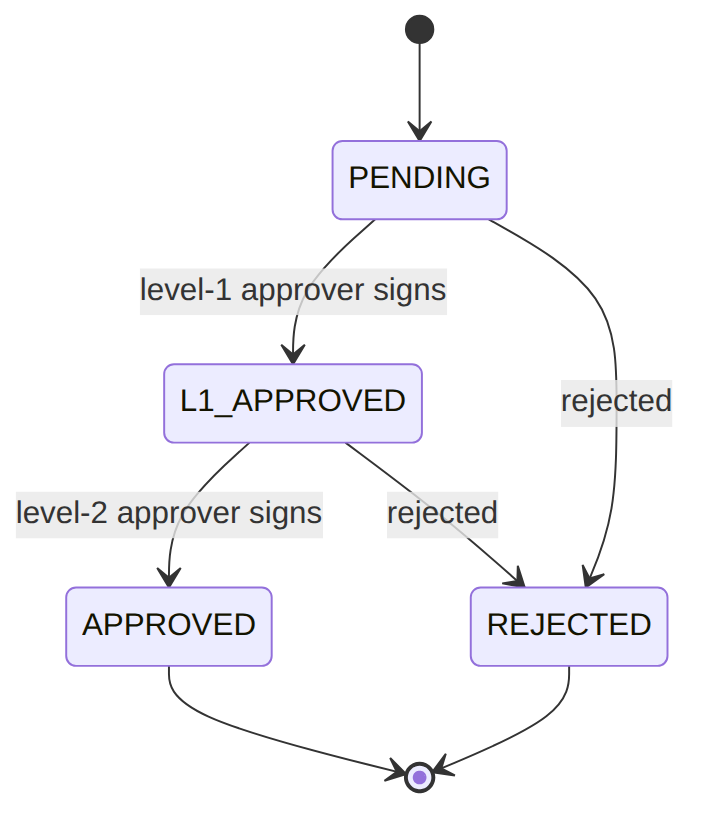
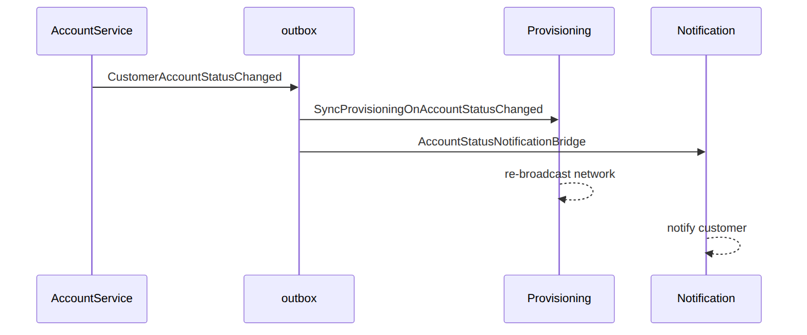
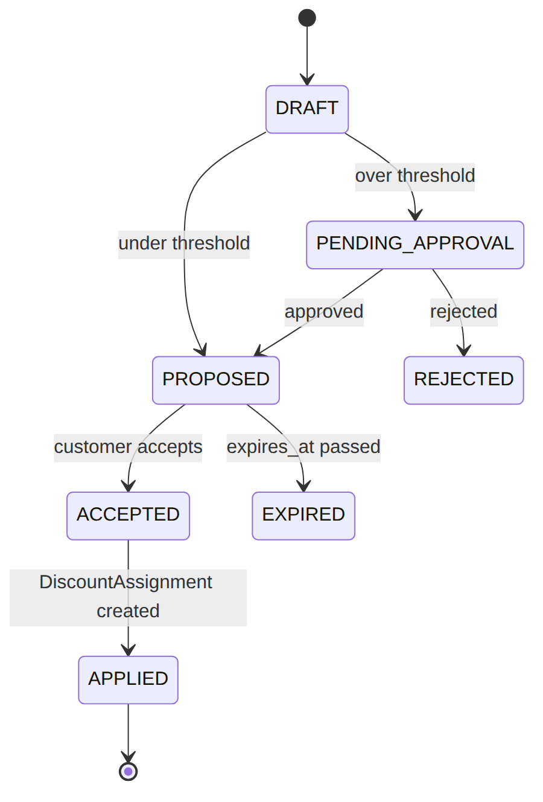
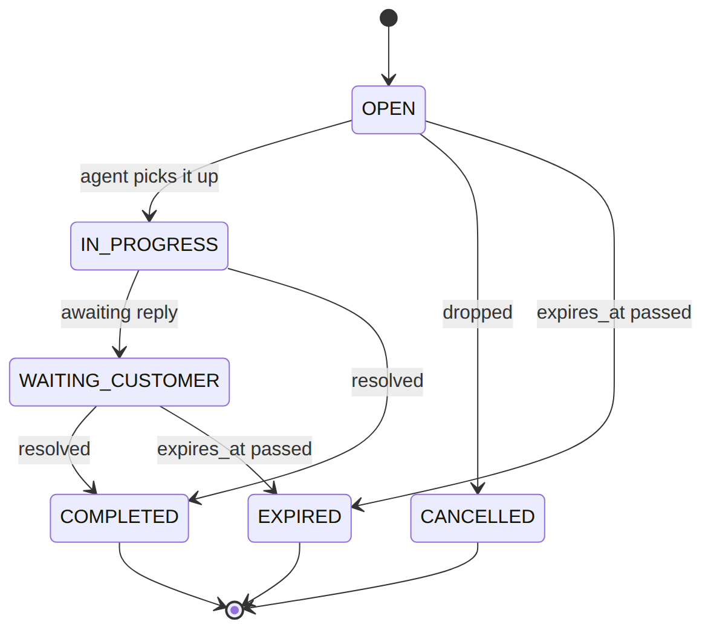

> 📱 **Rendered view** — diagrams below are images so they show in the GitHub app. Editable source (with mermaid): [`../ilm.md`](../ilm.md).

# ILM — As-Built Design (Customer & CVM)

> **Capability codes:** ILM-CFG-01 (customer/account/360/KYC/flags), EM-03 (CVM retention) ·
> **Module path:** `Modules/Ilm` · **Tests:** `CustomerApi`, `CustomerOverview`, `AccountFlag`,
> `Cvm`, `CvmFlagEvaluator`

## 1. Purpose & boundaries
- **Owns:** the **customer** & **customer-account** masters, the KYC chain, the **account-flag** &
  **sub-status** catalogs, the interaction timeline, and the **CVM** engine (segments/activities/offers).
- **Does NOT own:** subscriptions, money, equipment. It is the **system of record for "who the customer
  is and what state the account is in"** and the source of the shared routing context.
- **Job:** authoritative customer/account data + a data-driven flag/sub-status model + governed CVM.

## 📖 Scenarios (service + Foundation involvement)

> **The one big idea:** ILM is the system of record for *who the customer is and what state their account
> is in*. Two patterns recur: (1) **catalogs as data** — flags, sub-statuses, and KYC authority are rows
> an operator edits, not code; and (2) those rows carry *effect flags* that quietly steer **other**
> modules (dunning, provisioning, notification).

### 1. Create a customer and run two-step KYC

**The story in plain English:** A new customer signs up. Before they can be activated, their identity
documents must be checked and approved — and not by just one person. Two approvers at two levels must
sign off, moving the customer from PENDING up to fully APPROVED. Only then can a parked order proceed.

KYC isn't a bespoke workflow: it **runs on the same EM-CFG-04 approval engine** as everything else that
needs sign-off. The two levels (L1 supervisor → final) are an **ordered two-stage chain**; each
`recordKycDecision` is a `decide()` on the current stage. The engine owns *who* may act (the configured
role per stage, or SUPER_ADMIN) and the distinct-approver rule; `kyc_status` is simply **derived** from
how far the chain has progressed.

**Who does what:**
1. `POST /api/customers` → `CustomerService::create` (emits `CustomerCreated`). KYC docs uploaded via the Foundation/Files store.
2. The first `recordKycDecision(customer, level, 'APPROVED')` opens a `CUSTOMER_KYC` request whose chain is built from `kyc_approval_role` (level → stage role) and **frozen** onto the request. Each decision clears a stage.
3. Clearing stage 1 → `L1_APPROVED`; clearing stage 2 → `APPROVED` (emits `CustomerKycApproved`). A reject at any stage → `REJECTED`. (An unauthorised approver gets `KYC_APPROVER_ROLE_REQUIRED`.)
4. Cross-module: Fulfillment's `ResumeOrderOnKycApproved` resumes the parked order.




*Proven by `CustomerApiTest`.*

### 2. Sub-status change driven by the catalog (approval-gated)

**The story in plain English:** An agent wants to put an account "on hold". They don't type a free-form
status — they pick a code from a catalog. The catalog row says what the coarse status becomes (hold →
INACTIVE) and whether the change needs approval. "Hold" needs approval, so the change is **held** until a
back-office approver signs off — and that approval can be a single sign-off or a chain.

**Who does what:**
1. `PATCH /api/customer-accounts/acc_1 {sub_status:'hold'}` → `AccountService::update`: the `customer_sub_status_catalog` validates the code and **derives** `main_status` (clone).
2. Because `requires_approval=true`, it **routes through EM-CFG-04** — raises an `ApprovalService::request` (`entity_type=CUSTOMER_SUB_STATUS`, `action=hold`) and returns the account **unchanged** (held PENDING).
3. When an approver (a single `CUSTOMER_CARE_SUPERVISOR` by default, or each stage of a chain) approves, `ApplySubStatusOnApproval` applies the transition, writes `account_status_history`, and emits `CustomerAccountStatusChanged`.

*Proven by `AccountFlagTest::test_sub_status_requiring_approval_routes_through_em_cfg_04`.*

### 3. Raise an NPD flag → attention banner + faster dunning

**The story in plain English:** Risk flags a customer as a non-performing debtor (NPD). The flag puts an
attention banner on the account, and — because the catalog says this flag affects dunning — the next
debt-chasing scan in Billing skips the usual grace period and escalates faster.

**Who does what:**
1. `PUT /api/customer-accounts/acc_3/flags/NPD` → `setFlag`: catalog-gated; sets `attention_banner` and emits `CustomerAccountFlagSet`.
2. Because the catalog marks NPD `affects_dunning=true`, BIL-04's next scan calls `hasDunningAccelerantFlag` → **waives the grace window** (R-ILM-F-3). *Cross-module read.*

*Proven by `AccountFlagTest`, `DunningTest`.*

### 4. FRAUD_SUSPECTED flag blocks activation

**The story in plain English:** An account is flagged as possible fraud. Because that flag is marked as
affecting provisioning, Fulfillment refuses to activate the service until the flag is cleared.

**Who does what:** A `FRAUD_SUSPECTED` flag (`affects_provisioning=true`) → Fulfillment's
`TriggerActivationHandler` calls `hasProvisioningBlockingFlag` → refuses to activate (R-ILM-F-4) until
cleared. *Proven by `FulfillmentJourneyTest::test_fraud_suspected_flag_blocks_activation`.*

### 5. Account status change cascades to the network + the customer

**The story in plain English:** When an account's status changes in a way that affects service, one
event fans out to two places: Provisioning re-syncs the network, and Notification tells the customer.

**Who does what:**
1. A provisioning-affecting status change emits `CustomerAccountStatusChanged{affectsProvisioning, customerVisible}` to the **outbox**.
2. Provisioning's `SyncProvisioningOnAccountStatusChanged` re-broadcasts the network, and Notification's `AccountStatusNotificationBridge` notifies the customer.

*Foundation: one event, two reactions.*




*Proven by `ReconciliationTest`, `Not01PipelineTest`.*

### 6. CVM evaluate → segment → activity (idempotent)

**The story in plain English:** CVM (customer value management) watches signals about a customer, scores
their churn risk, drops them into a segment (e.g. "high retention risk"), and opens a follow-up task for
an agent. The same triggering event always produces the same task — no duplicates.

**Who does what:**
1. `POST /api/cvm/customers/CUS-1/evaluate {signals}` → `CvmEvaluationService`: writes a `cvm_customer_signal_profile`, computes a churn score, assigns a `cvm_segment_membership` (e.g. `RETENTION_HIGH_RISK`), and opens a `cvm_activity` — **idempotent by source event** (same event → same activity).
2. Emits `CvmCustomerEvaluated`/`CvmActivityCreated`.

*Proven by `CvmTest`.*

### 7. Retention offer over threshold → EM-CFG-04 → accept → SIP-03

**The story in plain English:** To keep a churn-risk customer, an agent proposes a 25% retention
discount. Because it's over a threshold, the offer needs approval first — trying to accept it before
approval is bounced. Once approved, the offer becomes acceptable; accepting it creates a real discount
assignment in Catalog and records the outcome.

**Who does what:**
1. `CvmOfferService::propose` (25% discount): `rules.cvm.offer` says over threshold → `requireApproval` → offer `PENDING_APPROVAL` (an EM-CFG-04 request).
2. `accept()` returns **409** while pending.
3. Approval → `ResumeCvmOfferOnApproval` → `applyApprovalOutcome` releases it `PROPOSED`.
4. `accept` then creates a Catalog `DiscountAssignment` (SIP-03) and records a `cvm_outcome`.




*Proven by `CvmTest`.*

### 8. routingContext — the shared fact set

**The story in plain English:** Other modules constantly need to know "what kind of customer/account is
this?" to make decisions. Rather than every module reaching into ILM's tables, ILM hands out one tidy
fact map they can drop straight into their rules engine.

**Who does what:** `AccountService::routingContext(accountId)` returns a plain map (operator,
serviceClass, accountStatus, subStatus, customerType, vip, flags…) so **any** module can feed a complete
fact set into its rules engine without reading ILM tables directly. *Shows: the cross-module
decision-context pattern.*

### (bonus) 9. KYC rejected → the order is cancelled

**The story in plain English:** If KYC is rejected, the parked order can't go ahead — Fulfillment
cancels and unwinds it.

**Who does what:**
1. `recordKycDecision(..,'REJECTED')` emits `CustomerKycRejected`.
2. Fulfillment `CancelOrderOnKycRejected` cancels + compensates the parked order.

*Proven by `FulfillmentJourneyTest`.*

## 2. Data model — ≥4 **complete** sample rows + readings
> **Completeness:** each row lists **every domain column** (nullables shown as `null`). The surrogate
> primary key shown is the real one (a ULID business key, e.g. `customer_id`; the catalogs use a
> composite `operator_code`+`code` key); `created_at`/`updated_at` are omitted by convention.

### `customer` (`type`: `RES|COM` · `kyc_status`: `PENDING|L1_APPROVED|APPROVED|REJECTED`)
> `tax_identifier` added by the tax-identifier migration.
```json
{ "customer_id":"cust_1","operator_code":"WIK","type":"RES","tax_identifier":"A012345678Z","name":"Jane Mwangi","identification_type_1":"NATIONAL_ID","identification_number_1":"22334455","identification_type_2":null,"identification_number_2":null,"date_of_birth":"1990-04-12","business_reg_date":null,"primary_msisdn":"+254712000111","email":"jane@example.com","preferred_language":"en","kyc_status":"APPROVED" }
{ "customer_id":"cust_2","operator_code":"WIK","type":"RES","tax_identifier":null,"name":"Otieno","identification_type_1":"NATIONAL_ID","identification_number_1":"99887766","identification_type_2":null,"identification_number_2":null,"date_of_birth":"1985-09-30","business_reg_date":null,"primary_msisdn":"+254722000222","email":null,"preferred_language":"sw","kyc_status":"PENDING" }
{ "customer_id":"cust_3","operator_code":"WIK","type":"COM","tax_identifier":"P051234567X","name":"Acme Ltd","identification_type_1":"BUSINESS_REG","identification_number_1":"BRS-2020-771","identification_type_2":"KRA_PIN","identification_number_2":"P051234567X","date_of_birth":null,"business_reg_date":"2020-02-01","primary_msisdn":"+254733000333","email":"ops@acme.co.ke","preferred_language":"en","kyc_status":"L1_APPROVED" }
{ "customer_id":"cust_4","operator_code":"WIK","type":"RES","tax_identifier":null,"name":"Fraudster","identification_type_1":"PASSPORT","identification_number_1":"X1234567","identification_type_2":null,"identification_number_2":null,"date_of_birth":"1979-01-01","business_reg_date":null,"primary_msisdn":"+254744000444","email":null,"preferred_language":"en","kyc_status":"REJECTED" }
```
**Read each row as a sentence — *this data means this:***

| Row | What it means in plain English |
|-----|--------------------------------|
| **cust_1** | A residential customer (`type=RES`) **cleared to be activated** (`kyc_status=APPROVED`), with a tax ID, a national ID, and a contact MSISDN. |
| **cust_2** | A residential customer whose KYC is **still pending** (`kyc_status=PENDING`) — fulfillment can't proceed yet. |
| **cust_3** | A business customer (`type=COM`) at the **mid-chain** KYC step (`kyc_status=L1_APPROVED`, still needs L2), identified by business reg + KRA PIN. |
| **cust_4** | A customer whose KYC was **rejected** (`kyc_status=REJECTED`) — the order is cancelled. |

**The columns that did the work:**
- **Can fulfillment activate** = `kyc_status` (only `APPROVED` proceeds; `L1_APPROVED` needs L2; `REJECTED` cancels).
- **RES vs COM** = `type` — a segment proxy used in routing; it also picks which identity fields apply (`date_of_birth` for RES, `business_reg_date` for COM).
- **Billing + contact keys** = `tax_identifier` (read by the tax invoice) + `primary_msisdn` (required contact).

### `customer_account` (`status`: `ACTIVE|INACTIVE`)
```json
{ "account_id":"acc_1","account_number":"WIK-100001","payment_account_number":"PAY-100001","customer_id":"cust_1","operator_code":"WIK","homepass_id":"hp_1","service_address":"12 Karen Rd","status":"ACTIVE","sub_status":"active","sub_status_reason":null,"sub_status_changed_at":"2026-01-01T08:00:00Z","service_class_1":"GOLD","service_class_2":null,"service_class_3":null,"attention_banner":null,"subscription_id":"sub_123","start_bill_date":"2026-01-01","install_date":"2025-12-28","disconnect_date":null,"account_manager_id":"u_am1","franchise_code":"fr_nrb" }
{ "account_id":"acc_2","account_number":"WIK-100002","payment_account_number":"PAY-100002","customer_id":"cust_1","operator_code":"WIK","homepass_id":"hp_9","service_address":"12 Karen Rd Annex","status":"ACTIVE","sub_status":"vip","sub_status_reason":"loyal customer","sub_status_changed_at":"2026-03-01T08:00:00Z","service_class_1":"PLATINUM","service_class_2":null,"service_class_3":null,"attention_banner":null,"subscription_id":"sub_126","start_bill_date":"2026-03-01","install_date":"2026-02-25","disconnect_date":null,"account_manager_id":"u_am1","franchise_code":"fr_nrb" }
{ "account_id":"acc_3","account_number":"WIK-100003","payment_account_number":null,"customer_id":"cust_3","operator_code":"WIK","homepass_id":"hp_3","service_address":"7 Nyali Rd","status":"INACTIVE","sub_status":"hold","sub_status_reason":"docs pending","sub_status_changed_at":"2026-06-10T00:00:00Z","service_class_1":"SILVER","service_class_2":null,"service_class_3":null,"attention_banner":"On hold pending docs","subscription_id":null,"start_bill_date":null,"install_date":null,"disconnect_date":null,"account_manager_id":null,"franchise_code":"fr_msa" }
{ "account_id":"acc_4","account_number":"WIK-100004","payment_account_number":"PAY-100004","customer_id":"cust_4","operator_code":"WIK","homepass_id":null,"service_address":"99 Karen Rd","status":"INACTIVE","sub_status":"churned","sub_status_reason":"non-payment","sub_status_changed_at":"2026-05-20T00:00:00Z","service_class_1":null,"service_class_2":null,"service_class_3":null,"attention_banner":null,"subscription_id":"sub_7","start_bill_date":"2026-04-01","install_date":"2026-03-28","disconnect_date":"2026-05-20","account_manager_id":null,"franchise_code":"fr_nrb" }
```
**Read each row as a sentence — *this data means this:***

| Row | What it means in plain English |
|-----|--------------------------------|
| **acc_1** | A live GOLD account (`status=ACTIVE`, `sub_status=active`) linked 1:1 to sub_123 (`subscription_id`), with its operational and gateway-callback keys (`account_number`/`payment_account_number`). |
| **acc_2** | A second live account **for the same customer** cust_1, flagged VIP (`sub_status=vip`, with a `sub_status_reason`) — a customer may hold several accounts. |
| **acc_3** | An account **on hold** (`sub_status=hold` → `status=INACTIVE`) with a customer-facing `attention_banner` and no subscription yet (`subscription_id=null`). |
| **acc_4** | A churned account (`sub_status=churned` → `status=INACTIVE`) with its `disconnect_date` stamped. |

**The columns that did the work:**
- **The 2-value main status** = `status`, **derived** from `sub_status` (e.g. `hold`/`churned` clone to INACTIVE — never trusted from the caller).
- **Operator nuance** = `sub_status` (+ `sub_status_reason`/`sub_status_changed_at`); the `attention_banner` is set by an attention-surfacing flag.
- **The keys + link** = `account_number`/`payment_account_number` (operational + gateway) and `subscription_id` (1:1 to SUB-LM-01).

### `customer_account_flag_catalog` (composite PK `operator_code`+`flag_code` · `value_kind`: `BOOLEAN|SCORE_0_100|TIER|COUNT` · `evaluator`: `MANUAL|DROOLS|EVENT_DRIVEN`)
> `affects_dunning`/`affects_provisioning`/`customer_visible` added by the flag-catalog-effect-columns
> migration.
```json
{ "operator_code":"WIK","flag_code":"NPD","name":"Non-Performing Debtor","value_kind":"BOOLEAN","evaluator":"DROOLS","surfaces_attention":true,"affects_dunning":true,"affects_provisioning":false,"customer_visible":false,"active":true }
{ "operator_code":"WIK","flag_code":"FRAUD_SUSPECTED","name":"Fraud Suspected","value_kind":"BOOLEAN","evaluator":"MANUAL","surfaces_attention":true,"affects_dunning":false,"affects_provisioning":true,"customer_visible":false,"active":true }
{ "operator_code":"WIK","flag_code":"LOYALTY_TIER","name":"Loyalty Tier","value_kind":"TIER","evaluator":"EVENT_DRIVEN","surfaces_attention":false,"affects_dunning":false,"affects_provisioning":false,"customer_visible":true,"active":true }
{ "operator_code":"WIK","flag_code":"CHURN_RISK","name":"Churn Risk Score","value_kind":"SCORE_0_100","evaluator":"DROOLS","surfaces_attention":false,"affects_dunning":false,"affects_provisioning":false,"customer_visible":false,"active":true }
```
**Read each row as a sentence — *this data means this:***

| Row | What it means in plain English |
|-----|--------------------------------|
| **NPD** | A yes/no "Non-Performing Debtor" flag (`value_kind=BOOLEAN`) the **rules engine** sets (`evaluator=DROOLS`); it **surfaces the attention banner** and makes dunning escalate faster (`affects_dunning=true`). |
| **FRAUD_SUSPECTED** | A boolean flag **back-office staff set by hand** (`evaluator=MANUAL`); it **blocks provisioning** (`affects_provisioning=true`) and raises the banner. |
| **LOYALTY_TIER** | A **tier** value (`value_kind=TIER`) set by loyalty events (`evaluator=EVENT_DRIVEN`); the only customer-visible one here (`customer_visible=true`), no operational effect. |
| **CHURN_RISK** | A **0–100 score** (`value_kind=SCORE_0_100`) the rules engine computes; informational (no effects, not visible). |

**The columns that did the work:** `value_kind` says what shape the value is (bool / score / tier / count); `evaluator` says who may set it (MANUAL = staff only); the effect flags (`affects_dunning`/`affects_provisioning`/`customer_visible`/`surfaces_attention`) are what downstream modules read. The **instance** of a flag on an account is the table below.

### `customer_account_flag` (the per-account instance · `state`: `ACTIVE|CLEARED`)
```json
{ "id":"caf_1","operator_code":"WIK","account_id":"acc_3","flag_code":"NPD","bool_value":true,"score_value":null,"text_value":null,"state":"ACTIVE","source":"DROOLS","set_by":"system","set_at":"2026-06-10T00:00:00Z" }
{ "id":"caf_2","operator_code":"WIK","account_id":"acc_4","flag_code":"FRAUD_SUSPECTED","bool_value":true,"score_value":null,"text_value":null,"state":"ACTIVE","source":"MANUAL","set_by":"u_risk1","set_at":"2026-05-15T00:00:00Z" }
{ "id":"caf_3","operator_code":"WIK","account_id":"acc_1","flag_code":"LOYALTY_TIER","bool_value":null,"score_value":null,"text_value":"GOLD","state":"ACTIVE","source":"loyalty.tier-changed","set_by":"system","set_at":"2026-04-01T00:00:00Z" }
{ "id":"caf_4","operator_code":"WIK","account_id":"acc_2","flag_code":"CHURN_RISK","bool_value":null,"score_value":72,"text_value":null,"state":"CLEARED","source":"DROOLS","set_by":"system","set_at":"2026-03-01T00:00:00Z" }
```
**Read each row as a sentence — *this data means this:***

| Row | What it means in plain English |
|-----|--------------------------------|
| **caf_1** | acc_3 is flagged a Non-Performing Debtor (`flag_code=NPD`, `bool_value=true`, `state=ACTIVE`), set by the rules engine (`source=DROOLS`). |
| **caf_2** | acc_4 is flagged Fraud Suspected (`bool_value=true`, `state=ACTIVE`), set **by hand** (`source=MANUAL`, `set_by=u_risk1`). |
| **caf_3** | acc_1 carries a loyalty tier of `GOLD` — a **text** value (`text_value=GOLD`, the column matching `value_kind=TIER`), set by a loyalty event. |
| **caf_4** | acc_2 had a churn-risk **score** of 72 (`score_value=72`), now `state=CLEARED`. |

**The columns that did the work:**
- **What the flag does** = the catalog effect columns: `affects_dunning` (BIL-04 escalates faster), `affects_provisioning` (FUL-03 blocks activation), `customer_visible`, `surfaces_attention` (drives the banner).
- **Who may set it** = `evaluator` (MANUAL = back-office only).
- **The instance's typed value** = whichever column matches the catalog `value_kind` — `bool_value` (NPD/FRAUD), `score_value` (CHURN_RISK), `text_value` (LOYALTY_TIER).
- **Live or not** = `state` (ACTIVE/CLEARED), unique per `(account_id, flag_code)`.

### `customer_sub_status_catalog` (composite PK `operator_code`+`sub_status_code`)
> `requires_approval`/`approval_roles_jsonb`/`affects_provisioning`/`customer_visible` added by the
> sub-status-catalog-config-columns migration (`approval_roles_jsonb` is JSON).
```json
{ "operator_code":"WIK","sub_status_code":"active","main_status":"ACTIVE","requires_approval":false,"approval_roles_jsonb":null,"affects_provisioning":true,"customer_visible":true,"display_name":"Active","active":true }
{ "operator_code":"WIK","sub_status_code":"vip","main_status":"ACTIVE","requires_approval":true,"approval_roles_jsonb":["ACCOUNT_MANAGER","REGION_HEAD"],"affects_provisioning":false,"customer_visible":false,"display_name":"VIP","active":true }
{ "operator_code":"WIK","sub_status_code":"hold","main_status":"INACTIVE","requires_approval":true,"approval_roles_jsonb":["BACKOFFICE_SUPERVISOR"],"affects_provisioning":true,"customer_visible":false,"display_name":"On Hold","active":true }
{ "operator_code":"WIK","sub_status_code":"churned","main_status":"INACTIVE","requires_approval":true,"approval_roles_jsonb":["BACKOFFICE_SUPERVISOR"],"affects_provisioning":true,"customer_visible":true,"display_name":"Churned","active":true }
```
**Read each row as a sentence — *this data means this:***

| Row | What it means in plain English |
|-----|--------------------------------|
| **active** | The "Active" sub-status maps to main status `ACTIVE` (`main_status`), needs no approval, and is customer-visible. |
| **vip** | "VIP" also clones to `ACTIVE` but **needs approval** (`requires_approval=true`) — the transition is **held until an EM-CFG-04 approval clears** (`approval_roles_jsonb` is the advisory role list). |
| **hold** | "On Hold" clones to `INACTIVE`, needs approval, and **affects provisioning** (`affects_provisioning=true`). |
| **churned** | "Churned" clones to `INACTIVE`, needs approval, affects provisioning, and is shown to the customer (`customer_visible=true`). |
> *(The `approval_roles_jsonb` role names above are illustrative — the seeded rows leave it null; the seeded EM-CFG-04 policy defaults to a single `CUSTOMER_CARE_SUPERVISOR` stage.)*

**The columns that did the work:**
- **The derived main status** = `main_status` — a sub-status **clones** it, so the 2-value main status is never trusted from the caller.
- **Approval gate** = `requires_approval` → the transition now **routes through the EM-CFG-04 engine** (`AccountService` raises an `ApprovalService::request(entity_type=CUSTOMER_SUB_STATUS, action=<code>)`); the change is **held PENDING** and `ApplySubStatusOnApproval` applies it on `ApprovalApproved`. The policy can be a **single approver or a chain** — the engine supports both, seeded as one `CUSTOMER_CARE_SUPERVISOR` stage by default. `approval_roles_jsonb` is the advisory list that an operator can use to seed the stage(s).
- **Provisioning impact** = `affects_provisioning` (the change emits `CustomerAccountStatusChanged` for FUL-03).
- An operator adds a state by **adding a row** — no code.

### `cvm_offer_instance` (`offer_type`: `RETENTION_DISCOUNT|UPGRADE_OFFER|WINBACK_PACKAGE|GOODWILL_CREDIT|PAYMENT_REMINDER` · `status`: `DRAFT|PENDING_APPROVAL|PROPOSED|ACCEPTED|REJECTED|EXPIRED|APPLIED|FAILED`)
```json
{ "offer_instance_id":"cvo_1","operator_code":"WIK","activity_id":"cva_1","customer_id":"CUS-1","subscription_id":"sub_123","offer_type":"RETENTION_DISCOUNT","campaign_code":null,"discount_ref":"disc_ret25","discount_percent":10.00,"status":"APPLIED","approval_request_id":null,"expires_at":"2026-07-31T00:00:00Z" }
{ "offer_instance_id":"cvo_2","operator_code":"WIK","activity_id":"cva_1","customer_id":"CUS-1","subscription_id":"sub_123","offer_type":"RETENTION_DISCOUNT","campaign_code":null,"discount_ref":null,"discount_percent":25.00,"status":"PROPOSED","approval_request_id":"appr_9","expires_at":"2026-07-31T00:00:00Z" }
{ "offer_instance_id":"cvo_3","operator_code":"WIK","activity_id":null,"customer_id":"CUS-3","subscription_id":null,"offer_type":"UPGRADE_OFFER","campaign_code":"Q3_UPSELL","discount_ref":null,"discount_percent":null,"status":"DRAFT","approval_request_id":null,"expires_at":null }
{ "offer_instance_id":"cvo_4","operator_code":"WIK","activity_id":null,"customer_id":"CUS-9","subscription_id":"sub_50","offer_type":"WINBACK_PACKAGE","campaign_code":"WINBACK","discount_ref":null,"discount_percent":null,"status":"EXPIRED","approval_request_id":null,"expires_at":"2026-05-01T00:00:00Z" }
```
**Read each row as a sentence — *this data means this:***

| Row | What it means in plain English |
|-----|--------------------------------|
| **cvo_1** | A 10% retention discount that **applied straight through** (`status=APPLIED`, `approval_request_id=null` — under threshold). |
| **cvo_2** | A 25% offer that **needed approval**: it carries `approval_request_id=appr_9` and sits `status=PROPOSED` after the approval released it. |
| **cvo_3** | An upgrade offer still being prepared (`status=DRAFT`), tied to campaign `Q3_UPSELL`. |
| **cvo_4** | A winback offer that **lapsed unused** (`status=EXPIRED`, its `expires_at` passed). |

**The columns that did the work:** `approval_request_id` set ⇒ the offer went through the EM-CFG-04 gate; `status` is the offer lifecycle (`DRAFT`→`PENDING_APPROVAL`→`PROPOSED`→`ACCEPTED`/`APPLIED`, or `EXPIRED`/`REJECTED`); `discount_ref`/`discount_percent` carry the value; `expires_at` lapses an untaken offer.

### `cvm_activity` (`activity_type`: `RETENTION_CALL|PAYMENT_RECOVERY|UPSELL_OFFER|WINBACK|SERVICE_RECOVERY` · `priority`: `LOW|MEDIUM|HIGH|CRITICAL` · `status`: `OPEN|IN_PROGRESS|WAITING_CUSTOMER|COMPLETED|CANCELLED|EXPIRED`)
> The EM-03 full-model migration added `activity_type`/`account_id`/`source_event_ref` (idempotency
> unique `(operator_code, source_event_ref)`), `assigned_to_user_id`/`assigned_team_id`/`priority`/
> `due_at`/`closed_at`, and relaxed the legacy `type` column to nullable (kept as `type`). (The `status`
> vocabulary is the `CvmActivity` model lifecycle `OPEN→IN_PROGRESS→WAITING_CUSTOMER→COMPLETED/CANCELLED/
> EXPIRED`; the DB column default remains the legacy `'OFFERED'`, overwritten on the first write.)
```json
{ "activity_id":"cva_1","operator_code":"WIK","account_id":"acc_1","activity_type":"PAYMENT_RECOVERY","customer_id":"CUS-1","subscription_id":"sub_123","type":"RECOVERY","trigger_reason":"NON_PAYMENT","source_event_ref":"DunningStageAdvanced:acc_1:3","offer_code":null,"offer_details":null,"status":"OPEN","channel":"OUTBOUND_CALL","assigned_to":null,"assigned_to_user_id":"u_ret1","assigned_team_id":"team_ret","priority":"HIGH","due_at":"2026-06-22T17:00:00Z","outcome_reason":null,"expires_at":"2026-06-30T00:00:00Z","decided_at":null,"closed_at":null }
{ "activity_id":"cva_2","operator_code":"WIK","account_id":"acc_3","activity_type":"UPSELL_OFFER","customer_id":"CUS-3","subscription_id":null,"type":null,"trigger_reason":"UPSELL","source_event_ref":"CvmCustomerEvaluated:CUS-3:2026-06","offer_code":"UPGRADE_200M","offer_details":{"toPackage":"pkg_inet_200"},"status":"IN_PROGRESS","channel":"SMS","assigned_to":null,"assigned_to_user_id":null,"assigned_team_id":"team_sales","priority":"MEDIUM","due_at":null,"outcome_reason":null,"expires_at":"2026-07-15T00:00:00Z","decided_at":null,"closed_at":null }
{ "activity_id":"cva_3","operator_code":"WIK","account_id":"acc_2","activity_type":"RETENTION_CALL","customer_id":"CUS-1","subscription_id":"sub_126","type":"RETENTION","trigger_reason":"CHURN_RISK","source_event_ref":"CvmCustomerEvaluated:CUS-1:2026-05","offer_code":"RET_25","offer_details":{"percent":25},"status":"COMPLETED","channel":"OUTBOUND_CALL","assigned_to":null,"assigned_to_user_id":"u_ret1","assigned_team_id":"team_ret","priority":"CRITICAL","due_at":"2026-05-20T17:00:00Z","outcome_reason":"customer accepted","expires_at":"2026-05-31T00:00:00Z","decided_at":"2026-05-19T10:00:00Z","closed_at":"2026-05-19T10:05:00Z" }
{ "activity_id":"cva_4","operator_code":"WIK","account_id":"acc_4","activity_type":"WINBACK","customer_id":"CUS-9","subscription_id":"sub_50","type":"WINBACK","trigger_reason":"CHURNED","source_event_ref":"CvmCustomerEvaluated:CUS-9:2026-04","offer_code":"WINBACK","offer_details":null,"status":"EXPIRED","channel":"EMAIL","assigned_to":null,"assigned_to_user_id":null,"assigned_team_id":null,"priority":"LOW","due_at":null,"outcome_reason":"no response","expires_at":"2026-05-01T00:00:00Z","decided_at":null,"closed_at":"2026-05-01T00:00:00Z" }
```
**Read each row as a sentence — *this data means this:***

| Row | What it means in plain English |
|-----|--------------------------------|
| **cva_1** | A high-priority payment-recovery task opened by a dunning signal (`activity_type=PAYMENT_RECOVERY`, `trigger_reason=NON_PAYMENT`, `status=OPEN`), assigned to an agent with a `due_at`. |
| **cva_2** | An upsell task for a healthy account (`activity_type=UPSELL_OFFER`), in progress over SMS. |
| **cva_3** | A retention call that **completed** (`status=COMPLETED`) — the customer accepted (`outcome_reason`), with `decided_at`/`closed_at` stamped. |
| **cva_4** | A winback task that **expired** with no response (`status=EXPIRED`, `outcome_reason="no response"`). |

**The columns that did the work:**
- **Why a task exists** = `activity_type`/`trigger_reason`; each activity is **idempotent by `source_event_ref`** (same event → same row).
- **Worklist routing + closure** = `priority`/`due_at`/`assigned_*` route it; `decided_at`/`closed_at` close it out.
- The legacy `type` column survives nullable alongside the new `activity_type`.

**Activity status lifecycle** (the `CvmActivity` model vocabulary; the DB default `'OFFERED'` is
overwritten on the first write):





## 3. Services
| Service | Responsibility |
| --- | --- |
| `CustomerService` | customer CRUD; `recordKycDecision()` (two-step, config authority) |
| `AccountService` | **only writer** of the account master — `update` (catalog-driven), `setFlag/clearFlag` (+ banner), `hasProvisioningBlockingFlag`/`hasDunningAccelerantFlag`, `routingContext()` |
| `CustomerOverviewService` | Customer 360 (degrades per panel) |
| `CvmEvaluationService` / `CvmFlagEvaluatorService` / `CvmActivityService` | signals→segments→activity; rules-driven flags; timeline |
| `CvmOfferService` | retention offers (EM-CFG-04 gated; resume; SIP-03 on accept) |

## 4. API surface
`/api/customers`, `/api/customer-accounts/{account}` (+ `…/flags/{flagCode}`, `…/kyc`),
`/api/customers/{id}/overview`, `/api/cvm/customers/{id}/evaluate`, `/api/cvm-offers/{id}/accept`.
Resource-scoped permissions `customer.read|create|update` (no `customer.*` wildcard; all mutations use
`customer.update`); KYC decisions config-gated.

## 5. Integration (events)
- **Topic `ilm.customer`:** `CustomerCreated/Updated`, `CustomerKyc{Approved,Rejected}`,
  `CustomerAccountCreated`, `CustomerAccountStatusChanged`, `CustomerAccountFlag{Set,Cleared}`.
- **Topic `em03.cvm`:** `CvmCustomerEvaluated`, `CvmActivity{Created,Closed}`, `CvmOffer{Proposed,
  Accepted,Applied}`.
- **Consumes:** `ResumeCvmOfferOnApproval`. **Downstream of ILM:** Provisioning, Notification, Fulfillment.

## 6. Processes & ops console
No BPMN; KYC + CVM offer governance via EM-CFG-04; `sophix:cvm:evaluate-flags {--operator}` daily worker
(rule-driven retention/risk flags).

**Ops console** — `sophix:ilm:*`, wrapping existing services (no EM-CFG-04 bypass; KYC decisions are
inspect-only here — they must go through the approval engine):

| Command | Kind | Does |
| --- | --- | --- |
| `customer-show {customer}` | review | one customer's master state (read-only): identity, derived `kyc_status`, KYC approval trail, and every account with status/sub-status/attention-banner/active flags |
| `kyc-queue [--operator] [--limit]` | review | customers by `kyc_status` count, then those stuck mid-chain (PENDING awaiting L1, L1_APPROVED awaiting final) — read-only |
| `flag-clear {account} {flag} [--actor]` | safe-correction | clear one ACTIVE account flag via `AccountService::clearFlag` — marks it CLEARED, recomputes the attention banner, emits `AccountFlagCleared` (reversible, non-gated; no `--confirm`) |

## 7. Policy & config
`rules.cvm.offer` + flag-evaluation rules; the flag/sub-status/KYC-authority catalogs — operator data.

## 8. Cross-module dependencies
- **Consumed by →** everyone (`routingContext`); flags steer BIL-04 + FUL-03; status change steers
  Provisioning + Notification; KYC gates Fulfillment.
- **Calls →** Foundation Approvals, Rules, Files; Catalog (`DiscountAssignment` on offer accept).

## 9. Invariants & rules
| Rule | Statement | Enforced in |
| --- | --- | --- |
| R-ILM-S-2 | a `requires_approval` sub-status change needs an approval reference | `AccountService::update` |
| R-ILM-S-3 | `affects_provisioning` change emits `CustomerAccountStatusChanged` for FUL-03 | `AccountService` + listener |
| R-ILM-F-3/F-4 | `affects_dunning`/`affects_provisioning` flags steer BIL-04 / FUL-03 | `hasDunningAccelerantFlag`/`hasProvisioningBlockingFlag` |
| R-ILM-K-3 | KYC approval authority per level is operator config, enforced as an EM-CFG-04 chain | `recordKycDecision` → `ApprovalService` |

## 10. Open items / deltas
- `CustomerAccountFlagSet/Cleared` + `CustomerKycRejected` now have consumers (FUL-03 block, order
  cancel) — earlier orphans, fixed.
- Customer-facing surfacing of `customer_visible` flags (R-ILM-F-5) is data-modelled; a dedicated
  customer endpoint is optional.
