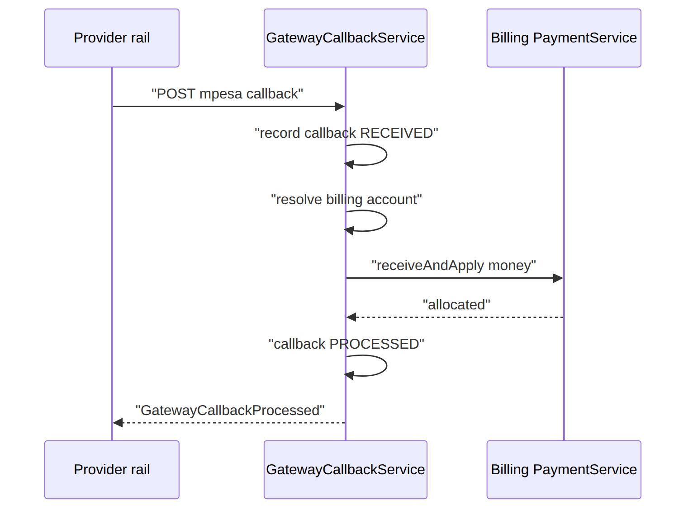
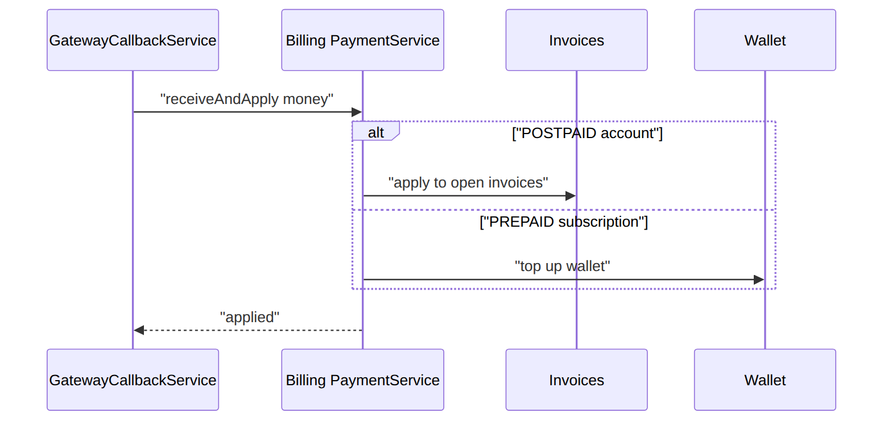
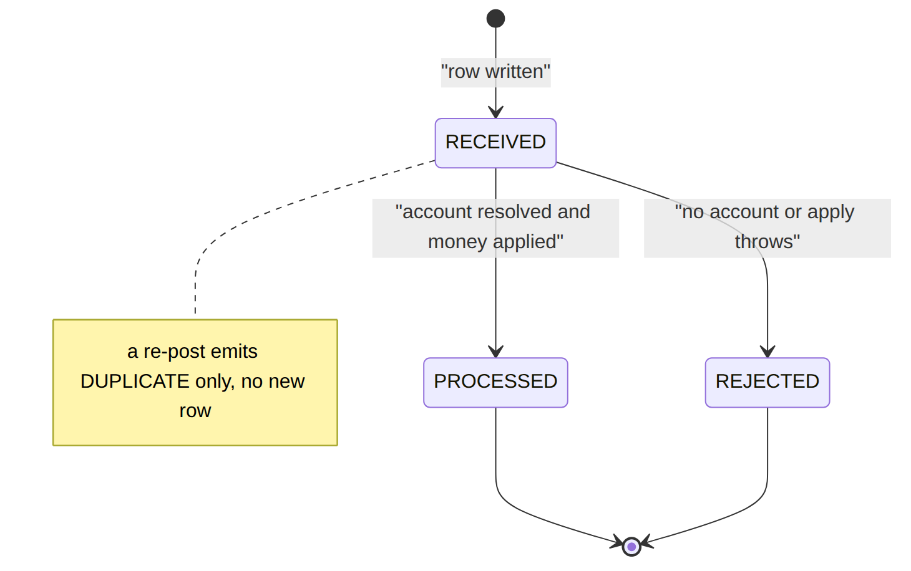

> 📱 **Rendered view** — diagrams below are images so they show in the GitHub app. Editable source (with mermaid): [`../paymentgateway.md`](../paymentgateway.md).

# PaymentGateway — As-Built Design

> **Capability codes:** payment-rail ingress (M-Pesa / cards / bank) · **Module path:**
> `Modules/PaymentGateway` · **Test:** `GatewayCallbackTest`

## 1. Purpose & boundaries
- **Owns:** the **inbound callback** boundary — receive, de-duplicate, record provider payment
  notifications, resolve the billing account, then hand the money to Billing
  (`PaymentService::receiveAndApply`) and emit a `GatewayCallback*` audit event.
- **Does NOT own:** allocation/ledger or billing-mode routing (Billing `PaymentService` — POSTPAID→invoices,
  PREPAID→wallet top-up) or outbound initiation (a connector).
- **Job:** the safe, idempotent front door for money-in from external rails.

## 📖 Scenarios (service + Foundation involvement)

### 1. M-Pesa STK success lands

**The story in plain English:** A customer pays with M-Pesa. The phone network calls back into our
system to say "this much money arrived from this number". We write the notification down, figure out
which billing account it belongs to, hand the money to Billing to apply, and then stamp the notification
as done. The whole point is to do this safely and only once.

**Who does what:**
1. The provider calls `POST /api/payment-gateway/mpesa/callbacks`.
2. `GatewayCallbackService::handle` records a `payment_gateway_callback` row (`RECEIVED`).
3. It resolves the billing account from the ILM `payment_account_number`.
4. It calls Billing **`PaymentService::receiveAndApply`**, which allocates the money.
5. The callback flips to `PROCESSED` and emits **`GatewayCallbackProcessed`** (topic
   `paymentgateway.callback`).

**Sample — the callback once applied:**
```json
{ "callback_id":"pgcb_1","provider":"MPESA","external_ref":"QGR7Xk12","account_ref":"254700000001","resolved_account_id":"acct_50","amount":5000.00,"status":"PROCESSED","payment_id":"pay_91","reject_reason":null }
```




*Proven by `GatewayCallbackTest::test_mpesa_callback_resolves_account_and_applies_payment`.*

### 2. Retried callback is ignored (dedup)

**The story in plain English:** Providers love to re-send the same notification. If we acted on it twice
we would credit the customer twice. So the same payment reference is only ever acted on once — a repeat
is recognised and quietly ignored.

**Who does what:** the provider re-posts the same `(provider, external_ref)` → the dedup key hits → the
**existing** callback row is returned (no new row), only a `GatewayCallbackDuplicate` audit event fires,
and `receiveAndApply` is **not** called again. *Proven by
`GatewayCallbackTest::test_duplicate_callback_is_deduped`.*

### 3. Prepaid vs postpaid routing (Billing-owned)

**The story in plain English:** Where the money lands depends on how the customer is billed. A postpaid
customer's money pays down their invoices; a prepaid customer's money tops up their wallet. The gateway
does not decide this — it just hands the money to Billing, which routes it.

**Who does what:** `receiveAndApply` routes by billing mode — a POSTPAID account's payment is applied to
invoices, a PREPAID subscription's money is a wallet top-up (BIL-05). The gateway owns no ledger.




*Proven by `GatewayCallbackTest::test_prepaid_callback_tops_up_the_wallet_not_an_invoice`.*

### 4. Card PSP callback
`POST /api/payment-gateway/visa/callbacks` → same path, different provider parsing (adapter/config).

### 5. Bank-transfer notification
A bank feed posts a transfer → recorded + applied (method `BANK_TRANSFER`).

### 6. Account cannot be resolved → REJECTED

**The story in plain English:** Money arrives but we cannot tell whose account it belongs to. We do not
apply it to anyone — we mark the notification rejected and keep the raw details so a human can sort it
out.

**Who does what:** a callback whose `account_ref` resolves to no billing account → callback `REJECTED`
(`reject_reason=ACCOUNT_NOT_FOUND`), `GatewayCallbackRejected` emitted, no money applied. *Proven by
`GatewayCallbackTest::test_unresolvable_account_is_rejected`.*

### 7. Apply fails downstream → REJECTED
If `receiveAndApply` throws, the callback is recorded `REJECTED` with the exception message as
`reject_reason`; the raw payload is kept for audit.

### 8. Admin audits callbacks
`GET /api/payment-gateway/callbacks[/{id}]` lists/inspects raw + parsed notifications.

## 2. Data model — ≥4 **complete** sample rows + readings per table
> **Completeness:** each row lists **every domain column** (nullables shown as `null`); the string
> primary key shown is the real one and `created_at`/`updated_at` are omitted by convention.

### `payment_gateway_callback` · `provider`: `MPESA|VISA|BANK_TRANSFER` · `status`: `RECEIVED|PROCESSED|REJECTED|DUPLICATE`
```json
{ "callback_id":"pgcb_1","operator_code":"WIK","provider":"MPESA","external_ref":"QGR7Xk12","account_ref":"254700000001","resolved_account_id":"acct_50","amount":5000.00,"currency":"KES","raw":{"TransID":"QGR7Xk12","TransAmount":"5000"},"status":"PROCESSED","payment_id":"pay_91","reject_reason":null,"received_at":"2026-06-20T09:00:00Z" }
{ "callback_id":"pgcb_2","operator_code":"WIK","provider":"VISA","external_ref":"ch_88","account_ref":"UNKNOWN","resolved_account_id":null,"amount":2500.00,"currency":"KES","raw":{"id":"ch_88"},"status":"REJECTED","payment_id":null,"reject_reason":"ACCOUNT_NOT_FOUND","received_at":"2026-06-20T09:30:00Z" }
{ "callback_id":"pgcb_3","operator_code":"WIK","provider":"VISA","external_ref":"ch_99","account_ref":"254700000003","resolved_account_id":null,"amount":2500.00,"currency":"KES","raw":{"id":"ch_99","status":"declined"},"status":"REJECTED","payment_id":null,"reject_reason":"card declined","received_at":"2026-06-20T10:00:00Z" }
{ "callback_id":"pgcb_4","operator_code":"WIK","provider":"BANK_TRANSFER","external_ref":"bt_7781","account_ref":"PAYBILL-22","resolved_account_id":null,"amount":12000.00,"currency":"KES","raw":{"ref":"bt_7781"},"status":"RECEIVED","payment_id":null,"reject_reason":null,"received_at":"2026-06-21T08:00:00Z" }
```
The status a callback can hold (a fresh row is `RECEIVED`; applying it makes it `PROCESSED`; a failure
to resolve or apply makes it `REJECTED`; `DUPLICATE` is only ever an event, never a saved retry row):




**Read each row as a sentence — *this data means this:***

| Row | What it means in plain English |
|-----|--------------------------------|
| **pgcb_1** | An M-Pesa payment of **KES 5000** landed and **succeeded**: it was matched to account **acct_50** and applied as payment **pay_91** (`status=PROCESSED`, so both `resolved_account_id` and `payment_id` are filled). |
| **pgcb_2** | A **KES 2500** Visa charge arrived but **couldn't find an account** (`account_ref=UNKNOWN`, `resolved_account_id=null`), so it was **REJECTED** with `reject_reason=ACCOUNT_NOT_FOUND` and no payment was created. |
| **pgcb_3** | Another Visa charge for **KES 2500** was **REJECTED** because the **card declined** — the apply step threw and `reject_reason` holds the exception message (`"card declined"`); no `payment_id`. |
| **pgcb_4** | A **KES 12000** bank transfer **just landed** and is still **RECEIVED** — the handler hasn't run yet, so it has no `payment_id` and no `reject_reason`. |

**The columns that did that work:**
- **Dedup** = `(provider, external_ref)` is a DB unique constraint, so a re-post never inserts a second row; the existing record is returned and only a `GatewayCallbackDuplicate` event fires (money is never double-credited — no persisted `DUPLICATE` row).
- **Applied or not** = only `status=PROCESSED` fills `payment_id` + `resolved_account_id`; `reject_reason` explains a `REJECTED` row.
- **Audit** = the full provider body is kept verbatim in `raw`.

## 3. Services
| Service | Responsibility |
| --- | --- |
| `GatewayCallbackService::handle` | ingest + dedupe a provider callback, resolve the account, call Billing `PaymentService::receiveAndApply`, emit a `GatewayCallback*` event |

## 4. API surface
`POST /api/payment-gateway/{provider}/callbacks` (webhook, `permission:payment.apply`; `{provider}` is one
of `MPESA|VISA|BANK_TRANSFER`, else 404), `GET /api/payment-gateway/callbacks[/{id}]`
(`permission:payment.read`). All under `auth:sanctum`.

## 5. Integration (events) — topic `paymentgateway.callback`
- **Emits:** `GatewayCallback{Received,Processed,Rejected,Duplicate}`. **Calls:** Billing
  `PaymentService::receiveAndApply` synchronously (not via an event). **Consumes:** none (ingress edge).

## 6. Processes
Stateless ingress; no workflow.

## 7. Policy & config
Per-provider parsing/credentials are adapter/config at deployment (the connector seam).

## 8. Cross-module dependencies
- **Drives →** Billing (`PaymentService`). **Connector seam →** each rail (M-Pesa STK/paybill, card PSP,
  bank feed).

## 9. Invariants & rules
| Rule | Statement | Enforced in |
| --- | --- | --- |
| dedupe | a provider reference is acted once | `GatewayCallbackService` |

## 10. Open items / deltas
- **Outbound** rails (refunds, M-Pesa B2C) + provider statement/reconciliation feeds are deployment
  connectors (not yet built — by design).
