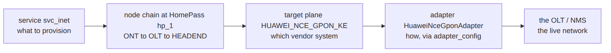
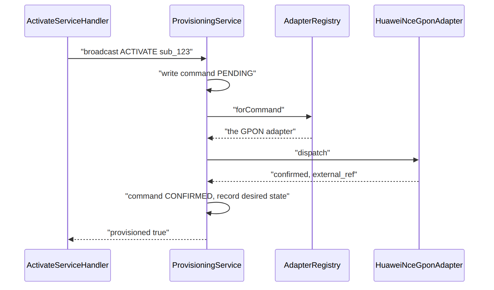
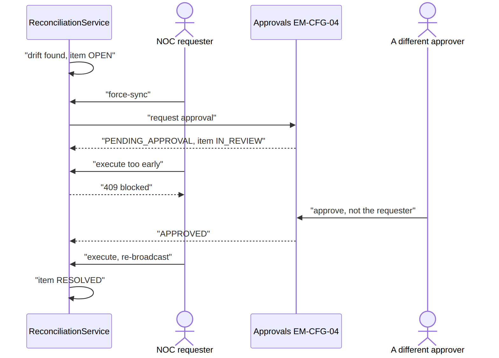
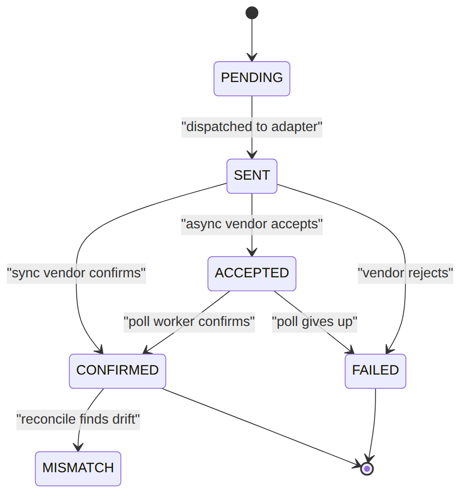
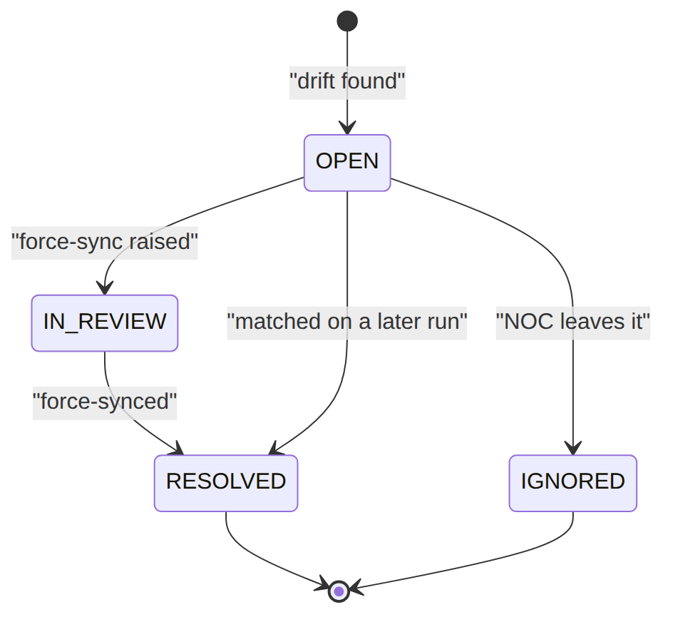
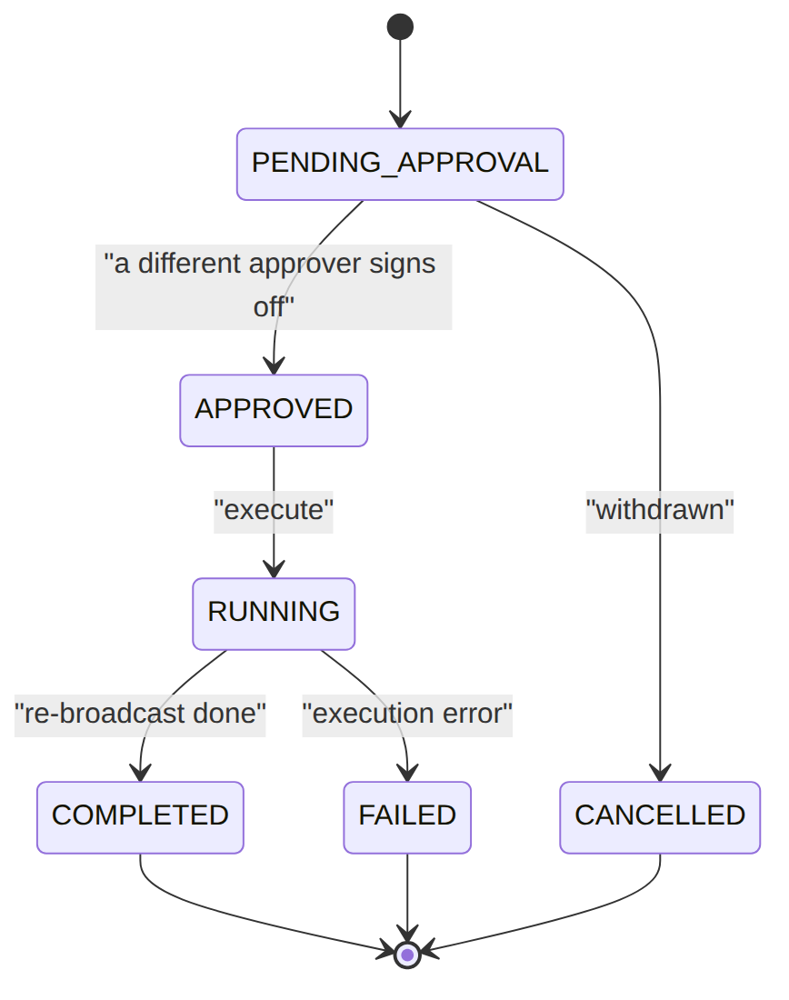

> 📱 **Rendered view** — diagrams below are images so they show in the GitHub app. Editable source (with mermaid): [`../provisioning.md`](../provisioning.md).

# Provisioning — As-Built Design (Network Broadcast & Reconciliation)

> **Capability codes:** PROV-INT-01 · **Module path:** `Modules/Provisioning` (topology in
> `Modules/Catalog`) · **Tests:** `ProvisioningTest`, `ReconciliationTest`, `AdapterRoutingTest`

> **⭐ The vendor-binding module.** Every real NMS/OLT/CMTS/VoIP integration plugs in here behind one
> interface. Understand §2.1 (the path) and §4 (the adapter contract) cold.

## 1. Purpose & boundaries
- **Owns:** the **command ledger**, **desired-vs-observed reconciliation**, governed **force-sync**,
  and the **adapter registry** routing each command to its vendor plane.
- **Does NOT own:** *what* to provision (Subscription), the premises/plant topology (Catalog
  `homepass`/`network_node`), the vendor protocol (the adapter, at deployment).
- **Job:** push BSS-desired state to the network via a swappable per-target adapter, detect drift,
  let NOC correct it — all audited.

## 2.1 ⭐ How a service binds to vendor technology — the path
```
Subscription (sub_123, package_ref=pkg_triple)                 ← WHAT the customer bought
 └ service (svc_inet, provisioner_key, network_profile_shape={speed,vlan})   ← the provisionable unit
     served at HomePass (hp_1), at the leaf of the node chain (GPON):
        ONT(ONT-77) → FAT(F12) → SPLITTER(S1H) → OLT(OLT-NRB-WTL-01) → HEADEND → NMS
   ProvisioningService.broadcast('sub_123','ACTIVATE',[{ target_code, service_ref, desired_state }])
     → provisioning_command{ target_code=HUAWEI_NCE_GPON_KE,    ← WHICH vendor plane (matches the serving OLT)
                             service_ref=svc_inet,
                             desired_state={desiredStatus:ACTIVE, speedProfile:'100M', vlan:101} }
     → dispatch() → AdapterRegistry.forCommand(): adapter_config[target].adapter_class
                       → new HuaweiNceGponAdapter()             ← HOW (the only code a vendor needs)
     → adapter.dispatch(): session to the OLT, subscriber_key="sub_123:svc_inet", returns external_ref
     → recordDesiredState() → provisioning_desired_state        ← the reconcile baseline
```
**In words:** the **service** (what) + the **HomePass/node path** (where) pick a **target plane** (which
vendor system); **adapter_config** binds that plane to a **ProvisioningAdapter** (how); the adapter
addresses the subscriber by **subscriber_key** and pushes **desired_profile**. Swap `adapter_class` →
the same command drives a different vendor, **no platform change**.

**The same path as a picture** — read it left to right as *what → where → which → how → network*:




## 📖 Scenarios (service + Foundation involvement)

### 1. Activate internet on a sync GPON OLT

**The story in plain English:** A customer's subscription goes live, so we have to tell the network. We
write down the command we are about to send, pick the right vendor adapter for that OLT, send it, and the
OLT confirms straight away. We record that it worked and remember the desired state so we can later check
the network still matches.

**Who does what:**
1. `ActivateServiceHandler` (a Subscription workflow step, **Foundation/Workflow**) calls
   `ProvisioningService::broadcast('sub_123','ACTIVATE',[…])`.
2. `broadcast` writes a `provisioning_command` (`PENDING`).
3. `dispatch()` resolves the Huawei adapter via `ProvisioningAdapterRegistry::forCommand`.
4. `adapter.dispatch` confirms inline → command `CONFIRMED`, `external_ref` stored, a
   `provisioning_command_attempt` (`SUCCESS`) logged.
5. `recordDesiredState()` writes the reconcile baseline; emits `ProvisioningCommandConfirmed` to the
   **outbox**. Handler returns `provisioned:true`; the subscription flow commits ACTIVE.




*(AdapterRoutingTest: a GPON command resolves the GPON adapter.)*

### 2. Activate on an async OLT (accept → poll → confirm)

**The story in plain English:** Some vendors do not answer immediately — they just say "got it, working
on it". The command sits in an *accepted* state and the subscription flow waits. A small worker checks
back every few minutes until the vendor reports it is really done.

**Who does what:** same broadcast, but `adapter_config.execution_mode_default=ASYNC_ACCEPTED`.
`adapter.dispatch` returns **accepted** → command `ACCEPTED` (`external_ref` set), and the flow's
`ActivateServiceHandler` sees not-yet-confirmed. The scheduled worker `sophix:provisioning:poll-async` (a
**Foundation/Console** scheduled command, every 5 min) calls `adapter.pollStatus` → `CONFIRMED`. The
parked workflow advances on the next tick. *Shows: async vendors + the poll worker resolving terminal
state.*

### 3. Speed change (MODIFY) mid-cycle
A subscription upgrade flow broadcasts `action:MODIFY` with `desired_state.speedProfile:'200M'`.
`dispatch` pushes it; `recordDesiredState` **updates** the existing `provisioning_desired_state`
(`updateOrCreate` on subscriber_key) so the new profile is the reconcile baseline. *Shows: the same
seam handles changes, and desired-state is the single baseline.*

### 4. Account suspended in ILM → the network follows (cross-module via the outbox)

**The story in plain English:** When a customer's account is suspended (say for non-payment) in another
module, the network should follow without anyone re-typing anything. The account-status change ripples
out through the event backbone and every service that customer had provisioned gets re-pushed as
suspended.

**Who does what:** ILM `AccountService` emits
`CustomerAccountStatusChanged{affectsProvisioning:true,status:INACTIVE}` to the **outbox**.
`sophix:outbox:dispatch` fires `OutboxEventPublished` → `SyncProvisioningOnAccountStatusChanged` looks up
the account's subscriptions and **re-broadcasts** each provisioned target at `SUSPENDED` (action
`ACCOUNT_STATUS_SYNC`). *Shows: a domain event in one module driving provisioning, the whole Foundation
event backbone (R-ILM-S-3).* *(ReconciliationTest::test_account_status_change_syncs_provisioning.)*

### 5. Terminate → desired NOT_PRESENT
Termination broadcasts `action:DEACTIVATE`, `desired_state.desiredStatus:NOT_PRESENT`.
`recordDesiredState` sets `desired_status=NOT_PRESENT` — so reconciliation now expects the subscriber
to **not exist** on the plane, and a still-present subscriber is flagged as drift. *Shows: enum-driven
behaviour (NOT_PRESENT inverts the reconcile check).*

### 6. Reconcile — clean run (no drift)
`sophix:provisioning:reconcile` (hourly) → `ReconciliationService::run()` loads each
`provisioning_desired_state`, calls `adapter.fetchObserved(target, subscriber_key, …)`, upserts
`provisioning_observed_state`, and compares. All match → run `COMPLETED`, `mismatch_count=0`, any
prior OPEN items auto-resolve (`MATCHED_SINCE`). Emits `ProvisioningReconciliationRunCompleted`.
*(ReconciliationTest::test_clean_reconciliation_has_no_mismatch.)*

### 7. Reconcile drift → force-sync (EM-CFG-04 + SoD)

**The story in plain English:** Reconciliation finds the network and the BSS disagree — the OLT says a
subscriber is active when we wanted them suspended. The system never quietly fixes this itself; that
would be risky. Instead it opens a drift item for a human in the NOC. To push a correction, the NOC asks
for it, and a *different* person must approve it before it runs — two pairs of eyes on anything that
touches the live network.

**Who does what:**
1. A target reports `SUSPENDED` while desired is `ACTIVE` → `run()` opens a
   `provisioning_reconciliation_item` (`OPEN`) and emits `…ItemOpened`; it does **not** auto-fix
   (R-PROV-08).
2. NOC `POST …/items/{item}/force-sync` → `requestForceSync` opens an **EM-CFG-04**
   (`Foundation/Approvals`) request → force-sync `PENDING_APPROVAL`, item `IN_REVIEW`.
3. Trying to execute before approval → **409**.
4. A **different** approver `…/approve` (SoD: requester can't self-approve) → APPROVED.
5. `…/execute` re-broadcasts the desired state; item `RESOLVED`.




*(ReconciliationTest::test_drift_opens_item_and_force_sync_resolves.)*

### 8. Vendor rejects the command → retry → give up
`adapter.dispatch` returns `failed` (or throws) → command `FAILED`, a `provisioning_command_attempt`
(`FAILED_RETRYABLE`, `error_code`) logged. The retry policy (`adapter_config.retry_policy_json
{baseSeconds:30, factor:2}`) backs off; persistent failure → `FAILED_FINAL`. *Shows: the attempt
ledger + per-target retry policy as the resilience seam.*

### 9. Bind a real vendor (the deployment task — config only)
Implement `class HuaweiNceGponAdapter implements ProvisioningAdapter` (§4), seed one
`provisioning_adapter_config{target_code, adapter_class:HuaweiNceGponAdapter::class}` row. Every
command for that target now drives the OLT. **No platform code change.**

## 2. Data model — ≥4 **complete** sample rows + readings per table
> **Completeness:** each row lists **every domain column** (nullables shown as `null`). The surrogate
> primary key shown is the real one; `created_at`/`updated_at` are omitted by convention.
>
> **The path lives in Catalog, not here (one owner per table).** `network_node` (the plant tree) and
> `homepass` (the premises — including its `network_path`, `service_management_endpoints` and
> `services_supported`) are **Catalog-owned** and documented in **[`catalog.md`](catalog.md)**.
> Provisioning **reads** them to resolve a service → serving node → target plane (see §2.1 above); they
> are deliberately **not** re-sampled here to avoid drift. The tables below are the ones Provisioning
> **owns**.

### `provisioning_target` (the vendor plane) · `type`: `GPON|HFC|VOIP|NMS`
```json
{ "target_code":"HUAWEI_NCE_GPON_KE","operator_code":"WIK","type":"GPON","name":"Huawei NCE GPON","endpoint":"https://nce.wik:18002","active":true }
{ "target_code":"CMTS_HFC_KE","operator_code":"WIK","type":"HFC","name":"Casa CMTS (Clearcable NOMS)","endpoint":"https://noms.wik","active":true }
{ "target_code":"SIP_VOICE_KE","operator_code":"WIK","type":"VOIP","name":"VoipSwitch","endpoint":"sip://vs.wik","active":true }
{ "target_code":"DEFAULT_NMS","operator_code":"WIK","type":"NMS","name":"Default NMS","endpoint":null,"active":true }
```
**Read each row as a sentence — *this data means this:***

| Row | What it means in plain English |
|-----|--------------------------------|
| **HUAWEI_NCE_GPON_KE** | The live **GPON** plane (`type=GPON`, `active=true`) — where internet provisioning lands, reachable at its `endpoint`. |
| **CMTS_HFC_KE** | The live **HFC/cable** plane (`type=HFC`) — where cable-modem services land. |
| **SIP_VOICE_KE** | The live **VOIP** plane (`type=VOIP`) — where voice lines land. |
| **DEFAULT_NMS** | The catch-all **NMS** plane (`type=NMS`, `endpoint=null`) that the POC seeds point at when no real vendor applies. |

A triple-play subscription touches several of these (internet→GPON, voice→VOIP); there's one plane per technology.

### `provisioning_adapter_config` (⭐ the vendor binding) · `execution_mode_default`: `SYNC_REQUIRED|ASYNC_ACCEPTED` · `status`: `ACTIVE|SUSPENDED`
```json
{ "adapter_config_id":"pac_1","operator_code":"WIK","provisioner_key":"GPON_INET","target_code":"HUAWEI_NCE_GPON_KE","adapter_class":"…\\HuaweiNceGponAdapter","execution_mode_default":"ASYNC_ACCEPTED","timeout_ms":25000,"max_retry_count":5,"retry_policy_json":{"baseSeconds":30,"factor":2},"status":"ACTIVE" }
{ "adapter_config_id":"pac_2","operator_code":"WIK","provisioner_key":null,"target_code":"SIP_VOICE_KE","adapter_class":"…\\SipVoiceAdapter","execution_mode_default":"SYNC_REQUIRED","timeout_ms":15000,"max_retry_count":3,"retry_policy_json":null,"status":"ACTIVE" }
{ "adapter_config_id":"pac_3","operator_code":"WIK","provisioner_key":null,"target_code":"DEFAULT_NMS","adapter_class":"…\\StubProvisioningAdapter","execution_mode_default":"SYNC_REQUIRED","timeout_ms":25000,"max_retry_count":5,"retry_policy_json":null,"status":"ACTIVE" }
{ "adapter_config_id":"pac_4","operator_code":"WIK","provisioner_key":null,"target_code":"CMTS_HFC_KE","adapter_class":"…\\CasaCmtsAdapter","execution_mode_default":"ASYNC_ACCEPTED","timeout_ms":40000,"max_retry_count":8,"retry_policy_json":{"baseSeconds":60,"factor":2},"status":"SUSPENDED" }
```
**Read each row as a sentence — *this data means this:***

| Row | What it means in plain English |
|-----|--------------------------------|
| **pac_1** | Binds the GPON plane to the **Huawei NCE adapter** for a specific service (`provisioner_key=GPON_INET`); it's **async** (`execution_mode_default=ASYNC_ACCEPTED`, so commands sit ACCEPTED until polled) and **ACTIVE**, with its own timeout/retry knobs. |
| **pac_2** | Binds the voice plane to the **SIP adapter**, **synchronously** (`SYNC_REQUIRED`, so commands confirm inline) — `provisioner_key=null` means it applies to the whole target. |
| **pac_3** | The **default seed**: the NMS plane bound to the **stub adapter** (sync), so flows run with **no real hardware**. |
| **pac_4** | The CMTS/HFC binding, but **SUSPENDED** (`status=SUSPENDED`) — that plane is parked (e.g. maintenance) and the registry treats it as unavailable. |

**The columns that did that work:**
- **The swappable seam** = `adapter_class` — change it to repoint a plane; the optional `provisioner_key` refines the binding to a specific PLM service provisioner.
- **Sync vs async** = `execution_mode_default` (`ASYNC_ACCEPTED` ⇒ commands sit `ACCEPTED` until the poll worker confirms).
- **Availability & resilience** = `status` parks a plane; `timeout_ms`/`max_retry_count`/`retry_policy_json` are the per-target knobs.

### `provisioning_desired_state` (the reconcile baseline) · `desired_status`: `ACTIVE|SUSPENDED|RESTRICTED|TERMINATED|NOT_PRESENT`
```json
{ "desired_state_id":"pds_1","operator_code":"WIK","subscription_id":"sub_123","customer_id":"cust_50","homepass_id":"hp_1","service_ref":"svc_inet","target_code":"HUAWEI_NCE_GPON_KE","subscriber_key":"sub_123:svc_inet","desired_status":"ACTIVE","desired_profile":{"speedProfile":"100M","vlan":101},"source_module":"Subscription","source_ref":"subop_991","effective_from":"2026-06-20T09:00:00Z" }
{ "desired_state_id":"pds_2","operator_code":"WIK","subscription_id":"sub_123","customer_id":"cust_50","homepass_id":"hp_1","service_ref":"svc_voice","target_code":"SIP_VOICE_KE","subscriber_key":"sub_123:svc_voice","desired_status":"ACTIVE","desired_profile":{"callerId":true},"source_module":"Subscription","source_ref":"subop_991","effective_from":"2026-06-20T09:00:00Z" }
{ "desired_state_id":"pds_3","operator_code":"WIK","subscription_id":"sub_9","customer_id":"cust_12","homepass_id":"hp_7","service_ref":"svc_inet","target_code":"HUAWEI_NCE_GPON_KE","subscriber_key":"sub_9:svc_inet","desired_status":"SUSPENDED","desired_profile":{},"source_module":"Ilm","source_ref":"acct_status_sync","effective_from":"2026-06-18T00:00:00Z" }
{ "desired_state_id":"pds_4","operator_code":"WIK","subscription_id":"sub_7","customer_id":"cust_8","homepass_id":null,"service_ref":"svc_inet","target_code":"HUAWEI_NCE_GPON_KE","subscriber_key":"sub_7:svc_inet","desired_status":"NOT_PRESENT","desired_profile":{},"source_module":"Subscription","source_ref":"term_55","effective_from":"2026-06-15T00:00:00Z" }
```
**Read each row as a sentence — *this data means this:***

| Row | What it means in plain English |
|-----|--------------------------------|
| **pds_1** | BSS wants sub_123's **internet** service **ACTIVE** on the GPON plane at the 100M/vlan-101 profile — the baseline reconcile checks the network against. |
| **pds_2** | The **same subscription's voice** service, wanted **ACTIVE** on the VOIP plane (`desired_profile.callerId=true`) — same `source_ref=subop_991`, i.e. the other half of one triple-play activation. |
| **pds_3** | BSS wants sub_9's internet **SUSPENDED** (`desired_status=SUSPENDED`, set by the `Ilm` account-status sync) — reconcile expects the plane to report SUSPENDED. |
| **pds_4** | BSS wants sub_7 **gone** (`desired_status=NOT_PRESENT`, `homepass_id=null`, from a termination) — the subscriber should be **absent**, so a present subscriber here is drift. |

**The columns that did that work:**
- **One baseline per** = (`subscription_id`, `service_ref`, `target_code`) keyed by `subscriber_key`; `desired_status` + `desired_profile` are what the network should match.
- **Provenance** = `source_module`/`source_ref` record who set the baseline (Subscription activation vs Ilm status sync vs termination).

### `provisioning_command` (the dispatch ledger) · `action`: `ACTIVATE|MODIFY|DEACTIVATE|SUSPEND|RESUME` · `status`: `PENDING→SENT→CONFIRMED|ACCEPTED|FAILED|MISMATCH` · `execution_mode`: `SYNC|ASYNC_ACCEPTED`
```json
{ "command_id":"pcmd_1","operator_code":"WIK","broadcast_id":"bcast_1","subscription_id":"sub_123","service_ref":"svc_inet","action":"ACTIVATE","target_code":"HUAWEI_NCE_GPON_KE","desired_state":{"desiredStatus":"ACTIVE","speedProfile":"100M"},"observed_state":null,"status":"CONFIRMED","external_ref":"NMS-AB12","request":{"op":"create-sub"},"response":{"ok":true},"attempts":1,"last_error":null,"correlation_id":"corr_77","sent_at":"2026-06-20T09:00:01Z","confirmed_at":"2026-06-20T09:00:02Z","execution_mode":"SYNC","accepted_at":null }
{ "command_id":"pcmd_2","operator_code":"WIK","broadcast_id":"bcast_1","subscription_id":"sub_123","service_ref":"svc_voice","action":"ACTIVATE","target_code":"SIP_VOICE_KE","desired_state":{"desiredStatus":"ACTIVE","callerId":true},"observed_state":null,"status":"ACCEPTED","external_ref":"VS-7781","request":{"op":"add-line"},"response":{"queued":true},"attempts":1,"last_error":null,"correlation_id":"corr_77","sent_at":"2026-06-20T09:00:01Z","confirmed_at":null,"execution_mode":"ASYNC_ACCEPTED","accepted_at":"2026-06-20T09:00:01Z" }
{ "command_id":"pcmd_3","operator_code":"WIK","broadcast_id":"bcast_4","subscription_id":"sub_5","service_ref":"svc_inet","action":"ACTIVATE","target_code":"HUAWEI_NCE_GPON_KE","desired_state":{"desiredStatus":"ACTIVE","speedProfile":"1G"},"observed_state":null,"status":"FAILED","external_ref":null,"request":{"op":"create-sub"},"response":{"error":"profile unknown"},"attempts":3,"last_error":"OLT rejected: profile unknown","correlation_id":"corr_88","sent_at":"2026-06-20T10:00:00Z","confirmed_at":null,"execution_mode":"SYNC","accepted_at":null }
{ "command_id":"pcmd_4","operator_code":"WIK","broadcast_id":"bcast_9","subscription_id":"sub_9","service_ref":"svc_inet","action":"SUSPEND","target_code":"HUAWEI_NCE_GPON_KE","desired_state":{"desiredStatus":"SUSPENDED"},"observed_state":null,"status":"CONFIRMED","external_ref":"NMS-CD34","request":{"op":"suspend"},"response":{"ok":true},"attempts":1,"last_error":null,"correlation_id":"corr_90","sent_at":"2026-06-18T00:00:01Z","confirmed_at":"2026-06-18T00:00:02Z","execution_mode":"SYNC","accepted_at":null }
```
The command's own lifecycle — a sync vendor jumps straight to `CONFIRMED`; an async vendor parks at
`ACCEPTED` until the poll worker confirms it; a vendor rejection ends `FAILED`; reconciliation can later
flag a confirmed command's subscriber as `MISMATCH`:




**Read each row as a sentence — *this data means this:***

| Row | What it means in plain English |
|-----|--------------------------------|
| **pcmd_1** | An ACTIVATE of internet on the GPON plane that the vendor confirmed **inline** (`execution_mode=SYNC`, `status=CONFIRMED`, `confirmed_at` set) — done in one attempt. |
| **pcmd_2** | The voice half of the **same broadcast** (`broadcast_id=bcast_1`): the SIP vendor accepted it **async** (`execution_mode=ASYNC_ACCEPTED`, `status=ACCEPTED`, `accepted_at` set, `confirmed_at` still null) — waiting for the poll worker to confirm. |
| **pcmd_3** | An ACTIVATE that the OLT **rejected**: after retrying (`attempts=3`) it ended `FAILED` with `last_error="OLT rejected: profile unknown"` and no `external_ref`. |
| **pcmd_4** | A SUSPEND on the GPON plane, confirmed inline (`SYNC`, `CONFIRMED`) in one attempt. |

**The columns that did that work:**
- **Grouping** = `broadcast_id` groups the commands from one multi-plane action (pcmd_1 + pcmd_2 = one triple-play ACTIVATE).
- **Sync vs async outcome** = `execution_mode` + `status`; `confirmed_at` (sync) vs `accepted_at` then poll (async).
- **Failure & trace** = `attempts`/`last_error` record an exhausted retry; `correlation_id` threads back to the originating flow. The row is the audit of *what was sent to which plane and how it went*.

### `provisioning_command_attempt` (per-try audit) · `status`: `SUCCESS|FAILED_RETRYABLE|FAILED_FINAL|TIMEOUT`
> (`created_at` uses the DB default; omitted by convention along with the audit timestamps.)
```json
{ "attempt_id":"pcma_1","operator_code":"WIK","command_id":"pcmd_1","attempt_no":1,"adapter_class":"…\\HuaweiNceGponAdapter","status":"SUCCESS","response_payload":{"externalRef":"NMS-AB12"},"vendor_status_code":"OK","duration_ms":420,"error_code":null }
{ "attempt_id":"pcma_2","operator_code":"WIK","command_id":"pcmd_3","attempt_no":1,"adapter_class":"…\\HuaweiNceGponAdapter","status":"FAILED_RETRYABLE","response_payload":{"err":"busy"},"vendor_status_code":"503","duration_ms":1500,"error_code":"ADAPTER_REJECTED" }
{ "attempt_id":"pcma_3","operator_code":"WIK","command_id":"pcmd_3","attempt_no":3,"adapter_class":"…\\HuaweiNceGponAdapter","status":"FAILED_FINAL","response_payload":{"err":"profile unknown"},"vendor_status_code":"422","duration_ms":1300,"error_code":"PROFILE_UNKNOWN" }
{ "attempt_id":"pcma_4","operator_code":"WIK","command_id":"pcmd_2","attempt_no":1,"adapter_class":"…\\SipVoiceAdapter","status":"TIMEOUT","response_payload":null,"vendor_status_code":null,"duration_ms":15000,"error_code":"VENDOR_TIMEOUT" }
```
**Read each row as a sentence — *this data means this:***

| Row | What it means in plain English |
|-----|--------------------------------|
| **pcma_1** | pcmd_1's single try **succeeded** (`status=SUCCESS`, `vendor_status_code=OK`) in **420 ms** — fast and clean. |
| **pcma_2** | pcmd_3's **first** try was a **retryable** failure (`attempt_no=1`, `status=FAILED_RETRYABLE`, vendor 503 "busy", `error_code=ADAPTER_REJECTED`). |
| **pcma_3** | pcmd_3's **third** try **finally gave up** (`attempt_no=3`, `status=FAILED_FINAL`, vendor 422, `error_code=PROFILE_UNKNOWN`) — this is why the command ended FAILED. |
| **pcma_4** | pcmd_2's try **timed out** (`status=TIMEOUT`, `error_code=VENDOR_TIMEOUT`) after a full **15000 ms** — no vendor response at all. |

**The columns that did that work:**
- **Per-try outcome** = `attempt_no` + `status`; `error_code`/`vendor_status_code` say *why* and *who* rejected it.
- **Timing** = `duration_ms` flags the slow TIMEOUT (15 s) vs a ~0.4 s success — invaluable for vendor-integration debugging.

### `provisioning_observed_state` (last poll — mirror of what the plane reports)
```json
{ "observed_state_id":"pos_1","operator_code":"WIK","target_code":"HUAWEI_NCE_GPON_KE","subscriber_key":"sub_123:svc_inet","observed_status":"ACTIVE","observed_profile":{"speedProfile":"100M"},"source_run_id":"prr_1","collected_at":"2026-06-21T01:00:00Z" }
{ "observed_state_id":"pos_2","operator_code":"WIK","target_code":"HUAWEI_NCE_GPON_KE","subscriber_key":"sub_9:svc_inet","observed_status":"ACTIVE","observed_profile":{},"source_run_id":"prr_1","collected_at":"2026-06-21T01:00:00Z" }
{ "observed_state_id":"pos_3","operator_code":"WIK","target_code":"SIP_VOICE_KE","subscriber_key":"sub_123:svc_voice","observed_status":"ACTIVE","observed_profile":{"callerId":true},"source_run_id":"prr_1","collected_at":"2026-06-21T01:00:00Z" }
{ "observed_state_id":"pos_4","operator_code":"WIK","target_code":"HUAWEI_NCE_GPON_KE","subscriber_key":"sub_7:svc_inet","observed_status":null,"observed_profile":null,"source_run_id":"prr_1","collected_at":"2026-06-21T01:00:00Z" }
```
**Read each row as a sentence — *this data means this:***

| Row | What it means in plain English |
|-----|--------------------------------|
| **pos_1** | The GPON plane reports sub_123's internet as **ACTIVE** at 100M — **matches** its desired row (pds_1), so it's clean. |
| **pos_2** | The GPON plane reports sub_9's internet as **ACTIVE** — but pds_3 wants it **SUSPENDED**, so this row **is drift**. |
| **pos_3** | The VOIP plane reports sub_123's voice as **ACTIVE** with caller-ID — **matches** pds_2, clean. |
| **pos_4** | The GPON plane reports **nothing** for sub_7 (`observed_status=null`) — which **matches** pds_4's `NOT_PRESENT`, so absence is the *correct* observation here. |

**The columns that did that work:**
- **One mirror row per** = (`target_code`, `subscriber_key`), upserted each run; `source_run_id`/`collected_at` show which pass wrote it.
- **Drift** = comparing `observed_status`/`observed_profile` against the matching desired row; a `null` observation means absent, which only counts as drift if the desired row wanted the subscriber present.

### `provisioning_reconciliation_run` (one pass) · `scope_type`: `FULL_TARGET|REGION|SUBSCRIPTION|SERVICE_CLASS` · `status`: `RUNNING|COMPLETED|FAILED|PARTIAL`
```json
{ "run_id":"prr_1","operator_code":"WIK","target_code":"HUAWEI_NCE_GPON_KE","scope_type":"FULL_TARGET","scope_value":null,"status":"COMPLETED","desired_count":120,"observed_count":120,"mismatch_count":1,"started_at":"2026-06-21T01:00:00Z","completed_at":"2026-06-21T01:03:00Z" }
{ "run_id":"prr_2","operator_code":"WIK","target_code":null,"scope_type":"FULL_TARGET","scope_value":null,"status":"RUNNING","desired_count":0,"observed_count":0,"mismatch_count":0,"started_at":"2026-06-21T02:00:00Z","completed_at":null }
{ "run_id":"prr_3","operator_code":"WIK","target_code":"HUAWEI_NCE_GPON_KE","scope_type":"SUBSCRIPTION","scope_value":"sub_9","status":"COMPLETED","desired_count":1,"observed_count":1,"mismatch_count":1,"started_at":"2026-06-20T12:00:00Z","completed_at":"2026-06-20T12:00:05Z" }
{ "run_id":"prr_4","operator_code":"WIK","target_code":"SIP_VOICE_KE","scope_type":"FULL_TARGET","scope_value":null,"status":"FAILED","desired_count":30,"observed_count":0,"mismatch_count":0,"started_at":"2026-06-21T01:00:00Z","completed_at":"2026-06-21T01:00:30Z" }
```
**Read each row as a sentence — *this data means this:***

| Row | What it means in plain English |
|-----|--------------------------------|
| **prr_1** | A **full sweep** of the GPON plane that **COMPLETED**: 120 desired = 120 observed, with **1 mismatch** found (`mismatch_count=1`). |
| **prr_2** | An **all-targets** pass (`target_code=null`) still **RUNNING** — counts are all zero because it hasn't finished. |
| **prr_3** | A **scoped** rerun of just `sub_9` (`scope_type=SUBSCRIPTION`, `scope_value=sub_9`), e.g. after a fix — COMPLETED with 1 mismatch. |
| **prr_4** | A full sweep of the SIP plane that **FAILED** — the plane was unreachable (`observed_count=0`), so **no mismatches were opened** (a failed fetch isn't treated as drift). |

**The columns that did that work:**
- **Scope** = `scope_type` + `scope_value` (FULL_TARGET vs a single SUBSCRIPTION; `target_code=null` = all planes).
- **Result** = `status` plus the `desired_count`/`observed_count`/`mismatch_count` tallies; a `FAILED` run with `observed_count=0` opens nothing.

### `provisioning_reconciliation_item` (one mismatch) · `status`: `OPEN|RESOLVED|IGNORED` (UI surfaces `IN_REVIEW` once a force-sync is raised) · `resolution`: `FORCE_SYNCED|MANUAL|MATCHED_SINCE`
```json
{ "item_id":"pri_1","operator_code":"WIK","run_id":"prr_1","target_code":"HUAWEI_NCE_GPON_KE","subscription_id":"sub_9","service_ref":"svc_inet","subscriber_key":"sub_9:svc_inet","desired_status":"SUSPENDED","observed_status":"ACTIVE","diff":{"desiredStatus":"SUSPENDED","observedStatus":"ACTIVE"},"status":"OPEN","resolution":null,"resolved_by":null,"resolved_at":null }
{ "item_id":"pri_2","operator_code":"WIK","run_id":"prr_3","target_code":"HUAWEI_NCE_GPON_KE","subscription_id":"sub_5","service_ref":"svc_inet","subscriber_key":"sub_5:svc_inet","desired_status":"ACTIVE","observed_status":"SUSPENDED","diff":{"desiredStatus":"ACTIVE","observedStatus":"SUSPENDED"},"status":"RESOLVED","resolution":"FORCE_SYNCED","resolved_by":"u_noc2","resolved_at":"2026-06-20T12:30:00Z" }
{ "item_id":"pri_3","operator_code":"WIK","run_id":"prr_1","target_code":"HUAWEI_NCE_GPON_KE","subscription_id":"sub_3","service_ref":"svc_inet","subscriber_key":"sub_3:svc_inet","desired_status":"ACTIVE","observed_status":null,"diff":{"desiredStatus":"ACTIVE","observedStatus":null},"status":"IGNORED","resolution":"MANUAL","resolved_by":"u_noc1","resolved_at":"2026-06-21T08:00:00Z" }
{ "item_id":"pri_4","operator_code":"WIK","run_id":"prr_3","target_code":"HUAWEI_NCE_GPON_KE","subscription_id":"sub_9","service_ref":"svc_inet","subscriber_key":"sub_9:svc_inet","desired_status":"SUSPENDED","observed_status":"SUSPENDED","diff":null,"status":"RESOLVED","resolution":"MATCHED_SINCE","resolved_by":null,"resolved_at":"2026-06-20T13:00:00Z" }
```
A drift item's lifecycle — it opens `OPEN`, the UI shows `IN_REVIEW` once a force-sync is raised, and it
closes either `RESOLVED` (fixed or matched again on a later run) or `IGNORED` (a NOC decided to leave it):




**Read each row as a sentence — *this data means this:***

| Row | What it means in plain English |
|-----|--------------------------------|
| **pri_1** | **Live drift**, still `OPEN`: BSS wants SUSPENDED but the network shows ACTIVE (`diff` records both), no resolution yet. |
| **pri_2** | A drift that was **fixed by a force-sync**: `status=RESOLVED`, `resolution=FORCE_SYNCED`, signed off by `resolved_by=u_noc2`. |
| **pri_3** | A drift (observed `null`) that a **NOC chose to leave**: `status=IGNORED`, `resolution=MANUAL`, by `resolved_by=u_noc1`. |
| **pri_4** | An **auto-close**: a later run found desired==observed (`diff=null`), so the item resolved `MATCHED_SINCE` with **no human** (`resolved_by=null`). |

**The columns that did that work:**
- **What drifted** = `desired_status` vs `observed_status`, captured in `diff`.
- **How it closed** = `status` + `resolution` (`FORCE_SYNCED` = pushed a fix, `MANUAL` = NOC decided, `MATCHED_SINCE` = self-healed); `resolved_by`=null marks the automatic close.

### `provisioning_force_sync_request` · `sync_direction`: `BSS_TO_NETWORK|NETWORK_TO_BSS|MARK_IGNORE` · `status`: `PENDING_APPROVAL|APPROVED|RUNNING|COMPLETED|FAILED|CANCELLED`
```json
{ "force_sync_id":"pfs_1","operator_code":"WIK","source_item_id":"pri_1","subscription_id":"sub_9","service_ref":"svc_inet","target_code":"HUAWEI_NCE_GPON_KE","sync_direction":"BSS_TO_NETWORK","requested_action":"REAPPLY_PROFILE","status":"PENDING_APPROVAL","approval_request_id":"appr_77","requested_by_user_id":"u_noc1","approved_by_user_id":null,"command_id":null,"reason":null }
{ "force_sync_id":"pfs_2","operator_code":"WIK","source_item_id":"pri_2","subscription_id":"sub_5","service_ref":"svc_inet","target_code":"HUAWEI_NCE_GPON_KE","sync_direction":"BSS_TO_NETWORK","requested_action":"REAPPLY_PROFILE","status":"COMPLETED","approval_request_id":"appr_78","requested_by_user_id":"u_noc1","approved_by_user_id":"u_noc2","command_id":"pcmd_88","reason":null }
{ "force_sync_id":"pfs_3","operator_code":"WIK","source_item_id":"pri_3","subscription_id":"sub_3","service_ref":"svc_inet","target_code":"HUAWEI_NCE_GPON_KE","sync_direction":"NETWORK_TO_BSS","requested_action":null,"status":"APPROVED","approval_request_id":"appr_79","requested_by_user_id":"u_noc1","approved_by_user_id":"u_noc2","command_id":null,"reason":"network is source of truth here" }
{ "force_sync_id":"pfs_4","operator_code":"WIK","source_item_id":null,"subscription_id":null,"service_ref":null,"target_code":"HUAWEI_NCE_GPON_KE","sync_direction":"MARK_IGNORE","requested_action":null,"status":"CANCELLED","approval_request_id":null,"requested_by_user_id":"u_noc1","approved_by_user_id":null,"command_id":null,"reason":"expected during migration" }
```
A force-sync request's lifecycle — it waits `PENDING_APPROVAL`, a different approver moves it to
`APPROVED`, execution runs it (`RUNNING` then `COMPLETED`), or it is `CANCELLED`/`FAILED`:




**Read each row as a sentence — *this data means this:***

| Row | What it means in plain English |
|-----|--------------------------------|
| **pfs_1** | A request to **re-push BSS's desired** to the network (`sync_direction=BSS_TO_NETWORK`, `requested_action=REAPPLY_PROFILE`) for pri_1's drift — still **PENDING_APPROVAL** (`approval_request_id=appr_77`), no approver or command yet. |
| **pfs_2** | A completed BSS→network fix: **COMPLETED**, with the **separation-of-duties trail** (`requested_by_user_id=u_noc1` ≠ `approved_by_user_id=u_noc2`) and the corrective `command_id=pcmd_88` it produced. |
| **pfs_3** | A **NETWORK_TO_BSS** request (update BSS to match the network, "network is source of truth here"), already **APPROVED** but not yet run (`command_id=null`). |
| **pfs_4** | A **MARK_IGNORE** request (accept the diff rather than fix it), **CANCELLED** — withdrawn as "expected during migration" (not tied to a specific item, `source_item_id=null`). |

**The columns that did that work:**
- **Which way to sync** = `sync_direction` (`BSS_TO_NETWORK` re-pushes desired; `NETWORK_TO_BSS` updates BSS; `MARK_IGNORE` accepts the diff).
- **Approval & SoD** = `status` + `approval_request_id` (links the EM-CFG-04 decision); `requested_by_user_id` ≠ `approved_by_user_id` enforces separation of duties; `command_id` is the corrective command once it runs.

## 3. Services (worked calls)
| Service | Responsibility |
| --- | --- |
| `ProvisioningService` | `broadcast()`/`dispatch()`/`pollAsyncCommands()`/`recordDesiredState()` |
| `ProvisioningAdapterRegistry` | `forCommand($cmd)`/`forTarget($op,$code)` → the vendor adapter (the seam) |
| `ReconciliationService` | `run()`/`requestForceSync()`/`approveForceSync()` (EM-CFG-04)/`executeForceSync()` |

**`broadcast('sub_123','ACTIVATE',[$spec])`** → create command (`PENDING`) → `dispatch()` →
`forCommand` resolves adapter → `adapter.dispatch()` → confirmed/accepted/failed → log attempt →
`recordDesiredState()` on success.

## 4. ⭐ The vendor-adapter contract (`Contracts/ProvisioningAdapter`)
```php
interface ProvisioningAdapter {
  public function dispatch(ProvisioningCommand $command): ProvisioningResult;       // push desired_state to the vendor
  public function fetchObserved(string $targetCode, string $subscriberKey, string $desiredStatus, array $desiredProfile = []): ?array; // read back (null = not present)
  public function pollStatus(ProvisioningCommand $command): ?ProvisioningResult;    // resolve an ASYNC command (null = still pending)
}
```
`ProvisioningResult::confirmed(externalRef, response)` / `accepted(externalRef, response)` /
`failed(error, final)`. `StubProvisioningAdapter` is
the default (logs + mirrors desired; honours `forceFail`/`simulateAsync`/`simulateObservedStatus`/
`simulateNotPresent`). A real driver translates `command.desired_state` into the vendor API.

## 5. Integration (events) — topic `provisioning.command`
- **Emits:** `ProvisioningCommand{Sent,Confirmed,Failed}`, `ProvisioningReconciliation{RunCompleted,
  ItemOpened}`, `ProvisioningForceSync{Requested,Approved,Completed,Cancelled}`.
- **Consumes:** `SyncProvisioningOnAccountStatusChanged` (ILM `CustomerAccountStatusChanged`).

## 6. Processes (workers + handler)
- **Workers (`Foundation/Console` schedule):** `sophix:provisioning:poll-async` (5 min, resolve
  ACCEPTED via `pollStatus`), `:reconcile` (hourly).
- **Handler — `ActivateServiceHandler` (topic `provisioning.activate-service`):** reads the subscription
  business key + `packageRef` var + node `config` (`target`/`speedProfile`/`serviceRef`); does
  `broadcast('ACTIVATE')`; outputs `{provisioned, provisioningRefs}`; on fail
  `TaskResult::fail(retryable:true)`.

## 7. Policy & config
`provisioning_target` + `provisioning_adapter_config` (the connector binding), `retry_policy_json`,
EM-CFG-04 force-sync definition (seeded gated by default), Catalog topology (`network_node`,`homepass`).

## 8. Cross-module dependencies
- **Called by →** Subscription (`FulfillmentCallHandler`/`ActivateServiceHandler`), OSR
  (`ProvisionSwapHandler`), ILM (account-status sync).
- **Reads →** Catalog topology + service `network_profile_shape`/`provisioner_key` to shape `desired_profile`.
- **Connector seam →** vendor adapters (Huawei NCE, FiberHome UNM2000, Casa CMTS, VoipSwitch,
  Verimatrix) at deployment behind `ProvisioningAdapterRegistry`.

## 9. Invariants & rules
| Rule | Statement | Enforced in |
| --- | --- | --- |
| R-PROV-08 | a mismatch never auto-fixes; NOC drives force-sync | `ReconciliationService::run` |
| R-PROV-07 | destructive force-sync gated by EM-CFG-04 (SoD + audit) | `requestForceSync`/`approveForceSync` |
| §10.2 | each command dispatched through ITS target's adapter | `ProvisioningAdapterRegistry::forCommand` |
| §7.2 | ASYNC commands resolved by the poll worker | `pollAsyncCommands` + `pollStatus` |

## 10. Open items / deltas
- Force-sync EM-CFG-04 + account-status→provisioning cascade were wired during hardening.
- A **typed `desired_state` contract** + a **Headend/Hub routing model** (derive `target_code` from the
  HomePass node chain, not flow config) are the refinements for when real adapters land — today
  `target_code` comes from the flow node `config`.
- Only `StubProvisioningAdapter` ships; all vendor adapters are deployment connectors.
