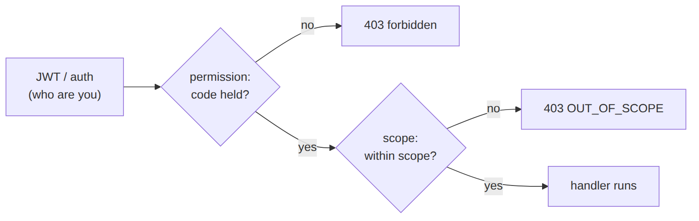
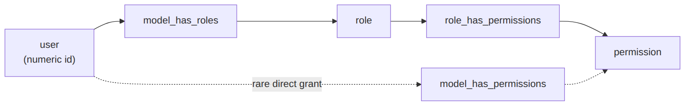
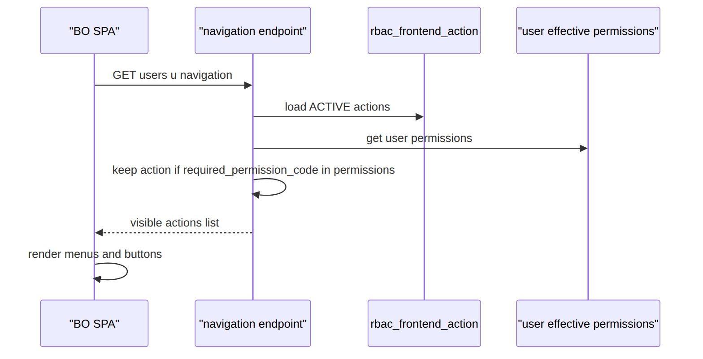

> 📱 **Rendered view** — diagrams below are images so they show in the GitHub app. Editable source (with mermaid): [`../rbac.md`](../rbac.md).

# RBAC — As-Built Design (EM-CFG-03)

> **Capability codes:** EM-CFG-03 (roles, permissions, scopes, frontend matrix) · **Module path:** `Modules/Rbac`
> **Tests:** `RbacApiTest`, `WorkOrderApiTest` (scope) · **Engine:** `spatie/laravel-permission` · **Guard:** `web` (single guard for both Inertia sessions and Sanctum API). **See `00_SPINE.md` §7.**

## 1. Purpose & boundaries
- **Owns:** the access model in four layers —
  1. **roles → permissions** (spatie: `roles`, `permissions`, `role_has_permissions`) — *what a role can do*,
  2. **user → role/permission** (spatie: `model_has_roles`, `model_has_permissions`) — *who has it*,
  3. **data scopes** (`rbac_user_scope_assignment`) — *where it applies* (operator/franchise/region/…),
  4. **the frontend action matrix** (`rbac_frontend_action` + `rbac_role_frontend_action`) — *what the UI shows*.
  Plus catalog **metadata** (`rbac_role_meta`, `rbac_permission_meta`) and an immutable **change audit**.
- **Does NOT own:** authentication (Sanctum/Keycloak via `SOPHIX_AUTH_DRIVER`). It answers *what can this
  principal do, where, and which UI actions to render* — never who they are.
- **Job:** "JWT → permission → scope" is the request guard; "permissions → frontend actions" is the UI guard.

> **Two questions this doc answers head-on:**
> **“Where do I set what a role can do?”** → the `role_has_permissions` pivot (§2), written by
> `PUT /api/rbac/roles/{code}/permissions` (`Role::syncPermissions`) at runtime or the `RbacSeeder` role
> matrix at bootstrap. **“Where are the UI actions?”** → `rbac_frontend_action` (the catalog) +
> `rbac_role_frontend_action` (role→action visibility), resolved per user by `GET …/navigation` (§2/§3).

**The big picture in plain English:** access has two guards. On every request the API asks three things in
order — *who are you* (the JWT/auth), *are you allowed to do this action* (the permission), and *does it apply
here* (the data scope). Separately, the UI asks a softer question — *which buttons and menus should I even
draw for this user* (the frontend actions). The UI guard is convenience only; the request guard is the real
security, and it re-checks every time.

**Guard order on a request — JWT → permission → scope:**




**The grant model — where a user gets what a role can do.** A user does not hold permissions directly (usually);
they hold roles, and roles hold permissions. Follow the pivots left-to-right:



A user's **effective permissions** = the union of `role_has_permissions` across all their `model_has_roles`
roles, plus any direct `model_has_permissions` grants.

## 📖 Scenarios (service + Foundation involvement)

### 1. Create a role and grant it permissions
`POST /api/rbac/roles {code:'DISPATCHER', permissions:['workorder.read','workorder.assign','fulfillment.read','workforce.read']}` →
`Role::findOrCreate('DISPATCHER','web')` + `syncPermissions(...)` writes the **`role_has_permissions`** rows
(the catalog grows: each unknown permission is `findOrCreate`d). Audited `ROLE_CREATED`.

### 2. Change what a role can do (the answer to “where”)
`PUT /api/rbac/roles/DISPATCHER/permissions {permissions:[…]}` → **`Role::syncPermissions`** replaces that
role's `role_has_permissions` rows. *Anti-escalation:* a non-`SUPER_ADMIN` actor **cannot grant a permission
they don't themselves hold** (`403 PERMISSION_CEILING`). Writes a `ROLE_PERMISSIONS_SYNCED` audit with
before/after. *This pivot is the single source of truth for “what a role can do”.*

### 3. Assign a role to a user
`POST /api/rbac/users/{u}/roles {roles:['DISPATCHER']}` → `User::syncRoles` writes **`model_has_roles`**
(`model_id` = the user's numeric `id`). *Anti-escalation ceiling:* only `SUPER_ADMIN` may grant
`SUPER_ADMIN`, and a non-super actor may only assign roles they hold. Audited `USER_ROLE_ASSIGNED`.

### 4. Permission check on a route
A route's `permission:workorder.assign` middleware (spatie, guard `web`) blocks a `CUSTOMER_CARE_AGENT`
(403) but passes a `DISPATCHER` — because DISPATCHER's `role_has_permissions` includes `workorder.assign`.

### 5. Scope gate allows within-region / blocks out-of-region
The region-scoped dispatcher `POST /api/work-orders {tech_region_id:'KE-NRB-KAREN'}` → after permission,
`scope:TECH_REGION,tech_region_id` (`EnforceScope`) → `withinScope` true → allowed. Posting
`KE-MSA-NYALI` → `withinScope` false → **403 OUT_OF_SCOPE**. *Proven by
`WorkOrderApiTest::test_tech_region_scope_gates_work_order_creation`.*

### 6. SUPER_ADMIN / GLOBAL bypass
A `SUPER_ADMIN` (or a GLOBAL/OPERATOR scope holder) bypasses the scope check entirely.

### 7. UI action visibility (the frontend matrix — “where are the UI actions”)

**The story in plain English:** When the back-office app loads, it asks the server "which menus and buttons
should I show this user?" The server keeps the list of all renderable actions and the permission each one
needs, then hands back only the ones this user's permissions unlock. So a dispatcher sees the "Assign
technician" button and a care agent doesn't — but this is only about drawing the screen, not about security.

**Who does what:** `GET /api/rbac/users/{u}/navigation` → loads `rbac_frontend_action` (ACTIVE), keeps each
action whose `required_permission_code` is in the user's **effective permissions**, returns
`{actionCode, type, displayName, app}`. So the **“Assign technician”** BUTTON
(`required_permission_code: workorder.assign`) renders for a DISPATCHER but is hidden for a
CUSTOMER_CARE_AGENT. The BO SPA calls this to build the menu and show/hide controls. *Visibility is UX,
never security — the API still enforces `permission:`/`scope:` regardless.*





### 8. Manage the frontend action catalog
`POST /api/rbac/frontend-actions {app_code, action_code, action_type:'BUTTON', display_name, required_permission_code}`
upserts an `rbac_frontend_action`; `rbac_role_frontend_action` is the precomputed role→action visibility matrix.

### 9. Effective access (debug/admin view)
`GET /api/rbac/users/{u}/effective-access` → `{roles, permissions (getAllPermissions), scopes}` — the
flattened answer to “what can this user actually do and where”.

### 10. Revoke a scope (audited)
`RbacScopeService::revoke` deactivates a scope (`active:false` + `effective_to`) + audits it; the user
immediately loses access to that region.

## 2. Data model — ≥4 complete sample rows + readings

### spatie `permissions` & `roles` (the catalogs, guard `web`)
```json
// permissions
{ "id":11,"name":"workorder.read","guard_name":"web" }
{ "id":12,"name":"workorder.assign","guard_name":"web" }
{ "id":21,"name":"fulfillment.read","guard_name":"web" }
{ "id":40,"name":"rbac.manage","guard_name":"web" }
// roles
{ "id":4,"name":"DISPATCHER","guard_name":"web" }
{ "id":2,"name":"BILLING_LEAD","guard_name":"web" }
{ "id":1,"name":"SUPER_ADMIN","guard_name":"web" }
{ "id":9,"name":"CUSTOMER_CARE_AGENT","guard_name":"web" }
```
**Read each row as a sentence — *this data means this:***

| Row | What it means in plain English |
|-----|--------------------------------|
| **perm #11** | A permission code named `workorder.read` exists in the catalog, on guard `web`. |
| **perm #12** | A permission code named `workorder.assign` exists, guard `web`. |
| **perm #21** | A permission code named `fulfillment.read` exists, guard `web`. |
| **perm #40** | A permission code named `rbac.manage` exists, guard `web`. |
| **role #4** | A role code named `DISPATCHER` exists, guard `web`. |
| **role #2** | A role code named `BILLING_LEAD` exists, guard `web`. |
| **role #1** | A role code named `SUPER_ADMIN` exists, guard `web`. |
| **role #9** | A role code named `CUSTOMER_CARE_AGENT` exists, guard `web`. |

**The columns that did the work:** just `id`, `name`, `guard_name` — everything is guard **`web`** (one guard serves both Inertia sessions and Sanctum tokens). These rows grant nothing on their own; the grants are the pivots below.

### `role_has_permissions` — ⭐ **WHAT A ROLE CAN DO** (set here)
```json
{ "role_id":4, "permission_id":11 }   // DISPATCHER → workorder.read
{ "role_id":4, "permission_id":12 }   // DISPATCHER → workorder.assign
{ "role_id":4, "permission_id":21 }   // DISPATCHER → fulfillment.read
{ "role_id":2, "permission_id":12 }   // BILLING_LEAD does NOT have this (illustrative absence) — only rows that exist are grants
```
**Read each row as a sentence — *this data means this:***

| Row | What it means in plain English |
|-----|--------------------------------|
| Row 1 | `role_id=4` (DISPATCHER) **can** `workorder.read` (`permission_id=11`) — the grant exists. |
| Row 2 | DISPATCHER **can** `workorder.assign` (`permission_id=12`). |
| Row 3 | DISPATCHER **can** `fulfillment.read` (`permission_id=21`). |
| Row 4 | `role_id=2` (BILLING_LEAD) paired with `permission_id=12` — shown only to illustrate **absence**: in real data only existing rows are grants, so to deny something you simply have no row for it. |

**The columns that did the work:** a row's mere existence (`role_id` + `permission_id`) **is** the grant — this pivot is the single source of truth for "what a role can do." You set/change it via `PUT /api/rbac/roles/{code}/permissions` → `Role::syncPermissions()` (replaces the role's rows, audited, with the anti-escalation ceiling), or at bootstrap via the `RbacSeeder` matrix (§7).

### `model_has_roles` — **USER → ROLE** (who has the role)
```json
{ "role_id":4, "model_type":"App\\Models\\User", "model_id":57 }   // user #57 IS a DISPATCHER
{ "role_id":2, "model_type":"App\\Models\\User", "model_id":57 }   // …and also BILLING_LEAD
{ "role_id":1, "model_type":"App\\Models\\User", "model_id":1 }    // user #1 is SUPER_ADMIN
{ "role_id":9, "model_type":"App\\Models\\User", "model_id":83 }   // user #83 is a care agent
```
**Read each row as a sentence — *this data means this:***

| Row | What it means in plain English |
|-----|--------------------------------|
| Row 1 | User #57 (`model_id`) **is a DISPATCHER** (`role_id=4`). |
| Row 2 | The same user #57 **is also a BILLING_LEAD** (`role_id=2`) — users can hold many roles. |
| Row 3 | User #1 **is SUPER_ADMIN** (`role_id=1`). |
| Row 4 | User #83 **is a CUSTOMER_CARE_AGENT** (`role_id=9`). |

**The columns that did the work:** `model_id` is the user's **numeric `id`** (the morph key), not `uid`; `model_type` is the morph class. Written by `User::syncRoles()`. A user's effective permissions = the union of `role_has_permissions` across all their roles here (+ any direct grants below).

### `model_has_permissions` — **USER → PERMISSION directly** (rare escape hatch)
```json
{ "permission_id":40, "model_type":"App\\Models\\User", "model_id":1 }    // user #1 granted rbac.manage directly
{ "permission_id":11, "model_type":"App\\Models\\User", "model_id":57 }   // a one-off grant outside any role
{ "permission_id":21, "model_type":"App\\Models\\User", "model_id":83 }
{ "permission_id":12, "model_type":"App\\Models\\User", "model_id":99 }
```
**Read each row as a sentence — *this data means this:***

| Row | What it means in plain English |
|-----|--------------------------------|
| Row 1 | User #1 was granted `rbac.manage` (`permission_id=40`) **directly**, outside any role. |
| Row 2 | User #57 has a **one-off** `workorder.read` grant (`permission_id=11`) not coming from a role. |
| Row 3 | User #83 was granted `fulfillment.read` (`permission_id=21`) directly. |
| Row 4 | User #99 was granted `workorder.assign` (`permission_id=12`) directly. |

**The columns that did the work:** `model_id` (the user) + `permission_id` — a direct grant that **bypasses roles**, used sparingly for exceptions. `getAllPermissions()` unions these with the role-derived ones.

### `rbac_role_meta` (role display/family/lifecycle — metadata, not a grant)
```json
{ "role_code":"DISPATCHER","operator_code":"GLOBAL","display_name":"Dispatcher","role_family":"FIELD_OPS","description":"Assigns and tracks field work","status":"ACTIVE","keycloak_role_name":"dispatcher" }
{ "role_code":"BILLING_LEAD","operator_code":"GLOBAL","display_name":"Billing Lead","role_family":"BILLING","description":"Billing supervisor","status":"ACTIVE","keycloak_role_name":"billing-lead" }
{ "role_code":"CVM_MANAGER","operator_code":"WIK","display_name":"CVM Manager","role_family":"COMMERCIAL","description":"Retention & offers","status":"ACTIVE","keycloak_role_name":null }
{ "role_code":"LEGACY_OPS","operator_code":"GLOBAL","display_name":"Legacy Ops","role_family":null,"description":"Decommissioned","status":"RETIRED","keycloak_role_name":null }
```
**Read each row as a sentence — *this data means this:***

| Row | What it means in plain English |
|-----|--------------------------------|
| **DISPATCHER** | A **platform** role (`operator_code=GLOBAL`) shown as "Dispatcher", grouped under `role_family=FIELD_OPS`, **ACTIVE**, and mirrored into the IdP as `dispatcher` (`keycloak_role_name`). |
| **BILLING_LEAD** | A platform role "Billing Lead", family `BILLING`, ACTIVE, mirrored as `billing-lead`. |
| **CVM_MANAGER** | A **WIK-only** role (`operator_code=WIK`) "CVM Manager", family `COMMERCIAL`, ACTIVE, with **no IdP mirror** (`keycloak_role_name=null`). |
| **LEGACY_OPS** | A platform role "Legacy Ops" that is **RETIRED** (`status`) with no family — hidden from the admin picker. |

**The columns that did the work:** this is metadata about a role code (the spatie `roles` row is the enforcement identity). `status=RETIRED` hides a role from the picker; `keycloak_role_name` mirrors it into the IdP when `SOPHIX_AUTH_DRIVER=keycloak`; `operator_code=GLOBAL` means a platform role.

### `rbac_permission_meta` (permission metadata — does NOT grant) · `risk_level`: `LOW|MEDIUM|HIGH|CRITICAL`
```json
{ "permission_code":"workorder.assign","module_code":"WorkOrder","action_group":"assignment","risk_level":"MEDIUM","description":"Assign a work order to a technician","scope_required":true,"status":"ACTIVE" }
{ "permission_code":"invoice.manage","module_code":"Billing","action_group":"billing","risk_level":"HIGH","description":"Manage invoices/credit notes","scope_required":false,"status":"ACTIVE" }
{ "permission_code":"customer.read","module_code":"Ilm","action_group":"customer","risk_level":"LOW","description":"Read customer records","scope_required":false,"status":"ACTIVE" }
{ "permission_code":"rbac.manage","module_code":"Rbac","action_group":"admin","risk_level":"CRITICAL","description":"Manage roles, permissions and scopes","scope_required":false,"status":"ACTIVE" }
```
**Read each row as a sentence — *this data means this:***

| Row | What it means in plain English |
|-----|--------------------------------|
| **workorder.assign** | A `MEDIUM`-risk WorkOrder permission ("Assign a work order to a technician") that **is region-scoped** — `scope_required=true`, so its routes should carry a `scope:` gate; ACTIVE. |
| **invoice.manage** | A `HIGH`-risk Billing permission ("Manage invoices/credit notes"), **not** scope-required, ACTIVE. |
| **customer.read** | A `LOW`-risk Ilm permission ("Read customer records"), not scope-required, ACTIVE. |
| **rbac.manage** | A `CRITICAL`-risk Rbac permission ("Manage roles, permissions and scopes") — its risk drives a re-auth/confirm prompt in the back office; ACTIVE. |

**The columns that did the work:** metadata **about** a permission, never a grant — `scope_required` flags which routes need a `scope:` gate, `risk_level` drives BO confirmation UX (CRITICAL prompts re-auth). Upserted via `PUT /api/rbac/permissions/{code}/meta`.

### `rbac_frontend_action` — ⭐ **THE UI ACTIONS CATALOG** · `action_type`: `MENU|SCREEN|BUTTON|TAB|FIELD`
```json
{ "frontend_action_id":"fea_1","app_code":"FE-APP-01","action_code":"backoffice.workorders","action_type":"MENU","display_name":"Work Orders","required_permission_code":"workorder.read","feature_flag":null,"status":"ACTIVE" }
{ "frontend_action_id":"fea_2","app_code":"FE-APP-01","action_code":"backoffice.workorders.assign","action_type":"BUTTON","display_name":"Assign technician","required_permission_code":"workorder.assign","feature_flag":null,"status":"ACTIVE" }
{ "frontend_action_id":"fea_3","app_code":"FE-APP-01","action_code":"backoffice.billing","action_type":"MENU","display_name":"Billing","required_permission_code":"invoice.read","feature_flag":null,"status":"ACTIVE" }
{ "frontend_action_id":"fea_4","app_code":"FE-APP-02","action_code":"selfcare.usage.tab","action_type":"TAB","display_name":"Usage","required_permission_code":null,"feature_flag":"usage_v2","status":"ACTIVE" }
```
**Read each row as a sentence — *this data means this:***

| Row | What it means in plain English |
|-----|--------------------------------|
| **fea_1** | A back-office (`app_code=FE-APP-01`) **MENU** item "Work Orders" whose visibility is gated by `required_permission_code=workorder.read`; ACTIVE, no feature flag. |
| **fea_2** | A back-office **BUTTON** "Assign technician" gated by `workorder.assign`; ACTIVE. |
| **fea_3** | A back-office **MENU** "Billing" gated by `invoice.read`; ACTIVE. |
| **fea_4** | A self-care (`FE-APP-02`) **TAB** "Usage" with **no permission gate** (`required_permission_code=null` = always visible) but hidden behind the `usage_v2` feature flag. |

**The columns that did the work:** one row per renderable element (`action_type`), keyed by `action_code`, scoped to a frontend `app_code` (FE-APP-01 back-office, FE-APP-02 self-care); `required_permission_code` gates visibility (null = always visible) and `feature_flag` hides it behind a rollout. **Visibility ≠ security:** the API still enforces the permission server-side — this only controls what the SPA renders. Managed via `GET/POST /api/rbac/frontend-actions`.

### `rbac_role_frontend_action` — role → UI action visibility matrix (precomputed)
```json
{ "role_action_id":"rfa_1","role_code":"DISPATCHER","frontend_action_id":"fea_1","visible":true }    // sees Work Orders menu
{ "role_action_id":"rfa_2","role_code":"DISPATCHER","frontend_action_id":"fea_2","visible":true }    // …and the Assign button
{ "role_action_id":"rfa_3","role_code":"CUSTOMER_CARE_AGENT","frontend_action_id":"fea_2","visible":false } // care agent: button hidden
{ "role_action_id":"rfa_4","role_code":"BILLING_LEAD","frontend_action_id":"fea_3","visible":true }   // sees Billing menu
```
**Read each row as a sentence — *this data means this:***

| Row | What it means in plain English |
|-----|--------------------------------|
| **rfa_1** | `DISPATCHER` **sees** the `fea_1` action (Work Orders menu) — `visible=true`. |
| **rfa_2** | `DISPATCHER` **sees** `fea_2` (the Assign-technician button). |
| **rfa_3** | `CUSTOMER_CARE_AGENT` has `fea_2` **explicitly hidden** (`visible=false`) — the Assign button is pinned off for care agents. |
| **rfa_4** | `BILLING_LEAD` **sees** `fea_3` (Billing menu). |

**The columns that did the work:** a `role_code`+`frontend_action_id`+`visible` triple — this is the **precomputed** role→action matrix, an admin-tunable override of the live `GET …/navigation` derivation (which otherwise infers visibility from each action's `required_permission_code` vs the user's permissions). `visible=false` explicitly hides an action for a role.

### `rbac_user_scope_assignment` — **WHERE access applies** · `scope_type`: `GLOBAL|OPERATOR|FRANCHISE|TECH_REGION|CONTRACTOR|TEAM|CHANNEL`
```json
{ "scope_assignment_id":"usa_1","operator_code":"WIK","auth_user_id":"u_1","scope_type":"TECH_REGION","scope_value":"KE-NRB-KAREN","scope_label":"Karen","effective_from":"2026-06-01T00:00:00Z","effective_to":null,"active":true,"created_by_user_id":"admin_1" }
{ "scope_assignment_id":"usa_2","operator_code":"WIK","auth_user_id":"u_2","scope_type":"OPERATOR","scope_value":"WIK","scope_label":"Wik Telecom","effective_from":null,"effective_to":null,"active":true,"created_by_user_id":"admin_1" }
{ "scope_assignment_id":"usa_3","operator_code":"WIK","auth_user_id":"u_3","scope_type":"GLOBAL","scope_value":"*","scope_label":null,"effective_from":null,"effective_to":null,"active":true,"created_by_user_id":"admin_1" }
{ "scope_assignment_id":"usa_4","operator_code":"WIK","auth_user_id":"u_1","scope_type":"TECH_REGION","scope_value":"KE-MSA-NYALI","scope_label":"Nyali","effective_from":"2026-06-01T00:00:00Z","effective_to":"2026-06-15T00:00:00Z","active":false,"created_by_user_id":"admin_2" }
```
**Read each row as a sentence — *this data means this:***

| Row | What it means in plain English |
|-----|--------------------------------|
| **usa_1** | User `u_1` is scoped to the **Karen tech region** (`scope_type=TECH_REGION`, `scope_value=KE-NRB-KAREN`) — `active=true`, no end date (`effective_to=null`). |
| **usa_2** | User `u_2` is scoped to the **whole WIK operator** (`scope_type=OPERATOR`, `scope_value=WIK`), active. |
| **usa_3** | User `u_3` has **platform-wide** scope (`scope_type=GLOBAL`, `scope_value=*`), active. |
| **usa_4** | User `u_1` once had the **Nyali** region too, but it's **revoked** — `active=false` with an `effective_to` (2026-06-15) in the past. |

**The columns that did the work:** this is the **data-scope** axis (permission says *what*, scope says *where*). `withinScope(user, type, value)` is true if the user holds GLOBAL, an OPERATOR scope matching the tenant, or an exact `scope_type`+`scope_value`; `active`/`effective_to` decide whether a row still counts. `auth_user_id` is the user **`uid`** (unlike the spatie morph key). SUPER_ADMIN bypasses.

### `rbac_change_audit` (immutable) · `change_type`: `ROLE_CREATED|ROLE_PERMISSIONS_SYNCED|PERMISSION_CREATED|USER_ROLE_ASSIGNED|USER_SCOPE_{ASSIGNED,REVOKED}`
```json
{ "audit_id":"rba_1","operator_code":"WIK","change_type":"USER_SCOPE_ASSIGNED","target_type":"USER_ROLE","target_id":"u_1","actor_user_id":"admin_1","before_json":null,"after_json":{"scopeType":"TECH_REGION","scopeValue":"KE-NRB-KAREN"},"reason_code":"ONBOARDING" }
{ "audit_id":"rba_2","operator_code":"WIK","change_type":"ROLE_PERMISSIONS_SYNCED","target_type":"ROLE","target_id":"DISPATCHER","actor_user_id":"admin_1","before_json":{"permissions":["workorder.read"]},"after_json":{"permissions":["workorder.read","workorder.assign"]},"reason_code":null }
{ "audit_id":"rba_3","operator_code":"WIK","change_type":"USER_SCOPE_REVOKED","target_type":"USER_ROLE","target_id":"u_1","actor_user_id":"admin_2","before_json":{"scopeValue":"KE-MSA-NYALI"},"after_json":{"active":false},"reason_code":"TRANSFER" }
{ "audit_id":"rba_4","operator_code":"WIK","change_type":"USER_ROLE_ASSIGNED","target_type":"USER_ROLE","target_id":"u_2","actor_user_id":"admin_1","before_json":null,"after_json":{"role":"BILLING_LEAD"},"reason_code":null }
```
**Read each row as a sentence — *this data means this:***

| Row | What it means in plain English |
|-----|--------------------------------|
| **rba_1** | `admin_1` **assigned a scope** to user `u_1` (`change_type=USER_SCOPE_ASSIGNED`) — `after_json` shows TECH_REGION/KE-NRB-KAREN, `before_json=null` (new), reason `ONBOARDING`. |
| **rba_2** | `admin_1` **changed what DISPATCHER can do** (`ROLE_PERMISSIONS_SYNCED` on `target_id=DISPATCHER`) — `before_json`/`after_json` show `workorder.assign` was added. |
| **rba_3** | `admin_2` **revoked** user `u_1`'s Nyali scope (`USER_SCOPE_REVOKED`) — `after_json` flips `active` to false, reason `TRANSFER`. |
| **rba_4** | `admin_1` **assigned the BILLING_LEAD role** to `u_2` (`USER_ROLE_ASSIGNED`) — `after_json.role=BILLING_LEAD`, `before_json=null`. |

**The columns that did the work:** every grant/revoke/role-permission change writes an append-only row — who (`actor_user_id`), what (`change_type` on `target_type`/`target_id`), the diff (`before_json`/`after_json`), and an optional `reason_code`. This table is never updated, only inserted.

## 3. Services, models & middleware
| Component | Responsibility |
| --- | --- |
| spatie `Role`/`Permission` (+ `User` `HasRoles`) | the enforcement engine — `syncPermissions`/`syncRoles`/`hasPermissionTo`/`getAllPermissions` (guard `web`) |
| `RbacController` | the admin API: role & permission CRUD, **`syncPermissions` (set what a role can do)**, `assignRoles`, scopes, meta upserts, **frontend-action catalog**, **`navigation`**, `effectiveAccess` |
| `RbacScopeService` | `assign`/`revoke`/`scopesFor`/**`withinScope`** (GLOBAL/OPERATOR/exact + SUPER_ADMIN bypass), `permissionRequiresScope` |
| `RbacFrontendAction` (model) | the UI action catalog; `navigation()` filters ACTIVE actions by `required_permission_code` ∈ user permissions |
| `Http/Middleware/EnforceScope` (`scope`) | request-time data-scope gate `scope:{type},{key}` (runs after `permission`) |
| spatie `permission:` middleware | the permission gate on every protected route |

**Anti-escalation (both grant paths):** `syncPermissions` rejects granting a permission the actor doesn't
hold (`PERMISSION_CEILING`); `assignRoles` rejects assigning a role the actor doesn't hold (only SUPER_ADMIN
grants SUPER_ADMIN).

## 4. API surface (all under `permission:rbac.manage`)
| Method + path | Purpose |
| --- | --- |
| `GET/POST /api/rbac/roles` | list / create a role (with permissions) |
| **`PUT /api/rbac/roles/{code}/permissions`** | **set what a role can do** (`role_has_permissions`) |
| `GET/POST /api/rbac/permissions` | list / create a permission |
| `POST /api/rbac/users/{user}/roles` | assign roles to a user (`model_has_roles`) |
| `GET /api/rbac/users/{user}/effective-access` | flattened roles + permissions + scopes |
| `GET/POST /api/rbac/users/{user}/scopes`, `POST /api/rbac/scopes/{scope}/revoke`, `GET …/within-scope` | data scopes |
| `PUT /api/rbac/roles/{code}/meta`, `PUT /api/rbac/permissions/{code}/meta` | catalog metadata |
| **`GET/POST /api/rbac/frontend-actions`** | **the UI action catalog** |
| **`GET /api/rbac/users/{user}/navigation`** | **the UI actions this user may see** |
| `GET /api/rbac/audit` | the change-audit trail |

## 5. Integration
- **Emits:** `UserScope{Assigned,Revoked}` + `rbac_change_audit` rows on every change.
- **Used by →** every protected route (`permission:` + optional `scope:`); the BO/self-care SPA calls
  `…/navigation` to build menus and show/hide controls.

## 6. Processes
Synchronous guards; no workflow.

## 7. Policy & config (the seeded role → permission matrix)
- **`RbacSeeder`** is the canonical bootstrap: a `PERMISSIONS` list + a **`ROLES` map** (role → granted
  permission codes) that seeds `role_has_permissions`. Examples: `DISPATCHER → [workorder.read,
  workorder.assign, fulfillment.read, workforce.read]`; `BILLING_LEAD → [invoice.*, payment.*, dunning.admin,
  adjustment.approve, …]`; `SUPER_ADMIN → ['*']` (all). **This map is where the default “what a role can do”
  is defined**; runtime edits go through `PUT …/permissions`.
- Single guard **`web`**; `SOPHIX_AUTH_DRIVER` (sanctum|keycloak) selects the authn front end.
- Frontend actions + role-matrix + scope assignments are operator data.

## 8. Cross-module dependencies
- **Used by →** all modules (the `permission`/`scope` middleware aliases in `bootstrap/app.php`).
- **Mirrors to →** Keycloak (`keycloak_role_name`) when that auth driver is active.

## 9. Invariants & rules
| Rule | Statement | Enforced in |
| --- | --- | --- |
| JWT → permission → scope | the documented guard order | route middleware stack |
| role grants live in one place | “what a role can do” = `role_has_permissions` only | `Role::syncPermissions` |
| anti-escalation (permission) | can't grant a permission you don't hold | `RbacController::syncPermissions` (`PERMISSION_CEILING`) |
| anti-escalation (role) | can't assign a role you don't hold; only SUPER_ADMIN grants SUPER_ADMIN | `assignRoles` ceiling |
| EM-CFG-03 §8.5 | a scope-sensitive route checks the target is within the caller's scopes | `EnforceScope`+`withinScope` |
| UI ≠ security | frontend actions only control rendering; the API re-checks | `navigation` vs `permission:` middleware |
| audited | every RBAC change writes an immutable audit row | `RbacChangeAudit` |

## 10. Open items / deltas
- Request-time scope enforcement (`scope` middleware) + the SUPER_ADMIN bypass were wired during hardening
  (previously `withinScope` was only called by a debug endpoint). Routes opt in per-need.
- `rbac_role_frontend_action` is a precomputed/override matrix; the live `navigation` endpoint derives
  visibility from `required_permission_code`, so the two can drift — the matrix is advisory today.
