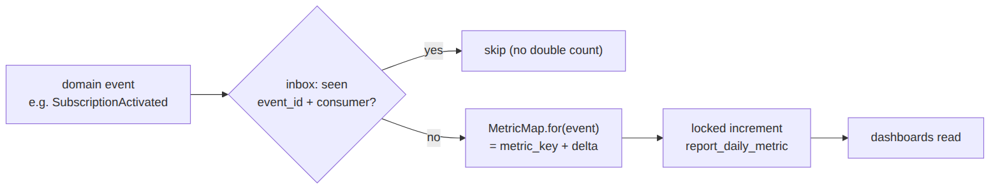

> 📱 **Rendered view** — diagrams below are images so they show in the GitHub app. Editable source (with mermaid): [`../reporting.md`](../reporting.md).

# Reporting — As-Built Design (REP-01)

> **Capability codes:** REP-01 (event-sourced reporting mart) · **Module path:** `Modules/Reporting`
> **Tests:** `ReportingApi`, `ReportExportReconcile`

## 1. Purpose & boundaries
- **Owns:** the **reporting mart** — daily metrics projected from domain events — plus dashboards,
  export and a reconciliation check.
- **Does NOT own:** the source events (other modules) nor the external DWH (a connector). It is a
  **read model**, never a business-state writer.
- **Job:** turn the event stream into queryable operator-scoped daily metrics, **idempotently**.

**The big picture in plain English:** every time something noteworthy happens elsewhere (a subscription
activates, a payment lands), it emits an event. Reporting listens, checks it hasn't already counted that exact
event, looks up which metrics the event bumps (via the `MetricMap`), and increments the right daily-metric
rows under a lock. The result is a tidy table of "per operator, per day, per metric → a number" that
dashboards read. It only ever reads events and adds them up — it never changes business state.





## 📖 Scenarios (service + Foundation involvement)

### 1. An activation shows up on the dashboard

**The story in plain English:** A new subscription goes live somewhere in the platform. Reporting hears about
it, decides it counts as one activation for today, and bumps the day's "subscriptions activated" tally — which
the operations dashboard then shows.

**Who does what:**
1. Subscription emits `SubscriptionActivated` → `sophix:outbox:dispatch` fires `OutboxEventPublished`.
2. `ReportMetricProjector` runs: inbox-dedupe, then `MetricMap::for('SubscriptionActivated')` →
   `[['subscriptions_activated',1]]`.
3. It increments the matching `report_daily_metric` row.
4. `GET /api/reports/dashboards/operations-overview` reads it.

**Worked example — before/after for one metric row** (operator `WIK`, date `2026-06-20`):

| metric_key | value before | event | value after |
|---|---:|---|---:|
| subscriptions_activated | 12 | `SubscriptionActivated` → `+1` | **13** |

*Proven by `ReportingApiTest`.*

### 2. Re-dispatch doesn't double-count

**The story in plain English:** The same event gets delivered twice (a redelivery, a retry). Reporting
recognises it has already counted that exact event and quietly ignores the repeat, so the numbers stay
correct.

**Who does what:**
1. The same event fired again → the **inbox** (`event_id`+consumer) short-circuits → counts unchanged.
2. So in the worked example above, a redelivery of that `SubscriptionActivated` leaves the value at **13**, not 14.

*Foundation: at-most-once projection.* *Proven by
`ReportingApiTest::…idempotent_on_redispatch`.*

### 3. A termination is projected
`SubscriptionTerminated` → `subscriptions_terminated += 1`. *Proven by
`ReportingApiTest::test_subscription_termination_is_projected`.*

### 4. Payment amount aggregates
`PaymentReceived` → `[['payments_count',1],['payments_amount', amount]]` → revenue dashboard. (One event can
bump **several** metric rows — here a count and an amount.)

### 5. Reconcile — mart matches events

**The story in plain English:** To trust the dashboard, Reporting can rebuild the totals from scratch off the
raw events and check they match what's stored. If they agree, the mart is in sync.

**Who does what:** `GET /api/reports/reconcile` re-projects from raw events via the **same `MetricMap`** and
compares to the mart → in-sync. *Proven by `ReportExportReconcileTest`.*

### 6. Reconcile detects drift
If a mart row is manually changed, reconcile flags the delta. *Proven by `ReportExportReconcileTest`.*

### 7. CSV export to the DWH
`GET /api/reports/export/{code}` streams mart rows (the DWH boundary via `ReportExportService`).

### 8. A new metric = one MetricMap line
Add a `MetricMap` case (+ the emitting event) and the projector counts it — no schema change.

## 2. Data model — ≥4 **complete** sample rows + readings per table
> **Completeness:** the row lists **every domain column**. The mart has a single table with a composite
> natural key `(operator_code, metric_date, metric_key)`; its auto-increment `id` and the
> `created_at`/`updated_at` audit timestamps are omitted by convention.

### `report_daily_metric` (operator, date, metric_key → value)
```json
{ "operator_code":"WIK","metric_date":"2026-06-20","metric_key":"subscriptions_activated","value":12 }
{ "operator_code":"WIK","metric_date":"2026-06-20","metric_key":"subscriptions_terminated","value":2 }
{ "operator_code":"WIK","metric_date":"2026-06-20","metric_key":"payments_amount","value":248000 }
{ "operator_code":"WIK","metric_date":"2026-06-20","metric_key":"invoices_generated","value":340 }
```
**Read each row as a sentence — *this data means this:***

| Row | What it means in plain English |
|-----|--------------------------------|
| Row 1 | On 2026-06-20, WIK **activated 12 subscriptions** (`metric_key=subscriptions_activated`, `value=12`). |
| Row 2 | The same day, WIK **terminated 2 subscriptions** (`subscriptions_terminated`, `value=2`). |
| Row 3 | The same day, WIK **took KES 248,000 in payments** (`payments_amount`, `value=248000`). |
| Row 4 | The same day, WIK **generated 340 invoices** (`invoices_generated`, `value=340`). |

**The columns that did the work:** one row per `(operator_code, metric_date, metric_key)`; `value` is **upserted/incremented** under a lock as events arrive. The keys come from `MetricMap` (the event→metric contract), and `inbox_events` (Foundation) guarantees each event counts once.

## 3. Services & projector
| Component | Responsibility |
| --- | --- |
| `Projectors/ReportMetricProjector` | live projection (event → metric via `MetricMap`) |
| `Support/MetricMap` | **single source** for event→metric mapping (live + reconcile) |
| `ReportExportService` / `ReportReconciliationService` | export (DWH boundary) / re-project + compare |

## 4. API surface
`/api/reports/dashboards/{code}`, `/api/reports/metrics`, `/api/reports/export/{code}`,
`/api/reports/reconcile`. `permission:report.*`.

## 5. Integration (events)
- **Consumes:** all domain events via `OutboxEventPublished` (only those in `MetricMap` count).
- **Emits:** none (read model).

## 6. Processes & ops console
Live projection on dispatch; export/reconcile on demand or scheduled.

**Ops console** — `sophix:reporting:*`, read-only (the mart is a read model — nothing here writes):

| Command | Kind | Does |
| --- | --- | --- |
| `ops-status [--operator]` | review | report-mart inventory & freshness: row count, distinct operators/metric keys, earliest/latest `metric_date`; warns if empty or > 2 days stale (projector not consuming) |
| `reconcile-show {operator} [--from] [--to]` | review | mart-vs-event-log reconciliation for one operator+window via `ReportReconciliationService` (same check as `GET /api/reports/reconcile`); lists per-cell discrepancies (expected/actual/delta) |

## 7. Policy & config
`MetricMap` is the declared contract; dashboards select metric subsets.

## 8. Cross-module dependencies
- **Reacts to →** every module's events. **Connector seam →** external DWH/ETL via `ReportExportService`.

## 9. Invariants & rules
| Rule | Statement | Enforced in |
| --- | --- | --- |
| idempotent projection | each event projected at most once per consumer | inbox dedupe |
| single mapping | live + reconcile derive identical totals | shared `MetricMap` |

## 10. Open items / deltas
- New metric = a `MetricMap` line (+ the emitting event). `subscriptions_terminated` is wired + tested.
