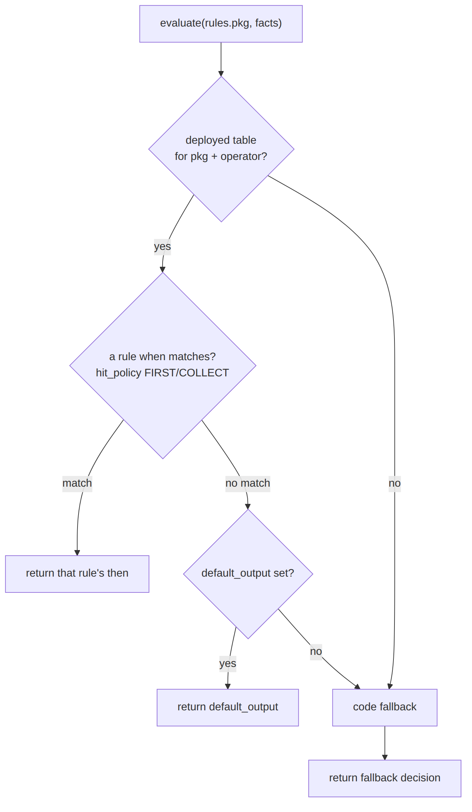
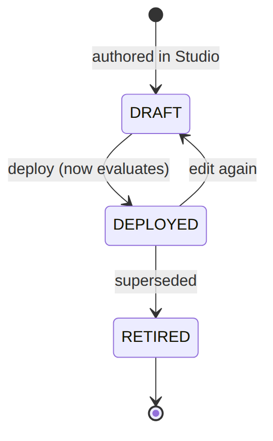

> 📱 **Rendered view** — diagrams below are images so they show in the GitHub app. Editable source (with mermaid): [`../rules.md`](../rules.md).

# Rules — As-Built Design (decision engine)

> **Module path:** `Modules/Rules` + `app/Foundation/Rules` · **Tests:** `DecisionTableTest`,
> `DroolsRuleEngineTest` · **See `00_SPINE.md` §6.**

## 1. Purpose & boundaries
- **Owns:** the **decision engine** (FOUNDATION_DROOLS): operator-overridable **decision tables**
  evaluated by a package name, plus a registered **code-fallback** when no table is deployed.
- **Does NOT own:** the facts (the caller supplies) or the action (the caller applies). It only decides.
- **Job:** keep operator-varying policy out of `if`s — branch through a named rules package.

**The big picture in plain English:** a caller asks a named question (a **rule package** like
`rules.tax-applicability`) and hands over some **facts**. The engine looks up the deployed **decision table**
for that package and operator, walks its rows top-to-bottom, and returns the outcome of the row whose `when`
conditions match. If no row matches, it returns the table's `default_output`. If no table is even deployed, a
registered **code fallback** answers so the caller always gets a deterministic decision. The engine only
decides — the caller supplies the facts and applies the result.





## 📖 Scenarios (service + Foundation involvement)

### 1. "How much tax applies?" as data

**The story in plain English:** Billing needs to know which tax group applies to a charge — but the answer
varies by operator and by what is being sold. Instead of hard-coding it, the caller asks the rules engine,
which looks up a table and returns the right tax group.

**Who does what:** Catalog `TaxComputeService` calls `RuleEngine::evaluate('rules.tax-applicability',
{taxableKind, customerCategory})` → a deployed `decision_table`'s rows match the facts → returns the tax
group. *Proven by consumers' tests + `DecisionTableTest`.*

**Worked example — which row matches** (using deployed table `dt_1`, `rule_set: rules.tax-applicability`,
`hit_policy: FIRST`):

Given facts `{ "taxableKind":"USAGE", "serviceCategory":"VOICE" }` — the engine walks the rows in order:

| Row | `when` | Matches these facts? |
|-----|--------|----------------------|
| 1 | `taxableKind = PACKAGE` AND `customerCategory = RES` | no (`taxableKind` is USAGE) |
| 2 | `taxableKind = USAGE` AND `serviceCategory = VOICE` | **yes → stop (FIRST)** |
| 3 | `taxableKind = USAGE` AND `serviceCategory = DATA` | not reached |

Returned `then`: `{ "taxGroup":"KE_VOICE" }`. (Had the facts been `{taxableKind:"USAGE",
serviceCategory:"DATA"}`, row 3 would have returned `{taxGroup:"NONE"}` — i.e. tax-exempt. Facts matching no
row fall to `default_output: {taxGroup:"NONE"}`.)

### 2. Fallback when no table is deployed

**The story in plain English:** Someone asks a question for which no operator has authored a table yet. Rather
than fail, the engine runs a built-in code rule so the caller still gets a sensible, deterministic answer.

**Who does what:** `rules.billing.adjustment-approval` with no table → the registered fallback derives
`stepsRequired` from `adjustment_limits_config`. *Foundation: deterministic answer out-of-the-box.* *Proven by
`AdjustmentTest`.*

### 3. Author a table in the Studio
`POST /api/rules/decision-tables` (rows of conditions→outcome) → `POST /api/rules/{ruleSet}/evaluate`
tests it against sample facts before consumers use it.

### 4. Operator override

**The story in plain English:** A specific operator wants a different policy than the platform default. They
author their own table for the same package; for that operator it wins, while everyone else keeps the default.

**Who does what:** A WIK-scoped table (`operator_code:WIK`) for a package overrides the platform default
(`operator_code:null`) for that operator. *Shows: per-operator policy without code.*

### 5. CVM offer threshold

**The story in plain English:** A retention offer should need a manager's approval once the discount gets
large. The rule package decides the threshold so it can be tuned without code.

**Who does what:** `rules.cvm.offer({offerType, discountPercent})` → `{requireApproval, approvalPolicy}` drives
EM-CFG-04.

**Worked example** (deployed table `dt_3`, `rule_set: rules.cvm.offer`, `hit_policy: FIRST`): facts
`{ "offerType":"WINBACK", "discountPercent":25 }` → row 1 `when discountPercent >= 20` matches → returns
`{ "requireApproval":true, "approvalPolicy":"CVM_HIGH_VALUE" }`. A 10% offer matches no row → `default_output:
{ "requireApproval":false }`. *Proven by `CvmTest`.*

### 6. Field-audit discrepancy routing
`rules.field_audit.equipment.discrepancy({discrepancyType})` → `{severity, routeAction}`. *Proven by
`FieldAuditCampaignTest`.*

### 7. Dunning routing knobs
Dunning grace/levels come from the `dunning_program` (catalog), but rule packages can refine routing —
the same evaluate seam.

### 8. Test-evaluate endpoint
`POST /api/rules/{ruleSet}/evaluate {facts}` returns the decision — used to validate a table before
deploy.

## 2. Data model — ≥4 sample rows + readings

### `decision_table` · `hit_policy`: `FIRST|COLLECT` · `status`: `DRAFT|DEPLOYED|RETIRED`
```json
{ "table_id":"dt_1","rule_set":"rules.tax-applicability","version":1,"operator_code":"WIK","name":"Tax applicability","description":"Tax group by taxable kind","hit_policy":"FIRST","inputs":["taxableKind","customerCategory","serviceCategory"],"rules":[{"when":[{"var":"taxableKind","op":"=","value":"PACKAGE"},{"var":"customerCategory","op":"=","value":"RES"}],"then":{"taxGroup":"KE_INTERNET"}},{"when":[{"var":"taxableKind","op":"=","value":"USAGE"},{"var":"serviceCategory","op":"=","value":"VOICE"}],"then":{"taxGroup":"KE_VOICE"}},{"when":[{"var":"taxableKind","op":"=","value":"USAGE"},{"var":"serviceCategory","op":"=","value":"DATA"}],"then":{"taxGroup":"NONE"}}],"default_output":{"taxGroup":"NONE"},"status":"DEPLOYED","created_by":"u_studio" }
{ "table_id":"dt_2","rule_set":"rules.tax-applicability","version":1,"operator_code":null,"name":"Tax applicability (default)","description":null,"hit_policy":"FIRST","inputs":["taxableKind"],"rules":[{"when":[{"var":"taxableKind","op":"=","value":"PACKAGE"}],"then":{"taxGroup":"KE_INTERNET"}}],"default_output":{"taxGroup":"NONE"},"status":"DEPLOYED","created_by":"u_studio" }
{ "table_id":"dt_3","rule_set":"rules.cvm.offer","version":2,"operator_code":"WIK","name":"CVM offer approval","description":"High-value discount gate","hit_policy":"FIRST","inputs":["offerType","discountPercent"],"rules":[{"when":[{"var":"discountPercent","op":">=","value":20}],"then":{"requireApproval":true,"approvalPolicy":"CVM_HIGH_VALUE"}}],"default_output":{"requireApproval":false},"status":"DEPLOYED","created_by":"u_studio" }
{ "table_id":"dt_4","rule_set":"rules.field_audit.equipment.discrepancy","version":1,"operator_code":"WIK","name":"Discrepancy routing","description":null,"hit_policy":"COLLECT","inputs":["discrepancyType"],"rules":[{"when":[{"var":"discrepancyType","op":"=","value":"MISSING"}],"then":{"severity":"HIGH","routeAction":"ESCALATE"}}],"default_output":null,"status":"DRAFT","created_by":"u_studio" }
```
**Read each row as a sentence — *this data means this:***

| Row | What it means in plain English |
|-----|--------------------------------|
| **dt_1** | WIK's `tax-applicability` table (`operator_code=WIK`), **live** (`status=DEPLOYED`): it picks a `taxGroup` from `inputs` — a residential package → `KE_INTERNET`, voice usage → `KE_VOICE`, **data usage → `NONE` (tax-exempt)** — and `FIRST` match wins. |
| **dt_2** | The **platform-default** version of the same table (`operator_code=null`), `DEPLOYED` but simpler: a package → `KE_INTERNET`, otherwise the `default_output` of `NONE`. WIK's dt_1 overrides this one. |
| **dt_3** | WIK's `cvm.offer` gate, `DEPLOYED`: any offer with `discountPercent >= 20` returns `requireApproval=true`; everything else falls through to `default_output` (`requireApproval=false`). |
| **dt_4** | WIK's field-audit discrepancy router — still `DRAFT`, so it **does not evaluate yet**. It uses `COLLECT` (gather all matches) and would route a `MISSING` discrepancy to `severity=HIGH`/`ESCALATE`. |

**The columns that did the work:**
- **Which package, whose version** = `rule_set` (the rule package) + `operator_code` (`WIK` overrides `null` default) + `version`.
- **Live or not** = `status` — only `DEPLOYED` tables evaluate.
- **How matches are picked** = `hit_policy` (`FIRST`=first match wins, `COLLECT`=gather all), falling back to `default_output` when nothing matches.

**Table lifecycle** — a table only evaluates once `DEPLOYED`:




## 3. Engine
| Component | Responsibility |
| --- | --- |
| `Foundation/Rules/RuleEngine` | `evaluate('rules.<pkg>', $facts)` → decision; `register(pkg, fn)` fallbacks |

## 4. API surface
`/api/rules/decision-tables[/{id}]` (CRUD/Studio), `/api/rules/{ruleSet}/evaluate` (test).
`permission:rules.*`.

## 5. Integration
- **Consumed by →** Billing (`adjustment-approval`), Catalog (`tax-applicability`), ILM (`cvm.offer`,
  flag eval), WorkOrder (`field_audit.*`), and more.

## 6. Processes & ops console
Synchronous evaluation; no workflow.

**Ops console** — `sophix:rules:*`, all read-only (inspect which policy is live and dry-run it; no persistence):

| Command | Kind | Does |
| --- | --- | --- |
| `ops-status [--operator] [--rule-set]` | review | inventory of DEPLOYED decision tables and their live version + status per rule set/operator |
| `table-show {ruleSet} [--operator]` | review | the table LIVE for a rule set — inputs, every rule's when/then, default output, version (operator-specific overrides global, highest version wins) |
| `evaluate {ruleSet} [--facts]` | review | dry-run a rule set against sample facts and show the decision (side-effect free: facts in, result out, no persistence) |

## 7. Policy & config
The decision tables **are** the config; a registered fallback guarantees a deterministic answer when no
table is deployed; `SOPHIX_RULES_DRIVER` selects the engine.

## 8. Cross-module dependencies
- **Used by →** most domains for policy branching.

## 9. Invariants & rules
| Rule | Statement | Enforced in |
| --- | --- | --- |
| table-or-fallback | a package always resolves | `RuleEngine::evaluate` |
| operator override | an operator's table overrides the default | decision-table scope |

## 10. Open items / deltas
- New policy = a new package + (optionally) a table; the engine driver is env-selectable.
