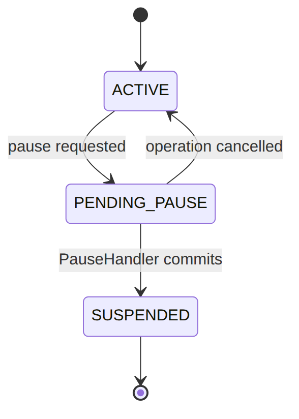
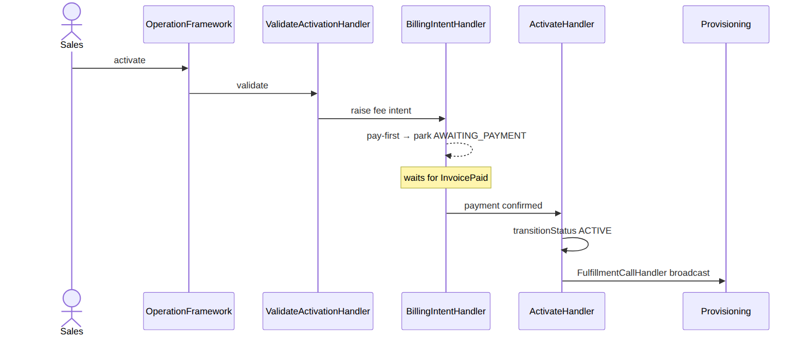
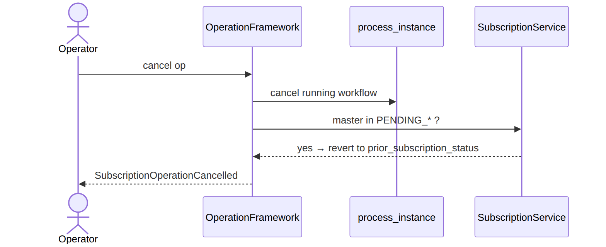
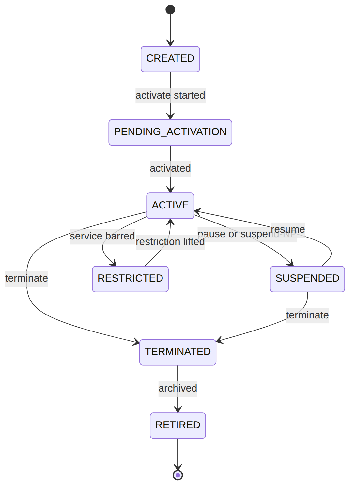
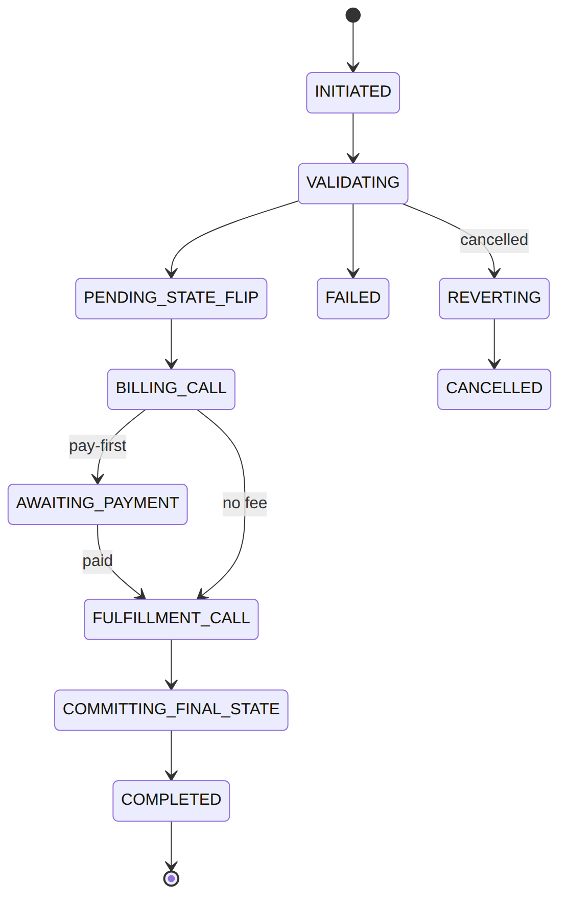

> 📱 **Rendered view** — diagrams below are images so they show in the GitHub app. Editable source (with mermaid): [`../subscription.md`](../subscription.md).

# Subscription — As-Built Design

> **Capability codes:** SUB-LM-01 (master), SUB-WF-FRAMEWORK-01, SUB-WF-* (operations),
> SUB-WF-RESTRICT-01 · **Module path:** `Modules/Subscription` · **Tests:**
> `Modules/Subscription/tests/Feature/*`

## 1. Purpose & boundaries
- **Owns:** the **subscription master row** (`subscription`) — the single writer of `status_code` and
  the cycle anchor — and the **operation ledger** (`subscription_operation`).
- **Does NOT own:** money (Billing), network (Provisioning), field work (WorkOrder), catalog (Catalog).
  It **orchestrates** them via workflow + events.
- **Job:** turn a lifecycle command into a governed, idempotent, single-in-flight operation whose steps
  are config-defined.

## 📖 Scenarios (service + Foundation involvement)

> **The one big idea:** every lifecycle change to a subscription (pause, activate, upgrade, terminate…)
> is run as an **operation** — a tracked, retry-safe job. The `subscription` row holds the *current
> state*; the `subscription_operation` row is the *receipt* for one change-in-progress. A subscription
> may have only **one** such job running at a time (except restrictions, which are special).

### 1. Pause an active subscription

**The story in plain English:** A customer is travelling and wants to pause their service for a while.
A call-centre agent hits Pause. The system doesn't flip the subscription off instantly — it first marks
it "pause in progress", does the work, then settles it into a paused (suspended) rest state. Pausing is
not its own status; a paused subscription simply sits in **SUSPENDED** with a pause reason attached.

**Who does what:**
1. `POST /api/subscriptions/sub_123/pause {reason_code:'CUSTOMER_TRAVEL'}` → `OperationFramework::trigger('PAUSE')`.
2. `trigger` checks no other job is running, writes a `subscription_operation` row (`INITIATED`), and starts the `sub-pause` workflow.
3. `EnterPendingStatusHandler` flips the master to the transient `PENDING_PAUSE`.
4. `PauseHandler` commits `SUSPENDED` (with the pause reason) and writes `subscription_pause_history`. Emits `SubscriptionPaused`.

**Sample — the subscription as it moves:**

| Moment | `status_code` | `current_transition_type` | meaning |
|--------|---------------|---------------------------|---------|
| before | `ACTIVE` | `null` | live, billable |
| during | `PENDING_PAUSE` | `PAUSE` | job in flight, blocks other jobs |
| after | `SUSPENDED` | `null` | paused (rest state) |




*Proven by `SubscriptionApiTest`.*

### 2. Concurrency — a second job is rejected (409)

**The story in plain English:** While the pause above is still running, someone tries to upgrade the
same subscription. The system refuses — only one change job may run at a time, so the upgrade is bounced
with a "wait for the other operation to finish" error. (A *restriction* would be the exception: it is
allowed to run alongside another job.)

**Who does what:** An `upgrade` while the pause is still in flight (`final_state IS NULL`) →
`trigger` throws `conflict(WAIT_FOR_OPERATION)` → HTTP **409**. A `RESTRICT` op would be allowed
because it is non-exclusive (R-SUB-WF-FW-2).

### 3. Idempotent retry

**The story in plain English:** The agent's browser times out and the pause request is sent twice with
the same idempotency key. The system does not start a second pause — it just hands back the first one.

**Who does what:** Same `Idempotency-Key` → `trigger` returns the **original** `subscription_operation`
row, and no second workflow is started.

### 4. Activate a new subscription (full workflow, pay-first park)

**The story in plain English:** A new customer's subscription is created but not yet live. To activate
it the system validates everything, and if there is an activation fee that must be paid up front, it
**pauses and waits** for the money to land before switching the service on. Once paid (or if no fee), it
flips the subscription ACTIVE and tells the network to provision it.

**Who does what:**
1. `…/activate` → `trigger('ACTIVATE')` → `sub-activate` workflow.
2. `ValidateActivationHandler` checks preconditions.
3. `BillingIntentHandler` — if an activation fee is **pay-first**, parks the operation in `AWAITING_PAYMENT` on a `ful-payment-received` catch until `InvoicePaid` arrives.
4. `ActivateHandler` runs `transitionStatus(ACTIVE)` and emits `SubscriptionActivated`.
5. `FulfillmentCallHandler` broadcasts to Provisioning.




*Foundation: workflow + outbox + pay-first parking.* *Proven by `SubscriptionApiTest`.*

### 5. Upgrade (mid-cycle MACD)

**The story in plain English:** A customer on a basic plan upgrades to a bigger one halfway through the
month. The system works out the part-month price difference (proration), swaps the package on the
subscription, and records the change.

**Who does what:** `…/upgrade {package_ref}` → `sub-upgrade`: `ValidatePackageChangeHandler` →
`BillingIntentHandler` (mid-cycle **proration** via the BillingIntent path) → `ChangePackageHandler`
(swaps `package_ref`/`package_version_id`) → `SubscriptionUpgraded`.

### 6. Terminate

**The story in plain English:** A customer leaves. The system arranges to pick up the equipment, then
switches the subscription to TERMINATED and tells Billing and Reporting it has ended.

**Who does what:** `…/terminate` → `sub-terminate`: `EquipmentPickupHandler` (raises an OSR pickup) →
`TerminateHandler` (`transitionStatus(TERMINATED)` + `SubscriptionTerminated`, which Billing/Reporting consume).

### 7. Add a restriction (non-exclusive)

**The story in plain English:** A customer is over their limit, so the operator bars outgoing voice
without cutting off the whole service. This is a partial restriction — the subscription stays in
whatever status it was; only the bar is added. Because it doesn't change status, it can run even while
another job is in flight.

**Who does what:** `POST …/{id}/restrictions {code:'OUTGOING_VOICE_BARRED'}` → `RestrictionService`
(the one op that does **not** change `status_code`): writes a `subscription_restriction`, broadcasts to
Provisioning, emits `SubscriptionRestrictionAdded`. Runs even with another op in flight (R-SUB-WF-FW-2).

### 8. Cancel an in-flight job → compensation

**The story in plain English:** A change job is stuck or was started by mistake, so an operator cancels
it. The system stops the running workflow and, if the subscription was sitting in a temporary
"PENDING_…" state, **rolls it back** to whatever status it had before the job started.

**Who does what:** `POST /api/subscription-operations/{op}/cancel` → `OperationFramework::cancel`:
cancels the running `process_instance` and, if the master sits in a transient `PENDING_*`, **reverts**
it to `prior_subscription_status` (R-SUB-WF-FW-3). Emits `SubscriptionOperationCancelled`.





## 2. Data model — ≥4 **complete** sample rows + readings
> **Completeness:** each row lists **every domain column** (nullables shown as `null`). The surrogate
> primary key shown is the real one (a string business key, e.g. `subscription_id`); `created_at`/
> `updated_at` are omitted by convention.

### `subscription` (the master)
**Enum legend — `status_code`:** rest states `CREATED|PENDING_ACTIVATION|ACTIVE|SUSPENDED|RESTRICTED|
TERMINATED|RETIRED` (the `PAUSED` constant survives `@deprecated` — pause now resolves to `SUSPENDED`
with a pause reason); **transient** `PENDING_{PAUSE,RESUME,SUSPEND_NP,UPGRADE,DOWNGRADE,RELOCATION,
MIGRATION,TERMINATION}` (= an operation is mid-flight; cancel reverts to `prior`). Only
`ACTIVE` is billable. `billing_mode` = `POSTPAID`(invoice)|`PREPAID`(wallet); `cycle_model` =
`CALENDAR`|`ANNIVERSARY`. (`current_cycle_*`/`last_cycle_closed_window_end`/`next_cycle_charge_invoice_id`
added by the cycle-window migration.)

**Status lifecycle.** Each rest state is reached *through* a transient `PENDING_*` state while the job
runs; cancelling a job in a `PENDING_*` state rolls back to where it was. (Transient states collapsed
below for readability.)




```json
{ "subscription_id":"sub_123","customer_id":"cust_50","account_id":"acc_1","operator_code":"WIK","homepass_id":"hp_1","previous_homepass_id":null,"package_ref":"pkg_triple","package_version_id":"pv_1","previous_package_ref":null,"previous_package_version_id":null,"status_code":"ACTIVE","billing_mode":"POSTPAID","currency":"KES","cycle_model":"ANNIVERSARY","cycle_anchor_day":1,"cycle_period_days":30,"cycle_frequency_months":1,"active_restrictions":[],"current_transition_type":null,"current_transition_reason_code":null,"last_failure":null,"activated_at":"2026-01-01T08:00:00Z","suspended_at":null,"resumed_at":null,"terminated_at":null,"last_status_changed_at":"2026-01-01T08:00:00Z","start_date":"2026-01-01","end_date":null,"created_by":"u_sales1","updated_by":"system","retired_at":null,"current_cycle_start":"2026-06-01","current_cycle_end":"2026-07-01","last_cycle_closed_window_end":"2026-06-01","next_cycle_charge_invoice_id":null }
{ "subscription_id":"sub_124","customer_id":"cust_50","account_id":"acc_1","operator_code":"WIK","homepass_id":"hp_1","previous_homepass_id":null,"package_ref":"pkg_inet","package_version_id":"pv_2","previous_package_ref":null,"previous_package_version_id":null,"status_code":"PENDING_PAUSE","billing_mode":"POSTPAID","currency":"KES","cycle_model":"CALENDAR","cycle_anchor_day":1,"cycle_period_days":30,"cycle_frequency_months":1,"active_restrictions":[],"current_transition_type":"PAUSE","current_transition_reason_code":"CUSTOMER_TRAVEL","last_failure":null,"activated_at":"2026-02-01T08:00:00Z","suspended_at":null,"resumed_at":null,"terminated_at":null,"last_status_changed_at":"2026-06-20T09:00:00Z","start_date":"2026-02-01","end_date":null,"created_by":"u_sales1","updated_by":"u_csr2","retired_at":null,"current_cycle_start":"2026-06-01","current_cycle_end":"2026-07-01","last_cycle_closed_window_end":"2026-06-01","next_cycle_charge_invoice_id":null }
{ "subscription_id":"sub_125","customer_id":"cust_51","account_id":"acc_2","operator_code":"WIK","homepass_id":"hp_7","previous_homepass_id":null,"package_ref":"pkg_inet","package_version_id":"pv_2","previous_package_ref":null,"previous_package_version_id":null,"status_code":"SUSPENDED","billing_mode":"PREPAID","currency":"KES","cycle_model":"CALENDAR","cycle_anchor_day":null,"cycle_period_days":30,"cycle_frequency_months":1,"active_restrictions":[],"current_transition_type":null,"current_transition_reason_code":"NON_PAYMENT","last_failure":null,"activated_at":"2026-03-01T08:00:00Z","suspended_at":"2026-06-10T00:00:00Z","resumed_at":null,"terminated_at":null,"last_status_changed_at":"2026-06-10T00:00:00Z","start_date":"2026-03-01","end_date":null,"created_by":"u_sales3","updated_by":"system","retired_at":null,"current_cycle_start":"2026-06-01","current_cycle_end":"2026-07-01","last_cycle_closed_window_end":"2026-06-01","next_cycle_charge_invoice_id":null }
{ "subscription_id":"sub_126","customer_id":"cust_52","account_id":"acc_3","operator_code":"WIK","homepass_id":"hp_9","previous_homepass_id":"hp_8","package_ref":"pkg_triple","package_version_id":"pv_1","previous_package_ref":null,"previous_package_version_id":null,"status_code":"RESTRICTED","billing_mode":"POSTPAID","currency":"KES","cycle_model":"ANNIVERSARY","cycle_anchor_day":15,"cycle_period_days":30,"cycle_frequency_months":1,"active_restrictions":["OUTGOING_VOICE_BARRED"],"current_transition_type":null,"current_transition_reason_code":null,"last_failure":{"code":"FULFILLMENT_TIMEOUT","at":"2026-05-02T11:00:00Z"},"activated_at":"2026-04-01T08:00:00Z","suspended_at":null,"resumed_at":null,"terminated_at":null,"last_status_changed_at":"2026-06-01T10:00:00Z","start_date":"2026-04-01","end_date":null,"created_by":"u_sales1","updated_by":"system","retired_at":null,"current_cycle_start":"2026-06-15","current_cycle_end":"2026-07-15","last_cycle_closed_window_end":"2026-06-15","next_cycle_charge_invoice_id":null }
```
**Read each row as a sentence — *this data means this:***

| Row | What it means in plain English |
|-----|--------------------------------|
| **sub_123** | A live, billable subscription (`status_code=ACTIVE`, `billing_mode=POSTPAID` → cycle close raises an invoice). No job in flight (`current_transition_type=null`). |
| **sub_124** | **Mid-pause**: a PAUSE job is running (`status_code=PENDING_PAUSE`, `current_transition_type=PAUSE`) — it blocks any second job, and cancelling reverts it to ACTIVE. |
| **sub_125** | A **prepaid** sub suspended for non-payment (`status_code=SUSPENDED`, `current_transition_reason_code=NON_PAYMENT`, `suspended_at` set). |
| **sub_126** | Still served but with **outgoing voice barred** (`status_code=RESTRICTED`, `active_restrictions=[OUTGOING_VOICE_BARRED]`), and it carries a `last_failure` from an earlier op. |

**The columns that did the work:**
- **Live / billable** = `status_code` (only `ACTIVE` bills) + `billing_mode` (POSTPAID invoices; PREPAID debits a wallet and freezes on shortfall).
- **A job in flight** = `current_transition_type` (a transient `PENDING_*` blocks a second op; cancel reverts).
- **Why suspended / what's barred** = `current_transition_reason_code` / `active_restrictions`.
- **Cycle timing** = `cycle_period_days`/`cycle_model`/`cycle_anchor_day` drive proration + the `current_cycle_*` window the close worker reads.

### `subscription_operation` (per-command ledger)
**Enum legend — `operation_kind`:** `ACTIVATE|PAUSE|RESUME|TERMINATE|UPGRADE|DOWNGRADE|RELOCATION|
MIGRATION|SUSPEND_NP|RESTRICT` (RESTRICT = non-exclusive; the kind persisted is `RELOCATION`/`MIGRATION`
even though the route paths are `…/relocate`/`…/migrate`). **`current_state`** (granular narration vocabulary): `INITIATED|VALIDATING|
PENDING_STATE_FLIP|BILLING_CALL|AWAITING_PAYMENT|FULFILLMENT_CALL|AWAITING_FULFILLMENT_RESPONSE|
AWAITING_USER_TASK|COMMITTING_FINAL_STATE|EMITTING_EVENT|REVERTING|COMPLETED|FAILED|CANCELLED` (the older
`PENDING`/`RUNNING` survive `@deprecated`). **`final_state`:** `NULL`=in-flight (the single-in-flight key)
else the resulting `status_code`, or `FAILED|CANCELLED`. (`cancel_actor_user_id` added by the operation-config migration alongside the partial
in-flight unique indexes.)

**Operation `current_state` lifecycle** — the narration of one change job. While `final_state` is
`NULL` the job is in flight (this is the single-in-flight key); it ends in `COMPLETED`, `FAILED`, or
`CANCELLED`. (Optional parking/reverting steps shown; not every job hits every state.)




```json
{ "operation_id":"op_1","operator_code":"WIK","subscription_id":"sub_124","operation_kind":"PAUSE","bpmn_process_key":"sub-pause","bpmn_process_instance_id":"pi_5501","initiating_actor_user_id":"u_csr2","initiating_actor_role":"CSR","idempotency_key":"pause-sub_124-1","idempotency_request_hash":"9f2c…ab","correlation_id":"corr_124","prior_subscription_status":"ACTIVE","current_state":"VALIDATING","final_state":null,"failure_reason_code":null,"failure_reason_detail":null,"cancel_reason_code":null,"cancel_actor_user_id":null,"input":{"reasonCode":"CUSTOMER_TRAVEL"},"started_at":"2026-06-20T09:00:00Z","completed_at":null,"duration_ms":null }
{ "operation_id":"op_2","operator_code":"WIK","subscription_id":"sub_123","operation_kind":"ACTIVATE","bpmn_process_key":"sub-activate","bpmn_process_instance_id":"pi_4400","initiating_actor_user_id":"u_sales1","initiating_actor_role":"SALES","idempotency_key":"activate-sub_123-1","idempotency_request_hash":"1a0e…77","correlation_id":"corr_123","prior_subscription_status":"PENDING_ACTIVATION","current_state":"COMPLETED","final_state":"COMPLETED","failure_reason_code":null,"failure_reason_detail":null,"cancel_reason_code":null,"cancel_actor_user_id":null,"input":{"packageRef":"pkg_triple"},"started_at":"2026-01-01T07:59:00Z","completed_at":"2026-01-01T08:00:00Z","duration_ms":60000 }
{ "operation_id":"op_3","operator_code":"WIK","subscription_id":"sub_125","operation_kind":"SUSPEND_NP","bpmn_process_key":"sub-suspend-np","bpmn_process_instance_id":"pi_6600","initiating_actor_user_id":null,"initiating_actor_role":"SYSTEM","idempotency_key":"suspendnp-sub_125-1","idempotency_request_hash":"77be…01","correlation_id":"corr_dun_2","prior_subscription_status":"ACTIVE","current_state":"COMPLETED","final_state":"COMPLETED","failure_reason_code":null,"failure_reason_detail":null,"cancel_reason_code":null,"cancel_actor_user_id":null,"input":{"dunningLevel":3},"started_at":"2026-06-10T00:00:00Z","completed_at":"2026-06-10T00:00:02Z","duration_ms":2000 }
{ "operation_id":"op_4","operator_code":"WIK","subscription_id":"sub_126","operation_kind":"RESTRICT","bpmn_process_key":"sub-restrict","bpmn_process_instance_id":null,"initiating_actor_user_id":"u_csr1","initiating_actor_role":"CSR","idempotency_key":"restrict-sub_126-1","idempotency_request_hash":"c4d2…9a","correlation_id":"corr_126","prior_subscription_status":"ACTIVE","current_state":"COMPLETED","final_state":"COMPLETED","failure_reason_code":null,"failure_reason_detail":null,"cancel_reason_code":null,"cancel_actor_user_id":null,"input":{"code":"OUTGOING_VOICE_BARRED"},"started_at":"2026-06-01T10:00:00Z","completed_at":"2026-06-01T10:00:01Z","duration_ms":1000 }
```
**Read each row as a sentence — *this data means this:***

| Row | What it means in plain English |
|-----|--------------------------------|
| **op_1** | A PAUSE job **still running** on sub_124 (`final_state=null`, `current_state=VALIDATING`) — it blocks any other non-RESTRICT op, and if cancelled it rolls the sub back to `prior_subscription_status=ACTIVE`. |
| **op_2** | A finished activation (`final_state=COMPLETED`), started by a salesperson (`initiating_actor_role=SALES`). |
| **op_3** | A **system-driven** non-payment suspension (`operation_kind=SUSPEND_NP`, `initiating_actor_user_id=null`, role SYSTEM), now COMPLETED. |
| **op_4** | A RESTRICT that completed — being non-exclusive, it could have run alongside another job. |

**The columns that did the work:**
- **In-flight or done** = `final_state` (`null` = still running, the single-in-flight key; else COMPLETED/FAILED/CANCELLED); `current_state` is the fine-grained narration.
- **Who started it** = `initiating_actor_user_id`/`initiating_actor_role` (null user = SYSTEM).
- **Rollback target** = `prior_subscription_status` on cancel.
- **Retry safety** = `idempotency_key`/`idempotency_request_hash` make a duplicate return the same row.

### Config tables (no-code knobs)
**`subscription_operation_config`** (composite PK `operator_code`+`operation_kind`) and
**`subscription_pause_config`** (PK `operator_code`) are one-row-per-operator(-kind) policy.
**`subscription_restriction`** is the restriction *catalog* (the activated bars, by `restriction_code`).
```json
{ "subscription_operation_config":{ "operator_code":"WIK","operation_kind":"MIGRATION","default_bpmn_process_key":"sub-migration","operation_timeout_seconds":90,"billing_call_timeout_seconds":30,"fulfillment_call_timeout_seconds":60,"feature_flags":null,"enabled":false,"updated_by":"u_admin" } }
{ "subscription_operation_config":{ "operator_code":"WIK","operation_kind":"PAUSE","default_bpmn_process_key":"sub-pause-wik","operation_timeout_seconds":120,"billing_call_timeout_seconds":30,"fulfillment_call_timeout_seconds":60,"feature_flags":{"requireFee":true},"enabled":true,"updated_by":"u_admin" } }
{ "subscription_pause_config":{ "operator_code":"WIK","customer_self_service_enabled":true,"scheduled_pause_enabled":true,"max_future_scheduled_resume_days":90,"min_pause_hours":24,"customer_notification_enabled":true,"updated_by":"u_admin" } }
{ "subscription_restriction":{ "restriction_id":"srest_voice","operator_code":"WIK","restriction_code":"OUTGOING_VOICE_BARRED","name":"Outgoing voice barred","fulfillment_action":"AAA_RESTRICT_OUTGOING_VOICE","customer_self_service_eligible":false,"admin_only":true,"is_active":true } }
```
**Read each row as a sentence — *this data means this:***

| Row | What it means in plain English |
|-----|--------------------------------|
| **operation_config · MIGRATION** | This operator has migrations **turned off** (`enabled=false`) — so `trigger` rejects a MIGRATION outright. |
| **operation_config · PAUSE** | Pause is on (`enabled=true`) and runs a **custom workflow** (`default_bpmn_process_key=sub-pause-wik`), with a 120s timeout and a `requireFee` feature flag — pure config. |
| **pause_config** | The voluntary-pause policy: customers may self-serve (`customer_self_service_enabled=true`), schedule a resume up to 90 days out, pause for at least 24h, and get notified. |
| **restriction · srest_voice** | The "outgoing voice barred" bar: when applied, FUL-04 broadcasts `fulfillment_action=AAA_RESTRICT_OUTGOING_VOICE`; only an admin may set it (`admin_only=true`, `customer_self_service_eligible=false`). |

**The columns that did the work:**
- **On/off + which workflow** = `enabled` + `default_bpmn_process_key` (a disabled kind is rejected by `trigger`).
- **Pause policy knobs** = the `subscription_pause_config` switches (self-service, scheduled window, minimum, notify).
- **A restriction's effect + who may apply it** = `fulfillment_action` + `customer_self_service_eligible`/`admin_only`.

## 3. Services
| Service | Responsibility | Key methods |
| --- | --- | --- |
| `SubscriptionService` | the **only writer** of the master | `create`, `setPendingStatus` (transient flip), `transitionStatus` (commit a rest state + timestamp + event) |
| `OperationFramework` | start + track every operation | `trigger` (idempotency + single-in-flight + process key + workflow + ledger), `cancel` (cancel instance + revert transient) |
| `RestrictionService` | partial-service restrictions (no `status_code` change) | non-exclusive |

## 4. API surface
| Method + path | Permission | Idempotent | →service |
| --- | --- | --- | --- |
| `POST /api/subscriptions` | `subscription.create` | yes | `SubscriptionService::create` |
| `POST …/{id}/activate` | `subscription.activate` | — | `trigger('ACTIVATE')` |
| `POST …/{id}/{pause\|resume\|terminate\|upgrade\|downgrade\|relocate\|migrate\|suspend-np}` | `subscription.manage` | — | `trigger(<KIND>)` |
| `POST/DELETE …/{id}/restrictions[/{code}]` | `subscription.manage` | yes | `RestrictionService` |
| `POST /api/subscription-operations/{op}/cancel` | `subscription.manage` | — | `OperationFramework::cancel` |

**Worked request — `OperationController@pause`:** `POST /api/subscriptions/sub_124/pause {reason_code}`
→ **202** `{operation_id, operation_kind:'PAUSE', current_state:'VALIDATING'}` (accepted; runs async).

## 5. Integration (events) — topic `subscription.lifecycle`
- **Emits:** `Subscription{Created,Activated,Suspended,SuspendedForNonPayment,Paused,Resumed,Terminated,
  StatusChanged}`, `Subscription{Upgraded,Downgraded,Relocated,Migrated}` (+`*Rejected`),
  `SubscriptionRestriction{Added,Removed}`, `SubscriptionOperation{Started,Completed,Failed,Cancelled}`.
- **Consumers:** Billing (cycle anchoring + `subscriptions_*` metrics), Reporting, Notification.
- **Consumes:** Billing `InvoicePaid` → `ConfirmBillingIntentOnPayment` confirms a pay-first intent +
  correlates `sub-payment-confirmed` to resume a parked operation.

## 6. Processes & ops console
- **Trigger:** `OperationFramework::trigger()` (process key from `subscription_operation_config`).
- **Reconcile:** `SyncOperationFromProcess` on `ProcessInstanceEnded` closes the ledger.
- **Handlers:** Validate{Operation,Activation,PackageChange,HomePassChange}, `EnterPendingStatusHandler`,
  Activate/Pause/Resume/Suspend/Terminate, Change{Package,HomePass}, `PutActiveRestrictionsHandler`,
  `FulfillmentCallHandler`, `BillingIntentHandler`, `EquipmentPickupHandler`, `CreateShiftingWoHandler`.

**`BillingIntentHandler` (topic `billing-intent`):** reads `{subscriptionId, operationKind}` + fee
config; calls `BillingIntentService::emit()`; pay-first → parks `AWAITING_PAYMENT`; outputs
`{intentConfirmed}`. **`ActivateHandler` (topic `activate`):** `transitionStatus(ACTIVE)` + emit; fail
`retryable:true`.

**Scheduled worker:** `sophix:subscription:operation-timeouts` — sweeps in-flight operations past their
config `operation_timeout_seconds`: enters `REVERTING`, cancels the workflow instance, reverts a transient
`PENDING_*` flip to `prior_subscription_status`, ends `FAILED` with `OPERATION_TIMEOUT` (R-SUB-WF-FW-9/10).

**Ops console** — `sophix:subscription:*`, wrapping the existing `OperationFramework` (no single-in-flight or compensation bypass):

| Command | Kind | Does |
| --- | --- | --- |
| `ops-status [--operator]` | review | counts needing attention: in-flight ops (RESTRICT, REVERTING, started >1h, never-started), FAILED / OPERATION_TIMEOUT, subs in `PENDING_*` / RESTRICTED / SUSPENDED |
| `operation-show {subscription}` | review | one subscription's master state, its in-flight operations and applied restrictions (read-only) |
| `operation-cancel {operation} [--reason] [--actor] --confirm` | safe-correction | cancel one stuck in-flight operation via `OperationFramework::cancel` (cancels the instance, reverts a transient `PENDING_*` to prior); destructive, so `--confirm` is required |

*`ops-status` surfaces a stuck `PENDING_*` sub or a never-started op; `operation-show` explains why one sub isn't moving; `operation-cancel … --confirm` applies the same compensation as the timeout sweep (R-SUB-WF-FW-3) — no SQL, no framework bypass.*

## 7. Policy & config
`subscription_operation_config` (enable/disable/custom BPMN per kind), per-operation config tables,
cycle cadence on the master.

## 8. Cross-module dependencies
- **Calls →** Provisioning (`FulfillmentCallHandler`), Billing (`BillingIntentHandler`), WorkOrder
  (`CreateShiftingWoHandler`).
- **Called by →** Fulfillment (`ACTIVATE`), Billing dunning (suspend-NP/restrict), ILM account sync.

## 9. Invariants & rules
| Rule | Statement | Enforced in |
| --- | --- | --- |
| R-SUB-WF-FW-1 | ≤ 1 in-flight non-RESTRICT op per subscription | `trigger` + partial unique index on `final_state IS NULL` |
| R-SUB-WF-FW-2 | RESTRICT is non-exclusive | `trigger(exclusive:false)` |
| R-SUB-WF-FW-3 | cancel reverts a transient `PENDING_*` to `prior_subscription_status` | `cancel` |
| R-SUB-WF-FW-7 | process key is config-resolved; disabled kind rejected | `resolveProcessKey` |
| (single writer) | only `SubscriptionService` writes `status_code` | by construction |

## 10. Open items / deltas
- Some `subscription_upgrade_config`/`pause_config` fields are config-ahead-of-wiring (no gap today).
- Mid-cycle proration runs through the BillingIntent path, distinct from the cycle-fee proration in
  `Billing/ChargeComputeService` (see `billing.md`).
- SUB-WF flow ordering lives in `process_definition` data (the authored graph is the spec).
