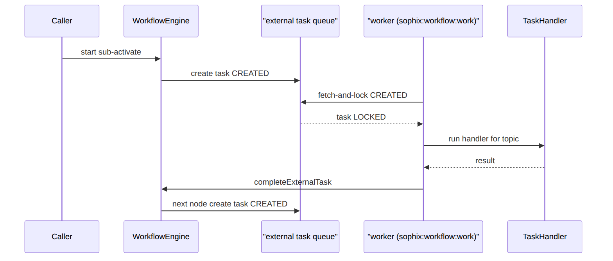
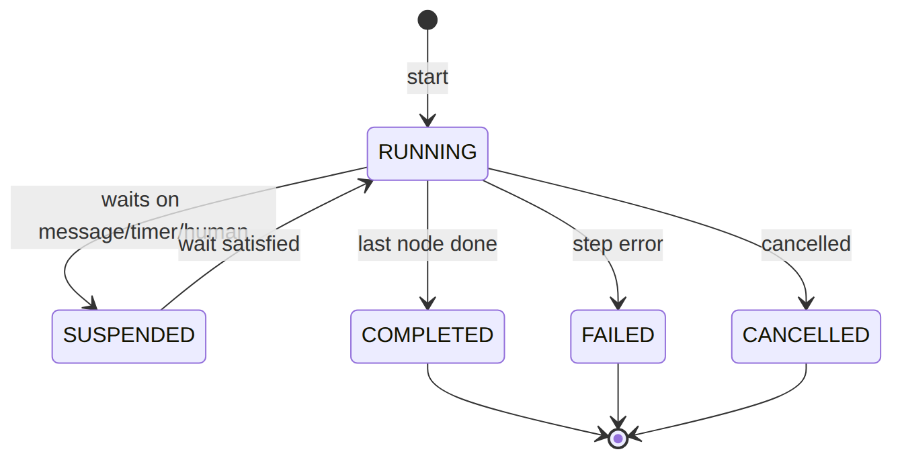
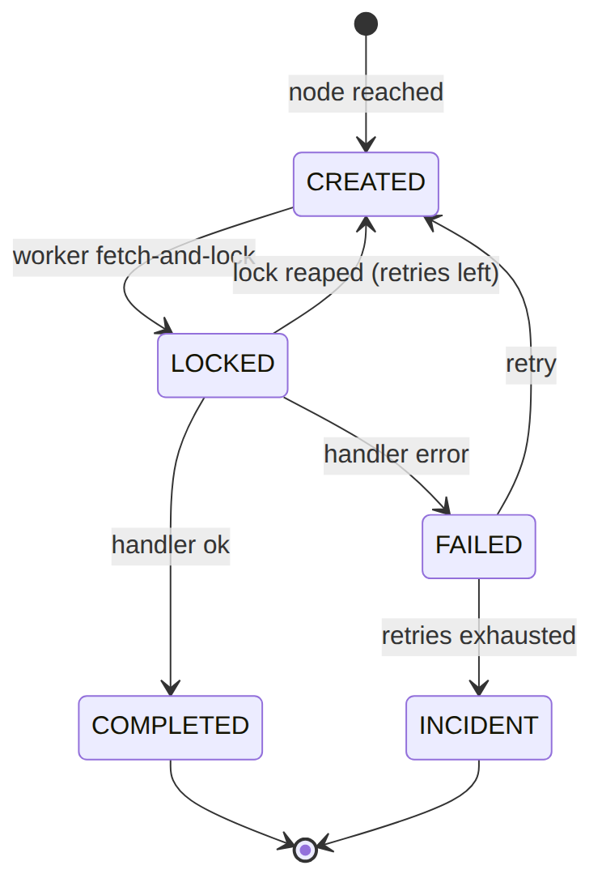

> 📱 **Rendered view** — diagrams below are images so they show in the GitHub app. Editable source (with mermaid): [`../workflow.md`](../workflow.md).

# Workflow — As-Built Design (the process engine)

> **Module path:** `Modules/Workflow` · **Test:** `WorkflowEngineTest` · **See `00_SPINE.md` §4** — this
> doc adds the engine internals behind that pattern.

## 1. Purpose & boundaries
- **Owns:** the **native process engine** (FOUNDATION_CAMUNDA): process definitions (graphs), instances,
  external tasks, message subscriptions, timers, user tasks — and the **Studio** API to author/validate/
  deploy flows.
- **Does NOT own:** the business steps — those are `TaskHandler`s each module registers.
- **Job:** run config-defined, multi-step, retry-safe processes. *new flow = compose registered topics;
  new step = register one handler.*

**The big picture in plain English:** think of a flow as a recipe drawn as boxes and arrows. The engine
keeps the recipe (a `process_definition`), starts a copy of it for each subscription or order (a
`process_instance`), and for every "do something" box it drops a ticket on a queue (a
`workflow_external_task`). A background **worker** picks tickets off the queue, runs the matching handler,
and tells the engine to move to the next box. When a box needs to **wait** — for a message, a timer, or a
human — the flow parks until that wait is satisfied, then resumes exactly where it left off.

## 📖 Scenarios (service + Foundation involvement)

### 1. Author → validate → deploy a flow (no code for the flow)

**The story in plain English:** An author draws a flow in the Studio — boxes (steps) joined by arrows. Before
it can run, the system checks the drawing makes sense: every step points at a real handler, every input is
wired, nothing dangles. Only then can the flow be deployed and used.

**Who does what:**
1. `POST /api/workflow/definitions` saves the node graph as a `process_definition` (`status DRAFT`).
2. `POST …/validate` runs the **graph validator** — every node `topic` must be registered in `TaskRegistry`,
   inputs must be wired, no dangling nodes or bad edges.
3. `POST …/deploy` flips the definition to `DEPLOYED` — now it can start instances.

*Proven by `WorkflowEngineTest`.*

### 2. Start → external task → worker drains it → completes

**The story in plain English:** Something kicks off a flow (say, a new subscription). The engine creates a
running instance and, for the first "do something" step, drops a ticket on a work queue. A background worker
grabs the ticket, runs the real step, and reports back — and the engine advances the flow to the next step.

**Who does what:**
1. `WorkflowEngine::start('sub-activate', businessKey, vars)` creates a `process_instance` (`RUNNING`) plus a
   `workflow_external_task` (`CREATED`) for each service node it reaches.
2. The worker command `sophix:workflow:work` **fetch-and-locks** a `CREATED` task by `topic` (status → `LOCKED`,
   stamps `worker_id` + `locked_until`).
3. It runs the `TaskHandler` for that topic, then `completeExternalTask` marks the task `COMPLETED` and
   advances to the next node (which may create the next `CREATED` task).

**Sample — a task as the worker drains it:**
```json
{ "task_id":"et_1","instance_id":"pi_1","node_id":"activate","topic":"activate","status":"LOCKED","worker_id":"wf-w-1","locked_until":"2026-06-20T10:01:00Z","retries":3 }
```





### 3. Worker drains a task (the lock detail)
`sophix:workflow:work` fetch-and-locks `CREATED` tasks by topic, runs the handler,
`completeExternalTask` advances to the next node. (See scenario 2 for the full loop.)

### 4. Exclusive gateway branches on a variable

**The story in plain English:** A flow reaches a fork in the road. Which way it goes depends on a value it is
carrying — for example, "was KYC approved?". The engine reads that value and picks the matching arrow.

**Who does what:** A gateway routes on `{kycApproved: true}` vs default — the engine evaluates the condition
against the instance `variables`. *Proven by `WorkflowEngineTest::test_exclusive_gateway_branches_on_variables`.*

### 5. Input mapping wires an upstream output into a downstream input

**The story in plain English:** An early step produces a value (say a provisioning reference). A later step
needs it. Input mapping is the wire that carries that output forward into the later step's input.

**Who does what:** A node's declared output (`{provisioningRef}`) is mapped into a later node's input. *Proven
by `WorkflowEngineTest::test_input_mapping_wires_an_upstream_output_into_a_downstream_input`.*

### 6. Message catch parks → correlate resumes

**The story in plain English:** A flow reaches a step that says "wait until the install is finished." It pauses
there. Later, when the install really finishes elsewhere, a message arrives with the matching key and the flow
wakes up and carries on.

**Who does what:**
1. A `messageCatch` node creates a `workflow_message_subscription` keyed by `message_name` + `correlation_key`;
   the instance parks (`SUSPENDED`).
2. `correlateMessage('ful-install-finalized', businessKey, vars)` — e.g. from a `WorkOrderFinalized` listener —
   matches the subscription and resumes the flow (`RUNNING`).

**Sample — the parked subscription:**
```json
{ "id":11,"instance_id":"pi_3","node_id":"await-install","message_name":"ful-install-finalized","correlation_key":"order_2" }
```

### 7. Timer fires
A timer node creates a `workflow_timer`; `sophix:workflow:tick` fires due timers (when `fire_at` passes) and
reaps dead locks.

### 8. Strict outputs rejects an undeclared key

**The story in plain English:** A step is only allowed to hand back the values it promised. If a handler tries
to sneak in an extra value it never declared, the engine refuses it — keeping the data flowing through the flow
honest and predictable.

**Who does what:** With `SOPHIX_WORKFLOW_STRICT_OUTPUTS`, a handler returning a key it didn't declare is
rejected. *Proven by `WorkflowEngineTest::test_strict_outputs_rejects_a_handler_that_returns_undeclared_keys`.*

### (bonus) 9. Reconcile on end
`ProcessInstanceEnded` lets a module close its ledger (e.g. Subscription `SyncOperationFromProcess`).

## 2. Data model — ≥4 sample rows + readings

### `process_instance` · `status`: `RUNNING|COMPLETED|FAILED|CANCELLED|SUSPENDED` & `workflow_external_task` · `status`: `CREATED|LOCKED|COMPLETED|FAILED|INCIDENT`
```json
{ "instance_id":"pi_1","definition_id":"pdef_1","process_key":"sub-activate","definition_version":1,"operator_code":"WIK","business_key":"sub_1","variables":{"subscriptionId":"sub_1"},"status":"RUNNING","active_nodes":["activate"],"correlation_id":"sub_1","error_message":null,"started_at":"2026-06-20T10:00:00Z","ended_at":null }
{ "instance_id":"pi_2","definition_id":"pdef_3","process_key":"ful-order-capture","definition_version":1,"operator_code":"WIK","business_key":"order_1","variables":{"orderId":"order_1"},"status":"COMPLETED","active_nodes":[],"correlation_id":"order_1","error_message":null,"started_at":"2026-06-20T09:00:00Z","ended_at":"2026-06-20T09:05:00Z" }
{ "instance_id":"pi_6","definition_id":"pdef_1","process_key":"sub-activate","definition_version":1,"operator_code":"WIK","business_key":"sub_9","variables":{"subscriptionId":"sub_9"},"status":"FAILED","active_nodes":["activate"],"correlation_id":"sub_9","error_message":"NMS rejected provisioning","started_at":"2026-06-20T10:10:00Z","ended_at":null }
{ "et_1":{ "task_id":"et_1","instance_id":"pi_1","node_id":"activate","topic":"activate","operator_code":"WIK","business_key":"sub_1","variables":{"subscriptionId":"sub_1"},"status":"LOCKED","worker_id":"wf-w-1","locked_until":"2026-06-20T10:01:00Z","retries":3,"error_message":null,"completed_at":null } }
{ "et_2":{ "task_id":"et_2","instance_id":"pi_1","node_id":"billing-intent","topic":"billing-intent","operator_code":"WIK","business_key":"sub_1","variables":null,"status":"CREATED","worker_id":null,"locked_until":null,"retries":3,"error_message":null,"completed_at":null } }
```
**Read each row as a sentence — *this data means this:***

| Row | What it means in plain English |
|-----|--------------------------------|
| **pi_1** | A subscription-activation flow for `sub_1` (`business_key`) is **live** (`status=RUNNING`) and parked at the `activate` node (`active_nodes`); it carries `subscriptionId=sub_1` in `variables`. |
| **pi_2** | An order-capture flow for `order_1` **finished cleanly** (`status=COMPLETED`, `active_nodes=[]`, `ended_at` set, `error_message=null`). |
| **pi_6** | Another activation flow, for `sub_9`, is a **stuck activation** — it **FAILED** because the NMS rejected provisioning (`status=FAILED`, see `error_message`), still pointing at the `activate` node. |
| **et_1** | The work ticket for pi_1's `activate` node is **claimed**: worker `wf-w-1` holds it (`status=LOCKED`, `worker_id`) until `locked_until`, with 3 `retries` left; its `topic=activate` routes it to a handler. |
| **et_2** | pi_1's next ticket (`billing-intent`) is **runnable but unclaimed** (`status=CREATED`, `worker_id=null`) — no worker has picked it up yet. |

**The columns that did the work:**
- **What flow / what it's about** = `definition_id`+`definition_version` (the flow) and `business_key` (the subscription/order it runs for).
- **Live, done, or broken** = `status`; `active_nodes` shows where it's parked and `error_message` why it failed.
- **A ticket's state** = `status` (`CREATED`=runnable, `LOCKED`=claimed by `worker_id` until `locked_until`); a dead worker's lock is reaped by `:tick`, decrementing `retries` (0 → `INCIDENT`).

**Instance lifecycle** — one running flow, from start to finish:




**External-task lifecycle** — one ticket on the queue (note `INCIDENT` when retries run out):




### `process_definition` (the flow graph, versioned + per-operator override)
```json
{ "definition_id":"pdef_1","process_key":"sub-activate","version":1,"operator_code":null,"name":"Subscription Activation","description":"Default activation flow","graph":{"nodes":[],"edges":[]},"status":"DEPLOYED","created_by":"u_studio","deployed_at":"2026-06-01T00:00:00Z" }
{ "definition_id":"pdef_2","process_key":"sub-activate","version":2,"operator_code":"WIK","name":"Subscription Activation (WIK)","description":"WIK override","graph":{"nodes":[],"edges":[]},"status":"DEPLOYED","created_by":"u_studio","deployed_at":"2026-06-10T00:00:00Z" }
{ "definition_id":"pdef_3","process_key":"ful-order-capture","version":1,"operator_code":null,"name":"Order Capture","description":null,"graph":{"nodes":[],"edges":[]},"status":"DEPLOYED","created_by":"u_studio","deployed_at":"2026-06-02T00:00:00Z" }
{ "definition_id":"pdef_4","process_key":"sub-pause","version":1,"operator_code":null,"name":"Subscription Pause","description":null,"graph":{"nodes":[],"edges":[]},"status":"DRAFT","created_by":"u_studio","deployed_at":null }
```
**Read each row as a sentence — *this data means this:***

| Row | What it means in plain English |
|-----|--------------------------------|
| **pdef_1** | The **platform-default** `sub-activate` flow (`operator_code=null`), version 1, **live** (`status=DEPLOYED`) — it can start instances. |
| **pdef_2** | A **WIK-specific override** of the same `sub-activate` flow (`operator_code=WIK`, version 2) — an operator forked the flow without code; also `DEPLOYED`. |
| **pdef_3** | The platform-default `ful-order-capture` flow (`operator_code=null`), `DEPLOYED`. |
| **pdef_4** | A `sub-pause` flow that is **still being authored** (`status=DRAFT`, `deployed_at=null`) — it cannot start instances yet. |

**The columns that did the work:**
- **Whose flow** = `operator_code` (`null` = platform default, `WIK` = operator override of the same `process_key`).
- **Can it run** = `status` — only `DEPLOYED` definitions start instances.
- **The flow itself** = `graph`, the React-Flow node/edge JSON authored in the Studio.

### `workflow_message_subscription` / `workflow_timer` · `status`: `PENDING|FIRED|CANCELLED` / `workflow_user_task` · `status`: `OPEN|CLAIMED|COMPLETED|CANCELLED`
```json
{ "msg":{ "id":11,"instance_id":"pi_3","node_id":"await-install","message_name":"ful-install-finalized","correlation_key":"order_2" } }
{ "msg":{ "id":12,"instance_id":"pi_7","node_id":"await-kyc","message_name":"kyc-decision","correlation_key":"sub_4" } }
{ "timer":{ "id":21,"instance_id":"pi_4","node_id":"grace-window","fire_at":"2026-06-21T00:00:00Z","status":"PENDING" } }
{ "ut":{ "task_id":"ut_1","instance_id":"pi_5","node_id":"manual-review","name":"Manual review","candidate_group":"billing-lead","assignee":null,"variables":{"reason":"high-value"},"status":"OPEN","due_at":"2026-06-22T00:00:00Z","completed_at":null } }
```
**Read each row as a sentence — *this data means this:***

| Row | What it means in plain English |
|-----|--------------------------------|
| **msg #11** | Instance pi_3 is **parked waiting for a message** named `ful-install-finalized` matched on `correlation_key=order_2` — it resumes when that message arrives (`correlateMessage`). |
| **msg #12** | Instance pi_7 is parked waiting for a `kyc-decision` message matched on `correlation_key=sub_4`. |
| **timer #21** | Instance pi_4 is **parked on a timer** at node `grace-window`; it's `PENDING` and will fire on `:tick` once `fire_at` (2026-06-21) passes. |
| **ut_1** | Instance pi_5 is **parked for a human** — a manual review task that is `OPEN` (`assignee=null`), waiting for someone in `candidate_group=billing-lead` to claim it (which sets `assignee` and flips it to `CLAIMED`), due by `due_at`. |

**The columns that did the work:** these are the three "wait" mechanisms a flow can park on — a message catch (keyed by `message_name`+`correlation_key`), a timer (`fire_at`), or a human task (`OPEN` until a `candidate_group` member claims it via the Studio inbox).

## 3. Engine
| Component | Responsibility |
| --- | --- |
| `Engine/WorkflowEngine` | `start`, `complete/failExternalTask`, `correlateMessage`, timers |
| `Engine/TaskRegistry` | topic → `TaskHandler` registry (modules register steps) |
| graph validator | rejects unknown topics, unwired inputs, bad edges |
| `WorkflowWorkerCommand` / tick | the shared worker (drain) + timer/lock-reaper |

## 4. API surface (the Studio)
`/api/workflow/{palette,definitions,definitions/{id}/validate,definitions/{id}/deploy,instances}`.
`permission:workflow.*`.

## 5. Integration
- **Emits:** `ProcessInstanceEnded`. **Driven by:** every orchestrating module (`*WorkflowProvider`).

## 6. Processes & ops console
The engine itself; `sophix:workflow:work` (the worker, `--once`/`--max`/`--sleep`) + `:tick` (every
minute: fires due timers, releases expired task locks) are its heartbeat.

**Ops console** — `sophix:workflow:*`, read-only inspection over the engine state (no engine bypass):

| Command | Kind | Does |
| --- | --- | --- |
| `ops-status [--operator]` | review | one-glance queue counts needing attention: running/failed/suspended instances, external tasks created/incident/failed and locks expired (re-pollable), timers due to fire, user tasks open/overdue |
| `instance-show {instance} [--trace=N]` | review | one instance's live state + tokens: status, active nodes, pending external/user tasks, timers, message-catch subscriptions, and the recent activity trace — see exactly where a flow is parked |

*`ops-status` surfaces the work to drain and points at the drainers (`:tick` for timers/locks, `:work`
for tasks); `instance-show <instance_id>` then shows one parked flow in detail — read-only, the engine
still does the advancing.*

## 7. Policy & config
Flows are data (operator override by definition row); worker `--max/--sleep` tune throughput;
`SOPHIX_WORKFLOW_DRIVER` selects the engine.

## 8. Cross-module dependencies
- **Used by →** Subscription, Fulfillment, OSR, WorkOrder (their flows + handlers).

## 9. Invariants & rules
| Rule | Statement | Enforced in |
| --- | --- | --- |
| strict outputs | a handler returns only declared keys (when enabled) | engine |
| retry-safe | a dead worker's locked tasks are reaped + re-queued | `:tick` |
| validated deploy | a flow can't deploy with an unknown topic / unwired input | graph validator |

## 10. Open items / deltas
- The native engine is the default; a Camunda driver is a seam for later.
