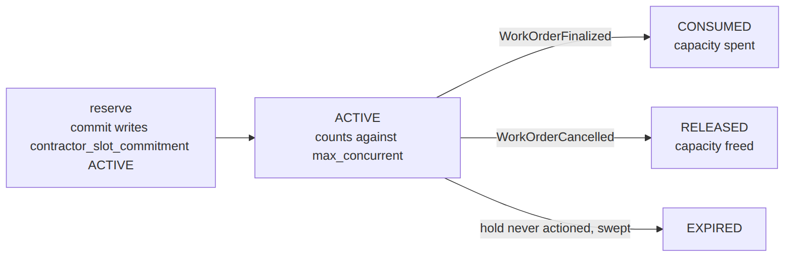
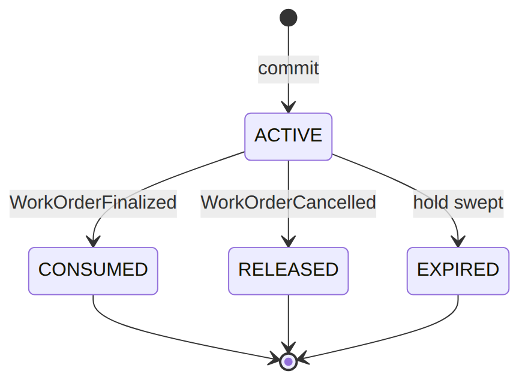

> 📱 **Rendered view** — diagrams below are images so they show in the GitHub app. Editable source (with mermaid): [`../workforce.md`](../workforce.md).

# Workforce — As-Built Design (EM-02 Capacity)

> **Capability codes:** EM-02 §3.x (contractor capacity & coverage) · **Module path:**
> `Modules/Workforce` · **Tests:** `WorkforceApi`, `SlotCommitmentLifecycle`

## 1. Purpose & boundaries
- **Owns:** the **field capacity** model — contractors, teams, staff, availability slots, region/skill
  coverage, and the **slot-commitment** ledger that reserves capacity for a work order.
- **Does NOT own:** the work (WorkOrder). It answers "who can do this job, where, with spare capacity"
  and atomically books it.
- **Job:** capacity registry + atomic commit/consume/release tied to WO lifecycle.

## 📖 Scenarios (service + Foundation involvement)

The whole module is one idea worth holding in your head before the scenarios: a **slot** is a recurring
window where some contractor can do work, and `max_concurrent` is how many jobs that window can hold at
once. Booking a job into a slot writes a **commitment** (a hold). Here is the life of one hold:





### 1. Register a contractor + teams + staff

**The story:** Someone in the back office is setting up who can do field work. They add an outside
company, its crews, and the individual technicians. Separately, an operator pre-loads where each
contractor works, what they are qualified for, and which hours they are free — this part is data the
operator seeds, not something you click through an API.

**Who does what:**
- `POST /api/contractors`, `…/{contractor}/teams`, and `POST /api/staff` write the contractor registry
  (the companies, crews, and technicians).
- The coverage rows — `contractor_availability_slot`, `contractor_region_skill`,
  `contractor_region_scope`, `skill_catalog` — are **operator seed data with no write API**. They define
  the bookable windows (`max_concurrent`), the certifications, and the region coverage.
- *Operator config.*

### 2. Match + atomically commit capacity for a WO

**The story:** A work order needs a field tech. The system finds a contractor who covers that area, has
the right skill, and still has a free spot in their schedule — then books that spot for this job, all in
one safe step so two jobs can never grab the same last place.

**Who does what:**
- WorkOrder's `autoAssign` calls `ContractorAvailabilityService::resolve(...)` to rank candidates by
  region + skill + spare capacity.
- It then calls `commit(slot, wo_id, when)`, which atomically reserves one of the slot's `max_concurrent`
  places and writes a `contractor_slot_commitment` row with status `ACTIVE`.
- *Foundation: a DB transaction guarantees no over-booking.* *Proven by `WorkforceApiTest`.*

**Sample —** the hold this writes (one place taken in a slot that allows five):
```json
{ "commitment_id":"sc_1","slot_id":"slot_1","wo_id":"wo_1","qty":1,"status":"ACTIVE" }
```
Slot `slot_1` has `max_concurrent:5`, so after this commit four places remain.

### 3. Slot full → no commit → caller falls back

**The story:** The best contractor's schedule is already full. Rather than overbook them, the system
quietly moves on to the next-best option, and if no outside contractor has room, it uses an in-house
technician.

**Who does what:**
- If the slot is already at `max_concurrent`, `commit` returns no hold.
- WorkOrder then tries the next contractor, and finally an in-house `StaffMember`.
- *Shows: capacity is a hard limit that drives the dispatch strategy.*

### 4. WO finalized → consume capacity

**The story:** The job is done and signed off. The hold that was reserving a spot now turns into "spot
used" — that place is spent, not given back.

**Who does what:**
- The `WorkOrderFinalized` event (via the outbox) reaches `ResolveSlotCommitmentOnWoLifecycle`.
- That listener calls `consumeForWorkOrder(wo_id)`, flipping the commitment `ACTIVE → CONSUMED` (capacity
  spent).
- *Foundation: an outbox listener.* *Proven by `SlotCommitmentLifecycleTest`.*

### 5. WO cancelled → release capacity

**The story:** The job got cancelled, so the spot it was holding should go back into the pool for someone
else to book.

**Who does what:**
- The `WorkOrderCancelled` event reaches the same listener, which calls `releaseForWorkOrder(wo_id)`.
- That flips the commitment to `RELEASED` (capacity restored, the place is bookable again).
- *Proven by `SlotCommitmentLifecycleTest`.*

### 6. Re-running consume/release is a no-op

**The story:** Sometimes the same "job finished" message arrives twice. The second time should change
nothing — no double-counting, no errors.

**Who does what:**
- A duplicate `WorkOrderFinalized` (event replay) calls `consumeForWorkOrder` again.
- It finds no `ACTIVE` commitment for that work order, so it makes 0 changes.
- *Foundation: an idempotent reaction.* *Proven by `SlotCommitmentLifecycleTest`.*

### 7. Emergency-only slots

**The story:** Some contractor windows are reserved strictly for emergencies. Routine jobs are never
booked into them, so there is always room when something urgent comes in.

**Who does what:**
- A slot with `emergency_only=true` is only matched for URGENT work orders.
- This keeps routine work off the emergency window.
- *Config-driven matching.*

### 8. In-house staff matching

**The story:** When no outside contractor can take the job, the system falls back to the operator's own
employees, picking one whose skills fit.

**Who does what:**
- When no contractor fits, the matcher uses a `StaffMember` whose skills cover the job.
- *Shows: the two-tier (outsourced → in-house) model.*

## 2. Data model — ≥4 **complete** sample rows + readings
> **Completeness:** each row lists **every domain column** (nullables shown as `null`). The string
> business / composite key shown is the real primary key; `created_at`/`updated_at` are omitted by
> convention.

### `contractor` (the registry root) · `type`: `INTERNAL|EXTERNAL` · `status`: `ACTIVE|SUSPENDED|RETIRED`
```json
{ "contractor_id":"ctr_9","operator_code":"WIK","code":"FIBERCO","name":"FiberCo Ltd","type":"EXTERNAL","skills":["fiber-install","diagnostics"],"status":"ACTIVE" }
{ "contractor_id":"ctr_4","operator_code":"WIK","code":"COASTNET","name":"CoastNet Engineers","type":"EXTERNAL","skills":["coax-install"],"status":"ACTIVE" }
{ "contractor_id":"ctr_1","operator_code":"WIK","code":"INHOUSE","name":"WIK In-House Field","type":"INTERNAL","skills":null,"status":"ACTIVE" }
{ "contractor_id":"ctr_0","operator_code":"WIK","code":"OLDCO","name":"OldCo (retired)","type":"EXTERNAL","skills":null,"status":"RETIRED" }
```
**Read each row as a sentence — *this data means this:***

| Row | What it means in plain English |
|-----|--------------------------------|
| **ctr_9** | An **outsourced** contractor "FiberCo" (`type=EXTERNAL`, `code=FIBERCO`), **live** (`status=ACTIVE`), summarised as doing fiber installs + diagnostics (`skills`). |
| **ctr_4** | An outsourced contractor "CoastNet" (`code=COASTNET`), **live**, summarised for coax installs. |
| **ctr_1** | The operator's **in-house** field crew (`type=INTERNAL`, `code=INHOUSE`), live, with no skills summary (`skills=null`). |
| **ctr_0** | A **retired** outsourced contractor "OldCo" (`status=RETIRED`) — kept on record, not deleted. |

**The columns that did the work:**
- A contractor is who a job gets dispatched to; `type` splits outsourced (`EXTERNAL`) from in-house (`INTERNAL`), `status` retires one without deleting it, and `code` is the operator-unique short handle (`(operator,code)` is unique).
- The real per-(contractor, region, skill) certification lives in `contractor_region_skill`; the `skills` JSON here is only a coarse summary.

### `contractor_team` · `status`: `ACTIVE|…` · & `staff_member` · `role`: `TECHNICIAN|TEAM_LEAD|SUPERVISOR`
```json
{ "team_id":"team_2","contractor_id":"ctr_4","operator_code":"WIK","code":"NYALI-A","name":"Nyali Crew A","skills":["coax-install"],"status":"ACTIVE" }
{ "staff_id":"stf_7","operator_code":"WIK","contractor_id":null,"team_id":null,"name":"Asha Mwangi","role":"TECHNICIAN","msisdn":"+254700000007","skills":["diagnostics"],"status":"ACTIVE" }
{ "staff_id":"stf_9","operator_code":"WIK","contractor_id":"ctr_4","team_id":"team_2","name":"Juma Otieno","role":"TEAM_LEAD","msisdn":"+254700000009","skills":["coax-install"],"status":"ACTIVE" }
{ "staff_id":"stf_3","operator_code":"WIK","contractor_id":"ctr_9","team_id":null,"name":"Wanjiru Kamau","role":"TECHNICIAN","msisdn":null,"skills":["fiber-install"],"status":"ACTIVE" }
```
**Read each row as a sentence — *this data means this:***

| Row | What it means in plain English |
|-----|--------------------------------|
| **team_2** | A crew "Nyali Crew A" (`team_id=team_2`, `code=NYALI-A`) belonging to contractor `ctr_4`, **active**, skilled in coax installs (`skills`). |
| **stf_7** | An **in-house** technician Asha Mwangi (`staff_id=stf_7`, `contractor_id=null`, `team_id=null`, `role=TECHNICIAN`) skilled in diagnostics — the fallback tier when no outsourced contractor has capacity. |
| **stf_9** | A **team lead** Juma Otieno (`role=TEAM_LEAD`) on contractor `ctr_4`'s crew `team_2`, skilled in coax installs. |
| **stf_3** | A technician Wanjiru Kamau on contractor `ctr_9`, no team (`team_id=null`), skilled in fiber installs, with no phone on file (`msisdn=null`). |

**The columns that did the work:**
- A `contractor_team` (`team_id`) is a crew owned by a contractor; a `staff_member` (`staff_id`) is one named technician — in-house when `contractor_id` is null, otherwise that crew's tech.
- `skills` drives skill matching; `role` ranks people within a team.

### `contractor_availability_slot` · `day_of_week`: `MONDAY..SUNDAY|ALL_WEEK` · `service_scope`: `INSTALL|SUPPORT|MAINTENANCE|RECOVERY|AUDIT`
```json
{ "slot_id":"slot_1","operator_code":"WIK","contractor_id":"ctr_9","tech_region_id":"KE-NRB-KAREN","service_scope":"INSTALL","day_of_week":"ALL_WEEK","hour_start":"08:00:00","hour_end":"17:00:00","timezone":"Africa/Nairobi","max_concurrent":5,"emergency_only":false,"active":true,"effective_from":"2026-01-01","effective_to":null }
{ "slot_id":"slot_2","operator_code":"WIK","contractor_id":"ctr_9","tech_region_id":"KE-NRB-KAREN","service_scope":"SUPPORT","day_of_week":"MONDAY","hour_start":"09:00:00","hour_end":"13:00:00","timezone":"Africa/Nairobi","max_concurrent":3,"emergency_only":false,"active":true,"effective_from":null,"effective_to":null }
{ "slot_id":"slot_3","operator_code":"WIK","contractor_id":"ctr_4","tech_region_id":"KE-MSA-NYALI","service_scope":"INSTALL","day_of_week":"ALL_WEEK","hour_start":"00:00:00","hour_end":"23:59:00","timezone":"Africa/Nairobi","max_concurrent":2,"emergency_only":true,"active":true,"effective_from":"2026-03-01","effective_to":null }
{ "slot_id":"slot_4","operator_code":"WIK","contractor_id":"ctr_4","tech_region_id":"KE-MSA-NYALI","service_scope":"SUPPORT","day_of_week":"SUNDAY","hour_start":"08:00:00","hour_end":"12:00:00","timezone":"Africa/Nairobi","max_concurrent":1,"emergency_only":false,"active":false,"effective_from":"2026-01-01","effective_to":"2026-05-31" }
```
**Read each row as a sentence — *this data means this:***

| Row | What it means in plain English |
|-----|--------------------------------|
| **slot_1** | Contractor `ctr_9` is bookable for **installs** in Karen **all week** 08:00–17:00 (`service_scope=INSTALL`, `day_of_week=ALL_WEEK`), holding **5** jobs at once (`max_concurrent=5`), live since 2026-01-01 (`active=true`, `effective_to=null`). |
| **slot_2** | The same contractor's **support** window in Karen, **Mondays** 09:00–13:00, capacity **3**, with no effective-date bounds (`effective_from`/`effective_to` null). |
| **slot_3** | Contractor `ctr_4`'s install window in Nyali, all week, but **emergency-only** (`emergency_only=true`) so it matches **URGENT WOs only**, capacity **2**. |
| **slot_4** | Contractor `ctr_4`'s Sunday support window that is **not bookable**: `active=false` and its `effective_to` (2026-05-31) has already lapsed. |

**The columns that did the work:**
- A slot is a bookable window = region (`tech_region_id`) + `service_scope` + a day/hour range (in `timezone`) + `max_concurrent` (how many jobs the window holds at once).
- To match a slot the matcher needs region + skill + scope + a free place in `max_concurrent`, all inside the slot's effective window.

### `contractor_slot_commitment` · `status`: `ACTIVE|CONSUMED|RELEASED|EXPIRED`
```json
{ "commitment_id":"sc_1","operator_code":"WIK","slot_id":"slot_1","contractor_id":"ctr_9","wo_id":"wo_1","committed_for_datetime":"2026-06-22T09:00:00Z","qty":1,"status":"ACTIVE","consumed_at":null,"released_at":null,"expired_at":null }
{ "commitment_id":"sc_2","operator_code":"WIK","slot_id":"slot_1","contractor_id":"ctr_9","wo_id":"wo_2","committed_for_datetime":"2026-06-20T10:00:00Z","qty":1,"status":"CONSUMED","consumed_at":"2026-06-20T12:30:00Z","released_at":null,"expired_at":null }
{ "commitment_id":"sc_3","operator_code":"WIK","slot_id":"slot_2","contractor_id":"ctr_9","wo_id":"wo_5","committed_for_datetime":"2026-06-21T11:00:00Z","qty":1,"status":"RELEASED","consumed_at":null,"released_at":"2026-06-21T11:45:00Z","expired_at":null }
{ "commitment_id":"sc_4","operator_code":"WIK","slot_id":"slot_1","contractor_id":"ctr_9","wo_id":"wo_7","committed_for_datetime":"2026-06-22T14:00:00Z","qty":1,"status":"EXPIRED","consumed_at":null,"released_at":null,"expired_at":"2026-06-22T15:00:00Z" }
```
**Read each row as a sentence — *this data means this:***

| Row | What it means in plain English |
|-----|--------------------------------|
| **sc_1** | Work order `wo_1` holds **1** place on `slot_1` (`qty=1`), and the hold is **live** (`status=ACTIVE`) — so it **counts against capacity**. |
| **sc_2** | `wo_2`'s hold on `slot_1` was **used up** when the WO finalized (`status=CONSUMED`, `consumed_at` stamped) — no longer occupies a place. |
| **sc_3** | `wo_5`'s hold on `slot_2` was **freed** when the WO was cancelled (`status=RELEASED`, `released_at` stamped). |
| **sc_4** | `wo_7`'s hold on `slot_1` was never actioned and got **swept** (`status=EXPIRED`, `expired_at` stamped). |

**The columns that did the work:**
- Each row is one work order's hold on a slot, taking `qty` places out of the slot's `max_concurrent`.
- Only `ACTIVE` rows still count, so on `slot_1` (capacity 5) the ACTIVE `sc_1` is the only one occupying a place — the CONSUMED/EXPIRED rows leave room for new bookings. The matching `*_at` timestamp records which terminal transition fired.





### `skill_catalog` (operator-extensible, EM-02 §3.3) · composite PK `(operator_code, skill_code)` · `category`: `TECHNICAL_INSTALL|TECHNICAL_SUPPORT|SOFT_SKILL|…`
```json
{ "operator_code":"WIK","skill_code":"fiber-install","display_name":"FTTH installation","category":"TECHNICAL_INSTALL","active":true }
{ "operator_code":"WIK","skill_code":"coax-install","display_name":"HFC installation","category":"TECHNICAL_INSTALL","active":true }
{ "operator_code":"WIK","skill_code":"diagnostics","display_name":"Fault diagnostics","category":"TECHNICAL_SUPPORT","active":true }
{ "operator_code":"WIK","skill_code":"vip-handling","display_name":"VIP customer handling","category":"SOFT_SKILL","active":false }
```
**Read each row as a sentence — *this data means this:***

| Row | What it means in plain English |
|-----|--------------------------------|
| **fiber-install** | A live install skill "FTTH installation" (`category=TECHNICAL_INSTALL`, `active=true`). |
| **coax-install** | A live install skill "HFC installation" (`category=TECHNICAL_INSTALL`). |
| **diagnostics** | A live support skill "Fault diagnostics" (`category=TECHNICAL_SUPPORT`). |
| **vip-handling** | A **retired** soft skill "VIP customer handling" (`category=SOFT_SKILL`, `active=false`) — kept as a code, not deleted. |

**The columns that did the work:**
- The skill catalog is operator-extensible and deliberately *distinct from* Catalog's `TechContractorSkill` (that is contractor config; this is capacity); `category` groups skills and `active=false` retires a code without deleting it.

### `contractor_region_skill` (the WO routing filter, EM-02 §3.4) · composite PK `(contractor_id, tech_region_id, skill_code)`
```json
{ "contractor_id":"ctr_9","tech_region_id":"KE-NRB-KAREN","operator_code":"WIK","skill_code":"fiber-install","active":true }
{ "contractor_id":"ctr_9","tech_region_id":"KE-NRB-KAREN","operator_code":"WIK","skill_code":"diagnostics","active":true }
{ "contractor_id":"ctr_4","tech_region_id":"KE-MSA-NYALI","operator_code":"WIK","skill_code":"coax-install","active":true }
{ "contractor_id":"ctr_4","tech_region_id":"KE-MSA-NYALI","operator_code":"WIK","skill_code":"fiber-install","active":false }
```
**Read each row as a sentence — *this data means this:***

| Row | What it means in plain English |
|-----|--------------------------------|
| **ctr_9 · Karen · fiber-install** | Contractor `ctr_9` is **certified** (`active=true`) for fiber installs in Karen. |
| **ctr_9 · Karen · diagnostics** | The same contractor is also certified for diagnostics in Karen. |
| **ctr_4 · Nyali · coax-install** | Contractor `ctr_4` is certified for coax installs in Nyali. |
| **ctr_4 · Nyali · fiber-install** | Contractor `ctr_4` is **de-certified** for fiber installs in Nyali (`active=false`) — it will **not** match for fiber there. |

**The columns that did the work:**
- These rows are exactly what the auto-assign matcher requires before it can pick a contractor: certification is **per (contractor, region, skill)**, and `active=false` removes that one capability without touching the others.

### `contractor_region_scope` (per-region service coverage, EM-02 §3.2) · `service_scope`: `INSTALL|SUPPORT|MAINTENANCE|RECOVERY|AUDIT` · `coverage_role`: `PRIMARY|BACKUP|EXCLUSIVE`
```json
{ "coverage_id":"cov_1","operator_code":"WIK","contractor_id":"ctr_9","tech_region_id":"KE-NRB-KAREN","service_scope":"INSTALL","coverage_role":"PRIMARY","effective_from":"2026-01-01","effective_to":null }
{ "coverage_id":"cov_2","operator_code":"WIK","contractor_id":"ctr_9","tech_region_id":"KE-NRB-KAREN","service_scope":"SUPPORT","coverage_role":"PRIMARY","effective_from":"2026-01-01","effective_to":null }
{ "coverage_id":"cov_3","operator_code":"WIK","contractor_id":"ctr_4","tech_region_id":"KE-MSA-NYALI","service_scope":"INSTALL","coverage_role":"PRIMARY","effective_from":"2026-03-01","effective_to":null }
{ "coverage_id":"cov_4","operator_code":"WIK","contractor_id":"ctr_4","tech_region_id":"KE-MSA-NYALI","service_scope":"RECOVERY","coverage_role":"BACKUP","effective_from":"2026-03-01","effective_to":"2026-06-30" }
```
**Read each row as a sentence — *this data means this:***

| Row | What it means in plain English |
|-----|--------------------------------|
| **cov_1** | Contractor `ctr_9` is the **primary** install provider in Karen (`service_scope=INSTALL`, `coverage_role=PRIMARY`), open-ended (`effective_to=null`). |
| **cov_2** | The same contractor is also the **primary** support provider in Karen, open-ended. |
| **cov_3** | Contractor `ctr_4` is the **primary** install provider in Nyali, live since 2026-03-01. |
| **cov_4** | Contractor `ctr_4` is a **backup** recovery provider in Nyali (`coverage_role=BACKUP`, `service_scope=RECOVERY`) that **lapses end of June** (`effective_to=2026-06-30`). |

**The columns that did the work:**
- Coverage says which contractor serves which region for which service, scoped per (contractor, region, `service_scope`) and **time-versioned** via `effective_from`/`effective_to`.
- `coverage_role` ranks contractors: PRIMARY first, BACKUP as fallback, EXCLUSIVE locks the region to one contractor.

## 3. Services
| Service | Responsibility |
| --- | --- |
| `ContractorAvailabilityService` | `resolve()` (rank contractors by region+skill+spare capacity), `remainingCapacity()`; `commit()` (atomic), `consume()`/`release()`, `consumeForWorkOrder()`/`releaseForWorkOrder()` (by WO id) |

## 4. API surface
`/api/contractors` (+`…/{contractor}/teams`), `/api/staff`, `/api/contractor-availability` (capacity query),
`/api/contractor-slot-commitments` (+`…/{id}/consume`, `DELETE …/{id}` = release). Reads under
`permission:workforce.read`; writes under `permission:workforce.manage` (+ `idempotency` on commit/consume/release).

## 5. Integration (events)
- **Emits** (topic `em.cs`): `ContractorSlotCommitment{Created,Consumed,Released}` on commit/consume/release.
- **Consumes:** `ResolveSlotCommitmentOnWoLifecycle` (listener on `OutboxEventPublished`, matched by `event_type`)
  — `WorkOrderFinalized`→consume, `WorkOrderCancelled`→release.
- **Consumed by →** WorkOrder auto-assign (synchronous capacity query + commit).

## 6. Processes
No BPMN; service + the WO-lifecycle event listener.

## 7. Policy & config
Slots, coverage, skills, teams — operator data; `max_concurrent` is the capacity knob; `emergency_only`
reserves capacity for URGENT work.

## 8. Cross-module dependencies
- **Called by →** WorkOrder (`autoAssign` commits capacity).
- **Reacts to →** WorkOrder finalize/cancel.

## 9. Invariants & rules
| Rule | Statement | Enforced in |
| --- | --- | --- |
| EM-02 §3.6 | a finalized WO **consumes** its slot; a cancelled WO **releases** it | `ResolveSlotCommitmentOnWoLifecycle` |
| atomicity | a commit can't exceed `max_concurrent` | `ContractorAvailabilityService::commit` (DB tx) |
| idempotency | re-running consume/release on resolved commitments is a no-op | `consume/releaseForWorkOrder` |

## 10. Open items / deltas
- Slot-commitment lifecycle (consume/release on WO finalize/cancel) was wired during hardening —
  previously committed capacity leaked. Fixed.
