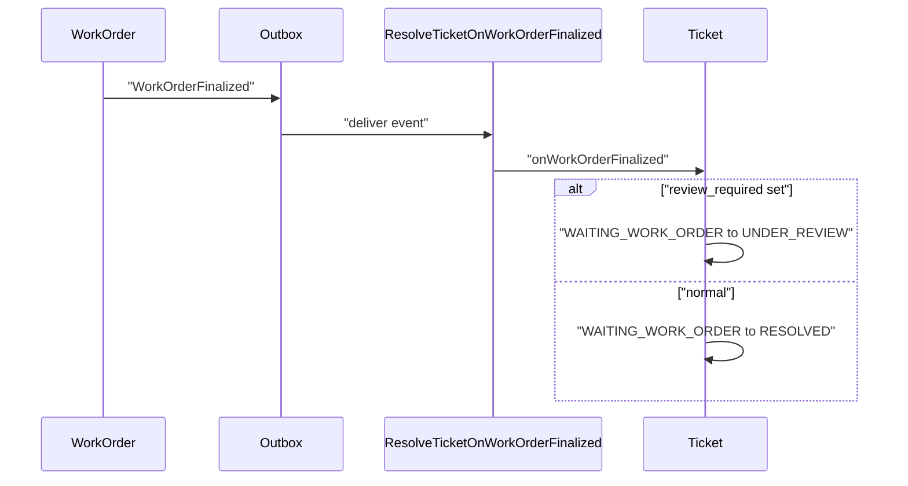
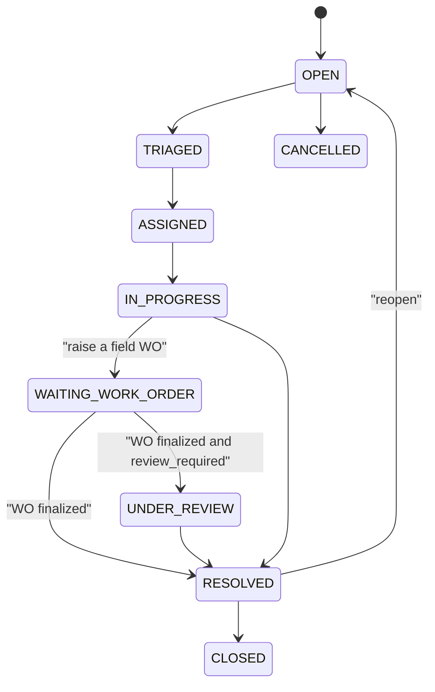

# Ticketing — As-Built Design

> **Capability codes:** TCK (tickets + SLA), ASR (service requests) · **Module path:**
> `Modules/Ticketing` · **Tests:** `TicketApi`, `Asr`

## 1. Purpose & boundaries
- **Owns:** customer **tickets** (categories, SLA, comments, timeline) and **ASRs** (requests that
  spawn work).
- **Does NOT own:** field work (WorkOrder) — it links to it and resolves when it finishes.
- **Job:** capture, categorise, SLA-track and resolve customer issues; turn an ASR into a work order.

## 📖 Scenarios (service + Foundation involvement)

### 1. Create a ticket (SLA stamped from policy)

**The story in plain English:** A customer reports a fault. We open a ticket and immediately put a clock
on it — a deadline to respond and a deadline to resolve — taken from the operator's SLA rules for that
kind of problem. From that moment the ticket is being timed.

**Who does what:** `POST /api/tickets {category:'NO_INTERNET', subcategory:'NO_SIGNAL', subscription_id}`
→ `TicketService::create` opens the ticket `OPEN` and stamps the SLA due-times from the matching
`sla_policy`. Emits `TicketCreated`.

**Sample — a freshly created ticket:**
```json
{ "ticket_id":"tck_1","ticket_number":"TKT-2026-000101","category":"TECHNICAL","subcategory":"NO_SIGNAL","priority":"URGENT","status":"OPEN","queue":"noc-l1","sla_due_at":"2026-06-20T16:00:00Z","first_response_due_at":"2026-06-20T13:00:00Z","assignee_id":null }
```
*Proven by `TicketApiTest`.*

### 2. Escalate to a truck roll → linked WO

**The story in plain English:** Some problems cannot be fixed from a desk — they need a technician to
visit. The agent raises a work order from the ticket, the two are linked, and the ticket goes into a
"waiting on the field crew" holding state.

**Who does what:** `POST …/{id}/work-orders` creates a WO-01 support WO linked back
(`source_type=TICKET`), writes a `ticket_link` (`relation=CREATED_FROM_TICKET`), and moves the ticket to
`WAITING_WORK_ORDER`. Gated by the category's `wo_allowed` (TCK-3). Emits `TicketWorkOrderCreated`.
*Cross-module: WorkOrder.* *Proven by `TicketApiTest::test_technical_ticket_raises_work_order`.*

### 3. WO finalized → auto-resolve (event-driven)

**The story in plain English:** The technician finishes the job. We do not make an agent re-open the
ticket to close it — the work order finishing automatically resolves the waiting ticket. If the category
needs a supervisor's eye, it parks in review instead; if the work was cancelled, the ticket goes back
into the work queue.

**Who does what:** `WorkOrderFinalized` (outbox) → `ResolveTicketOnWorkOrderFinalized` →
`onWorkOrderFinalized` moves the linked ticket out of `WAITING_WORK_ORDER` to `RESOLVED` (or, if the
category's `review_required` is set, to `UNDER_REVIEW`). A `WorkOrderCancelled` instead sends it back to
`ASSIGNED`/`WAITING_INTERNAL` with `requires_review`. *Foundation: outbox listener.*


*Proven by `TicketApiTest::test_finalizing_the_work_order_resolves_the_ticket`.*

### 4. Conversation on the timeline
`POST …/{id}/comments` appends a `ticket_comment` + a `ticket_timeline` row (append-only audit).

### 5. ASR — a typed service request (idempotent)

**The story in plain English:** Some intake comes in as a structured "service request" rather than a free
ticket. We validate its type, run the operator's routing rules to pick a queue and priority, and create a
ticket from it. Certain technical-trouble requests automatically spin up a field work order.

**Who does what:** `POST /api/asr` (idempotent) → `AsrService::create` validates an `asr_type`, applies
`rules.asr.routing` (queue + priority + auto-actions), and creates an ASR-typed ticket; a
`TECHNICAL_TROUBLE` whose routing sets `autoCreateWorkOrder` auto-raises a support WO. *Proven by
`AsrTest::test_technical_trouble_routes_to_noc_and_raises_work_order`.*

### 6. SLA breach surfaces on the NOC
Past-due open tickets appear in ItOps `GET /api/noc/sla-overdue` (reads ticket SLA timestamps).

### 7. Assign to an agent
`POST …/{id}/assign` records the owner; the timeline captures the change.

### 8. Category drives SLA + routing
The `ticket_category_catalog` fixes the SLA matrix + default priority — an operator tunes SLAs as data.

## 2. Data model — ≥4 **complete** sample rows + readings per table
> **Completeness:** each row lists **every domain column** (nullables shown as `null`). The string
> primary key shown is the real one; `created_at`/`updated_at` (and `ticket_timeline`'s `created_at`,
> which uses the DB default) are omitted by convention. `sla_policy`/`ticket_category_catalog` show their
> natural keys (the surrogate auto-increment `id` on `sla_policy` is omitted as it has a composite key).

### `ticket` · `status`: `OPEN|TRIAGED|ASSIGNED|IN_PROGRESS|WAITING_CUSTOMER|WAITING_INTERNAL|WAITING_WORK_ORDER|UNDER_REVIEW|RESOLVED|CLOSED|CANCELLED` (`PENDING_WO` is a legacy alias of `WAITING_WORK_ORDER`) · `priority`: `LOW|NORMAL|HIGH|URGENT` · `category`: `TECHNICAL|BILLING|INFORMATION|COMPLAINT|SERVICE_REQUEST` · `asr_type`: `TECHNICAL_TROUBLE|INFORMATION_REQUEST|COMPLAINT|SERVICE_REQUEST`
```json
{ "ticket_id":"tck_1","ticket_number":"TKT-2026-000101","operator_code":"WIK","category":"TECHNICAL","asr_type":"TECHNICAL_TROUBLE","subcategory":"NO_SIGNAL","priority":"URGENT","status":"OPEN","customer_id":"cust_1","account_id":"acct_1","subscription_id":"sub_1","subject":"No signal since morning","description":"Modem all red lights","queue":"noc-l1","assignee_id":null,"sla_due_at":"2026-06-20T16:00:00Z","first_response_due_at":"2026-06-20T13:00:00Z","first_response_at":null,"work_order_id":null,"resolution_code":null,"reopened_count":0,"requires_review":false,"resolution_note":null,"opened_by":"agent_7","resolved_at":null,"closed_at":null,"cancelled_at":null }
{ "ticket_id":"tck_2","ticket_number":"TKT-2026-000102","operator_code":"WIK","category":"BILLING","asr_type":"INFORMATION_REQUEST","subcategory":null,"priority":"NORMAL","status":"IN_PROGRESS","customer_id":"cust_2","account_id":"acct_2","subscription_id":null,"subject":"Invoice query","description":null,"queue":"billing","assignee_id":"agent_3","sla_due_at":"2026-06-22T09:00:00Z","first_response_due_at":"2026-06-20T17:00:00Z","first_response_at":"2026-06-20T15:00:00Z","work_order_id":null,"resolution_code":null,"reopened_count":0,"requires_review":false,"resolution_note":null,"opened_by":"agent_3","resolved_at":null,"closed_at":null,"cancelled_at":null }
{ "ticket_id":"tck_3","ticket_number":"TKT-2026-000103","operator_code":"WIK","category":"TECHNICAL","asr_type":"TECHNICAL_TROUBLE","subcategory":"NO_SIGNAL","priority":"HIGH","status":"RESOLVED","customer_id":"cust_3","account_id":"acct_3","subscription_id":"sub_3","subject":"Intermittent drops","description":null,"queue":"noc-l1","assignee_id":"agent_7","sla_due_at":"2026-06-19T16:00:00Z","first_response_due_at":"2026-06-19T13:00:00Z","first_response_at":"2026-06-19T12:30:00Z","work_order_id":"wo_2","resolution_code":"FIXED_ON_SITE","reopened_count":1,"requires_review":false,"resolution_note":"Replaced ONT","opened_by":"agent_7","resolved_at":"2026-06-19T15:00:00Z","closed_at":null,"cancelled_at":null }
{ "ticket_id":"tck_4","ticket_number":"TKT-2026-000104","operator_code":"WIK","category":"COMPLAINT","asr_type":"COMPLAINT","subcategory":null,"priority":"LOW","status":"CLOSED","customer_id":"cust_4","account_id":"acct_4","subscription_id":null,"subject":"Rude agent","description":null,"queue":"complaints","assignee_id":"sup_2","sla_due_at":"2026-06-18T16:00:00Z","first_response_due_at":"2026-06-18T13:00:00Z","first_response_at":"2026-06-18T12:00:00Z","work_order_id":null,"resolution_code":"APOLOGY_ISSUED","reopened_count":0,"requires_review":true,"resolution_note":"Escalated, apology sent","opened_by":"agent_1","resolved_at":"2026-06-18T14:00:00Z","closed_at":"2026-06-19T09:00:00Z","cancelled_at":null }
```
The ticket's own lifecycle (the holding state `WAITING_WORK_ORDER` is where a ticket sits while a linked
field job runs; `WAITING_CUSTOMER`/`WAITING_INTERNAL` are other holds):


**Reading:** `status` is the resolution lifecycle; `sla_due_at`/`first_response_due_at` are stamped at
create from the matching `sla_policy` (URGENT TECHNICAL = 4h here). tck_3 was resolved by its linked WO
(`work_order_id=wo_2`) and `reopened_count` shows it bounced once; tck_4 is `requires_review` (a
supervisor gate). `asr_type` tags the ASR-01..04 specialisation; a past-due `OPEN` ticket is what the
NOC SLA-overdue view surfaces.

### `ticket_category_catalog` (operator category config) & `sla_policy` (response-hours matrix)
```json
{ "operator_code":"WIK","category_code":"NO_INTERNET","display_name":"No internet","type_code":"TECHNICAL_SUPPORT","default_priority":"HIGH","default_queue":"TECH_SUPPORT_L1","default_asr_type":"TECHNICAL_TROUBLE","default_sla_policy":null,"wo_allowed":true,"default_wo_kind":"SUPPORT","review_required":false,"active":true }
{ "operator_code":"WIK","category_code":"BILLING_DISPUTE","display_name":"Billing dispute","type_code":"BILLING_COMPLAINT","default_priority":"NORMAL","default_queue":"BILLING_QUEUE","default_asr_type":"COMPLAINT","default_sla_policy":null,"wo_allowed":false,"default_wo_kind":null,"review_required":false,"active":true }
{ "operator_code":"WIK","category_code":"INSTALL_INCOMPLETE","display_name":"Install incomplete","type_code":"INSTALLATION_FOLLOWUP","default_priority":"HIGH","default_queue":"TECH_SUPPORT_L1","default_asr_type":"SERVICE_REQUEST","default_sla_policy":null,"wo_allowed":true,"default_wo_kind":"SUPPORT","review_required":true,"active":true }
{ "operator_code":"WIK","category_code":"GENERAL_INQUIRY","display_name":"General inquiry","type_code":"GENERAL_INQUIRY","default_priority":"LOW","default_queue":"CARE_QUEUE","default_asr_type":"INFORMATION_REQUEST","default_sla_policy":null,"wo_allowed":false,"default_wo_kind":null,"review_required":false,"active":false }
```
```json
{ "operator_code":"WIK","category":"NO_INTERNET","priority":"URGENT","response_hours":1 }
{ "operator_code":"WIK","category":"BILLING_DISPUTE","priority":"NORMAL","response_hours":8 }
{ "operator_code":"WIK","category":null,"priority":"HIGH","response_hours":4 }
{ "operator_code":null,"category":null,"priority":"NORMAL","response_hours":24 }
```
**Reading:** the **category catalog** is operator config — default priority/queue/ASR type, whether it
may spawn a WO (`wo_allowed` gates TCK-3) and of which `default_wo_kind`, and whether a finalized WO
parks the ticket in `UNDER_REVIEW` (`review_required`, e.g. INSTALL_INCOMPLETE); `active=false` retires a
category (the row shown as `active:false` here is illustrative). `type_code` is the operator type family
(`TECHNICAL_SUPPORT`, `BILLING_COMPLAINT`, …) — distinct from `default_asr_type`. The **SLA policy**
resolves `response_hours` by **most-specific match** (category+priority > priority-only > the all-`null`
operator default; the WIK seed ships the priority-only defaults URGENT=4/HIGH=8/NORMAL=24/LOW=72);
editing rows tunes SLAs with no code.

### `ticket_comment` / `ticket_timeline` (append-only)
```json
{ "id":"tc_1","ticket_id":"tck_1","author_id":"agent_7","visibility":"INTERNAL","body":"Dispatching tech.","internal":true }
{ "id":"tc_2","ticket_id":"tck_1","author_id":"agent_7","visibility":"CUSTOMER_VISIBLE","body":"A technician is on the way.","internal":false }
{ "id":"tc_3","ticket_id":"tck_2","author_id":"cust_2","visibility":"CUSTOMER_VISIBLE","body":"Any update?","internal":false }
{ "id":"tc_4","ticket_id":"tck_3","author_id":"agent_7","visibility":"INTERNAL","body":"ONT swapped on site.","internal":true }
```
```json
{ "id":"tl_1","ticket_id":"tck_1","event_type":"CREATED","from_status":null,"to_status":"OPEN","actor_id":"agent_7","meta":null }
{ "id":"tl_2","ticket_id":"tck_1","event_type":"ASSIGNED","from_status":"OPEN","to_status":"ASSIGNED","actor_id":"sup_1","meta":{"assignee":"agent_7"} }
{ "id":"tl_3","ticket_id":"tck_3","event_type":"WorkOrderCreatedFromTicket","from_status":"ASSIGNED","to_status":"WAITING_WORK_ORDER","actor_id":"agent_7","meta":{"workOrderId":"wo_2"} }
{ "id":"tl_4","ticket_id":"tck_3","event_type":"LINKED_WORK_ORDER_FINALIZED","from_status":"WAITING_WORK_ORDER","to_status":"RESOLVED","actor_id":null,"meta":{"workOrderId":"wo_2","finalReason":"FIXED_ON_SITE"} }
```
**Reading:** the timeline is the immutable history (created → assigned → WO linked → resolved), each row
carrying the `from_status`/`to_status` transition + actor + `meta`; comments are the conversation, gated
by `visibility` (INTERNAL vs CUSTOMER_VISIBLE) and the legacy `internal` flag. This is the audit a
supervisor reads.

### `ticket_link` (multi-entity links — TCK-2) · `entity_type`: `SUBSCRIPTION|INVOICE|WORK_ORDER|TICKET|CUSTOMER|…` · `relation`: `RELATED|DUPLICATE_OF|CAUSED_BY|CREATED_FROM_TICKET|…`
```json
{ "link_id":"tlnk_1","ticket_id":"tck_3","entity_type":"WORK_ORDER","entity_ref":"wo_2","relation":"CREATED_FROM_TICKET","linked_by":"agent_7" }
{ "link_id":"tlnk_2","ticket_id":"tck_1","entity_type":"SUBSCRIPTION","entity_ref":"sub_1","relation":"RELATED","linked_by":"agent_7" }
{ "link_id":"tlnk_3","ticket_id":"tck_2","entity_type":"INVOICE","entity_ref":"inv_56","relation":"RELATED","linked_by":"agent_3" }
{ "link_id":"tlnk_4","ticket_id":"tck_4","entity_type":"TICKET","entity_ref":"tck_2","relation":"DUPLICATE_OF","linked_by":"sup_2" }
```
**Reading:** a ticket must reference at least one business entity (TCK-2) — either a column on `ticket`
(customer/account/subscription/work_order) or a `ticket_link` row, or be an explicit internal category.
Raising a WO inserts a `CREATED_FROM_TICKET` link (tlnk_1) as the auditable join. The
`(ticket_id, entity_type, entity_ref, relation)` tuple is unique (links are idempotent via
`updateOrInsert`).

### `ticket_attachment` (file references — TCK-9) · `visibility`: `INTERNAL|CUSTOMER_VISIBLE`
```json
{ "attachment_id":"tatt_1","ticket_id":"tck_1","file_id":"file_77","file_name":"modem.jpg","content_type":"image/jpeg","size_bytes":48211,"visibility":"INTERNAL","uploaded_by":"agent_7" }
{ "attachment_id":"tatt_2","ticket_id":"tck_3","file_id":"file_78","file_name":"site-report.pdf","content_type":"application/pdf","size_bytes":102400,"visibility":"CUSTOMER_VISIBLE","uploaded_by":"agent_7" }
{ "attachment_id":"tatt_3","ticket_id":"tck_2","file_id":"file_79","file_name":"invoice-scan.png","content_type":"image/png","size_bytes":20480,"visibility":"INTERNAL","uploaded_by":"cust_2" }
{ "attachment_id":"tatt_4","ticket_id":"tck_4","file_id":"file_80","file_name":"complaint.txt","content_type":null,"size_bytes":null,"visibility":"INTERNAL","uploaded_by":"sup_2" }
```
**Reading:** TCK only keeps a **reference** — the binary lives in `FOUNDATION_FILE_STORAGE` (`file_object`).
`addAttachment` resolves the `file_id` against that store (404 if missing) and takes the authoritative
`file_name`/`content_type`/`size_bytes` from it rather than trusting the caller (TCK-9: object keys carry
no PII). `visibility` gates whether self-care can see the file. A gap-free human `ticket_number` is minted
by the per-(operator, fiscal_year) `ticket_number_sequence` counter at create.

## 3. Services
| Service | Responsibility |
| --- | --- |
| `TicketService` | ticket lifecycle (`create`/`assign`/`comment`/`addAttachment`/`linkEntity`/`createWorkOrder`/`resolve`/`reopen`/`cancel`/`close`), SLA + first-response capture, gap-free `ticket_number`, WO linkage, `onWorkOrderFinalized`/`onWorkOrderCancelled` |
| `AsrService::create` | ASR-typed intake; applies `rules.asr.routing`, creates the ticket, auto-raises a WO when routing says so |

## 4. API surface
`/api/tickets` (+ `/{id}/assign`, `/comments`, `/attachments`, `/links`, `/work-orders`, `/resolve`,
`/reopen`, `/cancel`, `/close`), `/api/asr`, `/api/sla-policies` (GET + POST). Permissions:
`ticket.read` (reads), `ticket.create` (create/comment/attach/asr), `ticket.assign` (assign),
`ticket.manage` (links/WO/resolve/reopen/cancel/close/SLA-policy write); create + raise-WO + ASR are
`idempotency`-guarded.

## 5. Integration (events) — topic `ticketing.case`
- **Emits:** `TicketCreated`, `TicketAssigned`, `TicketStatusChanged`, `TicketResolved`, `TicketClosed`,
  `TicketWorkOrderCreated`, `TicketReopened`, `TicketCancelled`. (ASR intake emits no separate event — it
  just creates a ticket, so the ticket events above fire.)
- **Consumes:** `WorkOrderFinalized` → resolve the linked ticket; `WorkOrderCancelled` → send it back for
  review (`ResolveTicketOnWorkOrderFinalized`).

## 6. Processes
Service-level; ASR may start a fulfillment/WO flow.

## 7. Policy & config
`ticket_category_catalog` + `sla_policy` (operator SLA matrix), per-category routing — data.

## 8. Cross-module dependencies
- **Calls →** WorkOrder (support WO from a ticket). **Reacts to →** WorkOrder finalize (auto-resolve);
  Notification for customer updates.

## 9. Invariants & rules
| Rule | Statement | Enforced in |
| --- | --- | --- |
| SLA-on-create | ticket SLA captured from the category policy | `TicketService::create` |
| WO-resolve | a finalized linked WO resolves its ticket | `ResolveTicketOnWorkOrderFinalized` |

## 10. Open items / deltas
- Unified interaction timeline across modules (CUST-INT-01) is a projection opportunity (additive).
