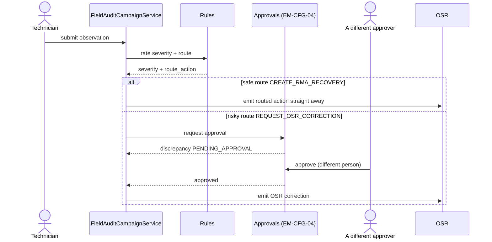
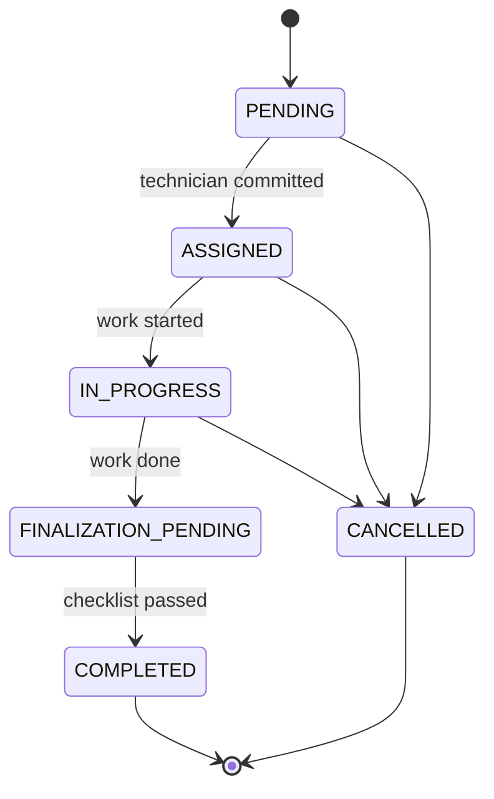

# WorkOrder — As-Built Design (Field Ops)

> **Capability codes:** WO-01 (lifecycle + dispatch), WO-01-FLOW-SUPPORT/-SHIFTING, FA-01/02/03 (field
> audits) · **Module path:** `Modules/WorkOrder` · **Tests:** `WorkOrderApi`, `AutoAssign`, `Framework`,
> `Support/ShiftingFlow`, `SlaSkills`, `FieldAudit*`

## 1. Purpose & boundaries
- **Owns:** the **work order** lifecycle (create → assign → start → finalize/cancel), its history,
  job-type catalog, finalization checklist, and the **field-audit** capability.
- **Does NOT own:** the workforce capacity it consumes (Workforce), the equipment (OSR), the order it
  serves (Fulfillment). It executes field/desk work.
- **Job:** dispatch + track field work with SLA & skills, and run FA inspections.

## 📖 Scenarios (service + Foundation involvement)

> **What a "work order" is:** a single job a field technician (or a desk agent) has to carry out — install
> a customer, fix a fault, relocate a service, inspect equipment. Each work order moves through a fixed set
> of statuses from the moment it is created until it is finished or cancelled (see the lifecycle diagram in
> the Data model section).

### 1. Create + auto-assign an install WO (scope-gated)

**The story:** A new customer has ordered an internet install. A dispatcher creates a job for it, and the
system tries to immediately hand that job to a technician who works the right area, has the right skills,
and has a free slot in their day. If it finds one, the job is booked to them automatically.

**Who does what:**
1. `POST /api/work-orders {type:INSTALLATION, tech_region_id:'KE-NRB-KAREN'}` must pass
   `permission:workorder.assign` **and** `scope:TECH_REGION,tech_region_id` (`Rbac/EnforceScope`). A
   dispatcher scoped to Karen cannot create a Mombasa work order.
2. The work order is created as `PENDING`, and its SLA due-time is stamped from its `priority`.
3. `autoAssign` asks Workforce for a contractor in the right region, with the right skill, and **spare
   capacity**, then atomically commits one of their slots → the work order moves to `ASSIGNED`.

*Proven by `WorkOrderApiTest`, `WorkOrderAutoAssignTest`.*

### 2. Auto-assign falls back to in-house staff

**The story:** Sometimes every outside contractor in that area is already fully booked. Rather than leave
the job stuck, the system looks at the operator's own employees and gives the job to a qualified one of
them instead.

**Who does what:**
- If no OUTSOURCED contractor has capacity, `autoAssign` matches an in-house `StaffMember` on skills. This
  is the second leg of the dispatch strategy and shows the Workforce dependency.

*Proven by `WorkOrderAutoAssignTest`.*

### 3. Support flow — resolve or escalate

**The story:** A customer reports a fault. A technician visits, and either fixes it on the spot or decides
the problem is bigger than a normal visit can solve. If it is fixed, the job closes. If it is not, the
system opens a fresh quality-control job to chase the deeper problem.

**Who does what:**
- `startSupportFlow` runs the support process steps: `SiteVisitDecisionHandler` → `ResolutionGateHandler`.
- If resolved → `FinalizeSupportHandler` closes it out.
- If not resolved → `MarkEscalationHandler` spawns a QCS (quality-control) work order as a child of the
  original.

This is built on the Foundation workflow toolbox. *Proven by `WorkOrderSupportFlowTest`.*

### 4. Shifting flow — phased relocation

**The story:** A customer is moving their service to a new premises. That cannot happen in one step — it
runs through several phases (e.g. de-install, re-install, reconnect). The system walks the job through each
phase and records what was bound where.

**Who does what:**
- `startShiftingFlow` walks the phases via `MarkPhaseHandler` / `CaptureBindingsHandler` /
  `FinalizeShiftingHandler`, emitting `PHASE_TRANSITIONED` as it advances and `SHIFTING_COMPLETED` at the
  end.

*Proven by `WorkOrderShiftingFlowTest`.*

### 5. Field audit — clean observation closes the task

**The story:** As part of an audit, a technician is sent to check a customer's equipment against what the
records say should be there. They scan the device, the serial matches the expected one, nothing is wrong,
and the audit task simply closes.

**Who does what:**
- `POST …/field-audit-tasks/{id}/observations` with the expected serial → `FieldAuditCampaignService` finds
  no discrepancy → the task moves to `CLOSED` and emits `FieldAuditTaskClosed`.

*Proven by `FieldAuditCampaignTest`.*

### 6. Field audit — missing unit → HIGH → RMA recovery

**The story:** The technician goes to check a device and it is simply not there. That is a serious problem,
so the system flags it as high-severity and kicks off a recovery request to get the missing hardware
accounted for.

**Who does what:**
- `presenceStatus:MISSING` → a `MISSING` discrepancy is raised.
- `rules.field_audit.equipment.discrepancy` (Foundation rules) rates it `HIGH` and routes it
  `CREATE_RMA_RECOVERY`.
- An OSR RMA request is emitted for the owning module to act on. This is a **safe** route, so it goes
  straight through with no approval.

*Proven by `FieldAuditCampaignTest`.*

### 7. Field audit — wrong serial → EM-CFG-04 → OSR correction

**The story:** The technician finds a device, but its serial number does not match the one on record. The
fix is to correct the equipment record — but because changing equipment records is risky, the system will
not do it on one person's say-so. It parks the change until a *second, different* person approves it; only
then is the correction sent out.

**Who does what:**
1. A wrong serial → a `WRONG_SERIAL` discrepancy routed `REQUEST_OSR_CORRECTION` (a **risky** route).
2. An EM-CFG-04 approval request is raised → the discrepancy goes `PENDING_APPROVAL`.
3. A different approver signs off → the OSR correction is emitted.

**Sample — the parked discrepancy (`fad_2`) waiting on approval:**
```json
{ "discrepancy_id":"fad_2","discrepancy_type":"WRONG_SERIAL","severity":"MEDIUM","status":"PENDING_APPROVAL","route_action":"REQUEST_OSR_CORRECTION","approval_request_id":"appr_3" }
```

How a submitted observation is rated and routed — safe routes go straight, risky ones wait for a second
person:



*Proven by `FieldAuditCampaignTest::test_wrong_serial_requires_em_cfg_04_approval_before_osr_correction`.*

### 8. A WO-backed audit creates its work order

**The story:** Some audit tasks need a technician physically dispatched, not just a desk check. When such a
task is set up, the system automatically creates a real field work order for it and links the two together
so the dispatch can happen.

**Who does what:**
- A task created with `createWorkOrder=true` emits `FieldAuditWorkOrderRequested`.
- The `CreateFieldAuditWorkOrder` listener (an outbox listener, Foundation) builds a `FIELD_AUDIT` work
  order, links it back via `wo_id`, and moves the task to `ASSIGNED`.

*Proven by `FieldAuditCampaignTest`.*

### (bonus) 9. Finalization is gated on a checklist
`finalize` is rejected unless the `wo_finalization_requirements` items are satisfied (R-WO finalize gate).

## 2. Data model — ≥4 **complete** sample rows + readings
> **Completeness:** each row lists **every domain column** (nullables shown as `null`). The string
> business key shown is the real primary key; `created_at`/`updated_at` are omitted by convention.

### `work_order` · `type`: `INSTALLATION|SUPPORT|SHIFTING|RELOCATION|EQUIPMENT|NOC|FIELD_AUDIT` · `status`: `PENDING|ASSIGNED|IN_PROGRESS|FINALIZATION_PENDING|COMPLETED|CANCELLED` · `priority`: `LOW|NORMAL|HIGH|URGENT` · `source_type`: `TICKET|SUBSCRIPTION_OP|FULFILLMENT|MANUAL|FIELD_AUDIT` · `link_type`: `PARENT_CHILD|DEPENDENCY`
```json
{ "work_order_id":"wo_1","operator_code":"WIK","type":"INSTALLATION","kind":null,"job_type_code":"FTTH_INSTALL","current_phase":null,"status":"COMPLETED","priority":"NORMAL","account_id":"acct_50","subscription_id":"sub_1","customer_id":"cust_50","homepass_id":"hp_1","tech_region_id":"KE-NRB-KAREN","contractor_id":"ctr_9","team_id":null,"assigned_technician_id":"tech_3","source_type":"FULFILLMENT","source_ref":"order_1","master_wo_id":null,"originating_context_type":null,"initial_reason":null,"escalation_candidate":false,"link_type":null,"scheduled_at":"2026-06-20T08:00:00Z","sla_due_at":"2026-06-21T08:00:00Z","assigned_at":"2026-06-20T07:30:00Z","first_response_at":"2026-06-20T08:05:00Z","started_at":"2026-06-20T09:00:00Z","finalized_at":"2026-06-20T10:30:00Z","warranty_until":"2026-09-18T00:00:00Z","resolution_code":"INSTALL_OK","final_reason":null,"required_skills":["fiber-install"],"findings":{"ontSerial":"SN-001"},"created_by":"u_desk1" }
{ "work_order_id":"wo_2","operator_code":"WIK","type":"SUPPORT","kind":"SUPPORT","job_type_code":"NO_SIGNAL","current_phase":"SITE_VISIT","status":"IN_PROGRESS","priority":"URGENT","account_id":"acct_51","subscription_id":"sub_2","customer_id":"cust_51","homepass_id":"hp_2","tech_region_id":"KE-NRB-KAREN","contractor_id":null,"team_id":null,"assigned_technician_id":"staff_7","source_type":"TICKET","source_ref":"tkt_9","master_wo_id":null,"originating_context_type":"TICKET","initial_reason":"no signal at ONT","escalation_candidate":false,"link_type":null,"scheduled_at":"2026-06-21T10:00:00Z","sla_due_at":"2026-06-21T14:00:00Z","assigned_at":"2026-06-21T09:30:00Z","first_response_at":"2026-06-21T10:10:00Z","started_at":"2026-06-21T10:15:00Z","finalized_at":null,"warranty_until":null,"resolution_code":null,"final_reason":null,"required_skills":["diagnostics"],"findings":null,"created_by":"u_desk2" }
{ "work_order_id":"wo_3","operator_code":"WIK","type":"SHIFTING","kind":"SHIFTING","job_type_code":null,"current_phase":"PHASE_1","status":"ASSIGNED","priority":"NORMAL","account_id":"acct_52","subscription_id":"sub_3","customer_id":"cust_52","homepass_id":"hp_3","tech_region_id":"KE-MSA-NYALI","contractor_id":"ctr_4","team_id":"team_2","assigned_technician_id":null,"source_type":"SUBSCRIPTION_OP","source_ref":"subop_77","master_wo_id":null,"originating_context_type":null,"initial_reason":null,"escalation_candidate":false,"link_type":null,"scheduled_at":"2026-06-23T08:00:00Z","sla_due_at":"2026-06-30T08:00:00Z","assigned_at":"2026-06-21T12:00:00Z","first_response_at":null,"started_at":null,"finalized_at":null,"warranty_until":null,"resolution_code":null,"final_reason":null,"required_skills":["fiber-install"],"findings":null,"created_by":"u_desk1" }
{ "work_order_id":"wo_4","operator_code":"WIK","type":"FIELD_AUDIT","kind":"FIELD_AUDIT","job_type_code":null,"current_phase":null,"status":"PENDING","priority":"LOW","account_id":null,"subscription_id":null,"customer_id":"cust_60","homepass_id":null,"tech_region_id":"KE-NRB-KAREN","contractor_id":null,"team_id":null,"assigned_technician_id":null,"source_type":"FIELD_AUDIT","source_ref":"fat_1","master_wo_id":null,"originating_context_type":null,"initial_reason":null,"escalation_candidate":false,"link_type":null,"scheduled_at":null,"sla_due_at":"2026-06-28T08:00:00Z","assigned_at":null,"first_response_at":null,"started_at":null,"finalized_at":null,"warranty_until":null,"resolution_code":null,"final_reason":null,"required_skills":[],"findings":null,"created_by":"u_audit1" }
{ "work_order_id":"wo_5","operator_code":"WIK","type":"SUPPORT","kind":"SUPPORT","job_type_code":"QCS","current_phase":"ESCALATED","status":"CANCELLED","priority":"HIGH","account_id":"acct_53","subscription_id":"sub_4","customer_id":"cust_53","homepass_id":"hp_4","tech_region_id":"KE-NRB-KAREN","contractor_id":"ctr_9","team_id":null,"assigned_technician_id":"tech_3","source_type":"SUBSCRIPTION_OP","source_ref":"subop_88","master_wo_id":"wo_2","originating_context_type":"TICKET","initial_reason":"repeat fault — quality control","escalation_candidate":true,"link_type":"PARENT_CHILD","scheduled_at":null,"sla_due_at":"2026-06-22T00:00:00Z","assigned_at":"2026-06-21T13:00:00Z","first_response_at":null,"started_at":null,"finalized_at":null,"warranty_until":null,"resolution_code":null,"final_reason":"CANCELLED_BY_DESK","required_skills":["diagnostics"],"findings":null,"created_by":"u_desk2" }
```

The `status` column moves through this lifecycle:



**Read each row as a sentence — *this data means this:***

| Row | What it means in plain English |
|-----|--------------------------------|
| **wo_1** | A NORMAL FTTH install (`type=INSTALLATION`, `job_type_code=FTTH_INSTALL`) raised by a fulfillment order (`source_type=FULFILLMENT`, `source_ref=order_1`), **done** (`status=COMPLETED`), worked by contractor `ctr_9`'s tech `tech_3`, closed with `resolution_code=INSTALL_OK`, the ONT serial in `findings`, and a warranty running to `warranty_until`. |
| **wo_2** | An **URGENT** no-signal support call (`type=SUPPORT`, `job_type_code=NO_SIGNAL`, `priority=URGENT`) from a ticket (`source_type=TICKET`, `source_ref=tkt_9`), **in progress** (`status=IN_PROGRESS`, `current_phase=SITE_VISIT`), assigned to in-house `staff_7`, reason "no signal at ONT". |
| **wo_3** | A NORMAL shifting job (`type=SHIFTING`) from a subscription op (`source_ref=subop_77`), **assigned to a team** not a person (`team_id=team_2`, `assigned_technician_id=null`, `status=ASSIGNED`, `current_phase=PHASE_1`) in the Nyali region. |
| **wo_4** | A LOW-priority field audit (`type=FIELD_AUDIT`, `source_type=FIELD_AUDIT`, `source_ref=fat_1`) still **unassigned and waiting** (`status=PENDING`); it has only a customer, no account/subscription/homepass. |
| **wo_5** | A **cancelled escalation child** (`status=CANCELLED`, `final_reason=CANCELLED_BY_DESK`): a HIGH-priority QCS support WO spawned off `wo_2` (`master_wo_id=wo_2`, `link_type=PARENT_CHILD`, `escalation_candidate=true`). |

**The columns that did the work:**
- `type`/`kind` pick the flow and skills; `required_skills` is what auto-assign filters on; `current_phase` is the flow cursor for SUPPORT and SHIFTING jobs.
- `source_type`/`source_ref` record where the job came from — the back-link the other module resumes on once work is done.
- `priority` sets the SLA window at create time (`sla_due_at`: URGENT = 4h … LOW = 168h); `first_response_at` records the SLA first-touch.
- `assigned_*` / `started_at` / `finalized_at` track the lifecycle above; `warranty_until` links a finalized install to its warranty window; `findings` captures close-out evidence.

### `wo_job_type_catalog` (operator job-type config) · `kind`: `SUPPORT|SHIFTING|INSTALLATION` · `network_type`: `GPON|HFC|…`
```json
{ "id":"jtc_1","operator_code":"WIK","job_type_code":"FTTH_INSTALL","kind":"INSTALLATION","display_name":"FTTH Installation","description":"GPON new install","network_type":"GPON","requires_site_visit":true,"warranty_days":90 }
{ "id":"jtc_2","operator_code":"WIK","job_type_code":"HFC_INSTALL","kind":"INSTALLATION","display_name":"HFC Installation","description":null,"network_type":"HFC","requires_site_visit":true,"warranty_days":90 }
{ "id":"jtc_3","operator_code":"WIK","job_type_code":"NO_SIGNAL","kind":"SUPPORT","display_name":"No Signal Diagnostics","description":"loss-of-service fault","network_type":null,"requires_site_visit":true,"warranty_days":30 }
{ "id":"jtc_4","operator_code":"WIK","job_type_code":"RPT","kind":"SUPPORT","display_name":"Remote Password/Profile Tweak","description":"desk-only fix","network_type":null,"requires_site_visit":false,"warranty_days":30 }
```
**Read each row as a sentence — *this data means this:***

| Row | What it means in plain English |
|-----|--------------------------------|
| **jtc_1** | The operator's FTTH install job-type (`job_type_code=FTTH_INSTALL`, `kind=INSTALLATION`) on a GPON network (`network_type=GPON`), **needs a site visit** (`requires_site_visit=true`) and carries a 90-day warranty (`warranty_days=90`). |
| **jtc_2** | The HFC install job-type (`kind=INSTALLATION`, `network_type=HFC`), also a site-visit job with a 90-day warranty; no description set (`description=null`). |
| **jtc_3** | The no-signal support job-type (`job_type_code=NO_SIGNAL`, `kind=SUPPORT`), a site-visit job with a 30-day warranty, network-agnostic (`network_type=null`). |
| **jtc_4** | A **desk-only** support fix (`job_type_code=RPT`, `kind=SUPPORT`, `requires_site_visit=false`) — no technician dispatched — 30-day warranty. |

**The columns that did the work:**
- The job-type catalog is per-operator config; `requires_site_visit` drives the site-visit-decision gateway, `warranty_days` feeds the warranty linkage, and `job_type_code` drives skill-matching for auto-assign.

*(The earlier `required_skills` / `sla_hours` sample columns were a doc shorthand and don't exist on this
table — required skills live on `work_order.required_skills`, and the SLA is computed from `priority`.)*

### `wo_finalization_requirements` (the close-out checklist) · `kind`: `INSTALLATION|SUPPORT|SHIFTING`
```json
{ "id":"finr_1","operator_code":"WIK","kind":"INSTALLATION","job_type_code":"FTTH_INSTALL","required_note_kinds":["findings","ont_serial"],"required_attachment_categories":["ont_photo","speedtest"],"min_attachments_per_category":{"ont_photo":1,"speedtest":1} }
{ "id":"finr_2","operator_code":"WIK","kind":"INSTALLATION","job_type_code":null,"required_note_kinds":["findings"],"required_attachment_categories":["site_photo"],"min_attachments_per_category":{"site_photo":1} }
{ "id":"finr_3","operator_code":"WIK","kind":"SUPPORT","job_type_code":null,"required_note_kinds":["findings","solution","final_reason_set"],"required_attachment_categories":null,"min_attachments_per_category":null }
{ "id":"finr_4","operator_code":"WIK","kind":"SHIFTING","job_type_code":null,"required_note_kinds":["findings","bindings_captured"],"required_attachment_categories":["new_premises_photo"],"min_attachments_per_category":{"new_premises_photo":2} }
```
**Read each row as a sentence — *this data means this:***

| Row | What it means in plain English |
|-----|--------------------------------|
| **finr_1** | The **FTTH-specific** install checklist (`kind=INSTALLATION`, `job_type_code=FTTH_INSTALL`): must capture `findings` + `ont_serial` notes and at least one `ont_photo` and one `speedtest` attachment (`min_attachments_per_category`). |
| **finr_2** | The **default** install checklist (`job_type_code=null`): just a `findings` note and one `site_photo`. |
| **finr_3** | The **default** support checklist (`kind=SUPPORT`, `job_type_code=null`): three notes (`findings`, `solution`, `final_reason_set`) and **no** attachments required (`required_attachment_categories=null`). |
| **finr_4** | The **default** shifting checklist (`kind=SHIFTING`): `findings` + `bindings_captured` notes and **two** `new_premises_photo` attachments (`min_attachments_per_category=2`). |

**The columns that did the work:**
- This is the per-`(operator, kind, job_type_code)` checklist the 2-step finalize enforces at the second-confirm step: required note kinds plus required attachment categories and their minimum counts.
- `job_type_code=null` is the default for that kind; a job-type-specific row (`finr_1`) overrides the default.

### `field_audit_task` · `audit_type`: `EQUIPMENT|NETWORK|KYC` · `task_type`: `CUSTOMER_PREMISES|FIELD_SITE|POST_SWAP|INVESTIGATION` · `status`: `CREATED|ASSIGNED|IN_PROGRESS|SUBMITTED|DISCREPANCY_OPEN|CLOSED|CANCELLED`
```json
{ "audit_task_id":"fat_1","operator_code":"WIK","campaign_id":"fac_1","audit_type":"EQUIPMENT","task_type":"CUSTOMER_PREMISES","customer_id":"cust_60","account_id":"acct_60","subscription_id":"sub_60","homepass_id":"hp_10","wo_id":null,"assigned_to_user_id":null,"assigned_team_id":null,"status":"CREATED","source_event_ref":"evt_aa1","due_at":"2026-06-28T17:00:00Z","submitted_at":null,"closed_at":null }
{ "audit_task_id":"fat_2","operator_code":"WIK","campaign_id":"fac_1","audit_type":"EQUIPMENT","task_type":"POST_SWAP","customer_id":"cust_61","account_id":"acct_61","subscription_id":"sub_61","homepass_id":"hp_11","wo_id":"wo_4","assigned_to_user_id":"tech_3","assigned_team_id":null,"status":"DISCREPANCY_OPEN","source_event_ref":"evt_aa2","due_at":"2026-06-25T17:00:00Z","submitted_at":"2026-06-24T15:00:00Z","closed_at":null }
{ "audit_task_id":"fat_3","operator_code":"WIK","campaign_id":"fac_2","audit_type":"NETWORK","task_type":"FIELD_SITE","customer_id":null,"account_id":null,"subscription_id":null,"homepass_id":null,"wo_id":null,"assigned_to_user_id":"staff_7","assigned_team_id":"team_2","status":"CLOSED","source_event_ref":"evt_bb1","due_at":"2026-06-20T17:00:00Z","submitted_at":"2026-06-19T12:00:00Z","closed_at":"2026-06-19T16:00:00Z" }
{ "audit_task_id":"fat_4","operator_code":"WIK","campaign_id":null,"audit_type":"KYC","task_type":"CUSTOMER_PREMISES","customer_id":"cust_62","account_id":"acct_62","subscription_id":null,"homepass_id":"hp_12","wo_id":null,"assigned_to_user_id":"staff_9","assigned_team_id":null,"status":"ASSIGNED","source_event_ref":"evt_cc1","due_at":"2026-06-27T17:00:00Z","submitted_at":null,"closed_at":null }
```
**Read each row as a sentence — *this data means this:***

| Row | What it means in plain English |
|-----|--------------------------------|
| **fat_1** | An equipment count at a customer premises (`audit_type=EQUIPMENT`, `task_type=CUSTOMER_PREMISES`) under campaign `fac_1`, freshly **created and unassigned** (`status=CREATED`, no `assigned_to_user_id`, no `wo_id`). |
| **fat_2** | A post-swap equipment check (`task_type=POST_SWAP`) **with a discrepancy open** (`status=DISCREPANCY_OPEN`); it is WO-backed (`wo_id=wo_4`), assigned to `tech_3`, already submitted (`submitted_at` set). |
| **fat_3** | A network field-site audit (`audit_type=NETWORK`, `task_type=FIELD_SITE`) under campaign `fac_2`, **closed** (`status=CLOSED`, `closed_at` set), assigned to `staff_7`/`team_2`, with no customer/account/subscription. |
| **fat_4** | An **ad-hoc** KYC re-verification (`audit_type=KYC`, `campaign_id=null`) at a customer premises, **assigned and pending** (`status=ASSIGNED`, `assigned_to_user_id=staff_9`), not yet a WO. |

**The columns that did the work:**
- One capability driven by `audit_type` (count equipment, check network plant, re-verify KYC); a task moves `CREATED → ASSIGNED → IN_PROGRESS → SUBMITTED → (DISCREPANCY_OPEN | CLOSED)`.
- `wo_id` set means WO-backed (a technician dispatched); `campaign_id` ties the task to its campaign; `source_event_ref` is the idempotency key on the originating event.

### `field_audit_discrepancy` · `discrepancy_type`: `MISSING|WRONG_SERIAL|FOUND_EXTRA|DAMAGED|WRONG_LOCATION|NOT_ACCESSIBLE` · `severity`: `LOW|MEDIUM|HIGH|CRITICAL` · `route_action`: `CREATE_TICKET|CREATE_RMA_RECOVERY|REQUEST_OSR_CORRECTION|REQUEST_WRITE_OFF|NO_ACTION` · `status`: `OPEN|ROUTED|PENDING_APPROVAL|ACTION_CREATED|RESOLVED|REJECTED|CLOSED`
```json
{ "discrepancy_id":"fad_1","operator_code":"WIK","audit_task_id":"fat_2","expected_item_id":"fae_1","observation_id":"fao_1","discrepancy_type":"MISSING","severity":"HIGH","status":"ACTION_CREATED","route_action":"CREATE_RMA_RECOVERY","routed_ref_type":"OSR_RMA","routed_ref_id":"rma_5","approval_request_id":null,"resolved_at":null }
{ "discrepancy_id":"fad_2","operator_code":"WIK","audit_task_id":"fat_2","expected_item_id":"fae_2","observation_id":"fao_2","discrepancy_type":"WRONG_SERIAL","severity":"MEDIUM","status":"PENDING_APPROVAL","route_action":"REQUEST_OSR_CORRECTION","routed_ref_type":null,"routed_ref_id":null,"approval_request_id":"appr_3","resolved_at":null }
{ "discrepancy_id":"fad_3","operator_code":"WIK","audit_task_id":"fat_2","expected_item_id":"fae_3","observation_id":"fao_3","discrepancy_type":"DAMAGED","severity":"MEDIUM","status":"ACTION_CREATED","route_action":"CREATE_TICKET","routed_ref_type":"TICKET","routed_ref_id":"tkt_44","approval_request_id":null,"resolved_at":null }
{ "discrepancy_id":"fad_4","operator_code":"WIK","audit_task_id":"fat_3","expected_item_id":null,"observation_id":"fao_9","discrepancy_type":"FOUND_EXTRA","severity":"LOW","status":"RESOLVED","route_action":"NO_ACTION","routed_ref_type":null,"routed_ref_id":null,"approval_request_id":null,"resolved_at":"2026-06-19T16:00:00Z" }
```
**Read each row as a sentence — *this data means this:***

| Row | What it means in plain English |
|-----|--------------------------------|
| **fad_1** | A HIGH-severity **missing** unit (`discrepancy_type=MISSING`, `severity=HIGH`) on task `fat_2`, routed to an RMA recovery (`route_action=CREATE_RMA_RECOVERY`) which already created `rma_5` (`routed_ref_type=OSR_RMA`, `status=ACTION_CREATED`). |
| **fad_2** | A MEDIUM **wrong-serial** finding routed to an OSR correction (`route_action=REQUEST_OSR_CORRECTION`) — a **risky** route, so it is **waiting for approval** (`status=PENDING_APPROVAL`, `approval_request_id=appr_3`), with no routed ref yet. |
| **fad_3** | A MEDIUM **damaged** unit routed to a ticket (`route_action=CREATE_TICKET`) which created `tkt_44` (`routed_ref_type=TICKET`, `status=ACTION_CREATED`). |
| **fad_4** | A LOW **found-extra** unit (`discrepancy_type=FOUND_EXTRA`, `expected_item_id=null`) on task `fat_3` needing **no action** (`route_action=NO_ACTION`), self-resolved (`status=RESOLVED`, `resolved_at` stamped). |

**The columns that did the work:**
- When what was observed doesn't match what was expected, a typed discrepancy is raised, linked to its `expected_item_id` and `observation_id`; `rules.field_audit.*` sets `severity` and `route_action`.
- Risky routes (`REQUEST_OSR_CORRECTION` / `REQUEST_WRITE_OFF`) go `PENDING_APPROVAL` under EM-CFG-04 with `approval_request_id` set; safe routes go straight through and fill `routed_ref_type` / `routed_ref_id`; `NO_ACTION` self-resolves. Field audit never mutates OSR itself — it emits the routed action for the owning module to carry out.

## 3. Services
| Service | Responsibility |
| --- | --- |
| `WorkOrderService` | lifecycle: `create`/`assign`/**`autoAssign`** (contractor capacity else staff)/`start`/`finalize`/`cancel`; SLA at create |
| `SupportFlowService` / `ShiftingFlowService` | WO-01-FLOW orchestration |
| `FieldAuditCampaignService` | FA campaigns/tasks/observations; rules-driven severity+route; EM-CFG-04 on risky routes |
| `FieldAuditService` | simpler field-audit submission |

## 4. API surface
`/api/work-orders` (`workorder.assign` + **`scope:TECH_REGION`** + idempotency), assign/auto-assign/
start/finalize/cancel/notes/attachments; `…/support-flow` & `…/shifting-flow`; `/api/field-audit-*`.

## 5. Integration (events) — topic `workorder.field` (FA events on topic `field.audit`)
- **Emits** (topic `workorder.field`): `WorkOrder{Created,Assigned,Started,FinalizationPending,Finalized,Reassigned,Cancelled}`,
  `WorkOrder{Support,Shifting}Completed`, `WorkOrderPhaseTransitioned`, `WorkOrderEscalationCandidate`.
- **Emits** (topic `field.audit`): `FieldAuditWorkOrderRequested`, `FieldAuditCampaignCreated`,
  `FieldAuditTaskCreated`, `FieldAuditTaskClosed`, `FieldAuditDiscrepancy{Opened,Routed}`.
- **Consumes:** `CreateFieldAuditWorkOrder` (listener on `OutboxEventPublished`, matched on
  `FieldAuditWorkOrderRequested` → build the WO-01 work order).
- **Downstream:** Fulfillment/Subscription resume on `WorkOrderFinalized`; Workforce releases capacity;
  Ticketing resolves; Reporting counts.

## 6. Processes
Support + shifting flows (process definitions) with the handlers in §1.3/1.4.

## 7. Policy & config
Job-type catalog, flow config, finalization requirements, SLA-by-priority; FA routing via
`rules.field_audit.<type>.discrepancy`.

## 8. Cross-module dependencies
- **Calls →** Workforce (capacity for auto-assign), Foundation Approvals (FA risky routes).
- **Called by →** Fulfillment (install), OSR (swap), Subscription (shifting); Workforce reacts to WO
  lifecycle.

## 9. Invariants & rules
| Rule | Statement | Enforced in |
| --- | --- | --- |
| WO-01 §3 | only allowed status transitions | `WorkOrderService::transition` |
| EM-02 §5.1/5.2 | auto-assign atomically commits contractor capacity | `autoAssign` + Workforce |
| FA risky route | OSR correction / write-off gated by EM-CFG-04 | `FieldAuditCampaignService::route` |
| EM-CFG-03 §8.5 | WO create is TECH_REGION scope-gated | `scope` middleware |

## 10. Open items / deltas
- `FieldAuditWorkOrderRequested` now has a consumer — earlier orphan, fixed.
- WO geolocation (lat/long) + per-technician performance metric are additive (optional backlog).
